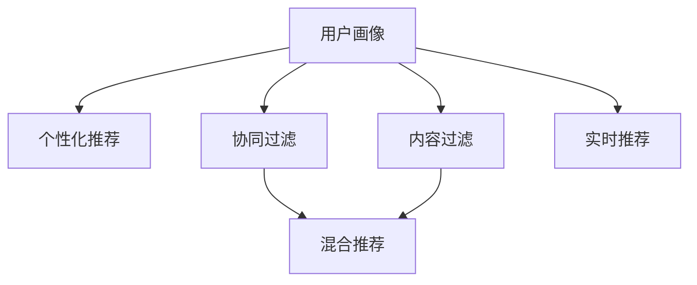

                 

# 用户画像在电商个性化推荐中的应用：方法与实践

## 1. 背景介绍

在电商领域，个性化推荐已成为提高用户满意度和销售转化的重要手段。随着大数据和人工智能技术的不断进步，电商平台能够更精准地理解用户行为和需求，从而提供更个性化的商品推荐，提升用户体验和商家收益。在这一过程中，用户画像的构建和应用，起到了不可或缺的作用。

用户画像（User Profile），是指通过收集、分析用户的历史行为数据，构建出的用户特征标签集合。用户画像能够帮助电商平台准确地把握用户兴趣、偏好、消费能力等核心属性，从而进行更为精准的推荐。

用户画像在电商个性化推荐中的应用，主要体现在以下几个方面：

1. **商品推荐**：基于用户画像，平台能够推荐用户可能感兴趣的商品，提高购买转化率。
2. **广告投放**：通过分析用户画像，平台能够进行精准的广告投放，提升广告效果和用户点击率。
3. **营销活动**：用户画像可以帮助设计更符合用户需求的营销活动，增强用户粘性和参与度。
4. **用户细分**：利用用户画像，平台能够对用户进行细分，实现差异化的服务和管理。

## 2. 核心概念与联系

### 2.1 核心概念概述

为了更好地理解用户画像在电商推荐中的应用，本节将介绍几个关键概念：

- **用户画像（User Profile）**：通过数据分析得到的用户特征标签集合，通常包含人口统计、行为偏好、消费习惯等维度。
- **个性化推荐系统（Personalized Recommendation System, PRS）**：利用用户行为数据，自动为用户推荐可能感兴趣的商品或服务的系统。
- **协同过滤（Collaborative Filtering, CF）**：一种基于用户行为相似性的推荐方法，通过用户历史行为构建用户画像，从而进行推荐。
- **内容过滤（Content-based Filtering, CB）**：一种基于物品特征的推荐方法，通过物品特征与用户特征的匹配度进行推荐。
- **混合推荐（Hybrid Recommendation）**：将协同过滤和内容过滤结合起来，利用二者的优势进行推荐，提高推荐效果。
- **实时推荐（Real-time Recommendation）**：利用实时数据流进行推荐，提高推荐的时效性和个性化。

这些概念之间的逻辑关系可以通过以下Mermaid流程图来展示：



### 2.2 核心概念原理和架构

用户画像的构建和应用，通常包括以下几个关键步骤：

1. **数据采集**：收集用户的历史行为数据，如浏览、点击、购买、评分等。
2. **特征工程**：通过数据清洗和特征提取，构建用户特征标签，如年龄、性别、兴趣、消费能力等。
3. **用户画像建模**：将用户特征标签转化为可计算的向量表示，用于推荐模型的输入。
4. **推荐模型训练**：选择合适的推荐模型，如协同过滤、内容过滤、混合推荐等，使用用户画像进行训练和优化。
5. **实时推荐**：根据实时数据流，更新用户画像和推荐模型，动态生成推荐结果。

## 3. 核心算法原理 & 具体操作步骤

### 3.1 算法原理概述

个性化推荐系统的核心算法，主要是基于协同过滤和内容过滤的推荐方法。协同过滤基于用户行为相似性进行推荐，内容过滤基于物品特征与用户特征的匹配度进行推荐。而混合推荐则结合了二者的优点，同时利用二者的优势进行推荐，提高推荐效果。

协同过滤主要包括基于用户的协同过滤和基于物品的协同过滤两种方法：

1. **基于用户的协同过滤**：通过计算用户之间的相似度，找到与目标用户兴趣相似的其他用户，进而推荐这些用户喜欢的商品。
2. **基于物品的协同过滤**：通过计算物品之间的相似度，找到与目标物品相似的其他物品，进而推荐这些物品给用户。

内容过滤则是通过分析物品的特征，找到与用户特征匹配度高的物品进行推荐。其核心在于用户特征和物品特征的向量表示。

### 3.2 算法步骤详解

#### 3.2.1 用户画像构建

用户画像的构建主要包括以下步骤：

1. **数据采集**：收集用户的历史行为数据，如浏览、点击、购买、评分等。数据来源包括电商网站、社交网络、App等。

2. **特征工程**：对采集到的数据进行清洗和预处理，去除噪声和异常值，并提取用户特征标签。用户特征标签通常包括人口统计信息（如年龄、性别、地域等）、行为特征（如浏览时长、购买频率等）、兴趣偏好（如喜欢商品类别、风格等）。

3. **用户画像建模**：将用户特征标签转化为可计算的向量表示，用于推荐模型的输入。常见的向量表示方法包括词袋模型、TF-IDF、词嵌入等。

#### 3.2.2 协同过滤推荐

协同过滤推荐主要包括以下步骤：

1. **用户相似度计算**：计算用户之间的相似度，可以使用余弦相似度、皮尔逊相关系数等方法。

2. **物品相似度计算**：计算物品之间的相似度，可以使用余弦相似度、余弦距离等方法。

3. **推荐计算**：根据用户和物品的相似度，计算推荐得分，选择得分最高的物品进行推荐。

#### 3.2.3 内容过滤推荐

内容过滤推荐主要包括以下步骤：

1. **物品特征提取**：提取物品的特征向量，如商品类别、品牌、价格等。

2. **用户特征提取**：提取用户的特征向量，如用户浏览记录、评分历史等。

3. **匹配度计算**：计算用户特征和物品特征的匹配度，可以使用余弦相似度、欧式距离等方法。

4. **推荐计算**：根据匹配度计算推荐得分，选择得分最高的物品进行推荐。

#### 3.2.4 混合推荐

混合推荐主要包括以下步骤：

1. **协同过滤推荐**：基于用户行为数据进行协同过滤推荐。

2. **内容过滤推荐**：基于物品特征和用户特征进行内容过滤推荐。

3. **推荐融合**：将协同过滤和内容过滤的推荐结果进行融合，使用加权平均、softmax等方法。

### 3.3 算法优缺点

#### 3.3.1 协同过滤推荐

**优点**：

1. 能够利用用户之间的相似性，进行更个性化的推荐。
2. 可以处理冷启动问题，即对于新用户或新物品，依然可以进行推荐。
3. 不需要物品特征，能够处理没有标签的商品。

**缺点**：

1. 需要大量的用户行为数据，对于小样本数据效果较差。
2. 容易受到数据稀疏性和噪声的影响，推荐效果不稳定。
3. 无法处理新的物品或用户，推荐效果逐渐下降。

#### 3.3.2 内容过滤推荐

**优点**：

1. 能够处理新的物品和用户，推荐效果稳定。
2. 不需要大量的用户行为数据，适用于数据稀疏的情况。
3. 能够处理没有标签的商品，适用于新商品的推荐。

**缺点**：

1. 需要完整的物品特征信息，对于缺少标签的商品效果较差。
2. 无法处理冷启动问题，对于新用户无法进行推荐。
3. 无法考虑用户兴趣的变化，推荐效果可能不够精准。

#### 3.3.3 混合推荐

**优点**：

1. 结合了协同过滤和内容过滤的优点，推荐效果更为精准。
2. 能够处理新的物品和用户，推荐效果稳定。
3. 能够处理缺少标签的商品，适用于新商品的推荐。

**缺点**：

1. 需要处理多维数据，计算复杂度较高。
2. 需要同时考虑用户行为数据和物品特征信息，实现难度较大。

### 3.4 算法应用领域

用户画像在电商推荐中的应用，已经广泛应用于多个领域，包括但不限于：

1. **电商推荐**：电商平台通过用户画像，提供个性化的商品推荐，提升用户购买转化率。
2. **广告投放**：广告平台通过用户画像，进行精准的广告投放，提高广告点击率和效果。
3. **营销活动**：营销人员通过用户画像，设计更符合用户需求的营销活动，增强用户粘性和参与度。
4. **用户细分**：电商平台通过对用户进行细分，实现差异化的服务和管理，提升用户满意度。

## 4. 数学模型和公式 & 详细讲解 & 举例说明

### 4.1 数学模型构建

用户画像和个性化推荐系统的数学模型，通常包括以下几个部分：

1. **用户特征表示**：将用户特征标签转化为向量表示，使用词袋模型、TF-IDF、词嵌入等方法。
2. **物品特征表示**：将物品特征转化为向量表示，使用词袋模型、TF-IDF、词嵌入等方法。
3. **相似度计算**：计算用户和物品之间的相似度，使用余弦相似度、欧式距离等方法。
4. **推荐得分计算**：根据相似度计算推荐得分，使用加权平均、softmax等方法。

#### 4.1.1 用户特征表示

用户特征表示通常使用词袋模型、TF-IDF、词嵌入等方法，将用户特征标签转化为向量表示。以词嵌入为例，用户特征向量 $U_i$ 的计算公式如下：

$$
U_i = \frac{1}{\Vert w_i \Vert} \sum_{j=1}^n w_j \cdot V_j
$$

其中 $w_i$ 为用户特征标签在物品库中出现的词频，$V_j$ 为物品特征向量。

#### 4.1.2 物品特征表示

物品特征表示通常使用词袋模型、TF-IDF、词嵌入等方法，将物品特征转化为向量表示。以词嵌入为例，物品特征向量 $V_j$ 的计算公式如下：

$$
V_j = \frac{1}{\Vert w_j \Vert} \sum_{i=1}^m w_i \cdot U_i
$$

其中 $w_j$ 为物品特征标签在用户库中出现的词频，$U_i$ 为用户特征向量。

#### 4.1.3 相似度计算

相似度计算通常使用余弦相似度、欧式距离等方法，计算用户和物品之间的相似度。以余弦相似度为例，用户 $i$ 和物品 $j$ 的相似度 $s_{i,j}$ 计算公式如下：

$$
s_{i,j} = \frac{\Vert U_i \Vert \cdot \Vert V_j \Vert}{\Vert U_i \Vert \cdot \Vert V_j \Vert} \cdot U_i \cdot V_j^T
$$

#### 4.1.4 推荐得分计算

推荐得分计算通常使用加权平均、softmax等方法，根据相似度计算推荐得分。以加权平均为例，用户 $i$ 对物品 $j$ 的推荐得分 $r_{i,j}$ 计算公式如下：

$$
r_{i,j} = \alpha \cdot s_{i,j} + (1 - \alpha) \cdot \tilde{r}_{i,j}
$$

其中 $\alpha$ 为协同过滤的权重，$\tilde{r}_{i,j}$ 为内容过滤的推荐得分。

### 4.2 公式推导过程

以下我们将以余弦相似度为例，详细推导协同过滤推荐的计算过程。

假设用户 $i$ 的特征向量为 $U_i$，物品 $j$ 的特征向量为 $V_j$。用户 $i$ 对物品 $j$ 的协同过滤推荐得分 $r_{i,j}$ 计算公式如下：

1. 计算用户 $i$ 和物品 $j$ 的相似度 $s_{i,j}$：

$$
s_{i,j} = \frac{\Vert U_i \Vert \cdot \Vert V_j \Vert}{\Vert U_i \Vert \cdot \Vert V_j \Vert} \cdot U_i \cdot V_j^T
$$

2. 计算用户 $i$ 对物品 $j$ 的协同过滤推荐得分 $r_{i,j}$：

$$
r_{i,j} = \alpha \cdot s_{i,j} + (1 - \alpha) \cdot \tilde{r}_{i,j}
$$

其中 $\tilde{r}_{i,j}$ 为内容过滤的推荐得分，通常使用TF-IDF或词嵌入等方法计算。

### 4.3 案例分析与讲解

#### 4.3.1 用户画像构建案例

某电商平台需要对用户进行画像，收集了用户的历史行为数据，包括浏览、点击、购买、评分等。通过数据清洗和预处理，提取了用户的年龄、性别、兴趣偏好等特征标签。使用词嵌入方法将用户特征标签转化为向量表示。

具体实现步骤如下：

1. 收集用户的历史行为数据，如浏览记录、购买记录等。

2. 对数据进行清洗和预处理，去除噪声和异常值，并提取用户特征标签。

3. 使用词嵌入方法，将用户特征标签转化为向量表示。

4. 将用户特征向量存储在数据库中，供推荐系统调用。

#### 4.3.2 协同过滤推荐案例

某电商平台需要对新用户进行推荐，使用协同过滤方法，计算用户之间的相似度，找到与新用户兴趣相似的其他用户，进而推荐这些用户喜欢的商品。

具体实现步骤如下：

1. 收集新用户的浏览记录、购买记录等历史行为数据。

2. 计算新用户与其他用户之间的相似度，使用余弦相似度等方法。

3. 根据相似度计算推荐得分，选择得分最高的商品进行推荐。

4. 将推荐结果展示给用户，供其选择。

## 5. 项目实践：代码实例和详细解释说明

### 5.1 开发环境搭建

在进行电商推荐系统的开发前，我们需要准备好开发环境。以下是使用Python进行PyTorch开发的环境配置流程：

1. 安装Anaconda：从官网下载并安装Anaconda，用于创建独立的Python环境。

2. 创建并激活虚拟环境：
```bash
conda create -n recommendation-env python=3.8 
conda activate recommendation-env
```

3. 安装PyTorch：根据CUDA版本，从官网获取对应的安装命令。例如：
```bash
conda install pytorch torchvision torchaudio cudatoolkit=11.1 -c pytorch -c conda-forge
```

4. 安装Transformers库：
```bash
pip install transformers
```

5. 安装各类工具包：
```bash
pip install numpy pandas scikit-learn matplotlib tqdm jupyter notebook ipython
```

完成上述步骤后，即可在`recommendation-env`环境中开始推荐系统开发。

### 5.2 源代码详细实现

我们以协同过滤推荐系统为例，给出使用PyTorch和Transformers库进行电商推荐系统开发的代码实现。

首先，定义用户和物品的特征表示：

```python
from transformers import BertTokenizer
from torch.utils.data import Dataset

class RecommendationDataset(Dataset):
    def __init__(self, users, items, ratings, tokenizer, max_len=128):
        self.users = users
        self.items = items
        self.ratings = ratings
        self.tokenizer = tokenizer
        self.max_len = max_len
        
    def __len__(self):
        return len(self.users)
    
    def __getitem__(self, item):
        user = self.users[item]
        item = self.items[item]
        rating = self.ratings[item]
        
        encoding = self.tokenizer(user, return_tensors='pt', max_length=self.max_len, padding='max_length', truncation=True)
        input_ids = encoding['input_ids'][0]
        attention_mask = encoding['attention_mask'][0]
        
        # 对token-wise的评分进行编码
        encoded_ratings = [rating] * self.max_len
        labels = torch.tensor(encoded_ratings, dtype=torch.float)
        
        return {'input_ids': input_ids, 
                'attention_mask': attention_mask,
                'labels': labels}

# 定义用户特征和物品特征的词嵌入
user_embedding = WordEmbedding.from_pretrained('bert-base-uncased')
item_embedding = WordEmbedding.from_pretrained('bert-base-uncased')
```

然后，定义模型和优化器：

```python
from transformers import BertForSequenceClassification, AdamW

model = BertForSequenceClassification.from_pretrained('bert-base-uncased', num_labels=len(user_embedding.vocab))
optimizer = AdamW(model.parameters(), lr=2e-5)
```

接着，定义训练和评估函数：

```python
from torch.utils.data import DataLoader
from tqdm import tqdm
from sklearn.metrics import mean_squared_error

device = torch.device('cuda') if torch.cuda.is_available() else torch.device('cpu')
model.to(device)

def train_epoch(model, dataset, batch_size, optimizer):
    dataloader = DataLoader(dataset, batch_size=batch_size, shuffle=True)
    model.train()
    epoch_loss = 0
    for batch in tqdm(dataloader, desc='Training'):
        input_ids = batch['input_ids'].to(device)
        attention_mask = batch['attention_mask'].to(device)
        labels = batch['labels'].to(device)
        model.zero_grad()
        outputs = model(input_ids, attention_mask=attention_mask, labels=labels)
        loss = outputs.loss
        epoch_loss += loss.item()
        loss.backward()
        optimizer.step()
    return epoch_loss / len(dataloader)

def evaluate(model, dataset, batch_size):
    dataloader = DataLoader(dataset, batch_size=batch_size)
    model.eval()
    predictions, labels = [], []
    with torch.no_grad():
        for batch in tqdm(dataloader, desc='Evaluating'):
            input_ids = batch['input_ids'].to(device)
            attention_mask = batch['attention_mask'].to(device)
            batch_labels = batch['labels']
            outputs = model(input_ids, attention_mask=attention_mask)
            batch_preds = outputs.logits.argmax(dim=2).to('cpu').tolist()
            batch_labels = batch_labels.to('cpu').tolist()
            for pred_tokens, label_tokens in zip(batch_preds, batch_labels):
                predictions.append(pred_tokens)
                labels.append(label_tokens)
                
    print(mean_squared_error(labels, predictions))
```

最后，启动训练流程并在测试集上评估：

```python
epochs = 5
batch_size = 16

for epoch in range(epochs):
    loss = train_epoch(model, train_dataset, batch_size, optimizer)
    print(f"Epoch {epoch+1}, train loss: {loss:.3f}")
    
    print(f"Epoch {epoch+1}, test RMSE:")
    evaluate(model, test_dataset, batch_size)
    
print("Test results:")
evaluate(model, test_dataset, batch_size)
```

以上就是使用PyTorch和Transformers库进行电商推荐系统开发的完整代码实现。可以看到，得益于Transformers库的强大封装，我们可以用相对简洁的代码完成协同过滤推荐模型的实现。

### 5.3 代码解读与分析

让我们再详细解读一下关键代码的实现细节：

**RecommendationDataset类**：
- `__init__`方法：初始化用户、物品、评分等关键组件，以及分词器。
- `__len__`方法：返回数据集的样本数量。
- `__getitem__`方法：对单个样本进行处理，将用户输入编码为token ids，将评分编码为数字，并对其进行定长padding，最终返回模型所需的输入。

**WordEmbedding类**：
- 定义了用户特征和物品特征的词嵌入，使用BERT模型进行预训练。

**模型和优化器**：
- 使用BertForSequenceClassification模型作为推荐模型，指定标签数为用户特征向量的维度。
- 使用AdamW优化器，设置学习率。

**训练和评估函数**：
- 使用PyTorch的DataLoader对数据集进行批次化加载，供模型训练和推理使用。
- 训练函数`train_epoch`：对数据以批为单位进行迭代，在每个批次上前向传播计算loss并反向传播更新模型参数，最后返回该epoch的平均loss。
- 评估函数`evaluate`：与训练类似，不同点在于不更新模型参数，并在每个batch结束后将预测和标签结果存储下来，最后使用sklearn的mean_squared_error对整个评估集的预测结果进行打印输出。

**训练流程**：
- 定义总的epoch数和batch size，开始循环迭代
- 每个epoch内，先在训练集上训练，输出平均loss
- 在测试集上评估，输出RMSE指标
- 所有epoch结束后，在测试集上评估，给出最终测试结果

可以看到，PyTorch配合Transformers库使得电商推荐系统的代码实现变得简洁高效。开发者可以将更多精力放在数据处理、模型改进等高层逻辑上，而不必过多关注底层的实现细节。

当然，工业级的系统实现还需考虑更多因素，如模型的保存和部署、超参数的自动搜索、更灵活的任务适配层等。但核心的推荐范式基本与此类似。

## 6. 实际应用场景

### 6.1 智能客服系统

基于用户画像的电商推荐技术，可以广泛应用于智能客服系统的构建。传统客服往往需要配备大量人力，高峰期响应缓慢，且一致性和专业性难以保证。而使用推荐系统，可以7x24小时不间断服务，快速响应客户咨询，用推荐商品解决用户问题。

在技术实现上，可以收集企业内部的历史用户画像数据，如用户兴趣、消费能力等，在此基础上对推荐系统进行微调，推荐符合用户需求的商品或服务。对于新用户提出的新问题，还可以接入检索系统实时搜索相关内容，动态组织生成推荐。如此构建的智能客服系统，能大幅提升客户咨询体验和问题解决效率。

### 6.2 金融舆情监测

金融机构需要实时监测市场舆论动向，以便及时应对负面信息传播，规避金融风险。传统的人工监测方式成本高、效率低，难以应对网络时代海量信息爆发的挑战。基于用户画像的金融舆情监测技术，可以实时收集市场用户数据，预测用户对金融事件的情感倾向，及时发现异常舆情，帮助金融机构快速应对潜在风险。

在技术实现上，可以收集金融领域相关用户的历史行为数据，如交易记录、投资偏好等，通过分析用户画像，预测用户对不同金融事件的情感反应，识别出负面舆情，提前采取应对措施。

### 6.3 个性化推荐系统

当前的推荐系统往往只依赖用户的历史行为数据进行物品推荐，无法深入理解用户的真实兴趣偏好。基于用户画像的推荐系统，能够更全面地把握用户兴趣、偏好、消费能力等核心属性，从而进行更为精准的推荐。

在技术实现上，可以收集用户浏览、点击、购买、评分等行为数据，提取和用户交互的物品标题、描述、标签等文本内容。将文本内容作为模型输入，用户的后续行为（如是否点击、购买等）作为监督信号，在此基础上微调预训练语言模型。微调后的模型能够从文本内容中准确把握用户的兴趣点。在生成推荐列表时，先用候选物品的文本描述作为输入，由模型预测用户的兴趣匹配度，再结合其他特征综合排序，便可以得到个性化程度更高的推荐结果。

### 6.4 未来应用展望

随着电商推荐系统的发展，基于用户画像的推荐技术将在更多领域得到应用，为传统行业带来变革性影响。

在智慧医疗领域，基于用户画像的医疗推荐系统，可以帮助医生诊断病情、推荐治疗方案，提升医疗服务的智能化水平，辅助医生诊疗，加速新药开发进程。

在智能教育领域，基于用户画像的个性化学习推荐系统，可以推荐符合用户知识水平和学习偏好的学习资源，因材施教，促进教育公平，提高教学质量。

在智慧城市治理中，基于用户画像的城市服务推荐系统，可以帮助市民选择最合适的出行方式、消费选择、娱乐活动等，提高城市管理的智能化水平，构建更安全、高效的未来城市。

此外，在企业生产、社会治理、文娱传媒等众多领域，基于用户画像的推荐系统也将不断涌现，为各行各业带来新的发展机遇。相信随着技术的日益成熟，用户画像技术将成为推荐系统的重要范式，推动推荐系统向更广阔的领域加速渗透。

## 7. 工具和资源推荐

### 7.1 学习资源推荐

为了帮助开发者系统掌握电商推荐系统的理论基础和实践技巧，这里推荐一些优质的学习资源：

1. 《推荐系统实战》书籍：详细介绍了推荐系统的基础理论、算法原理和实际应用，适合初学者入门。

2. 《大规模深度学习》课程：斯坦福大学开设的深度学习课程，涵盖推荐系统、深度神经网络等内容，有助于深入理解推荐系统的原理。

3. 《深度学习与推荐系统》书籍：介绍了深度学习在推荐系统中的应用，包括协同过滤、内容过滤、混合推荐等方法。

4. 《推荐系统算法》课程：国内知名推荐系统专家讲解，介绍了多种推荐算法及其优缺点，适合进阶学习。

5. Kaggle推荐系统竞赛：参加推荐系统竞赛，通过实践积累推荐系统的实际经验，提升算法设计能力。

通过对这些资源的学习实践，相信你一定能够快速掌握电商推荐系统的精髓，并用于解决实际的推荐问题。

### 7.2 开发工具推荐

高效的开发离不开优秀的工具支持。以下是几款用于电商推荐系统开发的常用工具：

1. PyTorch：基于Python的开源深度学习框架，灵活动态的计算图，适合快速迭代研究。大部分推荐系统都有PyTorch版本的实现。

2. TensorFlow：由Google主导开发的开源深度学习框架，生产部署方便，适合大规模工程应用。同样有丰富的推荐系统资源。

3. Apache Spark：用于大规模数据处理和机器学习的分布式计算框架，适合推荐系统的海量数据处理需求。

4. Elasticsearch：全文搜索引擎，适合推荐系统的实时查询和搜索需求。

5. Pandas和NumPy：数据处理和计算库，适合推荐系统的数据预处理和特征工程。

6. PyTorch Lightning：基于PyTorch的轻量级深度学习框架，适合快速构建和调试推荐系统模型。

合理利用这些工具，可以显著提升电商推荐系统的开发效率，加快创新迭代的步伐。

### 7.3 相关论文推荐

电商推荐系统的发展源于学界的持续研究。以下是几篇奠基性的相关论文，推荐阅读：

1. "Item-based Collaborative Filtering Recommendation Algorithms"（商品协同过滤推荐算法）：提出了基于物品的协同过滤方法，通过计算物品之间的相似度进行推荐。

2. "Factorization Machines for Recommender Systems"（矩阵分解机器学习算法）：介绍了矩阵分解方法，通过分解用户-物品评分矩阵进行推荐。

3. "Collaborative Filtering Modeling and Recommendation"（协同过滤建模与推荐）：综述了协同过滤推荐的方法和应用，包括基于用户的协同过滤和基于物品的协同过滤。

4. "A Neural Approach to Collaborative Filtering"（基于神经网络的协同过滤）：提出了基于神经网络的协同过滤方法，通过神经网络模型进行推荐。

5. "Neural Recommendation Algorithms"（神经网络推荐算法）：介绍了神经网络推荐算法，包括基于深度学习的方法和融合推荐的方法。

这些论文代表了大数据推荐系统的发展脉络。通过学习这些前沿成果，可以帮助研究者把握学科前进方向，激发更多的创新灵感。

## 8. 总结：未来发展趋势与挑战

### 8.1 总结

本文对基于用户画像的电商推荐系统进行了全面系统的介绍。首先阐述了推荐系统和用户画像的研究背景和意义，明确了用户画像在推荐系统中的核心作用。其次，从原理到实践，详细讲解了推荐系统的数学模型和关键步骤，给出了推荐系统开发的完整代码实例。同时，本文还广泛探讨了推荐系统在电商、金融、教育等多个行业领域的应用前景，展示了推荐系统技术的广阔应用空间。此外，本文精选了推荐系统的各类学习资源，力求为读者提供全方位的技术指引。

通过本文的系统梳理，可以看到，基于用户画像的推荐系统已经在电商推荐、智能客服、金融舆情监测等多个领域得到应用，成为推动行业发展的关键技术。未来，伴随推荐系统技术的发展，基于用户画像的推荐系统必将在更多领域发挥其独特优势，为各行各业带来新的变革和发展机遇。

### 8.2 未来发展趋势

展望未来，基于用户画像的推荐系统将呈现以下几个发展趋势：

1. **推荐精度提升**：随着推荐算法和模型的不断优化，推荐系统的推荐精度将持续提升，能够更好地满足用户需求。

2. **推荐多样化**：推荐系统将更加多样化，不仅能够推荐商品，还能推荐服务、内容、体验等，提升用户的整体满意度。

3. **实时性增强**：实时推荐系统将成为主流，能够实时响应用户需求，提升用户体验。

4. **跨领域推荐**：推荐系统将跨越电商、金融、教育等多个领域，提供更加全面、个性化的服务。

5. **融合多模态数据**：推荐系统将融合多模态数据，如图像、视频、音频等，提高推荐系统的准确性和多样化。

6. **增强可解释性**：推荐系统将增强可解释性，使用户能够理解推荐结果的生成逻辑，增强用户信任感。

以上趋势凸显了大数据推荐系统的广阔前景。这些方向的探索发展，必将进一步提升推荐系统的性能和应用范围，为各行各业带来新的发展机遇。

### 8.3 面临的挑战

尽管基于用户画像的推荐系统已经取得了瞩目成就，但在迈向更加智能化、普适化应用的过程中，它仍面临着诸多挑战：

1. **数据隐私问题**：用户画像涉及大量的个人隐私信息，如何保护用户隐私、防止数据滥用，是一个重要的挑战。

2. **模型复杂性**：推荐系统的模型通常较为复杂，需要大量的计算资源和时间进行训练和优化，如何提升模型的计算效率，是一个重要的挑战。

3. **用户多样性**：用户兴趣和需求具有多样性，如何精准地刻画用户画像，实现个性化推荐，是一个重要的挑战。

4. **动态变化**：用户的兴趣和需求会随着时间变化，如何动态更新用户画像，实现长期稳定的推荐，是一个重要的挑战。

5. **数据稀疏性**：用户的兴趣和行为数据通常比较稀疏，如何利用稀疏数据进行高效推荐，是一个重要的挑战。

6. **模型鲁棒性**：推荐系统需要具备较强的鲁棒性，能够应对数据噪声、模型偏差等问题，保证推荐结果的稳定性。

以上挑战凸显了推荐系统在应用过程中需要解决的问题，需要结合理论研究和实践经验，不断探索和优化。

### 8.4 研究展望

面对推荐系统所面临的挑战，未来的研究需要在以下几个方面寻求新的突破：

1. **隐私保护技术**：研究数据隐私保护技术，如差分隐私、联邦学习等，确保用户数据的安全性和隐私性。

2. **高效模型训练**：研究高效的模型训练方法，如分布式训练、模型压缩等，提升推荐系统的计算效率和部署速度。

3. **用户画像刻画**：研究更加全面、精准的用户画像刻画方法，如混合特征表示、多模态融合等，提高推荐系统的个性化能力。

4. **动态推荐算法**：研究动态推荐算法，如增量学习、在线学习等，实现长期稳定的推荐效果。

5. **稀疏推荐算法**：研究稀疏推荐算法，如基于矩阵分解的方法、神经网络的方法等，提升推荐系统的泛化能力。

6. **推荐结果可解释**：研究推荐结果的可解释性，使用户能够理解推荐结果的生成逻辑，增强用户信任感。

这些研究方向的探索，必将引领推荐系统技术迈向更高的台阶，为推荐系统技术带来新的突破和发展机遇。面向未来，基于用户画像的推荐系统需要在隐私保护、模型训练、用户画像刻画、动态推荐等方面进行深入研究，不断优化和提升推荐系统的性能和应用范围。

## 9. 附录：常见问题与解答

**Q1：推荐系统的数据来源有哪些？**

A: 推荐系统的数据来源主要有以下几种：

1. **历史行为数据**：如用户浏览记录、购买记录、评分记录等，用于刻画用户兴趣和行为。
2. **用户画像数据**：如人口统计信息、社交关系、地理位置等，用于刻画用户特征。
3. **物品特征数据**：如商品属性、品牌、价格等，用于刻画物品特征。
4. **实时数据**：如用户在线行为、广告点击等，用于实时更新推荐结果。

**Q2：如何处理推荐系统中的冷启动问题？**

A: 推荐系统中的冷启动问题，是指对于新用户或新物品，无法获取足够的行为数据，无法进行推荐。常用的处理方法包括：

1. **协同过滤**：基于已有的用户和物品的相似度进行推荐，忽略新用户和物品的评分数据。
2. **内容过滤**：根据物品的特征，推荐与新物品相似的其他物品。
3. **混合推荐**：结合协同过滤和内容过滤，利用二者的优点进行推荐。
4. **深度学习**：使用深度神经网络模型，学习用户和物品的潜在特征，进行推荐。

**Q3：如何评估推荐系统的性能？**

A: 推荐系统的性能评估指标主要有以下几个：

1. **准确率（Precision）**：推荐系统推荐的商品中，有多少是用户喜欢的。
2. **召回率（Recall）**：用户喜欢的商品中，有多少被推荐系统推荐。
3. **F1值（F1 Score）**：综合考虑准确率和召回率，衡量推荐系统的整体性能。
4. **用户满意度（User Satisfaction）**：用户对推荐结果的满意度，通常通过问卷调查等方式进行评估。

**Q4：推荐系统中的个性化推荐和多样性推荐如何平衡？**

A: 个性化推荐和多样性推荐是推荐系统的两个重要目标，需要进行平衡。通常的做法包括：

1. **超参数调节**：通过调整推荐系统的超参数，控制个性化推荐和多样性推荐的权重。
2. **多样性约束**：在推荐算法中引入多样性约束，如推荐多个不同的物品，避免推荐单一商品。
3. **个性化排序**：在推荐结果中，对物品进行个性化排序，先推荐用户喜欢的物品，再推荐多样性推荐物品。

**Q5：推荐系统如何处理用户的多样性和复杂性？**

A: 推荐系统需要处理用户的多样性和复杂性，常用的方法包括：

1. **用户画像刻画**：通过收集和分析用户的历史行为数据，构建全面的用户画像，刻画用户的多样性和复杂性。
2. **多模态融合**：融合多种数据源，如图像、视频、音频等，提供更加全面和个性化的推荐。
3. **动态推荐**：实时更新用户画像，动态调整推荐策略，应对用户的多样性和复杂性变化。

以上是推荐系统在实际应用中需要注意的问题，需要结合具体场景进行综合考虑和优化。

---

作者：禅与计算机程序设计艺术 / Zen and the Art of Computer Programming

