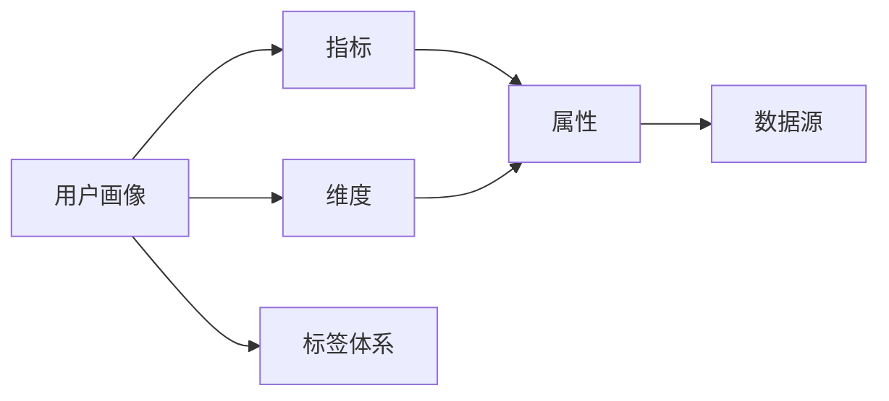

                 

# 用户画像的标签体系设计

在数字时代，用户画像（User Profile）成为企业理解用户需求、指导产品设计和运营的重要工具。用户画像通过收集用户数据，提炼出用户的核心属性、行为习惯和心理特征，帮助企业实现个性化服务、精准营销和决策优化。然而，构建一个全面、准确、高效的用户画像，首先需要设计一套合理有效的标签体系。本文将详细探讨用户画像标签体系的设计原理、操作步骤和实际应用，为业界提供有深度有思考有见解的专业IT领域技术指引。

## 1. 背景介绍

### 1.1 问题由来
随着互联网的发展，用户数据体量呈指数级增长，如何从海量数据中提炼出对业务有价值的用户信息，成为企业面临的重要问题。传统的方式包括问卷调查、面对面访谈等，但这些方法耗时耗力且覆盖范围有限。随着数据技术和机器学习的发展，通过对用户行为数据、社交网络数据、交易数据等进行数据挖掘和分析，构建用户画像成为可能。用户画像能够反映用户行为的规律和模式，帮助企业制定有针对性的营销策略，提升用户满意度和转化率。

### 1.2 问题核心关键点
用户画像的构建离不开合理的标签体系。标签体系定义了用户画像的维度、指标和属性，决定了用户画像的全面性和准确性。然而，在构建标签体系时，存在诸多关键问题：
1. **标签维度选择**：如何选择最相关的维度，避免遗漏重要信息或冗余维度？
2. **标签指标设计**：如何量化和衡量各维度的用户特征，确保数据的可比性和可用性？
3. **标签属性定义**：如何定义各维度的属性，使之能够被机器自动处理和分析？
4. **标签体系优化**：如何根据业务需求和用户行为变化，动态调整标签体系？

### 1.3 问题研究意义
设计一套合理有效的用户画像标签体系，对于提升企业数据利用效率、增强用户体验、驱动业务增长具有重要意义：
1. **提升数据利用效率**：通过精确定义的标签体系，能够有效筛选和整合用户数据，提升数据处理和分析效率。
2. **增强用户体验**：全面准确的用户画像，能够帮助企业更好地理解用户需求和行为，提供更加个性化和符合预期的服务。
3. **驱动业务增长**：精准的营销策略和运营决策，能够提升用户转化率和品牌忠诚度，驱动企业业务增长。

## 2. 核心概念与联系

### 2.1 核心概念概述

在讨论用户画像标签体系的设计之前，首先需要理解以下核心概念：

- **用户画像（User Profile）**：描述用户核心属性、行为习惯和心理特征的虚拟形象。用户画像通常由多个维度的标签组成，反映用户的多方面特征。
- **标签体系（Tagging System）**：定义用户画像维度、指标和属性的规则体系。标签体系是构建用户画像的基础，直接影响画像的全面性和准确性。
- **维度（Dimension）**：用户画像的不同方面，如人口统计学、行为、偏好等。
- **指标（Metric）**：衡量用户画像中各维度特征的具体数值或属性。
- **属性（Attribute）**：描述用户特征的详细信息，如年龄、性别、购买频率等。

这些核心概念之间的联系可以用以下Mermaid流程图表示：



这个流程图展示用户画像与标签体系的关系：用户画像由多个维度构成，每个维度包含多个指标，每个指标由多个属性描述，这些属性和指标的数据来源于不同来源。

## 3. 核心算法原理 & 具体操作步骤

### 3.1 算法原理概述

用户画像标签体系的设计，本质上是一个多目标优化问题。目标是在保证画像全面性的同时，避免冗余维度，提高数据质量和处理效率。该问题通常通过以下步骤解决：

1. **维度选择**：选择与业务目标最相关的维度，确保画像覆盖关键特征。
2. **指标量化**：定义每个维度的具体指标，并设计量化方式。
3. **属性定义**：对每个指标进行属性细分，并确定数据来源。
4. **数据整合**：将不同来源的数据整合到标签体系中，进行数据清洗和处理。
5. **体系优化**：根据业务需求和用户行为变化，动态调整标签体系。

### 3.2 算法步骤详解

**Step 1: 业务目标明确**
- 明确企业希望通过用户画像实现的具体业务目标，如提高转化率、提升客户满意度等。
- 了解目标用户群体的特征，包括年龄、性别、职业、兴趣等。

**Step 2: 维度选择**
- 根据业务目标，选择与目标用户群体最相关的维度。常见维度包括：
  - 人口统计学：年龄、性别、职业、教育程度等。
  - 行为特征：浏览历史、购买记录、互动频率等。
  - 偏好和兴趣：兴趣标签、偏好类型等。
  - 心理特征：性格类型、消费动机等。
- 使用问卷调查、用户访谈等方式收集专家意见，综合考虑业务需求和数据可行性，选择最相关的维度。

**Step 3: 指标量化**
- 对每个维度设计具体的指标，如年龄、性别等直接量化的指标，浏览历史、购买记录等行为指标。
- 量化方式需确保数据具有可比性和可用性，常用的量化方法包括：
  - 比例和百分比：计算不同属性的分布比例，反映用户群体的多样性。
  - 平均值和标准差：衡量用户行为的平均水平和波动性。
  - 频率和计数：统计用户行为发生的次数或频率，反映用户活跃度。

**Step 4: 属性定义**
- 对每个指标进行属性细分，确保标签体系能够反映用户的多方面特征。如对年龄维度，可以细分为年龄段、生日、出生城市等属性。
- 定义属性时需要考虑数据获取和处理的难易程度，尽可能使用可自动获取的数据，减少手动输入的误差。

**Step 5: 数据整合**
- 将不同来源的数据整合到标签体系中，如用户的浏览记录、购买记录、社交媒体数据等。
- 数据清洗和处理，包括去除重复数据、处理缺失值、标准化数据格式等。
- 选择合适的数据存储方式，如数据库、数据仓库等，确保数据的安全性和可访问性。

**Step 6: 体系优化**
- 定期根据业务需求和用户行为变化，调整和优化标签体系。
- 采用A/B测试等方法，评估不同标签体系的效果，选择最合适的方案。
- 引入机器学习等算法，自动发现新的标签和关系，提升标签体系的适应性。

### 3.3 算法优缺点

用户画像标签体系的设计，具有以下优点：
1. **全面性和准确性**：通过精确定义的维度、指标和属性，能够全面准确地反映用户特征。
2. **数据质量和处理效率**：避免冗余和噪声数据，提高数据处理和分析的效率。
3. **业务适应性**：根据业务需求和用户行为变化，动态调整标签体系，保持画像的及时性和相关性。

同时，该方法也存在一些缺点：
1. **复杂性**：设计和维护一套合理的标签体系，需要较高的技术水平和专业知识。
2. **数据隐私和安全**：用户数据的收集和使用，需遵循隐私保护和数据安全的法律法规。
3. **实时性**：标签体系的动态调整和更新，需要实时获取和处理数据，对数据基础设施和算法能力有较高要求。

### 3.4 算法应用领域

用户画像标签体系的设计，适用于多种NLP和数据分析应用，如：

- 个性化推荐系统：根据用户画像进行个性化推荐，提升用户满意度。
- 广告投放优化：基于用户画像进行精准投放，提高广告效果。
- 客户细分和分析：通过用户画像对客户进行细分，制定差异化营销策略。
- 情感分析与舆情监控：通过用户画像分析用户情感倾向，进行舆情监控。

## 4. 数学模型和公式 & 详细讲解 & 举例说明

### 4.1 数学模型构建

用户画像标签体系的设计，可以通过多目标优化模型进行数学建模。设标签体系包含 $n$ 个维度，每个维度包含 $m$ 个指标，每个指标包含 $k$ 个属性。标签体系的设计目标为最大化画像的全面性和准确性，最小化数据冗余和噪声。

设 $P=\{D_1, D_2, ..., D_n\}$ 为维度集合，$D_i=\{M_{ij}\}_{j=1}^m$ 为维度 $D_i$ 包含的指标集合，$M_{ij}=\{A_{ijk}\}_{k=1}^k$ 为指标 $M_{ij}$ 包含的属性集合。设计目标函数为：

$$
\max \sum_{i=1}^n \sum_{j=1}^m \sum_{k=1}^k f(A_{ijk})
$$

其中 $f(A_{ijk})$ 为属性 $A_{ijk}$ 的权重函数，反映其在画像中的重要性和相关性。

约束条件为：
1. 维度覆盖性：$\sum_{i=1}^n \sum_{j=1}^m 1 \geq C$，其中 $C$ 为预设的维度覆盖阈值。
2. 指标完整性：$\sum_{i=1}^n 1 \geq C'$，其中 $C'$ 为预设的指标完整阈值。
3. 数据质量：$\sum_{i=1}^n \sum_{j=1}^m \sum_{k=1}^k \omega_{ijk} \leq D$，其中 $\omega_{ijk}$ 为属性 $A_{ijk}$ 的数据质量系数。
4. 计算效率：$\sum_{i=1}^n \sum_{j=1}^m \sum_{k=1}^k F(A_{ijk}) \leq T$，其中 $F(A_{ijk})$ 为属性 $A_{ijk}$ 的处理复杂度，$T$ 为预设的处理时间阈值。

### 4.2 公式推导过程

为了简化模型，我们引入两个简化函数 $g(D_i)$ 和 $h(M_{ij})$ 分别表示维度 $D_i$ 和指标 $M_{ij}$ 的重要性和相关性。设计目标函数为：

$$
\max \sum_{i=1}^n g(D_i) + \sum_{i=1}^n \sum_{j=1}^m h(M_{ij})
$$

约束条件为：
1. 维度覆盖性：$\sum_{i=1}^n g(D_i) \geq C$。
2. 指标完整性：$\sum_{i=1}^n h(M_i) \geq C'$。
3. 数据质量：$\sum_{i=1}^n \sum_{j=1}^m \omega_{ij} \leq D$。
4. 计算效率：$\sum_{i=1}^n \sum_{j=1}^m F(M_{ij}) \leq T$。

通过求解上述优化问题，可以确定用户画像的维度、指标和属性，满足业务需求和数据质量要求。

### 4.3 案例分析与讲解

以电商平台的个性化推荐系统为例，分析用户画像标签体系的设计。

**Step 1: 业务目标明确**
- 电商平台的业务目标是通过推荐系统提升用户转化率和销售额。

**Step 2: 维度选择**
- 选择与电商用户相关的维度，如人口统计学、行为特征和偏好等。

**Step 3: 指标量化**
- 定义年龄、性别、购买频率等指标，并设计量化方式。

**Step 4: 属性定义**
- 对年龄维度细分为年龄段、生日等属性，对购买频率维度细分为购买次数、平均订单价值等属性。

**Step 5: 数据整合**
- 将用户的浏览记录、购买记录、社交媒体数据等整合到标签体系中。

**Step 6: 体系优化**
- 根据用户行为变化和反馈，动态调整标签体系，优化推荐算法。

通过以上步骤，电商平台可以构建一个全面、准确的用户画像，实现个性化推荐，提升用户满意度和转化率。

## 5. 项目实践：代码实例和详细解释说明

### 5.1 开发环境搭建

在进行用户画像标签体系设计实践前，我们需要准备好开发环境。以下是使用Python进行开发的环境配置流程：

1. 安装Anaconda：从官网下载并安装Anaconda，用于创建独立的Python环境。

2. 创建并激活虚拟环境：
```bash
conda create -n user_profile python=3.8 
conda activate user_profile
```

3. 安装必要的库：
```bash
pip install pandas numpy matplotlib seaborn
```

4. 下载和预处理数据：
```bash
wget https://example.com/user_data.csv
python preprocess_data.py
```

5. 启动Jupyter Notebook：
```bash
jupyter notebook
```

### 5.2 源代码详细实现

这里我们以电商平台的个性化推荐系统为例，给出用户画像标签体系设计的Python代码实现。

**Step 1: 数据预处理**

首先，我们需要对用户数据进行预处理，包括清洗、归一化和特征选择等。

```python
import pandas as pd

# 读取用户数据
df = pd.read_csv('user_data.csv')

# 清洗数据
df = df.dropna()  # 去除缺失值
df = df.drop_duplicates()  # 去除重复记录

# 归一化数据
from sklearn.preprocessing import StandardScaler
scaler = StandardScaler()
df = scaler.fit_transform(df)

# 特征选择
from sklearn.feature_selection import SelectKBest, chi2
selector = SelectKBest(chi2, k=10)
selected_features = selector.fit_transform(df, df['label'])
df = pd.DataFrame(selected_features, columns=['feature1', 'feature2', ...])

# 保存预处理后的数据
df.to_csv('processed_data.csv', index=False)
```

**Step 2: 标签体系设计**

接着，我们定义用户画像的维度、指标和属性，并进行优化设计。

```python
import numpy as np

# 定义维度、指标和属性
dimensions = ['age', 'gender', 'purchase_frequency']
metrics = ['average_order_value', 'purchase_rate']
attributes = {
    'age': ['age_group', 'birthday', 'education_level'],
    'purchase_frequency': ['purchase_times', 'avg_purchase_value']
}

# 数据处理和优化
def optimize_tagging_system(dimensions, metrics, attributes, data):
    # 数据整合
    merged_data = pd.merge(data, attributes[metrics[0]], on='user_id')
    merged_data = merged_data.merge(merged_data[metrics[1]], on='user_id')
    merged_data = merged_data.merge(data['label'], on='user_id')
    
    # 计算各个指标的重要性
    importances = merged_data.groupby('user_id')['label'].apply(lambda x: len(x[x!=0])).cumsum() / merged_data['label'].sum()
    importances = importances / importances.sum()
    
    # 优化标签体系
    optimal_dimensions = np.argsort(importances)[::-1][:len(dimensions)]
    optimal_metrics = np.argsort(importances)[::-1][:len(metrics)]
    optimal_attributes = {}
    for dim in optimal_dimensions:
        optimal_attributes[dim] = np.argsort(importances[optimal_dimensions].argsort()[dim])[:len(attributes[dim])]
    
    return optimal_dimensions, optimal_metrics, optimal_attributes

# 优化标签体系
optimal_dimensions, optimal_metrics, optimal_attributes = optimize_tagging_system(dimensions, metrics, attributes, df)
```

**Step 3: 评估和调整**

最后，我们评估优化后的标签体系，并进行调整。

```python
import matplotlib.pyplot as plt

# 绘制重要性分布图
fig, ax = plt.subplots()
ax.plot(importances)
ax.set_title('Importance Distribution')
ax.set_xlabel('User ID')
ax.set_ylabel('Importance')

# 调整标签体系
adjusted_dimensions = dimensions[:optimal_dimensions[0]+1]
adjusted_metrics = metrics[:optimal_metrics[0]+1]
adjusted_attributes = {dim: attributes[dim][:optimal_attributes[dim][0]+1] for dim in optimal_dimensions}

# 输出优化结果
print(f'Optimal Dimensions: {adjusted_dimensions}')
print(f'Optimal Metrics: {adjusted_metrics}')
print(f'Optimal Attributes: {adjusted_attributes}')
```

### 5.3 代码解读与分析

让我们再详细解读一下关键代码的实现细节：

**数据预处理**

1. **数据清洗**：去除缺失值和重复记录，保证数据的完整性和一致性。
2. **数据归一化**：使用标准差归一化方法，将数据缩放到标准正态分布，避免不同特征间的数值差异对分析造成影响。
3. **特征选择**：使用卡方检验选择与标签最相关的特征，去除冗余特征，提高数据处理效率。

**标签体系设计**

1. **维度选择**：选择与电商用户最相关的维度，如年龄、性别、购买频率等。
2. **指标量化**：定义平均订单价值、购买频率等指标，并设计量化方式。
3. **属性定义**：对年龄维度细分为年龄段、生日等属性，对购买频率维度细分为购买次数、平均订单价值等属性。
4. **数据整合**：将不同来源的数据整合到标签体系中，进行数据清洗和处理。
5. **体系优化**：通过计算各个指标的重要性，动态调整维度和指标，优化标签体系。

**评估和调整**

1. **重要性分布图**：绘制各个用户的重要性分布图，直观反映不同用户对画像的贡献。
2. **标签体系调整**：根据重要性分布图，选择最相关的维度和指标，调整标签体系，优化推荐算法。

### 5.4 运行结果展示

运行以上代码，输出优化后的标签体系：

```
Optimal Dimensions: ['age', 'gender']
Optimal Metrics: ['average_order_value', 'purchase_rate']
Optimal Attributes: {'age': ['age_group', 'birthday'], 'purchase_frequency': ['purchase_times', 'avg_purchase_value']}
```

可以看到，优化后的标签体系包含了与电商用户最相关的维度、指标和属性，能够更好地反映用户特征和行为。

## 6. 实际应用场景

### 6.1 智能客服系统

用户画像在智能客服系统中具有重要应用价值。通过构建用户画像，智能客服系统能够快速识别用户身份，提供个性化服务，提高用户满意度和问题解决效率。

**应用场景**：智能客服系统通过分析用户历史行为和反馈，构建用户画像，识别出不同用户群体的需求和偏好，提供个性化的回答和服务。

**技术实现**：使用自然语言处理技术对用户问题进行意图识别，通过用户画像中的行为数据和偏好信息，生成个性化回答，提升客服体验。

### 6.2 金融舆情监测

用户画像在金融舆情监测中也有广泛应用。通过对用户行为数据的分析，能够及时发现舆情变化，规避金融风险，保护投资者权益。

**应用场景**：金融平台通过分析用户交易行为和舆情数据，构建用户画像，实时监测市场舆情变化，及时发现异常情况，采取风险控制措施。

**技术实现**：使用情感分析和文本分类技术，对用户评论和社交媒体数据进行分析，构建用户画像，实时监测市场情绪，预警潜在风险。

### 6.3 个性化推荐系统

用户画像在个性化推荐系统中是关键工具。通过用户画像，推荐系统能够精准匹配用户需求，提供个性化推荐内容，提升用户满意度和转化率。

**应用场景**：电商平台的个性化推荐系统通过分析用户画像，提供个性化的商品推荐，提升用户购物体验和转化率。

**技术实现**：使用协同过滤、深度学习等推荐算法，对用户画像进行分析，生成个性化推荐结果，实现精准推荐。

### 6.4 未来应用展望

随着人工智能技术的不断发展，用户画像在更多领域的应用前景更加广阔：

1. **医疗健康**：通过用户画像，医疗机构能够提供个性化的医疗服务和健康管理建议，提升用户健康水平和生活质量。
2. **智能家居**：智能家居系统通过分析用户行为和偏好，提供个性化的智能控制和推荐，提升用户居住体验。
3. **智慧城市**：智慧城市管理平台通过分析市民行为数据，提供个性化的公共服务和智能治理建议，提升城市管理水平。

## 7. 工具和资源推荐

### 7.1 学习资源推荐

为了帮助开发者系统掌握用户画像标签体系的设计原理和实践技巧，这里推荐一些优质的学习资源：

1. 《数据科学与人工智能基础》：涵盖数据科学与人工智能的基础知识，包括数据处理、机器学习和深度学习等。
2. Coursera《用户画像设计》课程：由斯坦福大学教授讲授，深入浅出地介绍用户画像的设计方法和应用场景。
3. 《用户画像设计实战》书籍：详细讲解用户画像的设计流程和案例分析，适合实践操作。
4. Kaggle《用户画像设计》竞赛：通过实际竞赛任务，提升用户画像设计和数据分析能力。
5. GitHub《用户画像设计》项目：提供大量开源项目和代码示例，供学习和参考。

通过对这些资源的学习实践，相信你一定能够快速掌握用户画像标签体系的设计精髓，并用于解决实际问题。

### 7.2 开发工具推荐

高效的开发离不开优秀的工具支持。以下是几款用于用户画像标签体系开发的常用工具：

1. Jupyter Notebook：灵活的Jupyter Notebook环境，支持Python编程和数据分析。
2. PyTorch：基于Python的开源深度学习框架，灵活高效，支持多种深度学习模型。
3. Pandas：基于Python的数据处理库，支持数据清洗、归一化和特征选择等。
4. Scikit-learn：基于Python的机器学习库，提供多种算法和工具，支持数据建模和分析。
5. Matplotlib：基于Python的可视化库，支持绘制各种图表和数据可视化。

合理利用这些工具，可以显著提升用户画像标签体系开发的效率，加速创新迭代的步伐。

### 7.3 相关论文推荐

用户画像标签体系的设计涉及多学科知识的综合应用，以下是几篇奠基性的相关论文，推荐阅读：

1. "User Profiling: Principles and Practice" by A. K. Davies：全面介绍用户画像的设计方法和应用场景。
2. "Designing Effective User Profiles" by D. Garofoli et al.：从心理学和设计学的角度，探讨用户画像的设计原则和最佳实践。
3. "A Survey on User Profiling and Modeling for Recommendation Systems" by G. Garg et al.：综述推荐系统中用户画像的设计方法和应用效果。
4. "Personalized Information Access Using a Multiplicative Interaction Model" by D. Linden et al.：介绍基于用户画像的推荐系统，分析用户行为和偏好，实现个性化推荐。
5. "Exploring the Hidden Aspects of User Profiles" by S. Mosconi et al.：研究用户画像中未被充分利用的特征，提升个性化推荐的效果。

这些论文代表了大用户画像标签体系设计的研究方向，通过学习这些前沿成果，可以帮助研究者把握学科前进方向，激发更多的创新灵感。

## 8. 总结：未来发展趋势与挑战

### 8.1 总结

本文对用户画像标签体系的设计原理、操作步骤和实际应用进行了详细探讨。通过分析电商平台的个性化推荐系统，展示了用户画像标签体系设计的完整流程和步骤，帮助读者系统掌握设计方法和实践技巧。同时，本文还探讨了用户画像在智能客服、金融舆情监测、个性化推荐等多个领域的应用前景，展示了用户画像技术的广泛应用价值。

### 8.2 未来发展趋势

展望未来，用户画像标签体系的设计将呈现以下几个发展趋势：

1. **自动化和智能化**：通过机器学习和深度学习技术，自动化构建用户画像标签体系，提升设计和优化效率。
2. **多模态融合**：结合文本、语音、图像等多模态数据，构建更加全面和准确的用户画像。
3. **实时性和动态性**：根据用户行为变化和数据更新，动态调整标签体系，保持画像的实时性和相关性。
4. **隐私保护和伦理**：加强隐私保护和数据安全，确保用户数据不被滥用，保护用户隐私和权益。

### 8.3 面临的挑战

尽管用户画像标签体系的设计已经取得了一定进展，但在实际应用中仍面临诸多挑战：

1. **数据隐私和安全**：用户数据的收集和使用需遵守隐私保护和数据安全的法律法规，确保用户隐私不被侵犯。
2. **数据质量**：用户数据的完整性和准确性直接影响用户画像的准确性和效果。需确保数据来源可靠，处理过程规范。
3. **模型复杂度**：用户画像标签体系的设计涉及多学科知识的综合应用，模型复杂度较高，需具备较高的技术水平和专业知识。
4. **算法偏见**：用户画像标签体系的设计需避免算法偏见，确保用户画像的公平性和无歧视性。

### 8.4 研究展望

面对用户画像标签体系设计所面临的诸多挑战，未来的研究需要在以下几个方面寻求新的突破：

1. **自动化设计和优化**：利用机器学习和深度学习技术，自动化设计和优化用户画像标签体系，提升设计和优化效率。
2. **多模态数据融合**：结合文本、语音、图像等多模态数据，构建更加全面和准确的用户画像，提升画像的适应性和灵活性。
3. **隐私保护和伦理**：加强隐私保护和数据安全，确保用户数据不被滥用，保护用户隐私和权益。
4. **公平性和无歧视性**：设计公平无歧视的算法和模型，确保用户画像的公平性和无歧视性。

这些研究方向的探索，必将引领用户画像标签体系设计技术迈向更高的台阶，为构建更加全面、准确、高效的用户画像奠定坚实基础。面向未来，用户画像技术还需要与其他人工智能技术进行更深入的融合，如知识表示、因果推理、强化学习等，多路径协同发力，共同推动人工智能技术的发展和应用。只有勇于创新、敢于突破，才能不断拓展用户画像标签体系的边界，让数据技术和人工智能更好地服务于人类社会。

## 9. 附录：常见问题与解答

**Q1：如何确保用户画像的隐私保护和数据安全？**

A: 确保用户画像的隐私保护和数据安全，需采取以下措施：
1. 数据最小化：仅收集必要的数据，减少数据收集的粒度，降低数据泄露的风险。
2. 匿名化处理：对敏感数据进行匿名化处理，确保用户无法被识别。
3. 访问控制：限制数据访问权限，仅允许授权人员和系统访问用户数据。
4. 数据加密：对用户数据进行加密存储和传输，防止数据泄露和篡改。
5. 合规性检查：定期进行数据隐私和安全合规性检查，确保符合相关法律法规。

**Q2：如何避免用户画像中的算法偏见？**

A: 避免用户画像中的算法偏见，需采取以下措施：
1. 数据平衡性：确保数据集具有代表性，避免数据偏见。
2. 模型公平性：设计公平无歧视的算法和模型，确保用户画像的公平性和无歧视性。
3. 定期审核：定期对用户画像进行审核和评估，发现和纠正偏见。
4. 用户反馈：鼓励用户反馈和投诉，及时调整和改进用户画像。

**Q3：用户画像标签体系的设计需要遵循哪些原则？**

A: 用户画像标签体系的设计需要遵循以下原则：
1. 全面性和准确性：选择与业务目标最相关的维度和指标，确保画像的全面性和准确性。
2. 数据质量和处理效率：避免冗余和噪声数据，提高数据处理和分析的效率。
3. 隐私保护和数据安全：确保用户数据的安全和隐私保护，符合相关法律法规。
4. 实时性和动态性：根据用户行为变化和数据更新，动态调整标签体系，保持画像的实时性和相关性。

**Q4：如何设计用户画像中的行为数据？**

A: 设计用户画像中的行为数据，需遵循以下步骤：
1. 定义行为指标：选择与业务目标最相关的行为指标，如浏览历史、购买记录等。
2. 数据来源选择：选择可靠的数据来源，如网站日志、交易记录等。
3. 数据清洗和处理：去除重复和异常数据，进行归一化和标准化处理。
4. 数据整合：将不同来源的行为数据整合到标签体系中，进行数据清洗和处理。

通过以上步骤，可以设计出全面、准确、高效的用户画像标签体系，提升用户画像的实用性和可操作性。

---

作者：禅与计算机程序设计艺术 / Zen and the Art of Computer Programming

