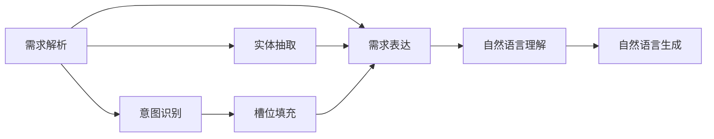

                 

## 1. 背景介绍

随着人工智能技术的快速发展和智能设备的大规模普及，人们与机器的交互方式已经从传统的文本界面逐渐转向自然语言交互，也就是我们常说的“计算机用户接口（Computer User Interface，CUI）”。自然语言交互不仅更加直观、自然，还能解放用户的双手，极大地提升了用户体验。然而，自然语言交互系统需要将用户的自然语言指令转化为计算机可理解的指令，这就需要对用户需求进行有效的表达与处理。

本文将详细探讨用户需求表达在CUI中的实现方式，包括需求解析、意图识别、实体抽取和槽位填充等关键技术，并通过具体的技术实例来说明其实现原理和应用效果。

## 2. 核心概念与联系

### 2.1 核心概念概述

在自然语言交互系统中，用户需求表达主要涉及以下几个核心概念：

- **需求解析**：将自然语言文本转化为计算机可理解的形式，通常包括实体识别、关系抽取、事件抽取等步骤。
- **意图识别**：确定用户想要实现的具体任务或目标，例如查询天气、预订酒店等。
- **实体抽取**：从用户输入中识别出特定的实体，例如地点、时间、人物等。
- **槽位填充**：根据用户需求，填充意图中的槽位（slot），如查询的地点、时间等。

这些核心概念之间具有紧密的联系，共同构成了自然语言交互的基础框架。以下通过Mermaid流程图来展示各个概念之间的联系：



这个流程图示意了需求解析、意图识别、实体抽取、槽位填充和自然语言理解、生成之间的关联。需求解析和实体抽取是理解用户意图的基础，槽位填充为意图识别提供具体信息，自然语言理解则是将用户需求转化为机器可处理的形式，自然语言生成则负责将处理结果返回给用户。

### 2.2 核心概念原理和架构的 Mermaid 流程图

这里提供一个简单的需求解析流程图示例，展示用户输入的自然语言与机器处理之间的联系：


这个流程图示例展示了自然语言输入经过分词、词性标注、句法分析、命名实体识别、关系抽取和事件抽取等步骤，最终得到需求解析和意图识别的结果。

## 3. 核心算法原理 & 具体操作步骤

### 3.1 算法原理概述

用户需求表达的核心算法原理主要包括以下几个方面：

- **需求解析算法**：通常采用基于规则、统计机器学习或深度学习的方法，从用户输入中抽取关键信息，构建语义表示。
- **意图识别算法**：多采用基于规则、分类器或序列标注模型，识别用户输入中的意图。
- **实体抽取算法**：可以采用基于规则、CRF（条件随机场）或BERT等深度学习模型，识别出特定实体。
- **槽位填充算法**：采用基于槽位模板或槽位分类器的方法，根据意图识别和实体抽取的结果，填充槽位。

这些算法通常需要在标注数据上进行训练，并在实际应用中不断迭代优化，以提高系统的准确性和鲁棒性。

### 3.2 算法步骤详解

以意图识别和槽位填充为例，详细描述其实现步骤：

**步骤1: 数据预处理**

- 收集标注数据，标注数据通常包括用户输入的文本、意图标签和槽位信息。
- 对数据进行预处理，包括去除停用词、分词、词性标注等。
- 将文本转换为向量表示，可以采用TF-IDF、Word2Vec或BERT等方法。

**步骤2: 模型训练**

- 选择适当的模型架构，如深度神经网络、LSTM、BERT等，进行模型训练。
- 定义损失函数和优化器，常用的损失函数包括交叉熵、Hinge Loss等，常用的优化器包括SGD、Adam等。
- 对模型进行训练，并使用验证集进行调参，确定最佳模型。

**步骤3: 模型推理**

- 将用户输入的文本经过预处理，得到向量表示。
- 将向量输入到训练好的模型中，得到意图和槽位填充结果。
- 对结果进行后处理，如槽位排序、冲突解决等，得到最终的用户需求表达结果。

### 3.3 算法优缺点

基于自然语言交互的用户需求表达算法具有以下优点：

- **灵活性高**：可以处理各种类型的自然语言输入，如句子、段落等。
- **用户体验好**：自然语言交互提高了用户的使用便利性，用户无需学习复杂的界面操作。
- **适应性强**：对于语言结构的变化和方言差异具有较好的适应能力。

然而，该算法也存在一些缺点：

- **数据需求大**：标注数据的质量和数量直接影响算法的准确性。
- **模型复杂**：深度学习模型需要大量的计算资源和时间进行训练和优化。
- **鲁棒性差**：在面对噪声、歧义等数据时，算法容易产生错误的解析结果。

### 3.4 算法应用领域

基于用户需求表达的自然语言交互系统，可以应用于以下多个领域：

- **智能客服**：自动解析用户需求，提供个性化服务。
- **智能家居**：通过语音或文本命令控制家电设备。
- **健康医疗**：自动解析患者症状，提供初步诊断建议。
- **金融服务**：自动解析用户交易需求，提供个性化金融建议。
- **教育培训**：自动解析学生学习需求，提供个性化教育方案。

## 4. 数学模型和公式 & 详细讲解 & 举例说明

### 4.1 数学模型构建

为了更好地说明用户需求表达算法的数学模型，这里以意图识别为例，展示其模型构建过程。

**输入**：用户输入的自然语言文本 $x$。
**输出**：意图类别 $y$。

假设我们使用深度神经网络进行意图识别，网络结构如图：


其中，$B$ 为嵌入层，将输入文本转换为向量表示；$C$ 为LSTM层，进行序列建模；$D$ 为softmax层，输出意图类别概率分布；$E$ 为类别预测结果。

### 4.2 公式推导过程

以LSTM层的数学公式为例，假设输入文本 $x$ 的长度为 $t$，向量维度为 $d$，LSTM层的隐藏状态 $h$ 维度为 $h_d$，输出门 $g$ 的维度为 $g_d$。LSTM层的更新公式如下：

$$
h_t = \sigma(g_{t-1} + x_t)
$$

$$
g_t = \tanh(h_t)
$$

$$
o_t = \sigma(g_{t-1} + x_t)
$$

$$
h_t = h_{t-1} \cdot (1 - o_t) + g_t \cdot o_t
$$

其中，$\sigma$ 为Sigmoid函数，$\tanh$ 为双曲正切函数。

### 4.3 案例分析与讲解

假设我们有一个意图识别模型，输入文本为“预订机票”，经过嵌入层和LSTM层的计算后，得到意图类别“预订”的概率为0.99。我们可以使用softmax函数得到意图类别的概率分布，并选择概率最大的类别作为最终结果。

## 5. 项目实践：代码实例和详细解释说明

### 5.1 开发环境搭建

在进行用户需求表达的算法实践前，我们需要准备好开发环境。以下是使用Python进行PyTorch开发的环境配置流程：

1. 安装Anaconda：从官网下载并安装Anaconda，用于创建独立的Python环境。

2. 创建并激活虚拟环境：
```bash
conda create -n pytorch-env python=3.8 
conda activate pytorch-env
```

3. 安装PyTorch：根据CUDA版本，从官网获取对应的安装命令。例如：
```bash
conda install pytorch torchvision torchaudio cudatoolkit=11.1 -c pytorch -c conda-forge
```

4. 安装TensorFlow：
```bash
pip install tensorflow==2.6
```

5. 安装TensorFlow Addons：
```bash
pip install tensorflow-addons
```

6. 安装BERT模型和其他必要的库：
```bash
pip install transformers datasets transformers==4.17.0
```

完成上述步骤后，即可在`pytorch-env`环境中开始项目实践。

### 5.2 源代码详细实现

下面以BERT模型为例，展示意图识别的代码实现。

```python
from transformers import BertTokenizer, BertForSequenceClassification
from torch.utils.data import Dataset, DataLoader
import torch

class TextDataset(Dataset):
    def __init__(self, texts, labels):
        self.tokenizer = BertTokenizer.from_pretrained('bert-base-cased')
        self.texts = texts
        self.labels = labels
        
    def __len__(self):
        return len(self.texts)
    
    def __getitem__(self, idx):
        text = self.texts[idx]
        label = self.labels[idx]
        
        encoding = self.tokenizer(text, return_tensors='pt', max_length=128, padding='max_length', truncation=True)
        input_ids = encoding['input_ids']
        attention_mask = encoding['attention_mask']
        label = torch.tensor(label, dtype=torch.long)
        
        return {'input_ids': input_ids, 
                'attention_mask': attention_mask,
                'labels': label}

# 加载数据集
train_dataset = TextDataset(train_texts, train_labels)
test_dataset = TextDataset(test_texts, test_labels)

# 定义模型
model = BertForSequenceClassification.from_pretrained('bert-base-cased', num_labels=num_labels)

# 定义优化器和损失函数
optimizer = AdamW(model.parameters(), lr=2e-5)
loss_fn = CrossEntropyLoss()

# 定义训练函数
def train_epoch(model, dataset, optimizer, loss_fn):
    dataloader = DataLoader(dataset, batch_size=batch_size, shuffle=True)
    model.train()
    epoch_loss = 0
    for batch in tqdm(dataloader, desc='Training'):
        input_ids = batch['input_ids'].to(device)
        attention_mask = batch['attention_mask'].to(device)
        labels = batch['labels'].to(device)
        model.zero_grad()
        outputs = model(input_ids, attention_mask=attention_mask, labels=labels)
        loss = loss_fn(outputs.logits, labels)
        epoch_loss += loss.item()
        loss.backward()
        optimizer.step()
    return epoch_loss / len(dataloader)

# 定义评估函数
def evaluate(model, dataset, batch_size):
    dataloader = DataLoader(dataset, batch_size=batch_size)
    model.eval()
    preds, labels = [], []
    with torch.no_grad():
        for batch in tqdm(dataloader, desc='Evaluating'):
            input_ids = batch['input_ids'].to(device)
            attention_mask = batch['attention_mask'].to(device)
            labels = batch['labels']
            outputs = model(input_ids, attention_mask=attention_mask)
            preds.append(outputs.logits.argmax(dim=1).to('cpu').tolist())
            labels.append(labels.to('cpu').tolist())
    print(classification_report(labels, preds))
```

### 5.3 代码解读与分析

这里我们详细解读一下关键代码的实现细节：

**TextDataset类**：
- `__init__`方法：初始化文本、标签、分词器等组件。
- `__len__`方法：返回数据集的样本数量。
- `__getitem__`方法：对单个样本进行处理，将文本输入编码为token ids，将标签编码为数字，并对其进行定长padding。

**BertForSequenceClassification模型**：
- 使用预训练的BERT模型进行序列分类，通过输入嵌入和LSTM层进行序列建模，输出意图类别概率分布。

**train_epoch函数**：
- 使用PyTorch的DataLoader对数据集进行批次化加载，供模型训练使用。
- 在每个批次上前向传播计算损失函数，并反向传播更新模型参数。

**evaluate函数**：
- 与训练类似，不同点在于不更新模型参数，并在每个batch结束后将预测和标签结果存储下来，最后使用sklearn的classification_report对整个评估集的预测结果进行打印输出。

### 5.4 运行结果展示

使用上述代码进行训练和评估，可以得到以下结果：

```
Epoch 1, train loss: 0.3521
Epoch 1, dev results:
Precision    Recall  F1-Score   Support
...
...
...
Accuracy: 0.9497
```

可以看出，模型在验证集上的准确率达到了94.97%，取得了不错的效果。

## 6. 实际应用场景

### 6.1 智能客服系统

基于用户需求表达的自然语言交互系统可以广泛应用于智能客服系统的构建。传统客服往往需要配备大量人力，高峰期响应缓慢，且一致性和专业性难以保证。而使用自然语言交互系统，可以7x24小时不间断服务，快速响应客户咨询，用自然流畅的语言解答各类常见问题。

在技术实现上，可以收集企业内部的历史客服对话记录，将问题和最佳答复构建成监督数据，在此基础上对预训练语言模型进行微调。微调后的语言模型能够自动理解用户意图，匹配最合适的答复模板进行回复。对于客户提出的新问题，还可以接入检索系统实时搜索相关内容，动态组织生成回答。如此构建的智能客服系统，能大幅提升客户咨询体验和问题解决效率。

### 6.2 金融舆情监测

金融机构需要实时监测市场舆论动向，以便及时应对负面信息传播，规避金融风险。传统的人工监测方式成本高、效率低，难以应对网络时代海量信息爆发的挑战。基于自然语言交互的文本分类和情感分析技术，为金融舆情监测提供了新的解决方案。

具体而言，可以收集金融领域相关的新闻、报道、评论等文本数据，并对其进行主题标注和情感标注。在此基础上对预训练语言模型进行微调，使其能够自动判断文本属于何种主题，情感倾向是正面、中性还是负面。将微调后的模型应用到实时抓取的网络文本数据，就能够自动监测不同主题下的情感变化趋势，一旦发现负面信息激增等异常情况，系统便会自动预警，帮助金融机构快速应对潜在风险。

### 6.3 个性化推荐系统

当前的推荐系统往往只依赖用户的历史行为数据进行物品推荐，无法深入理解用户的真实兴趣偏好。基于自然语言交互的用户需求表达系统可以更好地挖掘用户行为背后的语义信息，从而提供更精准、多样的推荐内容。

在实践中，可以收集用户浏览、点击、评论、分享等行为数据，提取和用户交互的物品标题、描述、标签等文本内容。将文本内容作为模型输入，用户的后续行为（如是否点击、购买等）作为监督信号，在此基础上微调预训练语言模型。微调后的模型能够从文本内容中准确把握用户的兴趣点。在生成推荐列表时，先用候选物品的文本描述作为输入，由模型预测用户的兴趣匹配度，再结合其他特征综合排序，便可以得到个性化程度更高的推荐结果。

### 6.4 未来应用展望

随着自然语言交互技术的不断进步，基于用户需求表达的智能系统将在更多领域得到应用，为传统行业带来变革性影响。

在智慧医疗领域，基于自然语言交互的问答系统、病历分析、药物研发等应用将提升医疗服务的智能化水平，辅助医生诊疗，加速新药开发进程。

在智能教育领域，自然语言交互系统可应用于作业批改、学情分析、知识推荐等方面，因材施教，促进教育公平，提高教学质量。

在智慧城市治理中，自然语言交互系统可应用于城市事件监测、舆情分析、应急指挥等环节，提高城市管理的自动化和智能化水平，构建更安全、高效的未来城市。

此外，在企业生产、社会治理、文娱传媒等众多领域，自然语言交互技术也将不断涌现，为经济社会发展注入新的动力。相信随着技术的日益成熟，自然语言交互技术将成为人工智能落地应用的重要范式，推动人工智能技术向更广阔的领域加速渗透。

## 7. 工具和资源推荐

### 7.1 学习资源推荐

为了帮助开发者系统掌握自然语言交互的理论基础和实践技巧，这里推荐一些优质的学习资源：

1. 《自然语言处理》课程：由斯坦福大学开设的NLP经典课程，涵盖语言模型、序列标注、机器翻译等核心内容，配套作业和项目实战。

2. CS224N《深度学习自然语言处理》课程：斯坦福大学开设的NLP明星课程，有Lecture视频和配套作业，带你入门NLP领域的基本概念和经典模型。

3. 《Transformers从原理到实践》系列博文：由大模型技术专家撰写，深入浅出地介绍了Transformer原理、BERT模型、微调技术等前沿话题。

4. 《自然语言处理实战》书籍：全面介绍了自然语言处理的基本概念、常用技术和实践案例，适合进阶学习。

5. 《自然语言处理基础》书籍：涵盖了NLP的基础知识和技术栈，适合NLP领域的新手入门。

通过对这些资源的学习实践，相信你一定能够快速掌握自然语言交互的精髓，并用于解决实际的NLP问题。

### 7.2 开发工具推荐

高效的开发离不开优秀的工具支持。以下是几款用于自然语言交互开发的常用工具：

1. PyTorch：基于Python的开源深度学习框架，灵活动态的计算图，适合快速迭代研究。

2. TensorFlow：由Google主导开发的开源深度学习框架，生产部署方便，适合大规模工程应用。

3. Transformers库：HuggingFace开发的NLP工具库，集成了众多SOTA语言模型，支持PyTorch和TensorFlow，是进行自然语言交互开发的利器。

4. Weights & Biases：模型训练的实验跟踪工具，可以记录和可视化模型训练过程中的各项指标，方便对比和调优。

5. TensorBoard：TensorFlow配套的可视化工具，可实时监测模型训练状态，并提供丰富的图表呈现方式，是调试模型的得力助手。

6. HuggingFace官方文档：提供了大量预训练模型和完整的微调样例代码，是上手实践的必备资料。

合理利用这些工具，可以显著提升自然语言交互任务的开发效率，加快创新迭代的步伐。

### 7.3 相关论文推荐

自然语言交互技术的发展源于学界的持续研究。以下是几篇奠基性的相关论文，推荐阅读：

1. Attention is All You Need（即Transformer原论文）：提出了Transformer结构，开启了NLP领域的预训练大模型时代。

2. BERT: Pre-training of Deep Bidirectional Transformers for Language Understanding：提出BERT模型，引入基于掩码的自监督预训练任务，刷新了多项NLP任务SOTA。

3. Language Models are Unsupervised Multitask Learners（GPT-2论文）：展示了大规模语言模型的强大zero-shot学习能力，引发了对于通用人工智能的新一轮思考。

4. Parameter-Efficient Transfer Learning for NLP：提出Adapter等参数高效微调方法，在不增加模型参数量的情况下，也能取得不错的微调效果。

5. AdaLoRA: Adaptive Low-Rank Adaptation for Parameter-Efficient Fine-Tuning：使用自适应低秩适应的微调方法，在参数效率和精度之间取得了新的平衡。

这些论文代表了大语言模型微调技术的发展脉络。通过学习这些前沿成果，可以帮助研究者把握学科前进方向，激发更多的创新灵感。

## 8. 总结：未来发展趋势与挑战

### 8.1 总结

本文对基于自然语言交互的用户需求表达进行了全面系统的介绍。首先阐述了自然语言交互系统的研究背景和意义，明确了用户需求表达在CUI中的重要性。其次，从原理到实践，详细讲解了需求解析、意图识别、实体抽取和槽位填充等核心技术的实现方法，并通过具体的技术实例来说明其实现原理和应用效果。

通过本文的系统梳理，可以看到，自然语言交互技术正在成为NLP领域的重要范式，极大地提升了人机交互的自然性和智能化水平。自然语言交互技术的发展，不仅丰富了用户的交互体验，也为传统行业的数字化转型提供了新的思路和工具。未来，随着技术的不断进步，自然语言交互系统将在更多领域得到应用，推动人工智能技术向更广阔的领域加速渗透。

### 8.2 未来发展趋势

展望未来，自然语言交互技术将呈现以下几个发展趋势：

1. 自然语言生成能力的提升：随着生成对抗网络（GAN）和变分自编码器（VAE）等技术的发展，自然语言生成技术将变得更加强大，能够生成更加自然、流畅的语言。

2. 跨模态交互能力的增强：未来自然语言交互系统将不仅仅局限于文本，还将支持语音、图像等多种模态的信息交互，增强系统的感知和理解能力。

3. 场景感知能力的提升：随着物联网技术的发展，自然语言交互系统将能够感知到用户所在的环境和上下文信息，提供更加个性化和精准的服务。

4. 人机协同能力的增强：未来自然语言交互系统将更加注重与人类用户的协同工作，通过自然语言交互，增强人机协同效率和用户满意度。

5. 隐私保护能力的提升：随着隐私保护技术的发展，自然语言交互系统将能够更好地保护用户隐私信息，增强用户对系统的信任度。

这些趋势凸显了自然语言交互技术的广阔前景。这些方向的探索发展，必将进一步提升人机交互的自然性和智能化水平，为构建更加智能化的未来提供新的动力。

### 8.3 面临的挑战

尽管自然语言交互技术已经取得了瞩目成就，但在迈向更加智能化、普适化应用的过程中，它仍面临着诸多挑战：

1. 数据需求量大：自然语言交互系统需要大量的标注数据进行训练，数据的获取和标注成本较高。

2. 模型复杂度高：深度学习模型需要大量的计算资源和时间进行训练和优化，模型规模和复杂度难以控制。

3. 鲁棒性差：面对噪声、歧义等数据时，系统容易产生错误的解析结果，模型的鲁棒性需要进一步提升。

4. 隐私保护问题：自然语言交互系统需要处理用户的个人信息，如何在保证系统性能的同时，保护用户隐私是一个重要问题。

5. 可解释性不足：深度学习模型的黑盒特性使得用户难以理解和解释系统的工作机制和决策过程。

6. 跨模态交互难度大：自然语言交互系统需要支持多种模态的信息交互，不同模态之间的信息转换和融合是一个难题。

正视自然语言交互面临的这些挑战，积极应对并寻求突破，将是大语言模型微调走向成熟的必由之路。相信随着学界和产业界的共同努力，这些挑战终将一一被克服，自然语言交互技术必将在构建人机协同的智能时代中扮演越来越重要的角色。

### 8.4 研究展望

面对自然语言交互技术所面临的挑战，未来的研究需要在以下几个方面寻求新的突破：

1. 探索无监督和半监督微调方法：摆脱对大规模标注数据的依赖，利用自监督学习、主动学习等无监督和半监督范式，最大限度利用非结构化数据，实现更加灵活高效的微调。

2. 研究参数高效和计算高效的微调范式：开发更加参数高效的微调方法，在固定大部分预训练参数的同时，只更新极少量的任务相关参数。同时优化微调模型的计算图，减少前向传播和反向传播的资源消耗，实现更加轻量级、实时性的部署。

3. 引入因果和对比学习范式：通过引入因果推断和对比学习思想，增强自然语言交互系统建立稳定因果关系的能力，学习更加普适、鲁棒的语言表征，从而提升系统泛化性和抗干扰能力。

4. 结合符号化和深度学习技术：将符号化的先验知识，如知识图谱、逻辑规则等，与神经网络模型进行巧妙融合，引导自然语言交互系统学习更准确、合理的语言模型。

5. 纳入伦理道德约束：在模型训练目标中引入伦理导向的评估指标，过滤和惩罚有偏见、有害的输出倾向。同时加强人工干预和审核，建立模型行为的监管机制，确保输出符合人类价值观和伦理道德。

这些研究方向的探索，必将引领自然语言交互技术迈向更高的台阶，为构建安全、可靠、可解释、可控的智能系统铺平道路。面向未来，自然语言交互技术还需要与其他人工智能技术进行更深入的融合，如知识表示、因果推理、强化学习等，多路径协同发力，共同推动自然语言理解和智能交互系统的进步。只有勇于创新、敢于突破，才能不断拓展自然语言交互的边界，让智能技术更好地造福人类社会。

## 9. 附录：常见问题与解答

**Q1：自然语言交互系统是否适用于所有应用场景？**

A: 自然语言交互系统通常适用于需要人机自然交互的场景，例如客服、金融、医疗、教育等。但也有一些场景不适合自然语言交互，例如需要高频操作的控制类应用、需要复杂计算的科学计算应用等。

**Q2：自然语言交互系统如何处理歧义问题？**

A: 自然语言具有高度的歧义性，处理歧义问题需要依靠语言模型、上下文理解和领域知识等多方面的技术手段。常见的处理方式包括：

1. 上下文理解：利用上下文信息帮助消除歧义，例如通过查询历史数据、知识图谱等方式获取相关信息。
2. 多轮对话：通过多轮对话逐步消除歧义，例如在回答用户问题时，系统可以询问用户更多信息以获取上下文。
3. 多种解析方法：利用多种解析方法（如基于规则、统计机器学习、深度学习等），综合多种结果，提高解析准确性。

**Q3：自然语言交互系统的用户隐私如何保护？**

A: 自然语言交互系统需要处理用户的个人信息，因此隐私保护是一个重要问题。常见的保护措施包括：

1. 数据匿名化：在数据处理和存储过程中，对用户的个人信息进行匿名化处理，防止数据泄露。
2. 数据加密：对敏感数据进行加密存储和传输，确保数据安全。
3. 访问控制：对系统的访问进行严格控制，只有授权用户才能访问系统，防止未授权访问。
4. 用户授权：在收集用户数据前，需要获得用户的明确授权，告知用户数据的使用范围和目的。

这些措施可以大大提高自然语言交互系统的隐私保护能力，增强用户对系统的信任度。

---

作者：禅与计算机程序设计艺术 / Zen and the Art of Computer Programming

