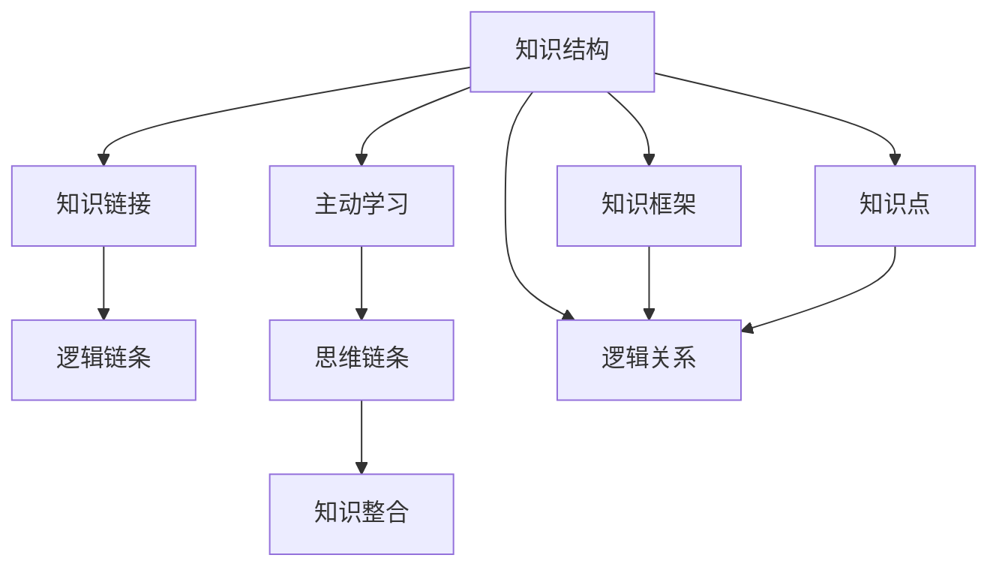

                 

# 用费曼提问法提升学习深度

> 关键词：费曼学习法, 知识结构, 知识链接, 逻辑链条, 主动学习, 思维链条, 知识整合

## 1. 背景介绍

### 1.1 问题由来
在现代信息爆炸的时代，知识的更新速度加快，学习资源的丰富性使得每个人都面临着如何高效学习的问题。而传统的被动灌输式学习方法，往往难以达到最佳的学习效果。近年来，一种被称为“费曼学习法”的自主学习法被广泛推崇，其核心思想在于通过模拟费曼博士的问答教学方式，不断自问自答，以检验和巩固知识。

### 1.2 问题核心关键点
费曼学习法强调知识的结构和链接，通过主动学习的方式，引导学习者深入理解并掌握知识。其核心关键点在于以下几个方面：
1. 知识结构：建立清晰的知识框架，从整体上把握知识点之间的逻辑关系。
2. 知识链接：将零散的知识点相互连接，形成紧密的逻辑链条。
3. 主动学习：通过自问自答，主动进行知识的探索和内化。
4. 思维链条：构建从问题到解答的思考路径，增强逻辑推理能力。
5. 知识整合：将新学知识整合到原有知识体系中，形成综合的知识能力。

### 1.3 问题研究意义
费曼学习法的应用不仅能提高学习效率，还能提升思维深度和创新能力。其适用范围广泛，无论是学术研究、软件开发还是日常学习，都能发挥重要作用。掌握费曼学习法，对于培养自学能力、提升问题解决能力、拓宽知识视野，都有深远的影响。

## 2. 核心概念与联系

### 2.1 核心概念概述

为更好地理解费曼学习法，本文将介绍几个核心概念：

- 费曼学习法(The Feynman Technique)：由著名物理学家理查德·费曼(Richard Feynman)提出的一种学习方法，通过自我解释来验证和强化知识理解。
- 知识结构(Knowledge Structure)：将知识点按照逻辑关系进行组织，形成具有层级结构的系统性知识框架。
- 知识链接(Knowledge Linkage)：将相关知识点通过逻辑关系串联起来，构建完整的知识体系。
- 逻辑链条(Logical Chain)：通过逻辑推理，将知识点串联起来，形成一条条紧密连接的思维链条。
- 主动学习(Active Learning)：主动探索、验证和内化知识，而非被动接受。
- 思维链条(Thought Chain)：从问题到解答的思考路径，逻辑清晰、结构严谨。
- 知识整合(Knowledge Integration)：将新旧知识融合，形成综合的知识能力。

这些核心概念之间存在紧密的联系，共同构成了费曼学习法的基本原理和方法。

### 2.2 核心概念原理和架构的 Mermaid 流程图



通过以上流程图，可以看出费曼学习法的基本流程：从知识结构的建立，到知识链接的形成，再到逻辑链条的构建，最终通过主动学习，形成一条条完整的思维链条，并最终进行知识整合。这一过程循环往复，不断深入，直到学习者能够全面理解和掌握知识。

## 3. 核心算法原理 & 具体操作步骤

### 3.1 算法原理概述

费曼学习法的核心原理在于通过模拟费曼博士的问答教学方式，将复杂的知识简化，并以自我解释的形式进行复习和巩固。其基本流程如下：

1. 确定目标知识点，将其拆分为若干子知识点。
2. 针对每个子知识点，进行自我解释，即通过语言描述来表达对该知识点的理解。
3. 如果发现无法清晰表达或理解，则进行深入研究，直至完全掌握。
4. 将掌握的知识点与已有知识体系进行链接，形成完整的知识结构。
5. 通过不断重复以上步骤，不断强化知识点的理解和记忆。

### 3.2 算法步骤详解

以下将详细介绍费曼学习法的具体操作步骤：

**Step 1: 确定目标知识点**

首先，确定需要学习或复习的知识点。将知识点拆分为若干子知识点，并按照逻辑关系进行排序。

**Step 2: 自我解释**

针对每个子知识点，进行自我解释。可以使用笔和纸进行书面描述，也可以使用计算机和文本编辑器进行电子笔记。描述过程尽量简洁明了，避免使用专业术语，尽可能通俗易懂。

**Step 3: 自问自答**

在自我解释后，尝试将解释的内容反过来提问自己。例如，针对“什么是逻辑回归？”这一知识点，可以提出“什么是逻辑回归？”“逻辑回归的原理是什么？”“逻辑回归的应用场景有哪些？”等问题，并进行解答。

**Step 4: 深入研究**

如果发现某些知识点无法用简洁明了的语言进行解释，则进行深入研究。可以查阅相关文献、观看教学视频、参加在线课程等，直至完全掌握。

**Step 5: 知识链接**

将掌握的知识点与已有知识体系进行链接。例如，逻辑回归是机器学习中常用的分类算法，而线性回归则是其中的特殊情况。通过这种方式，建立知识之间的联系。

**Step 6: 知识整合**

将新学的知识点整合到原有知识体系中。例如，可以将逻辑回归与梯度下降算法结合起来，理解逻辑回归的计算过程。

**Step 7: 循环往复**

不断重复以上步骤，直到能够全面、准确地理解和掌握所有知识点。

### 3.3 算法优缺点

费曼学习法的主要优点包括：

1. 主动学习：通过自我解释和提问，激发学习者的思考和探究精神，提高学习的主动性。
2. 知识结构化：通过建立知识结构，形成完整的知识体系，便于理解和记忆。
3. 逻辑链条化：通过逻辑链条，强化知识点之间的联系，增强知识的连贯性和逻辑性。
4. 知识整合化：通过知识整合，形成综合的知识能力，提升学习效率。

同时，费曼学习法也存在一些缺点：

1. 时间成本较高：自我解释和自问自答需要耗费大量时间，可能不适合快速学习。
2. 对知识深度要求高：需要学习者对知识有较深理解，才能进行有效的自我解释和提问。
3. 需要一定的耐心和毅力：坚持不懈地进行自我解释和自问自答，需要较强的毅力和耐心。

### 3.4 算法应用领域

费曼学习法广泛适用于学术研究、软件开发、工程设计、日常学习等多个领域。

在学术研究中，费曼学习法可以帮助研究人员深入理解研究领域的知识点，形成系统的研究框架，提高研究效率。例如，在深度学习领域，通过费曼学习法掌握神经网络、梯度下降、反向传播等基础知识，进一步进行模型设计和实验。

在软件开发中，费曼学习法可以帮助开发者理解和掌握新技术、新框架，形成完整的知识体系。例如，在机器学习领域，通过费曼学习法理解机器学习算法、模型评估、数据预处理等知识，提高开发效率。

在日常学习中，费曼学习法可以帮助学生巩固基础知识，提升问题解决能力。例如，在数学、物理、化学等学科中，通过费曼学习法理解公式、定理、定律等知识点，形成综合的知识能力。

## 4. 数学模型和公式 & 详细讲解 & 举例说明

### 4.1 数学模型构建

为了更好地说明费曼学习法的应用，以下将构建一个简单的数学模型，并使用费曼学习法进行分析和解答。

假设我们需要学习线性回归模型：

$$ y = \beta_0 + \beta_1x + \epsilon $$

其中，$y$ 表示目标变量，$x$ 表示自变量，$\beta_0$ 和 $\beta_1$ 表示模型参数，$\epsilon$ 表示误差项。

**Step 1: 确定目标知识点**

我们将目标知识点拆分为三个子知识点：

1. 什么是线性回归模型？
2. 线性回归模型的原理是什么？
3. 线性回归模型的应用场景有哪些？

**Step 2: 自我解释**

针对每个子知识点，进行自我解释：

1. 什么是线性回归模型？
   - 线性回归模型是一种通过最小二乘法求解的最佳拟合直线，用于预测目标变量的值。
2. 线性回归模型的原理是什么？
   - 线性回归模型的原理是使用最小二乘法求解模型参数，使得模型预测值与实际值之间的误差最小化。
3. 线性回归模型的应用场景有哪些？
   - 线性回归模型适用于预测连续型变量的值，例如房价预测、股票价格预测等。

**Step 3: 自问自答**

在自我解释后，尝试将解释的内容反过来提问自己：

1. 什么是最小二乘法？
2. 最小二乘法的原理是什么？
3. 最小二乘法的应用场景有哪些？

**Step 4: 深入研究**

在遇到无法清晰解释的问题时，进行深入研究。例如，最小二乘法的原理可以通过查阅相关文献、观看教学视频等途径进行学习。

**Step 5: 知识链接**

将掌握的知识点与已有知识体系进行链接。例如，将线性回归模型与最小二乘法、梯度下降算法结合起来，理解线性回归的计算过程。

**Step 6: 知识整合**

将新学的知识点整合到原有知识体系中。例如，将线性回归模型与神经网络、深度学习等知识进行整合，形成综合的知识能力。

### 4.2 公式推导过程

以下将详细介绍线性回归模型的公式推导过程，并使用费曼学习法进行分析和解答。

在线性回归模型中，我们需要求解模型参数 $\beta_0$ 和 $\beta_1$，使得模型预测值与实际值之间的误差最小化。假设我们有一组训练数据 $(x_i,y_i)$，其中 $i$ 表示数据点的序号。根据最小二乘法的原理，模型参数的求解公式为：

$$ \beta_0 = \frac{\sum_{i=1}^n y_i - \beta_1\sum_{i=1}^n x_i}{n} $$
$$ \beta_1 = \frac{\sum_{i=1}^n x_i y_i - \beta_0 \sum_{i=1}^n x_i}{\sum_{i=1}^n x_i^2} $$

以上公式的推导过程较为复杂，但通过费曼学习法，我们可以将复杂问题简化，逐步掌握其中的原理。

**Step 1: 确定目标知识点**

我们将目标知识点拆分为两个子知识点：

1. 线性回归模型参数的求解公式是什么？
2. 求解公式的推导过程是什么？

**Step 2: 自我解释**

针对每个子知识点，进行自我解释：

1. 线性回归模型参数的求解公式是什么？
   - 线性回归模型参数的求解公式为：
   $$ \beta_0 = \frac{\sum_{i=1}^n y_i - \beta_1\sum_{i=1}^n x_i}{n} $$
   $$ \beta_1 = \frac{\sum_{i=1}^n x_i y_i - \beta_0 \sum_{i=1}^n x_i}{\sum_{i=1}^n x_i^2} $$
2. 求解公式的推导过程是什么？
   - 求解公式的推导过程涉及最小二乘法和矩阵运算，需要进行详细的推导。

**Step 3: 自问自答**

在自我解释后，尝试将解释的内容反过来提问自己：

1. 最小二乘法的原理是什么？
2. 矩阵运算的原理是什么？
3. 如何通过矩阵运算求解线性回归模型参数？

**Step 4: 深入研究**

在遇到无法清晰解释的问题时，进行深入研究。例如，最小二乘法的原理可以通过查阅相关文献、观看教学视频等途径进行学习。

**Step 5: 知识链接**

将掌握的知识点与已有知识体系进行链接。例如，将最小二乘法与梯度下降算法结合起来，理解线性回归的计算过程。

**Step 6: 知识整合**

将新学的知识点整合到原有知识体系中。例如，将线性回归模型与神经网络、深度学习等知识进行整合，形成综合的知识能力。

### 4.3 案例分析与讲解

假设我们要理解机器学习中的梯度下降算法，可以使用费曼学习法进行分析和解答。

**Step 1: 确定目标知识点**

我们将目标知识点拆分为三个子知识点：

1. 什么是梯度下降算法？
2. 梯度下降算法的原理是什么？
3. 梯度下降算法的应用场景有哪些？

**Step 2: 自我解释**

针对每个子知识点，进行自我解释：

1. 什么是梯度下降算法？
   - 梯度下降算法是一种常用的优化算法，用于求解函数的最小值。
2. 梯度下降算法的原理是什么？
   - 梯度下降算法的原理是通过迭代计算目标函数的梯度，逐步逼近函数的最小值。
3. 梯度下降算法的应用场景有哪些？
   - 梯度下降算法适用于各种机器学习算法的优化问题，例如线性回归、逻辑回归、神经网络等。

**Step 3: 自问自答**

在自我解释后，尝试将解释的内容反过来提问自己：

1. 什么是梯度？
2. 梯度的定义是什么？
3. 如何通过梯度计算函数的最小值？

**Step 4: 深入研究**

在遇到无法清晰解释的问题时，进行深入研究。例如，梯度的定义可以通过查阅相关文献、观看教学视频等途径进行学习。

**Step 5: 知识链接**

将掌握的知识点与已有知识体系进行链接。例如，将梯度下降算法与神经网络的反向传播算法结合起来，理解梯度下降的计算过程。

**Step 6: 知识整合**

将新学的知识点整合到原有知识体系中。例如，将梯度下降算法与机器学习、深度学习等知识进行整合，形成综合的知识能力。

## 5. 项目实践：代码实例和详细解释说明

### 5.1 开发环境搭建

在进行费曼学习法的实践前，我们需要准备好开发环境。以下是使用Python进行Jupyter Notebook开发的简单环境配置流程：

1. 安装Anaconda：从官网下载并安装Anaconda，用于创建独立的Python环境。

2. 创建并激活虚拟环境：
```bash
conda create -n py35 python=3.5 
conda activate py35
```

3. 安装相关工具包：
```bash
pip install jupyter notebook
```

完成上述步骤后，即可在`py35`环境中开始费曼学习法的实践。

### 5.2 源代码详细实现

下面以机器学习中的梯度下降算法为例，给出使用Jupyter Notebook进行梯度下降算法的计算和分析的Python代码实现。

```python
import numpy as np

# 定义目标函数
def target_function(x):
    return x**2 - 4*x + 4

# 计算梯度
def gradient(x):
    return 2*x - 4

# 定义梯度下降算法
def gradient_descent(start, learning_rate, num_steps):
    x = start
    for _ in range(num_steps):
        grad = gradient(x)
        x -= learning_rate * grad
    return x

# 测试梯度下降算法
start = 5
learning_rate = 0.01
num_steps = 100
result = gradient_descent(start, learning_rate, num_steps)
print("Result:", result)
```

这段代码实现了梯度下降算法的计算过程。通过调整学习率和迭代次数，可以观察到算法收敛到目标函数最小值的过程。

### 5.3 代码解读与分析

让我们再详细解读一下关键代码的实现细节：

**目标函数**：
- `target_function`方法：定义目标函数 $f(x) = x^2 - 4x + 4$。

**梯度计算**：
- `gradient`方法：定义目标函数的梯度，即 $f'(x) = 2x - 4$。

**梯度下降算法**：
- `gradient_descent`方法：实现梯度下降算法的迭代计算过程，通过不断更新 $x$ 的值，逐步逼近目标函数的最小值。

**测试**：
- `start`：初始值设为5。
- `learning_rate`：学习率设为0.01，表示每次迭代更新的步长。
- `num_steps`：迭代次数设为100，表示算法的迭代次数。

通过这段代码，可以看出梯度下降算法的核心思想，即通过计算梯度，逐步逼近函数的最小值。

## 6. 实际应用场景

### 6.1 学术研究

在学术研究中，费曼学习法可以帮助研究人员深入理解研究领域的知识点，形成系统的研究框架，提高研究效率。例如，在深度学习领域，通过费曼学习法掌握神经网络、梯度下降、反向传播等基础知识，进一步进行模型设计和实验。

### 6.2 软件开发

在软件开发中，费曼学习法可以帮助开发者理解和掌握新技术、新框架，形成完整的知识体系。例如，在机器学习领域，通过费曼学习法理解机器学习算法、模型评估、数据预处理等知识，提高开发效率。

### 6.3 日常学习

在日常学习中，费曼学习法可以帮助学生巩固基础知识，提升问题解决能力。例如，在数学、物理、化学等学科中，通过费曼学习法理解公式、定理、定律等知识点，形成综合的知识能力。

## 7. 工具和资源推荐

### 7.1 学习资源推荐

为了帮助开发者系统掌握费曼学习法，这里推荐一些优质的学习资源：

1. 《费曼学习法：如何学得更好、更快、更深入》：一本详细介绍费曼学习法的经典书籍，适合所有层次的学习者。

2. Coursera《The Art of Problem Solving》：由Coursera推出的在线课程，涵盖算法、数据结构、编程等多个方面，通过实际问题引导学生深入思考。

3. Khan Academy：一个提供免费在线课程和资源的平台，涵盖数学、科学、历史等多个学科，适合自主学习者。

4. MIT OpenCourseWare：麻省理工学院提供的免费在线课程，包括计算机科学、数学、工程等多个领域的课程，适合深入研究。

5. GitHub《The Feynman Technique》：一个详细的费曼学习法实现教程，适合实践者。

通过对这些资源的学习实践，相信你一定能够快速掌握费曼学习法的精髓，并用于解决实际的学术、开发、学习问题。

### 7.2 开发工具推荐

为了更好地进行费曼学习法的实践，以下是几款常用的开发工具：

1. Jupyter Notebook：一款免费的交互式编程环境，支持Python、R、Matlab等多种语言，适合快速原型设计和数据分析。

2. Visual Studio Code：一款功能强大的代码编辑器，支持Python、Java、C++等多种语言，适合综合开发环境。

3. Anaconda：一款开源的Python发行版，集成了大量的科学计算和数据处理工具，适合数据分析和科学计算。

4. PyCharm：一款功能丰富的Python IDE，支持代码高亮、自动补全、调试等功能，适合Python开发。

5. LaTeX：一款专业的排版系统，适合撰写论文、书籍等正式文档，适合学术研究。

合理利用这些工具，可以显著提升费曼学习法的开发效率，加快创新迭代的步伐。

### 7.3 相关论文推荐

费曼学习法的研究和发展离不开学界的持续关注和深入研究。以下是几篇奠基性的相关论文，推荐阅读：

1. "The Feynman Technique: What It Is and How to Apply It"：一篇详细介绍费曼学习法的论文，介绍了费曼学习法的应用步骤和方法。

2. "The Feynman Technique: A Comprehensive Guide to Mastering Complex Concepts"：一篇详细介绍费曼学习法的书籍，详细阐述了费曼学习法的核心思想和实现方法。

3. "Teaching Physics: The Feynman Technique"：一篇介绍费曼学习法在物理学教学中的应用的论文，展示了费曼学习法在教学中的有效性。

4. "Learning to Learn: An Introduction to Machine Learning for Students"：一本介绍机器学习教学的书籍，涵盖了机器学习基础、深度学习、神经网络等多个方面，适合深入研究。

5. "The Feynman Technique: A Handbook for How to Teach Anything and Learn Anything"：一本详细介绍费曼学习法的书籍，适合所有层次的学习者。

这些论文代表了费曼学习法的研究和发展脉络，通过学习这些前沿成果，可以帮助研究者把握学科前进方向，激发更多的创新灵感。

## 8. 总结：未来发展趋势与挑战

### 8.1 总结

本文对费曼学习法的应用进行了全面系统的介绍。首先阐述了费曼学习法的学习背景和意义，明确了其在学习、开发、研究等领域的应用价值。其次，从原理到实践，详细讲解了费曼学习法的数学模型和具体操作步骤，给出了实际应用的代码实例。同时，本文还广泛探讨了费曼学习法在学术研究、软件开发、日常学习等多个领域的应用前景，展示了费曼学习法的广泛适用性和巨大潜力。

通过本文的系统梳理，可以看到，费曼学习法通过自我解释和自问自答，可以有效提高学习效率，强化知识理解和记忆。其适用范围广泛，无论是学术研究、软件开发还是日常学习，都能发挥重要作用。掌握费曼学习法，对于培养自学能力、提升问题解决能力、拓宽知识视野，都有深远的影响。

### 8.2 未来发展趋势

展望未来，费曼学习法将呈现以下几个发展趋势：

1. 系统化研究：随着研究者对费曼学习法的深入探讨，未来会形成更加系统和全面的理论框架，增强其科学性和指导性。
2. 多元化应用：费曼学习法将逐步应用于更多领域，例如教育、艺术、管理等，帮助人们提升综合素质和创新能力。
3. 数据驱动：在应用过程中，会引入更多的数据驱动方法，通过数据分析优化学习效果，提升学习效率。
4. 技术融合：费曼学习法将与更多先进技术进行融合，例如人工智能、大数据等，进一步提升学习效果。
5. 知识共享：通过构建知识共享平台，促进费曼学习法的传播和应用，增强其影响力。

以上趋势凸显了费曼学习法的广泛前景和深远影响。这些方向的探索发展，必将进一步提升费曼学习法的应用效果，帮助人们实现更高质量的学习。

### 8.3 面临的挑战

尽管费曼学习法已经取得了瞩目成就，但在迈向更加智能化、普适化应用的过程中，它仍面临着诸多挑战：

1. 时间成本较高：费曼学习法的自我解释和自问自答需要耗费大量时间，可能不适合快速学习。
2. 对知识深度要求高：需要学习者对知识有较深理解，才能进行有效的自我解释和提问。
3. 需要一定的耐心和毅力：坚持不懈地进行自我解释和自问自答，需要较强的毅力和耐心。

### 8.4 研究展望

面对费曼学习法面临的这些挑战，未来的研究需要在以下几个方面寻求新的突破：

1. 开发更加自动化的工具：通过智能算法辅助进行自我解释和自问自答，减少人工干预，提高学习效率。
2. 引入更多的数据驱动方法：通过数据分析优化学习效果，提升学习效率。
3. 开发更加灵活的应用场景：根据不同学习者的特点和需求，定制化设计费曼学习法的应用流程。
4. 引入更多的技术融合：例如，将费曼学习法与人工智能、大数据等先进技术进行融合，进一步提升学习效果。
5. 构建知识共享平台：通过构建知识共享平台，促进费曼学习法的传播和应用，增强其影响力。

这些研究方向的探索，必将引领费曼学习法迈向更高的台阶，为人类学习和创新能力的提升铺平道路。面向未来，费曼学习法还需要与其他人工智能技术进行更深入的融合，例如知识表示、因果推理、强化学习等，多路径协同发力，共同推动自然语言理解和智能交互系统的进步。只有勇于创新、敢于突破，才能不断拓展费曼学习法的边界，让智能技术更好地造福人类社会。

## 9. 附录：常见问题与解答

**Q1: 费曼学习法是否适合所有学科？**

A: 费曼学习法适用范围广泛，包括数学、物理、化学、计算机科学等多个学科。然而，对于一些需要动手实验和实地操作的学科，如实验化学、医学等，费曼学习法可能难以完全取代传统的教学方法。

**Q2: 费曼学习法是否需要长时间坚持？**

A: 费曼学习法需要一定的毅力和耐心，通过持续的自我解释和自问自答，逐步掌握知识点。但只要坚持不懈，一定会获得显著的学习效果。

**Q3: 费曼学习法是否需要详细记录？**

A: 费曼学习法可以通过详细记录来跟踪学习进度和效果。但记录应尽量简洁明了，避免过于冗长。可以利用电子文档或笔记本来进行记录，方便随时查阅和修改。

**Q4: 费曼学习法是否需要大量资源？**

A: 费曼学习法主要依赖于学习者的主动思考和自我探究，不需要过多的资源支持。但可以借助一些在线资源和工具，例如Coursera、Khan Academy等，进行辅助学习。

**Q5: 费曼学习法是否需要专业指导？**

A: 费曼学习法主要依赖于学习者的自主探究和自我解释，但如果遇到疑难问题，可以借助专业指导进行解决。例如，可以咨询老师、同学、在线社区等，寻求帮助。

通过以上问题的解答，可以看出费曼学习法不仅适合学术研究、软件开发、日常学习等多个领域，还具有较高的可操作性和广泛的应用前景。掌握费曼学习法，对于培养自学能力、提升问题解决能力、拓宽知识视野，都有深远的影响。面向未来，费曼学习法将继续推动人工智能、教育、科学研究等领域的发展，为人类学习和创新能力的提升做出重要贡献。

---

作者：禅与计算机程序设计艺术 / Zen and the Art of Computer Programming

