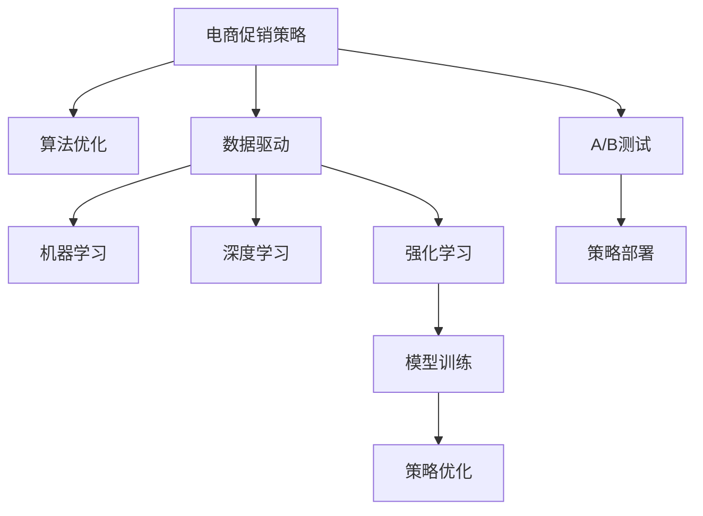

                 

# 电商促销策略的技术应用

> 关键词：电商促销策略,算法优化,技术应用,数据驱动,机器学习

## 1. 背景介绍

在互联网+的浪潮下，电子商务已逐渐成为人们消费的重要渠道。电商促销作为电商平台上提升用户购买欲望的重要手段，其效果直接影响着平台的销售业绩。传统的电商促销策略，主要是通过限时折扣、买一赠一等价格优惠吸引用户，而这些方式的效果越来越有限。

人工智能和大数据技术在电商领域的应用，正为促销策略的优化带来了新的突破。本文将从技术角度出发，详细探讨如何利用人工智能和大数据技术，制定出更加科学合理的电商促销策略。

## 2. 核心概念与联系

### 2.1 核心概念概述

为更好地理解如何利用人工智能和大数据技术优化电商促销策略，本节将介绍几个密切相关的核心概念：

- **电商促销策略**：指电商平台为了提高销售额和用户粘性，采取的各种优惠活动，如限时折扣、积分兑换、买一赠一等。
- **算法优化**：指通过技术手段，对电商促销策略进行优化，提升效果和转化率。
- **数据驱动**：指通过收集、分析和应用海量用户行为数据，驱动电商促销策略的制定和优化。
- **机器学习**：指利用数据训练模型，提取用户行为特征和偏好，辅助电商促销策略的制定和优化。
- **深度学习**：指通过构建深度神经网络，提升模型对复杂用户行为的理解和预测能力。
- **强化学习**：指通过不断试错，训练模型最大化预期奖励，以优化电商促销策略。

这些核心概念之间的逻辑关系可以通过以下Mermaid流程图来展示：



这个流程图展示了大数据与人工智能技术在电商促销策略优化中的作用过程：

1. 电商促销策略作为起点，需要通过算法优化进一步提升效果。
2. 数据驱动和技术驱动的机器学习、深度学习和强化学习，是优化策略的基础。
3. 通过模型训练和策略优化，最终部署到电商平台中。
4. A/B测试进一步验证优化效果，并不断迭代优化。

## 3. 核心算法原理 & 具体操作步骤

### 3.1 算法原理概述

电商促销策略的优化，本质上是基于用户行为数据进行特征提取和模型训练的过程。算法原理主要包括以下几个步骤：

1. **数据收集**：收集用户行为数据，包括浏览记录、购买记录、评论记录等。
2. **特征工程**：对收集到的数据进行特征提取，如用户行为时间、浏览深度、购买频次等。
3. **模型训练**：利用机器学习或深度学习算法，训练模型预测用户的促销响应概率。
4. **策略优化**：通过模型预测结果，优化促销策略，最大化预期收益。
5. **A/B测试**：通过A/B测试，评估优化后的促销策略效果，进一步调整策略。

### 3.2 算法步骤详解

#### 3.2.1 数据收集与预处理

电商平台的促销活动，主要是基于用户的浏览、点击和购买行为来设计的。因此，首先需要收集这些用户行为数据。

**数据来源**：
- **用户浏览记录**：包括浏览的页面、停留时间、点击次数等。
- **用户购买记录**：包括购买时间、商品类别、订单金额等。
- **用户评论记录**：包括评论时间、评论内容、评分等。
- **用户注册信息**：包括年龄、性别、地域等。

**数据预处理**：
- **数据清洗**：去除重复数据、异常数据、缺失数据等。
- **特征提取**：提取用户行为的关键特征，如访问深度、停留时长、浏览路径等。
- **数据归一化**：将数据转化为标准化的形式，便于模型训练。
- **数据标注**：为部分数据打上促销响应的标签，如是否点击购买、是否完成支付等。

#### 3.2.2 特征工程与模型训练

在进行模型训练前，需要对收集到的数据进行特征工程处理。特征工程是构建高质量数据集的重要步骤，其目的在于通过选取和构建最具有信息量的特征，提升模型的预测能力。

**特征选取**：
- **用户行为特征**：访问深度、停留时长、浏览路径等。
- **用户基本信息特征**：年龄、性别、地域等。
- **商品信息特征**：商品类别、价格、评价等。

**特征构建**：
- **时间特征**：访问时间、停留时间、购买时间等。
- **交互特征**：浏览次数、点击次数、评价次数等。

**模型训练**：
- **分类模型**：如逻辑回归、决策树、随机森林等，用于预测用户是否响应促销活动。
- **回归模型**：如线性回归、梯度提升回归等，用于预测促销带来的预期收益。
- **深度学习模型**：如卷积神经网络（CNN）、循环神经网络（RNN）、长短时记忆网络（LSTM）等，用于提取高阶特征和复杂模式的预测。

#### 3.2.3 策略优化与部署

基于模型训练结果，对现有的电商促销策略进行优化和调整。具体步骤如下：

**策略制定**：
- **策略A/B测试**：对不同的促销策略进行A/B测试，比较其效果。
- **策略选择**：选择效果最优的策略进行部署。
- **策略调整**：根据实际效果，调整策略参数。

**策略部署**：
- **实时调整**：根据实时数据反馈，动态调整促销策略。
- **多渠道推广**：将优化后的策略，通过多种渠道进行推广，提升覆盖率。
- **全渠道融合**：将线上线下促销活动整合，提升用户粘性。

#### 3.2.4 效果评估与优化

电商促销策略的优化是一个迭代的过程，需要不断地评估和优化。

**效果评估**：
- **指标选择**：如点击率（CTR）、转化率（CVR）、销售额等。
- **数据分析**：通过分析各项指标的变化，评估优化效果。

**优化调整**：
- **模型优化**：根据评估结果，优化模型参数。
- **策略调整**：调整促销策略，提高效果。
- **A/B测试**：通过A/B测试，进一步验证优化效果。

### 3.3 算法优缺点

基于电商促销策略的数据驱动和算法优化，具有以下优点：

- **效果显著**：通过科学的数据分析和模型训练，优化后的促销策略能够显著提升转化率和销售额。
- **个性化精准**：利用用户行为数据和深度学习模型，能够精准定位不同用户群体，实现个性化推荐。
- **成本效益高**：相比于传统促销策略，算法优化能够以较低的成本，获得更高的收益。

同时，该方法也存在一些局限性：

- **数据依赖性强**：优化效果依赖于数据的质量和完整性，数据缺失或不完整会影响效果。
- **模型复杂度高**：深度学习模型的复杂度高，需要较大的计算资源和存储空间。
- **用户隐私问题**：用户行为数据的收集和分析，需要遵循用户隐私保护的相关法规，保护用户数据安全。
- **实时性要求高**：模型训练和策略优化需要实时数据支持，对系统架构的要求较高。

尽管存在这些局限性，但通过不断的技术改进和策略调整，大数据和人工智能技术仍然能够为电商促销策略的优化提供有力的支持。

### 3.4 算法应用领域

基于电商促销策略的算法优化技术，已经在电子商务的各个环节得到了广泛应用，包括但不限于以下几个方面：

1. **个性化推荐**：利用用户行为数据，构建推荐模型，实现个性化商品推荐，提高用户购买率。
2. **库存管理**：利用销售预测模型，优化库存管理，减少库存积压和缺货情况。
3. **营销活动设计**：通过数据分析，制定出最优的营销活动策略，提升营销效果。
4. **客户细分**：利用聚类算法，将用户分成不同的细分市场，实现精准营销。
5. **智能客服**：通过自然语言处理技术，构建智能客服系统，提升用户服务体验。
6. **市场分析**：利用数据分析技术，进行市场趋势分析和预测，指导决策。

## 4. 数学模型和公式 & 详细讲解 & 举例说明

### 4.1 数学模型构建

在电商促销策略的优化中，常用的数学模型主要包括回归模型、分类模型和深度学习模型。这里以回归模型为例，介绍电商促销策略优化的数学模型构建过程。

假设促销活动带来的销售额为 $Y$，促销活动的时间为 $X$。模型训练的目标是找到一个函数 $f$，使得 $f(X)$ 尽可能接近 $Y$。常见的回归模型有：

- 线性回归模型：$Y = \alpha + \beta X$
- 多项式回归模型：$Y = \alpha + \beta_1 X + \beta_2 X^2 + \cdots + \beta_n X^n$
- 决策树回归模型：$Y = \sum_{i=1}^n \beta_i \cdot \text{Node}_{i}(X)$
- 随机森林回归模型：$Y = \sum_{i=1}^n \beta_i \cdot \text{Tree}_{i}(X)$

其中，$\alpha$ 和 $\beta$ 为回归模型的参数，$Node_i$ 和 $Tree_i$ 为决策树节点。

### 4.2 公式推导过程

以线性回归模型为例，其推导过程如下：

设 $Y_i$ 为第 $i$ 个样本的销售额，$X_i$ 为对应的时间，模型为 $Y_i = \alpha + \beta X_i + \epsilon_i$。其中，$\epsilon_i$ 为误差项，满足 $\epsilon_i \sim \mathcal{N}(0, \sigma^2)$。

最小二乘估计法求解回归模型参数 $\alpha$ 和 $\beta$：

- 根据样本数据，计算样本均值 $\bar{X}$ 和 $\bar{Y}$。
- 计算样本协方差 $\text{Cov}(X, Y) = \frac{1}{n-1} \sum_{i=1}^n (X_i - \bar{X})(Y_i - \bar{Y})$。
- 计算样本方差 $\text{Var}(X) = \frac{1}{n-1} \sum_{i=1}^n (X_i - \bar{X})^2$。
- 求解 $\alpha$ 和 $\beta$：$\alpha = \bar{Y} - \beta \bar{X}$，$\beta = \frac{\text{Cov}(X, Y)}{\text{Var}(X)}$。

求解得到的 $\alpha$ 和 $\beta$，即为回归模型的参数估计值。

### 4.3 案例分析与讲解

假设某电商平台利用线性回归模型，预测促销活动带来的销售额。收集了过去一年的促销活动数据，包括促销时间和销售额。

1. **数据准备**：
   - **数据集**：促销时间和销售额的数据集。
   - **数据清洗**：去除异常值和重复数据。
   - **数据归一化**：对促销时间和销售额进行归一化处理。

2. **模型训练**：
   - **模型选择**：选择线性回归模型。
   - **参数求解**：利用最小二乘估计法求解 $\alpha$ 和 $\beta$。
   - **模型评估**：计算模型在训练集和测试集上的均方误差（MSE）。

3. **效果分析**：
   - **模型预测**：利用训练好的模型，预测未来的促销活动销售额。
   - **效果对比**：与实际销售额进行对比，评估模型效果。
   - **优化调整**：根据评估结果，调整模型参数，进一步优化预测效果。

## 5. 项目实践：代码实例和详细解释说明

### 5.1 开发环境搭建

在进行电商促销策略的优化实践前，我们需要准备好开发环境。以下是使用Python进行Pandas和Scikit-learn开发的环境配置流程：

1. 安装Anaconda：从官网下载并安装Anaconda，用于创建独立的Python环境。

2. 创建并激活虚拟环境：
```bash
conda create -n promo-env python=3.8 
conda activate promo-env
```

3. 安装Pandas：
```bash
conda install pandas
```

4. 安装Scikit-learn：
```bash
conda install scikit-learn
```

5. 安装NumPy和Matplotlib：
```bash
conda install numpy matplotlib
```

完成上述步骤后，即可在`promo-env`环境中开始电商促销策略的优化实践。

### 5.2 源代码详细实现

这里我们以线性回归模型为例，给出一个使用Pandas和Scikit-learn进行电商促销策略优化的Python代码实现。

```python
import pandas as pd
from sklearn.linear_model import LinearRegression
from sklearn.model_selection import train_test_split
from sklearn.metrics import mean_squared_error
import numpy as np

# 加载数据集
data = pd.read_csv('promo_data.csv')

# 数据预处理
data = data.dropna()  # 去除缺失值
X = data[['promo_time']]  # 促销时间
y = data['sales']  # 销售额

# 模型训练
X_train, X_test, y_train, y_test = train_test_split(X, y, test_size=0.2, random_state=42)
model = LinearRegression()
model.fit(X_train, y_train)

# 模型评估
y_pred = model.predict(X_test)
mse = mean_squared_error(y_test, y_pred)
print(f'均方误差: {mse:.2f}')

# 效果分析
print(f'模型预测与实际销售额的对比')
for i in range(len(y_test)):
    print(f'样本 {i+1}: 实际销售额 {y_test[i]}, 预测销售额 {y_pred[i]}')
```

以上代码展示了如何使用Pandas和Scikit-learn进行电商促销策略的优化实践。

### 5.3 代码解读与分析

让我们再详细解读一下关键代码的实现细节：

**数据准备**：
- **数据集**：使用Pandas加载促销数据集。
- **数据清洗**：去除缺失值和重复数据。
- **数据划分**：将数据集划分为训练集和测试集，其中测试集占比20%。

**模型训练**：
- **模型选择**：选择线性回归模型。
- **模型训练**：利用训练集数据，求解线性回归模型的参数 $\alpha$ 和 $\beta$。
- **模型评估**：计算模型在测试集上的均方误差（MSE），评估模型效果。

**效果分析**：
- **模型预测**：使用训练好的模型，预测测试集上的销售额。
- **效果对比**：将模型预测的销售额与实际销售额进行对比，评估模型效果。
- **优化调整**：根据评估结果，调整模型参数，进一步优化预测效果。

## 6. 实际应用场景

### 6.1 个性化推荐

基于电商促销策略的算法优化技术，可以实现更加精准的用户行为预测和个性化推荐。通过分析用户的浏览、点击和购买行为，构建推荐模型，实现商品推荐，提高用户购买率。

具体而言，可以通过以下步骤实现：

1. **用户行为数据收集**：收集用户的浏览记录、点击记录和购买记录。
2. **用户行为特征提取**：提取用户的访问深度、停留时长、浏览路径等特征。
3. **模型训练**：利用机器学习或深度学习算法，训练推荐模型。
4. **推荐策略优化**：根据模型预测结果，优化推荐策略，提升推荐效果。
5. **策略部署**：将推荐策略部署到电商平台上，实现个性化推荐。

### 6.2 库存管理

电商平台的库存管理，需要根据促销活动对未来销售额进行预测，优化库存量。通过算法优化技术，可以构建库存预测模型，实现库存的动态调整。

具体而言，可以通过以下步骤实现：

1. **销售数据收集**：收集历史销售数据和促销活动数据。
2. **时间特征提取**：提取销售数据的日、周、月等时间特征。
3. **销售预测模型构建**：利用时间序列分析或机器学习算法，构建预测模型。
4. **库存优化策略**：根据预测结果，调整库存量，实现库存的动态管理。
5. **策略部署**：将优化策略部署到库存管理系统中，实现库存的自动化管理。

### 6.3 营销活动设计

电商平台的营销活动，需要制定最优的策略，最大化预期收益。通过算法优化技术，可以构建营销活动预测模型，实现策略优化。

具体而言，可以通过以下步骤实现：

1. **营销活动数据收集**：收集历史营销活动数据和促销效果数据。
2. **特征提取**：提取活动类型、活动时间、用户特征等特征。
3. **模型训练**：利用机器学习或深度学习算法，训练预测模型。
4. **策略优化**：根据模型预测结果，优化营销策略，提升活动效果。
5. **策略部署**：将优化策略部署到营销活动中，实现策略的动态调整。

### 6.4 客户细分

基于电商促销策略的算法优化技术，可以实现客户分群，实现精准营销。通过分析用户的购物行为和偏好，构建客户细分模型，实现精准营销。

具体而言，可以通过以下步骤实现：

1. **客户行为数据收集**：收集客户的购买记录、浏览记录等行为数据。
2. **客户特征提取**：提取客户的年龄、性别、地域等特征。
3. **客户分群模型构建**：利用聚类算法，构建客户分群模型。
4. **营销策略优化**：根据客户分群结果，优化营销策略，实现精准营销。
5. **策略部署**：将优化策略部署到营销系统中，实现客户分群营销。

## 7. 工具和资源推荐

### 7.1 学习资源推荐

为了帮助开发者系统掌握电商促销策略的优化理论基础和实践技巧，这里推荐一些优质的学习资源：

1. **《电商数据分析与决策》书籍**：详细介绍了电商数据分析的流程和方法，涵盖数据收集、数据清洗、特征工程、模型训练等方面。

2. **《机器学习实战》书籍**：讲解了机器学习的基本概念和算法，结合电商案例，深入浅出地介绍了电商促销策略优化的实践。

3. **Coursera《数据科学导论》课程**：由斯坦福大学教授主讲，介绍了数据科学的基础知识和实用技能，适合电商从业者学习。

4. **Udacity《深度学习专业》课程**：系统讲解了深度学习的基本原理和应用，涵盖神经网络、卷积神经网络、循环神经网络等内容，为电商促销策略优化提供技术支持。

5. **Kaggle电商数据集竞赛**：通过参加Kaggle的电商数据集竞赛，实战练习电商促销策略优化的技能。

通过对这些资源的学习实践，相信你一定能够快速掌握电商促销策略优化的精髓，并用于解决实际的电商问题。

### 7.2 开发工具推荐

高效的开发离不开优秀的工具支持。以下是几款用于电商促销策略优化的常用工具：

1. Python：作为数据科学和机器学习的通用语言，Python拥有丰富的数据处理和机器学习库。
2. Pandas：用于数据处理和分析，支持快速的数据清洗、特征工程等。
3. Scikit-learn：用于机器学习模型训练和评估，涵盖回归、分类、聚类等算法。
4. Jupyter Notebook：支持交互式的数据分析和模型训练，方便开发者进行实验和记录。
5. TensorBoard：用于可视化模型训练过程和结果，帮助开发者调试和优化模型。

合理利用这些工具，可以显著提升电商促销策略优化的开发效率，加快创新迭代的步伐。

### 7.3 相关论文推荐

电商促销策略的优化源于学界的持续研究。以下是几篇奠基性的相关论文，推荐阅读：

1. **《基于用户行为数据的电商推荐系统》**：提出了基于用户行为数据的推荐模型，并结合电商案例，展示了推荐系统在电商促销策略优化中的应用。

2. **《电商促销策略的动态优化》**：探讨了电商促销策略的动态优化方法，通过实时数据反馈，实现策略的动态调整。

3. **《电商数据分析与决策》**：详细介绍了电商数据分析的流程和方法，涵盖数据收集、数据清洗、特征工程、模型训练等方面。

4. **《电商大数据驱动的促销策略优化》**：介绍了电商大数据在促销策略优化中的应用，通过数据驱动，实现策略的科学制定和优化。

5. **《电商促销策略的多层次优化》**：探讨了电商促销策略的多层次优化方法，从数据、模型、策略等多个层面进行优化，实现全面提升。

这些论文代表了大电商促销策略优化技术的发展脉络。通过学习这些前沿成果，可以帮助研究者把握学科前进方向，激发更多的创新灵感。

## 8. 总结：未来发展趋势与挑战

### 8.1 总结

本文对电商促销策略的算法优化进行了全面系统的介绍。首先阐述了电商促销策略优化的背景和意义，明确了算法优化在提升电商销售业绩中的独特价值。其次，从原理到实践，详细讲解了电商促销策略优化的数学原理和关键步骤，给出了电商促销策略优化的完整代码实例。同时，本文还广泛探讨了电商促销策略优化的实际应用场景，展示了电商促销策略优化的广阔前景。此外，本文精选了电商促销策略优化的各类学习资源，力求为读者提供全方位的技术指引。

通过本文的系统梳理，可以看到，基于电商促销策略的算法优化技术正在为电商平台的运营带来巨大的改变。伴随数据驱动和算法优化技术的不断发展，电商促销策略的优化将越来越精准、高效，为电商平台的业绩提升提供有力支持。

### 8.2 未来发展趋势

展望未来，电商促销策略优化技术将呈现以下几个发展趋势：

1. **多模态数据融合**：电商促销策略优化将更多地融合多模态数据，如用户行为数据、评论数据、社交数据等，实现更全面的用户行为理解。

2. **实时动态优化**：电商促销策略优化将更加注重实时数据，通过实时反馈，实现策略的动态调整，提升策略效果。

3. **个性化推荐**：基于用户行为数据的个性化推荐，将成为电商促销策略优化的重要方向，实现更精准的用户定位和推荐。

4. **模型解释性提升**：电商促销策略优化将更加注重模型的解释性，通过可解释性模型，提升策略的透明度和可控性。

5. **跨平台协同优化**：电商促销策略优化将更多地跨平台协同，实现线上线下策略的统一优化，提升用户粘性和品牌忠诚度。

6. **预测精度提升**：电商促销策略优化将更加注重模型的预测精度，通过高性能模型和高性能计算，提升预测效果。

以上趋势凸显了电商促销策略优化技术的广阔前景。这些方向的探索发展，必将进一步提升电商促销策略的优化效果，为电商平台的业绩提升提供有力支持。

### 8.3 面临的挑战

尽管电商促销策略优化技术已经取得了显著的进展，但在迈向更加智能化、普适化应用的过程中，仍面临诸多挑战：

1. **数据质量瓶颈**：电商促销策略优化依赖于高质量的数据，数据缺失或不完整会影响优化效果。如何提高数据质量，获取更多有用的信息，将是重要的研究方向。

2. **模型复杂度提升**：电商促销策略优化需要更复杂的模型，如深度学习模型，如何优化模型结构，提高模型训练和推理效率，将是未来的研究方向。

3. **用户隐私问题**：电商促销策略优化需要收集和分析大量的用户数据，如何保护用户隐私，避免数据泄露，将是重要的研究方向。

4. **实时性要求高**：电商促销策略优化需要实时数据支持，如何构建高实时性的系统架构，将是重要的研究方向。

5. **模型解释性不足**：电商促销策略优化模型通常具有较高的复杂度，模型的决策过程难以解释，如何提高模型的透明度和可控性，将是重要的研究方向。

6. **策略泛化性差**：电商促销策略优化模型的泛化性差，不同用户群体的行为差异较大，如何提高策略的泛化性，将是重要的研究方向。

正视电商促销策略优化面临的这些挑战，积极应对并寻求突破，将是大电商促销策略优化走向成熟的必由之路。相信随着学界和产业界的共同努力，这些挑战终将一一被克服，电商促销策略优化必将在构建人机协同的智能电商中扮演越来越重要的角色。

### 8.4 研究展望

面向未来，电商促销策略优化技术需要在以下几个方面寻求新的突破：

1. **跨领域数据融合**：电商促销策略优化将更多地融合跨领域数据，如用户行为数据、商品信息数据、市场数据等，实现更全面的用户行为理解。

2. **多层次优化策略**：电商促销策略优化将更多地注重多层次优化，从用户行为、商品属性、市场环境等多个层面进行优化，实现全面提升。

3. **可解释性模型构建**：电商促销策略优化将更加注重模型的可解释性，通过可解释性模型，提升策略的透明度和可控性。

4. **跨平台协同优化**：电商促销策略优化将更多地跨平台协同，实现线上线下策略的统一优化，提升用户粘性和品牌忠诚度。

5. **实时动态优化**：电商促销策略优化将更加注重实时数据，通过实时反馈，实现策略的动态调整，提升策略效果。

6. **预测精度提升**：电商促销策略优化将更加注重模型的预测精度，通过高性能模型和高性能计算，提升预测效果。

这些研究方向的探索，必将引领电商促销策略优化技术迈向更高的台阶，为电商平台的业绩提升提供有力支持。只有勇于创新、敢于突破，才能不断拓展电商促销策略优化的边界，让智能技术更好地服务于电商平台的运营和发展。

## 9. 附录：常见问题与解答

**Q1：电商促销策略优化需要哪些数据支持？**

A: 电商促销策略优化需要收集和分析多种数据，包括但不限于以下几类：
- **用户行为数据**：包括浏览记录、点击记录、购买记录等。
- **商品数据**：包括商品类别、价格、评价等。
- **市场数据**：包括节假日、促销活动等。
- **社交数据**：包括用户评论、社交网络互动等。

这些数据通过科学的数据清洗和特征工程处理，可以构建高质量的数据集，为电商促销策略优化提供坚实的数据基础。

**Q2：电商促销策略优化中常用的模型有哪些？**

A: 电商促销策略优化中常用的模型包括但不限于以下几类：
- **线性回归模型**：用于预测促销活动带来的销售额。
- **决策树模型**：用于预测用户是否响应促销活动。
- **随机森林模型**：用于预测用户是否响应促销活动，具有较高的准确性。
- **深度学习模型**：如卷积神经网络（CNN）、循环神经网络（RNN）、长短时记忆网络（LSTM）等，用于提取高阶特征和复杂模式的预测。
- **集成学习模型**：如AdaBoost、XGBoost等，通过模型集成，提升预测效果。

这些模型各有优缺点，需要根据具体的业务场景选择合适的模型。

**Q3：电商促销策略优化的效果如何评估？**

A: 电商促销策略优化的效果可以通过多种指标进行评估，包括但不限于以下几类：
- **点击率（CTR）**：衡量用户对促销活动的响应率。
- **转化率（CVR）**：衡量用户响应促销活动后的实际购买率。
- **销售额**：衡量促销活动带来的实际销售额。
- **利润率**：衡量促销活动带来的实际利润率。

这些指标可以结合实际业务场景进行综合评估，选择最适合的指标进行优化。

**Q4：电商促销策略优化的难点有哪些？**

A: 电商促销策略优化的难点包括但不限于以下几类：
- **数据质量**：电商促销策略优化依赖于高质量的数据，数据缺失或不完整会影响优化效果。
- **模型复杂度**：电商促销策略优化需要更复杂的模型，如深度学习模型，如何优化模型结构，提高模型训练和推理效率，将是未来的研究方向。
- **用户隐私问题**：电商促销策略优化需要收集和分析大量的用户数据，如何保护用户隐私，避免数据泄露，将是重要的研究方向。
- **实时性要求高**：电商促销策略优化需要实时数据支持，如何构建高实时性的系统架构，将是重要的研究方向。
- **模型解释性不足**：电商促销策略优化模型通常具有较高的复杂度，模型的决策过程难以解释，如何提高模型的透明度和可控性，将是重要的研究方向。

这些难点需要结合具体业务场景进行综合考虑，积极应对并寻求突破。

**Q5：电商促销策略优化的未来方向有哪些？**

A: 电商促销策略优化的未来方向包括但不限于以下几类：
- **多模态数据融合**：电商促销策略优化将更多地融合多模态数据，如用户行为数据、评论数据、社交数据等，实现更全面的用户行为理解。
- **实时动态优化**：电商促销策略优化将更加注重实时数据，通过实时反馈，实现策略的动态调整，提升策略效果。
- **个性化推荐**：基于用户行为数据的个性化推荐，将成为电商促销策略优化的重要方向，实现更精准的用户定位和推荐。
- **模型解释性提升**：电商促销策略优化将更加注重模型的解释性，通过可解释性模型，提升策略的透明度和可控性。
- **跨平台协同优化**：电商促销策略优化将更多地跨平台协同，实现线上线下策略的统一优化，提升用户粘性和品牌忠诚度。
- **预测精度提升**：电商促销策略优化将更加注重模型的预测精度，通过高性能模型和高性能计算，提升预测效果。

这些方向的探索发展，必将引领电商促销策略优化技术迈向更高的台阶，为电商平台的业绩提升提供有力支持。

---

作者：禅与计算机程序设计艺术 / Zen and the Art of Computer Programming

