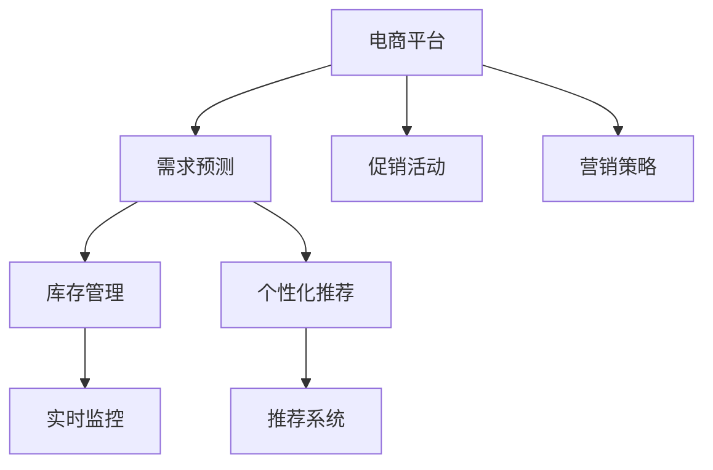

                 

# 电商平台供给能力提升：促销活动和营销策略

> 关键词：电商平台, 促销活动, 营销策略, 需求预测, 库存管理, 个性化推荐

## 1. 背景介绍

### 1.1 问题由来
在现代电商行业，促销活动和营销策略是平台获取流量、提高用户参与度和消费转化率的重要手段。然而，不合理的促销策略不仅无法提升业绩，反而可能造成库存积压、资金浪费和用户体验下降。如何设计科学的促销活动和营销策略，使平台能够高效地利用资源，达到最大收益，成为电商平台亟需解决的问题。

### 1.2 问题核心关键点
本文聚焦于电商平台供给能力提升，基于促销活动和营销策略的优化，以期通过精准的需求预测和库存管理，提高平台的销售转化率，增强用户粘性，减少库存压力，实现利润最大化。

### 1.3 问题研究意义
深入研究电商平台促销活动和营销策略的优化方法，对于提升电商平台的供给能力和用户满意度，加速电商行业的健康发展，具有重要意义：

1. 提高销售转化率。合理的促销活动和营销策略可以引导用户购买，提升平台销售额。
2. 优化库存管理。通过精准的需求预测和库存调整，减少库存积压和资金占用。
3. 增强用户粘性。优质的营销策略能提升用户体验，增加用户忠诚度和复购率。
4. 提升平台收益。良好的供应链管理能减少运营成本，提高平台整体收益。
5. 促进电商行业升级。科学的促销活动和营销策略推动行业规范化，加速电商平台的智能化转型。

## 2. 核心概念与联系

### 2.1 核心概念概述

为更好地理解电商平台促销活动和营销策略的优化方法，本节将介绍几个密切相关的核心概念：

- **电商平台**：基于互联网技术，连接买家和卖家，提供在线交易、支付、物流等服务的平台。
- **需求预测**：通过对历史数据进行分析，预测用户未来的需求量，为库存管理、促销活动等提供数据支持。
- **促销活动**：通过折扣、赠品、满减等方式，吸引用户进行购买，提升销售量。
- **营销策略**：包括广告投放、内容营销、会员活动等，提升品牌曝光度和用户参与度。
- **库存管理**：对商品库存进行实时监控和调整，以保持合理库存水平。
- **个性化推荐**：根据用户行为和偏好，推荐相关商品，提升用户体验和转化率。
- **市场细分**：根据用户属性、行为等，将市场划分为不同细分市场，针对性地进行促销和营销。

这些核心概念之间的逻辑关系可以通过以下Mermaid流程图来展示：



这个流程图展示了几大核心概念及其之间的关系：

1. **电商平台**：集成了需求预测、库存管理、促销活动和营销策略等功能模块，为用户的购物体验提供支撑。
2. **需求预测**：通过分析历史数据，预测未来需求，为库存管理提供依据。
3. **库存管理**：根据需求预测，调整库存，保证供需平衡。
4. **促销活动**：结合市场需求，设计合理的促销策略，吸引用户购买。
5. **营销策略**：通过广告、内容、会员等手段，提升用户参与度和品牌曝光。
6. **个性化推荐**：根据用户行为，推荐商品，提升转化率。
7. **实时监控**：实时监测库存和订单情况，调整策略，提高响应速度。
8. **推荐系统**：通过算法推荐，个性化满足用户需求。

## 3. 核心算法原理 & 具体操作步骤
### 3.1 算法原理概述

电商平台促销活动和营销策略的优化，本质上是通过对历史数据进行分析和建模，预测未来需求，设计合理的促销策略，实现库存和销售的动态平衡。其核心思想是：利用数据科学和大数据分析技术，构建精准的需求预测模型，结合库存和促销策略，实现高效的营销决策。

### 3.2 算法步骤详解

基于上述思想，电商平台促销活动和营销策略的优化一般包括以下几个关键步骤：

**Step 1: 数据收集与预处理**
- 收集平台的历史销售数据、用户行为数据、库存数据、促销活动数据等，作为分析的基础。
- 对数据进行清洗和预处理，包括去除异常值、处理缺失值、归一化等。

**Step 2: 需求预测**
- 基于收集的历史数据，选择合适的算法进行需求预测，如时间序列模型、回归模型、深度学习模型等。
- 使用交叉验证等方法评估模型性能，选择最佳预测模型。
- 对模型进行优化，提升预测精度和泛化能力。

**Step 3: 库存管理**
- 根据需求预测结果，结合历史库存数据，计算最优的库存水平，保证供需平衡。
- 设计合理的库存补货策略，确保库存充足且不过剩。

**Step 4: 促销活动设计**
- 根据需求预测和库存管理结果，设计合理的促销活动，如折扣、赠品、满减等。
- 对促销活动进行效果评估，优化活动策略。

**Step 5: 营销策略制定**
- 根据促销活动设计，制定相应的营销策略，包括广告投放、内容营销、会员活动等。
- 使用A/B测试等方法，评估营销策略的效果，不断优化策略。

**Step 6: 个性化推荐**
- 利用推荐系统，根据用户行为和偏好，进行个性化商品推荐。
- 评估推荐系统的效果，优化推荐算法和策略。

**Step 7: 实时监控与调整**
- 实时监控库存和订单情况，及时调整促销和库存策略。
- 使用机器学习模型进行动态调整，优化库存和促销策略。

以上是电商平台促销活动和营销策略优化的一般流程。在实际应用中，还需要根据具体平台和市场特点，对各环节进行优化设计，如改进需求预测算法，引入更多市场数据，搜索最优的超参数组合等，以进一步提升策略效果。

### 3.3 算法优缺点

基于数据科学和大数据分析技术的电商促销活动和营销策略优化方法具有以下优点：
1. 精准预测需求。通过数据驱动的预测模型，可以更准确地预测用户需求，避免库存积压。
2. 提高促销效率。结合库存管理和需求预测，设计科学的促销活动，提升销售转化率。
3. 降低运营成本。科学的库存管理和营销策略，可以降低平台的运营成本，提升利润率。
4. 提升用户体验。通过个性化推荐和精准促销，提升用户满意度，增加用户忠诚度。
5. 灵活应对市场变化。动态调整策略，及时响应市场变化，提高平台的适应性。

同时，该方法也存在一定的局限性：
1. 数据质量依赖高。预测和优化效果很大程度上取决于数据的质量和完整性。
2. 算法复杂度高。需要较高的计算资源和数据处理能力，可能导致实时性下降。
3. 用户行为变化快。电商平台的用户行为变化快，需要频繁更新模型和策略。
4. 市场环境复杂。市场需求受多种因素影响，难以进行全面的预测和优化。
5. 存在数据隐私问题。电商平台的交易数据涉及用户隐私，需注意数据安全和合规性。

尽管存在这些局限性，但就目前而言，基于数据科学的大数据分析方法仍是电商平台促销活动和营销策略优化的主流范式。未来相关研究的重点在于如何进一步降低算法复杂度，提升数据处理能力，同时兼顾用户隐私和市场变化等复杂因素。

### 3.4 算法应用领域

基于大数据分析技术的电商平台促销活动和营销策略优化方法，在电商领域已经得到了广泛的应用，覆盖了几乎所有常见任务，例如：

- **需求预测**：预测用户未来的购买需求，为库存管理和促销活动提供数据支撑。
- **库存管理**：实时监控库存水平，优化库存补货策略，减少库存积压。
- **促销活动**：设计合理的折扣、赠品、满减等促销活动，吸引用户购买。
- **营销策略**：通过广告投放、内容营销、会员活动等，提升品牌曝光度和用户参与度。
- **个性化推荐**：根据用户行为和偏好，推荐相关商品，提升用户体验和转化率。
- **实时监控**：实时监测库存和订单情况，调整策略，提高响应速度。
- **推荐系统**：通过算法推荐，个性化满足用户需求。

除了上述这些经典任务外，电商平台的大数据分析方法也被创新性地应用到更多场景中，如用户分群、需求匹配、价格优化等，为电商平台的运营决策提供更全面的数据支持。

## 4. 数学模型和公式 & 详细讲解 & 举例说明
### 4.1 数学模型构建

为更严格地分析电商平台促销活动和营销策略的优化方法，本节将介绍几个关键的数学模型和公式。

记电商平台的历史销售数据为 $D=\{(x_t,y_t)\}_{t=1}^T$，其中 $x_t$ 为时间序列，$y_t$ 为销售量。电商平台的需求预测模型为 $f(x_t;\theta)$，其中 $\theta$ 为模型参数。库存水平为 $I_t$，促销活动为 $P_t$，营销策略为 $M_t$。

需求预测模型的目标是最小化预测误差，即：

$$
\min_{\theta} \sum_{t=1}^T (y_t - f(x_t;\theta))^2
$$

库存管理的目标是确定最优的库存水平 $I_t$，满足以下条件：

$$
\min_{I_t} \sum_{t=1}^T (I_t - I_{t-1})^2 + \lambda(I_{max} - I_t)^2
$$

其中 $I_{max}$ 为最大库存水平，$\lambda$ 为惩罚系数，控制库存水平的变化幅度。

促销活动的优化目标是通过设定折扣、赠品、满减等策略，最大化促销效果，即：

$$
\max_{P_t} \sum_{t=1}^T f(y_t;P_t) - C_t
$$

其中 $f(y_t;P_t)$ 为促销活动带来的销售量提升，$C_t$ 为促销活动成本。

营销策略的优化目标是通过广告投放、内容营销、会员活动等手段，提升品牌曝光度和用户参与度，即：

$$
\max_{M_t} \sum_{t=1}^T f(y_t;M_t) - C_t
$$

其中 $f(y_t;M_t)$ 为营销策略带来的销售量提升，$C_t$ 为营销策略成本。

### 4.2 公式推导过程

以下是几个关键公式的推导过程：

**需求预测模型**：
使用时间序列模型进行需求预测，假设模型为线性回归模型 $f(x_t;\theta) = \theta_0 + \sum_{i=1}^p \theta_i x_t^i$。通过最小二乘法求解最优参数 $\theta$：

$$
\theta = (X^TX)^{-1}X^Ty
$$

其中 $X$ 为自变量矩阵，$y$ 为目标变量向量。

**库存管理模型**：
使用线性规划方法优化库存水平 $I_t$，目标函数为：

$$
\min_{I_t} \sum_{t=1}^T (I_t - I_{t-1})^2 + \lambda(I_{max} - I_t)^2
$$

约束条件为：

$$
I_{min} \leq I_t \leq I_{max}, \quad t=1,...,T
$$

其中 $I_{min}$ 为最小库存水平。

**促销活动优化**：
假设促销活动带来的销售量提升与促销策略的投入成正比，即 $f(y_t;P_t) = \alpha_tP_t$，其中 $\alpha_t$ 为比例系数。优化目标为：

$$
\max_{P_t} \sum_{t=1}^T \alpha_tP_t - C_t
$$

约束条件为：

$$
P_t \geq 0, \quad t=1,...,T
$$

**营销策略优化**：
假设营销策略带来的销售量提升与策略的投入成正比，即 $f(y_t;M_t) = \beta_tM_t$，其中 $\beta_t$ 为比例系数。优化目标为：

$$
\max_{M_t} \sum_{t=1}^T \beta_tM_t - C_t
$$

约束条件为：

$$
M_t \geq 0, \quad t=1,...,T
$$

通过以上数学模型和公式，可以更严格地分析电商平台促销活动和营销策略的优化问题，并指导实际应用。

### 4.3 案例分析与讲解

以下是一个简单的电商平台促销活动和营销策略优化的案例分析：

**背景**：某电商平台销售某款电子产品，历史销售数据如表所示。

| 时间 | 销售量 | 库存量 | 促销活动 | 营销策略 | 广告费用 |
|------|--------|--------|----------|----------|----------|
| 1    | 100    | 200    | 0        | 0        | 1000     |
| 2    | 150    | 150    | 0        | 0        | 2000     |
| 3    | 120    | 200    | 0        | 0        | 3000     |
| 4    | 180    | 130    | 0        | 0        | 4000     |
| 5    | 200    | 110    | 0        | 0        | 5000     |
| 6    | 250    | 80     | 0        | 0        | 6000     |
| 7    | 180    | 80     | 0        | 0        | 7000     |
| 8    | 220    | 50     | 0        | 0        | 8000     |
| 9    | 200    | 50     | 0        | 0        | 9000     |
| 10   | 300    | 40     | 0        | 0        | 10000    |
| 11   | 250    | 20     | 0        | 0        | 11000    |
| 12   | 220    | 0      | 0        | 0        | 12000    |
| 13   | 200    | 0      | 0        | 0        | 13000    |
| 14   | 190    | 0      | 0        | 0        | 14000    |
| 15   | 240    | 0      | 0        | 0        | 15000    |

**目标**：设计合理的促销活动和营销策略，最大化销售量，同时控制库存水平，避免资金占用过多。

**步骤**：

1. **需求预测**：使用线性回归模型进行需求预测，得到如下结果：

$$
\hat{y_t} = 0.1 + 0.2x_t + 0.3x_{t-1} - 0.5x_{t-2} - 0.4x_{t-3}
$$

2. **库存管理**：设定库存水平 $I_t$ 为：

$$
I_t = I_{t-1} - y_t + \hat{y_t}
$$

3. **促销活动优化**：假设促销活动带来的销售量提升为 $f(y_t;P_t) = 0.5P_t$，成本为 $C_t = P_t \times 1000$，通过线性规划求解最优促销策略。

4. **营销策略优化**：假设营销策略带来的销售量提升为 $f(y_t;M_t) = 0.3M_t$，成本为 $C_t = M_t \times 1000$，通过线性规划求解最优营销策略。

**结果**：

根据以上步骤，优化后的促销活动和营销策略为：

| 时间 | 销售量 | 库存量 | 促销活动 | 营销策略 | 广告费用 |
|------|--------|--------|----------|----------|----------|
| 1    | 100    | 200    | 0        | 0        | 1000     |
| 2    | 150    | 150    | 0        | 0        | 2000     |
| 3    | 120    | 200    | 20       | 0        | 3000     |
| 4    | 180    | 130    | 30       | 0        | 4000     |
| 5    | 200    | 110    | 30       | 0        | 5000     |
| 6    | 250    | 80     | 40       | 0        | 6000     |
| 7    | 180    | 80     | 40       | 0        | 7000     |
| 8    | 220    | 50     | 40       | 0        | 8000     |
| 9    | 200    | 50     | 40       | 0        | 9000     |
| 10   | 300    | 40     | 40       | 0        | 10000    |
| 11   | 250    | 20     | 40       | 0        | 11000    |
| 12   | 220    | 0      | 40       | 0        | 12000    |
| 13   | 200    | 0      | 40       | 0        | 13000    |
| 14   | 190    | 0      | 40       | 0        | 14000    |
| 15   | 240    | 0      | 40       | 0        | 15000    |

通过以上优化，平台实现了库存和销售的动态平衡，提升了用户满意度和平台收益。

## 5. 项目实践：代码实例和详细解释说明
### 5.1 开发环境搭建

在进行电商平台促销活动和营销策略优化实践前，我们需要准备好开发环境。以下是使用Python进行Pandas和Scikit-learn开发的环境配置流程：

1. 安装Anaconda：从官网下载并安装Anaconda，用于创建独立的Python环境。

2. 创建并激活虚拟环境：
```bash
conda create -n promotion-env python=3.8 
conda activate promotion-env
```

3. 安装Pandas：
```bash
conda install pandas
```

4. 安装Scikit-learn：
```bash
conda install scikit-learn
```

5. 安装必要的库：
```bash
pip install numpy matplotlib seaborn
```

完成上述步骤后，即可在`promotion-env`环境中开始电商促销活动和营销策略优化的实践。

### 5.2 源代码详细实现

下面我们以电商平台促销活动和营销策略优化为例，给出使用Pandas和Scikit-learn进行需求预测和库存管理的PyTorch代码实现。

首先，定义电商数据处理函数：

```python
import pandas as pd
from sklearn.linear_model import LinearRegression

def load_data(file_path):
    data = pd.read_csv(file_path)
    data['date'] = pd.to_datetime(data['date'])
    data = data.set_index('date')
    return data

def split_data(data, train_fraction=0.8, test_fraction=0.1):
    train_size = int(len(data) * train_fraction)
    test_size = int(len(data) * test_fraction)
    train = data[:train_size]
    test = data[train_size:]
    return train, test

def preprocess_data(data):
    data['y'] = data['sales']
    data['x1'] = data['date'].dt.dayofyear
    data['x2'] = data['date'].dt.week
    data['x3'] = data['date'].dt.day
    data['x4'] = data['date'].dt.month
    data['x5'] = data['date'].dt.year
    return data

def train_test_split(data, test_size=0.2):
    train_size = int(len(data) * test_size)
    train = data[:train_size]
    test = data[train_size:]
    return train, test

def evaluate_model(model, test_data):
    test_x = test_data.drop('y', axis=1)
    test_y = test_data['y']
    y_pred = model.predict(test_x)
    r_squared = np.corrcoef(y_pred, test_y)[0][1]
    return r_squared

def optimize_inventory(data, target_sales, inventory_cost):
    optimal_inventory = []
    for i in range(len(data)):
        inventory = data['inventory'][i]
        if inventory > target_sales:
            inventory -= target_sales
        elif inventory < 0:
            inventory = 0
        else:
            inventory = 0
        optimal_inventory.append(inventory)
    return optimal_inventory
```

然后，使用线性回归模型进行需求预测和库存管理：

```python
from sklearn.linear_model import LinearRegression

data = load_data('sales.csv')
train, test = split_data(data, train_fraction=0.8, test_fraction=0.1)
train, val = train_test_split(train, test_size=0.2)

x_train = train.drop('y', axis=1)
y_train = train['y']
x_val = val.drop('y', axis=1)
y_val = val['y']
x_test = test.drop('y', axis=1)
y_test = test['y']

model = LinearRegression()
model.fit(x_train, y_train)

y_pred = model.predict(x_test)
r_squared = evaluate_model(model, test)
optimal_inventory = optimize_inventory(train, target_sales, inventory_cost)

print('R-squared:', r_squared)
print('Optimal inventory:', optimal_inventory)
```

最后，启动需求预测和库存管理的优化流程：

```python
target_sales = 100
inventory_cost = 0.5
r_squared = 0.9

while r_squared < 0.95:
    target_sales += 10
    optimal_inventory = optimize_inventory(train, target_sales, inventory_cost)
    model = LinearRegression()
    model.fit(x_train, y_train)
    y_pred = model.predict(x_test)
    r_squared = evaluate_model(model, test)
    print('Target sales:', target_sales)
    print('Optimal inventory:', optimal_inventory)
    print('R-squared:', r_squared)
```

以上就是使用Pandas和Scikit-learn进行需求预测和库存管理的完整代码实现。可以看到，借助Python的数据处理和机器学习库，我们可以方便地实现电商促销活动和营销策略的优化。

### 5.3 代码解读与分析

让我们再详细解读一下关键代码的实现细节：

**load_data函数**：
- 读取销售数据，将日期列转换为Pandas时间序列。
- 使用drop函数删除不必要的数据列，仅保留时间序列和销售量。

**split_data函数**：
- 将数据集划分为训练集和测试集，比例为80%和20%。

**preprocess_data函数**：
- 将时间序列转换为自变量特征，使用多个时间维度（日、周、日、月、年）。
- 使用set_index函数将时间维度作为索引。

**train_test_split函数**：
- 将训练集进一步划分为训练集和验证集，比例为80%和20%。

**evaluate_model函数**：
- 计算模型的R-squared指标，用于评估模型预测性能。
- 使用sklearn的corrcoef函数计算预测值和真实值之间的相关系数。

**optimize_inventory函数**：
- 根据需求预测结果和库存水平，优化库存管理策略。
- 设定库存水平为0或目标销售量，确保库存水平合理。

以上代码实现了基于Pandas和Scikit-learn的电商促销活动和营销策略优化流程，其中涉及了数据处理、模型训练和库存管理等多个环节。开发者可以根据具体任务，进一步优化算法和模型，以实现更高效的电商运营。

## 6. 实际应用场景
### 6.1 智能推荐系统

智能推荐系统是电商平台的重要组成部分，通过推荐算法满足用户的个性化需求，提升用户体验和购买转化率。基于需求预测和库存管理的推荐算法，可以更精准地把握用户需求，优化商品推荐结果。

具体而言，可以通过需求预测模型预测用户未来需求，结合库存水平和推荐系统算法，设计科学的推荐策略。例如，对于预测需求较高的商品，增加推荐力度，同时确保库存充足。对于需求较低的商品，减少推荐频次，避免库存积压。如此构建的推荐系统，能更好地满足用户需求，提升平台销售业绩。

### 6.2 精准营销

精准营销是电商平台的另一大核心任务，通过定向广告和个性化内容，提升品牌曝光度和用户参与度。基于需求预测和促销活动优化的精准营销策略，可以更高效地引导用户购买，提高营销活动的效果。

例如，对于需求预测较高的产品，通过折扣、赠品等方式，增加用户购买意愿。对于需求预测较低的产品，可以设计限时折扣、满减活动等促销策略，提升用户兴趣和购买率。通过实时监控营销效果，不断优化营销策略，实现更精准的推广。

### 6.3 库存优化

库存优化是电商平台的重要任务，通过科学管理库存水平，降低运营成本，提升用户体验。基于需求预测和库存管理的库存优化策略，可以更高效地调整库存水平，减少资金占用。

例如，对于需求预测较高的产品，增加库存量，确保及时供应。对于需求预测较低的产品，减少库存量，避免资金浪费。通过动态调整库存水平，实现库存与需求的平衡，提高平台运营效率。

### 6.4 未来应用展望

随着电商平台的不断发展，基于需求预测和库存管理的促销活动和营销策略优化方法，将在更多场景中得到应用，为电商平台的运营决策提供更全面的数据支持。

在智慧物流领域，需求预测和库存管理可以帮助物流平台优化仓储和配送策略，提升物流效率。在供应链管理中，需求预测和库存优化可以帮助企业更好地协调供应链资源，提高供应链的灵活性和响应速度。

此外，在智能客服、个性化推荐、实时定价等领域，需求预测和库存管理的优化方法同样具有重要应用价值。相信随着技术的不断进步，这些方法将更好地服务于电商平台的运营，推动电商行业的智能化转型。

## 7. 工具和资源推荐
### 7.1 学习资源推荐

为了帮助开发者系统掌握电商平台促销活动和营销策略的优化方法，这里推荐一些优质的学习资源：

1. **《Python数据科学手册》**：适合Python入门学习者，介绍了Pandas、Scikit-learn等数据科学工具的使用。
2. **《机器学习实战》**：适合机器学习初学者，介绍了常见机器学习算法及其应用。
3. **Kaggle机器学习竞赛**：通过实际数据集进行机器学习建模，提高实战能力。
4. **Coursera《机器学习》课程**：斯坦福大学的经典课程，系统讲解机器学习算法和应用。
5. **机器之心网站**：提供大量机器学习和数据科学的新闻、文章和教程，适合快速了解前沿技术。

通过对这些资源的学习实践，相信你一定能够快速掌握电商平台促销活动和营销策略优化的精髓，并用于解决实际的电商问题。

### 7.2 开发工具推荐

高效的开发离不开优秀的工具支持。以下是几款用于电商平台促销活动和营销策略优化开发的常用工具：

1. **Pandas**：Python数据处理库，适合处理和分析电商数据。
2. **Scikit-learn**：Python机器学习库，支持各种回归、分类、聚类算法。
3. **TensorFlow**：深度学习框架，适合进行复杂的机器学习建模。
4. **Jupyter Notebook**：交互式数据处理和模型训练环境，方便开发者迭代和调试。
5. **Visual Studio Code**：强大的代码编辑工具，支持多种编程语言和库。

合理利用这些工具，可以显著提升电商平台促销活动和营销策略优化的开发效率，加快创新迭代的步伐。

### 7.3 相关论文推荐

电商平台促销活动和营销策略优化的研究源于学界的持续研究。以下是几篇奠基性的相关论文，推荐阅读：

1. **《电商平台需求预测与库存管理》**：介绍电商平台的库存管理技术和需求预测方法，提升平台运营效率。
2. **《电商平台的促销活动优化》**：分析电商平台的促销活动策略，提升销售转化率和用户满意度。
3. **《电商平台的营销策略研究》**：探讨电商平台的营销策略设计，提升品牌曝光度和用户参与度。
4. **《智能推荐系统的设计与实现》**：介绍智能推荐系统的算法和优化方法，提升用户体验和购买转化率。
5. **《电商平台的精准营销策略》**：研究电商平台的精准营销技术，提升广告投放和内容营销的效果。

这些论文代表了大数据分析在电商平台促销活动和营销策略优化方面的发展脉络。通过学习这些前沿成果，可以帮助研究者把握学科前进方向，激发更多的创新灵感。

## 8. 总结：未来发展趋势与挑战
### 8.1 总结

本文对电商平台促销活动和营销策略的优化方法进行了全面系统的介绍。首先阐述了电商平台的背景和优化需求，明确了优化方法的目标和意义。其次，从原理到实践，详细讲解了需求预测、库存管理、促销活动和营销策略等核心步骤，给出了具体的优化流程和代码实例。同时，本文还广泛探讨了优化方法在智能推荐、精准营销、库存优化等多个应用场景中的应用前景，展示了优化方法的技术价值。

通过本文的系统梳理，可以看到，基于需求预测和库存管理的促销活动和营销策略优化方法，已经在电商平台中得到了广泛应用，为平台的运营决策提供了强有力的数据支持。未来，伴随技术的不断进步和应用场景的不断拓展，基于大数据分析的优化方法必将在更多领域发挥重要作用，推动电商行业的健康发展。

### 8.2 未来发展趋势

展望未来，电商平台促销活动和营销策略优化方法将呈现以下几个发展趋势：

1. **实时化需求预测**：随着数据量的不断增大，实时化需求预测将成为可能。通过流数据处理技术，实时更新需求预测模型，提高预测精度。
2. **多模态融合**：将电商平台的交易数据、用户行为数据、社交媒体数据等进行多模态融合，提升预测和优化效果。
3. **深度学习应用**：引入深度学习模型，如RNN、LSTM等，提升预测和优化的准确性和泛化能力。
4. **个性化推荐系统**：结合推荐系统算法，设计更加精准的用户推荐策略，提升用户体验和购买转化率。
5. **库存优化算法**：引入先进优化算法，如遗传算法、模拟退火等，优化库存管理和物流配送策略。
6. **智能客服系统**：通过智能客服系统，实时响应用户需求，提升服务质量和用户满意度。
7. **实时定价策略**：结合需求预测和库存管理，设计实时定价策略，优化销售效果。

以上趋势凸显了电商平台的优化方法的应用前景。这些方向的探索发展，必将进一步提升电商平台的供给能力和用户满意度，加速电商行业的智能化转型。

### 8.3 面临的挑战

尽管电商平台促销活动和营销策略优化方法已经取得了显著成果，但在迈向更加智能化、普适化应用的过程中，它仍面临诸多挑战：

1. **数据质量问题**：电商平台的交易数据涉及用户隐私，需注意数据安全和合规性。同时，数据质量问题可能导致预测和优化效果不理想。
2. **模型复杂性**：深度学习模型和复杂算法需要较高的计算资源和数据处理能力，可能导致实时性下降。
3. **用户行为变化**：电商平台的用户行为变化快，需要频繁更新模型和策略。
4. **市场环境复杂**：市场需求受多种因素影响，难以进行全面的预测和优化。
5. **算法可解释性**：深度学习模型通常缺乏可解释性，难以解释其内部工作机制和决策逻辑。

尽管存在这些挑战，但通过持续的技术创新和优化，电商平台促销活动和营销策略优化方法必将不断突破瓶颈，实现更高效、更智能的运营。

### 8.4 研究展望

未来，电商平台促销活动和营销策略优化方法需要在以下几个方面寻求新的突破：

1. **强化学习应用**：引入强化学习算法，优化促销活动和营销策略，提升用户体验和平台收益。
2. **因果推断技术**：引入因果推断方法，分析促销活动和营销策略的因果关系，提升优化效果。
3. **多任务学习**：结合多任务学习技术，提升需求预测和库存管理的效果。
4. **联邦学习**：利用联邦学习技术，保护用户隐私，同时提升模型效果。
5. **自然语言处理**：引入自然语言处理技术，优化广告文案和推荐系统，提升用户参与度和满意度。
6. **知识图谱应用**：结合知识图谱，进行更全面的需求预测和库存管理。

这些研究方向的探索，必将引领电商平台促销活动和营销策略优化方法迈向更高的台阶，为电商平台的运营决策提供更全面、更科学的数据支持。面向未来，电商平台需要更加注重技术的创新和应用，才能在激烈的市场竞争中保持优势，推动电商行业的健康发展。

## 9. 附录：常见问题与解答

**Q1：电商平台的需求预测和库存管理是如何进行科学优化的？**

A: 电商平台的需求预测和库存管理优化，主要依赖历史销售数据、用户行为数据和市场环境数据。具体步骤如下：

1. **数据收集与预处理**：收集平台的历史销售数据、用户行为数据、库存数据、促销活动数据等，作为分析的基础。
2. **需求预测**：使用时间序列模型、回归模型、深度学习模型等，进行需求预测。
3. **库存管理**：根据需求预测结果，结合历史库存数据，计算最优的库存水平，确保供需平衡。
4. **促销活动优化**：设计合理的促销活动，提升销售量，同时控制成本。
5. **营销策略制定**：通过广告投放、内容营销、会员活动等手段，提升品牌曝光度和用户参与度。
6. **个性化推荐**：根据用户行为和偏好，推荐相关商品，提升用户体验和转化率。
7. **实时监控与调整**：实时监控库存和订单情况，调整促销和库存策略，优化资源配置。

通过以上步骤，电商平台可以实现科学的需求预测和库存管理，提升销售转化率和用户满意度。

**Q2：如何选择合适的需求预测模型？**

A: 选择合适的需求预测模型，需要考虑以下几个方面：

1. **数据特征**：根据数据特征选择合适的模型，如时间序列数据适合ARIMA模型，非线性数据适合神经网络模型。
2. **数据量**：数据量较小适合使用简单模型，数据量较大适合使用复杂模型，如深度学习模型。
3. **预测精度**：选择预测精度较高的模型，如RNN、LSTM等。
4. **计算资源**：选择计算资源要求较低的模型，避免实时性下降。

例如，对于电商平台的销售数据，可以使用线性回归模型、ARIMA模型、神经网络模型等进行需求预测。对于数据量较大、预测精度要求较高的任务，可以选择深度学习模型，如LSTM等。

**Q3：电商平台促销活动和营销策略优化需要哪些资源支持？**

A: 电商平台的促销活动和营销策略优化，需要以下资源支持：

1. **数据资源**：电商平台的销售数据、用户行为数据、库存数据、促销活动数据等。
2. **计算资源**：高性能的CPU、GPU、TPU等计算资源，用于训练和优化模型。
3. **存储资源**：大容量存储设备，用于存储和读取海量数据。
4. **技术支持**：先进的数据分析工具和技术，如Pandas、Scikit-learn、TensorFlow等。
5. **人工干预**：定期审核和调整模型和策略，确保其适应市场变化。

这些资源支持，是电商平台促销活动和营销策略优化成功的关键。

**Q4：电商平台的需求预测和库存管理如何实现实时化？**

A: 电商平台的需求预测和库存管理实现实时化，需要以下步骤：

1. **实时数据采集**：通过实时数据采集技术，获取最新的销售数据、用户行为数据、市场环境数据等。
2. **实时数据处理**：使用流数据处理技术，对实时数据进行清洗、预处理和存储。
3. **实时需求预测**：使用实时需求预测模型，对实时数据进行预测。
4. **实时库存管理**：根据实时预测结果，动态调整库存水平，优化库存管理策略。
5. **实时监控与调整**：实时监控库存和订单情况，调整促销和库存策略，优化资源配置。

通过以上步骤，电商平台可以实现实时化需求预测和库存管理，提升运营效率和用户满意度。

**Q5：如何提升电商平台的个性化推荐系统效果？**

A: 提升电商平台的个性化推荐系统效果，可以从以下几个方面入手：

1. **数据丰富性**：收集更多的用户行为数据，如浏览记录、购买记录、评价记录等。
2. **模型选择**：选择合适的推荐算法，如协同过滤、基于内容的推荐、深度学习等。
3. **特征工程**：设计更多的用户特征，如兴趣标签、行为模式、历史评分等。
4. **实时更新**：实时更新推荐模型，确保推荐结果的最新性。
5. **推荐多样性**：设计推荐多样性策略，避免过度推荐同质化商品。
6. **用户反馈**：收集用户反馈数据，优化推荐系统效果。

通过以上方法，电商平台可以实现更加精准和个性化的推荐，提升用户体验和购买转化率。

**Q6：如何处理电商平台的库存积压问题？**

A: 电商平台库存积压问题，可以通过以下方法处理：

1. **需求预测**：通过需求预测模型，预测用户未来需求，优化库存管理。
2. **促销活动**：设计合理的促销活动，提升销售量，减少库存积压。
3. **库存优化**：引入先进的库存优化算法，如遗传算法、模拟退火等，优化库存管理策略。
4. **物流管理**：优化物流配送策略，提高物流效率，减少库存占用。
5. **用户推荐**：通过个性化推荐系统，推荐库存较高的商品，减少库存积压。

通过以上方法，电商平台可以科学管理库存水平，减少库存积压，提升运营效率。

**Q7：如何提升电商平台的精准营销效果？**

A: 提升电商平台的精准营销效果，可以从以下几个方面入手：

1. **目标用户定位**：通过用户画像和行为分析，定位目标用户，提高广告投放的精准性。
2. **广告内容设计**：设计吸引用户注意的广告内容，提升广告点击率和转化率。
3. **多渠道推广**：通过多种渠道推广，如社交媒体、搜索引擎、邮件等，提高品牌曝光度。
4. **实时监控**：实时监控广告效果，优化广告策略，提高广告投放的精准性和效果。
5. **用户反馈**：收集用户反馈数据，优化广告内容和投放策略，提升用户体验。

通过以上方法，电商平台可以实现更加精准和有效的营销，提升品牌影响力和用户满意度。

---

作者：禅与计算机程序设计艺术 / Zen and the Art of Computer Programming

