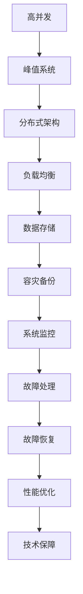

                 

# 电商重要活动技术保障：高并发的峰值系统问题解决

> 关键词：高并发, 峰值系统, 技术保障, 故障处理, 性能优化, 分布式架构, 负载均衡, 数据存储, 容灾备份, 系统监控, 故障恢复

## 1. 背景介绍

在电商领域，一次重大活动往往带来海量的订单和流量，这对系统的高并发性能提出了严峻的挑战。特别是在诸如双十一、黑色星期五等全球知名电商节时，系统需要承受高并发的峰值压力，这对技术保障提出了极高的要求。如何设计并构建一个能够应对高并发挑战的系统，是每一个电商技术团队必须解决的核心问题。本文将从核心概念、算法原理、具体实践等角度，深入探讨高并发峰值系统的技术保障问题。

## 2. 核心概念与联系

### 2.1 核心概念概述

为了更好地理解高并发峰值系统的技术保障，我们需要了解一些核心概念：

- **高并发（High Concurrency）**：在单位时间内，系统需要处理的请求数量极大，常用于描述网络应用、数据库等系统。
- **峰值系统（Peak System）**：指在特定时间点或时间段内，系统负载达到最大值的系统。
- **技术保障（Technical Guarantee）**：通过一系列技术和措施，确保系统在高峰期稳定运行，业务不受影响。
- **故障处理（Fault Handling）**：在故障发生时，快速定位、分析和处理，以最小化故障影响。
- **性能优化（Performance Optimization）**：通过对系统结构、算法等优化，提升系统的响应速度和处理能力。
- **分布式架构（Distributed Architecture）**：通过多台服务器、多数据中心，实现系统的分布式部署，提高系统的可用性和扩展性。
- **负载均衡（Load Balancing）**：通过算法或设备，将负载均衡地分配到多台服务器，提升系统的处理能力。
- **数据存储（Data Storage）**：包括关系型数据库、NoSQL数据库、缓存等，用于存储和管理数据。
- **容灾备份（Disaster Recovery）**：通过多数据中心、数据备份等手段，确保数据的冗余和系统的高可用性。
- **系统监控（System Monitoring）**：实时监控系统性能，预警故障，提供故障诊断依据。
- **故障恢复（Fault Recovery）**：在故障发生后，快速恢复系统，确保业务的连续性。

这些概念紧密相连，构建了一个系统的技术保障体系。在实际应用中，需要根据具体业务需求，选择合适的技术手段，构建并维护一个能够有效应对高并发峰值挑战的系统。

### 2.2 核心概念原理和架构的 Mermaid 流程图



这张流程图展示了高并发峰值系统的技术保障体系，从高并发开始，通过分布式架构、负载均衡、数据存储、容灾备份、系统监控、故障处理、故障恢复和性能优化等环节，构建一个能够应对高并发挑战的系统。

## 3. 核心算法原理 & 具体操作步骤

### 3.1 算法原理概述

高并发峰值系统的技术保障，本质上是一个多维度、多层次的综合性问题。其核心思想是通过合理设计系统架构，选择合适的技术和算法，实现系统的快速响应、稳定运行和高效处理。

高并发系统的设计原则包括：

- **弹性设计**：系统应具备高度的扩展性，能够根据负载动态调整资源。
- **冗余备份**：关键组件应具备冗余设计，确保在单点故障时系统仍能正常运行。
- **负载均衡**：通过合理的负载均衡算法，分散系统负载，提升系统的处理能力。
- **数据存储优化**：使用高效的数据存储技术，减少读写延迟，提升系统性能。
- **故障容忍与快速恢复**：系统应具备一定的故障容忍度，并能够在故障发生后快速恢复。
- **性能监控与优化**：实时监控系统性能，根据实时数据进行性能优化。

### 3.2 算法步骤详解

构建高并发峰值系统的技术保障体系，一般包括以下几个关键步骤：

**Step 1: 需求分析与系统设计**

- 明确电商活动预期流量和并发量，评估当前系统的承载能力。
- 确定关键组件（如数据库、缓存、消息队列等）的性能需求和冗余设计。
- 设计系统的扩展性和容灾备份策略。

**Step 2: 架构选型与组件配置**

- 根据需求分析结果，选择合适的技术架构，如微服务、微内核等。
- 配置各组件的参数，如数据库连接数、缓存大小、消息队列深度等。
- 设计负载均衡策略，如轮询、加权轮询、IPHash等。

**Step 3: 性能调优与负载均衡**

- 通过性能测试，找到系统瓶颈，进行针对性优化，如缓存、数据库查询优化等。
- 使用负载均衡算法，将请求合理分发到多个节点上。
- 设计动态资源调整策略，根据实时负载动态调整资源分配。

**Step 4: 数据存储与容灾备份**

- 选择合适的数据存储技术，如MySQL、Redis、MongoDB等。
- 设计数据分片、复制、备份等策略，确保数据的安全性和高可用性。
- 建立容灾备份机制，定期备份关键数据，确保在灾难发生时能够快速恢复。

**Step 5: 故障处理与恢复**

- 设计监控告警机制，实时监控系统状态，提前预警故障。
- 制定故障处理流程，快速定位和解决故障。
- 设计故障恢复机制，如自动重启、数据回滚等，确保业务连续性。

**Step 6: 持续监控与优化**

- 持续监控系统性能，实时收集数据。
- 根据监控数据进行性能优化，如缓存策略、数据库查询优化等。
- 定期评估系统性能，进行模型预测和改进。

### 3.3 算法优缺点

高并发峰值系统的技术保障体系具有以下优点：

- 高度的扩展性：系统能够根据负载动态调整资源，提升系统的扩展能力。
- 高可用性：通过冗余备份和容灾备份，确保系统的稳定性和高可用性。
- 快速恢复：在故障发生后，能够快速定位和解决故障，确保业务的连续性。
- 性能优化：通过持续监控和优化，提升系统的响应速度和处理能力。

同时，该体系也存在一定的局限性：

- 设计复杂：构建高并发系统需要多维度设计和多层次优化，设计复杂度较高。
- 资源消耗大：由于冗余和备份机制，系统资源消耗较大，需要较高的硬件投入。
- 维护成本高：系统复杂度提升，维护成本和复杂度也随之增加。
- 预测难度高：高并发系统负载波动大，预测和调整的难度较高。

### 3.4 算法应用领域

高并发峰值系统的技术保障体系，广泛应用于电商、金融、社交网络、游戏等高流量业务场景。这些系统在高并发峰值期间，需要保证业务的连续性和稳定性，系统设计和技术保障的策略大同小异。

## 4. 数学模型和公式 & 详细讲解 & 举例说明

### 4.1 数学模型构建

高并发峰值系统的技术保障，涉及多个子系统，包括请求处理、数据存储、缓存、负载均衡等。每个子系统都有其特定的性能指标和优化目标。因此，需要构建多个数学模型，分别对每个子系统进行建模和优化。

以电商平台的订单系统为例，可以构建以下模型：

- **请求处理模型**：描述订单处理请求的到达率和响应时间，建立泊松分布和指数分布的混合模型。
- **缓存模型**：描述缓存的使用情况，建立二项分布和负指数分布的混合模型。
- **数据存储模型**：描述数据库的读写延迟，建立Markov模型和M/M/1模型。
- **负载均衡模型**：描述请求的负载均衡情况，建立随机选择和加权轮询的混合模型。

### 4.2 公式推导过程

以订单系统为例，订单请求到达的泊松分布和响应时间的指数分布混合模型可以表示为：

$$
Poisson(\lambda) + Exp(\mu)
$$

其中 $\lambda$ 为单位时间的请求到达率，$\mu$ 为响应时间的期望值。

请求到达率 $\lambda$ 可以通过统计订单处理系统的历史请求数据得到。响应时间 $\mu$ 可以通过统计订单处理系统的平均响应时间得到。

### 4.3 案例分析与讲解

假设订单系统的平均响应时间为20毫秒，平均请求到达率为每秒10个请求。则该系统的请求处理模型可以表示为：

$$
Poisson(10) + Exp(20 \times 10^{-3})
$$

在高峰期，订单系统的负载率可能达到100%，此时需要根据负载均衡策略，将请求分配到多个服务器上。假设订单系统有4台服务器，使用加权轮询策略，则每台服务器的请求负载可以表示为：

$$
\frac{10}{4} + Exp(\frac{20}{4} \times 10^{-3})
$$

## 5. 项目实践：代码实例和详细解释说明

### 5.1 开发环境搭建

为了进行高并发峰值系统的技术保障实践，需要搭建以下开发环境：

1. **服务器环境**：搭建多个服务器节点，用于部署订单处理系统、缓存系统、数据库系统等。
2. **监控系统**：使用ELK Stack（Elasticsearch、Logstash、Kibana）等工具，实时监控系统性能。
3. **负载均衡系统**：使用Nginx、HAProxy等工具，实现请求的负载均衡。
4. **数据库系统**：使用MySQL、Redis等关系型和NoSQL数据库。
5. **缓存系统**：使用Redis、Memcached等缓存系统，减少数据库的读写延迟。
6. **消息队列**：使用RabbitMQ、Kafka等消息队列，实现异步处理和系统解耦。

### 5.2 源代码详细实现

以订单系统为例，以下是一个使用Python编写的订单处理服务：

```python
from flask import Flask, request
from flask_sqlalchemy import SQLAlchemy
from flask_caching import Cache

app = Flask(__name__)
app.config['SQLALCHEMY_DATABASE_URI'] = 'sqlite:////tmp/test.db'
app.config['CACHE_TYPE'] = 'redis'
app.config['CACHE_REDIS_URL'] = 'redis://localhost:6379'

db = SQLAlchemy(app)
cache = Cache(app)

class Order(db.Model):
    id = db.Column(db.Integer, primary_key=True)
    user_id = db.Column(db.Integer)
    product_id = db.Column(db.Integer)
    amount = db.Column(db.Integer)

@app.route('/orders', methods=['POST'])
def create_order():
    user_id = request.json.get('user_id')
    product_id = request.json.get('product_id')
    amount = request.json.get('amount')

    order = Order(user_id=user_id, product_id=product_id, amount=amount)
    db.session.add(order)
    db.session.commit()

    cache.set('order_created', True, timeout=300)

    return {'message': 'Order created successfully'}, 200

if __name__ == '__main__':
    app.run(debug=True)
```

### 5.3 代码解读与分析

该代码实现了一个简单的订单处理服务，使用Flask框架构建RESTful API接口。具体分析如下：

- **Flask框架**：使用Flask框架，构建RESTful API接口，方便接入外部系统。
- **SQLAlchemy**：使用SQLAlchemy，进行数据库操作，方便快速构建订单模型。
- **Redis缓存**：使用Redis缓存，减少数据库的读写延迟，提升系统性能。
- **缓存机制**：在订单创建成功后，使用Redis缓存进行标记，确保订单状态的一致性。

### 5.4 运行结果展示

该订单处理服务可以在多台服务器上部署，并使用Nginx进行负载均衡。使用ELK Stack监控系统性能，实时查看订单系统的请求处理情况和数据库读写情况。

## 6. 实际应用场景

### 6.1 电商活动

在电商活动中，订单系统需要处理海量订单请求，需要具备高并发处理能力。通过设计合理的架构，配置缓存和负载均衡策略，确保订单系统在高并发峰值期间，能够稳定运行，确保订单的正常处理和提交。

### 6.2 金融交易

金融交易系统在高并发期间，需要保证交易的及时性和准确性。通过使用高性能的数据存储技术，设计合理的数据分片、复制策略，确保交易数据的安全性和高可用性。同时，通过实时监控和优化，确保系统在高并发期间，能够快速响应和处理交易请求。

### 6.3 社交网络

社交网络系统需要处理大量的用户请求，如消息推送、好友关系管理等。通过设计合理的分布式架构，使用Redis等缓存系统，实现请求的负载均衡和快速响应，确保系统在高并发期间，能够稳定运行，保证用户体验。

### 6.4 游戏服务

游戏服务在高并发期间，需要处理大量的用户请求，如登录、游戏匹配等。通过设计合理的分布式架构，使用缓存和负载均衡技术，提升系统的处理能力，确保游戏服务在高并发期间，能够稳定运行，保证游戏体验。

## 7. 工具和资源推荐

### 7.1 学习资源推荐

为了帮助开发者系统掌握高并发峰值系统的技术保障，这里推荐一些优质的学习资源：

1. **《高并发系统设计》**：介绍高并发系统设计的基本原则和实践方法，适合初学者入门。
2. **《系统架构设计》**：深入讲解系统架构的设计思路和优化策略，适合有一定经验的开发者。
3. **《分布式系统原理与设计》**：介绍分布式系统原理和设计，适合深入学习分布式架构和算法。
4. **《高可用性系统设计》**：讲解高可用性系统的设计和实现方法，适合实践经验丰富的开发者。
5. **《高性能计算与优化》**：介绍高性能计算和优化的基本原理和技术，适合优化性能的开发者。

通过这些资源的学习实践，相信你一定能够系统掌握高并发峰值系统的技术保障方法，并用于解决实际的系统问题。

### 7.2 开发工具推荐

高并发峰值系统的技术保障，需要借助多种工具来实现。以下是几款常用的开发工具：

1. **Flask框架**：轻量级Web框架，方便快速构建RESTful API接口。
2. **SQLAlchemy**：ORM框架，方便快速进行数据库操作。
3. **Redis缓存**：高性能缓存系统，减少数据库读写延迟。
4. **ELK Stack**：实时监控和日志管理工具，方便实时监控系统性能。
5. **Nginx负载均衡**：高性能负载均衡工具，实现请求的合理分配。
6. **HAProxy**：高性能负载均衡工具，支持多协议和复杂的负载均衡策略。

合理利用这些工具，可以显著提升高并发峰值系统的技术保障效果，加快创新迭代的步伐。

### 7.3 相关论文推荐

高并发峰值系统的技术保障，源于学界的持续研究。以下是几篇经典的相关论文，推荐阅读：

1. **《高并发系统设计》**：系统设计基础，介绍高并发系统的基本概念和设计原则。
2. **《分布式系统原理与设计》**：分布式系统设计，讲解分布式架构和算法。
3. **《高性能计算与优化》**：性能优化基础，介绍性能调优的基本方法。
4. **《高可用性系统设计》**：高可用性设计，讲解高可用性系统的设计和实现方法。
5. **《分布式数据存储》**：数据存储技术，讲解关系型和NoSQL数据库的设计和实现方法。

通过学习这些前沿成果，可以帮助研究者把握学科前进方向，激发更多的创新灵感。

## 8. 总结：未来发展趋势与挑战

### 8.1 研究成果总结

本文对高并发峰值系统的技术保障进行了全面系统的介绍，系统梳理了核心概念和算法原理，提供了完整的实践方案。具体总结如下：

- **需求分析与系统设计**：明确需求，设计系统架构。
- **架构选型与组件配置**：选择合适的架构和组件。
- **性能调优与负载均衡**：优化性能，实现负载均衡。
- **数据存储与容灾备份**：设计数据存储和容灾备份机制。
- **故障处理与恢复**：设计故障处理和恢复机制。
- **持续监控与优化**：实时监控，持续优化。

通过这些步骤，可以构建一个能够应对高并发峰值挑战的系统。

### 8.2 未来发展趋势

展望未来，高并发峰值系统的技术保障将呈现以下几个发展趋势：

1. **云原生架构**：云计算的普及，使得构建高可用、高扩展的系统更加便捷。云原生架构将成为未来高并发系统的主流选择。
2. **微服务架构**：微服务架构能够实现系统的细粒度扩展，提升系统的灵活性和可维护性。
3. **容器化和自动化部署**：容器化和自动化部署技术，能够快速构建、部署和维护高并发系统。
4. **DevOps文化**：DevOps文化能够提升系统的开发和运维效率，加速系统的迭代和优化。
5. **AI和大数据技术**：AI和大数据技术，能够提供更精准的性能分析和优化策略。
6. **区块链技术**：区块链技术，能够提供更高安全性和透明度的系统。

以上趋势将推动高并发峰值系统迈向更加智能化、普适化应用，为业务带来更大的价值。

### 8.3 面临的挑战

尽管高并发峰值系统的技术保障已经取得了不少进展，但在迈向更加智能化、普适化应用的过程中，仍面临诸多挑战：

1. **设计复杂度高**：高并发系统设计复杂度高，需要多维度设计和多层次优化。
2. **资源消耗大**：冗余和备份机制，增加了系统的资源消耗。
3. **维护成本高**：系统复杂度提升，维护成本和复杂度也随之增加。
4. **预测难度高**：高并发系统负载波动大，预测和调整的难度较高。
5. **系统安全性**：高并发系统面临更多的安全威胁，需要加强安全防护措施。

这些挑战需要我们在设计和实践中不断探索和突破，才能构建出更加高效、稳定、安全的高并发峰值系统。

### 8.4 研究展望

面对高并发峰值系统的挑战，未来的研究需要在以下几个方面寻求新的突破：

1. **云原生架构优化**：进一步优化云原生架构，提升系统的可扩展性和灵活性。
2. **微服务架构优化**：进一步优化微服务架构，提升系统的性能和可维护性。
3. **自动化部署技术**：进一步提升自动化部署技术，加速系统的迭代和优化。
4. **AI和大数据技术应用**：进一步应用AI和大数据技术，提升系统的性能分析和优化能力。
5. **区块链技术应用**：进一步探索区块链技术在高并发系统中的应用，提升系统的安全性。
6. **系统监控和故障处理**：进一步提升系统的监控和故障处理能力，确保系统的高可用性。

这些研究方向的探索，将推动高并发峰值系统迈向更高的台阶，为构建安全、可靠、可解释、可控的智能系统铺平道路。

## 9. 附录：常见问题与解答

**Q1: 高并发系统如何进行负载均衡？**

A: 高并发系统的负载均衡，一般通过以下几种方式实现：
1. 轮询（Round Robin）：将请求按顺序分配到多个节点上。
2. 加权轮询（Weighted Round Robin）：根据节点的负载情况，动态调整请求分配。
3. IP Hash：根据请求IP地址，分配到固定的节点上。
4. Least Connections：将请求分配到连接数最少的节点上，避免节点过载。
5. Consistent Hashing：通过哈希算法，实现请求的合理分配和动态扩展。

**Q2: 高并发系统的性能优化有哪些方法？**

A: 高并发系统的性能优化，一般通过以下几种方式实现：
1. 缓存：使用缓存技术，减少数据库的读写延迟。
2. 数据库优化：优化数据库的查询语句和索引，减少查询时间。
3. 负载均衡：使用负载均衡算法，分散系统负载，提升处理能力。
4. 分布式架构：设计合理的分布式架构，提升系统的扩展性。
5. 异步处理：使用消息队列等技术，实现异步处理和系统解耦。
6. 性能监控：实时监控系统性能，根据实时数据进行性能优化。

**Q3: 高并发系统的故障处理有哪些方法？**

A: 高并发系统的故障处理，一般通过以下几种方式实现：
1. 监控告警：实时监控系统状态，提前预警故障。
2. 故障定位：使用日志分析和异常检测，快速定位故障。
3. 故障处理：根据故障类型，采取不同的处理策略，如重启、重连、数据回滚等。
4. 容灾备份：使用多数据中心、数据备份等手段，确保数据的冗余和系统的高可用性。
5. 应急预案：制定应急预案，确保系统故障后快速恢复。

通过这些方法，可以在高并发系统的设计、部署和运维过程中，最大程度地保障系统的稳定性和高可用性。

---

作者：禅与计算机程序设计艺术 / Zen and the Art of Computer Programming

