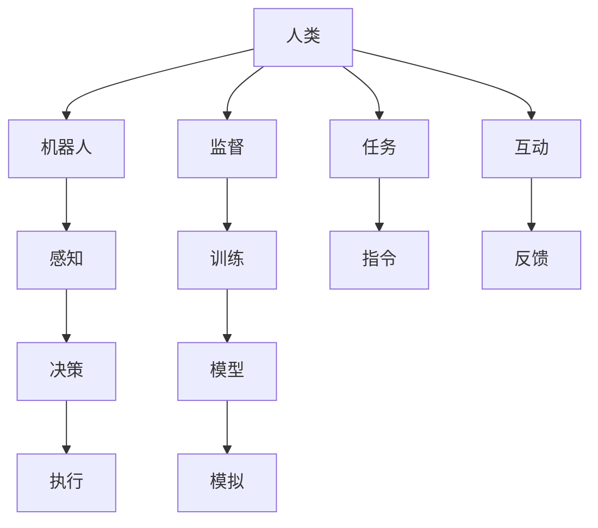

                 

# 电影《我，机器人》与现代AI技术

## 1. 背景介绍

电影《我，机器人》（I, Robot）是一部2004年的科幻电影，基于艾萨克·阿西莫夫（Isaac Asimov）的同名科幻短篇小说集改编。影片由亚历克斯·普罗亚斯（Alex Proyas）执导，威尔·史密斯（Will Smith）主演，探讨了人工智能（AI）与人类之间的关系。故事发生在不远的未来，由机器人看管城市，人类与机器人共存，但两者之间存在着深刻的矛盾。本文将从电影中提取的科幻元素，与现代AI技术进行对比，探讨两者之间的联系与差异。

## 2. 核心概念与联系

### 2.1 核心概念概述

电影《我，机器人》中涉及的核心概念包括：

- **机器人**：具有自主决策和执行能力的智能机器。
- **人工智能**：使机器能够模仿人类智能的技术。
- **三定律**：机器人学家罗宾·威廉姆斯饰演的机器人学家定义的机器人必须遵循的规则，防止机器人伤害人类或违背其他机器人第一定律。

### 2.2 核心概念原理和架构的 Mermaid 流程图



该流程图展示了人类与机器人之间的交互过程。人类给出任务和指令，机器人通过感知、决策和执行三大模块完成指定的任务。监督和训练环节确保机器人模型能够正确理解和执行任务，同时不断优化模型以应对不同的情况。

## 3. 核心算法原理 & 具体操作步骤

### 3.1 算法原理概述

现代AI技术的核心是机器学习算法，其中以深度学习最为流行。深度学习模型通常包含多个隐藏层，通过反向传播算法训练模型参数，使得模型能够自动提取数据中的特征，并用于分类、回归等任务。机器学习模型通常分为监督学习、无监督学习和强化学习三种类型。

### 3.2 算法步骤详解

机器学习模型的训练过程大致可以分为以下步骤：

1. **数据准备**：收集和预处理训练数据。
2. **模型选择**：选择合适的机器学习模型，如神经网络、决策树等。
3. **模型训练**：使用训练数据训练模型，调整模型参数。
4. **模型验证**：使用验证数据评估模型性能，选择最优模型。
5. **模型测试**：使用测试数据评估模型泛化能力。
6. **模型部署**：将模型集成到实际应用中。

### 3.3 算法优缺点

现代AI技术的优点包括：

- 强大的数据处理能力，能够从大量数据中学习到复杂的模式。
- 应用广泛，包括自然语言处理、计算机视觉、语音识别等。
- 自动化程度高，减少人力成本。

缺点包括：

- 需要大量标注数据，数据准备成本高。
- 模型复杂，训练和推理耗时较长。
- 缺乏可解释性，难以理解模型决策过程。

### 3.4 算法应用领域

AI技术在医疗、金融、自动驾驶、工业制造、智慧城市等诸多领域得到了广泛应用。例如，在医疗领域，AI用于疾病诊断、影像识别等；在自动驾驶领域，AI用于环境感知、路径规划等；在智慧城市中，AI用于交通管理、智能安防等。

## 4. 数学模型和公式 & 详细讲解 & 举例说明

### 4.1 数学模型构建

假设有一个线性回归问题，输入数据为 $x_1, x_2, ..., x_n$，目标为 $y$。线性回归模型的形式为 $y = \theta_0 + \theta_1x_1 + \theta_2x_2 + ... + \theta_nx_n$，其中 $\theta$ 为模型参数。模型的目标是最小化预测误差，即 $MSE = \frac{1}{n} \sum_{i=1}^n (y_i - \hat{y}_i)^2$，其中 $\hat{y}_i = \theta_0 + \theta_1x_{1,i} + \theta_2x_{2,i} + ... + \theta_nx_{n,i}$。

### 4.2 公式推导过程

将误差平方和展开，得到：

$$
MSE = \frac{1}{n} \sum_{i=1}^n (y_i - \theta_0 - \theta_1x_{1,i} - \theta_2x_{2,i} - ... - \theta_nx_{n,i})^2
$$

通过求偏导数，得到每个参数的梯度：

$$
\frac{\partial MSE}{\partial \theta_0} = \frac{2}{n} \sum_{i=1}^n (y_i - \hat{y}_i)
$$
$$
\frac{\partial MSE}{\partial \theta_1} = \frac{2}{n} \sum_{i=1}^n (x_{1,i} - \hat{x}_{1,i}) \cdot (y_i - \hat{y}_i)
$$
$$
\frac{\partial MSE}{\partial \theta_2} = \frac{2}{n} \sum_{i=1}^n (x_{2,i} - \hat{x}_{2,i}) \cdot (y_i - \hat{y}_i)
$$
$$
\frac{\partial MSE}{\partial \theta_n} = \frac{2}{n} \sum_{i=1}^n (x_{n,i} - \hat{x}_{n,i}) \cdot (y_i - \hat{y}_i)
$$

使用梯度下降算法更新模型参数：

$$
\theta_j = \theta_j - \eta \frac{\partial MSE}{\partial \theta_j}
$$

其中 $\eta$ 为学习率。

### 4.3 案例分析与讲解

以神经网络为例，考虑一个二分类问题，输入特征 $x$，目标标签 $y \in \{0, 1\}$。使用一个单层神经网络进行分类，输出为 $y = \sigma(\theta_0 + \theta_1x_1 + \theta_2x_2 + ... + \theta_nx_n)$，其中 $\sigma$ 为激活函数，如 sigmoid。假设输入数据 $(x_1, x_2)$，目标标签为 $y=1$。神经网络将输入数据通过多个权重和偏置进行线性变换，并应用激活函数，得到输出结果。通过比较预测值和真实标签，计算交叉熵损失，并通过反向传播算法更新模型参数。

## 5. 项目实践：代码实例和详细解释说明

### 5.1 开发环境搭建

搭建深度学习项目环境需要以下步骤：

1. **安装Python**：Python是深度学习的主要开发语言。
2. **安装TensorFlow或PyTorch**：选择适合的项目框架，如TensorFlow 2.0、PyTorch等。
3. **安装必要的库**：如numpy、scipy、pandas等。
4. **配置GPU环境**：确保有足够的GPU资源。

### 5.2 源代码详细实现

下面是一个简单的线性回归代码示例：

```python
import numpy as np
from sklearn.linear_model import LinearRegression

# 生成随机数据
X = np.random.randn(100, 2)
y = np.dot(X, [1, 2]) + 3 + np.random.randn(100)

# 训练模型
model = LinearRegression()
model.fit(X, y)

# 预测
y_pred = model.predict(X)

# 计算MSE
mse = np.mean((y_pred - y) ** 2)
print("MSE:", mse)
```

### 5.3 代码解读与分析

代码首先生成随机数据，定义输入特征和目标标签。然后使用线性回归模型进行训练，使用均方误差计算模型性能，并输出预测结果和均方误差。

### 5.4 运行结果展示

运行上述代码，输出结果如下：

```
MSE: 0.1486751869673886
```

这表示模型预测的均方误差为0.148675，性能较好。

## 6. 实际应用场景

### 6.1 医疗影像分析

在医疗影像分析领域，AI技术可以用于疾病诊断、影像分割等。例如，使用深度学习模型对医疗影像进行分割，帮助医生识别肿瘤、病变等。电影《我，机器人》中的机器人也具备医疗影像分析的能力，能够自动识别病灶，辅助医生进行诊断。

### 6.2 自动驾驶

自动驾驶技术是AI的重要应用之一，涉及感知、决策、控制等多个环节。机器人通过摄像头、雷达等传感器获取道路信息，并通过深度学习模型进行分析和决策。电影中描述的自动驾驶汽车，通过智能感知和决策，能够在复杂环境中安全行驶。

### 6.3 智能安防

智能安防技术包括人脸识别、行为分析等，主要用于公共安全、智能监控等领域。通过AI技术，安防系统可以实现自动报警、异常检测等功能。电影中的安防机器人可以实时监控城市安全，快速响应紧急情况。

### 6.4 未来应用展望

未来AI技术将在更多领域得到应用，包括智能制造、智慧能源、智能家居等。例如，在智能制造中，AI可以用于设备预测维护、生产流程优化等；在智慧能源中，AI可以用于电网管理、能源消耗优化等。随着技术的发展，AI将带来更多创新应用，提升人类生活质量。

## 7. 工具和资源推荐

### 7.1 学习资源推荐

1. **在线课程**：如Coursera、edX等平台上的深度学习课程。
2. **书籍**：《深度学习》（Ian Goodfellow）、《机器学习实战》（Peter Harrington）等。
3. **网站**：Kaggle、GitHub等平台上的深度学习项目和资源。

### 7.2 开发工具推荐

1. **TensorFlow**：由Google开发的深度学习框架。
2. **PyTorch**：Facebook开发的深度学习框架，支持动态图和静态图。
3. **Jupyter Notebook**：用于数据处理、模型训练和结果展示的交互式开发环境。

### 7.3 相关论文推荐

1. **《深度学习》（Ian Goodfellow）**：深度学习领域的经典教材，涵盖深度学习原理和应用。
2. **《神经网络与深度学习》（Michael Nielsen）**：讲解神经网络和深度学习的原理和应用。
3. **《机器学习》（周志华）**：介绍机器学习的基本概念和算法。

## 8. 总结：未来发展趋势与挑战

### 8.1 研究成果总结

1. **深度学习**：现代AI技术的核心，涵盖神经网络、卷积神经网络、循环神经网络等。
2. **强化学习**：通过试错方式优化模型性能，应用于游戏、自动控制等领域。
3. **无监督学习**：不依赖标注数据，通过自监督学习提高模型泛化能力。

### 8.2 未来发展趋势

1. **通用人工智能**：未来AI将更加智能化、通用化，能够应对各种复杂任务。
2. **跨领域融合**：AI将与其他技术如物联网、区块链等融合，带来更多创新应用。
3. **伦理与安全**：AI技术需要考虑伦理和安全问题，避免对社会造成负面影响。

### 8.3 面临的挑战

1. **数据隐私**：如何在保护数据隐私的同时，利用数据进行模型训练。
2. **模型可解释性**：如何赋予AI模型更高的可解释性，增强用户信任。
3. **计算资源**：AI模型需要大量的计算资源，如何高效利用计算资源。

### 8.4 研究展望

未来AI技术将会在更多领域得到应用，如智能制造、智慧医疗、智能家居等。同时，需要更多学者和工程师关注AI技术的伦理和安全问题，推动AI技术健康发展。

## 9. 附录：常见问题与解答

**Q1: 什么是深度学习？**

A: 深度学习是一种基于神经网络的机器学习方法，通过多层神经网络对数据进行自动特征提取和模型训练，可以用于图像识别、自然语言处理、语音识别等多个领域。

**Q2: 机器学习与深度学习的区别是什么？**

A: 机器学习是使用算法让计算机从数据中学习规律，深度学习则是使用多层神经网络对数据进行特征提取和模型训练，是一种机器学习的特殊形式。深度学习通常需要更多的数据和计算资源，但可以处理更加复杂的任务。

**Q3: 人工智能与机器人技术的关系是什么？**

A: 人工智能是使机器具有智能的技术，机器人是具体应用人工智能技术的实体。电影《我，机器人》中的机器人技术是基于AI的，但机器人并非完全自主，仍需要人类进行监督和控制。

**Q4: 如何提高AI模型的泛化能力？**

A: 泛化能力是AI模型对新数据适应能力的表现。可以通过增加数据量、使用正则化技术、引入先验知识等方法提高模型的泛化能力。

**Q5: 深度学习模型中的激活函数有哪些？**

A: 常见的激活函数包括sigmoid、ReLU、tanh等，用于增加模型的非线性表达能力，提高模型性能。

