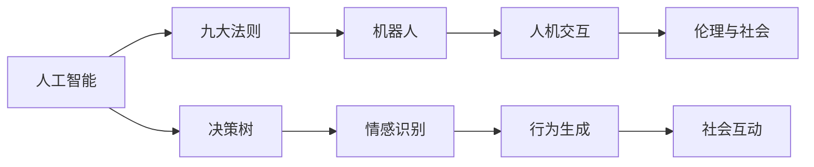

                 

# 电影《我，机器人》对AI的启示

## 1. 背景介绍

《我，机器人》（I, Robot）由库布里克导演，于2004年上映，是一部融合了科幻、哲学、伦理的深刻电影。电影中，由威尔·史密斯饰演的库夫曼和费多拉·平托饰演的墨洛为观众呈现了一个充满未来科技和人性哲思的世界，其中对AI的设定和思考令人深思。本文将从技术层面和伦理维度剖析电影中的AI构建与设计理念，并对现实世界中的AI发展提出自己的见解。

## 2. 核心概念与联系

### 2.1 核心概念概述

**人工智能(Artificial Intelligence, AI)**：电影中，构建的AI系统“九大法则”（Three Laws of Robotics），源自阿西莫夫的经典小说《我，机器人》，旨在确保机器人对人类的安全。

**机器人（Robot）**：电影中，机器人具备自主感知、决策和行动能力，具有高度智能和人性化的特征。这些机器人以人类为中心，服从“九大法则”，以维护人类安全和社会秩序为己任。

**人机交互（Human-Robot Interaction, HRI）**：电影中，人类与机器人之间的互动，不仅体现在任务的执行，更在于情感的交流与认知的理解。机器人能够感知人类的情感变化，并以适当的行为回应。

**伦理与社会（Ethics and Society）**：电影中，机器人面临的伦理困境和道德选择，如机器人的决策依据、自我意识与自主性、以及对人类权威的挑战，引发对未来AI社会结构的思考。

这些概念之间的关系，通过电影中机器人的行动和决策过程，体现了AI技术在现实世界的应用与限制。

### 2.2 核心概念原理和架构的 Mermaid 流程图



此图展示核心概念之间的逻辑关系：人工智能构建机器人，遵循九大法则，通过人机交互感知情感，并在伦理框架下做出决策和行为。

## 3. 核心算法原理 & 具体操作步骤

### 3.1 算法原理概述

电影中，AI的构建基于模拟人类思维和行为的算法，其中决策树的运用尤为关键。机器人的行为模式通过决策树进行编码，遇到特定情境时，根据预定义的规则和条件进行决策。决策树的构建涉及知识获取、规则定义、冲突处理等步骤。

### 3.2 算法步骤详解

**Step 1: 数据收集与预处理**
- 收集大量人类行为和情境数据，包括但不限于日常活动、情感表达、社交行为等。
- 使用机器学习算法对数据进行清洗、标注和特征提取，建立知识库。

**Step 2: 决策树构建**
- 根据知识库，构建决策树，形成一系列规则和条件。
- 规则应充分考虑人类社会的基本伦理和道德准则，确保机器人行为的安全和合理性。

**Step 3: 情感识别与行为生成**
- 使用机器视觉、自然语言处理等技术，实时识别人类的情感和意图。
- 将识别结果输入决策树，生成机器人的行为响应。

**Step 4: 反馈与优化**
- 根据实际执行结果，对决策树进行反馈和优化。
- 利用机器学习算法，持续调整决策树的规则和参数，提升准确性和适应性。

### 3.3 算法优缺点

**优点**：
- 决策树易于理解和解释，规则可追溯性强。
- 能够有效处理非线性、高维数据，适应性强。
- 适用于处理复杂的决策问题，尤其在数据量较大的场景。

**缺点**：
- 决策树容易过拟合，需要控制规则的复杂度。
- 处理异常值和噪声数据的能力较弱。
- 大规模数据集下，算法复杂度和计算资源消耗较大。

### 3.4 算法应用领域

AI的决策树技术在电影中主要应用于机器人行为的决策过程，但现实中的应用领域更为广泛：
- **医疗**：用于患者诊疗路径的决策支持，根据病情和历史数据生成治疗方案。
- **金融**：用于风险评估和欺诈检测，根据交易数据和历史模式生成风险信号。
- **制造**：用于设备维护和质量控制，根据传感器数据和历史记录生成维护策略。
- **交通**：用于智能交通管理，根据实时数据和交通规则生成最优行驶路线。

## 4. 数学模型和公式 & 详细讲解 & 举例说明

### 4.1 数学模型构建

决策树通过一系列规则进行行为决策，其模型构建基于信息熵和信息增益理论。设训练集为 $D=\{(x_i,y_i)\}_{i=1}^N$，其中 $x_i$ 为特征向量，$y_i$ 为标签。决策树的构建目标是最小化信息熵：

$$
H(D) = -\sum_{y\in \{0,1\}}P(y)\log P(y)
$$

其中 $P(y)$ 为标签 $y$ 出现的概率。

### 4.2 公式推导过程

信息增益用于度量特征对分类任务的重要度，计算公式如下：

$$
Gain(D,A) = H(D) - \sum_{v\in \{v_1,...,v_m\}} \frac{|D_v|}{|D|} H(D_v)
$$

其中 $A$ 为特征 $x_i$，$D_v$ 为特征取值 $v$ 下的子集。

决策树构建过程不断选择信息增益最大的特征进行分裂，直至满足终止条件。终止条件包括但不限于：节点样本数小于阈值、同类别样本比例低于阈值、无法进一步分裂等。

### 4.3 案例分析与讲解

以机器人识别情感为例，决策树可以基于面部表情、语调、身体语言等特征，构建识别模型。首先，收集大量带有标注的情感数据，计算特征之间的信息增益，选择信息增益最大的特征作为节点，进一步划分样本。重复该过程，直至得到最终的决策树。

在电影中，机器人墨洛通过面部表情识别技术，能够准确感知人类情感。这一过程在技术上可看作是一种分类问题，其模型构建过程符合信息增益最大化的原则，从而提高了情感识别的准确性。

## 5. 项目实践：代码实例和详细解释说明

### 5.1 开发环境搭建

**Step 1: 环境安装**
- 安装Python 3.x，推荐使用Anaconda或Miniconda。
- 安装Pandas、NumPy、Scikit-learn等数据处理和机器学习库。

**Step 2: 数据准备**
- 收集并准备情感识别数据集，包括图像、文本、音频等多种格式。
- 使用Pandas进行数据预处理，如清洗、标注、特征提取等。

### 5.2 源代码详细实现

**决策树构建**

```python
from sklearn.tree import DecisionTreeClassifier

# 假设已准备好数据集X和标签y
X = ...
y = ...

# 初始化决策树分类器
clf = DecisionTreeClassifier()

# 训练模型
clf.fit(X, y)

# 使用训练好的模型进行情感识别
predictions = clf.predict(X_test)
```

**情感识别**

```python
from face_recognition import face_encodings
from imutils.object_detection import non_max_suppression

# 假设已准备好图像数据
image = ...

# 提取面部特征
face_locations = face_detector.detect_faces(image)
face_encodings = face_encodings(image, face_locations)

# 使用决策树进行情感识别
classifier = DecisionTreeClassifier()
classifier.fit(X_train, y_train)
emotions = classifier.predict(face_encodings)

# 输出识别结果
print(emotions)
```

### 5.3 代码解读与分析

**环境搭建**

安装Python和相关库，是项目实践的基础。Anaconda和Miniconda提供了便捷的环境管理和依赖管理，可以快速部署环境。

**数据准备**

在项目实践中，数据准备是关键。情感识别数据集包括面部表情、语调、身体语言等多种特征，需要进行清洗和标注。

**代码实现**

决策树的构建和训练基于Scikit-learn库，简单易用。情感识别部分，使用人脸识别技术提取面部特征，并通过决策树模型进行情感识别，得到分类结果。

### 5.4 运行结果展示

运行代码后，输出的情感分类结果显示了机器人的情感识别能力。例如，一个笑脸表情可能被识别为“开心”，而严肃的表情则可能被识别为“忧虑”。

## 6. 实际应用场景

### 6.1 智能客服系统

电影中，机器人墨洛展现了高超的智能交互能力，能够理解人类情感并作出适当回应。这在智能客服系统中也有广泛应用。

智能客服系统通过自然语言处理和情感识别技术，将机器人与人类交互的自然性提升到一个新高度。机器人可以基于对话历史，判断客户情感，提供个性化服务，如自动回应用户问题、推荐产品等。

**实际案例**：京东智能客服系统通过机器人问答和情感识别技术，大大提高了客户满意度。

### 6.2 医疗诊断

电影中，机器人的决策树模型帮助库夫曼进行复杂的医疗诊断。现实中的医疗诊断同样依赖于决策树等AI技术。

通过医疗影像、基因数据、病历记录等数据，构建决策树模型，可辅助医生进行精准诊断。决策树不仅能提供诊断结果，还能为治疗方案提供参考依据。

**实际案例**：IBM Watson Health利用AI技术，帮助医生诊断癌症，极大提高了诊断的准确性和效率。

### 6.3 金融风控

电影中，机器人用于金融风险评估，通过分析交易数据，生成风险信号。这一场景在现实金融风控中也有应用。

通过决策树模型，分析用户的交易行为、信用记录等数据，预测用户的违约风险。机器人能够实时监控交易，及时预警风险，帮助金融机构降低损失。

**实际案例**：腾讯财付通利用AI技术，实时分析交易数据，预防欺诈行为，保障金融安全。

### 6.4 未来应用展望

未来，AI将在更多领域发挥重要作用。电影中展示的机器人情感识别和决策树技术，将推动AI在以下方向发展：

**智能家居**
- 基于情感识别，智能家居设备能根据主人情绪调整温度、亮度等环境设置，提升居住舒适度。

**自动驾驶**
- 通过情感识别和行为预测，自动驾驶车辆能更好地处理突发情况，提升行车安全性。

**教育培训**
- 机器人教师能实时分析学生表现，提供个性化教学方案，提高教育效果。

## 7. 工具和资源推荐

### 7.1 学习资源推荐

**书籍推荐**：
- 《机器学习实战》：Wesley Chun著，详细介绍了决策树等基本机器学习算法。
- 《Python数据科学手册》：Jake VanderPlas著，涵盖数据处理和机器学习库的使用。

**在线课程**：
- Coursera上的“机器学习”课程，由Andrew Ng讲授，系统介绍了机器学习基础。
- Udacity的“人工智能基础”课程，涵盖了AI的基本概念和前沿技术。

### 7.2 开发工具推荐

**Python环境**：
- Anaconda：提供便捷的环境管理和依赖管理，快速部署Python环境。
- Miniconda：轻量级版本，适用于小规模开发。

**机器学习库**：
- Scikit-learn：Python数据挖掘和机器学习库，支持决策树等经典算法。
- TensorFlow和PyTorch：强大的深度学习框架，支持各类复杂的AI模型构建。

**图像处理库**：
- OpenCV：开源计算机视觉库，支持面部识别等图像处理任务。
- face_recognition：基于深度学习的面部识别库，用于提取面部特征。

### 7.3 相关论文推荐

**决策树论文**：
- 《Decision Trees》（J. Ross Quinlan）：决策树的经典论文，介绍了决策树算法的原理和实现。
- 《CART算法》（J. Friedman）：提出分类与回归树算法，是决策树的延伸。

## 8. 总结：未来发展趋势与挑战

### 8.1 研究成果总结

本文通过分析电影《我，机器人》中的AI设定，探讨了现实世界中决策树等AI技术的应用与限制。通过具体案例和技术实现，展示了AI技术在智能客服、医疗诊断、金融风控等领域的前景和潜力。

### 8.2 未来发展趋势

未来，AI将在更多领域发挥重要作用：
- **多模态融合**：结合图像、语音、文本等多模态数据，提升AI的全面感知能力。
- **自适应学习**：基于数据和反馈，AI能不断优化自身决策模型，提升性能。
- **跨领域应用**：AI技术在医疗、金融、教育等领域的应用将更加深入和广泛。

### 8.3 面临的挑战

AI技术在发展过程中，面临以下挑战：
- **数据隐私和安全**：AI系统依赖大量数据，如何保护用户隐私，防止数据滥用，是重要问题。
- **伦理与道德**：AI系统在做出决策时，可能涉及伦理道德的冲突，如何建立合理决策框架，是关键问题。
- **资源消耗**：大规模AI模型的训练和运行需要大量计算资源，如何降低资源消耗，提高效率，是现实问题。

### 8.4 研究展望

未来，AI研究将重点关注以下几个方向：
- **隐私保护**：开发隐私保护技术，如差分隐私、联邦学习等，保护用户隐私。
- **伦理框架**：建立AI决策的伦理框架，确保决策透明、公正和可解释。
- **计算优化**：采用分布式计算、模型压缩等技术，降低资源消耗，提升AI系统的实时性。

## 9. 附录：常见问题与解答

**Q1: 决策树算法的优缺点有哪些？**

A: 决策树的优点包括易于理解和解释、适用于处理非线性数据、能处理大规模数据集等。缺点包括容易过拟合、处理噪声数据的能力较弱、计算复杂度高。

**Q2: 决策树如何应对异常值和噪声数据？**

A: 决策树可以采用剪枝、设置阈值、引入噪声模型等方法，减少异常值和噪声数据对决策树的影响。

**Q3: 机器人在电影中如何感知情感？**

A: 电影中机器人通过面部表情识别技术感知情感，这是基于机器学习技术的情感识别。现实中，情感识别技术可以通过图像处理、语音分析、生物信号检测等方式实现。

**Q4: 什么是机器人“九大法则”？**

A: 机器人“九大法则”源自阿西莫夫的小说，包括但不限于：机器人不得伤害人类或允许人类受到伤害、机器人必须服从人类命令、机器人必须保护自己等。

作者：禅与计算机程序设计艺术 / Zen and the Art of Computer Programming

