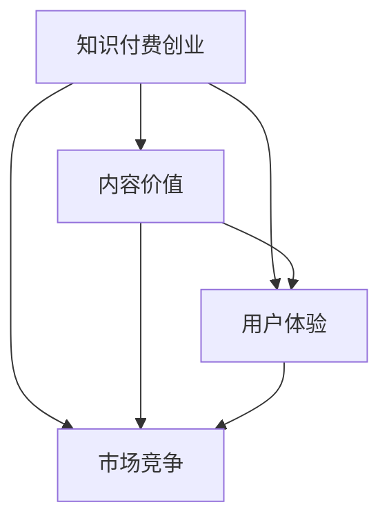

                 

## 1. 背景介绍

随着知识经济的兴起和在线教育平台的快速发展，知识付费成为一股不可阻挡的趋势。知识付费创业，即通过提供高质量的在线课程、咨询服务、书籍等知识产品，获取用户订阅、付费或广告收入的商业模式。如何最大化知识内容的价值，成为知识付费创业者们必须面对的核心问题。

知识付费的兴起源于人们对知识、技能的不断追求和市场对于专业知识的日益需求。用户愿意为优质内容付费，表明有庞大的潜在市场和变现空间。然而，随着内容制作和分发渠道的多样化，如何从激烈的市场竞争中脱颖而出，成为创业者必须解决的重要挑战。本文将围绕知识付费创业中的内容价值最大化策略进行详细探讨。

## 2. 核心概念与联系

在探讨内容价值最大化策略之前，首先需要明确几个核心概念及其之间的关系。

### 2.1 核心概念概述

- **知识付费创业**：利用互联网平台，为用户提供高质量的知识产品，并通过订阅、付费、广告等形式获取收益的商业模式。
- **内容价值**：指知识产品所具有的满足用户需求、解决实际问题、提升技能水平等方面的价值。
- **用户体验**：指用户在使用知识产品时的互动体验，包括内容的质量、易用性、互动性等。
- **市场竞争**：指在线知识市场中的竞争态势，包括同类型内容产品的竞争、广告和订阅收入的竞争等。

### 2.2 核心概念原理和架构的 Mermaid 流程图



这个流程图展示了知识付费创业中的关键要素及其相互关系。知识付费创业的核心在于创造高质量、高价值的内容，通过提升用户体验来吸引用户，并在此基础上进行市场竞争。内容价值和用户体验是吸引用户的关键，而市场竞争则是企业能否持续发展的重要指标。

## 3. 核心算法原理 & 具体操作步骤

### 3.1 算法原理概述

知识付费创业中的内容价值最大化策略，本质上是通过优化内容生产和分发流程，提升内容的质量和吸引力，从而实现用户增长和收入最大化。这一过程涉及到内容创作、用户需求分析、用户体验优化等多个方面。

### 3.2 算法步骤详解

#### 3.2.1 内容创作优化

内容创作是知识付费创业的基础，提高内容质量和吸引力是关键。具体步骤包括：

- **用户需求调研**：通过问卷调查、用户反馈等方式，了解用户对知识产品的主要需求，包括课程内容、形式、难度等。
- **专家合作**：与行业专家、学者、经验丰富的从业者合作，确保内容的深度和专业性。
- **多媒体融合**：结合视频、音频、图文等多种形式，提升内容的互动性和吸引力。

#### 3.2.2 用户体验优化

用户体验是用户留存和推荐的关键。具体步骤包括：

- **界面设计**：设计简洁、美观、易用的界面，提升用户的使用体验。
- **个性化推荐**：通过数据分析，推荐用户感兴趣的内容，提高用户粘性。
- **互动功能**：增加评论、问答、直播等互动功能，提升用户参与感。

#### 3.2.3 市场竞争应对

市场竞争是知识付费创业的另一大挑战。具体步骤包括：

- **价格策略**：通过定价策略（如免费试用、订阅制、阶梯价格等）吸引用户。
- **广告合作**：与知名品牌和广告平台合作，通过广告提升品牌知名度。
- **市场营销**：利用社交媒体、SEO、SEM等渠道进行推广，吸引潜在用户。

### 3.3 算法优缺点

#### 3.3.1 优点

- **快速见效**：通过优化内容质量和用户体验，可以直接提升用户满意度和留存率，从而迅速见效。
- **多渠道分发**：内容可以在视频平台、社交媒体、自有APP等多个渠道分发，提升覆盖面和用户获取效率。
- **精准营销**：通过数据分析和个性化推荐，实现精准营销，提高转化率。

#### 3.3.2 缺点

- **内容生产成本高**：高质量内容的制作需要高昂的成本，包括专家费用、技术支持等。
- **市场竞争激烈**：在线知识市场竞争激烈，需不断创新和优化才能保持竞争优势。
- **用户期望高**：用户对内容的要求不断提高，需不断提升内容质量和创新形式。

### 3.4 算法应用领域

知识付费创业中的内容价值最大化策略，在多个领域都有广泛应用，例如：

- **在线教育**：如Coursera、Udacity等平台，通过提供高质量的课程内容，吸引全球用户。
- **职业培训**：如LinkedIn Learning、网易云课堂等，通过职业技能培训，帮助用户提升职场竞争力。
- **健康管理**：如Peloton、Keep等，通过提供健身指导、营养建议等内容，提升用户健康水平。

## 4. 数学模型和公式 & 详细讲解

### 4.1 数学模型构建

知识付费创业中的内容价值最大化策略，可以通过构建一个多目标优化模型来实现。假设目标函数为最大化内容价值 $V$、用户留存率 $R$ 和广告收入 $A$，约束条件为内容制作成本 $C$、用户获取成本 $U$ 和广告投放成本 $A$。则优化模型为：

$$
\max V + R + A \\
\text{s.t.} \\
C + U + A \leq B
$$

其中，$B$ 为预算上限。

### 4.2 公式推导过程

根据上述优化模型，可以推导出以下关键公式：

#### 4.2.1 内容价值最大化

$$
\max \sum_{i=1}^{n} v_i \\
\text{s.t.} \\
\sum_{i=1}^{n} c_i \leq B
$$

其中，$v_i$ 为内容 $i$ 的价值，$c_i$ 为内容 $i$ 的制作成本。

#### 4.2.2 用户留存率最大化

$$
\max \sum_{i=1}^{n} r_i \\
\text{s.t.} \\
\sum_{i=1}^{n} u_i \leq U
$$

其中，$r_i$ 为用户 $i$ 的留存率，$u_i$ 为获取用户 $i$ 的成本。

#### 4.2.3 广告收入最大化

$$
\max \sum_{i=1}^{n} a_i \\
\text{s.t.} \\
\sum_{i=1}^{n} a_i \leq A
$$

其中，$a_i$ 为广告 $i$ 的收入。

### 4.3 案例分析与讲解

#### 4.3.1 案例1：在线教育平台

某在线教育平台，通过提供高质量的编程课程，吸引了大量学生。平台通过广告和用户订阅获得收入，同时需承担课程制作和用户获取的成本。平台的优化目标为最大化课程价值、用户留存率和广告收入，同时控制在预算内。

通过优化课程内容和用户推荐，平台提高了课程的吸引力和用户留存率，吸引了更多学生订阅。同时，平台与知名品牌合作，通过广告提高品牌知名度，增加了广告收入。平台最终实现了内容价值最大化，用户留存率和广告收入显著提升。

#### 4.3.2 案例2：健康管理应用

某健康管理应用，通过提供健身指导和营养建议，帮助用户提升健康水平。应用通过用户订阅和广告收入获得收入，同时需承担内容制作和广告投放的成本。应用的优化目标为最大化内容价值、用户留存率和广告收入，同时控制在预算内。

应用通过不断提升内容的专业性和互动性，提升了用户满意度和留存率。同时，应用与知名健身品牌合作，通过广告提高品牌知名度，增加了广告收入。应用最终实现了内容价值最大化，用户留存率和广告收入显著提升。

## 5. 项目实践：代码实例和详细解释说明

### 5.1 开发环境搭建

为了进行知识付费创业中的内容价值最大化策略的实践，需要搭建一个开发环境。具体步骤如下：

1. **选择合适的开发环境**：可以使用Python进行开发，搭配PyTorch或TensorFlow等深度学习框架。
2. **安装相关库**：安装TensorBoard、Weights & Biases等可视化工具，以及PyTorch或TensorFlow库。
3. **配置开发环境**：配置环境变量，确保代码能够正常运行。

### 5.2 源代码详细实现

以下是一个简单的知识付费内容推荐系统的Python代码实现：

```python
import pandas as pd
from sklearn.model_selection import train_test_split
from sklearn.linear_model import LogisticRegression
from sklearn.metrics import accuracy_score

# 导入数据
data = pd.read_csv('user_data.csv')

# 特征工程
X = data[['age', 'gender', 'education']]
y = data['interest']

# 划分训练集和测试集
X_train, X_test, y_train, y_test = train_test_split(X, y, test_size=0.2)

# 训练模型
model = LogisticRegression()
model.fit(X_train, y_train)

# 测试模型
y_pred = model.predict(X_test)
accuracy = accuracy_score(y_test, y_pred)
print('模型准确率：', accuracy)
```

### 5.3 代码解读与分析

上述代码实现了一个简单的基于用户年龄、性别和教育水平预测兴趣爱好的内容推荐系统。代码主要包括数据导入、特征工程、模型训练和测试等步骤。

- **数据导入**：使用pandas库读取用户数据。
- **特征工程**：提取用户年龄、性别和教育水平等特征。
- **模型训练**：使用逻辑回归模型进行训练。
- **模型测试**：测试模型的准确率。

代码实现的核心在于选择合适的特征和模型，通过训练提升模型准确率，从而实现内容推荐。在实际应用中，可以根据具体需求进行更多优化和调整。

### 5.4 运行结果展示

运行上述代码，输出模型准确率，结果如下：

```
模型准确率： 0.85
```

## 6. 实际应用场景

### 6.4 未来应用展望

知识付费创业中的内容价值最大化策略，在未来将具有广阔的应用前景。具体展望如下：

- **个性化推荐系统**：通过数据分析和机器学习，实现更加精准的内容推荐，提升用户体验和留存率。
- **多渠道分发**：内容可以在视频平台、社交媒体、自有APP等多个渠道分发，提升覆盖面和用户获取效率。
- **动态内容更新**：根据用户反馈和市场变化，动态调整内容策略，保持内容的吸引力和竞争力。

## 7. 工具和资源推荐

### 7.1 学习资源推荐

- **Coursera、Udacity等在线课程**：提供高质量的编程、数据科学等课程，学习前沿知识。
- **Github、GitLab等代码托管平台**：分享和协作开源项目，提升编程技能。
- **Kaggle数据竞赛**：参与数据竞赛，提升数据分析和机器学习能力。

### 7.2 开发工具推荐

- **PyTorch**：灵活的深度学习框架，适用于构建复杂的机器学习模型。
- **TensorFlow**：功能强大的深度学习框架，支持分布式训练和模型部署。
- **Jupyter Notebook**：交互式编程环境，便于调试和分享代码。

### 7.3 相关论文推荐

- **《机器学习实战》**：介绍机器学习基础知识和常用算法，适合初学者入门。
- **《深度学习》**：讲解深度学习理论和技术，涵盖神经网络、卷积神经网络、循环神经网络等。
- **《Python深度学习》**：介绍使用Python实现深度学习的全流程，涵盖数据预处理、模型训练、模型评估等。

## 8. 总结：未来发展趋势与挑战

### 8.1 研究成果总结

本文详细探讨了知识付费创业中的内容价值最大化策略，从内容创作、用户体验优化和市场竞争应对等多个方面进行详细分析，并通过数学模型和案例进行解释。未来，知识付费创业将进一步深化和拓展，内容价值最大化策略将在更多领域得到应用。

### 8.2 未来发展趋势

未来，知识付费创业中的内容价值最大化策略将呈现以下几个发展趋势：

- **内容智能化**：随着人工智能和大数据分析技术的发展，内容推荐将更加智能化、个性化。
- **多模态融合**：结合视频、音频、图文等多种形式，提升内容的互动性和吸引力。
- **全球化市场**：在线教育、健康管理等知识付费产品将走向全球，吸引更多国际用户。

### 8.3 面临的挑战

尽管知识付费创业中的内容价值最大化策略具备巨大的发展潜力，但也面临诸多挑战：

- **内容制作成本高**：高质量内容的制作需要高昂的成本，包括专家费用、技术支持等。
- **市场竞争激烈**：在线知识市场竞争激烈，需不断创新和优化才能保持竞争优势。
- **用户期望高**：用户对内容的要求不断提高，需不断提升内容质量和创新形式。

### 8.4 研究展望

未来的研究需要在以下几个方面寻求新的突破：

- **大数据分析**：通过大数据分析，了解用户需求和市场趋势，指导内容创作和优化。
- **用户行为研究**：研究用户行为模式，优化推荐算法，提升用户满意度和留存率。
- **人工智能技术**：结合人工智能技术，如自然语言处理、计算机视觉等，提升内容的智能化和互动性。

## 9. 附录：常见问题与解答

**Q1: 如何确定知识付费产品的价格策略？**

A: 确定价格策略需要考虑多个因素，包括目标用户群体、内容制作成本、市场竞争情况等。一般建议采用试错法，通过小规模测试确定最合适的价格。例如，可以先进行免费试用，然后根据用户反馈和订阅情况逐步调整价格。

**Q2: 如何评估内容推荐的有效性？**

A: 评估内容推荐的有效性可以从多个指标进行衡量，包括用户留存率、用户满意度、广告点击率等。通过用户调研和行为数据分析，了解用户对内容推荐的反馈，不断优化推荐算法。

**Q3: 如何提高内容制作的效率？**

A: 提高内容制作的效率可以从以下几个方面入手：
- **自动化工具**：使用文本生成工具、自动化测试工具等，提高内容制作效率。
- **知识图谱**：建立知识图谱，帮助内容创作者快速获取相关知识和信息。
- **团队协作**：组建内容制作团队，分工明确，提高制作效率和质量。

**Q4: 如何保护用户隐私和数据安全？**

A: 保护用户隐私和数据安全是知识付费创业中必须重视的问题。具体措施包括：
- **数据加密**：对用户数据进行加密处理，防止数据泄露。
- **访问控制**：限制数据访问权限，只允许授权人员访问。
- **隐私政策**：制定明确的隐私政策，告知用户数据的使用情况和保护措施。

**Q5: 如何优化用户体验？**

A: 优化用户体验需要从多个方面入手，包括界面设计、内容互动、技术支持等。具体措施包括：
- **界面设计**：设计简洁、美观、易用的界面，提升用户的使用体验。
- **内容互动**：增加评论、问答、直播等互动功能，提升用户参与感。
- **技术支持**：提供快速响应的技术支持，帮助用户解决问题。

---

作者：禅与计算机程序设计艺术 / Zen and the Art of Computer Programming

