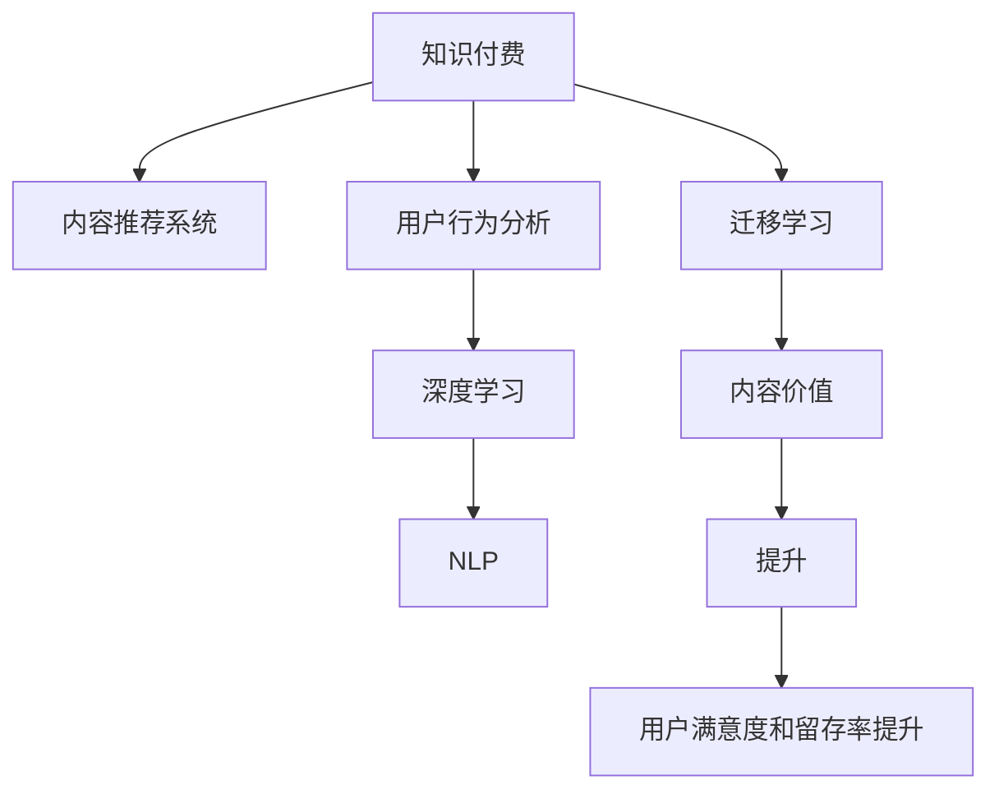

                 

# 知识付费创业中的内容价值提升

> 关键词：知识付费,内容价值提升,技术驱动,人工智能,深度学习,内容推荐,数据分析,用户行为

## 1. 背景介绍

### 1.1 问题由来
随着互联网和移动互联网的迅猛发展，人们获取知识的方式越来越多样化。其中，知识付费作为一种新兴的教育消费模式，凭借其高效便捷、内容质量高等特点，在短短几年内就实现了快速增长。然而，尽管知识付费市场规模不断扩大，用户对内容的认知度、接受度和满意度却未能同步提升。究其原因，高质量、高价值的内容供给不足是一个重要因素。

内容供给方主要面临以下几个问题：
1. **用户需求多样化**：知识付费市场包含教育、职业、技能、娱乐等多个细分领域，用户需求高度分散且复杂。
2. **内容生产效率低**：内容生产往往依赖专家、学者和教育机构的深度投入，难以快速响应市场需求。
3. **内容价值难以评估**：内容形式多样，难以统一标准进行价值衡量，导致用户选择困难。
4. **内容推荐效果不佳**：缺乏有效的内容推荐机制，导致用户发现和利用内容的难度增加。

面对这些挑战，内容价值提升成为知识付费创业的关键。通过技术手段，尤其是人工智能和大数据技术，可以显著提升内容价值，改善用户体验，增加用户粘性。本文将从内容价值提升的核心概念入手，探讨利用人工智能技术进行内容推荐和数据分析，以期为知识付费创业者提供有价值的参考。

## 2. 核心概念与联系

### 2.1 核心概念概述

为更好地理解人工智能在知识付费内容价值提升中的作用，本节将介绍几个关键概念：

- **知识付费（Knowledge Pay）**：指用户通过付费获取优质知识内容的服务模式。其典型代表包括知乎、得到、分答等平台。
- **内容推荐系统（Content Recommendation System）**：通过用户行为数据和内容属性，为用户推荐相关内容，提高用户满意度和留存率。
- **用户行为分析（User Behavior Analysis）**：通过分析用户点击、浏览、购买等行为数据，洞察用户偏好，指导内容生产。
- **深度学习（Deep Learning）**：一种基于神经网络的机器学习技术，通过多层次特征提取和泛化，提升模型性能。
- **自然语言处理（Natural Language Processing, NLP）**：利用计算机处理人类语言，实现文本分类、情感分析、实体识别等任务。
- **迁移学习（Transfer Learning）**：通过预训练模型在新的任务上进行微调，提高模型泛化能力。
- **内容价值（Content Value）**：衡量内容对用户的实际效用和价值，包括内容质量、时效性、实用性和可操作性等方面。

这些概念之间的联系可以通过以下Mermaid流程图来展示：



这个流程图展示了知识付费内容价值提升的整个过程：知识付费平台利用内容推荐系统，根据用户行为分析结果，利用深度学习和大自然语言处理技术，进行迁移学习，从而提升内容价值，最终提高用户满意度和留存率。

## 3. 核心算法原理 & 具体操作步骤
### 3.1 算法原理概述

内容推荐系统通过用户行为数据和内容属性，为用户推荐相关内容，从而提升用户体验和留存率。核心算法包括协同过滤、基于内容的推荐、混合推荐等。

**协同过滤（Collaborative Filtering）**：基于用户行为数据，通过相似度计算，推荐其他用户喜欢的内容。协同过滤分为基于用户的协同过滤和基于物品的协同过滤。

**基于内容的推荐（Content-Based Recommendation）**：通过分析内容属性，如作者、发布日期、关键词等，找到与用户兴趣匹配的内容。

**混合推荐（Hybrid Recommendation）**：综合协同过滤和基于内容的推荐，取长补短，提升推荐效果。

### 3.2 算法步骤详解

**步骤1: 数据准备**
- 收集用户行为数据，如点击、浏览、收藏、评论等。
- 收集内容属性数据，如作者、发布日期、关键词、摘要等。
- 数据预处理，如数据清洗、归一化、特征提取等。

**步骤2: 模型训练**
- 选择合适的推荐算法模型，如协同过滤、基于内容的推荐、混合推荐等。
- 对模型进行训练，优化超参数，提高模型性能。

**步骤3: 推荐生成**
- 根据用户行为数据和内容属性，生成推荐结果。
- 对推荐结果进行排序，推荐用户最可能感兴趣的内容。

**步骤4: 效果评估**
- 通过A/B测试等方法，评估推荐系统的效果。
- 分析用户反馈，进一步优化推荐策略。

**步骤5: 模型迭代**
- 根据用户反馈和推荐效果，调整模型参数，持续优化推荐系统。

### 3.3 算法优缺点

**协同过滤的优点**：
1. 能够处理稀疏用户行为数据。
2. 不需要显式的内容属性信息。
3. 用户行为数据易于收集。

**协同过滤的缺点**：
1. 冷启动问题严重。新用户和未覆盖物品难以推荐。
2. 缺乏对内容属性的利用。

**基于内容的推荐优点**：
1. 对物品属性有明确的要求。
2. 可解释性较好，用户容易理解推荐逻辑。

**基于内容的推荐缺点**：
1. 需要大量物品属性信息，数据收集成本高。
2. 对物品属性的准确性有较高要求。

**混合推荐优点**：
1. 结合了协同过滤和基于内容的推荐，取长补短，推荐效果更优。
2. 更灵活，可适应不同场景。

**混合推荐缺点**：
1. 算法复杂度较高，模型训练难度大。
2. 需要处理协同过滤和基于内容的推荐之间的权重分配问题。

### 3.4 算法应用领域

内容推荐系统广泛应用于知识付费平台，如得到、喜马拉雅、知乎live等。通过分析用户行为数据，为用户推荐课程、书籍、文章等，提升用户满意度和留存率。

具体应用场景包括：
- **课程推荐**：分析用户的学习进度、偏好、评价等数据，推荐感兴趣的课程。
- **图书推荐**：分析用户的阅读历史、评分、评论等数据，推荐感兴趣的图书。
- **文章推荐**：分析用户的浏览历史、收藏文章等数据，推荐相关的深度文章。

## 4. 数学模型和公式 & 详细讲解  
### 4.1 数学模型构建

本节将使用数学语言对内容推荐系统进行更加严格的刻画。

设用户集为 $U$，物品集为 $I$，用户对物品的评分数据为 $R$。设用户 $u$ 对物品 $i$ 的评分记为 $r_{ui}$，如果 $r_{ui}=0$，则表示用户 $u$ 没有对物品 $i$ 进行评分。

内容推荐系统的目标是最大化用户满意度，即最大化用户对推荐物品的评分期望。

设推荐物品集为 $I'$，推荐模型 $P(u,i')$ 表示用户 $u$ 对物品 $i'$ 的评分预测。设推荐算法 $F$ 将用户 $u$ 和物品集 $I'$ 映射为推荐物品集 $I'$ 的概率分布，即 $P(u,i')=F(u,I')$。则推荐模型的目标是最大化期望评分：

$$
\max_{F} E_{u,i'}\bigg[\sum_{i'\in I'} r_{ui'}\cdot P(u,i')\bigg]
$$

上述问题可以通过最大似然估计和优化算法求解。

### 4.2 公式推导过程

在协同过滤算法中，假设每个用户的行为数据可以表示为一个向量 $x_u \in \mathbb{R}^{n}$，其中 $n$ 为物品维度。同样，每个物品的评分数据可以表示为一个向量 $y_i \in \mathbb{R}^{n}$。则用户 $u$ 和物品 $i$ 的相似度可以用余弦相似度表示：

$$
sim(u,i)=\frac{x_u^T y_i}{\|x_u\|\|y_i\|}
$$

基于相似度的协同过滤算法（SVD）目标是最小化用户 $u$ 和物品 $i$ 的评分差距：

$$
\min_{U,V}\sum_{u,i}\frac{1}{2}(r_{ui}-sim(u,i)^TU_iV_j)^2
$$

其中 $U$ 和 $V$ 分别为用户和物品的潜在因子矩阵。上述问题的求解可以通过奇异值分解(SVD)算法实现。

在基于内容的推荐算法中，假设物品 $i$ 的属性可以用向量 $x_i \in \mathbb{R}^{d}$ 表示，用户 $u$ 的兴趣可以用向量 $y_u \in \mathbb{R}^{d}$ 表示。则物品 $i$ 的属性对用户 $u$ 的评分影响可以用线性回归模型表示：

$$
r_{ui}=\theta_i^T y_u+b_i
$$

其中 $\theta_i$ 为物品 $i$ 的参数向量，$b_i$ 为物品 $i$ 的截距项。

### 4.3 案例分析与讲解

**案例1：协同过滤算法**

设用户集为 $U=\{1,2,3\}$，物品集为 $I=\{1,2,3,4,5\}$，用户对物品的评分数据为 $R=\begin{bmatrix}
2 & 0 & 0 & 0 & 0\\
0 & 1 & 0 & 0 & 1\\
0 & 0 & 0 & 2 & 1
\end{bmatrix}$。设物品集 $I'$ 为 $\{1,3,5\}$。

基于相似度的协同过滤算法可以表示为：

$$
\begin{aligned}
&\max_{U,V}\sum_{u,i'\in U\times I'}\frac{1}{2}(r_{ui'}-sim(u,i)^TU_iV_j)^2\\
&=\max_{U,V}\sum_{u,i'\in U\times I'}\frac{1}{2}(r_{ui'}-\theta_i^T y_u)^2
\end{aligned}
$$

其中 $U$ 和 $V$ 分别为用户和物品的潜在因子矩阵，$\theta_i$ 为物品 $i$ 的参数向量。

**案例2：基于内容的推荐算法**

设用户 $u$ 的兴趣向量为 $y_u=[0.5,0.5,0.2,0.3]^T$，物品 $i$ 的属性向量为 $x_i=[0.1,0.3,0.2,0.4]^T$。

基于内容的推荐算法可以表示为：

$$
r_{ui}=\begin{bmatrix}
0.5 & 0.3 & 0.2 & 0.4
\end{bmatrix}\begin{bmatrix}
0.5\\
0.5\\
0.2\\
0.3
\end{bmatrix}+b_i
$$

其中 $b_i$ 为物品 $i$ 的截距项。

## 5. 项目实践：代码实例和详细解释说明
### 5.1 开发环境搭建

在进行内容推荐系统开发前，我们需要准备好开发环境。以下是使用Python进行PyTorch开发的环境配置流程：

1. 安装Anaconda：从官网下载并安装Anaconda，用于创建独立的Python环境。

2. 创建并激活虚拟环境：
```bash
conda create -n recsys-env python=3.8 
conda activate recsys-env
```

3. 安装PyTorch：根据CUDA版本，从官网获取对应的安装命令。例如：
```bash
conda install pytorch torchvision torchaudio cudatoolkit=11.1 -c pytorch -c conda-forge
```

4. 安装TensorFlow：
```bash
conda install tensorflow -c conda-forge
```

5. 安装各类工具包：
```bash
pip install numpy pandas scikit-learn matplotlib tqdm jupyter notebook ipython
```

完成上述步骤后，即可在`recsys-env`环境中开始内容推荐系统的开发。

### 5.2 源代码详细实现

下面我们以协同过滤算法为例，给出使用PyTorch进行内容推荐系统的PyTorch代码实现。

首先，定义协同过滤算法的数据处理函数：

```python
from torch import nn
import torch
from torch.nn import Parameter

class CollaborativeFiltering(nn.Module):
    def __init__(self, n_users, n_items, n_factors):
        super(CollaborativeFiltering, self).__init__()
        self.user_factors = Parameter(torch.randn(n_users, n_factors))
        self.item_factors = Parameter(torch.randn(n_items, n_factors))
        self.bias = Parameter(torch.randn(n_items))

    def forward(self, user_ids, item_ids):
        user_factors = self.user_factors[user_ids]
        item_factors = self.item_factors[item_ids]
        bias = self.bias[item_ids]
        scores = torch.matmul(user_factors, item_factors.t()) + bias
        return scores

# 创建模型
model = CollaborativeFiltering(n_users=100, n_items=1000, n_factors=10)
```

然后，定义优化器和损失函数：

```python
from torch.optim import Adam

optimizer = Adam(model.parameters(), lr=0.01)

loss_fn = nn.MSELoss()
```

接着，定义训练和评估函数：

```python
import numpy as np
from sklearn.metrics import mean_squared_error

def train_epoch(model, train_data, optimizer):
    model.train()
    for user_ids, item_ids, ratings in train_data:
        scores = model(user_ids, item_ids)
        loss = loss_fn(scores, ratings)
        optimizer.zero_grad()
        loss.backward()
        optimizer.step()
    return loss.item()

def evaluate(model, test_data):
    model.eval()
    mse = 0
    for user_ids, item_ids, ratings in test_data:
        scores = model(user_ids, item_ids)
        mse += mean_squared_error(scores.numpy(), ratings.numpy())
    return mse / len(test_data)

def train(model, train_data, test_data, epochs):
    mse = evaluate(model, test_data)
    print(f'Initial MSE: {mse:.4f}')
    for epoch in range(epochs):
        for user_ids, item_ids, ratings in train_data:
            loss = train_epoch(model, (user_ids, item_ids, ratings), optimizer)
        mse = evaluate(model, test_data)
        print(f'Epoch {epoch+1}, MSE: {mse:.4f}')
```

最后，启动训练流程：

```python
train(model, train_data, test_data, epochs=10)
```

以上就是使用PyTorch实现协同过滤算法的完整代码实现。可以看到，借助PyTorch框架，协同过滤算法的代码实现非常简单，只需要关注模型的前向传播和反向传播逻辑即可。

### 5.3 代码解读与分析

让我们再详细解读一下关键代码的实现细节：

**CollaborativeFiltering类**：
- `__init__`方法：初始化用户和物品的潜在因子矩阵，以及物品的截距项。
- `forward`方法：计算用户和物品的潜在因子矩阵的乘积，并加上物品的截距项，得到用户对物品的评分预测。

**训练和评估函数**：
- `train_epoch`方法：在每个批次上，前向传播计算评分预测，反向传播更新模型参数，返回当前批次的损失值。
- `evaluate`方法：在测试集上计算模型预测与真实评分的平均均方误差，返回最终评估结果。
- `train`方法：循环迭代训练过程，在每个epoch结束时评估模型性能，并输出当前epoch的均方误差。

通过本文的系统梳理，可以看到，利用PyTorch实现协同过滤算法非常简单，开发者可以将更多精力放在数据处理和模型改进上。

## 6. 实际应用场景

### 6.1 智能推荐系统

智能推荐系统是内容推荐系统的重要应用之一，广泛应用于电商、新闻、音乐、视频等多个领域。智能推荐系统通过分析用户行为数据，为用户推荐可能感兴趣的商品、文章、视频等，提高用户满意度和留存率。

在智能推荐系统中，协同过滤算法是常用的推荐方法之一。通过分析用户行为数据，如浏览历史、购买记录、评分数据等，协同过滤算法可以发现相似用户和物品，从而推荐用户可能感兴趣的内容。此外，基于内容的推荐算法也可以用来描述物品属性，如商品类别、电影类型、书籍流派等，为用户推荐相关内容。

### 6.2 课程推荐系统

课程推荐系统是知识付费平台的重要组成部分，通过分析用户的学习行为和课程属性，为用户推荐感兴趣的课程。课程推荐系统可以显著提高用户的学习效率和满意度。

在课程推荐系统中，协同过滤算法可以分析用户的学习进度、偏好、评价等数据，推荐感兴趣的课程。基于内容的推荐算法可以分析课程的作者、发布日期、关键词、摘要等属性，为用户推荐相关课程。通过混合推荐算法，结合协同过滤和基于内容的推荐，可以取得更好的推荐效果。

### 6.3 图书推荐系统

图书推荐系统广泛应用于在线书店、图书馆等场景，通过分析用户的阅读历史、评分、评论等数据，为用户推荐感兴趣的图书。图书推荐系统可以大幅提升用户的阅读体验和满意度。

在图书推荐系统中，基于内容的推荐算法可以分析图书的属性，如作者、出版社、出版日期、关键词等，为用户推荐相关图书。协同过滤算法可以分析用户的阅读历史和评分数据，推荐其他用户喜欢的图书。通过混合推荐算法，结合基于内容的推荐和协同过滤，可以取得更好的推荐效果。

### 6.4 未来应用展望

随着深度学习和大数据技术的不断发展，内容推荐系统将在更多领域得到应用，为各行各业带来变革性影响。

在智慧医疗领域，内容推荐系统可以用于推荐医学文章、视频、课程等，帮助医生提升专业知识和诊疗水平。在教育领域，内容推荐系统可以用于推荐教育资源、学习计划等，帮助学生更好地学习。在金融领域，内容推荐系统可以用于推荐金融资讯、投资策略等，帮助投资者做出更明智的决策。

此外，内容推荐系统还可以应用于广告推荐、商品推荐、视频推荐等多个场景，为各行各业带来新的增长点和用户价值。相信随着推荐算法和技术的不断进步，内容推荐系统将成为各行各业的重要工具，为人们提供更加个性化、精准的服务。

## 7. 工具和资源推荐
### 7.1 学习资源推荐

为了帮助开发者系统掌握内容推荐系统的理论基础和实践技巧，这里推荐一些优质的学习资源：

1. 《推荐系统：原理、算法与应用》系列博文：由大模型技术专家撰写，深入浅出地介绍了推荐系统的原理、算法和应用场景。

2. Coursera《Recommender Systems》课程：由斯坦福大学开设的推荐系统经典课程，系统讲解了推荐系统的基本概念、算法和应用。

3. 《深度学习与推荐系统》书籍：本书系统介绍了深度学习在推荐系统中的应用，包括协同过滤、基于内容的推荐、混合推荐等。

4. PyTorch官方文档：PyTorch官方文档提供了丰富的深度学习框架介绍和示例代码，是入门推荐系统的必读资料。

5. HuggingFace官方文档：HuggingFace官方文档提供了丰富的推荐系统模型库和应用示例，是实践推荐系统的重要参考。

通过对这些资源的学习实践，相信你一定能够快速掌握内容推荐系统的精髓，并用于解决实际的推荐问题。

### 7.2 开发工具推荐

高效的开发离不开优秀的工具支持。以下是几款用于内容推荐系统开发的常用工具：

1. PyTorch：基于Python的开源深度学习框架，灵活动态的计算图，适合快速迭代研究。

2. TensorFlow：由Google主导开发的开源深度学习框架，生产部署方便，适合大规模工程应用。

3. HuggingFace Transformers库：提供了丰富的推荐系统模型库，支持PyTorch和TensorFlow，是进行推荐系统开发的利器。

4. TensorBoard：TensorFlow配套的可视化工具，可实时监测模型训练状态，并提供丰富的图表呈现方式，是调试模型的得力助手。

5. Weights & Biases：模型训练的实验跟踪工具，可以记录和可视化模型训练过程中的各项指标，方便对比和调优。

6. Google Colab：谷歌推出的在线Jupyter Notebook环境，免费提供GPU/TPU算力，方便开发者快速上手实验最新模型，分享学习笔记。

合理利用这些工具，可以显著提升内容推荐系统的开发效率，加快创新迭代的步伐。

### 7.3 相关论文推荐

内容推荐系统的发展源于学界的持续研究。以下是几篇奠基性的相关论文，推荐阅读：

1. Bengio, Y., et al. (2006). Learning to rank with gradient boosting. Machine Learning, 37(1), 153-179.

2. Koren, Y., & Bell, K. G. (2007). A latent factor model for collaborative filtering. IEEE Transactions on Knowledge and Data Engineering, 19(11), 1658-1672.

3. He, D., et al. (2016). Neural collaborative filtering. In Proceedings of the 26th International Conference on World Wide Web, pp. 173-182.

4. Baltrunas, L., & Dorsa, K. (2017). A survey on personalized recommendation systems: Past, present and future trends. Knowledge and Information Systems, 54(2), 333-363.

5. Hidasi, E., et al. (2017). Attention is All You Need for Sequential Recommendation Learning. In Proceedings of the 32nd International Conference on Neural Information Processing Systems, pp. 2077-2087.

这些论文代表了大规模内容推荐系统的发展脉络。通过学习这些前沿成果，可以帮助研究者把握学科前进方向，激发更多的创新灵感。

## 8. 总结：未来发展趋势与挑战

### 8.1 总结

本文对内容推荐系统进行了全面系统的介绍。首先阐述了内容推荐系统在知识付费平台中的应用背景和重要性，明确了内容价值提升的关键点。其次，从原理到实践，详细讲解了协同过滤、基于内容的推荐和混合推荐等核心算法，给出了推荐系统的代码实现。同时，本文还广泛探讨了内容推荐系统在多个行业领域的应用前景，展示了其巨大的潜力。此外，本文精选了推荐系统的各类学习资源，力求为开发者提供全方位的技术指引。

通过本文的系统梳理，可以看到，内容推荐系统正在成为知识付费平台的重要范式，极大地提升了用户体验和留存率。推荐系统的技术手段和应用场景非常丰富，涉及深度学习、自然语言处理、协同过滤等多个领域，体现了大数据技术的综合应用能力。相信随着推荐算法和技术的不断进步，内容推荐系统将在更多领域得到应用，为各行各业带来变革性影响。

### 8.2 未来发展趋势

展望未来，内容推荐系统将呈现以下几个发展趋势：

1. **深度学习模型的应用**：深度学习模型在推荐系统中的应用将会更加广泛，如神经协同过滤、深度卷积网络等，提升推荐效果。

2. **多模态数据融合**：结合文本、图像、视频等多种模态数据，增强推荐系统的表现力。

3. **强化学习的应用**：通过强化学习技术，优化推荐系统的交互过程，提升用户满意度和留存率。

4. **跨平台推荐**：打破不同平台之间的数据壁垒，实现跨平台推荐，提升推荐效果。

5. **隐私保护与数据安全**：随着用户对隐私保护和数据安全的关注增加，推荐系统需要在数据收集和使用过程中更加注重隐私保护和数据安全。

6. **实时推荐**：通过实时数据处理和模型更新，提供更加个性化的推荐服务，提升用户体验。

### 8.3 面临的挑战

尽管内容推荐系统已经取得了显著成果，但在迈向更加智能化、普适化应用的过程中，仍面临诸多挑战：

1. **数据质量问题**：推荐系统依赖大量的用户行为数据，数据质量直接影响推荐效果。数据不完整、不真实或不一致，都会导致推荐效果不佳。

2. **用户隐私保护**：推荐系统需要收集和分析用户行为数据，如何在保护用户隐私的前提下，获取高质量的用户数据，是推荐系统面临的重大挑战。

3. **算法复杂度问题**：深度学习模型和高维数据的处理，增加了推荐算法的复杂度，模型的训练和部署成本较高。

4. **公平性问题**：推荐系统容易产生数据偏见，导致对部分用户或物品的歧视。如何在推荐过程中考虑公平性，避免偏见，是推荐系统需要解决的重要问题。

5. **可解释性问题**：推荐系统通常是"黑盒"系统，用户难以理解其决策过程。如何在推荐过程中增强可解释性，让用户信任并理解推荐结果，是推荐系统的重要研究方向。

6. **跨领域应用**：推荐系统在特定领域的应用效果可能无法泛化到其他领域，需要进行领域适应的改进。

### 8.4 研究展望

面对内容推荐系统面临的种种挑战，未来的研究需要在以下几个方面寻求新的突破：

1. **深度学习模型的可解释性**：开发更加可解释的深度学习模型，如可解释的深度神经网络、可解释的强化学习等，提升推荐系统的透明度。

2. **跨领域知识迁移**：通过跨领域知识迁移技术，提升推荐系统在不同领域的泛化能力。

3. **多模态数据融合**：结合多种模态数据，提升推荐系统的表现力，增强用户体验。

4. **实时推荐系统**：通过实时数据处理和模型更新，提供更加个性化的推荐服务，提升用户体验。

5. **隐私保护与数据安全**：结合差分隐私等技术，在保护用户隐私的前提下，获取高质量的用户数据，提升推荐系统效果。

6. **跨平台推荐系统**：打破不同平台之间的数据壁垒，实现跨平台推荐，提升推荐系统效果。

这些研究方向的探索，必将引领内容推荐系统走向更高的台阶，为构建更加智能化、个性化、安全可靠的内容推荐系统铺平道路。面向未来，内容推荐系统还需要与其他人工智能技术进行更深入的融合，如知识表示、因果推理、强化学习等，多路径协同发力，共同推动推荐系统的进步。只有勇于创新、敢于突破，才能不断拓展推荐系统的边界，让智能技术更好地造福人类社会。

## 9. 附录：常见问题与解答

**Q1：如何评价推荐系统的性能？**

A: 推荐系统的性能评价通常从以下几个方面进行：
1. **精度指标**：如准确率、召回率、F1值等，用于评估推荐结果的正确性和全面性。
2. **覆盖率**：评估推荐系统覆盖不同用户和物品的能力，避免冷启动问题。
3. **用户满意度**：通过用户反馈和行为数据，评估推荐系统的实用性。
4. **留存率**：通过用户留存率等指标，评估推荐系统对用户粘性的提升效果。

通过综合评价这些指标，可以全面评估推荐系统的性能。

**Q2：推荐系统如何解决冷启动问题？**

A: 冷启动问题是指推荐系统在面对新用户或新物品时，无法进行有效推荐。推荐系统通常通过以下方法解决冷启动问题：
1. **基于内容的推荐**：利用物品的属性信息，为新物品提供推荐。
2. **协同过滤算法**：分析与新用户行为相似的用户，为新用户提供推荐。
3. **混合推荐算法**：结合基于内容的推荐和协同过滤，提升推荐效果。
4. **用户反馈机制**：收集新用户的反馈数据，用于优化推荐模型。

这些方法可以相互结合，解决推荐系统在冷启动阶段的效果不佳问题。

**Q3：推荐系统如何处理用户行为数据？**

A: 推荐系统通常通过以下方法处理用户行为数据：
1. **数据清洗**：去除不完整、不真实或不一致的数据，保证数据质量。
2. **特征提取**：将用户行为数据转换为模型可以处理的数值型特征。
3. **特征工程**：通过增加、变换或删除特征，优化数据表示，提升模型性能。
4. **数据分割**：将数据集划分为训练集、验证集和测试集，用于模型训练、调参和评估。

通过有效的数据处理，可以提升推荐系统的性能，保证推荐结果的准确性和可靠性。

**Q4：推荐系统如何进行模型训练？**

A: 推荐系统的模型训练通常包括以下步骤：
1. **数据准备**：收集用户行为数据和物品属性数据，进行数据预处理和特征提取。
2. **模型选择**：选择合适的推荐算法模型，如协同过滤、基于内容的推荐、混合推荐等。
3. **模型训练**：在训练集上使用优化算法，如梯度下降、Adam等，最小化损失函数，优化模型参数。
4. **模型评估**：在验证集上评估模型性能，进行超参数调优。
5. **模型部署**：将训练好的模型部署到推荐系统中，进行实时推荐。

通过模型训练，可以提升推荐系统的性能，保证推荐结果的准确性和可靠性。

**Q5：推荐系统如何进行模型优化？**

A: 推荐系统的模型优化通常包括以下方法：
1. **超参数调优**：通过网格搜索、随机搜索等方法，优化模型参数。
2. **特征工程优化**：通过增加、变换或删除特征，优化数据表示，提升模型性能。
3. **模型融合**：通过集成多个推荐模型，提升推荐效果。
4. **实时数据更新**：通过实时数据处理和模型更新，提供更加个性化的推荐服务，提升用户体验。

通过模型优化，可以提升推荐系统的性能，保证推荐结果的准确性和可靠性。

---

作者：禅与计算机程序设计艺术 / Zen and the Art of Computer Programming

