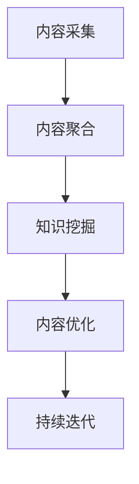

                 

# 知识付费创业中的内容更新与迭代

## 1. 背景介绍

### 1.1 问题由来
知识付费行业自2015年起，伴随移动互联网和智能设备的普及，逐渐成为了新的商业热点。各大平台如得到、喜马拉雅、知乎等纷纷布局知识付费，用户付费订阅、购买内容的热情也在不断升温。然而，知识付费市场同质化严重，大量泛泛之谈、低质量内容充斥市场，用户体验和满意度大打折扣。在这样的背景下，内容的更新与迭代成为了知识付费创业中迫切需要解决的难题。

### 1.2 问题核心关键点
内容更新与迭代的核心在于如何通过有效的手段，保证内容的新鲜度、质量、深度和广度，实现知识的持续生产与输出。具体来说：
1. **数据采集**：从多渠道获取高质量内容，包括学术论文、行业报告、专家访谈等。
2. **内容聚合**：对采集到的内容进行清洗、去重、分类和标签化，方便后续处理。
3. **知识挖掘**：利用NLP等技术挖掘内容中的关键知识点，提取有价值的信息。
4. **内容优化**：基于用户反馈，优化内容的呈现形式和交互方式，提升用户体验。
5. **持续迭代**：构建内容更新机制，定期更新和发布新内容，保持平台活力。

这些核心关键点围绕着内容的采集、加工、输出和反馈循环，形成了一个闭环，保证知识付费产品的质量和用户黏性。

### 1.3 问题研究意义
在知识付费创业中，内容更新与迭代不仅关乎产品的生命周期，更关乎平台的市场竞争力和用户满意度。通过有效的更新迭代，可以保证知识付费产品内容的时效性、多样性和深度，提升用户的持续购买意愿和满意度。

## 2. 核心概念与联系

### 2.1 核心概念概述

为更好地理解内容更新与迭代的机制，本节将介绍几个密切相关的核心概念：

- **内容聚合(Content Aggregation)**：从不同渠道收集内容，对其进行去重、分类、清洗和存储。
- **知识挖掘(Knowledge Mining)**：利用自然语言处理(NLP)等技术，从文本内容中提取出有价值的知识点。
- **内容优化(Content Optimization)**：优化内容的呈现方式，如调整文字格式、添加图表、引用最新文献等，提升用户体验。
- **持续迭代(Continuous Iteration)**：构建内容更新机制，定期或实时更新和发布新内容，保持平台活力。

这些核心概念之间的逻辑关系可以通过以下Mermaid流程图来展示：



这个流程图展示了我们内容更新与迭代的核心流程：

1. 通过内容采集获取大量内容。
2. 对内容进行聚合、清洗和存储。
3. 通过知识挖掘从内容中提取知识。
4. 对内容进行优化，提升用户体验。
5. 通过持续迭代机制，定期或实时发布新内容。

这些核心概念共同构成了内容更新与迭代的基本框架，使得知识付费产品能够保持内容的新鲜和高质量。

## 3. 核心算法原理 & 具体操作步骤
### 3.1 算法原理概述

内容更新与迭代的核心算法主要涉及以下三个方面：内容聚合、知识挖掘和内容优化。

#### 3.1.1 内容聚合

内容聚合的核心在于高效地从多渠道收集和存储高质量内容。常用的内容聚合方法包括：

- **爬虫技术**：通过网络爬虫获取网页内容，根据特定规则提取文本、图片、视频等。
- **API接口**：与各类内容平台（如Google Scholar、arXiv、微信公众平台等）对接，获取数据。
- **数据清洗**：去除重复、错误、低质量的内容，保留有价值的数据。

#### 3.1.2 知识挖掘

知识挖掘是指从文本内容中提取有价值的知识点，常用的技术包括：

- **分词与词性标注**：使用NLTK、SpaCy等工具进行中文分词和词性标注。
- **命名实体识别(NER)**：提取文本中的实体信息，如人名、地名、机构名等。
- **主题建模(LDA)**：使用LDA等算法，挖掘文本中的隐含主题。
- **情感分析**：使用情感词典或机器学习模型，识别文本中的情感倾向。

#### 3.1.3 内容优化

内容优化是通过对内容的格式化、多媒体化和互动化，提升用户体验。常用的技术包括：

- **文本格式化**：调整字体大小、行距、段落间距等，提升可读性。
- **多媒体化**：插入图片、图表、视频等，丰富内容形式。
- **互动化**：添加问答、投票、评论等互动功能，增强用户参与度。

### 3.2 算法步骤详解

基于上述核心算法，内容更新与迭代的具体操作步骤如下：

#### 3.2.1 内容采集
1. **爬虫开发**：开发网络爬虫，获取网页内容。例如，使用BeautifulSoup或Scrapy库实现网页解析。
2. **API接入**：对接各类内容平台API，获取数据。例如，使用Python的requests库访问Google Scholar API获取学术论文数据。
3. **数据清洗**：对采集到的数据进行去重、错误校正等处理。例如，使用Pandas库进行数据清洗。

#### 3.2.2 内容聚合
1. **数据存储**：将清洗后的数据存储到数据库中，例如使用SQLite、MySQL或NoSQL数据库。
2. **内容分类**：使用TF-IDF或K-means等算法对内容进行分类，建立目录结构。
3. **标签管理**：为每篇文章添加标签，方便用户搜索和筛选。

#### 3.2.3 知识挖掘
1. **分词与词性标注**：使用NLTK或SpaCy库对文本进行分词和词性标注。
2. **命名实体识别**：使用Stanford NER、SRL或SpaCy NER库进行实体识别。
3. **主题建模**：使用LDA等算法对文本进行主题建模。
4. **情感分析**：使用VADER、TextBlob等工具进行情感分析。

#### 3.2.4 内容优化
1. **文本格式化**：使用Markdown或Python的textwrap库调整文本格式。
2. **多媒体化**：使用Pillow库插入图片、Matplotlib库插入图表。
3. **互动化**：添加评论区、问答系统等互动功能。

#### 3.2.5 持续迭代
1. **定期更新**：设定固定周期，自动更新内容。例如，每天自动更新新文章。
2. **实时发布**：使用实时推送系统，例如使用RocketMQ或RabbitMQ。
3. **用户反馈**：收集用户反馈，调整内容策略。例如，通过A/B测试优化内容形式。

### 3.3 算法优缺点

内容更新与迭代的核心算法具有以下优点：
1. **高效**：自动化采集、聚合、挖掘和优化内容，提升效率。
2. **灵活**：通过算法调整，灵活适配不同内容类型和用户需求。
3. **丰富**：多样化的内容形式和互动功能，提升用户体验。
4. **低成本**：相比人工采集，自动化技术大幅降低人力成本。

同时，该算法也存在一定的局限性：
1. **数据质量**：采集到的内容质量依赖于网络爬虫和API的稳定性和准确性。
2. **算法复杂度**：知识挖掘和内容优化算法复杂度较高，需要较高的技术水平。
3. **资源消耗**：大规模内容处理对计算资源消耗较大，需要高性能的服务器。
4. **用户反馈滞后**：用户反馈往往滞后于内容发布，调整策略可能存在延迟。

尽管存在这些局限性，但就目前而言，内容更新与迭代的核心算法仍是知识付费创业中不可或缺的部分。未来相关研究的重点在于如何进一步降低算法复杂度，提升处理速度，同时兼顾内容质量、用户体验和用户反馈等多方面因素。

### 3.4 算法应用领域

内容更新与迭代的核心算法已经广泛应用于各类知识付费平台，涵盖了以下领域：

- **在线教育**：如Coursera、Khan Academy等平台，定期更新课程内容和教材。
- **科技资讯**：如36Kr、cnBeta等网站，实时推送科技新闻和技术文章。
- **财经资讯**：如华尔街见闻、虎嗅等平台，每日更新财经新闻和报告。
- **专业培训**：如得到、喜马拉雅等，定期发布专业培训课程和音频。
- **知识付费社区**：如知乎、简书等，用户生成内容定期更新和推送。

除了上述这些经典应用场景外，内容更新与迭代的核心算法还被创新性地应用到更多领域中，如智能客服、个性化推荐、智能写作等，为知识付费技术带来了全新的突破。随着内容采集、挖掘和优化的不断进步，相信内容更新与迭代的核心算法将在更广泛的应用领域大放异彩。

## 4. 数学模型和公式 & 详细讲解 & 举例说明

### 4.1 数学模型构建

内容更新与迭代的核心算法涉及多个环节，每个环节都可以用数学模型和公式进行描述。这里以主题建模(LDA)和情感分析为例，介绍其主要算法模型。

#### 4.1.1 主题建模(LDA)
主题建模的目标是从文本中提取隐含的主题分布，常用的数学模型是LDA（Latent Dirichlet Allocation）。

假设文本由$N$篇文档组成，每篇文档由$m$个单词组成，用$z_{n,i}$表示文档$n$中的第$i$个单词所属的主题，主题$k$包含$\beta_k$个单词和$\alpha_k$个文档中，则LDA模型的概率分布如下：

$$
p(z_{n,i}=k|D_n,\theta)=\frac{\beta_k\frac{N}{\sum_n\alpha_k}}{\sum_{k'\in K}\beta_{k'}\frac{N}{\sum_n\alpha_{k'}}}
$$

其中，$\theta$是LDA模型参数，包括$\alpha$和$\beta$。$K$表示所有主题的数量，$z_{n,i}$是文档$n$中第$i$个单词的主题分布。

#### 4.1.2 情感分析
情感分析的目标是从文本中识别情感倾向，常用的模型是情感词典或机器学习模型。

假设文本中的情感强度为$s$，情感倾向为$p$，则情感分析模型可以用如下公式表示：

$$
s = \sum_i w_i \cdot v_i
$$

其中，$w_i$表示单词$i$在文本中的权重，$v_i$表示单词$i$的情感强度。$w_i$可以通过TF-IDF等算法计算得到。

### 4.2 公式推导过程

以LDA主题建模为例，推导其主要公式和算法步骤。

#### 4.2.1 模型训练
LDA模型训练过程分为两个步骤：先验概率计算和后验概率计算。

1. 先验概率计算：计算每个单词属于每个主题的概率。
2. 后验概率计算：计算每个文档属于每个主题的概率，进而确定文档的主题分布。

#### 4.2.2 模型评估
LDA模型的评估指标包括：

- **主题连贯性**：使用Perplexity或Bleu指标评估模型主题连贯性。
- **主题一致性**：通过主题概率分布与实际主题分布的KL散度计算主题一致性。
- **文档识别率**：使用识别率指标评估模型对文档主题的识别效果。

### 4.3 案例分析与讲解

以一个简化的LDA模型为例，分析其实际应用场景和效果。

假设我们有一份关于“人工智能发展趋势”的文本，包含多篇报道和分析文章。我们可以使用LDA模型从中提取出主题分布，例如：

1. **主题1：人工智能技术**：包含关于AI算法的最新进展、技术应用、学术研究等。
2. **主题2：人工智能产业**：包含关于AI公司在资本市场的表现、商业应用、政策法规等。
3. **主题3：人工智能伦理**：包含关于AI伦理问题、数据隐私、社会影响等。

通过LDA模型，我们能够清晰地理解文本中的主要讨论主题，为内容聚合、优化和迭代提供方向性指导。

## 5. 项目实践：代码实例和详细解释说明

### 5.1 开发环境搭建

在进行内容更新与迭代实践前，我们需要准备好开发环境。以下是使用Python进行LDA模型开发的Python环境配置流程：

1. 安装Anaconda：从官网下载并安装Anaconda，用于创建独立的Python环境。

2. 创建并激活虚拟环境：
```bash
conda create -n lda-env python=3.8 
conda activate lda-env
```

3. 安装PyTorch、NLTK和nltk：
```bash
conda install pytorch torchvision torchaudio nltk
```

4. 安装LDA库：
```bash
conda install pyLDAvis scikit-learn pyarpack
```

完成上述步骤后，即可在`lda-env`环境中开始LDA模型开发。

### 5.2 源代码详细实现

我们以一个简单的文本数据集为例，展示如何使用Python进行LDA主题建模，并可视化主题分布。

首先，定义数据预处理函数：

```python
import nltk
from sklearn.feature_extraction.text import CountVectorizer
from sklearn.decomposition import LatentDirichletAllocation

nltk.download('stopwords')
stop_words = set(nltk.corpus.stopwords.words('english'))
vocabulary = CountVectorizer(stop_words=stop_words).build_vocabulary()
```

然后，加载文本数据并构建词向量：

```python
import os
from sklearn.pipeline import Pipeline

# 读取文本数据
with open('data.txt', 'r') as f:
    data = f.read()

# 构建词向量
text = [sentence.strip() for sentence in data.split('\n')]
vectorizer = CountVectorizer(vocabulary=vocabulary, stop_words=stop_words)
X = vectorizer.fit_transform(text)
```

接着，进行LDA主题建模：

```python
lda_model = LatentDirichletAllocation(n_components=3, random_state=42)
X_labeled = lda_model.fit_transform(X)
```

最后，可视化主题分布：

```python
import pyLDAvis.gensim

# 生成主题分布
vis = pyLDAvis.prepare(lda_model, X_labeled, vectorizer)

# 可视化主题分布
pyLDAvis.display(vis)
```

以上就是使用Python进行LDA主题建模的完整代码实现。可以看到，通过简单的几行代码，即可快速实现LDA模型的训练和主题可视化。

### 5.3 代码解读与分析

让我们再详细解读一下关键代码的实现细节：

**Data Preprocessing**：
- `nltk.download('stopwords')`：下载并加载英文停用词库。
- `CountVectorizer`：使用sklearn的CountVectorizer将文本数据转换为词向量。

**LDA Model Training**：
- `LatentDirichletAllocation`：使用scikit-learn的LatentDirichletAllocation进行LDA主题建模。
- `n_components`：设置主题数量，一般设置为数据集规模的0.2-0.5。
- `random_state`：设置随机种子，确保模型可重复性。

**主题可视化**：
- `pyLDAvis.prepare`：使用pyLDAvis生成主题分布的可视化。
- `display`：显示主题分布图。

在实际应用中，我们通常需要针对具体的文本数据集，调整上述参数，进行多轮迭代，最终得到准确的主题分布。LDA主题建模可以极大地帮助我们对内容进行分类和聚合，提升内容的可读性和用户理解度。

## 6. 实际应用场景

### 6.1 智能推荐系统

在智能推荐系统中，内容更新与迭代的核心算法可以结合用户行为数据，实时调整推荐策略，提升推荐效果。例如：

1. **数据采集**：收集用户浏览历史、点击行为等数据。
2. **内容聚合**：将相关内容进行分类和聚合。
3. **知识挖掘**：通过LDA等算法提取内容的主题信息。
4. **内容优化**：调整内容格式和呈现方式，提升用户体验。
5. **持续迭代**：根据用户反馈，实时更新和推送推荐内容。

通过内容更新与迭代，智能推荐系统可以不断优化推荐策略，满足用户个性化需求，提升用户黏性和满意度。

### 6.2 内容聚合平台

内容聚合平台如有道云笔记、Notion等，可以通过内容更新与迭代，实现内容的自动整理和归档。例如：

1. **数据采集**：从多渠道收集用户创建的内容，包括笔记、文章、图片等。
2. **内容聚合**：对收集到的内容进行清洗、分类、标签化，建立目录结构。
3. **知识挖掘**：使用NLP等技术挖掘内容中的关键知识点。
4. **内容优化**：调整内容格式和多媒体形式，丰富内容形式。
5. **持续迭代**：根据用户反馈，定期更新和发布新内容。

通过内容更新与迭代，内容聚合平台可以保持内容的新鲜和多样性，提升用户体验和平台活力。

### 6.3 学术研究平台

学术研究平台如arXiv、SSRN等，可以通过内容更新与迭代，提供最新的学术论文和报告。例如：

1. **数据采集**：对接各类学术论文和报告API，获取最新内容。
2. **内容聚合**：对采集到的内容进行清洗、分类和标签化。
3. **知识挖掘**：使用LDA等算法挖掘内容中的主题信息。
4. **内容优化**：调整内容格式和多媒体形式，提升可读性。
5. **持续迭代**：定期更新和发布新内容。

通过内容更新与迭代，学术研究平台可以保持内容的领先和权威性，为研究人员提供最新的研究资料和报告。

## 7. 工具和资源推荐

### 7.1 学习资源推荐

为了帮助开发者系统掌握内容更新与迭代的核心算法，这里推荐一些优质的学习资源：

1. **《Python自然语言处理》系列书籍**：涵盖NLP的多个方向，包括文本预处理、主题建模、情感分析等。
2. **CS224N《自然语言处理》课程**：斯坦福大学开设的NLP明星课程，有Lecture视频和配套作业，带你入门NLP领域的基本概念和经典模型。
3. **《深度学习自然语言处理》书籍**：Yoshua Bengio等专家所著，全面介绍了NLP领域的深度学习技术。
4. **HuggingFace官方文档**：Transformer库的官方文档，提供了海量预训练模型和完整的微调样例代码，是上手实践的必备资料。
5. **NLTK和spaCy**：Python中常用的NLP工具库，提供了丰富的文本处理功能。

通过对这些资源的学习实践，相信你一定能够快速掌握内容更新与迭代的核心算法，并用于解决实际的NLP问题。

### 7.2 开发工具推荐

高效的开发离不开优秀的工具支持。以下是几款用于内容更新与迭代开发的常用工具：

1. **Jupyter Notebook**：Python的交互式编程环境，适合进行算法实验和数据分析。
2. **Scikit-learn**：Python的机器学习库，提供了丰富的数据处理和模型训练功能。
3. **NLTK**：Python的NLP工具库，提供了丰富的文本处理功能。
4. **spaCy**：Python的NLP工具库，提供了高效的文本处理和实体识别功能。
5. **pyLDAvis**：用于可视化LDA主题分布的Python库。

合理利用这些工具，可以显著提升内容更新与迭代的开发效率，加快创新迭代的步伐。

### 7.3 相关论文推荐

内容更新与迭代的核心算法涉及多个前沿研究方向，以下是几篇奠基性的相关论文，推荐阅读：

1. **Latent Dirichlet Allocation**：Blei等人在2003年提出的主题建模算法，目前仍是最常用的主题模型之一。
2. **Text Mining and Statistical Learning**：Yoshua Bengio等专家所著的NLP经典教材，详细介绍了NLP中的统计学习方法和技术。
3. **Deep Learning**：Ian Goodfellow等专家所著的深度学习经典教材，涵盖了深度学习的基础知识和前沿技术。
4. **Bert: Pre-training of Deep Bidirectional Transformers for Language Understanding**：谷歌提出的BERT模型，引入掩码语言模型预训练任务，刷新了多项NLP任务SOTA。
5. **AdaLoRA: Adaptive Low-Rank Adaptation for Parameter-Efficient Fine-Tuning**：提出AdaLoRA等参数高效微调方法，在固定大部分预训练参数的情况下，只更新极少量的任务相关参数。

这些论文代表了大语言模型微调技术的发展脉络。通过学习这些前沿成果，可以帮助研究者把握学科前进方向，激发更多的创新灵感。

## 8. 总结：未来发展趋势与挑战

### 8.1 研究成果总结

内容更新与迭代的核心算法在大语言模型微调中具有重要地位，已经广泛应用于各类知识付费平台和学术研究平台。通过数据采集、内容聚合、知识挖掘和内容优化等环节，可以保持内容的更新与迭代，提升平台活力和用户满意度。

### 8.2 未来发展趋势

展望未来，内容更新与迭代的核心算法将呈现以下几个发展趋势：

1. **自动化程度提高**：通过算法优化，实现内容自动采集、聚合和优化，进一步提升效率。
2. **多模态融合**：结合文本、图像、视频等多模态数据，丰富内容形式，提升用户体验。
3. **智能推荐系统**：结合用户行为数据，实时调整推荐策略，提升推荐效果。
4. **实时发布机制**：构建实时发布系统，保证内容的时效性。
5. **个性化定制**：根据用户需求，定制个性化的内容推荐和推送策略。

以上趋势凸显了内容更新与迭代核心算法的广阔前景。这些方向的探索发展，必将进一步提升内容更新与迭代的智能化和个性化水平，为知识付费创业提供更强的技术支持。

### 8.3 面临的挑战

尽管内容更新与迭代的核心算法已经取得了不错的成果，但在实现商业化应用的过程中，仍面临诸多挑战：

1. **数据质量**：内容采集和聚合过程中，数据质量对算法的准确性和效果有较大影响。
2. **算法复杂度**：算法复杂度高，需要较高的技术水平和计算资源。
3. **用户反馈滞后**：用户反馈往往滞后于内容发布，调整策略可能存在延迟。
4. **隐私和安全**：内容更新与迭代过程中，需要注意保护用户隐私和数据安全。

尽管存在这些挑战，但通过不断优化算法和改进技术，相信内容更新与迭代的核心算法将在知识付费创业中发挥越来越重要的作用。

### 8.4 研究展望

面向未来，内容更新与迭代的核心算法需要在以下几个方面寻求新的突破：

1. **自动化程度提升**：通过算法优化，实现内容自动采集、聚合和优化，进一步提升效率。
2. **多模态融合**：结合文本、图像、视频等多模态数据，丰富内容形式，提升用户体验。
3. **智能推荐系统**：结合用户行为数据，实时调整推荐策略，提升推荐效果。
4. **实时发布机制**：构建实时发布系统，保证内容的时效性。
5. **个性化定制**：根据用户需求，定制个性化的内容推荐和推送策略。

这些研究方向的探索，必将引领内容更新与迭代核心算法迈向更高的台阶，为知识付费创业提供更强的技术支持。

## 9. 附录：常见问题与解答

**Q1：内容更新与迭代的核心算法适用于哪些场景？**

A: 内容更新与迭代的核心算法适用于各类知识付费平台、学术研究平台、智能推荐系统、内容聚合平台等多个场景。通过数据采集、内容聚合、知识挖掘和内容优化等环节，可以保持内容的更新与迭代，提升平台活力和用户满意度。

**Q2：如何进行内容自动采集和聚合？**

A: 内容自动采集和聚合通常采用爬虫技术，通过网络爬虫获取网页内容，并使用TF-IDF等算法对内容进行清洗和分类。例如，使用Python的BeautifulSoup库解析网页，使用scikit-learn的CountVectorizer将文本数据转换为词向量，使用sklearn的LatentDirichletAllocation进行主题建模。

**Q3：如何提高内容更新与迭代的核心算法效率？**

A: 提高核心算法效率的方法包括：
1. 优化数据处理流程，减少数据清洗和分类的计算量。
2. 使用更高效的算法，如LDA的变分贝叶斯优化版本。
3. 使用分布式计算框架，如Spark，提高处理速度。
4. 使用预训练模型，加速内容的初步筛选和聚合。

这些方法可以显著提升内容更新与迭代的核心算法效率，缩短内容生产周期。

**Q4：内容更新与迭代的核心算法是否需要人工干预？**

A: 内容更新与迭代的核心算法通常需要人工干预，以确保内容的准确性和质量。例如，在主题建模过程中，需要手动调整主题数量和参数，在情感分析中，需要手动维护情感词典和权重。同时，用户反馈也是算法优化的重要依据。通过人工干预和算法优化相结合，可以实现更精准、高效的内容更新与迭代。

**Q5：如何评估内容更新与迭代的核心算法效果？**

A: 评估内容更新与迭代的核心算法效果通常需要从多个维度进行综合评估，包括：
1. 内容质量：通过专家评估和用户反馈，评估内容的质量和深度。
2. 内容覆盖：通过主题模型和关键词分析，评估内容的覆盖广度和主题分布。
3. 用户满意度：通过用户评分和评论，评估用户的满意度和黏性。
4. 运营指标：通过用户行为数据和流量统计，评估平台的运营效果。

通过多维度的评估，可以全面了解内容更新与迭代的核心算法效果，并进行优化改进。

---

作者：禅与计算机程序设计艺术 / Zen and the Art of Computer Programming

