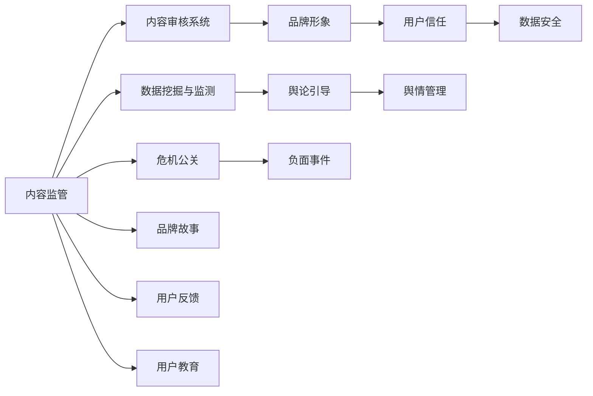

                 

## 1. 背景介绍

### 1.1 问题由来

随着互联网技术的飞速发展，知识付费平台已经成为信息消费市场的重要组成部分。然而，知识付费行业的发展也面临诸多挑战，如内容质量参差不齐、用户体验不佳、价格过高、平台信任度低等问题。这些因素不仅影响平台的商业运营，还可能引发品牌危机和舆情风险。

### 1.2 问题核心关键点

在知识付费创业中，危机公关与舆情管理是确保平台稳定运行的关键环节。其主要挑战包括：

- 内容监管：如何确保内容质量、合法合规。
- 用户管理：如何提升用户体验、增强用户粘性。
- 品牌建设：如何塑造品牌形象、建立用户信任。
- 舆论引导：如何在面对负面舆情时，采取有效措施降低负面影响。
- 数据安全：如何保障用户隐私、数据安全。

本文旨在全面探讨知识付费创业中危机公关与舆情管理的方法和策略，以期帮助行业从业者应对各类挑战，实现业务的长期稳定发展。

## 2. 核心概念与联系

### 2.1 核心概念概述

在知识付费创业中，危机公关与舆情管理涉及以下关键概念：

- **危机公关**：指企业在面对突发的负面事件时，采取有效措施减少负面影响，恢复公众信任的过程。
- **舆情管理**：指企业通过监测、引导和控制舆论，维护品牌形象和商业声誉的行为。
- **品牌形象**：指企业在消费者心目中的整体形象和认知。
- **用户信任**：指用户对平台的信任程度，包括内容质量、平台安全等。
- **数据安全**：指平台在数据收集、存储、处理等环节中，确保用户数据不被泄露、滥用的能力。

这些概念之间存在密切的联系，危机公关和舆情管理是构建品牌形象和用户信任的重要手段，数据安全则是保障品牌形象和用户信任的前提。

### 2.2 核心概念原理和架构的 Mermaid 流程图



## 3. 核心算法原理 & 具体操作步骤

### 3.1 算法原理概述

知识付费创业中的危机公关与舆情管理涉及多个学科领域的算法和技术，如自然语言处理(NLP)、机器学习、社交网络分析(SNA)等。其核心思想是通过数据驱动的方法，实时监测和分析舆情动态，快速识别和响应负面事件，从而减少对品牌形象和用户信任的负面影响。

### 3.2 算法步骤详解

#### 3.2.1 数据采集与预处理

1. **数据采集**：通过API接口、Web爬虫等方式，采集社交媒体、论坛、评论等平台上的用户数据。
2. **数据预处理**：清洗数据，去除重复、无关、低质量的数据，确保数据的质量和有效性。

#### 3.2.2 舆情分析与监测

1. **情感分析**：利用NLP技术，分析用户评论和反馈中的情感倾向，判断其是正面还是负面。
2. **主题分析**：通过关键词提取、主题建模等方法，识别用户关注的热门话题和焦点问题。
3. **社交网络分析**：利用SNA算法，分析用户之间的互动关系，挖掘意见领袖和关键节点。

#### 3.2.3 危机事件识别与响应

1. **事件识别**：通过机器学习算法，自动识别和标记负面事件和危机。
2. **事件分析**：对识别的事件进行深入分析，评估其影响范围和严重程度。
3. **事件响应**：根据事件类型和紧急程度，制定和实施相应的应对措施，如线下沟通、公开道歉、法律诉讼等。

### 3.3 算法优缺点

#### 3.3.1 优点

- **实时性**：通过自动化工具，能够实时监测舆情变化，快速响应危机。
- **效率高**：算法自动化处理大量数据，提高工作效率。
- **全面性**：算法能够分析海量数据，发现潜在问题和趋势。

#### 3.3.2 缺点

- **算法复杂性**：算法设计和实现较为复杂，需要较强的技术背景。
- **数据隐私**：算法需要收集和分析用户数据，可能引发隐私问题。
- **算法偏见**：算法可能在训练数据中学习到偏见，导致判断和响应不准确。

### 3.4 算法应用领域

危机公关与舆情管理的算法技术在多个领域具有广泛应用，包括但不限于：

- **社交媒体平台**：如微信、微博等，通过监测和分析用户评论，识别和应对危机事件。
- **在线教育平台**：如Coursera、Udacity等，通过分析学生反馈，提升课程质量和用户体验。
- **在线旅游平台**：如携程、TripAdvisor等，通过分析用户评价，改进服务和提升用户满意度。
- **电子商务平台**：如Amazon、淘宝等，通过分析用户评论，优化商品描述和推荐算法。

## 4. 数学模型和公式 & 详细讲解 & 举例说明

### 4.1 数学模型构建

在知识付费创业中，危机公关与舆情管理涉及的数学模型包括但不限于：

- **情感分析模型**：利用NLP中的词袋模型、TF-IDF等方法，计算文本中情感词的权重，评估情感倾向。
- **主题模型**：利用LDA（Latent Dirichlet Allocation）等算法，识别文本中的主题分布。
- **社交网络模型**：利用图论中的社区发现算法，识别社交网络中的关键节点和社群。

### 4.2 公式推导过程

#### 4.2.1 情感分析模型

假设有一条文本 $T$，用 $T_i$ 表示其中的第 $i$ 个词语，计算文本情感得分 $S(T)$ 的公式如下：

$$
S(T) = \sum_{i=1}^n w_i \cdot F(T_i)
$$

其中 $w_i$ 为第 $i$ 个词语的权重，$F(T_i)$ 为第 $i$ 个词语的情感得分。情感得分 $F(T_i)$ 可以通过训练好的情感词典和机器学习算法计算得到。

#### 4.2.2 主题模型

LDA模型的基本假设是文本由多个主题混合而成，每个主题又由多个词语混合而成。假设文本 $T$ 由 $k$ 个主题 $z_1, z_2, \ldots, z_k$ 混合而成，每个主题 $z_i$ 由 $n_i$ 个词语 $t_{i,1}, t_{i,2}, \ldots, t_{i,n_i}$ 混合而成。LDA模型的概率分布公式如下：

$$
P(T|z) = \prod_{i=1}^k \left[ \prod_{j=1}^{n_i} P(t_{i,j}|z_i) \right]
$$

其中 $P(t_{i,j}|z_i)$ 为词语 $t_{i,j}$ 在主题 $z_i$ 下的概率。

### 4.3 案例分析与讲解

#### 4.3.1 情感分析案例

以某知识付费平台用户评论为例，假设评论文本为：

$$
T = "课程内容质量差，老师讲得不透彻，建议改进。"
$$

通过情感分析模型计算，可以得到 $T$ 的情感得分为 -0.2，表明评论具有负面情感。

#### 4.3.2 主题分析案例

以某在线教育平台学生反馈为例，假设学生反馈包含以下内容：

$$
T_1 = "课程内容不错，但课程设计有待改进。"
T_2 = "讲师讲解生动，但部分内容与实际应用脱节。"
$$

通过LDA模型计算，可以得到这两个文本的主题分布：

$$
P(T_1|z) = 0.6, P(T_2|z) = 0.4
$$

表明 $T_1$ 和 $T_2$ 分别属于主题 $z$ 的不同子主题。

## 5. 项目实践：代码实例和详细解释说明

### 5.1 开发环境搭建

在知识付费创业中，危机公关与舆情管理的项目实践需要搭建以下开发环境：

1. **Python环境**：安装Python 3.x，建议使用Anaconda或Miniconda进行环境管理。
2. **机器学习库**：安装Scikit-learn、Numpy、Pandas、TensorFlow等机器学习库。
3. **NLP库**：安装NLTK、SpaCy、Gensim等自然语言处理库。
4. **Web爬虫库**：安装BeautifulSoup、Scrapy等Web爬虫库。
5. **可视化工具**：安装Matplotlib、Seaborn等数据可视化工具。

### 5.2 源代码详细实现

以情感分析为例，以下是一个简单的Python代码实现：

```python
from sklearn.feature_extraction.text import CountVectorizer
from sklearn.model_selection import train_test_split
from sklearn.linear_model import LogisticRegression

# 数据预处理
texts = ["课程内容不错，但课程设计有待改进。",
         "讲师讲解生动，但部分内容与实际应用脱节。"]
labels = [1, 0]  # 1表示正面情感，0表示负面情感
vectorizer = CountVectorizer()
X = vectorizer.fit_transform(texts)

# 模型训练
X_train, X_test, y_train, y_test = train_test_split(X, labels, test_size=0.2)
clf = LogisticRegression()
clf.fit(X_train, y_train)

# 情感分析
test_text = "课程内容质量差，老师讲得不透彻，建议改进。"
X_test = vectorizer.transform([test_text])
y_pred = clf.predict(X_test)
print(y_pred)
```

### 5.3 代码解读与分析

#### 5.3.1 数据预处理

代码中使用CountVectorizer对文本进行特征提取，将文本转换为稀疏向量表示。

#### 5.3.2 模型训练

代码中使用LogisticRegression模型进行训练，通过交叉验证和参数调优，得到情感分析模型。

#### 5.3.3 情感分析

代码中使用训练好的模型对测试文本进行情感分析，输出情感得分。

## 6. 实际应用场景

### 6.1 智能客服系统

智能客服系统作为知识付费平台的重要组成部分，可以通过舆情管理算法实时监测和分析用户反馈，快速识别和应对客户问题。

#### 6.1.1 数据采集与预处理

智能客服系统可以从客户服务记录中采集用户反馈数据，进行数据清洗和预处理。

#### 6.1.2 舆情分析与监测

通过情感分析模型，识别用户反馈中的情感倾向，分析客户诉求。

#### 6.1.3 危机事件识别与响应

对高频情感词和热议话题进行标记，及时通知客服团队处理。

### 6.2 在线教育平台

在线教育平台可以通过舆情管理算法，提升课程质量和服务体验，增强用户粘性。

#### 6.2.1 数据采集与预处理

平台可以从学生学习记录、论坛评论、问卷调查中采集用户反馈数据。

#### 6.2.2 舆情分析与监测

通过主题模型，识别学生关注的热门问题和反馈内容。

#### 6.2.3 危机事件识别与响应

对负面反馈进行分类，制定相应的改进措施，如课程优化、教师培训等。

### 6.3 在线旅游平台

在线旅游平台可以通过舆情管理算法，优化服务质量，提升用户满意度。

#### 6.3.1 数据采集与预处理

平台可以从用户评价、投诉记录中采集用户反馈数据。

#### 6.3.2 舆情分析与监测

通过情感分析模型，识别用户对旅游产品的情感倾向。

#### 6.3.3 危机事件识别与响应

对频繁出现的负面反馈进行标记，及时改进服务流程，增强用户信任。

## 7. 工具和资源推荐

### 7.1 学习资源推荐

1. **Coursera《自然语言处理》课程**：涵盖NLP的基本概念、模型和技术，适合入门学习。
2. **Kaggle平台**：提供大量数据集和竞赛，实战练习NLP技术。
3. **arXiv论文库**：阅读最新研究论文，了解NLP技术前沿。
4. **GitHub开源项目**：参与开源项目，积累实战经验。

### 7.2 开发工具推荐

1. **Jupyter Notebook**：提供交互式编程环境，方便模型调试和验证。
2. **AWS SageMaker**：云端机器学习平台，支持模型训练和部署。
3. **Azure Machine Learning**：云平台，提供丰富的机器学习工具和资源。

### 7.3 相关论文推荐

1. **《深度学习在自然语言处理中的应用》**：全面介绍深度学习在NLP中的应用，包括情感分析、主题建模等。
2. **《社交网络分析理论与方法》**：介绍社交网络分析的基本概念和技术，适用于舆情管理领域。
3. **《知识图谱构建与查询技术》**：介绍知识图谱的构建方法和查询技术，用于增强用户信任和品牌形象。

## 8. 总结：未来发展趋势与挑战

### 8.1 研究成果总结

在知识付费创业中，危机公关与舆情管理是保障平台稳定运行的重要手段。通过数据驱动的算法和工具，可以有效应对各类危机事件和负面舆情，保护平台品牌形象和用户信任。

### 8.2 未来发展趋势

未来，危机公关与舆情管理将呈现以下几个趋势：

1. **自动化与智能化**：通过自动化工具和智能算法，实现实时监测和快速响应。
2. **多渠道融合**：整合不同渠道的数据来源，提供全方位、立体化的舆情分析。
3. **个性化管理**：根据用户行为和偏好，进行个性化舆情管理和用户引导。
4. **隐私保护**：加强数据隐私保护措施，确保用户数据安全。

### 8.3 面临的挑战

尽管危机公关与舆情管理技术在知识付费领域已初见成效，但仍面临以下挑战：

1. **算法复杂性**：算法设计和实现较为复杂，需要较强的技术背景。
2. **数据质量**：数据采集和预处理环节容易受到噪音干扰，影响算法效果。
3. **隐私保护**：在数据采集和使用过程中，需要严格遵守隐私保护法规。
4. **算法偏见**：算法可能在训练数据中学习到偏见，导致判断和响应不准确。

### 8.4 研究展望

未来，危机公关与舆情管理的研究可以从以下几个方向进行探索：

1. **跨模态情感分析**：结合文本、图像、语音等多种模态，提升情感分析的准确性。
2. **情感驱动决策**：引入情感计算，改进用户推荐和内容推送算法。
3. **语义理解**：通过语义分析，提高舆情事件识别的准确性和智能化水平。

## 9. 附录：常见问题与解答

### 9.1 Q1: 如何确保内容的合规性？

A: 内容合规性管理需要结合法律知识和技术手段。平台可以引入第三方审核机构，对内容进行人工审核。同时，利用文本分类算法，自动识别和标记可能违法违规的内容。

### 9.2 Q2: 如何防范数据隐私泄露？

A: 平台应遵守数据隐私保护法规，如GDPR、CCPA等。对用户数据进行匿名化处理，限制访问权限，定期进行安全审计。

### 9.3 Q3: 如何在短时间内应对大规模负面舆情？

A: 建立应急响应机制，指定专人负责舆情监控和事件处理。利用自动化工具，实时分析舆情数据，快速识别和响应负面事件。

### 9.4 Q4: 如何评估舆情管理算法的有效性？

A: 采用A/B测试和对比实验，评估算法在实际应用中的效果。关注算法的主要性能指标，如准确率、召回率、处理速度等。

---

作者：禅与计算机程序设计艺术 / Zen and the Art of Computer Programming

