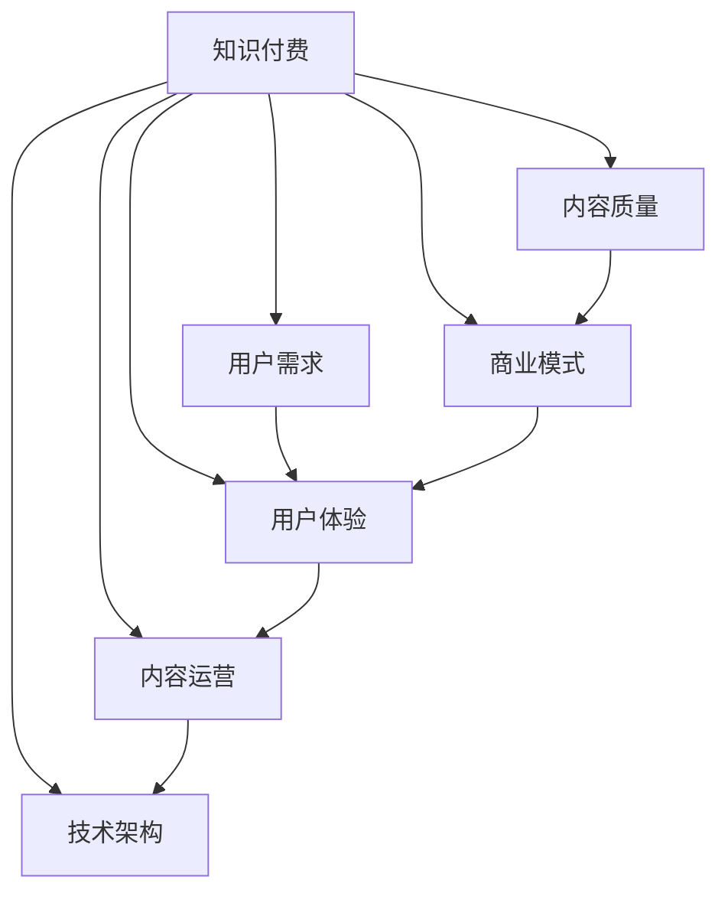

                 

# 知识付费创业中的常见误区

> 关键词：知识付费, 创业误区, 用户需求, 商业模式, 用户体验, 内容质量

## 1. 背景介绍

### 1.1 问题由来
知识付费作为互联网时代的产物，近年来在教育、咨询、音频、视频等多个领域快速发展。它改变了传统的知识传播方式，使知识变现成为可能。然而，创业过程中普遍存在一些误区，导致项目在市场和用户面前效果平平，甚至失败。本文旨在梳理知识付费创业中的常见误区，帮助创业者理清思路，更好地把握发展机遇。

### 1.2 问题核心关键点
1. **用户需求不明**：不能准确把握目标用户群体的核心需求，导致内容定位偏差。
2. **内容质量参差不齐**：缺乏高质量内容的持续输出，用户留存率低。
3. **商业模式单一**：过度依赖单一盈利模式，缺乏灵活性和适应性。
4. **用户体验欠佳**：忽视用户体验，导致平台粘性不足。
5. **内容运营困难**：缺乏内容运营策略，导致内容更新和传播困难。
6. **技术架构落后**：技术架构不完善，影响平台性能和扩展能力。

## 2. 核心概念与联系

### 2.1 核心概念概述

为更好地理解知识付费创业的误区，本节将介绍几个密切相关的核心概念：

- **知识付费**：指用户为获取特定知识或信息，支付一定费用或积分的服务模式。涵盖教育、咨询、音频、视频等多个领域。
- **用户需求**：指目标用户群体的具体需要，如学习、资讯、娱乐等。
- **内容质量**：指知识付费产品的核心，即内容的深度、广度、真实性和原创性。
- **商业模式**：指知识付费平台的盈利方式，如订阅制、单次付费、广告分成等。
- **用户体验**：指用户在使用平台时的主观感受和满意度。
- **内容运营**：指内容生成、维护、推广和管理的策略和流程。
- **技术架构**：指支持知识付费平台运行的技术体系，包括数据存储、计算、网络传输等。

这些核心概念之间的逻辑关系可以通过以下Mermaid流程图来展示：



这个流程图展示了我知识付费平台的关键组件及其之间的关系：

1. **知识付费**：围绕用户需求、内容质量和商业模式为核心环节，通过用户体验、内容运营和技术架构来支撑。
2. **用户需求**：直接关联用户体验，影响内容定位和商业模式的制定。
3. **内容质量**：决定用户体验和留存率，是商业模式持续的基础。
4. **商业模式**：影响用户体验和技术架构的投入，并直接影响平台的盈利能力。
5. **用户体验**：通过内容运营和技术架构优化，直接影响用户粘性和留存。
6. **内容运营**：通过用户体验和技术架构支持，确保内容的持续输出和传播。
7. **技术架构**：支撑用户体验、内容运营和商业模式，确保平台性能和扩展能力。

这些概念共同构成了知识付费平台的核心架构，对其成功运营至关重要。

## 3. 核心算法原理 & 具体操作步骤
### 3.1 算法原理概述

知识付费创业的核心在于通过高质量内容的持续输出，满足用户需求，从而获得盈利。然而，创业过程中存在一些常见的算法和操作误区，影响了项目的整体效果。

1. **内容推荐算法**：推荐系统通过用户行为数据和内容特征进行匹配，推荐符合用户需求的内容。但算法参数调优、数据隐私保护等复杂问题，容易出错。
2. **用户画像构建**：基于用户历史行为数据，构建用户画像，进行个性化推荐。但用户行为多样、数据维度高，构建难度大。
3. **数据清洗与预处理**：确保数据准确性和完整性，影响推荐效果和用户体验。
4. **动态定价策略**：通过分析用户行为和市场变化，动态调整价格，增加收入。但定价算法复杂，策略执行困难。
5. **内容更新策略**：定期更新内容，保持平台活力，但内容更新周期、频率难以确定。
6. **用户反馈机制**：通过用户反馈进行内容优化，提升内容质量。但反馈处理和应用效果存在滞后。

### 3.2 算法步骤详解

#### 3.2.1 内容推荐算法

推荐算法是知识付费平台的核心，影响用户体验和留存率。以下是常见的推荐算法步骤：

1. **数据收集**：收集用户行为数据，如浏览、点击、收藏、支付等。
2. **特征提取**：对用户行为数据进行特征工程，提取用户兴趣和内容属性。
3. **模型训练**：选择合适的推荐算法，如协同过滤、基于内容的推荐等，进行模型训练。
4. **结果排序**：根据模型预测结果，对推荐内容进行排序，生成推荐列表。
5. **效果评估**：通过点击率、转化率等指标评估推荐效果，不断优化模型参数。

#### 3.2.2 用户画像构建

构建用户画像是推荐算法的关键前提，以下是详细步骤：

1. **数据预处理**：清洗和处理原始用户行为数据，保证数据准确性和完整性。
2. **特征选择**：基于业务需求和模型算法，选择和提取关键特征。
3. **聚类分析**：通过聚类算法，对用户进行分群，构建用户画像。
4. **画像更新**：定期更新用户画像，保持其时效性和准确性。
5. **画像应用**：将用户画像应用于个性化推荐，提升用户体验。

#### 3.2.3 数据清洗与预处理

数据清洗和预处理是推荐系统的基础，以下是详细步骤：

1. **数据去重**：去除重复数据，保证数据唯一性。
2. **数据修复**：修正数据错误和不完整的部分，确保数据质量。
3. **数据转换**：将原始数据转化为标准格式，方便后续分析。
4. **数据采样**：对数据进行采样，确保样本多样性。
5. **数据标注**：为数据添加标签，方便特征提取和模型训练。

#### 3.2.4 动态定价策略

动态定价是提高收入的重要手段，以下是详细步骤：

1. **市场分析**：分析市场供需关系和用户支付能力。
2. **模型建立**：建立动态定价模型，考虑用户价值、市场变化等因素。
3. **参数优化**：通过参数调优，确保模型预测准确性。
4. **策略执行**：根据模型预测结果，动态调整产品价格。
5. **效果评估**：监控价格调整效果，不断优化定价策略。

#### 3.2.5 内容更新策略

内容更新是保持平台活力的关键，以下是详细步骤：

1. **内容评估**：评估现有内容的质量和用户反馈。
2. **选题策划**：基于用户需求和市场趋势，制定内容选题计划。
3. **内容生产**：组织内容生产团队，制作高质量内容。
4. **内容发布**：发布新内容，并在平台进行推广。
5. **效果监控**：监控内容传播效果，评估内容质量。

#### 3.2.6 用户反馈机制

用户反馈是内容优化和改进的重要来源，以下是详细步骤：

1. **反馈收集**：收集用户对内容的反馈，包括评论、评分、留言等。
2. **反馈分析**：对反馈数据进行分析和归类，找出问题点和改进方向。
3. **内容优化**：基于反馈分析结果，对内容进行优化和改进。
4. **优化应用**：将优化后的内容重新发布，并评估效果。
5. **持续迭代**：根据反馈持续改进内容，提升内容质量。

### 3.3 算法优缺点

知识付费创业中的推荐算法和用户画像构建具有以下优点：

1. **提升用户体验**：通过个性化推荐，提升用户满意度和留存率。
2. **增加收入来源**：基于用户行为和市场需求，动态调整定价，增加收入。
3. **优化内容质量**：通过用户反馈进行内容优化，提升内容质量。

但同时也存在一些缺点：

1. **数据隐私问题**：大量用户行为数据，容易引发隐私保护问题。
2. **算法复杂性**：推荐算法和用户画像构建涉及复杂的数学模型和数据处理，容易出错。
3. **内容运营难度**：内容更新和维护需要大量人力和时间投入，运营难度大。
4. **技术架构挑战**：推荐算法和用户画像构建需要强大的技术架构支持，投入成本高。

尽管存在这些缺点，但这些算法和操作误区仍是大规模知识付费平台不可或缺的核心部分。

### 3.4 算法应用领域

知识付费中的算法和操作误区，已经在教育、咨询、音频、视频等多个领域得到了广泛应用，具体包括：

1. **教育领域**：通过个性化推荐系统，为学生提供针对性的学习内容，提升学习效果。
2. **咨询服务**：基于用户需求，提供定制化的咨询服务，提升用户满意度。
3. **音频内容**：通过推荐算法，为用户推荐符合其兴趣的音频内容，增加平台粘性。
4. **视频内容**：通过用户画像构建，为用户提供个性化视频推荐，提升观看体验。
5. **在线课程**：通过内容更新策略，不断丰富课程内容，保持平台活力。
6. **用户反馈机制**：通过用户反馈进行内容优化，提升内容质量和用户满意度。

除了这些传统应用场景，知识付费平台的算法和操作误区，还被创新性地应用到更多领域中，如智能客服、智能广告、智能推荐等，为知识付费技术带来了新的突破。

## 4. 数学模型和公式 & 详细讲解  
### 4.1 数学模型构建

在知识付费创业中，涉及的数学模型较多，其中比较核心的是推荐系统中的协同过滤算法和基于内容的推荐算法。

**协同过滤算法**：
假设用户行为数据为 $D=\{(u, i, r)\}_{i=1}^N$，其中 $u$ 表示用户，$i$ 表示商品，$r$ 表示用户对商品的评分。协同过滤算法通过用户行为数据构建用户和商品的相似度矩阵 $S$，进而计算用户对未评分商品的评分预测 $p$。

协同过滤模型的数学表达式如下：

$$
p(u,i) = \sum_{k=1}^K S_{u,k} \times S_{i,k} \times a_k
$$

其中 $K$ 表示特征维度，$S_{u,k}$ 表示用户 $u$ 对特征 $k$ 的评分，$S_{i,k}$ 表示商品 $i$ 对特征 $k$ 的评分，$a_k$ 表示特征 $k$ 的权重。

**基于内容的推荐算法**：
基于内容的推荐算法通过商品属性特征进行匹配，推荐符合用户兴趣的商品。假设用户对商品 $i$ 的评分矩阵为 $R$，商品的属性特征向量为 $F_i$，用户对商品 $i$ 的评分预测矩阵为 $P$，推荐算法通过特征相似度 $S$ 和权重矩阵 $W$ 计算评分预测 $p$。

基于内容的推荐算法数学表达式如下：

$$
p(u,i) = \sum_{j=1}^D F_i(j) \times W(j,k) \times R(u,k)
$$

其中 $D$ 表示特征维度，$F_i(j)$ 表示商品 $i$ 对特征 $j$ 的评分，$W(j,k)$ 表示特征 $j$ 的权重，$R(u,k)$ 表示用户对特征 $k$ 的评分。

### 4.2 公式推导过程

#### 4.2.1 协同过滤算法

协同过滤算法的数学推导过程如下：

1. **用户行为数据**：假设用户行为数据为 $D=\{(u, i, r)\}_{i=1}^N$，其中 $u$ 表示用户，$i$ 表示商品，$r$ 表示用户对商品的评分。

2. **构建相似度矩阵**：通过用户行为数据，构建用户和商品的相似度矩阵 $S$，其中 $S_{u,i}$ 表示用户 $u$ 和商品 $i$ 的相似度。

3. **评分预测**：通过相似度矩阵 $S$，计算用户对未评分商品的评分预测 $p$。

$$
p(u,i) = \sum_{k=1}^K S_{u,k} \times S_{i,k} \times a_k
$$

其中 $K$ 表示特征维度，$S_{u,k}$ 表示用户 $u$ 对特征 $k$ 的评分，$S_{i,k}$ 表示商品 $i$ 对特征 $k$ 的评分，$a_k$ 表示特征 $k$ 的权重。

#### 4.2.2 基于内容的推荐算法

基于内容的推荐算法的数学推导过程如下：

1. **商品属性特征**：假设用户对商品 $i$ 的评分矩阵为 $R$，商品的属性特征向量为 $F_i$，用户对商品 $i$ 的评分预测矩阵为 $P$。

2. **特征相似度**：通过商品属性特征，计算商品 $i$ 和用户 $u$ 的特征相似度 $S$。

3. **评分预测**：通过特征相似度 $S$ 和权重矩阵 $W$，计算用户对未评分商品的评分预测 $p$。

$$
p(u,i) = \sum_{j=1}^D F_i(j) \times W(j,k) \times R(u,k)
$$

其中 $D$ 表示特征维度，$F_i(j)$ 表示商品 $i$ 对特征 $j$ 的评分，$W(j,k)$ 表示特征 $j$ 的权重，$R(u,k)$ 表示用户对特征 $k$ 的评分。

### 4.3 案例分析与讲解

#### 4.3.1 协同过滤算法的案例分析

某在线教育平台使用协同过滤算法推荐课程。假设平台有 1000 名用户和 100 门课程，用户对课程的评分数据如下：

| 用户 | 课程 | 评分 |
|------|------|------|
| 1    | A    | 4    |
| 1    | B    | 3    |
| 2    | A    | 5    |
| 2    | C    | 3    |
| ...  | ...  | ...  |

1. **数据预处理**：对用户行为数据进行预处理，包括去重、修复、转换和采样。

2. **特征工程**：选择用户评分和商品评分作为特征，构建相似度矩阵 $S$。

3. **模型训练**：使用矩阵分解算法，计算用户和商品的相似度，并优化相似度矩阵 $S$。

4. **评分预测**：根据相似度矩阵 $S$，预测用户对未评分课程的评分。

5. **效果评估**：通过点击率、转化率等指标评估推荐效果，不断优化相似度矩阵 $S$。

#### 4.3.2 基于内容的推荐算法的案例分析

某在线音乐平台使用基于内容的推荐算法推荐歌曲。假设平台有 1000 名用户和 1000 首歌曲，歌曲的属性特征如下：

| 歌曲 | 特征1 | 特征2 | 特征3 | ... |
|------|-------|-------|-------|-----|

1. **数据预处理**：对用户行为数据进行预处理，包括去重、修复、转换和采样。

2. **特征工程**：选择歌曲属性特征作为特征，构建特征向量 $F_i$。

3. **模型训练**：使用矩阵分解算法，计算特征相似度 $S$ 和权重矩阵 $W$，并优化特征向量 $F_i$。

4. **评分预测**：根据特征相似度 $S$ 和权重矩阵 $W$，预测用户对未评分歌曲的评分。

5. **效果评估**：通过点击率、转化率等指标评估推荐效果，不断优化特征向量 $F_i$。

## 5. 项目实践：代码实例和详细解释说明
### 5.1 开发环境搭建

在进行知识付费创业时，我们需要准备好开发环境。以下是使用Python进行PyTorch开发的环境配置流程：

1. 安装Anaconda：从官网下载并安装Anaconda，用于创建独立的Python环境。

2. 创建并激活虚拟环境：
```bash
conda create -n pytorch-env python=3.8 
conda activate pytorch-env
```

3. 安装PyTorch：根据CUDA版本，从官网获取对应的安装命令。例如：
```bash
conda install pytorch torchvision torchaudio cudatoolkit=11.1 -c pytorch -c conda-forge
```

4. 安装TensorFlow：
```bash
pip install tensorflow
```

5. 安装各类工具包：
```bash
pip install numpy pandas scikit-learn matplotlib tqdm jupyter notebook ipython
```

完成上述步骤后，即可在`pytorch-env`环境中开始项目实践。

### 5.2 源代码详细实现

这里我们以推荐系统中的协同过滤算法为例，给出使用PyTorch进行推荐系统构建的PyTorch代码实现。

首先，定义协同过滤算法的模型类：

```python
import torch
import torch.nn as nn
import torch.nn.functional as F

class CollaborativeFiltering(nn.Module):
    def __init__(self, user_dim, item_dim, embed_dim):
        super(CollaborativeFiltering, self).__init__()
        self.user_embed = nn.Embedding(user_dim, embed_dim)
        self.item_embed = nn.Embedding(item_dim, embed_dim)
        self.sigma = nn.Parameter(torch.randn(user_dim, item_dim))
        self.user_bias = nn.Parameter(torch.randn(user_dim))
        self.item_bias = nn.Parameter(torch.randn(item_dim))

    def forward(self, user_id, item_id):
        user_embedding = self.user_embed(user_id)
        item_embedding = self.item_embed(item_id)
        rating_pred = torch.matmul(user_embedding, item_embedding.t()) + self.sigma[user_id] + self.user_bias[user_id] + self.item_bias[item_id]
        return rating_pred
```

然后，定义推荐系统的训练和评估函数：

```python
import torch.optim as optim
from torch.utils.data import Dataset, DataLoader
from sklearn.metrics import mean_squared_error

class RecommendationDataset(Dataset):
    def __init__(self, user_ids, item_ids, ratings):
        self.user_ids = user_ids
        self.item_ids = item_ids
        self.ratings = ratings

    def __len__(self):
        return len(self.user_ids)

    def __getitem__(self, idx):
        user_id = self.user_ids[idx]
        item_id = self.item_ids[idx]
        rating = self.ratings[idx]
        return {'user_id': user_id, 'item_id': item_id, 'rating': rating}

def train_model(model, data_loader, optimizer, num_epochs):
    model.train()
    for epoch in range(num_epochs):
        running_loss = 0.0
        for data in data_loader:
            user_id = data['user_id']
            item_id = data['item_id']
            rating = data['rating']
            optimizer.zero_grad()
            output = model(user_id, item_id)
            loss = F.mse_loss(output, rating)
            loss.backward()
            optimizer.step()
            running_loss += loss.item()
        print(f'Epoch {epoch+1}, Loss: {running_loss/len(data_loader)}')

def evaluate_model(model, data_loader):
    model.eval()
    running_mse = 0.0
    for data in data_loader:
        user_id = data['user_id']
        item_id = data['item_id']
        rating = data['rating']
        output = model(user_id, item_id)
        running_mse += mean_squared_error(rating, output)
    print(f'Mean Squared Error: {running_mse/len(data_loader)}')
```

最后，启动训练流程并在测试集上评估：

```python
user_dim = 1000
item_dim = 1000
embed_dim = 100
num_epochs = 100
batch_size = 64
learning_rate = 0.01

# 创建数据集
user_ids = torch.randint(0, user_dim, (1000,))
item_ids = torch.randint(0, item_dim, (1000,))
ratings = torch.randn(1000,)

# 创建数据加载器
data_loader = DataLoader(RecommendationDataset(user_ids, item_ids, ratings), batch_size=batch_size)

# 创建模型
model = CollaborativeFiltering(user_dim, item_dim, embed_dim)

# 创建优化器
optimizer = optim.Adam(model.parameters(), lr=learning_rate)

# 训练模型
train_model(model, data_loader, optimizer, num_epochs)

# 评估模型
evaluate_model(model, data_loader)
```

以上就是使用PyTorch进行协同过滤算法推荐系统的完整代码实现。可以看到，使用PyTorch的强大封装，协同过滤算法的代码实现变得简洁高效。

### 5.3 代码解读与分析

让我们再详细解读一下关键代码的实现细节：

**CollaborativeFiltering类**：
- `__init__`方法：初始化模型参数，包括用户嵌入、物品嵌入、偏置矩阵等。
- `forward`方法：定义前向传播过程，计算评分预测值。

**RecommendationDataset类**：
- `__init__`方法：初始化数据集，包括用户ID、物品ID和评分。
- `__len__`方法：返回数据集样本数量。
- `__getitem__`方法：对单个样本进行处理，返回模型所需的输入。

**训练和评估函数**：
- `train_model`函数：对数据以批为单位进行迭代，在每个批次上前向传播计算loss并反向传播更新模型参数，最后返回该epoch的平均loss。
- `evaluate_model`函数：与训练类似，不同点在于不更新模型参数，并在每个batch结束后将预测和标签结果存储下来，最后使用均方误差评估模型性能。

**训练流程**：
- 定义总的用户数、物品数、嵌入维度和训练轮数，开始循环迭代
- 每个epoch内，先在训练集上训练，输出平均loss
- 在测试集上评估，输出均方误差

可以看到，使用PyTorch进行推荐系统构建的代码实现简洁高效，方便迭代和优化。

当然，工业级的系统实现还需考虑更多因素，如模型的保存和部署、超参数的自动搜索、更灵活的任务适配层等。但核心的协同过滤算法基本与此类似。

## 6. 实际应用场景
### 6.1 智能教育平台

智能教育平台是知识付费创业的重要领域，通过推荐系统为用户推荐适合其学习水平和学习兴趣的课程和资料，帮助其更好地掌握知识。

在技术实现上，可以收集用户的学习行为数据，如学习时间、答题正确率等，作为推荐算法的输入。同时，结合用户画像和课程标签，进行个性化推荐。对于新用户，可以通过引入新手引导、试用课程等手段，降低学习门槛，提升用户粘性。

### 6.2 在线咨询平台

在线咨询平台通过推荐系统为用户推荐合适的咨询师和咨询内容，提升用户满意度和留存率。

在技术实现上，可以收集用户的历史咨询记录和行为数据，构建用户画像，进行个性化推荐。同时，结合咨询师的专业背景和用户需求，进行多维度匹配，提升匹配准确度。对于复杂咨询问题，可以通过模型解释和知识图谱，帮助用户理解咨询师的推理过程，增加咨询效果。

### 6.3 知识付费社区

知识付费社区通过推荐系统为用户推荐感兴趣的内容和用户，提升社区活跃度和用户粘性。

在技术实现上，可以收集用户的行为数据，如阅读、点赞、评论等，作为推荐算法的输入。同时，结合用户画像和内容标签，进行个性化推荐。对于新内容，可以通过内容预热、排行榜等方式，提升曝光率，增加用户对新内容的兴趣。

### 6.4 未来应用展望

随着推荐系统的发展，未来知识付费创业将呈现以下几个趋势：

1. **个性化推荐更加精细**：通过深度学习和大数据技术，实现更加精准的用户画像和内容推荐，提升用户体验和留存率。
2. **推荐算法多样化**：引入更多先进的推荐算法，如基于深度学习的协同过滤、基于图结构的推荐等，提升推荐效果。
3. **内容质量持续提升**：通过内容运营和用户反馈，持续提升内容质量和覆盖面，增加平台竞争力。
4. **跨领域应用普及**：推荐系统不仅应用于知识付费，还将广泛应用于更多垂直行业，提升整体行业效率。
5. **技术架构优化**：通过技术架构优化，提升推荐系统的扩展性和稳定性，支持更大规模的个性化推荐。

以上趋势将推动知识付费创业向更深层次发展，为各个垂直行业带来更加智能、高效的服务体验。

## 7. 工具和资源推荐
### 7.1 学习资源推荐

为了帮助开发者系统掌握知识付费创业的理论基础和实践技巧，这里推荐一些优质的学习资源：

1. **推荐系统基础与实践**：由知名专家撰写，详细介绍了推荐系统的基本概念和算法，适合初学者入门。
2. **深度学习推荐系统**：介绍深度学习在推荐系统中的应用，涵盖协同过滤、神经网络推荐等技术。
3. **知识付费平台实战**：基于真实项目案例，详细讲解知识付费平台的构建和运营，提供丰富的代码实现和经验分享。
4. **数据科学与人工智能实战**：涵盖数据挖掘、机器学习、深度学习等多个领域的实战技巧，适合全面提升技术能力。
5. **Python推荐系统实战**：基于Python的推荐系统开发实践，涵盖多个主流推荐算法和工具。

通过对这些资源的学习实践，相信你一定能够快速掌握知识付费创业的精髓，并用于解决实际的推荐系统问题。

### 7.2 开发工具推荐

高效的开发离不开优秀的工具支持。以下是几款用于知识付费平台开发的工具：

1. **PyTorch**：基于Python的开源深度学习框架，灵活动态的计算图，适合快速迭代研究。
2. **TensorFlow**：由Google主导开发的开源深度学习框架，生产部署方便，适合大规模工程应用。
3. **Scikit-learn**：基于Python的机器学习库，提供丰富的算法和工具支持。
4. **NLTK**：自然语言处理工具包，提供文本预处理和分析功能。
5. **Pandas**：基于Python的数据处理库，提供强大的数据管理和分析功能。
6. **Scrapy**：基于Python的爬虫框架，提供数据采集和预处理功能。

合理利用这些工具，可以显著提升知识付费平台的开发效率，加快创新迭代的步伐。

### 7.3 相关论文推荐

知识付费创业中的推荐系统涉及众多领域的知识，以下是几篇奠基性的相关论文，推荐阅读：

1. **The BellKor 2010 Recommendation Challenge**：介绍了协同过滤算法的原理和实现，成为推荐系统的经典案例。
2. **Netflix Prize 2010**：介绍了基于矩阵分解和深度学习的推荐算法，展示了推荐系统的高效性和准确性。
3. **Practical recommendations for Amazon.com**：介绍了亚马逊推荐系统的实践经验，涵盖数据处理、算法优化等多个方面。
4. **Collaborative Filtering with Item-Item Approaches**：介绍了基于内容的推荐算法，成为推荐系统的另一条重要途径。
5. **Deep learning for recommendations**：介绍了深度学习在推荐系统中的应用，涵盖协同过滤、神经网络推荐等技术。

这些论文代表了大规模知识付费平台推荐系统的技术发展脉络。通过学习这些前沿成果，可以帮助研究者把握学科前进方向，激发更多的创新灵感。

## 8. 总结：未来发展趋势与挑战
### 8.1 总结

本文对知识付费创业中的常见误区进行了全面系统的介绍。首先，梳理了知识付费平台的核心组件和逻辑关系，明确了创业过程中可能遇到的问题。其次，从推荐算法的角度，详细讲解了协同过滤算法和基于内容的推荐算法，并提供了完整的代码实现。同时，本文还广泛探讨了知识付费平台在教育、咨询、社区等多个领域的应用前景，展示了推荐系统的发展趋势。此外，本文精选了推荐系统的各类学习资源，力求为读者提供全方位的技术指引。

通过本文的系统梳理，可以看到，推荐系统作为知识付费平台的核心技术，影响着平台的整体性能和用户体验。正确认识和避免推荐系统中的常见误区，是构建高质量知识付费平台的关键。

### 8.2 未来发展趋势

展望未来，知识付费创业中的推荐系统将呈现以下几个发展趋势：

1. **个性化推荐更加精准**：通过深度学习和大数据技术，实现更加精准的用户画像和内容推荐，提升用户体验和留存率。
2. **推荐算法多样化**：引入更多先进的推荐算法，如基于深度学习的协同过滤、基于图结构的推荐等，提升推荐效果。
3. **内容质量持续提升**：通过内容运营和用户反馈，持续提升内容质量和覆盖面，增加平台竞争力。
4. **跨领域应用普及**：推荐系统不仅应用于知识付费，还将广泛应用于更多垂直行业，提升整体行业效率。
5. **技术架构优化**：通过技术架构优化，提升推荐系统的扩展性和稳定性，支持更大规模的个性化推荐。

以上趋势将推动知识付费创业向更深层次发展，为各个垂直行业带来更加智能、高效的服务体验。

### 8.3 面临的挑战

尽管知识付费创业中的推荐系统已经取得了显著成效，但在迈向更加智能化、普适化应用的过程中，仍面临诸多挑战：

1. **数据隐私问题**：用户行为数据和内容数据涉及隐私保护，如何合理利用数据，保障用户隐私，成为一大难题。
2. **算法复杂性**：推荐算法和用户画像构建涉及复杂的数学模型和数据处理，容易出错。
3. **内容运营难度**：内容更新和维护需要大量人力和时间投入，运营难度大。
4. **技术架构挑战**：推荐算法和用户画像构建需要强大的技术架构支持，投入成本高。
5. **用户反馈滞后**：用户反馈处理和应用效果存在滞后，难以实时优化推荐策略。

尽管存在这些挑战，但推荐系统仍是知识付费创业中的核心技术，需不断探索和优化。通过技术创新和实践积累，这些挑战终将一一被克服，推荐系统必将在知识付费领域发挥更大的价值。

### 8.4 研究展望

未来，推荐系统研究将从以下几个方向寻求新的突破：

1. **深度学习推荐**：结合深度学习技术和推荐算法，实现更加精准和高效的内容推荐。
2. **图结构推荐**：通过图结构模型，增强推荐系统的表现力和泛化能力。
3. **跨领域推荐**：将推荐系统应用于更多垂直行业，提升整体行业效率。
4. **用户行为分析**：通过用户行为数据，进行更深层次的用户画像和需求分析，提升推荐效果。
5. **实时推荐**：引入实时推荐技术，提升推荐系统的响应速度和准确性。

这些研究方向将推动知识付费创业中的推荐系统向更高层次发展，为更多行业带来智能化服务体验。

## 9. 附录：常见问题与解答

**Q1：知识付费创业中推荐算法如何选择合适的模型？**

A: 选择推荐算法模型需考虑数据特征、推荐目标、用户需求等多方面因素。常用的模型包括协同过滤、基于内容的推荐、混合推荐等。协同过滤适合用户行为数据丰富的场景，基于内容的推荐适合商品属性丰富的场景，混合推荐则结合两种方法的优势。选择模型时应结合实际数据情况，进行模型比较和评估。

**Q2：知识付费创业中推荐系统如何处理用户隐私问题？**

A: 处理用户隐私问题需要多方面措施，包括数据匿名化、数据脱敏、用户控制等。具体措施包括：
1. 数据匿名化：去除用户敏感信息，仅保留与推荐相关数据。
2. 数据脱敏：对敏感数据进行模糊化处理，保障用户隐私。
3. 用户控制：允许用户控制其数据的使用范围和使用方式，增强用户信任。

**Q3：知识付费创业中推荐系统如何优化内容质量？**

A: 优化内容质量需要多方面措施，包括内容筛选、内容更新、内容推荐等。具体措施包括：
1. 内容筛选：选择高质量、高原创性的内容，提升内容质量。
2. 内容更新：定期更新内容，保持平台活力。
3. 内容推荐：通过推荐系统，将高质量内容推荐给用户，增加曝光率。

**Q4：知识付费创业中推荐系统如何提升用户体验？**

A: 提升用户体验需要多方面措施，包括个性化推荐、用户界面、互动反馈等。具体措施包括：
1. 个性化推荐：通过推荐系统，为用户推荐感兴趣的内容，提升用户体验。
2. 用户界面：设计简洁、易用的用户界面，提升用户操作体验。
3. 互动反馈：通过用户反馈，不断优化推荐策略和用户体验。

**Q5：知识付费创业中推荐系统如何提升平台留存率？**

A: 提升平台留存率需要多方面措施，包括个性化推荐、用户粘性、互动反馈等。具体措施包括：
1. 个性化推荐：通过推荐系统，为用户推荐适合其需求的内容，提升用户满意度。
2. 用户粘性：通过内容运营和用户互动，增加用户粘性。
3. 互动反馈：通过用户反馈，不断优化推荐策略，提升用户体验。

**Q6：知识付费创业中推荐系统如何提升平台流量？**

A: 提升平台流量需要多方面措施，包括内容质量、推广策略、用户互动等。具体措施包括：
1. 内容质量：选择高质量、高原创性的内容，吸引用户关注。
2. 推广策略：通过广告、社交媒体等手段，推广平台和优质内容。
3. 用户互动：通过互动活动、用户反馈等，增加用户参与度。

这些措施将有助于提升知识付费创业中的推荐系统性能，增加平台流量和用户留存率。

---

作者：禅与计算机程序设计艺术 / Zen and the Art of Computer Programming

