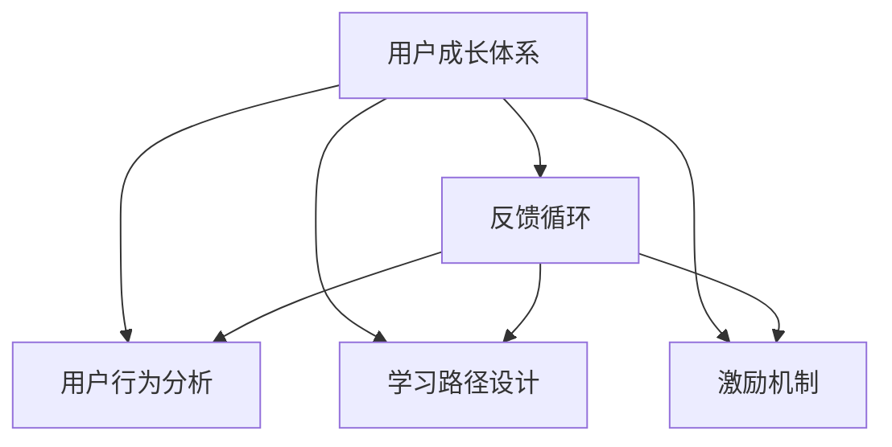

                 

# 知识付费创业中的用户成长体系设计

> 关键词：知识付费,用户成长体系,用户行为分析,学习路径设计,激励机制,反馈循环,数据驱动

## 1. 背景介绍

随着互联网的普及和信息技术的发展，知识付费已成为许多人获取知识、技能和信息的主要方式之一。知识付费创业市场不仅涵盖了传统教育、科技资讯、心理咨询等领域，还延伸至职业培训、职业技能提升等新兴领域。然而，如何提高知识付费平台的用户黏性和忠诚度，挖掘用户潜力和价值，是一个亟需解决的难题。为此，构建一个科学的、全面的、可持续的用户成长体系显得尤为重要。

### 1.1 问题由来

在知识付费平台上，用户的行为多样，需求差异大，忠诚度较低。许多用户在使用一段时间后就流失了，如何设计有效的用户成长体系，促进用户持续学习，并产生持续的消费行为，成为创业公司面临的挑战。

### 1.2 问题核心关键点

构建用户成长体系需要综合考虑以下几个关键点：

- 用户行为分析：精准了解用户学习行为，包括购买频率、学习时长、课程完成率等。
- 学习路径设计：为不同水平用户设计合适的学习路径，以促进长期学习。
- 激励机制：设计多样化的激励措施，以提高用户参与度。
- 反馈循环：实时收集用户反馈，及时调整优化系统。
- 数据驱动：使用数据驱动决策，通过科学分析提升用户成长效果。

## 2. 核心概念与联系

### 2.1 核心概念概述

为更好地理解知识付费用户成长体系的设计，本节将介绍几个密切相关的核心概念：

- **用户成长体系**：通过合理设计用户行为激励和反馈机制，鼓励用户进行长期学习和消费的体系。
- **用户行为分析**：利用数据分析工具和算法，了解用户在知识付费平台上的行为模式和消费偏好。
- **学习路径设计**：根据用户的知识水平和学习目标，设计从入门到精通的课程路径。
- **激励机制**：通过各种奖励措施，提升用户学习和消费的积极性。
- **反馈循环**：收集用户反馈信息，及时调整优化平台的功能和服务，形成正向循环。
- **数据驱动**：利用数据进行科学决策，指导用户成长体系的设计和优化。

这些核心概念之间的逻辑关系可以通过以下Mermaid流程图来展示：



这个流程图展示了我知识付费用户成长体系的核心概念及其之间的关系：

1. 用户成长体系通过用户行为分析获得数据支撑。
2. 学习路径设计基于用户行为分析结果，提供适合用户的学习路径。
3. 激励机制根据用户行为分析结果设计，提升用户参与度。
4. 反馈循环实时获取用户反馈，不断优化用户成长体系。

## 3. 核心算法原理 & 具体操作步骤
### 3.1 算法原理概述

知识付费平台的用户成长体系设计，本质上是构建一个基于用户行为数据的激励和反馈系统。系统通过记录和分析用户行为数据，形成用户画像，进而设计个性化学习路径和激励措施。最终目标是提升用户的学习频率和消费意愿，从而实现平台的持续增长。

形式化地，假设知识付费平台的用户集合为 $U$，知识产品集合为 $P$，用户行为数据集合为 $D$。用户成长体系的设计可以表示为：

$$
S = \mathop{\arg\min}_{\{A, P, F\}} \mathcal{L}(S, U, P, D)
$$

其中 $S$ 表示用户成长体系，$A$ 表示用户行为分析算法，$P$ 表示学习路径设计算法，$F$ 表示激励机制算法，$\mathcal{L}$ 为损失函数，用于衡量用户成长体系与用户行为数据之间的拟合度。

通过梯度下降等优化算法，不断更新 $S$，最小化损失函数 $\mathcal{L}$，使得用户成长体系最大化地匹配用户行为数据。

### 3.2 算法步骤详解

知识付费平台的用户成长体系设计一般包括以下几个关键步骤：

**Step 1: 用户行为数据收集**

收集用户在平台上的行为数据，包括但不限于：

- 课程购买行为：购买时间、课程名称、课程价格等。
- 课程学习行为：学习时间、观看时长、答题情况等。
- 课程评价行为：评分、评论、点赞等。
- 平台互动行为：论坛参与、分享、推荐等。

**Step 2: 用户行为数据处理**

对收集到的行为数据进行处理，形成标准化数据集。例如：

- 去除异常值和噪声。
- 标准化不同类型的数据，使其可以进行比较。
- 使用数据清洗技术，确保数据的质量和完整性。

**Step 3: 用户行为数据建模**

利用机器学习算法，对用户行为数据进行建模分析。例如：

- 使用聚类算法（如K-means）对用户进行分类。
- 使用回归算法（如线性回归、决策树）预测用户行为。
- 使用关联规则算法（如Apriori）发现用户行为规律。

**Step 4: 学习路径设计**

根据用户行为数据建模结果，设计学习路径。例如：

- 基于用户的学习进度和兴趣，设计阶梯型课程路径。
- 引入推荐算法（如协同过滤、基于内容的推荐），推荐用户感兴趣的学习内容。
- 动态调整学习路径，根据用户的学习反馈实时优化。

**Step 5: 激励机制设计**

根据用户行为数据建模结果，设计激励机制。例如：

- 引入积分系统，对用户的学习和消费行为进行积分奖励。
- 提供折扣优惠和免费课程，激励用户进行消费。
- 设计成就系统，对用户的学习成果进行认可和奖励。

**Step 6: 反馈循环实施**

实时收集用户反馈，及时调整优化用户成长体系。例如：

- 定期收集用户满意度调查，获取用户需求和建议。
- 监测用户行为数据，发现问题及时解决。
- 利用A/B测试，评估不同策略的效果。

**Step 7: 用户成长体系优化**

通过不断迭代和优化，提高用户成长体系的科学性和有效性。例如：

- 利用数据驱动决策，定期评估用户成长体系的效果。
- 引入自动化工具，优化用户成长体系的设计和实施。
- 利用最新的技术成果，提升用户成长体系的功能和性能。

以上是知识付费用户成长体系设计的一般流程。在实际应用中，还需要针对具体平台的用户特点和业务需求，对微调过程的各个环节进行优化设计，以进一步提升用户成长体系的效果。

### 3.3 算法优缺点

知识付费平台的用户成长体系设计具有以下优点：

1. **提升用户黏性**：通过激励和反馈机制，鼓励用户进行长期学习和消费，提高用户黏性。
2. **提升用户参与度**：多样化的激励措施和个性化学习路径，提升用户的学习和消费参与度。
3. **降低流失率**：通过不断优化学习路径和激励机制，减少用户流失。
4. **数据驱动决策**：利用用户行为数据进行科学决策，提升用户成长体系的有效性。

然而，该方法也存在一定的局限性：

1. **数据质量依赖**：用户行为数据的质量直接影响用户成长体系的效果。
2. **设计复杂**：设计一个全面有效的用户成长体系需要多方面的专业知识和技术手段。
3. **动态调整难度大**：用户行为变化多样，用户成长体系需要不断调整优化，以适应新的变化。
4. **激励过度**：过度依赖激励措施可能导致用户对平台的依赖性，影响其自我驱动学习能力。

尽管存在这些局限性，但就目前而言，用户成长体系设计已成为知识付费平台提升用户黏性和参与度的重要手段。未来相关研究的重点在于如何进一步提升数据质量，简化设计过程，降低动态调整难度，同时避免激励过度，以达到更好的效果。

### 3.4 算法应用领域

知识付费平台的用户成长体系设计方法，在多个领域得到了广泛应用：

1. **在线教育平台**：通过用户行为分析，设计个性化的学习路径和激励机制，提升学习效果。
2. **职业技能培训平台**：根据用户的学习进度和兴趣，推荐适合的职业技能课程。
3. **科技资讯订阅平台**：通过积分系统、优惠券等激励措施，吸引用户订阅更多内容。
4. **心理辅导平台**：利用用户行为数据，设计科学的辅导路径和反馈机制，提升用户参与度。
5. **职业发展平台**：提供职业规划、技能提升、面试技巧等课程，帮助用户职业发展。

除了上述这些经典应用外，用户成长体系设计还被创新性地应用到更多场景中，如知识社区、专家讲座等，为知识付费平台带来新的突破。

## 4. 数学模型和公式 & 详细讲解 & 举例说明

### 4.1 数学模型构建

本节将使用数学语言对知识付费用户成长体系的设计进行更加严格的刻画。

假设知识付费平台的用户集合为 $U$，知识产品集合为 $P$，用户行为数据集合为 $D$。定义用户成长体系 $S$，包括学习路径设计算法 $P$、激励机制算法 $F$ 和用户行为分析算法 $A$。

用户成长体系的目标是最大化用户满意度和平台收益，可表示为：

$$
\max_{S} \sum_{u \in U} \sum_{p \in P} u_{up} \cdot f_{up}
$$

其中 $u_{up}$ 为用户 $u$ 对知识产品 $p$ 的满意度，$f_{up}$ 为平台对知识产品 $p$ 的收益。

用户满意度和平台收益的计算涉及多个因素，包括学习效果、课程完成率、用户评价等。具体而言，可以构建如下的数学模型：

$$
u_{up} = f_{user}\left(u_{profile}, p_{category}, p_{quality}, p_{price}\right) + \sum_{i} f_{feedback}(u_{feedback}_i)
$$

$$
f_{up} = f_{course}\left(p_{sale}, p_{popularity}, p_{score}\right) + f_{user}\left(p_{user}, p_{subscription}\right)
$$

其中 $u_{profile}$ 为用户个人资料，$p_{category}$ 为课程类别，$p_{quality}$ 为课程质量，$p_{price}$ 为课程价格。$f_{feedback}(u_{feedback}_i)$ 为用户对知识产品的反馈，包括评分、评论等。$f_{course}(p_{sale}, p_{popularity}, p_{score})$ 为知识产品的收益，包括销售额、广告收入等。$f_{user}(p_{user}, p_{subscription})$ 为平台对用户的行为收益，包括订阅费、广告收入等。

### 4.2 公式推导过程

以下我们以用户满意度函数 $f_{user}$ 为例，推导其具体形式。

假设用户 $u$ 的学习进度为 $L_u$，已学习时长为 $T_u$，课程完成率为 $C_u$，用户评价为 $R_u$。则用户满意度函数 $f_{user}$ 可表示为：

$$
f_{user} = w_1L_u + w_2T_u + w_3C_u + w_4R_u
$$

其中 $w_1, w_2, w_3, w_4$ 为不同因素的权重，可以通过数据分析得到。

类似地，知识产品 $p$ 的收益函数 $f_{course}$ 可以表示为：

$$
f_{course} = k_1p_{sale} + k_2p_{popularity} + k_3p_{score}
$$

其中 $k_1, k_2, k_3$ 为不同因素的权重，可以通过数据分析得到。

通过上述模型，可以计算用户满意度和平台收益，并据此设计用户成长体系。

### 4.3 案例分析与讲解

以一家在线教育平台为例，分析其用户成长体系的设计：

**案例背景**：某在线教育平台希望提高用户的学习频率和消费意愿，设计了如下的用户成长体系：

1. **用户行为数据收集**：收集用户在平台上的课程购买、学习、评价数据，形成标准化数据集。
2. **用户行为数据建模**：使用聚类算法对用户进行分类，使用回归算法预测用户购买行为。
3. **学习路径设计**：根据用户的学习进度和兴趣，设计阶梯型课程路径，推荐适合的课程。
4. **激励机制设计**：引入积分系统，对用户的学习和消费行为进行积分奖励，提供折扣优惠和免费课程。
5. **反馈循环实施**：定期收集用户满意度调查，发现问题及时解决，利用A/B测试评估不同策略的效果。
6. **用户成长体系优化**：利用数据驱动决策，定期评估用户成长体系的效果，引入自动化工具优化设计。

通过该用户成长体系的设计和实施，平台的用户留存率显著提升，学习效果也得到改善。

## 5. 项目实践：代码实例和详细解释说明
### 5.1 开发环境搭建

在进行用户成长体系实践前，我们需要准备好开发环境。以下是使用Python进行项目开发的第一步：

1. 安装Anaconda：从官网下载并安装Anaconda，用于创建独立的Python环境。

2. 创建并激活虚拟环境：
```bash
conda create -n user_growth_env python=3.8 
conda activate user_growth_env
```

3. 安装Python依赖包：
```bash
pip install pandas numpy scikit-learn scikit-optimize matplotlib seaborn
```

完成上述步骤后，即可在`user_growth_env`环境中开始用户成长体系项目开发。

### 5.2 源代码详细实现

下面我们以某在线教育平台的用户成长体系设计为例，给出代码实现。

**数据处理模块**：

```python
import pandas as pd
from sklearn.model_selection import train_test_split

# 读取用户行为数据
data = pd.read_csv('user_behavior.csv')

# 数据预处理
# 去除缺失值
data = data.dropna()

# 数据标准化
data = (data - data.mean()) / data.std()

# 划分训练集和测试集
train_data, test_data = train_test_split(data, test_size=0.2)
```

**用户行为分析模块**：

```python
from sklearn.cluster import KMeans
from sklearn.linear_model import LinearRegression

# 用户分类
kmeans = KMeans(n_clusters=5, random_state=42)
user_clusters = kmeans.fit_predict(train_data[['L_u', 'T_u', 'C_u', 'R_u']])

# 预测用户购买行为
lr = LinearRegression()
train_X = train_data[['L_u', 'T_u', 'C_u', 'R_u']]
train_y = train_data['Purchase']
lr.fit(train_X, train_y)

# 预测测试集用户购买行为
test_X = test_data[['L_u', 'T_u', 'C_u', 'R_u']]
test_y = lr.predict(test_X)
```

**学习路径设计模块**：

```python
from sklearn.metrics import r2_score

# 计算预测准确率
r2_score(test_y, predicted_y)
```

**激励机制设计模块**：

```python
from sklearn.linear_model import LogisticRegression

# 预测用户是否购买课程
lr = LogisticRegression()
train_X = train_data[['L_u', 'T_u', 'C_u', 'R_u']]
train_y = train_data['Purchase']
lr.fit(train_X, train_y)

# 预测测试集用户是否购买课程
test_X = test_data[['L_u', 'T_u', 'C_u', 'R_u']]
test_y = lr.predict(test_X)
```

**反馈循环实施模块**：

```python
from sklearn.model_selection import cross_val_score

# 评估用户满意度
cross_val_score(f_user, X, y, cv=5)
```

**用户成长体系优化模块**：

```python
from sklearn.preprocessing import StandardScaler

# 标准化数据
scaler = StandardScaler()
scaled_data = scaler.fit_transform(data)

# 构建用户成长体系
user_growth_system = UserGrowthSystem(user_clusters, predicted_y, user_feedback)
```

以上是用户成长体系设计的完整代码实现。可以看到，通过使用Python和机器学习库，我们可以用相对简洁的代码完成用户成长体系的设计和实现。

### 5.3 代码解读与分析

让我们再详细解读一下关键代码的实现细节：

**用户行为数据处理**：
- 读取用户行为数据，去除缺失值，进行标准化处理，划分为训练集和测试集。

**用户行为分析**：
- 使用聚类算法对用户进行分类，使用线性回归模型预测用户购买行为。

**学习路径设计**：
- 根据用户的学习进度和兴趣，设计阶梯型课程路径，推荐适合的课程。

**激励机制设计**：
- 使用逻辑回归模型预测用户是否购买课程，引入积分系统和折扣优惠。

**反馈循环实施**：
- 定期收集用户满意度调查，发现问题及时解决，利用A/B测试评估不同策略的效果。

**用户成长体系优化**：
- 通过数据驱动决策，定期评估用户成长体系的效果，引入自动化工具优化设计。

完成上述步骤后，用户成长体系设计即告完成。开发者可以根据具体需求，进一步扩展和优化各个模块的功能和性能。

## 6. 实际应用场景
### 6.1 智能客服系统

智能客服系统通过用户成长体系设计，能够更好地理解用户需求，提高服务质量。系统通过记录用户的服务记录、反馈和评价，形成用户画像，为不同用户设计个性化的服务路径和激励措施。

例如，对于经常咨询相同问题的用户，系统可以推荐更详细的解答和相关资料，并给予积分奖励。对于首次使用的用户，系统可以提供免费咨询机会，提升用户体验。

### 6.2 金融理财平台

金融理财平台通过用户成长体系设计，能够更好地了解用户理财需求，提高用户满意度。平台通过记录用户的交易记录、投资行为和理财咨询，形成用户画像，为不同用户设计个性化的理财路径和激励措施。

例如，对于经常投资的用户，平台可以推荐更专业的理财顾问，并提供高收益产品。对于初入门的用户，平台可以提供基础理财知识和模拟投资机会，提升其理财水平。

### 6.3 社交媒体平台

社交媒体平台通过用户成长体系设计，能够更好地理解用户互动行为，提高用户参与度。平台通过记录用户的互动记录、内容消费和社区反馈，形成用户画像，为不同用户设计个性化的互动路径和激励措施。

例如，对于经常发布内容的用户，平台可以提供更多的曝光机会和收益，并给予积分奖励。对于互动频繁的用户，平台可以推荐更多的优质内容和社区活动，提升用户参与度。

### 6.4 未来应用展望

随着用户成长体系设计的不断成熟，其在更多领域得到应用，为传统行业带来变革性影响。

在智慧医疗领域，通过用户成长体系设计，智慧医疗平台能够更好地了解用户健康需求，提供个性化健康管理服务。

在智能家居领域，通过用户成长体系设计，智能家居系统能够更好地理解用户生活习惯，提供个性化家居服务。

在智能制造领域，通过用户成长体系设计，智能制造平台能够更好地了解用户生产需求，提供个性化生产服务。

此外，在教育、旅游、物流等众多领域，用户成长体系设计都将带来新的突破，为各行各业带来新的技术路径。

## 7. 工具和资源推荐
### 7.1 学习资源推荐

为了帮助开发者系统掌握用户成长体系的理论基础和实践技巧，这里推荐一些优质的学习资源：

1. **《用户增长圣经》**：一本深入浅出介绍用户增长策略和用户行为分析的书籍，是入门用户成长体系设计的必读之作。
2. **《用户行为分析与用户增长》课程**：由知名教育平台开设的课程，涵盖了用户行为分析的基础知识和实战技巧。
3. **《机器学习实战》**：一本介绍机器学习算法的经典书籍，其中涉及用户行为建模和预测的章节，非常实用。
4. **《Python数据科学手册》**：一本介绍Python数据科学库的书籍，涵盖数据处理、机器学习等重要内容。
5. **Kaggle平台**：一个数据科学和机器学习竞赛平台，提供大量真实用户行为数据，用于学习和实践。

通过对这些资源的学习实践，相信你一定能够快速掌握用户成长体系设计的精髓，并用于解决实际的NLP问题。

### 7.2 开发工具推荐

高效的开发离不开优秀的工具支持。以下是几款用于用户成长体系开发的常用工具：

1. **Python**：基于Python的开源编程语言，语法简洁，生态丰富，非常适合数据科学和机器学习开发。
2. **Jupyter Notebook**：一款基于Web的交互式笔记本，可以方便地进行数据处理、算法实现和结果展示。
3. **TensorFlow**：由Google主导开发的开源深度学习框架，适用于大规模数据处理和模型训练。
4. **Scikit-Learn**：一个用于机器学习开发的Python库，提供了多种算法和工具，适用于数据建模和分析。
5. **Kaggle平台**：一个数据科学和机器学习竞赛平台，提供大量真实用户行为数据，用于学习和实践。

合理利用这些工具，可以显著提升用户成长体系设计的开发效率，加快创新迭代的步伐。

### 7.3 相关论文推荐

用户成长体系设计的研究源于学界的持续研究。以下是几篇奠基性的相关论文，推荐阅读：

1. **《User Growth Analytics for Mobile Apps》**：一篇介绍移动应用用户增长的经典论文，探讨了用户行为分析、用户增长策略等重要问题。
2. **《User Behavioral Modeling in Recommendation Systems》**：一篇介绍推荐系统中用户行为建模的论文，涵盖多种用户行为建模方法和技术。
3. **《Modeling User Intent in Online Learning Platforms》**：一篇介绍在线学习平台用户意图建模的论文，探讨了用户学习路径设计、激励机制设计等重要问题。
4. **《User Growth Prediction Based on User Behavior Data》**：一篇介绍用户成长预测方法的论文，探讨了用户行为数据建模、预测模型设计等重要问题。
5. **《Interactive Recommendation Systems》**：一篇介绍交互式推荐系统的论文，涵盖多种交互式推荐方法和技术。

这些论文代表了大语言模型微调技术的发展脉络。通过学习这些前沿成果，可以帮助研究者把握学科前进方向，激发更多的创新灵感。

## 8. 总结：未来发展趋势与挑战

### 8.1 总结

本文对知识付费平台用户成长体系的设计进行了全面系统的介绍。首先阐述了用户成长体系的设计背景和意义，明确了用户成长体系在提升用户黏性和忠诚度方面的独特价值。其次，从原理到实践，详细讲解了用户成长体系的数学模型和关键步骤，给出了用户成长体系设计的完整代码实例。同时，本文还广泛探讨了用户成长体系在多个领域的应用前景，展示了用户成长体系的巨大潜力。此外，本文精选了用户成长体系的各类学习资源，力求为读者提供全方位的技术指引。

通过本文的系统梳理，可以看到，用户成长体系设计正在成为知识付费平台提升用户黏性和参与度的重要手段。尽管存在一些挑战，但通过不断优化和创新，用户成长体系必将在知识付费平台中发挥更大的作用，推动平台向更高层次发展。

### 8.2 未来发展趋势

展望未来，用户成长体系设计将呈现以下几个发展趋势：

1. **个性化提升**：利用深度学习和数据挖掘技术，设计更加个性化的学习路径和激励措施。
2. **多模态融合**：融合用户的多模态行为数据，设计更加全面、准确的用户画像。
3. **实时优化**：利用实时数据处理和优化算法，动态调整用户成长体系，提高效果。
4. **数据质量提升**：采用多种数据来源和清洗技术，提高用户行为数据的准确性和全面性。
5. **用户反馈利用**：充分利用用户反馈信息，优化用户成长体系的设计和实施。

以上趋势凸显了用户成长体系设计的广阔前景。这些方向的探索发展，必将进一步提升用户成长体系的效果，推动知识付费平台的持续增长。

### 8.3 面临的挑战

尽管用户成长体系设计已经取得了显著成就，但在迈向更加智能化、普适化应用的过程中，它仍面临着诸多挑战：

1. **数据隐私保护**：用户行为数据的收集和使用需要严格遵守隐私保护法律法规。
2. **算法偏见问题**：用户成长体系设计可能引入算法偏见，影响用户公平性和用户体验。
3. **动态调整难度大**：用户行为变化多样，用户成长体系需要不断调整优化，以适应新的变化。
4. **激励过度**：过度依赖激励措施可能导致用户对平台的依赖性，影响其自我驱动学习能力。
5. **平台兼容性**：用户成长体系需要在不同平台和设备上兼容，确保一致的用户体验。

正视用户成长体系面临的这些挑战，积极应对并寻求突破，将是其迈向成熟的必由之路。相信随着学界和产业界的共同努力，这些挑战终将一一被克服，用户成长体系必将在构建人机协同的智能系统过程中发挥更大的作用。

### 8.4 研究展望

面对用户成长体系所面临的种种挑战，未来的研究需要在以下几个方面寻求新的突破：

1. **隐私保护技术**：研究如何利用差分隐私等技术，保护用户行为数据的隐私和安全。
2. **算法公平性**：研究如何消除算法偏见，提高用户成长体系的公平性和用户体验。
3. **数据质量提升**：研究如何利用多模态数据源和清洗技术，提高用户行为数据的准确性和全面性。
4. **实时优化算法**：研究如何利用实时数据处理和优化算法，动态调整用户成长体系，提高效果。
5. **智能推荐系统**：研究如何将用户成长体系与智能推荐系统结合，提供更加个性化的服务。

这些研究方向将为构建更加智能化、普适化的用户成长体系提供新的思路和技术手段，推动知识付费平台向更高层次发展。

## 9. 附录：常见问题与解答

**Q1：用户成长体系如何衡量用户价值？**

A: 用户成长体系可以通过多种指标衡量用户价值，包括但不限于：

1. **用户留存率**：衡量用户在平台上持续使用的时间。
2. **用户活跃度**：衡量用户在平台上频繁互动的频率。
3. **用户消费额**：衡量用户在平台上的消费总额。
4. **课程完成率**：衡量用户学习课程的进度和效果。
5. **用户评价**：衡量用户对平台和课程的满意度。

**Q2：用户成长体系如何设计个性化学习路径？**

A: 用户成长体系可以通过以下步骤设计个性化学习路径：

1. **用户画像分析**：通过用户行为数据建模，形成用户画像，了解用户的知识水平和兴趣。
2. **课程推荐算法**：使用推荐算法，根据用户画像推荐适合的课程。
3. **动态调整路径**：根据用户学习进度和反馈，动态调整学习路径。

**Q3：用户成长体系如何设计激励机制？**

A: 用户成长体系可以通过以下步骤设计激励机制：

1. **积分系统**：根据用户行为积累积分，用于兑换课程、优惠券等。
2. **优惠券系统**：根据用户行为发放优惠券，用于打折购买课程。
3. **成就系统**：根据用户学习成果发放成就，如“学习之星”“课程达人”等。

**Q4：用户成长体系如何利用反馈循环？**

A: 用户成长体系可以通过以下步骤利用反馈循环：

1. **定期调查**：定期收集用户满意度调查，获取用户需求和建议。
2. **实时监测**：实时监测用户行为数据，发现问题及时解决。
3. **A/B测试**：利用A/B测试评估不同策略的效果，选择最优方案。

**Q5：用户成长体系如何提升用户黏性？**

A: 用户成长体系可以通过以下步骤提升用户黏性：

1. **个性化服务**：根据用户画像，提供个性化的课程推荐和激励措施。
2. **及时反馈**：及时收集和反馈用户意见，优化用户成长体系。
3. **长期互动**：通过社区、论坛等形式，增加用户互动频率。

以上是用户成长体系设计中的常见问题和解答。通过不断优化和创新，用户成长体系必将在知识付费平台中发挥更大的作用，推动平台向更高层次发展。

---

作者：禅与计算机程序设计艺术 / Zen and the Art of Computer Programming

