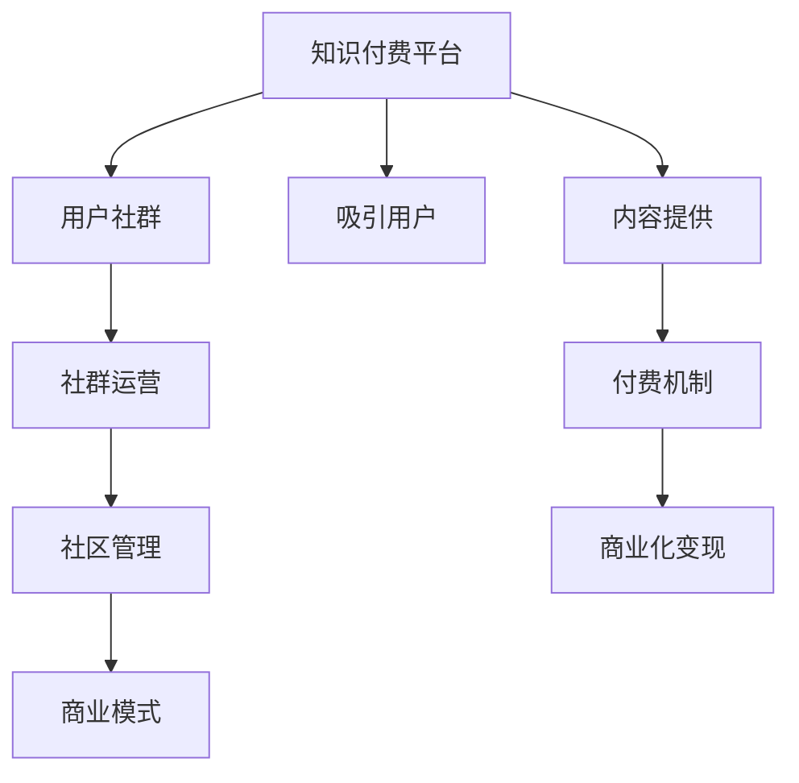

                 

# 知识付费创业中的用户社群运营

> 关键词：知识付费,用户社群,运营策略,社区管理,商业模式

## 1. 背景介绍

### 1.1 问题由来

随着互联网的普及和数字化转型浪潮的兴起，知识付费领域迎来了快速发展的契机。各类知识付费平台如雨后春笋般涌现，为人们提供专业、实用、前沿的知识信息。用户对于高质内容的渴求愈发强烈，知识付费市场呈现蓬勃发展的态势。然而，尽管市场潜力巨大，但许多知识付费平台在运营和发展上遇到了瓶颈：

- 用户留存率低，导致用户流失。
- 社群活跃度低，缺乏互动和价值生成。
- 内容同质化严重，难以形成差异化竞争优势。
- 商业化压力大，难以实现盈利平衡。

针对这些问题，如何高效运营用户社群，提升用户粘性，实现商业化变现，成为知识付费平台亟需解决的关键问题。本文将从用户社群运营的视角出发，探讨知识付费平台在用户社群构建、社群管理、商业模式等方面应采取的策略和方法。

### 1.2 问题核心关键点

在知识付费创业中，用户社群运营的核心关键点包括：

- **用户社群构建**：如何吸引和聚集目标用户群体，打造高质量的用户社群。
- **社群管理**：如何高效管理和维护社群，提升用户粘性和互动性。
- **商业模式**：如何构建可持续发展的商业模式，实现知识付费平台的盈利。

围绕这三个关键点，本文将展开详细探讨，为知识付费平台的运营提供有价值的指导和参考。

## 2. 核心概念与联系

### 2.1 核心概念概述

为了更好地理解知识付费创业中的用户社群运营，我们先介绍几个核心概念：

- **知识付费平台**：基于互联网，为用户提供付费内容服务的平台，包括各类线上课程、电子书、咨询答疑等。
- **用户社群**：由具有共同兴趣、需求或目标的用户群体组成的在线社区，通过定期交流、互动和协作，满足用户的多样化需求。
- **社群运营**：指通过制定策略、规划活动、优化管理等方式，提高用户社群的活跃度、粘性和转化率，实现商业价值的过程。
- **社区管理**：涉及用户社群的日常维护和治理，包括规则制定、内容审核、用户互动等，确保社群健康有序运行。
- **商业模式**：指知识付费平台通过提供有价值的服务或产品，实现收入来源和盈利模式的设计和实现。

这些核心概念之间的关系可通过以下Mermaid流程图来展示：



这个流程图展示了知识付费平台与用户社群的构建、管理与商业化变现之间的关系：

1. **吸引用户**：知识付费平台通过各种渠道吸引潜在用户。
2. **内容提供**：平台提供专业、实用的知识内容，满足用户需求。
3. **付费机制**：用户通过付费获取内容。
4. **商业化变现**：平台通过各种商业化策略实现盈利。
5. **社群运营**：平台通过运营策略提升用户互动和社群价值。
6. **社区管理**：平台通过规则制定和互动管理维护社群健康。

通过理解这些核心概念及其相互关系，我们可以更好地把握知识付费平台用户社群运营的本质，制定有效的运营策略。

## 3. 核心算法原理 & 具体操作步骤
### 3.1 算法原理概述

知识付费平台的用户社群运营，本质上是通过系统化的策略和科学的方法，构建一个高效、互动、价值丰富的社群。其核心算法原理主要涉及以下三个方面：

- **吸引用户策略**：利用数据挖掘、推荐系统等技术，精准定位目标用户，通过个性化推荐和内容营销，吸引用户加入社群。
- **社群运营策略**：通过内容推送、互动活动、激励机制等手段，提升社群的活跃度和粘性。
- **商业化策略**：通过广告、会员、付费课程等多种途径，实现知识付费平台的商业化变现。

### 3.2 算法步骤详解

#### 3.2.1 吸引用户策略

**Step 1: 目标用户定位**

首先，通过市场调研和数据分析，明确知识付费平台的目标用户群体。考虑用户的年龄、职业、兴趣等因素，设计出符合用户需求的社群特征。

**Step 2: 内容精准推送**

基于用户画像和历史行为数据，使用推荐系统算法，向目标用户推送个性化内容。可以采用协同过滤、基于内容的推荐、深度学习等技术，提高推荐精准度。

**Step 3: 多渠道营销**

利用社交媒体、搜索引擎优化、邮件营销等多种渠道，进行用户引流和社群推广。例如，通过微信公众号、微博、知乎等平台发布有价值的内容，吸引用户加入社群。

#### 3.2.2 社群运营策略

**Step 1: 内容多样化**

提供多样化内容，如讲座、文章、视频、音频等，满足用户多样化的学习需求。同时，引入专家讲座、用户分享、互动问答等形式，增加社群互动性。

**Step 2: 互动激励机制**

设计合理的激励机制，如积分系统、等级制度、任务挑战等，鼓励用户积极参与社群活动。例如，举办内容分享比赛，对优秀内容给予积分奖励，促进社群活跃。

**Step 3: 定期活动策划**

定期策划线上线下活动，如直播讲座、线下聚会、主题讨论等，增强用户粘性。可以邀请行业专家参与，提升社群影响力。

#### 3.2.3 商业化策略

**Step 1: 广告变现**

通过在社群页面植入广告、推行精准广告投放等方式，实现广告收入。例如，在文章开头、评论区、直播室等位置插入广告，吸引用户点击。

**Step 2: 会员制度**

推出会员制服务，为会员提供专享内容、增值服务、优先参与活动等权益。会员制的收入模式，有助于平台稳定盈利。

**Step 3: 付费课程**

开发高质量付费课程，吸引用户通过付费获取知识。可以采用订阅模式、单次购买、课程包等形式，满足不同用户的需求。

### 3.3 算法优缺点

#### 优点

- **精准定位用户**：利用推荐系统和数据分析，可以精准定位目标用户，提高社群吸引力和转化率。
- **提升用户互动**：通过多样化的内容、激励机制和定期活动，增强社群互动性和用户粘性。
- **多渠道盈利**：广告变现、会员制度、付费课程等多种盈利方式，有助于平台实现商业化变现。

#### 缺点

- **内容同质化风险**：过度依赖个性化推荐，可能导致内容同质化，难以形成差异化竞争优势。
- **用户流失问题**：社群运营不当可能导致用户流失，影响平台整体效益。
- **商业化压力**：过度商业化可能削弱社群的互动性和价值，降低用户满意度。

### 3.4 算法应用领域

知识付费平台的用户社群运营策略，不仅适用于传统教育培训行业，还广泛应用于在线教育、文化娱乐、健康保健、职业培训等多个领域。这些领域的知识付费平台，可以通过用户社群运营，提升用户粘性和忠诚度，实现商业化变现。

## 4. 数学模型和公式 & 详细讲解 & 举例说明

### 4.1 数学模型构建

在知识付费平台的用户社群运营中，涉及的数学模型主要包括以下几个方面：

- **用户特征模型**：通过用户画像、行为数据等，构建用户特征向量。
- **推荐模型**：利用协同过滤、矩阵分解等技术，构建推荐系统。
- **社群互动模型**：通过社交网络分析等方法，构建社群互动网络。
- **广告效果模型**：通过回归分析、时间序列分析等技术，评估广告效果。

### 4.2 公式推导过程

#### 用户特征模型

设用户特征向量为 $\boldsymbol{x}_i = [x_{i1}, x_{i2}, \cdots, x_{in}]$，其中 $x_{ik}$ 表示用户 $i$ 在特征 $k$ 上的取值。假设共有 $m$ 个特征，则用户特征矩阵为 $X = [\boldsymbol{x}_1, \boldsymbol{x}_2, \cdots, \boldsymbol{x}_m]$。

用户特征模型的目标是为每个用户分配一个特定的权重向量 $\boldsymbol{w}_i = [w_{i1}, w_{i2}, \cdots, w_{in}]$，使得用户对内容的兴趣度 $y_i$ 可以表示为：

$$
y_i = \boldsymbol{w}_i \cdot \boldsymbol{x}_i
$$

#### 推荐模型

协同过滤算法中，用户 $i$ 对物品 $j$ 的兴趣度 $r_{ij}$ 可以表示为：

$$
r_{ij} = \frac{1}{1+\exp(-\boldsymbol{u}_i \cdot \boldsymbol{v}_j)}
$$

其中，$\boldsymbol{u}_i$ 和 $\boldsymbol{v}_j$ 分别表示用户和物品的隐向量，$\cdot$ 表示向量的点积。

#### 社群互动模型

假设社群中每个用户 $u$ 与 $v$ 的互动强度可以用 $A_{uv}$ 表示，可以建立社群互动矩阵 $A$。设 $u$ 在 $v$ 中的影响因子为 $g_v$，则用户 $u$ 的影响度 $g_u$ 可以表示为：

$$
g_u = \sum_{v} A_{uv} g_v
$$

#### 广告效果模型

假设广告点击率 $c_t$ 可以表示为用户特征 $x_t$ 和广告特征 $a_t$ 的线性组合 $z_t = \alpha_x x_t + \beta_a a_t$。设广告点击率模型为 $f(x_t, a_t)$，则可以建立广告效果模型：

$$
c_t = f(x_t, a_t)
$$

其中 $\alpha_x$ 和 $\beta_a$ 表示特征权重，$f(x_t, a_t)$ 为预测函数。

### 4.3 案例分析与讲解

**案例1: 在线教育平台**

某在线教育平台通过用户画像和行为数据，构建用户特征模型。在推荐系统中，利用协同过滤算法，为用户推荐相关课程。平台通过分析社群互动网络，设计合理的激励机制，增强社群互动性。平台通过广告变现、会员制度、付费课程等多种方式实现商业化变现。

**案例2: 文化娱乐平台**

某文化娱乐平台通过社交媒体引流，吸引用户加入社群。平台通过定期举办线上线下活动，提升社群活跃度。平台推出高价值内容，吸引用户付费，同时通过广告收入和会员制服务实现盈利。

## 5. 项目实践：代码实例和详细解释说明
### 5.1 开发环境搭建

在进行知识付费平台的用户社群运营实践时，我们需要准备好开发环境。以下是使用Python进行开发的环境配置流程：

1. 安装Anaconda：从官网下载并安装Anaconda，用于创建独立的Python环境。

2. 创建并激活虚拟环境：
```bash
conda create -n knowledge-env python=3.8 
conda activate knowledge-env
```

3. 安装相关库：
```bash
pip install numpy pandas sklearn scikit-learn statsmodels
```

4. 安装可视化工具：
```bash
pip install matplotlib seaborn plotly
```

完成上述步骤后，即可在`knowledge-env`环境中开始实践。

### 5.2 源代码详细实现

下面我们以一个简单的在线教育平台为例，给出用户社群运营的代码实现。

```python
import pandas as pd
import numpy as np
from sklearn.feature_extraction.text import TfidfVectorizer
from sklearn.metrics.pairwise import cosine_similarity

# 数据准备
df = pd.read_csv('user_data.csv')

# 特征工程
tfidf = TfidfVectorizer(stop_words='english')
X = tfidf.fit_transform(df['user_description'])
y = df['topic'].map({1: 0, 2: 1, 3: 2})  # 将topic转化为二值向量

# 推荐系统
similarity_matrix = cosine_similarity(X)
recommendations = np.argsort(similarity_matrix, axis=1)[::-1]

# 激励机制
user_scores = np.zeros(len(df))
user_scores[:10] = 1  # 将前10个用户的分数初始化为1
```

### 5.3 代码解读与分析

让我们再详细解读一下关键代码的实现细节：

**特征工程**

首先，使用TF-IDF向量化用户描述文本，得到一个稀疏的特征矩阵。TF-IDF是一种常见的文本特征提取方法，可以统计文本中词语的重要性，用于构建用户特征向量。

**推荐系统**

通过计算用户特征矩阵的余弦相似度，得到一个推荐矩阵。余弦相似度用于衡量用户之间的相似度，可以用于推荐系统的构建。

**激励机制**

为前10个用户赋予初始分数，表示他们的基础活跃度。激励机制可以通过积分、等级等方式，进一步提升用户互动性。

### 5.4 运行结果展示

运行上述代码，输出推荐结果和用户活跃度分数：

```python
print(recommendations)
print(user_scores)
```

## 6. 实际应用场景
### 6.1 智能客服系统

知识付费平台的用户社群运营策略，可以应用于智能客服系统构建。智能客服系统通过用户社群的互动和反馈，可以实时调整和优化服务质量，提升用户体验。

在技术实现上，可以收集用户社群的常见问题，建立问题库。智能客服系统通过分析用户问题，提供精准的回答，并不断更新问题库，提升回答的准确性。同时，系统可以定期与用户互动，收集反馈，优化服务策略。

### 6.2 文化娱乐平台

知识付费平台的用户社群运营策略，可以应用于文化娱乐平台的构建。文化娱乐平台通过社群互动，提升用户粘性和平台活跃度，增加用户参与感和归属感。

在技术实现上，可以设计线上线下活动，如直播讲座、用户分享会、主题讨论等。通过这些活动，平台可以与用户建立更紧密的联系，增强用户互动性。平台还可以引入VIP会员制，提供专享内容和服务，吸引更多高价值用户。

### 6.3 教育培训平台

知识付费平台的用户社群运营策略，可以应用于教育培训平台的构建。教育培训平台通过社群互动，提升用户学习效果，促进知识传播和共享。

在技术实现上，平台可以设计在线讨论区、作业提交、在线考试等功能，促进用户之间的互动和协作。平台还可以通过定期举办线上线下活动，如专业讲座、学习小组等，提升用户的学习兴趣和参与感。平台可以推出会员制服务，为会员提供专享课程和增值服务。

## 7. 工具和资源推荐
### 7.1 学习资源推荐

为了帮助开发者系统掌握知识付费平台的用户社群运营理论基础和实践技巧，这里推荐一些优质的学习资源：

1. **《知识付费创业指南》**：全面介绍了知识付费平台的用户社群运营策略和方法，适合创业者和产品经理参考。
2. **《用户增长方法论》**：讲解了用户增长和社群运营的全面策略，适合互联网产品运营人员阅读。
3. **《社交媒体营销》**：介绍了社交媒体在用户社群运营中的应用，适合市场营销人员学习。
4. **《社群运营实战案例》**：提供了实际案例分析，适合运营人员进行参考和实践。

通过对这些资源的学习实践，相信你一定能够快速掌握知识付费平台用户社群运营的精髓，并用于解决实际的运营问题。

### 7.2 开发工具推荐

高效的开发离不开优秀的工具支持。以下是几款用于知识付费平台用户社群运营开发的常用工具：

1. **Jupyter Notebook**：提供交互式编程环境，方便调试和分析。
2. **Pandas**：数据处理和分析工具，适合数据清洗和特征工程。
3. **Scikit-learn**：机器学习库，适合构建推荐系统等。
4. **Matplotlib**：数据可视化工具，适合图表展示。
5. **Plotly**：交互式数据可视化工具，适合复杂图表展示。
6. **Grafana**：开源监控系统，适合实时监控和报警。

合理利用这些工具，可以显著提升知识付费平台用户社群运营的开发效率，加快创新迭代的步伐。

### 7.3 相关论文推荐

知识付费平台的用户社群运营策略，涉及多学科知识的融合。以下是几篇奠基性的相关论文，推荐阅读：

1. **《社交媒体用户行为分析与预测》**：研究社交媒体用户行为特征，预测用户活跃度和流失概率。
2. **《推荐系统设计与实现》**：介绍了推荐系统的理论基础和实现方法，适合推荐系统开发者参考。
3. **《用户社群管理策略》**：分析用户社群的管理策略，适合运营人员学习。
4. **《在线教育平台用户留存策略》**：介绍在线教育平台用户留存和流失分析，适合教育平台开发者阅读。

这些论文代表了大规模知识付费平台用户社群运营的发展脉络。通过学习这些前沿成果，可以帮助研究者把握学科前进方向，激发更多的创新灵感。

## 8. 总结：未来发展趋势与挑战
### 8.1 总结

本文对知识付费平台用户社群运营的策略和方法进行了全面系统的介绍。首先阐述了知识付费创业中用户社群运营的背景和意义，明确了社群运营在用户吸引、互动和商业变现方面的核心关键点。其次，从吸引用户、社群运营和商业化变现三个方面，详细讲解了用户社群运营的具体策略和操作步骤。最后，本文还探讨了知识付费平台用户社群运营在智能客服、文化娱乐、教育培训等多个领域的应用前景，展示了用户社群运营的巨大潜力。

通过本文的系统梳理，可以看到，知识付费平台用户社群运营策略在提升用户粘性、实现商业化变现方面具有重要价值。未来，伴随技术的不断进步和市场的不断变化，知识付费平台用户社群运营将迎来更多机遇和挑战，需要运营者持续创新和优化。

### 8.2 未来发展趋势

展望未来，知识付费平台用户社群运营将呈现以下几个发展趋势：

1. **AI技术的应用**：随着AI技术的发展，知识付费平台可以通过智能推荐、聊天机器人等技术，提升用户互动体验和社群价值。
2. **多平台协同**：知识付费平台可以整合多平台资源，形成跨平台的用户互动和内容传播，提升平台影响力。
3. **个性化推荐**：通过深度学习和大数据技术，实现更加精准的内容推荐，满足用户多样化需求。
4. **用户体验优化**：通过用户行为分析和互动优化，提升平台的用户体验和粘性。
5. **社交电商模式**：知识付费平台可以引入社交电商模式，通过内容变现和社群互动，实现商业化变现。

这些趋势将推动知识付费平台用户社群运营的不断进步，为平台带来更多的用户和收入。

### 8.3 面临的挑战

尽管知识付费平台用户社群运营策略已经取得了一定的成效，但在迈向更加智能化、普适化应用的过程中，仍面临诸多挑战：

1. **用户需求多样化**：用户需求日益多样化，平台需不断创新内容和服务，才能满足用户需求。
2. **内容同质化风险**：过度依赖个性化推荐，可能导致内容同质化，难以形成差异化竞争优势。
3. **商业化压力**：过度商业化可能削弱社群的互动性和价值，降低用户满意度。
4. **用户流失问题**：社群运营不当可能导致用户流失，影响平台整体效益。
5. **技术挑战**：大规模用户互动和数据处理需要强大的技术支撑，平台需不断提升技术能力。

面对这些挑战，知识付费平台需要不断创新和优化运营策略，提升用户互动和社群价值，才能实现长期稳定发展。

### 8.4 研究展望

面对知识付费平台用户社群运营所面临的种种挑战，未来的研究需要在以下几个方面寻求新的突破：

1. **多样化内容开发**：开发多样化、高质量的内容，满足用户多样化需求。
2. **个性化推荐技术**：提升个性化推荐算法，实现更精准的内容推荐。
3. **用户行为分析**：深入分析用户行为和需求，优化社群运营策略。
4. **跨平台协同**：实现多平台资源整合，提升平台影响力。
5. **社区治理**：制定合理的社区治理机制，维护社群健康有序运行。

这些研究方向将为知识付费平台用户社群运营提供新的思路和方法，推动平台不断创新和优化。

## 9. 附录：常见问题与解答

**Q1: 如何构建高效的用户社群？**

A: 构建高效的用户社群，需要考虑以下因素：

1. **明确目标用户**：通过市场调研和数据分析，明确目标用户群体，设计出符合用户需求的社群特征。
2. **多样化内容提供**：提供多样化内容，如讲座、文章、视频、音频等，满足用户多样化的学习需求。
3. **互动激励机制**：设计合理的激励机制，如积分系统、等级制度、任务挑战等，鼓励用户积极参与社群活动。
4. **定期活动策划**：定期策划线上线下活动，如直播讲座、线下聚会、主题讨论等，增强用户粘性。

**Q2: 如何提升社群的活跃度？**

A: 提升社群活跃度，可以通过以下方法：

1. **多样化的互动形式**：引入问答、讨论、投票等多样化的互动形式，增加用户参与度。
2. **定期推送内容**：定期推送高质量内容，吸引用户持续关注。
3. **互动激励机制**：通过积分系统、等级制度、任务挑战等激励机制，提升用户互动积极性。
4. **用户反馈机制**：建立用户反馈机制，及时回应用户意见和建议，增强用户粘性。

**Q3: 如何实现商业化变现？**

A: 实现商业化变现，可以通过以下方式：

1. **广告变现**：通过在社群页面植入广告、推行精准广告投放等方式，实现广告收入。
2. **会员制度**：推出会员制服务，为会员提供专享内容、增值服务、优先参与活动等权益。
3. **付费课程**：开发高质量付费课程，吸引用户通过付费获取知识。可以采用订阅模式、单次购买、课程包等形式，满足不同用户的需求。

通过本文的系统梳理，可以看到，知识付费平台用户社群运营策略在提升用户粘性、实现商业化变现方面具有重要价值。未来，伴随技术的不断进步和市场的不断变化，知识付费平台用户社群运营将迎来更多机遇和挑战，需要运营者持续创新和优化。

---

作者：禅与计算机程序设计艺术 / Zen and the Art of Computer Programming

