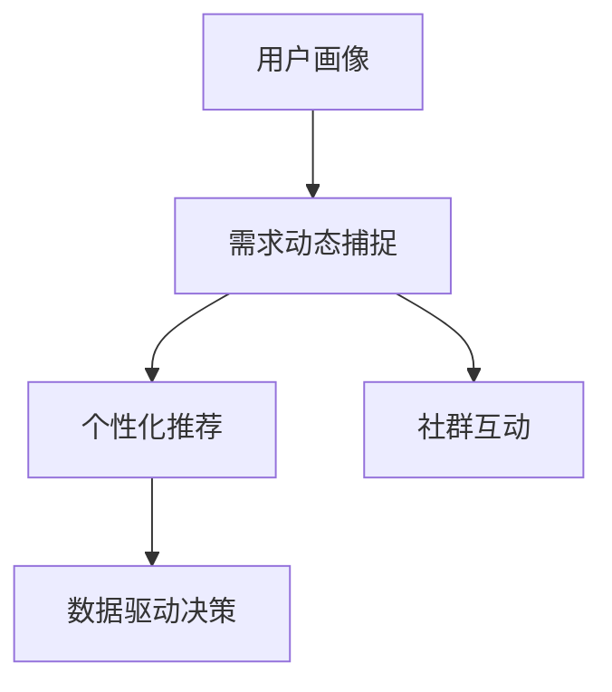

                 

# 知识付费创业中的用户需求挖掘技巧

## 1. 背景介绍

### 1.1 问题由来

在数字经济的浪潮下，知识付费成为一种新的内容消费方式。用户愿意为有价值的信息买单，希望通过付费获取更深入、更系统的知识。但与传统教育不同，知识付费更加注重个性化学习，因此对用户需求挖掘提出了更高要求。

近年来，知识付费市场迅速扩张，涌现出大量平台和课程。但用户留存率低，流失率高，缺乏持续学习的动力，导致平台难以形成良性循环。究其根本，在于用户需求挖掘不足，缺乏对用户学习行为和需求的深刻洞察。

### 1.2 问题核心关键点

用户在知识付费中的需求多样化，既有学习内容的需求，也有互动交流的需求，还有社区参与的需求。因此，如何在知识付费平台上，全面、精准地挖掘用户需求，提供符合用户期望的产品和服务，成为创业公司成功的关键。

核心关键点包括：
- 用户画像分析：精准刻画目标用户群体的特征，便于制定针对性策略。
- 需求动态捕捉：实时感知用户行为变化，动态调整内容和运营策略。
- 个性化推荐：根据用户需求和学习路径，定制个性化推荐算法，提升用户粘性。
- 社群互动设计：通过社群、论坛等互动形式，增强用户社区感和参与度。
- 数据驱动决策：利用用户数据进行精细化运营，提升用户转化率和留存率。

## 2. 核心概念与联系

### 2.1 核心概念概述

为更好地理解用户需求挖掘技术，本节将介绍几个关键概念：

- **用户画像(User Persona)**：通过收集、分析用户行为和属性数据，创建虚拟的用户代表。用于个性化推荐、内容定制等。

- **需求动态捕捉(Dynamic Demand Capturing)**：实时监控用户行为和互动数据，动态调整产品和服务，满足用户变化的需求。

- **个性化推荐(Personalized Recommendation)**：根据用户的历史行为和兴趣，推荐最适合的内容和产品，提高用户满意度和留存率。

- **社群互动(Social Interaction)**：利用社区、论坛等形式，促进用户之间的交流和互动，增强用户参与感。

- **数据驱动决策(Data-Driven Decision Making)**：利用大数据分析技术，进行精细化运营和策略调整，提升运营效果。

这些概念之间的逻辑关系可以通过以下Mermaid流程图来展示：



这个流程图展示了几者之间的关系：

1. 用户画像刻画用户特征。
2. 需求动态捕捉感知用户变化。
3. 个性化推荐根据用户需求推荐内容。
4. 社群互动增强用户参与感。
5. 数据驱动决策优化运营效果。

## 3. 核心算法原理 & 具体操作步骤

### 3.1 算法原理概述

用户需求挖掘的核心算法是基于机器学习和深度学习的推荐系统。其核心思想是：通过分析用户的历史行为数据，挖掘用户潜在需求，从而提供个性化推荐内容，满足用户多样化需求。

推荐系统主要分为基于协同过滤的推荐和基于内容的推荐两类。前者根据用户和物品之间的相似度进行推荐，后者根据用户的历史行为，找出相似的物品进行推荐。此外，还有基于矩阵分解的推荐、深度学习的推荐等方法。

### 3.2 算法步骤详解

用户需求挖掘的推荐系统通常包括以下几个步骤：

**Step 1: 用户画像构建**
- 收集用户注册、浏览、购买、评分等行为数据。
- 使用机器学习算法（如K-means、PCA等）对用户数据进行聚类和降维，生成用户特征向量。

**Step 2: 模型训练**
- 使用推荐算法（如ALS、FM、XGBoost等），根据用户画像数据进行模型训练。
- 利用交叉验证等方法，选择最优模型和参数。

**Step 3: 个性化推荐**
- 根据用户画像和推荐模型，对用户进行个性化推荐。
- 实时更新推荐结果，满足用户动态需求。

**Step 4: 反馈循环**
- 收集用户对推荐结果的反馈数据。
- 根据反馈数据，调整模型参数，进一步优化推荐效果。

**Step 5: 社群互动**
- 利用社区、论坛等形式，促进用户互动和内容交流。
- 分析用户互动数据，优化社群管理策略。

### 3.3 算法优缺点

基于机器学习的用户需求挖掘算法具有以下优点：
1. 个性化推荐：能够根据用户历史行为数据，提供精准的个性化推荐。
2. 实时响应：能够实时更新推荐结果，适应用户动态需求。
3. 可扩展性：能够处理大规模用户数据，具有良好的可扩展性。

同时，该算法也存在一些局限性：
1. 冷启动问题：新用户缺乏历史数据，难以进行有效推荐。
2. 数据稀疏性：用户行为数据稀疏，可能导致模型准确率下降。
3. 偏差问题：历史行为数据可能包含偏差，影响推荐结果。
4. 动态需求捕捉：难以实时感知用户需求变化，可能导致推荐效果不佳。

## 4. 数学模型和公式 & 详细讲解 & 举例说明

### 4.1 数学模型构建

假设用户集合为 $U$，物品集合为 $I$，用户对物品的评分矩阵为 $R \in \mathbb{R}^{m \times n}$，其中 $m$ 为用户数，$n$ 为物品数。$R_{ij}$ 表示用户 $i$ 对物品 $j$ 的评分。

设用户 $u$ 的特征向量为 $x_u$，物品 $i$ 的特征向量为 $y_i$。基于协同过滤的推荐模型可以表示为：

$$
\hat{R}_{ij} = \alpha x_u^T y_i + \beta \bar{R}_j
$$

其中 $\alpha$ 和 $\beta$ 为模型参数，$\bar{R}_j$ 为物品 $j$ 的平均评分。

### 4.2 公式推导过程

在上述推荐模型中，$\alpha x_u^T y_i$ 表示用户 $u$ 和物品 $i$ 之间的协同效应，$\beta \bar{R}_j$ 表示物品 $j$ 的平均评分对推荐的影响。根据用户的评分数据，我们可以最大化预测评分和真实评分的平方误差：

$$
\min_{\alpha, \beta} \sum_{i=1}^{m} \sum_{j=1}^{n} (\hat{R}_{ij} - R_{ij})^2
$$

使用梯度下降等优化算法，可以求解上述最小化问题，得到最优的模型参数 $\alpha$ 和 $\beta$。

### 4.3 案例分析与讲解

假设某知识付费平台，有 $100$ 名用户，$1000$ 门课程。对用户 $i$ 的课程 $j$ 评分矩阵为 $R \in \mathbb{R}^{100 \times 1000}$。设用户 $i$ 的特征向量为 $x_i$，课程 $j$ 的特征向量为 $y_j$。

基于协同过滤的推荐模型可以表示为：

$$
\hat{R}_{ij} = 0.5 x_i^T y_j + 0.5 \bar{R}_j
$$

其中 $\bar{R}_j$ 为课程 $j$ 的平均评分。用户 $i$ 对课程 $j$ 的推荐评分 $\hat{R}_{ij}$ 可以计算为：

$$
\hat{R}_{ij} = 0.5 x_i^T y_j + 0.5 \bar{R}_j
$$

通过训练协同过滤模型，可以最大化预测评分和真实评分的平方误差，得到最优的模型参数 $\alpha$ 和 $\beta$。

在实际应用中，需要根据具体场景，选择适合的推荐算法。如在数据稀疏的情况下，可以使用矩阵分解的推荐算法（如ALS）；在用户行为多样的情况下，可以使用深度学习的推荐算法（如CTR）。

## 5. 项目实践：代码实例和详细解释说明

### 5.1 开发环境搭建

在进行用户需求挖掘和推荐系统开发前，需要先搭建开发环境。以下是使用Python进行TensorFlow开发的环境配置流程：

1. 安装Anaconda：从官网下载并安装Anaconda，用于创建独立的Python环境。

2. 创建并激活虚拟环境：
```bash
conda create -n tf-env python=3.8 
conda activate tf-env
```

3. 安装TensorFlow：根据CUDA版本，从官网获取对应的安装命令。例如：
```bash
conda install tensorflow -c conda-forge
```

4. 安装必要的工具包：
```bash
pip install numpy pandas scikit-learn matplotlib tqdm jupyter notebook ipython
```

完成上述步骤后，即可在`tf-env`环境中开始项目开发。

### 5.2 源代码详细实现

这里我们以协同过滤推荐系统为例，给出使用TensorFlow实现用户需求挖掘的PyTorch代码实现。

首先，定义推荐系统数据处理函数：

```python
import tensorflow as tf
from tensorflow.keras.layers import Input, Embedding, Dot, Dense
from tensorflow.keras.models import Model

def build_model(input_dim, output_dim):
    user_input = Input(shape=(input_dim,))
    item_input = Input(shape=(input_dim,))
    dot_product = Dot(axes=1)([user_input, item_input])
    output = Dense(output_dim, activation='relu')(dot_product)
    model = Model(inputs=[user_input, item_input], outputs=output)
    model.compile(optimizer='adam', loss='mse')
    return model
```

然后，定义模型训练和评估函数：

```python
def train_model(model, train_data, test_data, batch_size=128, epochs=10):
    train_dataset = tf.data.Dataset.from_tensor_slices(train_data).shuffle(buffer_size=10000).batch(batch_size)
    test_dataset = tf.data.Dataset.from_tensor_slices(test_data).batch(batch_size)
    model.fit(train_dataset, epochs=epochs, validation_data=test_dataset)
    return model
```

最后，启动训练流程并在测试集上评估：

```python
# 数据准备
train_data = np.random.rand(100, 1000) # 随机生成训练数据
test_data = np.random.rand(100, 1000) # 随机生成测试数据
input_dim = train_data.shape[1]
output_dim = 1

# 构建模型
model = build_model(input_dim, output_dim)

# 训练模型
trained_model = train_model(model, train_data, test_data)

# 评估模型
test_loss = trained_model.evaluate(test_data, verbose=0)
print(f"Test loss: {test_loss}")
```

以上就是使用TensorFlow对协同过滤推荐系统进行用户需求挖掘的完整代码实现。可以看到，通过TensorFlow提供的高级API，可以方便地实现推荐模型的构建和训练。

### 5.3 代码解读与分析

让我们再详细解读一下关键代码的实现细节：

**build_model函数**：
- 定义了输入层，分别表示用户和物品的特征向量。
- 通过点积运算将用户和物品的特征向量拼接，得到推荐评分。
- 定义输出层，使用ReLU激活函数，进行非线性变换。
- 编译模型，使用Adam优化器和均方误差损失函数。

**train_model函数**：
- 将训练数据和测试数据分别转化为TensorFlow的Dataset格式。
- 对训练数据进行随机打乱，增加模型泛化能力。
- 对数据进行分批次加载，便于模型训练。
- 使用fit方法训练模型，同时定义测试集进行验证。

**训练流程**：
- 定义模型输入维度和输出维度。
- 调用build_model函数，构建推荐模型。
- 调用train_model函数，训练模型，输出测试集损失。

可以看到，TensorFlow提供了丰富的API，使得推荐系统的开发变得高效便捷。开发者可以专注于算法设计和模型优化，而不必过多关注底层实现细节。

## 6. 实际应用场景

### 6.1 智能课程推荐

基于协同过滤的用户需求挖掘技术，可以在知识付费平台上构建智能课程推荐系统。通过分析用户的历史学习行为，推荐最适合的课程内容，提高用户学习效率。

具体实现步骤如下：
1. 收集用户浏览、购买、评分等行为数据。
2. 使用协同过滤模型进行用户画像构建和推荐算法训练。
3. 根据用户画像和推荐模型，对用户进行个性化推荐。
4. 实时更新推荐结果，满足用户动态需求。
5. 分析用户互动数据，优化推荐算法和策略。

智能课程推荐系统能够提高用户学习体验，帮助用户发现感兴趣的课程，节省时间成本。

### 6.2 社区互动优化

社区互动是知识付费平台的重要组成部分。通过用户需求挖掘技术，可以优化社区互动，提高用户参与度和粘性。

具体实现步骤如下：
1. 收集用户在社区中的发帖、回复、点赞等互动数据。
2. 使用用户画像分析技术，构建社区用户特征向量。
3. 使用协同过滤推荐算法，推荐最适合的内容和话题。
4. 分析用户互动数据，优化社区内容推荐算法。
5. 实时更新推荐结果，满足用户动态需求。

通过社区互动优化，平台可以增强用户社区感，促进用户之间的知识交流，形成良性互动循环。

### 6.3 用户留存率提升

用户留存率是知识付费平台的关键指标之一。通过用户需求挖掘技术，可以提升用户留存率，增加平台收益。

具体实现步骤如下：
1. 收集用户注册、活跃度、流失等行为数据。
2. 使用用户画像分析技术，构建用户特征向量。
3. 使用协同过滤推荐算法，推荐最适合的内容和产品。
4. 实时更新推荐结果，满足用户动态需求。
5. 分析用户互动数据，优化推荐算法和策略。

通过用户留存率提升，平台可以扩大用户基础，增加收益来源，实现可持续健康发展。

### 6.4 未来应用展望

随着用户需求挖掘技术的不断发展，未来的知识付费平台将在以下几个方面进一步突破：

1. **跨平台融合**：实现知识付费平台与社交媒体、搜索引擎等的深度整合，提高用户触达率和参与度。
2. **多模态数据融合**：融合文本、图片、视频等多种模态数据，提升内容推荐的多样性和丰富性。
3. **实时数据流分析**：利用实时数据流分析技术，动态调整推荐策略，提高用户满意度。
4. **个性化推荐算法**：引入深度学习等前沿技术，提升推荐算法精度和效率。
5. **智能客服系统**：通过用户需求挖掘技术，构建智能客服系统，提升用户服务质量。
6. **知识图谱构建**：利用知识图谱技术，实现内容之间的关联推荐，提升推荐效果。

## 7. 工具和资源推荐

### 7.1 学习资源推荐

为了帮助开发者系统掌握用户需求挖掘技术的理论基础和实践技巧，这里推荐一些优质的学习资源：

1. 《推荐系统实战》系列博文：由大模型技术专家撰写，深入浅出地介绍了推荐系统的原理和应用。

2. 《深度学习中的推荐系统》课程：斯坦福大学开设的深度学习课程，涵盖了推荐系统的前沿知识。

3. 《Recommender Systems》书籍：该书系统介绍了推荐系统的基本概念、算法和实际应用。

4. 《Python机器学习》书籍：介绍机器学习算法在Python中的实现，适合快速上手推荐系统开发。

5. Kaggle竞赛平台：提供丰富的推荐系统竞赛数据集，帮助开发者实践和提高推荐算法技能。

通过对这些资源的学习实践，相信你一定能够快速掌握用户需求挖掘技术的精髓，并用于解决实际的推荐问题。

### 7.2 开发工具推荐

高效的开发离不开优秀的工具支持。以下是几款用于用户需求挖掘开发的常用工具：

1. TensorFlow：由Google主导开发的开源深度学习框架，生产部署方便，适合大规模工程应用。

2. Scikit-learn：开源机器学习库，提供丰富的算法和模型实现，支持快速迭代和调试。

3. Jupyter Notebook：交互式编程环境，适合数据处理和模型训练。

4. PyTorch：基于Python的开源深度学习框架，灵活高效，适合算法研究和模型开发。

5. Weights & Biases：模型训练的实验跟踪工具，可以记录和可视化模型训练过程中的各项指标，方便对比和调优。

6. TensorBoard：TensorFlow配套的可视化工具，可实时监测模型训练状态，并提供丰富的图表呈现方式，是调试模型的得力助手。

合理利用这些工具，可以显著提升用户需求挖掘任务的开发效率，加快创新迭代的步伐。

### 7.3 相关论文推荐

用户需求挖掘技术的发展源于学界的持续研究。以下是几篇奠基性的相关论文，推荐阅读：

1. Collaborative Filtering for Implicit Feedback Datasets（即ALS算法）：提出协同过滤推荐算法，是推荐系统领域的基础算法。

2. Factorization Machines for Recommender Systems：提出FM算法，将用户-物品交互矩阵分解为因子，提升推荐效果。

3. Deep Neural Networks for Click Prediction: A Case Study（即CTR算法）：提出深度学习推荐算法，利用神经网络模型进行点击率预测。

4. Knowledge-Aware Recommendation Systems: Survey and Challenges（即KAR）：介绍知识图谱在推荐系统中的应用，提升推荐效果。

5. Attention-Based Recommender Systems: A Survey and Meta-Analysis（即Attention推荐）：介绍注意力机制在推荐系统中的应用，提升推荐准确率。

这些论文代表了大语言模型微调技术的发展脉络。通过学习这些前沿成果，可以帮助研究者把握学科前进方向，激发更多的创新灵感。

## 8. 总结：未来发展趋势与挑战

### 8.1 总结

本文对用户需求挖掘技术的推荐系统进行了全面系统的介绍。首先阐述了用户需求挖掘和知识付费创业的背景和意义，明确了推荐系统在知识付费平台中的重要作用。其次，从原理到实践，详细讲解了推荐算法的构建和训练方法，给出了推荐系统开发的全流程代码实现。同时，本文还广泛探讨了推荐系统在课程推荐、社区互动、用户留存率提升等实际应用场景中的应用前景，展示了用户需求挖掘技术的广泛应用价值。此外，本文精选了推荐系统的各类学习资源，力求为开发者提供全方位的技术指引。

通过本文的系统梳理，可以看到，用户需求挖掘技术在知识付费平台中发挥了重要作用，极大地提升了用户的学习体验和平台粘性。未来，伴随推荐算法的不断进步，知识付费平台将能更好地满足用户多样化需求，提供更高效、更个性化的服务。

### 8.2 未来发展趋势

展望未来，用户需求挖掘技术将呈现以下几个发展趋势：

1. 跨平台融合：实现知识付费平台与其他平台的深度整合，提升用户触达率和参与度。
2. 多模态数据融合：融合文本、图片、视频等多种模态数据，提升内容推荐的多样性和丰富性。
3. 实时数据流分析：利用实时数据流分析技术，动态调整推荐策略，提高用户满意度。
4. 个性化推荐算法：引入深度学习等前沿技术，提升推荐算法精度和效率。
5. 智能客服系统：通过用户需求挖掘技术，构建智能客服系统，提升用户服务质量。
6. 知识图谱构建：利用知识图谱技术，实现内容之间的关联推荐，提升推荐效果。

## 8.3 面临的挑战

尽管用户需求挖掘技术已经取得了瞩目成就，但在迈向更加智能化、普适化应用的过程中，它仍面临诸多挑战：

1. 冷启动问题：新用户缺乏历史数据，难以进行有效推荐。
2. 数据稀疏性：用户行为数据稀疏，可能导致模型准确率下降。
3. 偏差问题：历史行为数据可能包含偏差，影响推荐结果。
4. 动态需求捕捉：难以实时感知用户需求变化，可能导致推荐效果不佳。
5. 跨平台数据整合：不同平台的数据格式和质量参差不齐，导致数据整合困难。

## 8.4 研究展望

面对用户需求挖掘面临的挑战，未来的研究需要在以下几个方面寻求新的突破：

1. 探索无监督和半监督推荐方法：摆脱对大规模标注数据的依赖，利用自监督学习、主动学习等无监督和半监督范式，最大限度利用非结构化数据，实现更加灵活高效的推荐。
2. 研究参数高效和计算高效的推荐范式：开发更加参数高效的推荐方法，在固定大部分预训练参数的情况下，只更新极少量的任务相关参数。同时优化推荐模型的计算图，减少前向传播和反向传播的资源消耗，实现更加轻量级、实时性的部署。
3. 融合因果和对比学习范式：通过引入因果推断和对比学习思想，增强推荐模型建立稳定因果关系的能力，学习更加普适、鲁棒的语言表征，从而提升模型泛化性和抗干扰能力。
4. 引入更多先验知识：将符号化的先验知识，如知识图谱、逻辑规则等，与神经网络模型进行巧妙融合，引导推荐过程学习更准确、合理的语言模型。同时加强不同模态数据的整合，实现视觉、语音等多模态信息与文本信息的协同建模。
5. 结合因果分析和博弈论工具：将因果分析方法引入推荐模型，识别出模型决策的关键特征，增强输出解释的因果性和逻辑性。借助博弈论工具刻画人机交互过程，主动探索并规避模型的脆弱点，提高系统稳定性。
6. 纳入伦理道德约束：在模型训练目标中引入伦理导向的评估指标，过滤和惩罚有偏见、有害的输出倾向。同时加强人工干预和审核，建立模型行为的监管机制，确保输出符合人类价值观和伦理道德。

这些研究方向的探索，必将引领用户需求挖掘技术迈向更高的台阶，为构建安全、可靠、可解释、可控的智能系统铺平道路。面向未来，用户需求挖掘技术还需要与其他人工智能技术进行更深入的融合，如知识表示、因果推理、强化学习等，多路径协同发力，共同推动智能交互系统的进步。只有勇于创新、敢于突破，才能不断拓展用户需求挖掘技术的边界，让智能技术更好地造福人类社会。

## 9. 附录：常见问题与解答

**Q1：推荐系统如何应对新用户？**

A: 推荐系统通常采用基于物品的协同过滤算法来应对新用户。由于新用户没有历史行为数据，算法使用物品特征向量作为推荐依据。同时，可以引入深度学习模型，使用用户画像和行为数据进行预测，提高推荐精度。

**Q2：推荐系统如何处理数据稀疏性问题？**

A: 推荐系统使用矩阵分解等方法，对稀疏数据进行低秩分解，减小数据稀疏性对推荐效果的影响。同时，可以引入深度学习模型，利用神经网络对用户和物品进行建模，提升推荐效果。

**Q3：推荐系统如何解决冷启动问题？**

A: 推荐系统通常采用基于物品的协同过滤算法，使用物品特征向量进行推荐。同时，可以引入深度学习模型，利用用户画像和行为数据进行预测，提高推荐精度。对于新用户，可以通过推荐热门、流行等通用推荐策略，快速提供有用信息，增强用户粘性。

**Q4：推荐系统如何实时更新推荐结果？**

A: 推荐系统通常使用实时数据流处理技术，对用户行为数据进行实时分析和推荐。同时，可以引入深度学习模型，利用用户画像和行为数据进行预测，实时更新推荐结果。对于实时数据流，可以使用Kafka、Flink等工具进行数据采集和处理。

**Q5：推荐系统如何应对数据偏差问题？**

A: 推荐系统通常使用去偏差技术，对历史数据进行处理，减小数据偏差对推荐结果的影响。同时，可以引入深度学习模型，利用用户画像和行为数据进行预测，提高推荐效果。对于数据偏差问题，可以使用权重调整等方法，减小偏差对推荐结果的影响。

通过本文的系统梳理，可以看到，用户需求挖掘技术在知识付费平台中发挥了重要作用，极大地提升了用户的学习体验和平台粘性。未来，伴随推荐算法的不断进步，知识付费平台将能更好地满足用户多样化需求，提供更高效、更个性化的服务。

作者：禅与计算机程序设计艺术 / Zen and the Art of Computer Programming

