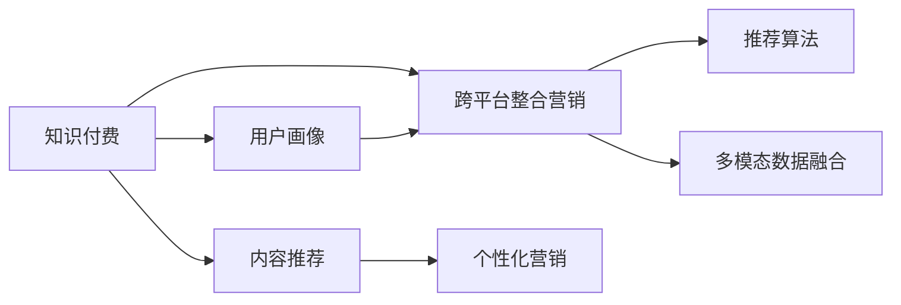

                 

## 1. 背景介绍

随着互联网的快速发展和技术的不断创新，知识付费行业在过去几年得到了长足发展。各大知识付费平台纷纷推出自己的订阅、付费课程和内容，吸引了大量用户。然而，知识付费平台众多，用户难以选择，每个平台内容独立，用户体验碎片化。如何实现跨平台整合营销，吸引更多用户，提高平台流量和收入，是知识付费平台面临的重要挑战。

## 2. 核心概念与联系

### 2.1 核心概念概述

要实现知识付费的跨平台整合营销，首先需要理解几个关键概念：

- **知识付费**：即用户为获取知识或学习内容而支付费用的模式。与传统教育不同，知识付费更加注重知识的实用性和时效性，形式多样，包括文章、视频、音频、课程等。
- **跨平台整合营销**：指通过将多个平台的知识内容进行整合，优化用户体验，提升平台整体流量和用户粘性，实现多平台协同发展。
- **用户画像**：指基于用户的行为数据、历史记录、社交网络等信息，刻画用户特征，为个性化推荐和营销提供依据。
- **推荐算法**：指基于用户画像和内容特征，推荐最相关、最合适的知识内容，以提高用户满意度和留存率。
- **多模态数据融合**：指将不同类型的数据（如文本、图像、视频等）进行融合，形成更全面、更准确的用户画像，为用户提供更为精准的服务。

这些概念之间的关系可以通过以下Mermaid流程图来展示：



这个流程图展示出知识付费平台用户画像的构建、跨平台整合营销的实现以及推荐算法和多模态数据融合技术之间的关系，从而为实现跨平台整合营销提供理论基础。

## 3. 核心算法原理 & 具体操作步骤

### 3.1 算法原理概述

跨平台整合营销的实现主要依赖于用户画像、推荐算法和多模态数据融合技术。其核心算法原理如下：

- **用户画像构建**：通过分析用户在平台上的行为数据（如浏览记录、点击记录、购买记录等），提取用户特征，形成用户画像。
- **推荐算法**：基于用户画像和内容特征，利用机器学习算法（如协同过滤、内容推荐算法、深度学习等）为用户推荐最相关、最合适的知识内容。
- **多模态数据融合**：将不同类型的数据进行融合，利用自然语言处理、计算机视觉等技术，形成更全面、更准确的用户画像。

### 3.2 算法步骤详解

以下是实现跨平台整合营销的具体操作步骤：

1. **数据收集与预处理**：
   - 收集用户行为数据，包括浏览记录、点击记录、购买记录、社交网络数据等。
   - 对数据进行清洗、去重、归一化等预处理操作。

2. **用户画像构建**：
   - 使用机器学习算法（如聚类算法、决策树、随机森林等）对用户行为数据进行分析，提取用户特征，形成用户画像。
   - 对用户画像进行特征选择和降维，降低计算复杂度，提高推荐效率。

3. **推荐算法设计**：
   - 根据用户画像和内容特征，设计推荐算法。常用的推荐算法包括协同过滤、基于内容的推荐、深度学习等。
   - 使用交叉验证、A/B测试等方法对推荐算法进行优化，提高推荐效果。

4. **多模态数据融合**：
   - 收集不同类型的数据（如文本、图像、视频等），提取特征，形成不同类型的数据集合。
   - 利用自然语言处理、计算机视觉等技术，对不同类型的数据进行融合，形成更全面、更准确的用户画像。

5. **跨平台整合营销**：
   - 将各平台的内容进行整合，为用户提供一个统一的内容展示和推荐界面。
   - 通过多模态数据融合技术，对用户画像进行优化，提高推荐效果。
   - 利用个性化推荐和营销技术，提升用户粘性，提高平台流量和收入。

### 3.3 算法优缺点

**优点**：
- 提升用户体验，提高用户满意度。
- 提升平台流量和收入，实现多平台协同发展。
- 提供个性化推荐，提高用户粘性。

**缺点**：
- 数据隐私问题：跨平台整合营销涉及大量用户数据，需要严格遵守数据隐私法规。
- 推荐算法复杂度：推荐算法的设计和优化需要大量的时间和资源投入。
- 跨平台数据整合：不同平台的数据格式和标准可能不同，需要进行大量的数据整合工作。

### 3.4 算法应用领域

跨平台整合营销技术可以应用于多个领域，包括但不限于：

- **知识付费平台**：实现跨平台知识内容的整合，提供个性化推荐，提升用户粘性和平台流量。
- **在线教育平台**：整合不同课程内容，提供个性化学习路径，提高用户学习效果。
- **内容分发平台**：整合不同类型的内容，提供个性化推荐，提升用户使用体验。

## 4. 数学模型和公式 & 详细讲解 & 举例说明

### 4.1 数学模型构建

假设知识付费平台有$M$个用户，每个用户有$N$个行为记录，每个行为记录包含$K$个特征。用户画像的数学模型可以表示为：

$$
\mathbf{u} = [u_1, u_2, \dots, u_M] \in \mathbb{R}^{M \times K}
$$

其中，$u_i$表示第$i$个用户的特征向量。

### 4.2 公式推导过程

推荐算法的核心是利用用户画像和内容特征计算推荐分数。常用的推荐算法包括协同过滤、基于内容的推荐、深度学习等。

以协同过滤算法为例，推荐分数可以表示为：

$$
\hat{y}_{ui} = \hat{\beta}_0 + \hat{\beta}_1 x_{ui} + \epsilon
$$

其中，$\hat{y}_{ui}$表示用户$i$对物品$u$的预测评分，$x_{ui}$表示用户$i$对物品$u$的特征向量，$\hat{\beta}_0$和$\hat{\beta}_1$为模型参数，$\epsilon$为误差项。

### 4.3 案例分析与讲解

以视频平台为例，用户观看视频的行为数据包含用户ID、视频ID、观看时长、点赞数等特征。通过对这些数据进行分析，可以得到用户的兴趣偏好和行为模式。根据用户画像和视频特征，使用协同过滤算法为用户推荐相关视频。

## 5. 项目实践：代码实例和详细解释说明

### 5.1 开发环境搭建

以下是基于Python进行知识付费跨平台整合营销的开发环境搭建步骤：

1. 安装Python 3.6及以上版本。
2. 安装相关依赖包，如NumPy、Pandas、Scikit-learn、TensorFlow等。
3. 配置环境变量，安装相关的Python库和工具包。

### 5.2 源代码详细实现

以下是一个简单的Python代码实现，用于用户画像的构建和推荐算法的实现：

```python
import numpy as np
import pandas as pd
from sklearn.feature_extraction.text import CountVectorizer
from sklearn.decomposition import PCA
from sklearn.metrics.pairwise import cosine_similarity

# 读取用户行为数据
data = pd.read_csv('user_behavior.csv')

# 提取特征
vectorizer = CountVectorizer()
X = vectorizer.fit_transform(data['features'])

# 计算相似度矩阵
similarity_matrix = cosine_similarity(X)

# 计算推荐分数
def calculate_recommendation(user, similarity_matrix, num_recommendations=5):
    # 计算用户特征向量
    user_features = X[user]
    
    # 计算用户与所有物品的相似度
    user_similarity = similarity_matrix[user]
    
    # 计算推荐分数
    recommendation_scores = user_similarity @ user_features
    
    # 获取推荐物品ID
    recommendation_items = np.argsort(-recommendation_scores)[1:num_recommendations+1]
    
    return recommendation_items

# 测试推荐算法
user_id = 123
recommendations = calculate_recommendation(user_id, similarity_matrix)
print(recommendations)
```

### 5.3 代码解读与分析

这段代码实现了一个简单的协同过滤推荐算法，用于为用户推荐相关内容。代码首先读取用户行为数据，并提取特征向量。然后计算用户与所有物品的相似度矩阵，最后根据相似度矩阵计算推荐分数，输出推荐物品ID。

## 6. 实际应用场景

### 6.1 智慧教育

在智慧教育领域，跨平台整合营销可以整合不同课程内容，提供个性化学习路径，提高用户学习效果。通过分析学生的学习行为数据，形成学生画像，利用推荐算法为学生推荐适合的课程和练习题，提高学习效率和效果。

### 6.2 内容分发平台

内容分发平台可以整合不同类型的内容，提供个性化推荐，提升用户使用体验。通过分析用户的行为数据和内容特征，形成用户画像，利用推荐算法为用户推荐相关内容，提高用户粘性和平台流量。

### 6.3 智能家居

智能家居平台可以利用用户画像和行为数据，提供个性化推荐和智能推荐，提升用户体验。通过分析用户的家电使用行为，形成用户画像，利用推荐算法为用户推荐相关家电产品和服务，提高用户满意度和平台流量。

### 6.4 未来应用展望

未来，跨平台整合营销技术将进一步发展，其应用场景将更加广泛。以下是在智慧城市、智能交通等领域的应用展望：

- **智慧城市**：整合不同城市的服务资源，提供个性化推荐，提升城市服务效率和用户满意度。
- **智能交通**：整合不同交通数据，提供个性化推荐和智能调度，提高交通管理效率和用户出行体验。

## 7. 工具和资源推荐

### 7.1 学习资源推荐

以下是一些优质的学习资源，帮助开发者系统掌握跨平台整合营销的理论基础和实践技巧：

1. **《推荐系统实践》书籍**：由王宝硕等著，详细介绍了推荐系统的发展历程、推荐算法、应用场景等。
2. **Coursera《推荐系统》课程**：由John Canny教授主讲，涵盖推荐系统的基本原理、算法实现、实际应用等。
3. **Kaggle推荐系统竞赛**：通过实际数据集和竞赛任务，练习推荐算法的实现和优化。

### 7.2 开发工具推荐

以下是一些常用的开发工具，用于跨平台整合营销的实现：

1. **Python**：强大的编程语言，适合开发推荐算法和数据分析。
2. **TensorFlow**：深度学习框架，适合实现深度学习推荐算法。
3. **Apache Spark**：分布式计算框架，适合处理大规模数据。

### 7.3 相关论文推荐

以下是几篇重要的推荐系统相关论文，帮助理解跨平台整合营销的技术原理和应用场景：

1. **《协同过滤推荐系统》**：由Bing Liu等著，详细介绍协同过滤推荐算法的原理和实现。
2. **《基于深度学习的推荐系统》**：由Yuxiang Yang等著，介绍基于深度学习的推荐算法，包括深度协同过滤、深度矩阵分解等。
3. **《跨平台推荐系统》**：由Guo Qiang等著，介绍跨平台推荐系统的构建方法和应用场景。

## 8. 总结：未来发展趋势与挑战

### 8.1 研究成果总结

本文详细介绍了跨平台整合营销的核心概念、算法原理和操作步骤，并通过代码实例说明了其实现方法。通过理论分析和实践探索，为实现跨平台整合营销提供了全面的指导。

### 8.2 未来发展趋势

未来，跨平台整合营销技术将进一步发展，其应用场景将更加广泛。以下是一些可能的发展趋势：

- **个性化推荐**：通过分析用户行为数据和内容特征，提供更精准、更个性化的推荐，提高用户满意度和平台流量。
- **多模态数据融合**：整合不同类型的数据，利用自然语言处理、计算机视觉等技术，形成更全面、更准确的用户画像。
- **深度学习应用**：利用深度学习算法，提升推荐算法的精度和效果。

### 8.3 面临的挑战

虽然跨平台整合营销技术在不断发展，但也面临一些挑战：

- **数据隐私**：跨平台整合营销涉及大量用户数据，需要严格遵守数据隐私法规。
- **推荐算法复杂度**：推荐算法的设计和优化需要大量的时间和资源投入。
- **跨平台数据整合**：不同平台的数据格式和标准可能不同，需要进行大量的数据整合工作。

### 8.4 研究展望

为了解决上述挑战，未来的研究需要在以下几个方面寻求新的突破：

- **数据隐私保护**：研究如何在保证用户隐私的前提下，进行跨平台数据整合。
- **推荐算法优化**：研究高效的推荐算法，提升推荐算法的精度和效果。
- **跨平台数据标准**：研究跨平台数据的标准化和整合方法，提高数据整合效率。

## 9. 附录：常见问题与解答

### 9.1 问题1：跨平台整合营销是否需要大量的数据支持？

解答：跨平台整合营销需要大量的用户行为数据和内容数据，以构建用户画像和推荐算法。但数据量并非越大越好，需要根据平台的实际情况进行合理的采集和分析。

### 9.2 问题2：推荐算法是否适用于所有知识付费平台？

解答：推荐算法适用于大部分知识付费平台，但具体的实现方式需要根据平台的业务特点进行调整。例如，针对视频平台和在线教育平台，推荐算法的设计和优化方法有所不同。

### 9.3 问题3：如何提升推荐算法的精度和效果？

解答：提升推荐算法精度和效果的方法包括：

- 数据清洗和预处理：对数据进行清洗、去重、归一化等预处理操作。
- 特征选择和降维：选择合适的特征，并进行降维处理，降低计算复杂度，提高推荐效率。
- 算法优化：使用交叉验证、A/B测试等方法对推荐算法进行优化，提高推荐效果。
- 多模态数据融合：整合不同类型的数据，利用自然语言处理、计算机视觉等技术，形成更全面、更准确的用户画像。

### 9.4 问题4：跨平台整合营销如何处理数据隐私问题？

解答：处理数据隐私问题的方法包括：

- 数据匿名化：对用户数据进行匿名化处理，防止用户隐私泄露。
- 数据加密：对用户数据进行加密处理，保护用户数据安全。
- 隐私保护算法：研究隐私保护算法，如差分隐私、联邦学习等，保护用户隐私。

### 9.5 问题5：跨平台整合营销的开发难点在哪里？

解答：跨平台整合营销的开发难点包括：

- 数据整合：不同平台的数据格式和标准可能不同，需要进行大量的数据整合工作。
- 推荐算法复杂度：推荐算法的设计和优化需要大量的时间和资源投入。
- 用户画像构建：需要结合多模态数据，形成全面、准确的用户画像。

---

作者：禅与计算机程序设计艺术 / Zen and the Art of Computer Programming

