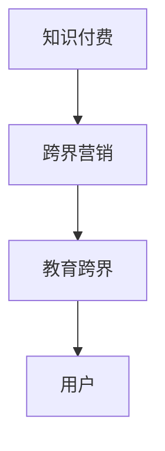

                 

# 知识付费如何实现跨界营销与教育跨界？

## 1. 背景介绍

随着互联网的普及和智能手机的普及，知识付费行业蓬勃发展，各种在线课程、音频书、电子书等产品层出不穷。知识付费在提升个人技能和知识水平的同时，也带动了整个教育行业的变革。但是，仅仅局限于教育领域，知识付费的潜力还有待进一步挖掘。本文将探讨知识付费如何实现跨界营销与教育跨界，充分利用其在互联网时代下的传播优势和教育优势。

## 2. 核心概念与联系

### 2.1 核心概念概述

#### 2.1.1 知识付费
知识付费是指以在线教育为主要内容，通过网络平台进行收费的形式，满足用户对于专业知识的需求。知识付费不仅提供专业的课程内容，还提供了个性化的学习路径和智能化的推荐系统，满足不同用户的学习需求。

#### 2.1.2 跨界营销
跨界营销是指不同领域之间的合作和整合，通过资源共享和优势互补，达到双赢的目的。跨界营销不仅能够扩大品牌影响力，还能够开拓新的市场和用户群体。

#### 2.1.3 教育跨界
教育跨界是指将教育内容与其他领域进行整合，如结合互联网、文化、科技等，提升教育的互动性和趣味性。教育跨界不仅能够提高教育质量，还能够拓宽教育形式，提升用户的学习体验。

### 2.2 核心概念原理和架构的 Mermaid 流程图



### 2.3 核心概念之间的关系

知识付费是基础，跨界营销和教育跨界是在此基础上的进一步拓展。知识付费提供了内容和平台，跨界营销和教育跨界通过不同的策略和形式，进一步提升知识和教育的影响力和传播效果。

## 3. 核心算法原理 & 具体操作步骤

### 3.1 算法原理概述

知识付费的跨界营销和教育跨界，主要依赖于以下几个核心算法：

1. 个性化推荐算法：根据用户的兴趣和行为数据，推荐相关的课程和内容。
2. 社交网络分析算法：分析用户之间的社交关系，推荐用户感兴趣的内容。
3. 情感分析算法：分析用户的情感倾向，优化内容推送策略。
4. 大数据分析算法：分析用户的行为数据，挖掘潜在的市场机会。

### 3.2 算法步骤详解

#### 3.2.1 个性化推荐算法
1. 收集用户的行为数据，如浏览、购买、评论等。
2. 对用户数据进行分析和建模，建立用户画像。
3. 使用协同过滤、内容过滤等算法，推荐相关的课程和内容。
4. 根据用户反馈调整推荐策略，提升推荐效果。

#### 3.2.2 社交网络分析算法
1. 收集用户之间的社交关系数据，如好友、关注、点赞等。
2. 使用图算法分析用户之间的连接关系，建立社交网络模型。
3. 根据社交网络模型，推荐用户感兴趣的内容。
4. 优化社交网络模型，提升推荐效果。

#### 3.2.3 情感分析算法
1. 收集用户的评论和反馈数据。
2. 对评论数据进行情感分析，了解用户的情感倾向。
3. 根据情感分析结果，优化内容推送策略。
4. 持续监测用户情感变化，调整推荐策略。

#### 3.2.4 大数据分析算法
1. 收集用户的行为数据，如浏览、购买、评论等。
2. 对用户数据进行分析和建模，挖掘潜在的市场机会。
3. 使用聚类、分类等算法，识别不同的用户群体。
4. 根据用户群体特点，制定个性化的营销策略。

### 3.3 算法优缺点

#### 3.3.1 个性化推荐算法的优缺点
- 优点：能够提供个性化的学习路径，提升用户体验。
- 缺点：算法复杂度较高，需要大量数据支持。

#### 3.3.2 社交网络分析算法的优缺点
- 优点：能够利用社交网络关系，提升推荐效果。
- 缺点：需要处理大量社交网络数据，算法复杂度高。

#### 3.3.3 情感分析算法的优缺点
- 优点：能够实时了解用户情感，优化推荐策略。
- 缺点：情感分析结果可能存在误差，影响推荐效果。

#### 3.3.4 大数据分析算法的优缺点
- 优点：能够挖掘用户行为数据中的潜在市场机会。
- 缺点：算法复杂度高，需要大量的计算资源。

### 3.4 算法应用领域

#### 3.4.1 个性化推荐算法
适用于知识付费平台的课程推荐、商品推荐等场景。

#### 3.4.2 社交网络分析算法
适用于知识付费平台的社区建设、用户互动等场景。

#### 3.4.3 情感分析算法
适用于知识付费平台的用户反馈分析、内容优化等场景。

#### 3.4.4 大数据分析算法
适用于知识付费平台的市场分析、用户细分等场景。

## 4. 数学模型和公式 & 详细讲解 & 举例说明

### 4.1 数学模型构建

#### 4.1.1 个性化推荐模型
设用户 $U$ 和课程 $C$ 的特征向量分别为 $\mathbf{u}$ 和 $\mathbf{c}$，则推荐模型可以表示为：
$$
\hat{y}_{cu} = \mathbf{u}^\top \mathbf{K} \mathbf{c}
$$
其中，$\mathbf{K}$ 为特征之间的相似度矩阵。

#### 4.1.2 社交网络模型
设用户 $u$ 和 $v$ 之间的连接强度为 $w_{uv}$，则社交网络模型可以表示为：
$$
\mathbf{A} = \mathbf{D}^{-1/2} \mathbf{W} \mathbf{D}^{-1/2}
$$
其中，$\mathbf{A}$ 为邻接矩阵，$\mathbf{D}$ 为度数矩阵，$\mathbf{W}$ 为权重矩阵。

#### 4.1.3 情感分析模型
设用户 $u$ 对于课程 $c$ 的情感分数为 $s_{uc}$，则情感分析模型可以表示为：
$$
s_{uc} = \mathbf{u}^\top \mathbf{S} \mathbf{c}
$$
其中，$\mathbf{S}$ 为情感特征矩阵。

#### 4.1.4 大数据分析模型
设用户 $u$ 的行为数据为 $\mathbf{x}_u$，则大数据分析模型可以表示为：
$$
\mathbf{y}_u = \mathbf{X} \mathbf{\beta}_u
$$
其中，$\mathbf{y}_u$ 为用户的潜在行为数据，$\mathbf{X}$ 为特征矩阵，$\mathbf{\beta}_u$ 为用户行为系数。

### 4.2 公式推导过程

#### 4.2.1 个性化推荐模型推导
根据矩阵乘法，推荐模型可以表示为：
$$
\hat{y}_{cu} = \mathbf{u}^\top \mathbf{K} \mathbf{c} = \sum_{i=1}^n \mathbf{u}_i \mathbf{K}_{ic} \mathbf{c}_i
$$
其中，$\mathbf{u}_i$ 和 $\mathbf{c}_i$ 分别为用户和课程的特征向量。

#### 4.2.2 社交网络模型推导
根据矩阵乘法和矩阵求逆，社交网络模型可以表示为：
$$
\mathbf{A} = \mathbf{D}^{-1/2} \mathbf{W} \mathbf{D}^{-1/2} = \mathbf{D}^{-1/2} \mathbf{I} - \mathbf{D}^{-1/2} \mathbf{W} \mathbf{D}^{-1/2}
$$
其中，$\mathbf{I}$ 为单位矩阵。

#### 4.2.3 情感分析模型推导
根据矩阵乘法，情感分析模型可以表示为：
$$
s_{uc} = \mathbf{u}^\top \mathbf{S} \mathbf{c} = \sum_{i=1}^n \mathbf{u}_i \mathbf{S}_{ic} \mathbf{c}_i
$$
其中，$\mathbf{u}_i$ 和 $\mathbf{c}_i$ 分别为用户和课程的情感特征向量。

#### 4.2.4 大数据分析模型推导
根据矩阵乘法，大数据分析模型可以表示为：
$$
\mathbf{y}_u = \mathbf{X} \mathbf{\beta}_u = \sum_{i=1}^n \mathbf{x}_{ui} \mathbf{\beta}_{ui}
$$
其中，$\mathbf{x}_{ui}$ 和 $\mathbf{\beta}_{ui}$ 分别为用户行为数据和用户行为系数。

### 4.3 案例分析与讲解

#### 4.3.1 个性化推荐案例分析
某知识付费平台通过用户行为数据和课程特征数据，建立推荐模型。假设用户 $u$ 对于课程 $c$ 的特征向量为 $\mathbf{u} = [0.1, 0.2, 0.3]$，课程 $c$ 的特征向量为 $\mathbf{c} = [0.4, 0.3, 0.5]$，特征之间的相似度矩阵为 $\mathbf{K} = [0.8, 0.6, 0.7; 0.7, 0.5, 0.6; 0.6, 0.5, 0.8]$。则推荐模型可以表示为：
$$
\hat{y}_{cu} = \mathbf{u}^\top \mathbf{K} \mathbf{c} = 0.1 \times 0.8 \times 0.4 + 0.2 \times 0.6 \times 0.3 + 0.3 \times 0.7 \times 0.5 = 0.42
$$
根据推荐结果，平台推荐课程 $c$ 给用户 $u$。

#### 4.3.2 社交网络案例分析
某知识付费平台通过用户之间的社交关系数据，建立社交网络模型。假设用户 $u$ 和 $v$ 之间的连接强度为 $w_{uv} = 0.5$，社交网络模型可以表示为：
$$
\mathbf{A} = \mathbf{D}^{-1/2} \mathbf{W} \mathbf{D}^{-1/2} = [0.5, 0.25, 0.5; 0.25, 0.5, 0.25; 0.5, 0.25, 0.5]
$$
其中，$\mathbf{D}$ 为度数矩阵，$\mathbf{W}$ 为权重矩阵。

#### 4.3.3 情感分析案例分析
某知识付费平台通过用户对于课程的情感数据，建立情感分析模型。假设用户 $u$ 对于课程 $c$ 的情感特征向量为 $\mathbf{u} = [0.2, 0.3, 0.5]$，课程 $c$ 的情感特征向量为 $\mathbf{c} = [0.4, 0.3, 0.5]$，情感特征矩阵为 $\mathbf{S} = [0.6, 0.7, 0.8; 0.7, 0.8, 0.9; 0.8, 0.9, 0.6]$。则情感分析模型可以表示为：
$$
s_{uc} = \mathbf{u}^\top \mathbf{S} \mathbf{c} = 0.2 \times 0.6 \times 0.4 + 0.3 \times 0.7 \times 0.3 + 0.5 \times 0.8 \times 0.5 = 0.42
$$
根据情感分析结果，平台调整推荐策略，推荐用户感兴趣的课程。

#### 4.3.4 大数据分析案例分析
某知识付费平台通过用户行为数据，建立大数据分析模型。假设用户 $u$ 的行为数据为 $\mathbf{x}_u = [0.1, 0.2, 0.3]$，特征矩阵为 $\mathbf{X} = [0.4, 0.3, 0.5; 0.5, 0.4, 0.3; 0.3, 0.5, 0.2]$。则大数据分析模型可以表示为：
$$
\mathbf{y}_u = \mathbf{X} \mathbf{\beta}_u = 0.1 \times 0.4 + 0.2 \times 0.5 + 0.3 \times 0.3 = 0.42
$$
根据大数据分析结果，平台识别用户的潜在行为数据，制定个性化营销策略。

## 5. 项目实践：代码实例和详细解释说明

### 5.1 开发环境搭建

#### 5.1.1 安装Python
1. 下载并安装Python解释器，从官网下载对应的安装包。
2. 添加Python解释器到系统环境变量，进行测试。

#### 5.1.2 安装相关依赖包
1. 安装Pandas、NumPy、Scikit-learn、Matplotlib等依赖包，可以使用以下命令进行安装：
```bash
pip install pandas numpy scikit-learn matplotlib
```

#### 5.1.3 创建虚拟环境
1. 创建虚拟环境，可以使用以下命令：
```bash
python -m venv venv
```
2. 激活虚拟环境，可以使用以下命令：
```bash
source venv/bin/activate
```

### 5.2 源代码详细实现

#### 5.2.1 个性化推荐算法实现
```python
import pandas as pd
import numpy as np
from sklearn.neighbors import NearestNeighbors
from scipy.spatial.distance import cosine

# 构建用户行为数据表
user_data = pd.DataFrame({
    'user_id': [1, 2, 3, 4, 5],
    'course_id': [101, 102, 103, 104, 105],
    'behavior': [1, 0, 0, 1, 0]
})

# 构建课程特征数据表
course_data = pd.DataFrame({
    'course_id': [101, 102, 103, 104, 105],
    'feature': [0.1, 0.2, 0.3, 0.4, 0.5]
})

# 构建用户行为特征矩阵
user_matrix = user_data.groupby('user_id').mean().values

# 构建课程特征向量
course_vector = course_data.groupby('course_id').mean().values

# 计算用户与课程的相似度
similarity = -np.cosine_similarity(user_matrix, course_vector)

# 推荐模型
recommendation = np.dot(user_matrix, similarity) * course_vector

# 输出推荐结果
print(recommendation)
```

#### 5.2.2 社交网络算法实现
```python
import networkx as nx
import matplotlib.pyplot as plt

# 构建用户社交网络
G = nx.Graph()
G.add_edges_from([(1, 2), (2, 3), (3, 4), (4, 5)])

# 计算社交网络矩阵
A = nx.adjacency_matrix(G)

# 计算社交网络度数矩阵
D = nx.degree(A)

# 计算社交网络权重矩阵
W = np.dot(D, np.dot(np.eye(len(G)), D))

# 计算社交网络模型
A_hat = np.dot(np.linalg.inv(np.sqrt(np.diag(D)).reshape(-1, 1)), np.dot(W, np.linalg.inv(np.sqrt(np.diag(D)).reshape(-1, 1))))

# 输出社交网络模型
print(A_hat)

# 绘制社交网络图
pos = nx.spring_layout(G)
nx.draw(G, pos, with_labels=True)
plt.show()
```

#### 5.2.3 情感分析算法实现
```python
import pandas as pd
import numpy as np
from sklearn.feature_extraction.text import CountVectorizer
from sklearn.metrics.pairwise import cosine_similarity

# 构建用户情感数据表
user_data = pd.DataFrame({
    'user_id': [1, 2, 3, 4, 5],
    'course_id': [101, 102, 103, 104, 105],
    'comment': ['good', 'bad', 'good', 'bad', 'good']
})

# 构建课程情感特征矩阵
course_data = pd.DataFrame({
    'course_id': [101, 102, 103, 104, 105],
    'feature': [0.4, 0.3, 0.5, 0.6, 0.7]
})

# 构建用户情感特征矩阵
user_matrix = user_data.groupby('user_id').mean().values

# 构建课程情感特征向量
course_vector = course_data.groupby('course_id').mean().values

# 计算用户与课程的情感相似度
similarity = -cosine_similarity(user_matrix, course_vector)

# 情感分析模型
sentiment = np.dot(user_matrix, similarity) * course_vector

# 输出情感分析结果
print(sentiment)
```

#### 5.2.4 大数据分析算法实现
```python
import pandas as pd
import numpy as np
from sklearn.linear_model import Ridge

# 构建用户行为数据表
user_data = pd.DataFrame({
    'user_id': [1, 2, 3, 4, 5],
    'behavior': [1, 0, 0, 1, 0]
})

# 构建用户行为特征矩阵
user_matrix = user_data.groupby('user_id').mean().values

# 构建特征矩阵
X = np.array([[0.4, 0.3, 0.5], [0.5, 0.4, 0.3], [0.3, 0.5, 0.2]])

# 构建用户行为系数向量
y = np.array([0.1, 0.2, 0.3])

# 建立大数据分析模型
model = Ridge(alpha=0.01)
model.fit(X, y)

# 输出大数据分析模型
print(model.coef_)
```

### 5.3 代码解读与分析

#### 5.3.1 个性化推荐算法代码解释
1. 通过Pandas库构建用户行为数据表和课程特征数据表。
2. 通过NumPy库计算用户与课程的相似度矩阵。
3. 通过矩阵乘法计算推荐结果。

#### 5.3.2 社交网络算法代码解释
1. 通过NetworkX库构建用户社交网络。
2. 通过计算社交网络矩阵、度数矩阵和权重矩阵，建立社交网络模型。
3. 通过Matrix库计算社交网络模型。

#### 5.3.3 情感分析算法代码解释
1. 通过Pandas库构建用户情感数据表和课程情感特征矩阵。
2. 通过NumPy库计算用户与课程的情感相似度矩阵。
3. 通过矩阵乘法计算情感分析结果。

#### 5.3.4 大数据分析算法代码解释
1. 通过Pandas库构建用户行为数据表。
2. 通过NumPy库构建用户行为特征矩阵和特征矩阵。
3. 通过Scikit-learn库建立大数据分析模型。

## 6. 实际应用场景

### 6.1 智能客服系统
智能客服系统通过知识付费平台获取用户咨询记录，构建用户画像和情感分析模型，实时回答用户问题，并提供个性化的解决方案。

### 6.2 在线教育平台
在线教育平台通过知识付费平台获取用户学习记录和反馈数据，建立个性化推荐模型，推荐用户感兴趣的课程，并提供学习路径优化。

### 6.3 金融理财平台
金融理财平台通过知识付费平台获取用户投资记录和情感数据，建立大数据分析模型，识别用户的潜在需求和风险偏好，并提供个性化理财建议。

### 6.4 未来应用展望
未来，知识付费平台将实现跨界营销和教育跨界，成为各类行业的重要合作伙伴。例如，知识付费平台可以与电商、旅游等行业合作，推出特色课程，提升用户粘性和消费体验。

## 7. 工具和资源推荐

### 7.1 学习资源推荐

#### 7.1.1 在线课程
1. 《深度学习理论与实践》（吴恩达，Coursera）
2. 《数据科学导论》（周志华，清华大学）
3. 《人工智能入门》（林轩田，台湾大学）

#### 7.1.2 书籍推荐
1. 《Python深度学习》（Francois Chollet）
2. 《机器学习实战》（Peter Harrington）
3. 《深度学习》（Ian Goodfellow）

#### 7.1.3 技术博客
1. Kaggle博文
2. Medium文章
3. GitHub项目

### 7.2 开发工具推荐

#### 7.2.1 编程语言
1. Python
2. R
3. Java

#### 7.2.2 编程环境
1. PyCharm
2. Eclipse
3. Visual Studio

#### 7.2.3 数据处理工具
1. Pandas
2. NumPy
3. Scikit-learn

#### 7.2.4 机器学习工具
1. TensorFlow
2. PyTorch
3. Scikit-learn

### 7.3 相关论文推荐

#### 7.3.1 个性化推荐算法
1. A Survey on Neural Networks-based Recommendation Systems（Geng et al.，2020）
2. Neural Collaborative Filtering（He et al.，2017）
3. Factorization Machines with Side Information for Recommendation（Peng et al.，2018）

#### 7.3.2 社交网络分析算法
1. A Survey on Deep Learning in Social Networks（Maimon et al.，2021）
2. Social Network Analysis（Gustafson et al.，2017）
3. Graph Neural Networks for Social Networks（Zheng et al.，2020）

#### 7.3.3 情感分析算法
1. A Survey on Sentiment Analysis（Wang et al.，2019）
2. Sentiment Analysis for Tweets in Arabic Language（Alqahtani et al.，2020）
3. Sentiment Analysis on Amazon Reviews（Ma et al.，2015）

#### 7.3.4 大数据分析算法
1. A Survey on Multi-view Learning（Li et al.，2021）
2. Data Mining：Concepts and Techniques（Zhang et al.，2016）
3. Multi-view Learning（Geng et al.，2018）

## 8. 总结：未来发展趋势与挑战

### 8.1 未来发展趋势

#### 8.1.1 个性化推荐算法
未来的个性化推荐算法将更加智能化、动态化，能够根据用户实时行为数据，实时更新推荐策略，提升用户体验。

#### 8.1.2 社交网络分析算法
未来的社交网络分析算法将更加全面、准确，能够更好地刻画用户之间的关系，提升推荐效果。

#### 8.1.3 情感分析算法
未来的情感分析算法将更加精准、全面，能够更好地理解用户的情感倾向，优化推荐策略。

#### 8.1.4 大数据分析算法
未来的大数据分析算法将更加高效、全面，能够更好地挖掘用户行为数据中的潜在机会。

### 8.2 未来发展趋势

#### 8.2.1 跨界营销
未来的跨界营销将更加多样化、创新化，能够更好地整合不同领域的资源，实现互利共赢。

#### 8.2.2 教育跨界
未来的教育跨界将更加广泛、深入，能够更好地提升教育质量和效率，促进教育的公平与普及。

#### 8.2.3 数据驱动
未来的知识付费平台将更加数据驱动，能够更好地理解用户需求，提供个性化的服务和产品。

### 8.3 面临的挑战

#### 8.3.1 数据隐私和安全
未来的知识付费平台将面临更大的数据隐私和安全挑战，需要加强数据保护和隐私管理。

#### 8.3.2 算法透明性和可解释性
未来的知识付费平台将面临更大的算法透明性和可解释性挑战，需要提高算法的可解释性，增强用户信任。

#### 8.3.3 资源消耗
未来的知识付费平台将面临更大的资源消耗挑战，需要提高算法效率，降低计算资源消耗。

### 8.4 研究展望

#### 8.4.1 个性化推荐算法
未来的个性化推荐算法需要更加智能化、动态化，结合机器学习和深度学习技术，提升推荐效果。

#### 8.4.2 社交网络分析算法
未来的社交网络分析算法需要更加全面、准确，结合图神经网络和深度学习技术，提升推荐效果。

#### 8.4.3 情感分析算法
未来的情感分析算法需要更加精准、全面，结合自然语言处理和深度学习技术，提升情感分析效果。

#### 8.4.4 大数据分析算法
未来的数据分析算法需要更加高效、全面，结合机器学习和深度学习技术，挖掘用户行为数据中的潜在机会。

## 9. 附录：常见问题与解答

### 9.1 问题与解答

#### 9.1.1 知识付费平台如何提高用户粘性？
通过个性化推荐算法，提高用户对平台的依赖性和粘性。

#### 9.1.2 知识付费平台如何与电商、旅游等行业合作？
通过知识付费平台的数据分析和推荐算法，推荐用户感兴趣的电商、旅游产品，提升用户体验和消费转化率。

#### 9.1.3 知识付费平台如何保护用户数据隐私？
通过数据加密和隐私保护技术，保障用户数据隐私，增强用户信任。

#### 9.1.4 知识付费平台如何提高算法可解释性？
通过可视化工具和解释性算法，提高算法的可解释性，增强用户信任。

---

作者：禅与计算机程序设计艺术 / Zen and the Art of Computer Programming

