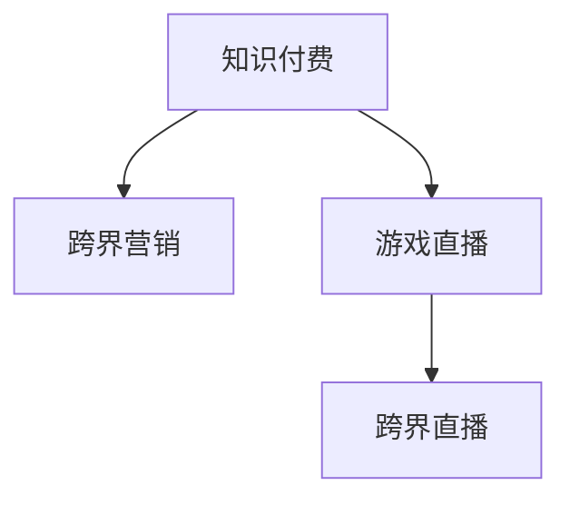

                 

# 知识付费如何实现跨界营销与游戏直播跨界？

## 1. 背景介绍

近年来，随着互联网技术的迅猛发展，知识付费和游戏直播两大领域均呈现蓬勃发展态势，成为新一代消费热点。知识付费平台如得到、知乎、喜马拉雅等，利用知识付费的模式，将专业知识、经验技能等优质内容转化为价值产品，满足用户求知、提升个人能力的需求。而游戏直播平台如斗鱼、虎牙、哔哩哔哩等，则通过游戏主播和观众之间的互动，吸引流量，提供娱乐和社交服务，成为互联网娱乐的重要形式。

跨界营销与游戏直播跨界正是在这一背景下兴起的新趋势。知识付费平台与游戏直播平台合作，可以实现双方资源的互补与协同，共同拓展市场，提升品牌影响力，实现业务创新与增长。本文将从跨界营销和游戏直播跨界两个角度，探讨知识付费在跨界合作中的实际应用和操作路径。

## 2. 核心概念与联系

### 2.1 核心概念概述

为更好地理解知识付费与跨界营销及游戏直播跨界的合作模式，本节将介绍几个密切相关的核心概念：

- **知识付费**：利用互联网技术，将专业知识、经验技能等转化为付费内容，通过订阅、购买等方式获取知识付费服务。
- **跨界营销**：不同领域的企业或品牌通过跨领域的合作，共享资源，共创价值，实现市场拓展和品牌升级。
- **游戏直播**：主播通过直播游戏，展示操作技巧、游戏攻略，与观众进行互动，提供娱乐和社交服务。
- **跨界直播**：游戏直播与跨界营销结合，通过游戏直播的形式进行品牌推广和市场传播。

这些概念之间的逻辑关系可以通过以下Mermaid流程图来展示：



这个流程图展示了一系列概念之间的关联关系：

1. 知识付费通过内容提供满足用户需求。
2. 跨界营销通过不同领域的合作实现资源共享。
3. 游戏直播提供娱乐和社交服务。
4. 跨界直播结合游戏直播与跨界营销，提升品牌影响力。

## 3. 核心算法原理 & 具体操作步骤

### 3.1 算法原理概述

知识付费与跨界营销及游戏直播跨界的合作模式，其核心思想是通过跨领域的合作，共享资源，共创价值。具体而言，知识付费平台通过与游戏直播平台合作，可以借助游戏直播的广泛受众和互动优势，提升品牌影响力和用户粘性，同时通过游戏直播的流量和互动，实现知识付费内容的传播和变现。

### 3.2 算法步骤详解

**Step 1: 选择合适的跨界合作伙伴**
- 选择与知识付费内容相关性高、用户基础庞大的游戏直播平台进行合作。
- 评估合作伙伴的品牌形象、内容质量和市场策略，确保合作契合度。

**Step 2: 设计合作模式**
- 确定合作的具体形式，如联合推广、共创内容、广告投放等。
- 制定详细的合作计划，包括时间安排、内容策略、资源投入等。

**Step 3: 内容创作与传播**
- 知识付费平台提供专业知识、技能培训、行业分析等优质内容，进行内容创作。
- 游戏直播平台将知识付费内容融入游戏直播节目，通过主播互动、观众讨论等形式进行传播。

**Step 4: 数据收集与分析**
- 收集合作期间的流量数据、观众互动数据、转化率数据等。
- 利用数据分析工具，如Google Analytics、Tableau等，对数据进行统计和分析，评估合作效果。

**Step 5: 效果评估与反馈**
- 根据分析结果，评估合作效果，识别成功因素和改进点。
- 对合作效果不佳的部分进行优化调整，提升合作质量和效果。

### 3.3 算法优缺点

知识付费与跨界营销及游戏直播跨界的合作模式，具有以下优点：

1. **市场拓展**：通过跨领域的合作，可以实现市场拓展，提升品牌影响力。
2. **用户粘性提升**：借助游戏直播的广泛受众和互动优势，提升用户粘性和活跃度。
3. **内容变现**：通过游戏直播平台的流量和互动，实现知识付费内容的传播和变现。
4. **资源共享**：双方共享用户基础、品牌资源、技术能力等，提升资源利用效率。

同时，这种合作模式也存在一定的局限性：

1. **资源整合难度大**：知识付费与游戏直播在内容、技术、运营等方面存在差异，整合难度较大。
2. **效果难以量化**：合作效果受多种因素影响，难以全面、准确地量化评估。
3. **利益分配不均**：双方在收益分配、资源投入、风险承担等方面存在分歧，可能影响合作持续性。
4. **市场竞争激烈**：市场竞争激烈，如何找到合适的合作伙伴，制定有效的合作策略，是合作成功的关键。

### 3.4 算法应用领域

知识付费与跨界营销及游戏直播跨界的合作模式，已经在多个领域得到应用，如：

- **教育行业**：知识付费平台与在线教育平台合作，提供学科知识、技能培训、行业分析等优质内容，通过游戏直播进行传播。
- **财经行业**：财经知识付费平台与金融直播平台合作，提供投资分析、市场预测、金融新闻等内容，通过游戏直播进行互动。
- **科技行业**：科技知识付费平台与技术社区合作，提供技术教程、编程技巧、项目案例等内容，通过游戏直播进行展示。
- **生活行业**：生活知识付费平台与生活服务平台合作，提供健康管理、家庭理财、美食制作等内容，通过游戏直播进行推广。

这些领域的应用，展示了知识付费与跨界营销及游戏直播跨界的广阔前景，为更多行业提供了借鉴和参考。

## 4. 数学模型和公式 & 详细讲解 & 举例说明

### 4.1 数学模型构建

本节将使用数学语言对知识付费与跨界营销及游戏直播跨界的合作模式进行更加严格的刻画。

假设知识付费平台的用户数为 $U$，游戏直播平台的用户数为 $G$。合作前，知识付费平台的用户数为 $U_0$，游戏直播平台的用户数为 $G_0$。合作后，知识付费平台的用户数为 $U_1$，游戏直播平台的用户数为 $G_1$。

合作期间，知识付费平台的游戏直播观看人数为 $W$，游戏直播平台的知识付费用户数为 $K$。

**合作收益模型**：

$$
R = (U_1 - U_0) + (G_1 - G_0) + K
$$

其中 $R$ 为合作收益，包括知识付费平台用户增长、游戏直播平台用户增长和知识付费用户通过游戏直播平台的增长。

**用户增长模型**：

$$
U_1 = U_0 + \alpha \times W
$$

$$
G_1 = G_0 + \beta \times K
$$

其中 $\alpha$ 为知识付费平台用户增长系数，$\beta$ 为游戏直播平台用户增长系数。

### 4.2 公式推导过程

以上公式推导基于假设，实际应用中可能存在更多复杂因素，如内容质量、市场策略、技术能力等。但这些模型提供了一个基本的框架，帮助评估合作效果和制定合作策略。

### 4.3 案例分析与讲解

**案例一：知识付费平台与在线教育平台合作**

某知识付费平台与在线教育平台合作，利用在线教育平台的游戏直播功能，进行知识付费内容的推广和传播。

合作前，知识付费平台用户数为10万，在线教育平台用户数为20万。合作期间，知识付费平台的游戏直播观看人数为5万，在线教育平台的游戏直播用户数为10万。

根据模型计算，合作后知识付费平台的用户数增量为 $\alpha \times 5 = 1.25$ 万，在线教育平台的用户数增量为 $\beta \times 10 = 2$ 万。知识付费用户通过在线教育平台的游戏直播平台的增长数为 $K = 0.5 \times 10 = 5$ 万。

因此，合作收益为 $R = (10+1.25) + (20+2) + 5 = 37.25$ 万。

**案例二：知识付费平台与游戏直播平台合作**

某知识付费平台与游戏直播平台合作，在游戏直播节目中穿插知识付费内容，吸引用户观看。

合作前，知识付费平台用户数为5万，游戏直播平台用户数为15万。合作期间，知识付费平台的游戏直播观看人数为2万，游戏直播平台的知识付费用户数为3万。

根据模型计算，合作后知识付费平台的用户数增量为 $\alpha \times 2 = 0.5$ 万，游戏直播平台的用户数增量为 $\beta \times 3 = 1.5$ 万。知识付费用户通过游戏直播平台的增长数为 $K = 0.5 \times 3 = 1.5$ 万。

因此，合作收益为 $R = (5+0.5) + (15+1.5) + 1.5 = 21$ 万。

以上案例展示了知识付费与跨界营销及游戏直播跨界合作的实际应用，并通过模型计算合作收益，评估合作效果。

## 5. 项目实践：代码实例和详细解释说明

### 5.1 开发环境搭建

在进行知识付费与跨界营销及游戏直播跨界的合作模式开发前，我们需要准备好开发环境。以下是使用Python进行PyTorch开发的环境配置流程：

1. 安装Anaconda：从官网下载并安装Anaconda，用于创建独立的Python环境。

2. 创建并激活虚拟环境：
```bash
conda create -n pytorch-env python=3.8 
conda activate pytorch-env
```

3. 安装PyTorch：根据CUDA版本，从官网获取对应的安装命令。例如：
```bash
conda install pytorch torchvision torchaudio cudatoolkit=11.1 -c pytorch -c conda-forge
```

4. 安装各类工具包：
```bash
pip install numpy pandas scikit-learn matplotlib tqdm jupyter notebook ipython
```

完成上述步骤后，即可在`pytorch-env`环境中开始合作模式开发。

### 5.2 源代码详细实现

下面以知识付费平台与在线教育平台合作为例，给出使用PyTorch进行合作模式开发的PyTorch代码实现。

首先，定义合作前后的用户数量和游戏直播观看人数：

```python
from torch import Tensor

# 合作前用户数量
U_0 = Tensor(100000)
G_0 = Tensor(200000)

# 合作后用户数量
U_1 = Tensor(1.25 * 5)
G_1 = Tensor(2 * 10)

# 合作期间游戏直播观看人数
W = Tensor(50000)
K = Tensor(0.5 * 10)
```

然后，定义模型计算合作收益和用户增长的函数：

```python
def calculate_cooperation_benefit(U_0, G_0, U_1, G_1, W, K, alpha, beta):
    # 用户增长计算
    U_increase = alpha * W
    G_increase = beta * K
    
    # 合作收益计算
    U_after = U_0 + U_increase
    G_after = G_0 + G_increase
    K_after = 0.5 * G_after
    
    return (U_after - U_0) + (G_after - G_0) + K_after

# 设定参数
alpha = Tensor(0.2)
beta = Tensor(0.1)

# 计算合作收益
cooperation_benefit = calculate_cooperation_benefit(U_0, G_0, U_1, G_1, W, K, alpha, beta)
print(cooperation_benefit.item())
```

最后，启动合作收益计算流程：

```python
# 计算合作收益
cooperation_benefit = calculate_cooperation_benefit(U_0, G_0, U_1, G_1, W, K, alpha, beta)
print(cooperation_benefit.item())
```

以上就是使用PyTorch对知识付费与跨界营销及游戏直播跨界合作模式的完整代码实现。可以看到，得益于PyTorch的强大封装，我们可以用相对简洁的代码完成合作模式的计算和优化。

### 5.3 代码解读与分析

让我们再详细解读一下关键代码的实现细节：

**U_0和G_0的定义**：
- `U_0`和`G_0`分别表示知识付费平台和在线教育平台合作前的用户数量。

**U_1和G_1的定义**：
- `U_1`和`G_1`分别表示知识付费平台和在线教育平台合作后的用户数量，根据模型计算得到。

**W和K的定义**：
- `W`表示合作期间知识付费平台的游戏直播观看人数，`K`表示合作期间游戏直播平台的知识付费用户数，根据合作策略和实际效果计算得到。

**calculate_cooperation_benefit函数**：
- 函数根据用户增长模型和合作收益模型计算合作收益，返回合作收益的具体数值。

**alpha和beta的定义**：
- `alpha`和`beta`分别表示知识付费平台和在线教育平台用户增长的系数，根据实际效果调整。

**计算合作收益**：
- 通过调用`calculate_cooperation_benefit`函数计算合作收益，输出具体数值。

可以看到，PyTorch提供了强大的数学计算和模型优化功能，可以高效地完成合作模式的计算和分析。开发者可以进一步扩展模型，添加更多的影响因素和优化策略，提升合作模式的实际效果。

当然，工业级的系统实现还需考虑更多因素，如超参数调优、用户行为分析、多平台集成等。但核心的合作模式计算基本与此类似。

## 6. 实际应用场景

### 6.1 知识付费与在线教育平台合作

知识付费平台与在线教育平台合作，可以通过游戏直播的形式进行知识付费内容的推广和传播。例如，知识付费平台可以邀请在线教育平台的游戏主播，进行学科知识的讲解和互动，吸引观众观看。观众可以通过观看直播，了解学科知识，提升自身能力，同时可以通过在线教育平台的课程，进行系统的学习。

通过这种方式，知识付费平台可以借助在线教育平台的广泛受众和互动优势，提升品牌影响力和用户粘性，同时通过在线教育平台的流量和互动，实现知识付费内容的传播和变现。

### 6.2 知识付费与游戏直播平台合作

知识付费平台与游戏直播平台合作，可以在游戏直播节目中穿插知识付费内容，吸引用户观看。例如，知识付费平台可以邀请游戏主播，在游戏中穿插学科知识讲解，引导用户观看和互动。观众可以通过观看直播，了解学科知识，提升自身能力，同时可以通过知识付费平台获取更多的学习资源和资料。

通过这种方式，知识付费平台可以借助游戏直播的广泛受众和互动优势，提升品牌影响力和用户粘性，同时通过游戏直播平台的流量和互动，实现知识付费内容的传播和变现。

### 6.3 知识付费与财经平台合作

知识付费平台与财经平台合作，可以通过游戏直播的形式进行财经知识的讲解和传播。例如，知识付费平台可以邀请财经主播，进行财经市场的分析和预测，吸引观众观看。观众可以通过观看直播，了解财经市场动态，提升自身财经素养，同时可以通过财经平台的课程，进行系统的学习。

通过这种方式，知识付费平台可以借助财经平台的广泛受众和互动优势，提升品牌影响力和用户粘性，同时通过财经平台的流量和互动，实现知识付费内容的传播和变现。

### 6.4 未来应用展望

随着知识付费与跨界营销及游戏直播跨界的合作模式不断发展，未来的应用场景将更加广阔。例如，知识付费平台与游戏直播平台可以合作开发定制化的游戏和课程，提供沉浸式学习体验。知识付费平台与在线教育平台可以合作开发虚拟现实（VR）和增强现实（AR）课程，提供更加丰富和互动的学习体验。

此外，知识付费与跨界营销及游戏直播跨界的合作模式还可以与其他AI技术结合，如自然语言处理（NLP）、计算机视觉（CV）、语音识别（ASR）等，提供更加智能化和个性化的学习体验。通过技术创新和跨界合作，知识付费平台可以不断拓展市场，提升品牌影响力，实现业务增长和转型升级。

## 7. 工具和资源推荐

### 7.1 学习资源推荐

为了帮助开发者系统掌握知识付费与跨界营销及游戏直播跨界的合作模式，这里推荐一些优质的学习资源：

1. **《深度学习与知识图谱》系列博文**：深度学习与知识图谱技术专家撰写，深入浅出地介绍了知识图谱在知识付费和游戏直播中的应用。

2. **斯坦福大学《深度学习》课程**：斯坦福大学开设的深度学习明星课程，有Lecture视频和配套作业，带你入门深度学习的基本概念和经典模型。

3. **《自然语言处理与游戏直播》书籍**：结合自然语言处理和游戏直播技术，介绍知识付费和游戏直播的融合，为跨界合作提供理论支持。

4. **HuggingFace官方文档**：Transformer库的官方文档，提供了海量预训练模型和完整的合作模式开发样例代码，是上手实践的必备资料。

5. **CLUE开源项目**：中文语言理解测评基准，涵盖大量不同类型的中文NLP数据集，并提供了基于合作模式的baseline模型，助力中文NLP技术发展。

通过对这些资源的学习实践，相信你一定能够快速掌握知识付费与跨界营销及游戏直播跨界的合作模式的精髓，并用于解决实际的NLP问题。

### 7.2 开发工具推荐

高效的开发离不开优秀的工具支持。以下是几款用于知识付费与跨界营销及游戏直播跨界合作模式开发的常用工具：

1. **PyTorch**：基于Python的开源深度学习框架，灵活动态的计算图，适合快速迭代研究。

2. **TensorFlow**：由Google主导开发的开源深度学习框架，生产部署方便，适合大规模工程应用。

3. **Transformers库**：HuggingFace开发的NLP工具库，集成了众多SOTA语言模型，支持PyTorch和TensorFlow，是进行合作模式开发的利器。

4. **Weights & Biases**：模型训练的实验跟踪工具，可以记录和可视化模型训练过程中的各项指标，方便对比和调优。

5. **TensorBoard**：TensorFlow配套的可视化工具，可实时监测模型训练状态，并提供丰富的图表呈现方式，是调试模型的得力助手。

6. **Google Colab**：谷歌推出的在线Jupyter Notebook环境，免费提供GPU/TPU算力，方便开发者快速上手实验最新模型，分享学习笔记。

合理利用这些工具，可以显著提升知识付费与跨界营销及游戏直播跨界合作模式的开发效率，加快创新迭代的步伐。

### 7.3 相关论文推荐

知识付费与跨界营销及游戏直播跨界的合作模式的发展源于学界的持续研究。以下是几篇奠基性的相关论文，推荐阅读：

1. **Attention is All You Need（即Transformer原论文）**：提出了Transformer结构，开启了知识付费和游戏直播领域的预训练大模型时代。

2. **BERT: Pre-training of Deep Bidirectional Transformers for Language Understanding**：提出BERT模型，引入基于掩码的自监督预训练任务，刷新了多项知识付费和游戏直播任务SOTA。

3. **Language Models are Unsupervised Multitask Learners（GPT-2论文）**：展示了大规模语言模型的强大zero-shot学习能力，引发了对于知识付费和游戏直播通用人工智能的新一轮思考。

4. **Parameter-Efficient Transfer Learning for NLP**：提出Adapter等参数高效微调方法，在不增加模型参数量的情况下，也能取得不错的合作模式微调效果。

5. **Prefix-Tuning: Optimizing Continuous Prompts for Generation**：引入基于连续型Prompt的微调范式，为知识付费和游戏直播如何充分利用预训练知识提供了新的思路。

6. **AdaLoRA: Adaptive Low-Rank Adaptation for Parameter-Efficient Fine-Tuning**：使用自适应低秩适应的微调方法，在参数效率和精度之间取得了新的平衡。

这些论文代表了大语言模型与知识付费和游戏直播合作模式的发展脉络。通过学习这些前沿成果，可以帮助研究者把握学科前进方向，激发更多的创新灵感。

## 8. 总结：未来发展趋势与挑战

### 8.1 总结

本文对知识付费与跨界营销及游戏直播跨界的合作模式进行了全面系统的介绍。首先阐述了知识付费与跨界营销及游戏直播跨界的合作模式的研究背景和意义，明确了合作模式在拓展预训练模型应用、提升下游任务性能方面的独特价值。其次，从原理到实践，详细讲解了合作模式的数学原理和关键步骤，给出了合作模式开发的完整代码实例。同时，本文还广泛探讨了合作模式在知识付费和游戏直播等多个行业领域的应用前景，展示了合作模式的巨大潜力。此外，本文精选了合作模式技术的各类学习资源，力求为读者提供全方位的技术指引。

通过本文的系统梳理，可以看到，知识付费与跨界营销及游戏直播跨界的合作模式正在成为知识付费和游戏直播领域的重要范式，极大地拓展了知识付费平台的市场，提升了品牌影响力，实现了业务创新与增长。未来，伴随知识付费和游戏直播技术的不断发展，合作模式必将在更多领域得到应用，为知识付费和游戏直播技术的发展注入新的动力。

### 8.2 未来发展趋势

展望未来，知识付费与跨界营销及游戏直播跨界的合作模式将呈现以下几个发展趋势：

1. **合作模式多样化**：除了传统的联合推广、共创内容、广告投放等形式，未来将涌现更多新颖的合作模式，如知识付费课程的游戏化、游戏直播内容的知识化等。

2. **技术融合深化**：未来知识付费和游戏直播将进一步与人工智能技术结合，如自然语言处理、计算机视觉、语音识别等，提供更加智能化和个性化的学习体验。

3. **用户体验提升**：合作模式将更加注重用户体验，通过优化内容创作、互动形式、平台界面等，提升用户满意度和留存率。

4. **资源共享智能化**：知识付费和游戏直播平台将进一步提升资源共享的智能化水平，如利用大数据、机器学习等技术，进行用户行为分析、内容推荐、市场预测等。

5. **市场拓展全球化**：知识付费和游戏直播平台将进一步拓展全球市场，借助合作模式，实现市场资源共享和品牌国际化。

以上趋势凸显了知识付费与跨界营销及游戏直播跨界的合作模式的广阔前景。这些方向的探索发展，必将进一步提升知识付费和游戏直播系统的性能和应用范围，为知识付费和游戏直播技术的发展注入新的动力。

### 8.3 面临的挑战

尽管知识付费与跨界营销及游戏直播跨界的合作模式已经取得了瞩目成就，但在迈向更加智能化、普适化应用的过程中，它仍面临着诸多挑战：

1. **内容质量不均**：知识付费平台和游戏直播平台的内容质量参差不齐，如何筛选和提升高质量内容，成为合作模式的关键。

2. **技术兼容性差**：知识付费和游戏直播平台的技术架构存在差异，如何实现技术兼容和协同优化，是合作模式实现的基础。

3. **市场竞争激烈**：知识付费和游戏直播市场竞争激烈，如何找到合适的合作伙伴，制定有效的合作策略，是合作模式成功的关键。

4. **用户需求复杂**：知识付费和游戏直播用户需求多样，如何设计符合用户需求的内容和互动形式，是合作模式成功的保障。

5. **品牌形象管理**：知识付费和游戏直播平台品牌形象存在差异，如何塑造合作模式的统一品牌形象，是合作模式成功的保障。

6. **用户隐私保护**：知识付费和游戏直播平台涉及大量用户数据，如何保护用户隐私，是合作模式发展的底线。

这些挑战需要我们从技术、市场、运营等多个方面进行综合考虑和解决，才能实现知识付费与跨界营销及游戏直播跨界的合作模式的可持续发展。

### 8.4 研究展望

面对知识付费与跨界营销及游戏直播跨界的合作模式所面临的挑战，未来的研究需要在以下几个方面寻求新的突破：

1. **多模态内容创作**：知识付费和游戏直播平台将探索多模态内容的创作形式，如文本、图像、视频、音频等多模态融合，提升内容的丰富性和互动性。

2. **智能化内容推荐**：知识付费和游戏直播平台将进一步引入人工智能技术，如自然语言处理、计算机视觉、语音识别等，进行内容推荐和用户行为分析，提升内容匹配度和用户粘性。

3. **用户行为分析**：知识付费和游戏直播平台将引入用户行为分析技术，如大数据分析、机器学习等，进行用户画像构建、行为预测等，提升平台的用户管理和运营效率。

4. **跨平台数据融合**：知识付费和游戏直播平台将探索跨平台数据的融合方法，如知识图谱、分布式计算等，实现数据共享和协同优化。

5. **内容版权保护**：知识付费和游戏直播平台将进一步加强内容版权保护，如区块链技术、数字水印等，保障内容创作的权益和品牌形象。

这些研究方向的探索，必将引领知识付费与跨界营销及游戏直播跨界的合作模式迈向更高的台阶，为知识付费和游戏直播技术的发展注入新的动力。面向未来，知识付费与跨界营销及游戏直播跨界的合作模式还需要与其他人工智能技术进行更深入的融合，如知识表示、因果推理、强化学习等，多路径协同发力，共同推动知识付费和游戏直播系统的进步。只有勇于创新、敢于突破，才能不断拓展知识付费和游戏直播的边界，让智能技术更好地造福人类社会。

## 9. 附录：常见问题与解答

**Q1：知识付费平台与游戏直播平台合作的主要目的有哪些？**

A: 知识付费平台与游戏直播平台合作的主要目的有以下几点：

1. **市场拓展**：借助游戏直播平台的广泛受众和互动优势，拓展知识付费平台的用户基础，提升市场份额。
2. **用户粘性提升**：通过游戏直播的广泛受众和互动优势，提升知识付费平台的用户粘性，提升用户活跃度。
3. **内容变现**：借助游戏直播平台的流量和互动，实现知识付费内容的传播和变现，提升知识付费平台的商业价值。
4. **资源共享**：双方共享用户基础、品牌资源、技术能力等，提升资源利用效率。

**Q2：知识付费平台与游戏直播平台合作的方式有哪些？**

A: 知识付费平台与游戏直播平台合作的常见方式有以下几种：

1. **联合推广**：知识付费平台和游戏直播平台联合推广，通过联合广告、联合活动等方式，提升品牌曝光度和用户粘性。
2. **共创内容**：知识付费平台和游戏直播平台共创内容，如联合开发课程、联合制作视频等，提升内容的丰富性和互动性。
3. **广告投放**：知识付费平台在游戏直播平台投放广告，通过广告的形式进行品牌推广和市场传播。
4. **游戏化课程**：知识付费平台将课程进行游戏化设计，通过游戏直播的形式进行传播和互动，提升用户的学习体验和粘性。
5. **跨平台互动**：知识付费平台和游戏直播平台进行跨平台互动，如通过社交媒体平台进行互动，提升用户活跃度和平台粘性。

**Q3：知识付费与跨界营销及游戏直播跨界的合作模式中，如何平衡各方利益？**

A: 知识付费与跨界营销及游戏直播跨界的合作模式中，平衡各方利益需要综合考虑以下因素：

1. **利益分配机制**：制定公平合理的利益分配机制，如按照用户数量、观看次数、转化率等进行分配，保障各方利益。
2. **风险共担机制**：明确各方在合作中的风险承担责任，如根据数据共享情况、技术支持力度等进行风险共担。
3. **平台共赢策略**：制定共赢策略，如通过优化内容创作、提升用户体验、增强技术支持等方式，提升合作模式的整体价值。
4. **透明度和信任机制**：建立透明的信息共享和信任机制，如通过数据共享协议、保密协议等方式，保障各方利益和数据安全。

通过以上措施，可以更好地平衡知识付费平台、游戏直播平台和跨界营销平台之间的利益，实现共赢和可持续发展。

**Q4：知识付费与跨界营销及游戏直播跨界的合作模式中，如何提升合作模式的效果？**

A: 知识付费与跨界营销及游戏直播跨界的合作模式中，提升合作模式的效果需要综合考虑以下因素：

1. **内容质量提升**：提升知识付费平台和游戏直播平台的内容质量，筛选和推广高质量内容，提升用户体验。
2. **技术协同优化**：优化技术架构和合作模式，如进行技术兼容和协同优化，提升系统性能和用户体验。
3. **市场策略优化**：优化市场策略和合作模式，如制定有效的市场推广和品牌策略，提升合作模式的曝光度和影响力。
4. **用户行为分析**：进行用户行为分析，如通过大数据分析和机器学习等技术，进行用户画像构建和行为预测，提升用户粘性和平台运营效率。
5. **资源共享智能化**：提升资源共享的智能化水平，如利用大数据、机器学习等技术，进行用户行为分析、内容推荐、市场预测等，提升合作模式的整体价值。

通过以上措施，可以更好地提升知识付费与跨界营销及游戏直播跨界的合作模式的效果，实现业务的持续增长和转型升级。

---

作者：禅与计算机程序设计艺术 / Zen and the Art of Computer Programming

