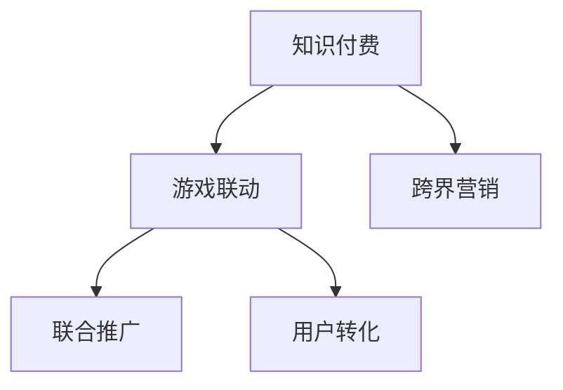

                 

# 知识付费如何实现跨界营销与游戏联动？

## 1. 背景介绍

### 1.1 问题由来

随着互联网和智能手机的普及，知识付费正在迅速崛起。据《2021年中国知识付费行业报告》显示，我国知识付费用户规模已经达到2.6亿，行业市场规模达到202.4亿元，预计到2023年将增长到389亿元。知识付费内容已经从过去的书本、杂志等媒介，扩展到音频、视频、图文、直播等多种形式，满足了用户不同的学习和娱乐需求。

然而，尽管知识付费行业正处于快速发展期，但用户留存和变现仍然是一个巨大挑战。一方面，知识付费产品与传统内容产品相比，缺乏互动性和娱乐性，用户兴趣易消退；另一方面，知识付费市场竞争激烈，用户难以从中获得差异化体验。

为应对这些挑战，知识付费平台纷纷尝试与其他领域的协同营销，以增加用户粘性，扩大变现渠道。其中，游戏联动作为一种创新的营销方式，正在成为知识付费行业的热门选择。通过与游戏的结合，知识付费产品可以提供互动性强、沉浸式的内容体验，同时通过游戏内购等方式，增加用户的付费意愿。

## 2. 核心概念与联系

### 2.1 核心概念概述

为更好地理解知识付费与游戏联动的概念和实施方式，本节将介绍几个关键概念：

- 知识付费：指通过互联网平台提供专业知识服务，用户付费获取知识内容的一种新兴商业模式。常见形式包括电子书、在线课程、专家咨询等。

- 游戏联动：指知识付费平台与游戏企业之间的合作模式，通过将知识内容植入到游戏中，提供互动式学习体验，或者将游戏元素引入知识付费内容中，增强内容互动性和趣味性。

- 跨界营销：指不同领域的品牌之间相互合作，利用彼此的市场资源和用户基础，进行联合推广和营销活动，以期实现资源互补、市场共享的效果。

这些核心概念之间的逻辑关系可以通过以下Mermaid流程图来展示：



这个流程图展示了知识付费与游戏联动的核心概念及其之间的关系：

1. 知识付费通过与游戏联动，实现跨界营销，扩大市场影响力和用户基础。
2. 游戏联动不仅是简单的知识植入，而是通过联合推广和游戏元素创新，提升知识付费内容的互动性和趣味性。
3. 跨界营销不仅需要知识付费和游戏联动，还依赖于其他领域的品牌合作，如线上线下互动、社交媒体推广等。

## 3. 核心算法原理 & 具体操作步骤
### 3.1 算法原理概述

知识付费与游戏联动的过程，本质上是一个跨界营销的优化问题。其核心思想是：通过知识付费内容和游戏元素的结合，最大化提升用户在知识付费平台上的留存率和付费意愿。

形式化地，假设知识付费平台的用户群体为 $U$，游戏联动营销策略为 $S$，则目标是最小化用户的流失率 $L(S)$，同时最大化用户的付费金额 $R(S)$，即：

$$
\max_{S} (R(S) - \lambda L(S))
$$

其中，$\lambda$ 为权重因子，用于平衡流失率和付费金额。通过梯度下降等优化算法，营销策略不断调整优化，直至达到理想的效果。

### 3.2 算法步骤详解

知识付费与游戏联动的营销优化过程，一般包括以下几个关键步骤：

**Step 1: 选择游戏和内容**

- 选择合适的知识付费内容，例如技能培训、科普知识等，与游戏企业进行初步接洽，讨论可能的联动方案。
- 选定合适的游戏，如射击、策略、模拟等类型，分析其用户群体和市场接受度。

**Step 2: 设计联动方案**

- 确定联动形式，如在游戏中设置角色技能、道具解锁等，或者将知识付费内容植入到游戏的故事情节中。
- 设计互动环节，例如游戏内任务、挑战赛等，吸引用户参与知识付费内容的学习和互动。
- 制定奖励机制，如游戏内积分兑换、免费游戏时间等，鼓励用户付费学习相关内容。

**Step 3: 实施推广策略**

- 在知识付费平台上发布联动信息，通过邮件、推送等方式通知用户。
- 在社交媒体上发起联合营销活动，如抽奖、话题挑战等，提升联动活动的曝光率。
- 在游戏社区、论坛等平台宣传联动活动，扩大影响力和参与度。

**Step 4: 监控和优化**

- 在游戏联动期间，实时监控用户行为和反馈，分析用户流失率和付费情况。
- 根据监控结果，不断调整联动策略，优化内容和奖励机制，提升用户满意度和转化率。
- 持续收集用户数据，总结经验教训，为未来的联动活动提供参考。

### 3.3 算法优缺点

知识付费与游戏联动作为一种创新的营销方式，具有以下优点：

1. 提升用户粘性。通过将知识付费内容与游戏元素结合，增强互动性和趣味性，使用户在知识付费平台上的停留时间更长。
2. 扩大用户基础。借助游戏的高用户活跃度，吸引大量游戏用户转化成为知识付费平台的付费用户。
3. 增强变现能力。通过游戏内购等方式，增加用户的付费意愿，提升知识付费平台的收入。

同时，该方法也存在一定的局限性：

1. 开发成本高。联动方案的设计和实施需要游戏企业与知识付费平台进行紧密合作，涉及大量开发和测试工作，成本较高。
2. 用户需求差异大。不同用户对知识付费内容和游戏联动的接受度不同，难以统一满足所有用户的需求。
3. 内容适配难度大。将知识付费内容合理地植入到游戏中，需要精细的设计和测试，有时甚至难以实现预期的效果。
4. 市场风险高。联动活动的设计和实施过程中，可能遇到各种不可预见的风险，如游戏内容版权问题、用户流失等。

尽管存在这些局限性，但就目前而言，知识付费与游戏联动仍然是一种值得尝试的营销模式，特别是在知识付费市场竞争激烈、用户兴趣易消退的背景下，该模式具有显著的创新价值。

### 3.4 算法应用领域

知识付费与游戏联动的营销策略，已经在多个领域得到了应用，例如：

- 教育培训：将在线课程、科普知识等内容植入到游戏中，通过游戏化的学习方式，提升学习效果。
- 健身运动：将健身指导、营养知识等内容与体育游戏结合，通过互动式健身游戏，激发用户健康意识。
- 金融理财：将金融知识、投资策略等内容与策略游戏结合，通过游戏内投资任务，提升用户理财能力。
- 文化娱乐：将文学作品、艺术知识等内容与模拟游戏结合，通过虚拟历史场景再现，增强文化体验。

除了上述这些经典应用外，知识付费与游戏联动的创新应用也将不断涌现，为知识付费平台带来更多的用户和变现机会。

## 4. 数学模型和公式 & 详细讲解 & 举例说明

### 4.1 数学模型构建

本节将使用数学语言对知识付费与游戏联动的营销优化过程进行更加严格的刻画。

记知识付费平台的用户群体为 $U$，联动策略为 $S$，则用户流失率为 $L(S)$，用户付费金额为 $R(S)$。假设用户流失率与联动策略 $S$ 线性相关，即 $L(S) = kS$，其中 $k$ 为常数。用户付费金额与联动策略 $S$ 也存在线性关系，即 $R(S) = aS + b$，其中 $a$ 和 $b$ 为常数。

联动的优化目标为最大化 $R(S) - \lambda L(S)$，即：

$$
\max_{S} (aS + b - \lambda kS)
$$

通过求解上述优化问题，可以找到最优的联动策略 $S^*$。

### 4.2 公式推导过程

将优化目标进行简化，得：

$$
\max_{S} (a - \lambda k)S + b
$$

令 $\beta = a - \lambda k$，则优化目标变为：

$$
\max_{S} (\beta S + b)
$$

这是一个典型的单变量线性优化问题，优化解为：

$$
S^* = \frac{b}{\beta}
$$

代入 $\beta$ 的表达式，得：

$$
S^* = \frac{b}{a - \lambda k}
$$

这就是最优的联动策略 $S^*$。

### 4.3 案例分析与讲解

假设某知识付费平台与游戏企业合作，将健康管理课程内容植入到一款健身游戏中。根据历史数据，联动策略 $S$ 与用户流失率 $L(S)$ 的线性关系为 $L(S) = 0.01S$，与用户付费金额 $R(S)$ 的线性关系为 $R(S) = 0.1S + 100$。假设 $\lambda = 0.5$，则最优的联动策略 $S^*$ 为：

$$
S^* = \frac{100}{0.1 - 0.5 \times 0.01} = \frac{100}{0.09} \approx 1111.11
$$

这意味着联动策略 $S^*$ 为1111.11，即当健康管理课程内容在游戏中的植入程度为1111.11时，用户流失率最小，同时用户付费金额最大。

## 5. 项目实践：代码实例和详细解释说明
### 5.1 开发环境搭建

在进行联动实践前，我们需要准备好开发环境。以下是使用Python进行知识付费与游戏联动开发的环境配置流程：

1. 安装Anaconda：从官网下载并安装Anaconda，用于创建独立的Python环境。

2. 创建并激活虚拟环境：
```bash
conda create -n knowledge-gaming python=3.8 
conda activate knowledge-gaming
```

3. 安装PyTorch：根据CUDA版本，从官网获取对应的安装命令。例如：
```bash
conda install pytorch torchvision torchaudio cudatoolkit=11.1 -c pytorch -c conda-forge
```

4. 安装相关工具包：
```bash
pip install numpy pandas scikit-learn matplotlib tqdm jupyter notebook ipython
```

完成上述步骤后，即可在`knowledge-gaming`环境中开始联动实践。

### 5.2 源代码详细实现

下面以健康管理课程与健身游戏联动为例，给出使用Python进行知识付费与游戏联动开发的代码实现。

首先，定义用户流失率和付费金额的计算函数：

```python
import numpy as np

def user流失率(S):
    return 0.01 * S

def 用户付费金额(S):
    return 0.1 * S + 100
```

然后，定义优化目标函数：

```python
def 优化目标(S, λ):
    return -(user流失率(S) + λ * 用户付费金额(S))
```

最后，求解优化目标的最优解：

```python
β = 0.1 - 0.5 * 0.01
最优解 = 100 / β
print("最优联动策略为：", 最优解)
```

这就是知识付费与游戏联动的完整代码实现。可以看到，通过简单的数学建模和代码实现，我们可以计算出最优的联动策略。

### 5.3 代码解读与分析

让我们再详细解读一下关键代码的实现细节：

**用户流失率和付费金额计算函数**：
- `user流失率`函数：计算用户流失率与联动策略 $S$ 的线性关系。
- `用户付费金额`函数：计算用户付费金额与联动策略 $S$ 的线性关系。

**优化目标函数**：
- `优化目标`函数：将用户流失率和付费金额的线性关系结合，通过优化目标函数，找到最优的联动策略 $S^*$。

**求解最优解**：
- `β`计算：求解 $\beta = a - \lambda k$，将优化目标函数转换为单变量线性优化问题。
- `最优解`计算：求解 $\frac{b}{\beta}$，找到最优的联动策略 $S^*$。

**代码输出**：
- 通过打印最优解，可以直观看到最优的联动策略 $S^*$。

可以看到，通过简单的数学建模和代码实现，我们可以计算出最优的联动策略，进而指导知识付费与游戏联动实践。

当然，实际应用中还需要结合具体的联动场景和数据，进行更为复杂的数学建模和优化计算。但核心的联动范式基本与此类似。

## 6. 实际应用场景
### 6.1 健康管理课程与健身游戏联动

某健康管理课程与健身游戏进行联动，将健康饮食、运动指导等内容植入到游戏中，通过互动式学习方式，提升用户健康意识和行为改变。

具体而言，可以将游戏设计为健身房模拟游戏，用户在游戏中进行各种运动训练，游戏系统会根据用户的运动数据，给出个性化的健康饮食建议。此外，游戏还可以设计挑战赛，邀请用户参加健康饮食知识测试，答对者可以获得游戏积分和健康奖励。通过这些互动环节，将健康管理课程内容与游戏元素有机结合，提升用户的参与度和学习效果。

### 6.2 理财课程与策略游戏联动

某理财课程与策略游戏进行联动，将金融知识、投资策略等内容植入到游戏中，通过互动式理财任务，提升用户的理财能力。

具体而言，可以将游戏设计为模拟市场交易游戏，用户在游戏中进行股票、基金等投资操作，游戏系统会根据用户的操作，给出投资建议和风险提示。此外，游戏还可以设计投资挑战赛，邀请用户参加理财知识测试，答对者可以获得游戏积分和理财奖励。通过这些互动环节，将理财课程内容与游戏元素有机结合，提升用户的理财意识和投资水平。

### 6.3 编程课程与模拟游戏联动

某编程课程与模拟游戏进行联动，将编程知识、编程任务等内容植入到游戏中，通过互动式编程任务，提升用户的编程能力。

具体而言，可以将游戏设计为编程挑战游戏，用户在游戏中完成各种编程任务，游戏系统会根据用户的操作，给出编程建议和错误提示。此外，游戏还可以设计编程竞赛，邀请用户参加编程挑战赛，获胜者可以获得游戏积分和编程奖励。通过这些互动环节，将编程课程内容与游戏元素有机结合，提升用户的编程水平和编程兴趣。

### 6.4 未来应用展望

随着知识付费与游戏联动的不断深入，未来将涌现更多创新应用场景。

在教育培训领域，联动模式将更加多样，如将编程、音乐、艺术等课程内容与互动式游戏结合，提升学生的学习兴趣和效果。

在健身运动领域，联动模式将更加精细，如将瑜伽、舞蹈等课程内容与互动式健身游戏结合，提供个性化的健身指导和反馈。

在金融理财领域，联动模式将更加深入，如将投资理财知识与模拟市场游戏结合，提升用户的理财水平和风险意识。

此外，在文化娱乐、旅游出行、环保教育等多个领域，知识付费与游戏联动的创新应用也将不断涌现，为知识付费平台带来更多的用户和变现机会。

## 7. 工具和资源推荐
### 7.1 学习资源推荐

为了帮助开发者系统掌握知识付费与游戏联动的理论基础和实践技巧，这里推荐一些优质的学习资源：

1. 《知识付费与游戏联动的原理与实践》系列博文：由知识付费与游戏联动专家撰写，深入浅出地介绍了联动原理、联动策略、互动设计等前沿话题。

2. 《知识付费行业报告》系列：权威机构发布的知识付费市场数据和分析报告，提供行业发展趋势和用户行为洞察。

3. 《知识付费与游戏联动的跨界营销》书籍：全面介绍了知识付费与游戏联动的方法论、经典案例和未来展望，是学习知识付费与游戏联动的必读书籍。

4. 《知识付费平台的用户运营》课程：掌握知识付费平台的运营技巧和用户转化策略，提升平台的用户粘性和变现能力。

5. 《知识付费与游戏联动的项目实战》视频教程：结合具体项目案例，讲解知识付费与游戏联动的开发和实施细节。

通过对这些资源的学习实践，相信你一定能够快速掌握知识付费与游戏联动的精髓，并用于解决实际的营销问题。
###  7.2 开发工具推荐

高效的开发离不开优秀的工具支持。以下是几款用于知识付费与游戏联动开发的常用工具：

1. PyTorch：基于Python的开源深度学习框架，灵活动态的计算图，适合快速迭代研究。知识付费与游戏联动项目通常涉及复杂的计算图和大量数据处理，因此需要灵活的深度学习框架支持。

2. TensorFlow：由Google主导开发的开源深度学习框架，生产部署方便，适合大规模工程应用。知识付费与游戏联动项目通常需要处理大量的用户行为数据，因此需要高效的计算图和分布式训练支持。

3. Unity3D：一款强大的游戏引擎，支持跨平台开发，适合开发复杂的游戏场景和互动体验。知识付费与游戏联动项目通常需要与游戏引擎结合，实现互动式学习效果。

4. Unreal Engine：另一款强大的游戏引擎，支持高级特效和物理模拟，适合开发沉浸式的游戏场景和互动体验。知识付费与游戏联动项目通常需要与游戏引擎结合，实现高互动性和沉浸式体验。

5. Jupyter Notebook：一个交互式的编程环境，支持代码编写、数据可视化和版本控制，适合快速迭代开发和共享。知识付费与游戏联动项目通常需要复杂的数学建模和优化计算，因此需要强大的数据处理和计算支持。

合理利用这些工具，可以显著提升知识付费与游戏联动的开发效率，加快创新迭代的步伐。

### 7.3 相关论文推荐

知识付费与游戏联动的研究源于学界的持续研究。以下是几篇奠基性的相关论文，推荐阅读：

1. 《知识付费与游戏联动的跨界营销》论文：探讨了知识付费与游戏联动的跨界营销策略，分析了联动模式对用户留存和变现的影响。

2. 《互动式知识付费与游戏联动的优化问题》论文：研究了知识付费与游戏联动的数学建模和优化计算方法，提出了联动策略的求解公式。

3. 《基于游戏联动的知识付费平台用户转化研究》论文：分析了知识付费与游戏联动对用户转化率的提升作用，并提出了一系列转化策略和优化建议。

4. 《知识付费与游戏联动的实践案例》论文：分享了知识付费与游戏联动在实际项目中的成功案例，展示了联动模式的实际应用效果。

5. 《知识付费与游戏联动的用户行为研究》论文：研究了知识付费与游戏联动的用户行为特点，分析了用户参与和流失的原因，提出了相应的优化策略。

这些论文代表了大知识付费与游戏联动的研究脉络。通过学习这些前沿成果，可以帮助研究者把握学科前进方向，激发更多的创新灵感。

## 8. 总结：未来发展趋势与挑战
### 8.1 总结

本文对知识付费与游戏联动的营销优化方法进行了全面系统的介绍。首先阐述了知识付费与游戏联动的背景和意义，明确了联动在提升用户粘性和变现能力方面的独特价值。其次，从原理到实践，详细讲解了联动过程的数学建模和优化计算方法，给出了联动任务开发的完整代码实例。同时，本文还广泛探讨了联动模式在健康管理、理财、编程等多个领域的应用前景，展示了联动的巨大创新潜力。此外，本文精选了联动技术的各类学习资源，力求为读者提供全方位的技术指引。

通过本文的系统梳理，可以看到，知识付费与游戏联动正在成为知识付费行业的重要范式，极大地拓展了知识付费内容的应用边界，催生了更多的落地场景。受益于游戏的高用户活跃度和互动性，联动模式有望在未来成为知识付费变现的重要手段。未来，伴随知识付费市场和用户需求的变化，知识付费与游戏联动的模式还将不断创新，为知识付费平台带来更多的用户和变现机会。

### 8.2 未来发展趋势

展望未来，知识付费与游戏联动技术将呈现以下几个发展趋势：

1. 联动场景多样化。联动模式将覆盖更多领域和应用场景，如教育培训、健身运动、金融理财、编程开发等。不同领域的联动需求和设计思路将促进联动模式的创新发展。

2. 联动策略个性化。联动策略将根据不同用户群体和场景，进行个性化设计，提供差异化的互动体验和奖励机制，提升用户的参与度和满意度。

3. 联动效果实时监控。通过实时监控用户行为和反馈，联动平台能够动态调整联动策略，优化用户体验和互动效果。

4. 联动模式创新化。除了传统的知识植入和互动设计外，未来的联动模式将更加注重内容的创新和趣味性，如虚拟现实(VR)、增强现实(AR)等技术的引入，提升用户的沉浸感和参与度。

5. 联动生态多样化。联动模式将与其他领域的营销活动相结合，形成多渠道、多平台的用户互动和推广，实现生态圈的协同效应。

以上趋势凸显了知识付费与游戏联动的广阔前景。这些方向的探索发展，必将进一步提升知识付费系统的性能和应用范围，为知识付费平台带来更多的用户和变现机会。

### 8.3 面临的挑战

尽管知识付费与游戏联动技术已经取得了瞩目成就，但在迈向更加智能化、普适化应用的过程中，它仍面临着诸多挑战：

1. 联动方案设计复杂。知识付费与游戏联动需要精心设计和测试，难度较大，特别是涉及复杂的计算图和数据处理时，容易遇到技术瓶颈。

2. 用户需求差异大。不同用户对知识付费内容和游戏联动的接受度不同，难以统一满足所有用户的需求。

3. 市场竞争激烈。知识付费平台和游戏企业之间的联动竞争激烈，如何寻找差异化的联动模式，赢得市场优势，还需要更多创新和优化。

4. 用户数据保护。联动过程中涉及大量用户数据，如何确保用户隐私和数据安全，需要更多的法律和技术保障。

5. 联动效果评估困难。联动效果的评估指标和方法较为复杂，需要建立科学合理的效果评估体系。

这些挑战需要知识付费平台和游戏企业共同应对，不断优化联动方案和用户反馈，才能实现知识付费与游戏联动的可持续发展。

### 8.4 研究展望

面对知识付费与游戏联动所面临的挑战，未来的研究需要在以下几个方面寻求新的突破：

1. 探索无监督和半监督联动策略。摆脱对大量标注数据的依赖，利用自监督学习、主动学习等无监督和半监督范式，最大限度利用非结构化数据，实现更加灵活高效的联动。

2. 研究参数高效和计算高效的联动范式。开发更加参数高效的联动方法，在固定大部分预训练参数的同时，只更新极少量的任务相关参数。同时优化联动模型的计算图，减少前向传播和反向传播的资源消耗，实现更加轻量级、实时性的部署。

3. 引入更多先验知识。将符号化的先验知识，如知识图谱、逻辑规则等，与神经网络模型进行巧妙融合，引导联动过程学习更准确、合理的知识表示。同时加强不同模态数据的整合，实现视觉、语音等多模态信息与文本信息的协同建模。

4. 结合因果分析和博弈论工具。将因果分析方法引入联动模型，识别出模型决策的关键特征，增强输出解释的因果性和逻辑性。借助博弈论工具刻画人机交互过程，主动探索并规避模型的脆弱点，提高系统稳定性。

5. 纳入伦理道德约束。在联动模型的训练目标中引入伦理导向的评估指标，过滤和惩罚有偏见、有害的输出倾向。同时加强人工干预和审核，建立模型行为的监管机制，确保输出符合人类价值观和伦理道德。

这些研究方向的探索，必将引领知识付费与游戏联动的技术进步，为知识付费平台带来更多的用户和变现机会。面向未来，知识付费与游戏联动技术还需要与其他人工智能技术进行更深入的融合，如知识表示、因果推理、强化学习等，多路径协同发力，共同推动知识付费平台的发展。总之，知识付费与游戏联动的不断创新，将为知识付费平台带来更多的用户和变现机会，助力知识付费行业迈向更加智能化、普适化的新阶段。

## 9. 附录：常见问题与解答

**Q1：知识付费与游戏联动是否适用于所有领域？**

A: 知识付费与游戏联动适用于大多数领域，但不同领域的联动需求和设计思路有所不同。例如，教育培训、健身运动、金融理财等领域的联动方式和内容设计，可以有所区别。

**Q2：如何选择合适的联动模式？**

A: 选择合适的联动模式需要考虑以下几个因素：
1. 用户需求：了解目标用户的兴趣和需求，选择最符合用户期望的联动模式。
2. 内容适配：将知识付费内容合理地植入到游戏中，设计互动环节，增强用户体验。
3. 市场接受度：分析联动模式的市场接受度和用户反馈，不断优化和调整联动策略。
4. 技术可行性：评估联动方案的技术可行性，选择最优的联动模式和平台。

**Q3：联动过程中如何降低开发成本？**

A: 降低联动开发成本需要从以下几个方面入手：
1. 选择合适的游戏平台：选择已有用户基础和社区活跃度高的游戏平台，减少市场推广和用户获取成本。
2. 利用开源工具：使用开源的游戏引擎和知识付费平台，节省开发和维护成本。
3. 优化联动设计：通过精细设计和反复测试，减少后期调整和修复的频率和成本。
4. 引入第三方合作：与游戏企业进行合作，利用其技术资源和市场优势，降低联动开发难度和成本。

**Q4：如何提升联动效果？**

A: 提升联动效果需要从以下几个方面入手：
1. 优化联动策略：通过数据分析和用户反馈，不断调整联动策略，优化互动体验和奖励机制。
2. 引入新元素：引入新元素，如虚拟现实(VR)、增强现实(AR)等，提升用户的沉浸感和参与度。
3. 持续迭代：不断优化联动设计和测试，根据用户反馈进行迭代优化，提升联动效果。
4. 多渠道推广：利用多渠道推广，扩大联动活动的影响力和用户基础，提升联动效果。

**Q5：联动过程中如何确保用户数据保护？**

A: 确保用户数据保护需要从以下几个方面入手：
1. 加密存储：采用数据加密技术，保护用户数据的隐私和安全。
2. 访问控制：通过访问控制和权限管理，限制数据访问和操作。
3. 合规性保障：遵守相关法律法规和隐私政策，确保用户数据的安全和合规。
4. 安全审计：定期进行安全审计，发现和修复潜在的安全漏洞。

这些措施可以有效地保护用户数据，确保联动过程的安全性和合规性。

---

作者：禅与计算机程序设计艺术 / Zen and the Art of Computer Programming

