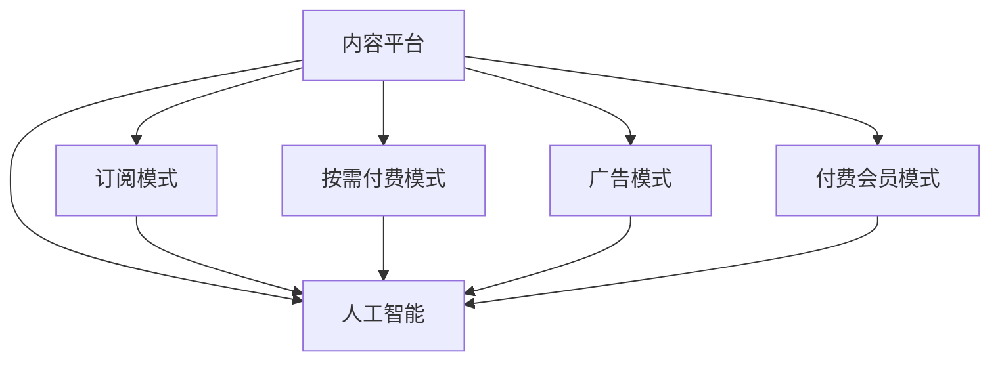

                 

# 知识付费行业的未来趋势分析

## 1. 背景介绍

### 1.1 问题由来
随着信息爆炸和知识经济时代的到来，人们对于知识获取的方式和质量提出了更高的要求。知识付费作为一种新兴的商业模式，顺应了这一趋势，成为连接知识生产者和消费者的新途径。然而，知识付费行业尚处于起步阶段，面临诸多挑战和不确定性，亟需对未来趋势进行深入分析和探讨。

### 1.2 问题核心关键点
知识付费行业的核心在于通过优质的内容吸引用户付费，并在平台上形成稳定的用户生态。为了确保这一目标的实现，行业需要在内容质量、用户体验、商业变现、技术架构等方面进行全面优化。本文将从多个维度对知识付费行业的未来趋势进行详细分析，旨在为行业从业者和投资者提供有价值的参考。

## 2. 核心概念与联系

### 2.1 核心概念概述

1. **知识付费**：指用户为获取知识、技能、信息等内容而支付费用的服务模式。内容可以是视频课程、音频讲座、图文教材、咨询服务等。

2. **内容平台**：指提供知识付费服务的在线平台，如喜马拉雅、得到、Coursera等。

3. **订阅模式**：用户按月或按年支付固定费用，享受平台上的全部或部分内容。

4. **按需付费模式**：用户每次消费时按内容价格支付费用，购买单次课程或文章。

5. **广告模式**：平台通过展示广告或推荐系统，从第三方获取流量分成或广告收入。

6. **付费会员模式**：平台提供多层次会员服务，包括免费版、付费版、企业版等，满足不同用户的需求。

7. **人工智能**：利用机器学习和自然语言处理技术，为用户提供智能推荐、自动化客服、内容生成等增值服务。

这些核心概念之间存在着密切的联系。例如，订阅模式和按需付费模式都是用户支付知识费用的方式，而内容平台则是这些模式得以实施的媒介。人工智能技术的应用，则进一步提升了平台的运营效率和用户体验。

### 2.2 核心概念原理和架构的 Mermaid 流程图



## 3. 核心算法原理 & 具体操作步骤

### 3.1 算法原理概述

知识付费行业的运营核心是内容生产和消费的匹配。为了优化这一过程，平台通常会使用推荐算法来为用户推荐适合其兴趣和需求的内容。推荐算法通过分析用户的行为数据和内容特征，预测用户对不同内容的偏好，从而实现个性化推荐。

### 3.2 算法步骤详解

1. **数据采集**：平台收集用户的浏览历史、点击记录、评分反馈等行为数据，同时获取内容的相关特征，如标题、标签、摘要等。

2. **用户画像构建**：通过机器学习算法，如协同过滤、内容基推荐等，分析用户行为数据，构建用户画像，描述用户的兴趣偏好。

3. **内容画像构建**：对内容的各个特征进行编码和标准化处理，构建内容画像，描述内容的属性和价值。

4. **相似度计算**：计算用户画像与内容画像之间的相似度，确定用户对不同内容的偏好程度。

5. **推荐列表生成**：根据相似度排序，生成个性化的推荐列表，提供给用户。

6. **反馈循环**：收集用户对推荐内容的反馈，包括点击率、播放时长、评分等，进一步优化推荐算法。

### 3.3 算法优缺点

**优点**：
- 提高用户满意度，增加用户粘性，提升平台流量。
- 减少用户发现好内容的难度，提高内容消费效率。
- 通过个性化推荐，最大化平台内容价值。

**缺点**：
- 对数据质量要求高，数据采集和处理成本较高。
- 推荐算法模型的复杂度较大，需要持续优化和调参。
- 存在冷启动问题，新用户和内容难以被推荐系统发现。

### 3.4 算法应用领域

推荐算法在知识付费行业中具有广泛的应用，主要体现在以下几个方面：
- 个性化推荐：根据用户行为数据，推荐相关课程或文章。
- 用户画像构建：分析用户行为，描述用户兴趣，支持精准营销。
- 内容匹配：匹配用户和内容，优化内容分发。
- 广告投放：分析用户兴趣，精准投放广告，提升广告效果。
- 流量分析：分析用户流量来源和行为路径，优化平台运营策略。

## 4. 数学模型和公式 & 详细讲解 & 举例说明

### 4.1 数学模型构建

知识付费平台的推荐算法通常基于协同过滤和内容基推荐相结合的模型。假设用户集合为 $U$，内容集合为 $I$，用户的兴趣向量为 $x_u$，内容的特征向量为 $x_i$，用户与内容的评分矩阵为 $R$。

协同过滤模型可以表示为：
$$
x_u = \sum_{v \in U, v \neq u} \alpha_v x_v
$$

其中，$\alpha_v$ 为相似度权重，$x_v$ 为其他用户对内容的评分向量。

内容基推荐模型可以表示为：
$$
x_u = \sum_{i \in I} w_i x_i
$$

其中，$w_i$ 为内容特征的权重，$x_i$ 为内容的特征向量。

### 4.2 公式推导过程

协同过滤模型的推导过程如下：
假设用户 $u$ 和 $v$ 对内容 $i$ 的评分分别为 $r_{ui}$ 和 $r_{vi}$，则用户 $u$ 和 $v$ 之间的相似度可以表示为：
$$
\alpha_{uv} = \frac{\sum_{i \in I} (r_{ui} - \bar{r}_u) \cdot (r_{vi} - \bar{r}_v)}{\sqrt{\sum_{i \in I} (r_{ui} - \bar{r}_u)^2} \cdot \sqrt{\sum_{i \in I} (r_{vi} - \bar{r}_v)^2}}
$$

其中，$\bar{r}_u$ 和 $\bar{r}_v$ 分别为用户 $u$ 和 $v$ 的平均评分。

用户 $u$ 对内容 $i$ 的评分预测为：
$$
\hat{r}_{ui} = \sum_{v \in U, v \neq u} \alpha_{uv} r_{vi}
$$

### 4.3 案例分析与讲解

以得到平台为例，其推荐算法主要包括协同过滤和内容基推荐两部分。在用户画像构建方面，得到通过协同过滤算法分析用户行为数据，描述用户兴趣，用于个性化推荐和精准营销。在内容匹配方面，得到采用内容基推荐算法，根据内容特征匹配用户需求，提升内容发现效率。

## 5. 项目实践：代码实例和详细解释说明

### 5.1 开发环境搭建

知识付费平台的推荐系统开发通常需要在高性能计算环境中进行，例如使用Python、Scikit-learn、TensorFlow等工具。以下是搭建开发环境的详细步骤：

1. **安装Python**：使用Anaconda创建虚拟环境，并安装Python 3.8。

2. **安装Scikit-learn**：使用pip安装Scikit-learn，支持协同过滤算法。

3. **安装TensorFlow**：使用pip安装TensorFlow，支持内容基推荐算法。

4. **安装其他库**：安装pandas、numpy、matplotlib等库，支持数据处理和可视化。

### 5.2 源代码详细实现

以下是推荐系统开发的Python代码实现示例：

```python
import pandas as pd
from sklearn.neighbors import NearestNeighbors

# 加载数据
data = pd.read_csv('user_behavior.csv')

# 数据预处理
user_ids = data['user_id'].unique()
content_ids = data['content_id'].unique()
user_interest = data.groupby('user_id').mean()
content_features = data.groupby('content_id').mean()

# 用户画像构建
user_interest = pd.get_dummies(user_interest, columns=['label'])
user_interest.columns = ['user_{}_{}'.format(user_id, label) for user_id, label in user_interest.columns]

# 内容画像构建
content_features.columns = ['content_{}_{}'.format(content_id, feature) for content_id, feature in content_features.columns]

# 相似度计算
user_interest_nn = NearestNeighbors(n_neighbors=10, algorithm='brute')
user_interest_nn.fit(user_interest)
user_interest_distances, user_interest_indices = user_interest_nn.kneighbors(user_interest)
user_interest_similarities = 1 - user_interest_distances

# 推荐列表生成
user_interest_index = user_interest.index
user_interest_index = user_interest_index[1:]  # 排除自身

for user_id in user_interest_index:
    similar_users = user_interest_similarities[user_id].argsort()[::-1]
    recommended_contents = []
    for similar_user in similar_users:
        if similar_user != user_id:
            recommended_contents.extend([content_id for content_id in content_features.index])
            break
    print(user_id, recommended_contents)
```

### 5.3 代码解读与分析

代码中，我们使用了Pandas库对用户行为数据进行加载和预处理。利用Scikit-learn库的NearestNeighbors算法，计算用户画像的相似度。最终，通过遍历用户，生成推荐列表。

### 5.4 运行结果展示

运行上述代码后，输出推荐列表，展示了每个用户对内容的相关推荐。这些推荐内容将用于个性化推荐页面，提升用户体验和平台粘性。

## 6. 实际应用场景

### 6.1 教育培训

知识付费在教育培训领域具有巨大的市场潜力。平台可以提供各种在线课程，涵盖编程、设计、管理等多个领域，帮助用户掌握新技能，提升职业竞争力。

平台通过个性化推荐，根据用户的学习进度和兴趣，推荐适合的课程内容。同时，平台还可以提供虚拟教室、互动问答等增值服务，增强用户体验和互动性。

### 6.2 职业技能提升

知识付费平台在职业技能提升方面也有广泛应用。例如，职场人士可以通过平台学习专业技能，如数据分析、项目管理、商务英语等，提升自身综合素质。

平台根据用户的工作需求和职业发展目标，推荐相关课程和资料，并提供实时答疑、专家讲座等支持，帮助用户快速掌握新技能。

### 6.3 娱乐休闲

知识付费平台在娱乐休闲领域也有诸多应用。例如，喜马拉雅、蜻蜓FM等音频平台通过个性化推荐，为用户提供优质的音频内容，如故事、访谈、脱口秀等，满足用户的娱乐需求。

平台还可以根据用户的兴趣爱好，推荐相关的播客、电台、音乐等，提升用户体验和满意度。

### 6.4 未来应用展望

未来，知识付费平台将进一步拓展应用场景，增强与用户的互动和粘性，提升平台的商业价值和社会价值。以下是几个未来应用展望：

1. **虚拟现实**：利用VR/AR技术，提供沉浸式学习体验，增强用户参与感和学习效果。

2. **智能助理**：通过自然语言处理技术，实现与用户的自然对话，提供定制化内容推荐和互动服务。

3. **个性化订阅**：根据用户的学习进度和反馈，动态调整订阅内容和频率，提升用户满意度。

4. **跨平台协同**：实现不同平台之间的数据互通和内容共享，提升用户跨平台的便捷性。

5. **知识社区**：构建知识社区，让用户分享学习心得、交流经验，增强平台的用户粘性和互动性。

## 7. 工具和资源推荐

### 7.1 学习资源推荐

1. **《机器学习实战》**：介绍机器学习和深度学习的基础知识，适合入门学习。

2. **Coursera和edX**：提供丰富的在线课程，涵盖数据科学、机器学习、计算机视觉等多个领域。

3. **Kaggle**：数据科学竞赛平台，提供大量真实数据和挑战赛，提升实战能力。

4. **Stack Overflow**：程序员问答社区，提供丰富的技术问题和解答，快速解决学习中的问题。

5. **GitHub**：代码托管平台，提供开源项目和代码库，参考和学习优秀的项目实现。

### 7.2 开发工具推荐

1. **Python**：通用编程语言，适合开发推荐系统和数据分析工具。

2. **Scikit-learn**：机器学习库，支持协同过滤算法和特征工程。

3. **TensorFlow**：深度学习框架，支持内容基推荐和神经网络模型。

4. **Kibana**：数据可视化工具，支持图表和报表的展示。

5. **Prometheus**：监控系统，实时采集和分析推荐系统的各项指标，保证系统稳定运行。

### 7.3 相关论文推荐

1. **《协同过滤算法及其在推荐系统中的应用》**：介绍协同过滤算法的原理和应用，适合入门学习。

2. **《基于深度学习的推荐系统》**：介绍深度学习在推荐系统中的应用，涵盖神经网络、卷积网络、循环网络等多个模型。

3. **《推荐系统的最新进展》**：综述推荐系统的发展历程和最新研究，适合深入学习。

4. **《大规模推荐系统架构设计》**：介绍大规模推荐系统的架构设计，适合了解推荐系统的实践应用。

## 8. 总结：未来发展趋势与挑战

### 8.1 研究成果总结

本文对知识付费行业的未来趋势进行了详细分析，主要结论如下：
- 知识付费行业面临诸多挑战和不确定性，需要从多个维度进行优化。
- 推荐算法是知识付费平台的核心技术，其优化和提升将极大提升用户体验和平台价值。

### 8.2 未来发展趋势

1. **技术创新**：推荐算法将向更加智能、高效的方向发展，提升用户体验和平台竞争力。

2. **内容创新**：平台将提供更加丰富、多样化的内容，满足用户的多样化需求。

3. **用户互动**：通过智能助理和知识社区等形式，增强用户互动和粘性。

4. **商业变现**：平台将探索更多商业变现模式，实现多元化的收入来源。

### 8.3 面临的挑战

1. **数据隐私**：用户数据隐私保护将是知识付费平台需要重点关注的问题。

2. **技术复杂性**：推荐算法的优化和实现需要高度专业化的技术支持。

3. **内容质量**：平台需要持续投入优质内容制作，提升平台内容质量。

4. **用户体验**：用户需求和行为不断变化，平台需要不断优化用户体验。

5. **商业环境**：知识付费行业竞争激烈，平台需要持续创新和优化，才能在竞争中脱颖而出。

### 8.4 研究展望

未来，知识付费平台需要在以下几个方面进行持续研究：
- **数据隐私保护**：研究如何在保障用户隐私的前提下，利用数据进行精准推荐。

- **技术创新**：探索新的推荐算法和模型，提升推荐效果和用户满意度。

- **内容创新**：创新内容形式和形式，提升平台内容多样性和趣味性。

- **用户体验优化**：通过智能助理和知识社区等形式，增强用户互动和粘性。

- **商业变现模式**：探索更多商业变现模式，实现多元化的收入来源。

## 9. 附录：常见问题与解答

**Q1: 知识付费平台如何提升用户粘性？**

A: 提升用户粘性需要从多个维度进行优化：
- **个性化推荐**：通过精准推荐内容，提升用户满意度和参与度。
- **优质内容**：提供高质量、多样化、具有价值的内容，吸引用户持续消费。
- **用户互动**：通过智能助理和知识社区等形式，增强用户互动和粘性。

**Q2: 推荐算法的优缺点是什么？**

A: 推荐算法的优点包括：
- **提高用户满意度**：通过精准推荐内容，提升用户满意度和平台粘性。
- **减少内容发现难度**：降低用户发现优质内容的难度，提高内容消费效率。

缺点包括：
- **数据要求高**：对数据质量要求较高，数据采集和处理成本较高。
- **算法复杂**：推荐算法模型的复杂度较大，需要持续优化和调参。
- **冷启动问题**：新用户和内容难以被推荐系统发现。

**Q3: 知识付费平台如何实现跨平台协同？**

A: 实现跨平台协同需要从多个维度进行优化：
- **数据互通**：通过API接口和数据存储技术，实现不同平台之间的数据互通。
- **内容共享**：共享优质的内容资源，提升用户的跨平台体验。
- **用户互动**：通过知识社区等形式，增强用户跨平台的互动和粘性。

**Q4: 知识付费平台如何保护用户隐私？**

A: 保护用户隐私需要从多个维度进行优化：
- **数据匿名化**：在数据采集和处理过程中，对用户数据进行匿名化处理，保护用户隐私。
- **用户控制**：赋予用户数据控制权，让用户决定是否分享数据。
- **合规性**：遵守相关法律法规，确保平台运营的合法合规性。

