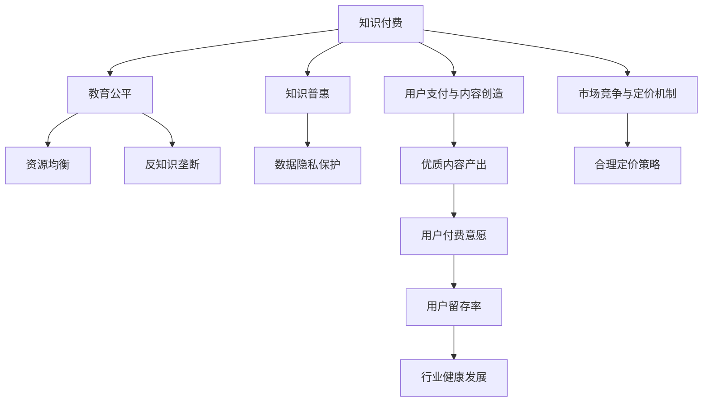

                 

## 1. 背景介绍

在数字化浪潮的推动下，知识付费模式已逐步成为新时期互联网经济的增长点，并成为推动社会知识创造、传播和应用的重要手段。然而，知识付费产业目前仍面临着教育公平和知识普惠的挑战，这不仅关乎知识付费的长远发展，更直接影响着社会公平与信息公平的实现。本文旨在深入探讨知识付费在教育公平和知识普惠中的角色，提出相应的政策建议，以期推动知识付费的健康、有序、可持续发展。

## 2. 核心概念与联系

### 2.1 核心概念概述

1. **知识付费（Knowledge-based Subscription）**：用户为获得特定知识内容、专业服务或技能培训而支付费用的模式。知识付费主要体现在在线课程、文章订阅、咨询问答、软件使用、数据分析服务等各个方面。
2. **教育公平（Educational Equity）**：确保不同社会经济背景的个体享有平等的教育资源和机会，为未来的职业发展和社会参与打下相同的基础。
3. **知识普惠（Knowledge Inclusion）**：通过多种方式普及知识，使社会大众能够公平、便捷地获取各种知识和信息。
4. **数据隐私（Data Privacy）**：在收集、存储、处理、传输和使用用户数据的过程中，保障用户的个人信息不受侵犯。
5. **知识垄断（Knowledge Monopoly）**：特定机构或个人通过知识拥有权，在市场中获得不公平的优势，限制其他竞争者进入市场，损害消费者的利益。

### 2.2 核心概念原理和架构的 Mermaid 流程图



此图展示了知识付费与教育公平、知识普惠之间的关系及其相互作用。其中，知识付费是核心概念，通过优质内容的产出和合理的定价策略，吸引用户付费，提升用户留存率，促进行业健康发展。教育公平和知识普惠作为次级概念，直接影响知识付费的公平性、普及性和可持续性。

## 3. 核心算法原理 & 具体操作步骤

### 3.1 算法原理概述

知识付费平台的核心算法主要包括内容推荐算法和定价算法，旨在为用户提供个性化内容推荐和公平定价。

#### 3.1.1 内容推荐算法
内容推荐算法旨在根据用户的兴趣、行为、社交关系等多维度特征，推荐用户可能感兴趣的知识内容。推荐算法通常基于协同过滤、基于内容的推荐、矩阵分解、深度学习等多种技术。

#### 3.1.2 定价算法
定价算法需要考虑到内容价值、市场接受度、用户支付意愿等因素，科学合理地确定内容的付费标准。定价算法通常包括动态定价、套餐定价、免费试用、奖励机制等多种策略。

### 3.2 算法步骤详解

#### 3.2.1 内容推荐算法步骤
1. **数据采集**：从用户的浏览历史、搜索行为、购买记录、评分评论等多个维度，采集用户数据。
2. **特征提取**：使用文本分析、特征工程等方法，提取用户特征。
3. **模型训练**：训练推荐模型，通常使用矩阵分解、协同过滤、深度学习等技术。
4. **推荐展示**：根据用户特征和模型预测，向用户推荐个性化内容。

#### 3.2.2 定价算法步骤
1. **内容定价**：根据内容生产成本、目标用户群体、市场竞争状况等因素，初步设定内容价格。
2. **需求预测**：使用统计模型或机器学习算法，预测市场对不同价格内容的需求量。
3. **动态调整**：根据用户反馈和市场需求变化，动态调整内容定价策略。

### 3.3 算法优缺点

#### 3.3.1 内容推荐算法的优缺点
**优点**：
- 个性化强：能够根据用户兴趣和行为推荐最适合的内容。
- 覆盖广：推荐算法覆盖的内容丰富多样，满足用户多元化需求。
- 实时性高：算法可以实时更新，及时响应用户需求变化。

**缺点**：
- 数据隐私：需要大量用户数据，可能侵犯用户隐私。
- 算法黑盒：推荐算法通常难以解释，用户难以理解其推荐逻辑。
- 过度拟合：推荐算法容易过度拟合用户历史行为，导致推荐偏差。

#### 3.3.2 定价算法的优缺点
**优点**：
- 公平定价：根据市场供需关系和用户支付意愿合理定价。
- 动态调整：能够根据市场变化动态调整价格策略。
- 用户留存：通过灵活的定价策略提升用户留存率和平台黏性。

**缺点**：
- 市场波动：定价算法受市场因素影响较大，定价策略可能波动较大。
- 用户感知：用户对价格的感知可能存在偏差，导致定价策略失效。
- 竞争压力：高定价可能引发激烈的市场竞争，损害平台利益。

### 3.4 算法应用领域

知识付费的算法广泛应用于在线教育、软件开发、咨询服务、数据分析等领域。例如，Coursera、Udemy、知乎等知识付费平台广泛采用内容推荐算法和定价算法，为用户提供个性化学习体验和公平定价服务。

## 4. 数学模型和公式 & 详细讲解

### 4.1 数学模型构建

以协同过滤算法为例，假设用户集合为 $U$，内容集合为 $I$，用户对内容的评分矩阵为 $R$，用户 $u_i$ 对内容 $i_j$ 的评分 $r_{i_j}$。协同过滤算法分为基于用户的协同过滤和基于物品的协同过滤。

#### 4.1.1 基于用户的协同过滤
该方法寻找与用户 $u_i$ 相似的其他用户 $u_k$，通过用户 $u_k$ 对内容 $i_j$ 的评分来预测用户 $u_i$ 的评分。

$$ R_{u_i,i_j} \approx \sum_{u_k \in N(u_i)}\frac{R_{u_k,i_j}}{\sqrt{\sum_{i_k \in I}R_{u_k,i_k}^2}}\frac{1}{\sqrt{\sum_{j_k \in I}R_{u_k,j_k}^2}} $$

其中 $N(u_i)$ 表示与用户 $u_i$ 相似的其他用户集合。

#### 4.1.2 基于物品的协同过滤
该方法通过物品 $i_j$ 与其他物品 $i_k$ 的评分相似性，来预测物品 $i_j$ 的评分。

$$ R_{u_i,i_j} \approx \sum_{i_k \in I} \frac{R_{u_k,i_k}}{\sqrt{\sum_{i_k \in I}R_{u_k,i_k}^2}} \frac{1}{\sqrt{\sum_{i_k \in I}R_{u_k,i_k}^2}} $$

### 4.2 公式推导过程

以上公式描述了协同过滤算法的核心原理。基于用户和基于物品的协同过滤算法，均通过相似性度量，利用已知评分预测未知评分。

### 4.3 案例分析与讲解

假设用户 $u_i$ 对内容 $i_j$ 的评分 $r_{i_j}$ 为5，系统通过协同过滤算法，找到与之相似的其他用户 $u_k$，并利用 $u_k$ 对内容 $i_j$ 的评分预测用户 $u_i$ 的评分。

若用户 $u_k$ 对内容 $i_j$ 的评分为3，对内容 $i_k$ 的评分为4，则系统预测用户 $u_i$ 对内容 $i_j$ 的评分为：

$$ R_{u_i,i_j} \approx \frac{3}{\sqrt{3^2+4^2}}\frac{1}{\sqrt{3^2+4^2}} = 0.38 $$

## 5. 项目实践：代码实例和详细解释说明

### 5.1 开发环境搭建

#### 5.1.1 环境依赖
- Python 3.8
- Numpy
- Scipy
- Pandas
- Scikit-learn
- Scikit-learn

#### 5.1.2 环境配置
```bash
pip install numpy scipy pandas scikit-learn
```

### 5.2 源代码详细实现

#### 5.2.1 基于用户的协同过滤算法实现
```python
import numpy as np
from sklearn.metrics.pairwise import cosine_similarity

def collaborative_filtering_user_based(train_matrix, user_idx, item_idx, num_neighbors=10):
    similarity_matrix = cosine_similarity(train_matrix)
    user_similarity = similarity_matrix[user_idx, :]
    user_neighbors = np.argsort(user_similarity)[1:num_neighbors + 1]
    user_neighbors = user_similarity[user_neighbors]
    user_neighbors = user_neighbors / np.sqrt(np.sum(user_similarity**2))
    predicted_score = train_matrix[user_neighbors, item_idx] * user_neighbors
    predicted_score /= np.sqrt(np.sum(predicted_score**2))
    return predicted_score
```

#### 5.2.2 基于物品的协同过滤算法实现
```python
import numpy as np
from sklearn.metrics.pairwise import cosine_similarity

def collaborative_filtering_item_based(train_matrix, user_idx, item_idx, num_neighbors=10):
    similarity_matrix = cosine_similarity(train_matrix)
    item_similarity = similarity_matrix[:, item_idx]
    item_neighbors = np.argsort(item_similarity)[1:num_neighbors + 1]
    item_neighbors = item_similarity[item_neighbors]
    item_neighbors = item_neighbors / np.sqrt(np.sum(item_similarity**2))
    predicted_score = train_matrix[user_idx, item_neighbors] * item_neighbors
    predicted_score /= np.sqrt(np.sum(predicted_score**2))
    return predicted_score
```

### 5.3 代码解读与分析

#### 5.3.1 基于用户的协同过滤算法
该算法使用余弦相似度计算用户间的相似性，选取相似性最高的前 $num\_neighbors$ 个邻居用户，并计算预测评分。

#### 5.3.2 基于物品的协同过滤算法
该算法使用余弦相似度计算物品间的相似性，选取相似性最高的前 $num\_neighbors$ 个物品，并计算预测评分。

## 6. 实际应用场景

### 6.1 教育公平与知识普惠

知识付费在教育公平和知识普惠中扮演着重要角色。通过知识付费，用户能够随时随地获取高质量的在线教育资源，打破地理、经济、时间等限制，享受平等的教育机会。

例如，Coursera通过订阅课程，使得全球用户可以接触到顶尖大学的课程资源，极大促进了教育公平。但同时也面临数据隐私、内容垄断等挑战，需要相关政策和监管机制的保障。

### 6.2 用户需求与市场变化

知识付费平台需要密切关注用户需求和市场变化，通过个性化推荐和动态定价，提升用户满意度和留存率，防止知识垄断。例如，知乎通过订阅、打赏、付费问答等多种形式，满足用户多样化的知识需求。

### 6.3 数据隐私与伦理保护

知识付费平台需要严格遵守数据隐私法规，保障用户数据的安全和隐私，防止数据泄露和滥用。例如，Coursera通过数据加密、访问控制等技术，保护用户隐私。

## 7. 工具和资源推荐

### 7.1 学习资源推荐

1. **《推荐系统实战》**：该书详细介绍了推荐系统的算法、模型、评估及应用，是推荐算法学习的权威指南。
2. **《数据挖掘导论》**：该书系统介绍了数据挖掘的基本概念、技术和应用，是数据科学学习的经典教材。
3. **《Python推荐系统开发》**：该书通过Python代码实例，介绍了推荐系统的实践方法，适合动手练习。
4. **《深度学习与数据挖掘》**：该书结合深度学习技术和数据挖掘方法，涵盖推荐系统的多种算法，适合综合学习。

### 7.2 开发工具推荐

1. **PyTorch**：用于深度学习模型的构建和训练，支持动态图和静态图，适用于推荐算法的开发和优化。
2. **TensorFlow**：用于深度学习模型的构建和训练，支持分布式计算和自动微分，适用于复杂推荐模型的开发。
3. **Apache Spark**：用于大数据处理和分析，支持分布式存储和计算，适用于大规模推荐系统的实现。
4. **Keras**：用于深度学习模型的构建和训练，支持快速搭建和训练推荐算法。

### 7.3 相关论文推荐

1. **《推荐系统评估》**：详细介绍了推荐系统的评估方法和指标，如平均绝对误差、均方根误差等。
2. **《协同过滤算法综述》**：全面回顾了协同过滤算法的各类变种，如基于用户的协同过滤、基于物品的协同过滤、混合协同过滤等。
3. **《深度学习在推荐系统中的应用》**：介绍了深度学习技术在推荐系统中的应用，如神经协同过滤、深度矩阵分解等。

## 8. 总结：未来发展趋势与挑战

### 8.1 研究成果总结

知识付费在教育公平和知识普惠中发挥着重要作用，但也面临数据隐私、知识垄断等挑战。未来的研究需要在算法优化、政策监管、市场调控等方面寻求新的突破。

### 8.2 未来发展趋势

1. **数据隐私保护**：知识付费平台需要加强数据隐私保护，防止数据滥用和泄露。
2. **反知识垄断**：通过公平竞争和市场监管，防止知识垄断现象的发生。
3. **个性化推荐**：通过改进算法和优化模型，提升个性化推荐的效果，增强用户体验。
4. **动态定价**：根据市场变化和用户反馈，动态调整定价策略，保障平台和用户利益。

### 8.3 面临的挑战

1. **数据隐私问题**：用户数据的安全和隐私保护是知识付费平台面临的重要挑战。
2. **知识垄断现象**：部分平台通过知识垄断，占据市场优势，损害用户和竞争者的利益。
3. **算法复杂性**：推荐算法复杂度较高，需要投入大量资源进行研究和优化。
4. **市场波动影响**：市场波动可能对定价策略产生较大影响，导致平台收入不稳定。

### 8.4 研究展望

未来的研究需要关注以下几个方面：
1. **隐私保护技术**：发展更为安全的隐私保护技术，如联邦学习、差分隐私等。
2. **推荐算法优化**：开发高效、可解释的推荐算法，提升推荐效果。
3. **市场监管机制**：制定公平、合理的市场监管政策，防止知识垄断。
4. **动态定价策略**：建立动态定价模型，平衡用户和平台的利益。

## 9. 附录：常见问题与解答

### 9.1 知识付费平台如何平衡用户需求和市场变化？

**答**：知识付费平台需要密切关注市场趋势和用户反馈，通过动态调整定价策略和个性化推荐，平衡用户需求和市场变化。例如，可以引入用户反馈机制，及时调整内容和定价，提升用户满意度和留存率。

### 9.2 如何保障知识付费平台的数据隐私？

**答**：知识付费平台需要采取多项措施保障用户数据隐私，如数据加密、访问控制、匿名化处理等。同时，平台需要严格遵守数据隐私法规，确保用户数据的安全和隐私。

### 9.3 如何处理知识付费平台的数据垄断问题？

**答**：知识付费平台需要建立公平、透明的市场竞争机制，防止知识垄断现象的发生。监管机构应加强市场监管，防止平台通过知识垄断获取不公平竞争优势。

### 9.4 知识付费平台如何应对市场波动带来的影响？

**答**：知识付费平台可以通过动态定价策略和市场细分，应对市场波动带来的影响。例如，可以根据用户行为和需求，进行精准定价和市场细分，提升平台收入的稳定性和可持续性。

---

作者：禅与计算机程序设计艺术 / Zen and the Art of Computer Programming

