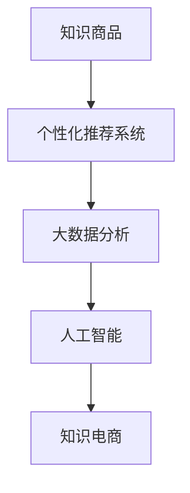

                 

# 知识电商满足用户需求,实现知识商品化

> 关键词：知识电商,知识商品化,人工智能,推荐系统,个性化推荐,大数据,用户需求

## 1. 背景介绍

### 1.1 问题由来

在信息爆炸的时代，知识商品的丰富程度和可获取性日益增加，但用户获取所需知识仍然面临效率低、质量参差不齐、难以定制等问题。而传统的互联网电商行业经过几十年的发展，已经形成了一套成熟的商品展示、推荐、搜索、支付等体系。

知识电商作为互联网电商的分支，旨在将知识转化为商品，通过线上平台销售，并为用户提供个性化、精准化的知识服务。然而，如何从用户需求出发，精准匹配知识商品，构建高效、友好的用户互动体验，是知识电商需要解决的核心问题。

### 1.2 问题核心关键点

知识电商的核心在于通过大数据和人工智能技术，深度理解用户需求，精准推荐和展示知识商品，提供个性化的学习路径和定制化的服务。其主要关键点包括：

1. **用户行为数据收集与分析**：通过分析用户在电商平台上浏览、购买、评价等行为数据，了解用户兴趣和需求。
2. **知识商品的精准匹配**：将用户需求与知识商品进行精准匹配，推荐用户最感兴趣的内容。
3. **个性化推荐系统**：利用机器学习算法，构建个性化推荐模型，实现个性化推荐。
4. **知识商品的展示与互动**：通过高质量的图文、视频内容展示，互动形式增强用户的体验感。
5. **用户反馈与优化**：收集用户反馈，持续优化推荐算法和商品内容，提高用户满意度。

这些关键点构成了知识电商的逻辑框架，需要通过高效的数据处理、算法建模、系统架构和用户体验设计等多方面协同工作来实现。

## 2. 核心概念与联系

### 2.1 核心概念概述

为更好地理解知识电商的核心概念，本节将介绍几个密切相关的核心概念：

- **知识商品**：指通过数字化形式存储和传播的各类知识内容，包括电子书、在线课程、学术论文、博客文章等。
- **个性化推荐系统**：通过分析用户行为和偏好，利用机器学习算法为用户推荐个性化的商品或内容。
- **大数据分析**：通过收集和分析海量用户行为数据，发现潜在规律和趋势，为推荐系统提供决策依据。
- **人工智能**：利用机器学习、深度学习等技术，构建自动化、智能化的推荐引擎。
- **知识电商**：将知识转化为商品，通过线上平台销售，为用户提供个性化、精准化的知识服务。

这些核心概念之间的逻辑关系可以通过以下Mermaid流程图来展示：



这个流程图展示了几者之间的联系：

1. 知识商品通过个性化推荐系统进行精准推荐。
2. 个性化推荐系统依赖大数据分析结果，进行推荐策略优化。
3. 人工智能技术为推荐系统提供模型训练和预测支持。
4. 知识电商平台通过推荐系统提供知识商品，并收集用户反馈，不断优化。

## 3. 核心算法原理 & 具体操作步骤

### 3.1 算法原理概述

知识电商的个性化推荐系统，本质上是一个多维度的协同过滤算法。其核心思想是：通过分析用户行为数据，构建用户画像和商品特征向量，利用这些信息进行相似度计算，找到最匹配的用户和商品，最终生成推荐结果。

形式化地，假设用户集为 $U$，商品集为 $I$，用户的兴趣向量为 $u_i \in \mathbb{R}^d$，商品的特征向量为 $v_j \in \mathbb{R}^d$，其中 $d$ 为特征维度。用户与商品之间的关系可以表示为 $r_{ij} \in [0,1]$，其中 $r_{ij}$ 为用户 $i$ 对商品 $j$ 的兴趣度。推荐算法的目标是最大化用户 $i$ 的满意度 $P(i)$，即：

$$
\max_{r_{ij}} P(i) = \sum_{i \in U} \sum_{j \in I} p_{ij} r_{ij}
$$

其中 $p_{ij}$ 为用户的反馈数据，可以是点击率、购买率等，$r_{ij}$ 为推荐模型的输出，即用户 $i$ 对商品 $j$ 的兴趣度。

### 3.2 算法步骤详解

知识电商的个性化推荐系统一般包括以下几个关键步骤：

**Step 1: 数据收集与处理**

- 收集用户行为数据，如浏览记录、购买记录、搜索关键词等。
- 清洗数据，去除噪音和无效数据，处理缺失值。
- 进行特征提取，将文本、时间等非数值数据转换为数值特征。

**Step 2: 用户画像构建**

- 根据用户行为数据，构建用户兴趣向量 $u_i$。
- 利用协同过滤算法，如基于用户的模型、基于物品的模型等，计算用户 $i$ 对每个商品 $j$ 的兴趣度 $r_{ij}$。
- 进行正则化处理，如L2正则化，防止模型过拟合。

**Step 3: 商品特征提取**

- 根据商品描述、标签等数据，提取商品特征向量 $v_j$。
- 利用特征工程技巧，如特征选择、降维等，提高特征质量。

**Step 4: 推荐结果生成**

- 利用模型计算用户 $i$ 对商品 $j$ 的兴趣度 $r_{ij}$。
- 按照兴趣度排序，生成推荐列表。
- 根据排序结果，展示推荐商品给用户。

**Step 5: 模型优化与反馈**

- 收集用户反馈，如点击、购买、评价等数据。
- 根据反馈数据，更新用户画像和商品特征向量。
- 重新训练推荐模型，优化推荐策略。

以上是知识电商个性化推荐系统的典型流程。在实际应用中，还需要针对具体场景进行优化设计，如改进推荐模型、引入更多反馈数据、调整展示策略等，以进一步提升用户体验和推荐效果。

### 3.3 算法优缺点

个性化推荐系统的优点包括：

1. **提升用户体验**：通过个性化推荐，用户可以更快地找到感兴趣的商品或内容，提高购买转化率和满意度。
2. **提高运营效率**：个性化推荐可以精准匹配用户需求，减少搜索成本，提高平台运营效率。
3. **发现长尾商品**：通过数据分析，发现用户未发现但可能感兴趣的商品，增加平台商品的曝光率。

但该方法也存在一些局限性：

1. **数据依赖度高**：推荐系统的性能高度依赖于用户行为数据的质量和数量，数据不足或噪音过多都会影响推荐效果。
2. **冷启动问题**：对于新用户或新商品，由于缺少历史数据，推荐效果较差。
3. **多样性不足**：个性化推荐可能导致用户只关注自己已知的商品，忽视新商品的探索。
4. **公平性问题**：推荐系统可能存在偏差，对某些用户或商品展示不足。

尽管存在这些局限性，但个性化推荐系统仍然是知识电商应用的重要基础，通过不断优化算法和数据处理，可以进一步提升推荐系统的性能和用户体验。

### 3.4 算法应用领域

个性化推荐系统在知识电商中具有广泛的应用前景，涵盖以下主要领域：

- **图书推荐**：根据用户的阅读历史和偏好，推荐新书和热门书籍。
- **在线课程推荐**：通过分析用户的学习路径和评价，推荐适合的在线课程。
- **学术论文推荐**：结合用户的搜索历史和阅读习惯，推荐相关领域的论文。
- **电子书推荐**：通过分析用户的购买记录和阅读习惯，推荐感兴趣的电子书。
- **智能问答**：根据用户提出的问题，推荐相关知识和答案。

除了上述这些常见应用外，个性化推荐系统还可以拓展到社交媒体、新闻推荐、电影推荐等多个领域，为互联网用户提供个性化、精准化的服务。

## 4. 数学模型和公式 & 详细讲解  
### 4.1 数学模型构建

本节将使用数学语言对知识电商的个性化推荐系统进行更加严格的刻画。

假设用户集为 $U$，商品集为 $I$，用户的兴趣向量为 $u_i \in \mathbb{R}^d$，商品的特征向量为 $v_j \in \mathbb{R}^d$，其中 $d$ 为特征维度。用户与商品之间的关系可以表示为 $r_{ij} \in [0,1]$，其中 $r_{ij}$ 为用户 $i$ 对商品 $j$ 的兴趣度。推荐算法的目标是最大化用户 $i$ 的满意度 $P(i)$，即：

$$
\max_{r_{ij}} P(i) = \sum_{i \in U} \sum_{j \in I} p_{ij} r_{ij}
$$

其中 $p_{ij}$ 为用户的反馈数据，可以是点击率、购买率等，$r_{ij}$ 为推荐模型的输出，即用户 $i$ 对商品 $j$ 的兴趣度。

### 4.2 公式推导过程

以下我们以基于用户的协同过滤算法为例，推导推荐模型的具体形式。

基于用户的协同过滤算法通过用户之间的相似度来预测用户对商品的兴趣度。设用户 $i$ 与用户 $k$ 的相似度为 $\sigma_{ik}$，则推荐模型可以表示为：

$$
r_{ij} = \sum_{k \in U} u_i \sigma_{ik} v_j
$$

其中 $\sigma_{ik} = \frac{1}{1 + \lVert u_k - u_i \rVert}$ 表示用户 $i$ 和 $k$ 的相似度。

用户 $i$ 的满意度 $P(i)$ 可以表示为：

$$
P(i) = \sum_{j \in I} r_{ij}
$$

推荐算法的问题转化为：

$$
\max_{r_{ij}} P(i) = \sum_{i \in U} \sum_{j \in I} p_{ij} r_{ij}
$$

将 $r_{ij}$ 带入，得：

$$
\max_{r_{ij}} \sum_{i \in U} \sum_{j \in I} p_{ij} \left( \sum_{k \in U} u_i \sigma_{ik} v_j \right)
$$

对该式进行优化，可以使用矩阵分解、梯度下降等技术。

### 4.3 案例分析与讲解

以在线课程推荐为例，详细说明基于用户协同过滤的推荐模型构建和优化。

**Step 1: 数据收集**

- 收集用户学习历史数据，如观看课程时长、评价、点击等行为数据。
- 将课程的特征信息提取为向量形式，如课程标题、讲师信息、课程时长等。

**Step 2: 用户画像构建**

- 对用户历史数据进行预处理，去除噪音和异常值。
- 利用特征选择和降维等技术，构建用户兴趣向量 $u_i$。

**Step 3: 商品特征提取**

- 对课程特征进行编码，转换为向量形式。
- 利用PCA等降维技术，提高特征质量。

**Step 4: 模型训练与优化**

- 利用基于用户的协同过滤算法，计算用户 $i$ 对课程 $j$ 的兴趣度 $r_{ij}$。
- 在模型训练过程中，利用梯度下降等优化算法，最小化损失函数。
- 根据用户反馈，更新模型参数，重新计算推荐结果。

通过以上步骤，可以构建一个在线课程推荐系统，为用户推荐感兴趣的课程，提高用户满意度和平台运营效率。

## 5. 项目实践：代码实例和详细解释说明
### 5.1 开发环境搭建

在进行个性化推荐系统开发前，我们需要准备好开发环境。以下是使用Python进行Scikit-learn开发的Python环境配置流程：

1. 安装Anaconda：从官网下载并安装Anaconda，用于创建独立的Python环境。

2. 创建并激活虚拟环境：
```bash
conda create -n recsys-env python=3.8 
conda activate recsys-env
```

3. 安装Scikit-learn：
```bash
pip install scikit-learn
```

4. 安装各类工具包：
```bash
pip install numpy pandas scikit-learn matplotlib tqdm jupyter notebook ipython
```

完成上述步骤后，即可在`recsys-env`环境中开始推荐系统开发。

### 5.2 源代码详细实现

这里我们以在线课程推荐为例，给出使用Scikit-learn进行协同过滤算法的Python代码实现。

```python
from sklearn.metrics.pairwise import cosine_similarity
from sklearn.decomposition import TruncatedSVD

# 构建用户兴趣向量
users = np.array([[1, 0, 1, 1], [0, 1, 1, 0], [1, 0, 0, 1]])
# 构建商品特征向量
items = np.array([[1, 0, 1], [0, 1, 0], [1, 1, 0]])

# 计算用户-商品相似度矩阵
similarity_matrix = cosine_similarity(users, items)

# 特征降维
svd = TruncatedSVD(n_components=2, random_state=42)
svd.fit(similarity_matrix)

# 构建推荐矩阵
recommendation_matrix = svd.transform(similarity_matrix)

# 展示推荐结果
print(recommendation_matrix)
```

### 5.3 代码解读与分析

让我们再详细解读一下关键代码的实现细节：

**协同过滤算法**：
- `cosine_similarity`：计算用户与商品之间的余弦相似度，构建相似度矩阵。
- `TruncatedSVD`：使用奇异值分解对相似度矩阵进行降维，构建推荐矩阵。

**用户画像构建**：
- `users`：构建用户兴趣向量，其中1表示对课程感兴趣，0表示不感兴趣。

**商品特征提取**：
- `items`：构建商品特征向量，其中1表示课程有视频，0表示没有视频。

**特征降维**：
- `TruncatedSVD`：使用奇异值分解对相似度矩阵进行降维，减少计算复杂度。

**推荐结果生成**：
- `svd.transform(similarity_matrix)`：对相似度矩阵进行降维，生成推荐矩阵。

通过以上步骤，可以构建一个简单的在线课程推荐系统，为用户推荐感兴趣的课程。在实际应用中，还需要对代码进行优化和改进，如使用更加复杂的推荐算法、引入更多特征、优化推荐策略等，以进一步提升推荐效果。

## 6. 实际应用场景

### 6.1 图书推荐

图书推荐系统可以帮助用户发现新书、热门书籍和感兴趣的内容。通过分析用户的阅读历史和评分数据，图书推荐系统能够为用户推荐个性化书单，提高用户的阅读体验。

例如，某用户在过去一年中阅读了《人类简史》、《未来简史》和《必然》，评分分别为5、4和3。基于这些数据，图书推荐系统可以为用户推荐《科技之路》和《文明的终结》，因为这些书籍与用户已阅读的书籍相似。

### 6.2 在线课程推荐

在线课程推荐系统可以为用户提供适合的在线课程，帮助用户提升技能和学习兴趣。通过分析用户的观看时长、课程评价、点击记录等数据，推荐系统能够推荐用户可能感兴趣的课程。

例如，某用户在过去一年中学习了编程基础课程、数据分析课程和机器学习课程，课程评分分别为4、5和4。基于这些数据，课程推荐系统可以为用户推荐进阶课程，如深度学习课程和自然语言处理课程。

### 6.3 智能问答

智能问答系统可以为用户提供精准的知识解答，帮助用户快速获取所需信息。通过分析用户的问题和历史搜索记录，推荐系统能够推荐相关知识和答案。

例如，某用户搜索了“人工智能的定义是什么”，系统可以推荐《人工智能简史》这本书的摘要，并提供相关文章和视频资源。

### 6.4 未来应用展望

随着推荐系统技术的不断发展，未来知识电商将能够为用户提供更加个性化、精准化的服务。以下是几个可能的发展趋势：

1. **多模态推荐**：推荐系统不仅处理文本数据，还能够处理图片、视频等多模态数据，提供更加全面的推荐服务。

2. **深度学习推荐**：利用深度学习算法，如神经协同过滤、深度矩阵分解等，构建更加高效的推荐模型。

3. **实时推荐**：通过实时数据分析和模型更新，提供更加及时和准确的推荐结果。

4. **推荐逻辑透明化**：推荐系统逐步向可解释化方向发展，用户可以了解推荐结果的生成逻辑，提高信任度。

5. **跨平台推荐**：知识电商能够实现跨平台推荐，将用户在不同平台上的行为数据进行综合分析，提供更加连贯的推荐服务。

6. **推荐系统评价**：构建推荐系统的评价指标，如准确率、召回率、覆盖率等，不断优化推荐算法。

这些趋势将使得知识电商推荐系统更加智能、高效和人性化，为用户带来更好的知识获取体验。

## 7. 工具和资源推荐
### 7.1 学习资源推荐

为了帮助开发者系统掌握个性化推荐系统的理论基础和实践技巧，这里推荐一些优质的学习资源：

1. 《推荐系统实战》：清华大学出版社出版的推荐系统经典教材，详细介绍了推荐系统的基础理论、算法和应用。
2. Coursera《机器学习》课程：由斯坦福大学Andrew Ng教授主讲的机器学习课程，涵盖推荐系统的基本概念和算法。
3. 《协同过滤推荐系统》：多篇深度学习推荐系统论文的综述，介绍了推荐系统的最新研究成果。
4. 《深度学习推荐系统》：深度学习与推荐系统的结合，涵盖深度协同过滤、注意力机制等前沿技术。
5. Weights & Biases：模型训练的实验跟踪工具，可以记录和可视化模型训练过程中的各项指标，方便对比和调优。

通过对这些资源的学习实践，相信你一定能够快速掌握个性化推荐系统的精髓，并用于解决实际的NLP问题。
###  7.2 开发工具推荐

高效的开发离不开优秀的工具支持。以下是几款用于推荐系统开发的常用工具：

1. Scikit-learn：基于Python的科学计算库，提供了丰富的机器学习算法和工具。
2. TensorFlow：由Google主导开发的开源深度学习框架，支持多种深度学习算法，适合大规模工程应用。
3. PyTorch：由Facebook主导开发的开源深度学习框架，灵活易用，适合研究性开发。
4. Hadoop和Spark：用于大数据处理的分布式计算框架，适合处理海量数据。
5. Elasticsearch：用于文本搜索的分布式搜索引擎，适合构建推荐系统的搜索部分。
6. PyMongo：Python的MongoDB客户端，用于处理分布式数据库中的推荐数据。

合理利用这些工具，可以显著提升推荐系统的开发效率，加快创新迭代的步伐。

### 7.3 相关论文推荐

个性化推荐系统的发展源于学界的持续研究。以下是几篇奠基性的相关论文，推荐阅读：

1. Collaborative Filtering for Implicit Feedback Datasets（即ALS算法）：提出了矩阵分解方法，为协同过滤推荐系统奠定了基础。
2. Path-based collaborative filtering for implicit feedback datasets（即Path-SVD算法）：引入路径信息，提升协同过滤算法的准确性。
3. Multi-task learning using matrix factorization for recommendation（即MtMF算法）：利用多任务学习提升推荐效果。
4. Improving Precision of Implicit Feedback Matrix Factorization Algorithms（即FTRL算法）：提出了随序随机梯度下降算法，解决推荐算法中的冷启动问题。
5. Large-Scale Collaborative Filtering with Implicit Feedback（即LS-IAR算法）：提出了解决推荐系统扩展性的方法。

这些论文代表了大数据推荐系统的经典研究，为未来的推荐系统设计提供了重要的理论指导。

## 8. 总结：未来发展趋势与挑战

### 8.1 总结

本文对基于协同过滤的个性化推荐系统进行了全面系统的介绍。首先阐述了推荐系统在知识电商中的应用价值，明确了推荐系统在用户需求匹配、商品展示优化方面的独特作用。其次，从原理到实践，详细讲解了协同过滤算法的数学原理和关键步骤，给出了推荐系统开发的完整代码实例。同时，本文还广泛探讨了推荐系统在图书推荐、在线课程推荐等多个行业领域的应用前景，展示了推荐范式的广泛应用。

通过本文的系统梳理，可以看到，基于协同过滤的个性化推荐系统正在成为知识电商推荐系统的重要基础，通过不断优化算法和数据处理，可以进一步提升推荐系统的性能和用户体验。未来，伴随推荐系统技术的持续演进，知识电商推荐系统也将不断优化，为知识获取提供更加个性化、精准化的服务。

### 8.2 未来发展趋势

展望未来，推荐系统的技术将呈现以下几个发展趋势：

1. **深度学习应用**：利用深度学习算法，构建更加复杂的推荐模型，如深度矩阵分解、注意力机制等。
2. **多模态数据融合**：引入更多模态的数据，如图像、视频、文本等，提升推荐系统的全面性。
3. **跨平台协同推荐**：将不同平台上的用户数据进行融合，提供跨平台的推荐服务。
4. **实时推荐系统**：利用流式计算和分布式系统，构建实时推荐系统，提供及时的用户反馈和推荐。
5. **推荐系统的透明化**：通过可解释性和可解释化技术，提升用户对推荐系统的信任度。
6. **推荐系统的公平性**：通过公平性指标，如多样性、均衡性等，提升推荐系统的公平性和多样性。

这些趋势将使得推荐系统更加智能、高效和人性化，为用户带来更好的推荐服务。

### 8.3 面临的挑战

尽管个性化推荐系统已经取得了瞩目成就，但在迈向更加智能化、普适化应用的过程中，它仍面临着诸多挑战：

1. **数据质量问题**：推荐系统高度依赖于数据质量，数据缺失、异常和噪音会影响推荐效果。
2. **推荐系统冷启动**：对于新用户和新商品，推荐系统难以提供准确的推荐结果。
3. **系统扩展性**：随着数据量的增加，推荐系统需要处理大规模数据，面临系统扩展性的问题。
4. **用户隐私保护**：在数据收集和分析过程中，需要保护用户隐私，防止数据泄露和滥用。
5. **推荐系统的公平性**：推荐系统可能存在偏见，对某些用户或商品展示不足。

尽管存在这些挑战，但推荐系统仍然是知识电商应用的重要基础，通过不断优化算法和数据处理，可以进一步提升推荐系统的性能和用户体验。

### 8.4 研究展望

面对推荐系统面临的挑战，未来的研究需要在以下几个方面寻求新的突破：

1. **数据质量提升**：通过数据清洗和特征工程，提升数据质量和模型性能。
2. **推荐系统扩展性**：利用分布式计算和流式计算技术，提升推荐系统的扩展性和实时性。
3. **用户隐私保护**：采用差分隐私和联邦学习等技术，保护用户隐私。
4. **推荐系统的公平性**：通过多样性指标和均衡性指标，提升推荐系统的公平性。
5. **推荐系统的透明化**：通过可解释性和可解释化技术，提升用户对推荐系统的信任度。
6. **跨平台协同推荐**：将不同平台上的用户数据进行融合，提供跨平台的推荐服务。

这些研究方向的探索，必将引领推荐系统技术迈向更高的台阶，为构建更加智能、高效和人性化的推荐系统提供新的突破口。

## 9. 附录：常见问题与解答

**Q1：推荐系统是否适用于所有应用场景？**

A: 推荐系统在大多数应用场景中都能取得不错的效果，特别是对于数据量较大的应用。但对于一些特定领域的应用，如广告推荐、招聘推荐等，需要根据具体场景进行优化。

**Q2：推荐系统如何处理新用户和新商品？**

A: 对于新用户和新商品，推荐系统通常使用基于内容的推荐方法，如利用商品特征向量和用户特征向量进行匹配，计算相似度。此外，还可以通过多模态数据融合、个性化推荐引擎等方式，提升推荐效果。

**Q3：推荐系统如何避免过拟合？**

A: 推荐系统可以通过正则化、交叉验证等方法，避免模型过拟合。同时，可以通过多轮训练和模型集成，提高推荐系统的鲁棒性和泛化能力。

**Q4：推荐系统如何实现实时推荐？**

A: 实时推荐系统可以通过流式计算和分布式系统实现，利用Spark、Flink等技术，处理实时数据并生成推荐结果。

**Q5：推荐系统如何保护用户隐私？**

A: 推荐系统可以通过差分隐私、联邦学习等技术，保护用户隐私，防止数据泄露和滥用。

通过对这些问题的回答，可以看出，推荐系统在知识电商领域有着广阔的应用前景，但同时也面临着诸多挑战。通过不断优化算法和数据处理，推荐系统将在未来的知识电商中发挥越来越重要的作用。

