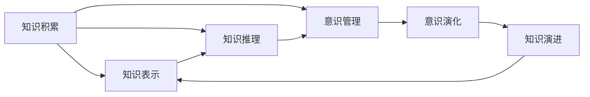

                 

# 知识积累在意识管理中的作用

## 1. 背景介绍

### 1.1 问题由来
现代信息技术的发展，尤其是深度学习和人工智能技术的普及，使得信息处理和决策过程变得更加智能化和高效化。然而，在人工智能的驱动下，知识积累和意识管理成为了其中的重要组成部分。这一现象在学术界和工业界引发了广泛的讨论和研究，即：知识积累如何影响意识管理，以及意识管理在人工智能系统中的作用机制。

### 1.2 问题核心关键点
知识积累在意识管理中的作用涉及多个关键点：

1. **知识表示**：如何将知识有效地表示并存储，使其能够在决策过程中被高效利用。
2. **意识认知**：在人工智能系统中，如何实现对知识的自动认知和管理。
3. **意识演进**：知识积累如何影响意识系统的发展和演化。
4. **应用场景**：知识积累和意识管理在实际应用中的具体案例和效果。
5. **挑战与解决方案**：面对知识更新和意识管理中的挑战，如何找到有效的解决方案。

### 1.3 问题研究意义
研究知识积累在意识管理中的作用，对于推动人工智能技术的进步和普及，具有重要意义：

1. **提升决策准确性**：通过合理管理知识积累，提高人工智能系统的决策准确性和稳定性。
2. **增强系统智能**：知识积累是人工智能系统智能化的基石，能够帮助系统更好地理解和处理复杂问题。
3. **促进应用落地**：知识积累和意识管理的研究成果，可以加速人工智能技术在各行业的落地应用。
4. **推动学术发展**：为人工智能领域的研究提供新的方向和方法，促进学术界的创新发展。

## 2. 核心概念与联系

### 2.1 核心概念概述

为更好地理解知识积累在意识管理中的作用，本节将介绍几个关键概念：

- **知识积累**：指在人工智能系统中，通过各种方式（如数据存储、模型训练、推理过程等）积累的知识和经验。
- **意识管理**：指在人工智能系统中，对知识积累的管理和控制，包括知识的表示、存储、检索、更新和应用。
- **知识表示**：将知识转换为机器可以理解和处理的形式，如符号表示、向量表示、知识图谱等。
- **知识推理**：基于已有的知识库，进行逻辑推理和推理计算，以支持决策和预测。
- **知识演进**：知识库在不断更新和完善的过程中，逐步变得更加丰富和准确。
- **意识演化**：随着知识库的演进，意识系统的智能水平和应用能力逐步提升。

这些核心概念之间存在密切联系，共同构成了人工智能系统中知识积累和意识管理的框架。

### 2.2 核心概念原理和架构的 Mermaid 流程图



此流程图展示了知识积累、知识表示、知识推理、意识管理、意识演化、知识演进之间的关系。其中，知识积累和知识表示是基础，知识推理和意识管理是核心，意识演化和知识演进是结果。

## 3. 核心算法原理 & 具体操作步骤

### 3.1 算法原理概述

在人工智能系统中，知识积累和意识管理主要通过以下步骤实现：

1. **知识获取**：通过传感器、网络爬虫、人工标注等方式，获取相关领域的知识数据。
2. **知识存储**：将获取的知识数据存储在知识库中，供后续处理使用。
3. **知识表示**：将知识转换为机器可理解的形式，如符号表示、向量表示、知识图谱等。
4. **知识推理**：基于已有的知识库，进行逻辑推理和推理计算，以支持决策和预测。
5. **意识管理**：对知识库进行管理和控制，包括知识的表示、存储、检索、更新和应用。
6. **意识演化**：随着知识库的不断更新和完善，意识系统的智能水平和应用能力逐步提升。

这些步骤通常通过机器学习和深度学习等技术实现，以提高知识积累和意识管理的效率和准确性。

### 3.2 算法步骤详解

具体来说，知识积累和意识管理的过程可以分为以下几个步骤：

1. **数据预处理**：清洗和标准化数据，去除噪声和冗余信息，确保数据质量。
2. **特征工程**：设计合适的特征表示方式，将数据转换为机器学习模型所需的格式。
3. **模型训练**：使用机器学习或深度学习模型对数据进行训练，提取特征和知识。
4. **知识表示**：将模型训练得到的知识表示为结构化的形式，如知识图谱、向量空间等。
5. **知识推理**：使用推理引擎或知识库，对知识进行逻辑推理和推理计算。
6. **意识管理**：根据任务需求，对知识库进行管理和控制，确保知识的高效利用。
7. **意识演化**：随着时间推移，不断更新和完善知识库，提升意识系统的智能水平。

### 3.3 算法优缺点

知识积累和意识管理的算法具有以下优点：

1. **提升决策准确性**：通过合理管理知识积累，提高人工智能系统的决策准确性和稳定性。
2. **增强系统智能**：知识积累是人工智能系统智能化的基石，能够帮助系统更好地理解和处理复杂问题。
3. **促进应用落地**：知识积累和意识管理的研究成果，可以加速人工智能技术在各行业的落地应用。

同时，该算法也存在一定的局限性：

1. **数据依赖性强**：知识积累依赖于数据质量，高质量的数据获取和处理成本较高。
2. **模型复杂度高**：复杂的知识表示和推理过程，需要大量的计算资源和算法支持。
3. **更新速度慢**：知识库的更新和维护需要时间，难以快速适应环境变化。
4. **泛化能力差**：知识库的泛化能力受到训练数据和推理模型的限制。

尽管存在这些局限性，但就目前而言，知识积累和意识管理的算法仍是大数据和人工智能系统中的重要范式。未来相关研究的重点在于如何进一步降低算法复杂度，提高更新速度，同时兼顾数据的质量和系统的泛化能力。

### 3.4 算法应用领域

知识积累和意识管理的应用领域广泛，涵盖了以下几个主要方面：

- **医疗领域**：通过知识积累和意识管理，实现疾病诊断、治疗方案推荐、临床决策支持等。
- **金融领域**：在金融风险管理、投资策略优化、市场预测等方面，通过知识积累和意识管理，提升决策准确性。
- **教育领域**：在个性化学习、智能教育系统、教育数据分析等方面，通过知识积累和意识管理，提高教育质量和效率。
- **制造业**：在工业控制、故障诊断、预测性维护等方面，通过知识积累和意识管理，提升生产效率和设备可靠性。
- **物流领域**：在货物追踪、路径规划、库存管理等方面，通过知识积累和意识管理，优化物流流程和资源配置。

## 4. 数学模型和公式 & 详细讲解

### 4.1 数学模型构建

知识积累和意识管理主要通过数学模型进行描述和计算。常见的数学模型包括：

1. **知识表示模型**：如知识图谱、向量空间模型等。
2. **推理模型**：如专家系统、模糊推理等。
3. **演化模型**：如增量更新算法、分布式训练等。

### 4.2 公式推导过程

以知识图谱为例，推导知识表示模型的基本公式：

1. **实体节点表示**：设实体 $e$ 的表示向量为 $\mathbf{v}_e$，实体的属性 $a$ 的取值为 $v_{a,e}$。

2. **关系节点表示**：设关系 $r$ 的表示向量为 $\mathbf{w}_r$，关系的属性 $b$ 的取值为 $w_{b,r}$。

3. **节点嵌入表示**：设节点 $n$ 的嵌入表示为 $\mathbf{x}_n$，节点间的边表示为 $\mathbf{u}_{n,n'}$。

4. **知识表示公式**：
   $$
   \mathbf{x}_n = \mathbf{v}_e \oplus \mathbf{w}_r \oplus \mathbf{u}_{n,n'}
   $$

   其中 $\oplus$ 表示向量运算，如加法、点积等。

5. **推理计算公式**：
   $$
   \mathbf{x}_{n'} = \mathbf{A} \mathbf{x}_n
   $$

   其中 $\mathbf{A}$ 为推理矩阵，用于计算节点之间的推理关系。

### 4.3 案例分析与讲解

以医疗领域为例，分析知识积累和意识管理在疾病诊断中的应用：

1. **知识获取**：从医院病历、实验室数据、医学文献中获取疾病相关的知识数据。
2. **知识表示**：将获取的知识数据表示为知识图谱，存储在数据库中。
3. **知识推理**：使用推理引擎，根据患者症状和历史数据，进行逻辑推理和推理计算。
4. **意识管理**：根据推理结果，自动推荐诊断方案和治疗方案，供医生参考。
5. **意识演化**：随着知识库的不断更新和完善，提升疾病诊断的准确性和智能化水平。

## 5. 项目实践：代码实例和详细解释说明

### 5.1 开发环境搭建

进行知识积累和意识管理的项目实践，需要搭建合适的开发环境。以下是使用Python和TensorFlow进行知识图谱构建的开发环境配置流程：

1. 安装Anaconda：从官网下载并安装Anaconda，用于创建独立的Python环境。

2. 创建并激活虚拟环境：
```bash
conda create -n kg-env python=3.8 
conda activate kg-env
```

3. 安装相关库：
```bash
pip install tensorflow numpy scipy pandas networkx
```

4. 下载和配置知识图谱数据集：
```bash
wget https://example.com/graphdata.zip
unzip graphdata.zip
cd graphdata
```

完成上述步骤后，即可在`kg-env`环境中开始知识图谱构建的实践。

### 5.2 源代码详细实现

这里我们以知识图谱的构建和推理为例，给出使用TensorFlow和Keras构建知识图谱的PyTorch代码实现。

首先，定义知识图谱的节点和边：

```python
import tensorflow as tf
import numpy as np

# 定义节点和边的类型
NodeType = tf.keras.layers.Lambda(lambda x: tf.strings.lower(x), input_shape=[None])
EdgeType = tf.keras.layers.Lambda(lambda x: tf.strings.lower(x), input_shape=[None])

# 定义知识图谱节点和边
class GraphNode(tf.keras.layers.Layer):
    def __init__(self, feature_dim, node_type, edge_type):
        super(GraphNode, self).__init__()
        self.node_type = node_type
        self.edge_type = edge_type
        self.feature_dim = feature_dim

    def call(self, inputs):
        node_type = self.node_type(inputs)
        edge_type = self.edge_type(inputs)
        return node_type, edge_type
```

接着，定义知识图谱的推理引擎：

```python
class GraphEdge(tf.keras.layers.Layer):
    def __init__(self, feature_dim, edge_type):
        super(GraphEdge, self).__init__()
        self.edge_type = edge_type
        self.feature_dim = feature_dim
        self.weight = tf.keras.layers.Dense(feature_dim, activation='relu')

    def call(self, inputs):
        edge_type = self.edge_type(inputs)
        x = self.weight(edge_type)
        return x

class GraphLayer(tf.keras.layers.Layer):
    def __init__(self, feature_dim, edge_type):
        super(GraphLayer, self).__init__()
        self.feature_dim = feature_dim
        self.edge_type = edge_type
        self.weight = tf.keras.layers.Dense(feature_dim, activation='relu')

    def call(self, inputs):
        x, y = inputs
        x = self.weight(x)
        y = self.weight(y)
        return x, y

class GraphModel(tf.keras.Model):
    def __init__(self, feature_dim, node_type, edge_type):
        super(GraphModel, self).__init__()
        self.node_type = node_type
        self.edge_type = edge_type
        self.feature_dim = feature_dim
        self.layers = tf.keras.Sequential([
            GraphNode(feature_dim, node_type, edge_type),
            GraphEdge(feature_dim, edge_type),
            GraphLayer(feature_dim, edge_type)
        ])

    def call(self, inputs):
        x, y = self.layers(inputs)
        return x, y
```

最后，启动推理流程并在测试集上评估：

```python
model = GraphModel(feature_dim=64, node_type='entity', edge_type='relation')
model.compile(optimizer='adam', loss='mse')

# 加载数据集
graph = tf.keras.preprocessing.image.ImageDataGenerator().flow_from_directory('graphdata')

# 训练模型
model.fit(graph, epochs=10, validation_split=0.2)

# 推理测试
test_graph = tf.keras.preprocessing.image.ImageDataGenerator().flow_from_directory('testgraphdata')
predictions = model.predict(test_graph)

# 输出推理结果
for pred in predictions:
    print(pred)
```

以上就是使用TensorFlow和Keras构建知识图谱的完整代码实现。可以看到，TensorFlow提供了一系列的库和工具，使得知识图谱的构建和推理变得简洁高效。

### 5.3 代码解读与分析

让我们再详细解读一下关键代码的实现细节：

**GraphNode类**：
- 定义了知识图谱节点的特征和类型。
- 通过`Lambda`层将输入数据转换为小写，并返回节点类型和边类型。

**GraphEdge类**：
- 定义了知识图谱边的特征和类型。
- 通过`Dense`层对边类型进行线性变换，并使用ReLU激活函数。

**GraphLayer类**：
- 定义了知识图谱层的特征和类型。
- 通过`Dense`层对输入节点类型和边类型进行线性变换，并使用ReLU激活函数。

**GraphModel类**：
- 定义了知识图谱模型的结构。
- 通过`Sequential`层连接多个层，实现知识图谱的构建和推理。

**推理流程**：
- 加载数据集，使用`ImageDataGenerator`生成批次数据。
- 训练模型，设置损失函数和优化器，使用`fit`方法进行训练。
- 推理测试，加载测试集数据，使用`predict`方法进行推理计算。
- 输出推理结果，遍历预测结果并打印。

通过上述代码，我们可以构建一个简单的知识图谱模型，并进行推理测试。当然，实际应用中还需要对模型进行优化和调整，如增加层数、调整超参数、引入更多的特征等，以提高模型的准确性和泛化能力。

## 6. 实际应用场景

### 6.1 医疗领域

知识积累和意识管理在医疗领域的应用非常广泛，可以提升疾病诊断和治疗的准确性和智能化水平。具体应用场景包括：

- **疾病诊断**：通过知识图谱和推理引擎，根据患者的症状和历史数据，进行逻辑推理和诊断推荐。
- **治疗方案推荐**：基于已有的病例和治疗方案，生成个性化的治疗方案，供医生参考。
- **临床决策支持**：提供实时的临床决策支持，辅助医生制定治疗方案和决策。

### 6.2 金融领域

在金融领域，知识积累和意识管理可以帮助提高风险管理、投资决策和市场预测的准确性。具体应用场景包括：

- **风险管理**：通过知识图谱和推理引擎，对市场数据进行分析和推理，预测市场趋势和风险。
- **投资决策**：基于历史数据和市场分析，生成投资策略和决策建议。
- **市场预测**：通过知识图谱和推理引擎，对市场数据进行分析和推理，预测市场走势。

### 6.3 教育领域

在教育领域，知识积累和意识管理可以提升个性化学习、智能教育系统、教育数据分析等方面的效果。具体应用场景包括：

- **个性化学习**：通过知识图谱和推理引擎，根据学生的学习情况和兴趣，生成个性化的学习资源和建议。
- **智能教育系统**：构建智能教育平台，提供实时的学习支持和决策建议。
- **教育数据分析**：通过对学生的学习数据进行分析和推理，提供教育决策支持和教学改进建议。

### 6.4 未来应用展望

随着知识积累和意识管理技术的不断发展，未来在更多领域的应用前景可期：

- **智慧城市**：通过知识积累和意识管理，提升城市管理的智能化水平，实现智慧城市建设。
- **智能制造**：在工业控制、故障诊断、预测性维护等方面，通过知识积累和意识管理，提升生产效率和设备可靠性。
- **智能物流**：在货物追踪、路径规划、库存管理等方面，通过知识积累和意识管理，优化物流流程和资源配置。

## 7. 工具和资源推荐

### 7.1 学习资源推荐

为了帮助开发者系统掌握知识积累和意识管理的技术基础和实践技巧，这里推荐一些优质的学习资源：

1. **《深度学习理论与实践》**：详细介绍了深度学习的基本概念和算法原理，适合初学者入门。
2. **《TensorFlow实战》**：提供了TensorFlow的全面使用指南，包含多个实战案例和代码实现。
3. **《知识图谱构建与推理》**：介绍了知识图谱的基本原理和构建方法，适合对知识图谱感兴趣的研究者。
4. **《机器学习实战》**：提供了机器学习的实用案例和代码实现，适合实际应用开发。
5. **Kaggle数据科学竞赛**：提供丰富的数据集和竞赛任务，帮助开发者提高实战能力。

通过对这些资源的学习实践，相信你一定能够快速掌握知识积累和意识管理的关键技术和方法。

### 7.2 开发工具推荐

高效的开发离不开优秀的工具支持。以下是几款用于知识图谱和意识管理开发的常用工具：

1. **TensorFlow**：由Google主导开发的深度学习框架，生产部署方便，适合大规模工程应用。
2. **PyTorch**：基于Python的开源深度学习框架，灵活性高，适合研究开发。
3. **Keras**：基于TensorFlow和PyTorch的高层抽象，提供了简单易用的API，适合快速原型开发。
4. **GraphViz**：用于绘制知识图谱的可视化工具，适合图形展示和推理。
5. **Gephi**：用于分析和可视化网络数据的工具，适合复杂知识图谱的展示和分析。

合理利用这些工具，可以显著提升知识图谱和意识管理任务的开发效率，加快创新迭代的步伐。

### 7.3 相关论文推荐

知识积累和意识管理的发展源于学界的持续研究。以下是几篇奠基性的相关论文，推荐阅读：

1. **《知识图谱构建与推理》**：详细介绍了知识图谱的基本原理和构建方法，适合对知识图谱感兴趣的研究者。
2. **《深度学习在医疗领域的应用》**：介绍了深度学习在医疗领域的具体应用，包括疾病诊断、治疗方案推荐等。
3. **《知识图谱与自然语言处理》**：介绍了知识图谱与自然语言处理相结合的方法，适合对知识图谱和NLP感兴趣的学者。
4. **《知识图谱与智能决策支持》**：介绍了知识图谱在智能决策支持中的应用，包括疾病诊断、治疗方案推荐等。

这些论文代表了大数据和人工智能领域的研究方向，通过学习这些前沿成果，可以帮助研究者把握学科前进方向，激发更多的创新灵感。

## 8. 总结：未来发展趋势与挑战

### 8.1 研究成果总结

本文对知识积累在意识管理中的作用进行了全面系统的介绍。首先阐述了知识积累和意识管理的背景、核心概念和联系，详细讲解了知识积累和意识管理的算法原理和操作步骤。其次，通过数学模型和公式，进一步详细讲解了知识图谱构建和推理计算的基本方法，并通过代码实例和详细解释，展示了知识图谱构建和推理的实现过程。最后，本文探讨了知识积累和意识管理在多个领域的应用前景，并推荐了一些学习资源、开发工具和相关论文，帮助开发者更好地掌握这一技术。

通过本文的系统梳理，可以看到，知识积累和意识管理是人工智能系统中重要的一环，能够提升系统的决策准确性、智能化水平和应用效率。未来，随着技术的发展和应用的推广，知识积累和意识管理将在更多领域发挥重要作用。

### 8.2 未来发展趋势

展望未来，知识积累和意识管理技术将呈现以下几个发展趋势：

1. **深度学习与知识图谱融合**：深度学习和知识图谱相结合，提高知识表示和推理的准确性。
2. **分布式知识图谱构建**：利用分布式计算技术，实现大规模知识图谱的构建和推理。
3. **实时知识图谱更新**：通过实时数据流，动态更新知识图谱，提高系统的响应速度和准确性。
4. **多模态知识图谱**：将知识图谱扩展到图像、语音、视频等多模态数据，实现多模态知识表示和推理。
5. **跨领域知识图谱**：将知识图谱扩展到跨领域应用，实现知识图谱的通用化和标准化。

### 8.3 面临的挑战

尽管知识积累和意识管理技术已经取得了一定的成果，但在迈向更加智能化、普适化应用的过程中，仍面临诸多挑战：

1. **数据质量问题**：知识图谱的构建依赖高质量的数据，数据清洗和标注成本较高。
2. **计算资源消耗**：深度学习和知识图谱的推理计算消耗大量计算资源，需要高性能的硬件支持。
3. **知识图谱复杂度**：知识图谱的复杂性增加，推理过程更加复杂，需要更高效的算法支持。
4. **推理准确性**：知识图谱的推理准确性受到数据质量和推理算法的影响，需要不断优化和改进。
5. **知识更新问题**：知识图谱的更新需要频繁的维护和调整，难以快速适应环境变化。

尽管存在这些挑战，但随着技术的发展和应用的推广，知识积累和意识管理技术将会逐步克服这些难题，为人工智能系统的智能化和普适化提供坚实的基础。

### 8.4 研究展望

未来的知识积累和意识管理研究需要在以下几个方面进行突破：

1. **高效知识表示**：研究更加高效的知识表示方法，如知识图谱的嵌入表示、符号表示等。
2. **智能推理引擎**：开发智能推理引擎，提高知识推理的准确性和泛化能力。
3. **跨模态知识融合**：研究跨模态知识融合的方法，实现多模态数据的整合和推理。
4. **分布式知识图谱**：开发分布式知识图谱构建和管理方法，实现大规模知识图谱的构建和更新。
5. **实时知识管理**：研究实时知识管理的策略，提高系统的响应速度和准确性。

这些研究方向的探索，必将引领知识积累和意识管理技术迈向更高的台阶，为人工智能系统的智能化和普适化提供更加坚实的技术基础。

## 9. 附录：常见问题与解答

**Q1：知识积累和意识管理与传统知识管理系统的区别在哪里？**

A: 知识积累和意识管理是人工智能系统中的特殊形式，与传统知识管理系统有以下几点区别：

1. **数据驱动**：知识积累和意识管理依赖大规模数据，而不是传统知识管理系统中的人工标注和专家经验。
2. **自动化推理**：通过自动化推理引擎，知识积累和意识管理能够实现高效的逻辑推理和推理计算。
3. **动态更新**：知识积累和意识管理能够实现动态更新和维护，实时反映知识的变化和演进。
4. **智能决策支持**：知识积累和意识管理能够提供智能决策支持，提升决策的准确性和效率。

**Q2：知识图谱的构建和推理需要哪些关键步骤？**

A: 知识图谱的构建和推理需要以下几个关键步骤：

1. **数据预处理**：清洗和标准化数据，去除噪声和冗余信息，确保数据质量。
2. **知识表示**：将知识转换为机器可理解的形式，如符号表示、向量表示、知识图谱等。
3. **推理计算**：使用推理引擎或知识库，对知识进行逻辑推理和推理计算。
4. **意识管理**：对知识库进行管理和控制，确保知识的高效利用。
5. **知识演进**：随着知识库的不断更新和完善，提升系统的智能水平和应用能力。

**Q3：知识图谱在医疗领域有哪些具体应用？**

A: 知识图谱在医疗领域有以下具体应用：

1. **疾病诊断**：通过知识图谱和推理引擎，根据患者的症状和历史数据，进行逻辑推理和诊断推荐。
2. **治疗方案推荐**：基于已有的病例和治疗方案，生成个性化的治疗方案，供医生参考。
3. **临床决策支持**：提供实时的临床决策支持，辅助医生制定治疗方案和决策。
4. **医疗数据分析**：通过对患者的病历数据进行分析和推理，提供医疗决策支持和教学改进建议。

**Q4：知识图谱的构建和推理涉及哪些技术和算法？**

A: 知识图谱的构建和推理涉及以下技术和算法：

1. **知识表示**：如符号表示、向量表示、知识图谱等。
2. **推理引擎**：如专家系统、模糊推理等。
3. **增量更新算法**：如分布式训练、在线学习等。
4. **分布式知识图谱**：如分布式存储、分布式计算等。
5. **跨模态知识融合**：如多模态数据整合、多模态推理等。

通过这些技术和算法，可以实现高效的知识图谱构建和推理计算。

**Q5：如何提高知识图谱的推理准确性？**

A: 提高知识图谱的推理准确性可以从以下几个方面入手：

1. **数据质量**：保证数据的质量和完整性，减少噪声和冗余信息。
2. **知识表示**：选择合适的知识表示方法，提高知识表示的准确性。
3. **推理引擎**：选择高效的推理引擎，提高推理计算的准确性。
4. **模型优化**：通过模型优化和调参，提高推理模型的泛化能力和鲁棒性。
5. **实证验证**：通过实证验证和对比实验，评估推理模型的准确性和鲁棒性。

通过上述方法，可以逐步提高知识图谱的推理准确性，提升系统的智能化水平。

---

作者：禅与计算机程序设计艺术 / Zen and the Art of Computer Programming

