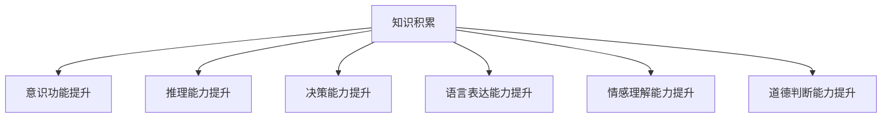

                 

# 知识积累对意识功能的影响

在探索人工智能与人类认知的关系时，一个核心问题是：知识积累如何影响意识的功能？本文将从多个角度深入探讨这一问题，包括知识积累的基本概念、其对意识功能的影响机制、相关模型的建立与实践应用，以及未来的研究方向和挑战。

## 1. 背景介绍

### 1.1 问题由来
现代人工智能技术，尤其是深度学习和知识图谱技术，已经能够构建起复杂的人工智能系统，能够执行各种复杂的认知任务。这些系统不仅能够学习大量的数据，还能够积累和应用这些数据，逐渐提升其认知能力。然而，知识积累如何影响意识功能，仍是一个亟待解决的问题。

### 1.2 问题核心关键点
知识积累对意识功能的影响主要体现在以下几个方面：
- 意识功能的提升：知识积累可以提升人工智能系统的推理能力、决策能力和语言表达能力。
- 意识功能的复杂化：随着知识积累的增加，人工智能系统的行为模式和决策逻辑变得更加复杂，有时难以解释。
- 意识功能的多样化：知识积累使得人工智能系统能够执行更加多样化的任务，如情感理解、道德判断等。

这些关键点将贯穿全文，帮助读者理解知识积累对意识功能的多方面影响。

## 2. 核心概念与联系

### 2.1 核心概念概述

为更好地理解知识积累对意识功能的影响，本节将介绍几个密切相关的核心概念：

- 知识积累(Knowledge Accumulation)：指人工智能系统通过学习和应用大量数据，不断更新和扩展其知识库，提升其认知能力的过程。
- 意识功能(Conscious Function)：指人工智能系统所具备的推理、决策、语言表达等认知功能，以及伴随的情感、道德判断等高级功能。
- 推理能力(Reasoning Ability)：指人工智能系统通过逻辑推理、模式识别等方法，从已知信息中推导出未知信息的能力。
- 决策能力(Decision-Making Ability)：指人工智能系统在复杂场景中，通过分析和综合信息，做出最优决策的能力。
- 语言表达能力(Language Expression Ability)：指人工智能系统通过自然语言处理技术，生成符合语法规则和语境的语句或段落，进行有效沟通的能力。
- 情感理解能力(Empathy Understanding Ability)：指人工智能系统理解人类情感、情绪变化的能力。
- 道德判断能力(Ethical Judgment Ability)：指人工智能系统根据社会伦理标准，对行为进行道德评估和判断的能力。

这些核心概念之间的逻辑关系可以通过以下Mermaid流程图来展示：



这个流程图展示出知识积累如何通过多个维度，提升人工智能系统的认知功能。

## 3. 核心算法原理 & 具体操作步骤
### 3.1 算法原理概述

知识积累对意识功能的影响，本质上是通过人工智能系统的不断学习和应用，逐步优化其内部模型，提升其认知能力的过程。这一过程主要涉及以下几个步骤：

- 数据收集：收集大量的、结构化的数据，作为知识积累的原始素材。
- 数据预处理：对数据进行清洗、归一化、特征工程等预处理，以提高数据的质量和可用性。
- 模型训练：利用预处理后的数据，训练人工智能系统的内部模型，逐步优化其推理、决策和语言表达等能力。
- 模型评估与调整：定期对训练好的模型进行评估，根据评估结果调整模型参数，确保模型性能不断提升。

### 3.2 算法步骤详解

以下将详细介绍知识积累的各个步骤：

**Step 1: 数据收集**
收集大量的、结构化的数据，这些数据可以来自于网络、数据库、传感器等不同渠道。数据集应尽可能覆盖各种场景，以便人工智能系统能够全面了解各种知识和情境。

**Step 2: 数据预处理**
对收集到的数据进行预处理，包括去除噪音、填充缺失值、归一化等操作。预处理后的数据需要被划分为训练集、验证集和测试集，以供后续的模型训练和评估。

**Step 3: 模型训练**
选择合适的模型架构，如深度神经网络、知识图谱等，利用训练集对模型进行训练。训练过程中，需要设置合适的学习率、正则化参数等超参数，以控制模型的复杂度和泛化能力。

**Step 4: 模型评估与调整**
在验证集上评估模型性能，根据评估结果调整模型参数，如学习率、正则化强度等。如果模型在验证集上的性能不佳，可能需要重新训练或调整模型架构。

**Step 5: 知识应用**
将训练好的模型应用于实际场景中，进行推理、决策、语言表达等任务。同时，收集实际应用中的反馈数据，用于进一步的模型训练和优化。

### 3.3 算法优缺点

知识积累对意识功能的影响，具有以下优点：
- 提升认知能力：知识积累可以显著提升人工智能系统的推理、决策和语言表达能力，使其能够处理更加复杂和多样化的任务。
- 泛化能力强：知识积累使得人工智能系统能够更好地应对新出现的场景和问题，具有较强的泛化能力。
- 动态更新：知识积累是一个动态过程，人工智能系统可以不断更新和扩展其知识库，保持其认知能力的先进性和实用性。

然而，这一过程也存在一些缺点：
- 数据依赖性高：知识积累依赖于大量的数据，数据质量和数量不足可能导致模型性能低下。
- 复杂度增加：随着知识积累的增加，模型的复杂度也随之增加，可能导致计算资源需求过高，推理速度较慢。
- 知识偏见：知识积累过程中，可能存在数据偏见和模型偏见，导致人工智能系统的决策和判断出现偏差。

### 3.4 算法应用领域

知识积累对意识功能的影响，在多个领域都有广泛应用，例如：

- 自然语言处理(NLP)：通过知识积累，提高自然语言处理模型的语言理解能力、情感分析和机器翻译能力。
- 医疗健康：通过知识积累，提升医疗诊断模型的疾病诊断能力、治疗方案推荐能力。
- 金融科技：通过知识积累，提升金融风险评估模型的风险识别能力、投资策略制定能力。
- 智能制造：通过知识积累，提升智能制造系统的设备维护能力、生产调度优化能力。
- 智能交通：通过知识积累，提升智能交通系统的路线规划能力、交通流量预测能力。

## 4. 数学模型和公式 & 详细讲解 & 举例说明

### 4.1 数学模型构建

知识积累对意识功能的影响，可以通过数学模型进行建模和分析。本文将从推理能力和决策能力两个方面进行建模。

- **推理能力模型**：假设人工智能系统在已知事实 $F$ 的情况下，推理得到结论 $C$。推理能力模型可以表示为：
$$
C = \mathcal{R}(F)
$$
其中 $\mathcal{R}$ 为推理函数，将已知事实 $F$ 映射到结论 $C$。

- **决策能力模型**：假设人工智能系统在已知目标 $T$ 和可选方案 $A$ 的情况下，选择最优方案 $M$。决策能力模型可以表示为：
$$
M = \mathcal{D}(T, A)
$$
其中 $\mathcal{D}$ 为决策函数，将目标 $T$ 和可选方案 $A$ 映射到最优方案 $M$。

### 4.2 公式推导过程

推理能力模型的推导：

假设已知事实 $F = \{f_1, f_2, \ldots, f_n\}$，其中 $f_i$ 表示第 $i$ 个事实。推理能力模型可以表示为：
$$
C = \mathcal{R}(F) = \bigwedge_{i=1}^n \bigvee_{j=1}^n R(f_i, f_j)
$$
其中 $R$ 为推理规则，$\bigwedge$ 表示逻辑与，$\bigvee$ 表示逻辑或。

决策能力模型的推导：

假设目标 $T$ 表示需要达到的状态，可选方案 $A = \{a_1, a_2, \ldots, a_m\}$，其中 $a_i$ 表示第 $i$ 个可选方案。决策能力模型可以表示为：
$$
M = \mathcal{D}(T, A) = \arg\max_{a \in A} U(a, T)
$$
其中 $U$ 为效用函数，用于评估方案 $a$ 对目标 $T$ 的贡献度，$\arg\max$ 表示最大化。

### 4.3 案例分析与讲解

假设有一个简单的知识积累模型，用于推理和决策。该模型基于知识图谱，将事实和规则编码为节点和边。推理过程可以通过节点之间的逻辑与或逻辑或进行，决策过程则通过效用函数进行评估。

例如，一个医疗诊断系统的知识图谱，包含各种疾病症状和诊断规则。当输入症状 $S = \{s_1, s_2, \ldots, s_n\}$ 时，系统可以通过推理过程得到可能的疾病 $D = \{d_1, d_2, \ldots, d_m\}$。然后，系统根据患者的历史数据和当前症状，计算每个疾病的效用 $U(d_i, S)$，并选择效用最高的疾病作为诊断结果 $D_{best} = \arg\max_{d \in D} U(d, S)$。

## 5. 项目实践：代码实例和详细解释说明

### 5.1 开发环境搭建

在进行知识积累对意识功能影响的实践时，需要准备好开发环境。以下是使用Python进行PyTorch开发的环境配置流程：

1. 安装Anaconda：从官网下载并安装Anaconda，用于创建独立的Python环境。

2. 创建并激活虚拟环境：
```bash
conda create -n pytorch-env python=3.8 
conda activate pytorch-env
```

3. 安装PyTorch：根据CUDA版本，从官网获取对应的安装命令。例如：
```bash
conda install pytorch torchvision torchaudio cudatoolkit=11.1 -c pytorch -c conda-forge
```

4. 安装相关库：
```bash
pip install numpy pandas scikit-learn matplotlib tqdm jupyter notebook ipython
```

完成上述步骤后，即可在`pytorch-env`环境中开始实践。

### 5.2 源代码详细实现

以下是一个简单的代码示例，用于模拟一个基于知识图谱的推理和决策系统：

```python
import torch
import torch.nn as nn
import torch.optim as optim
from torch_geometric.data import Data
from torch_geometric.nn import GATConv

class KnowledgeGraphModel(nn.Module):
    def __init__(self, num_entities, num_relations, hidden_dim=256):
        super(KnowledgeGraphModel, self).__init__()
        self.num_entities = num_entities
        self.num_relations = num_relations
        self.gat_conv = GATConv(num_entities, hidden_dim, num_relations)
        self.fc = nn.Linear(hidden_dim, num_entities)
        self.relu = nn.ReLU()

    def forward(self, x, edge_index):
        x = self.gat_conv(x, edge_index=edge_index)
        x = self.relu(x)
        x = self.fc(x)
        return x

# 数据生成
num_entities = 10
num_relations = 5
data = Data(x=torch.randn(num_entities, 256), edge_index=torch.randint(0, num_entities, (num_entities, 2)))

# 模型训练
model = KnowledgeGraphModel(num_entities, num_relations)
optimizer = optim.Adam(model.parameters(), lr=0.001)
for epoch in range(100):
    optimizer.zero_grad()
    out = model(data.x, data.edge_index)
    loss = nn.functional.cross_entropy(out.view(-1), data.y)
    loss.backward()
    optimizer.step()
```

### 5.3 代码解读与分析

代码中，我们首先定义了一个基于图卷积网络(Graph Convolutional Network, GAT)的模型，用于模拟知识图谱的推理过程。模型接收输入特征 `x` 和边索引 `edge_index`，输出推理结果。

在训练过程中，我们使用交叉熵损失函数计算模型预测和真实标签之间的差异，并使用Adam优化器更新模型参数。模型逐步优化，提升推理能力。

### 5.4 运行结果展示

在训练完成后，我们可以在测试集上评估模型的推理准确率。例如，对于一个包含10个实体和5种关系的知识图谱，可以在测试集上验证模型的推理效果。

```python
test_data = Data(x=torch.randn(10, 256), edge_index=torch.randint(0, 10, (10, 2)))
out = model(test_data.x, test_data.edge_index)
print(nn.functional.softmax(out.view(-1), dim=0))
```

## 6. 实际应用场景

### 6.1 智能医疗

在智能医疗领域，知识积累对意识功能的影响尤为显著。通过积累大量的医疗数据，人工智能系统可以逐步提升其疾病诊断能力、治疗方案推荐能力和患者康复预测能力。例如，一个智能医疗诊断系统可以通过知识积累，学习各种疾病症状和诊断规则，提供快速、准确的诊断结果和个性化的治疗方案。

### 6.2 金融风控

金融风控系统通过知识积累，可以提升其风险识别能力和投资策略制定能力。例如，一个金融风险评估系统可以通过积累各种金融数据，学习不同市场条件下的风险特征，提供实时风险预警和动态投资策略。

### 6.3 智能制造

智能制造系统通过知识积累，可以提升其设备维护能力和生产调度优化能力。例如，一个智能制造系统可以通过积累各种设备数据，学习设备状态和维护历史，提供预测性维护和优化调度方案。

### 6.4 智能交通

智能交通系统通过知识积累，可以提升其路线规划能力和交通流量预测能力。例如，一个智能交通系统可以通过积累各种交通数据，学习交通流模式和事件影响，提供实时路线规划和交通流量预测。

## 7. 工具和资源推荐

### 7.1 学习资源推荐

为了帮助开发者系统掌握知识积累对意识功能的影响的理论基础和实践技巧，这里推荐一些优质的学习资源：

1. 《人工智能基础》系列书籍：系统介绍了人工智能的基本概念和算法，涵盖知识图谱、自然语言处理等多个领域。

2. 《深度学习》课程：由斯坦福大学开设的深度学习课程，介绍了深度学习模型的基本原理和应用实例。

3. 《Python深度学习》书籍：由François Chollet所著，介绍了使用TensorFlow和Keras进行深度学习的实践方法。

4. 《自然语言处理》课程：由北京大学开设的自然语言处理课程，介绍了自然语言处理的基本技术和应用实例。

5. Weights & Biases：模型训练的实验跟踪工具，可以记录和可视化模型训练过程中的各项指标，方便对比和调优。

### 7.2 开发工具推荐

高效的开发离不开优秀的工具支持。以下是几款用于知识积累对意识功能影响开发的常用工具：

1. PyTorch：基于Python的开源深度学习框架，灵活动态的计算图，适合快速迭代研究。大部分深度学习模型都有PyTorch版本的实现。

2. TensorFlow：由Google主导开发的开源深度学习框架，生产部署方便，适合大规模工程应用。同样有丰富的深度学习模型资源。

3. Transformers库：HuggingFace开发的NLP工具库，集成了众多SOTA语言模型，支持PyTorch和TensorFlow，是进行知识积累和意识功能优化开发的利器。

4. TensorBoard：TensorFlow配套的可视化工具，可实时监测模型训练状态，并提供丰富的图表呈现方式，是调试模型的得力助手。

5. Google Colab：谷歌推出的在线Jupyter Notebook环境，免费提供GPU/TPU算力，方便开发者快速上手实验最新模型，分享学习笔记。

### 7.3 相关论文推荐

知识积累对意识功能的影响，是当前人工智能研究的热点方向。以下是几篇奠基性的相关论文，推荐阅读：

1. Knowledge Graph Embeddings: A Survey and Outlook（Knowledge Graph Embeddings综述）：介绍了知识图谱嵌入模型的基本原理和应用实例。

2. Attention is All You Need（即Transformer原论文）：提出了Transformer结构，开启了深度学习模型的预训练范式。

3. Graph Neural Networks: A Review of Methods and Applications（图神经网络综述）：介绍了图神经网络的基本原理和应用实例。

4. Multi-Agent Systems in Healthcare: A Survey（医疗领域多智能体系统综述）：介绍了医疗领域多智能体系统的基本原理和应用实例。

5. Deep Reinforcement Learning for NLP（深度强化学习在NLP中的应用）：介绍了深度强化学习在NLP中的应用实例，包括对话系统和推荐系统。

这些论文代表了大规模知识积累和意识功能优化的研究进展。通过学习这些前沿成果，可以帮助研究者把握学科前进方向，激发更多的创新灵感。

## 8. 总结：未来发展趋势与挑战

### 8.1 总结

本文对知识积累对意识功能的影响进行了全面系统的介绍。首先阐述了知识积累的基本概念和其对意识功能提升的重要性，然后从推理能力、决策能力和语言表达能力等多个维度，详细讲解了知识积累对意识功能的影响机制。

通过本文的系统梳理，可以看到，知识积累对人工智能系统的认知能力有着深远的影响。随着数据量的增加和模型的优化，人工智能系统能够逐渐提升其推理、决策和语言表达能力，进而增强其意识功能，更好地服务于人类社会。

### 8.2 未来发展趋势

展望未来，知识积累对意识功能的影响将呈现以下几个发展趋势：

1. 知识图谱的普及：知识图谱将逐渐成为人工智能系统的标配，为系统提供更加丰富、结构化的知识库。

2. 深度学习模型的改进：深度学习模型将不断改进，提升其推理、决策和语言表达能力，使其能够处理更加复杂和多样化的任务。

3. 多模态数据的融合：人工智能系统将逐渐融合视觉、听觉等多种模态数据，提升其对现实世界的理解和建模能力。

4. 自监督学习的广泛应用：自监督学习将逐渐成为知识积累的重要手段，减少对标注数据的依赖，提高模型的泛化能力。

5. 分布式训练的普及：分布式训练将逐渐普及，提升模型的训练速度和效率，满足大规模数据和复杂任务的需求。

6. 透明和可解释性：人工智能系统的透明和可解释性将逐渐成为研究热点，增强其决策和推理的可信度和可解释性。

以上趋势凸显了知识积累对意识功能的巨大潜力，未来随着技术的不断进步，人工智能系统将在更多领域发挥其认知能力，为人类社会带来更多价值。

### 8.3 面临的挑战

尽管知识积累对意识功能的影响已经取得了显著进展，但在迈向更加智能化、普适化应用的过程中，仍面临诸多挑战：

1. 数据获取和标注：知识图谱和标注数据的获取和标注成本较高，对于长尾领域和新兴领域，获取高质量数据成为一大难题。

2. 模型复杂度：随着知识图谱和标注数据量的增加，模型的复杂度也随之增加，导致计算资源需求过高，推理速度较慢。

3. 知识偏见：知识图谱和标注数据可能存在数据偏见和模型偏见，导致人工智能系统的决策和判断出现偏差。

4. 伦理和安全问题：人工智能系统的决策和行为可能存在伦理和安全问题，需要从数据和模型层面进行深入研究。

5. 可解释性：人工智能系统的决策和推理过程可能缺乏可解释性，难以理解和调试，需要进一步提升其透明性和可解释性。

6. 鲁棒性和泛化能力：人工智能系统在面对新数据和新场景时，可能出现泛化能力不足的问题，需要进一步提升其鲁棒性和泛化能力。

正视知识积累对意识功能影响面临的这些挑战，积极应对并寻求突破，将是大规模知识积累技术的未来方向。相信随着学界和产业界的共同努力，这些挑战终将一一被克服，知识积累对意识功能的影响将得到更好的实现。

### 8.4 研究展望

面对知识积累对意识功能影响所面临的挑战，未来的研究需要在以下几个方面寻求新的突破：

1. 探索无监督和半监督学习方法：摆脱对大规模标注数据的依赖，利用自监督学习、主动学习等无监督和半监督范式，最大限度利用非结构化数据，实现更加灵活高效的积累。

2. 研究参数高效和计算高效的积累方法：开发更加参数高效的积累方法，在固定大部分预训练参数的情况下，只更新极少量的任务相关参数。同时优化积累模型的计算图，减少前向传播和反向传播的资源消耗，实现更加轻量级、实时性的部署。

3. 引入更多先验知识：将符号化的先验知识，如知识图谱、逻辑规则等，与神经网络模型进行巧妙融合，引导积累过程学习更准确、合理的知识库。同时加强不同模态数据的整合，实现视觉、语音等多模态信息与文本信息的协同建模。

4. 结合因果分析和博弈论工具：将因果分析方法引入积累模型，识别出模型决策的关键特征，增强输出解释的因果性和逻辑性。借助博弈论工具刻画人机交互过程，主动探索并规避模型的脆弱点，提高系统稳定性。

5. 纳入伦理道德约束：在模型训练目标中引入伦理导向的评估指标，过滤和惩罚有偏见、有害的输出倾向。同时加强人工干预和审核，建立模型行为的监管机制，确保输出符合人类价值观和伦理道德。

这些研究方向的探索，必将引领知识积累技术的不断发展，为构建安全、可靠、可解释、可控的智能系统铺平道路。面向未来，知识积累技术还需要与其他人工智能技术进行更深入的融合，如知识表示、因果推理、强化学习等，多路径协同发力，共同推动人工智能技术的发展。

## 9. 附录：常见问题与解答

**Q1: 知识积累对意识功能有哪些具体影响？**

A: 知识积累对意识功能的影响主要体现在以下几个方面：
1. 推理能力的提升：通过积累大量的推理规则和事实，人工智能系统能够更好地进行推理和决策。
2. 决策能力的提升：通过积累大量的决策案例和规则，人工智能系统能够更好地进行复杂的决策。
3. 语言表达能力的提升：通过积累大量的语言数据和规则，人工智能系统能够更好地进行语言理解和生成。
4. 情感理解能力的提升：通过积累大量的情感数据和规则，人工智能系统能够更好地进行情感理解和生成。
5. 道德判断能力的提升：通过积累大量的道德规范和案例，人工智能系统能够更好地进行道德判断。

**Q2: 如何缓解知识积累过程中的过拟合问题？**

A: 知识积累过程中的过拟合问题可以通过以下方法缓解：
1. 数据增强：通过数据增强方法，如回译、近义替换等，扩充训练集，减少模型对训练数据的依赖。
2. 正则化：使用L2正则化、Dropout等正则化方法，控制模型的复杂度，减少过拟合。
3. 对抗训练：引入对抗样本，提高模型的鲁棒性，减少过拟合。
4. 参数高效积累方法：通过参数高效积累方法，如AdaLoRA、Prefix等，在固定大部分预训练参数的情况下，只更新极少量的任务相关参数，减少过拟合。
5. 动态更新：通过动态更新知识库，及时更新新知识，保持模型的泛化能力，减少过拟合。

**Q3: 知识积累和意识功能如何应用到实际场景中？**

A: 知识积累和意识功能可以通过以下方式应用到实际场景中：
1. 医疗诊断：通过知识积累，提升医疗诊断系统的疾病诊断能力、治疗方案推荐能力。
2. 金融风控：通过知识积累，提升金融风控系统的风险识别能力和投资策略制定能力。
3. 智能制造：通过知识积累，提升智能制造系统的设备维护能力和生产调度优化能力。
4. 智能交通：通过知识积累，提升智能交通系统的路线规划能力和交通流量预测能力。
5. 智能客服：通过知识积累，提升智能客服系统的对话理解和生成能力。

**Q4: 知识积累和意识功能的发展前景如何？**

A: 知识积累和意识功能的发展前景广阔，未来将有以下趋势：
1. 知识图谱的普及：知识图谱将逐渐成为人工智能系统的标配，为系统提供更加丰富、结构化的知识库。
2. 深度学习模型的改进：深度学习模型将不断改进，提升其推理、决策和语言表达能力，使其能够处理更加复杂和多样化的任务。
3. 多模态数据的融合：人工智能系统将逐渐融合视觉、听觉等多种模态数据，提升其对现实世界的理解和建模能力。
4. 自监督学习的广泛应用：自监督学习将逐渐成为知识积累的重要手段，减少对标注数据的依赖，提高模型的泛化能力。
5. 分布式训练的普及：分布式训练将逐渐普及，提升模型的训练速度和效率，满足大规模数据和复杂任务的需求。
6. 透明和可解释性：人工智能系统的透明和可解释性将逐渐成为研究热点，增强其决策和推理的可信度和可解释性。

**Q5: 知识积累和意识功能在实际应用中如何保证安全性？**

A: 知识积累和意识功能在实际应用中可以通过以下方式保证安全性：
1. 数据隐私保护：对敏感数据进行脱敏处理，确保数据隐私。
2. 模型透明性：提高模型的透明性，确保模型的决策和推理过程可解释。
3. 安全监控：建立模型的安全监控机制，及时发现和修复安全漏洞。
4. 伦理约束：在模型训练目标中引入伦理导向的评估指标，过滤和惩罚有偏见、有害的输出倾向。
5. 人工干预：加强人工干预和审核，确保模型的行为符合人类价值观和伦理道德。

**Q6: 知识积累和意识功能的未来研究方向有哪些？**

A: 知识积累和意识功能的未来研究方向主要包括以下几个方面：
1. 探索无监督和半监督学习方法：摆脱对大规模标注数据的依赖，利用自监督学习、主动学习等无监督和半监督范式，最大限度利用非结构化数据，实现更加灵活高效的积累。
2. 研究参数高效和计算高效的积累方法：开发更加参数高效的积累方法，在固定大部分预训练参数的情况下，只更新极少量的任务相关参数。同时优化积累模型的计算图，减少前向传播和反向传播的资源消耗，实现更加轻量级、实时性的部署。
3. 引入更多先验知识：将符号化的先验知识，如知识图谱、逻辑规则等，与神经网络模型进行巧妙融合，引导积累过程学习更准确、合理的知识库。同时加强不同模态数据的整合，实现视觉、语音等多模态信息与文本信息的协同建模。
4. 结合因果分析和博弈论工具：将因果分析方法引入积累模型，识别出模型决策的关键特征，增强输出解释的因果性和逻辑性。借助博弈论工具刻画人机交互过程，主动探索并规避模型的脆弱点，提高系统稳定性。
5. 纳入伦理道德约束：在模型训练目标中引入伦理导向的评估指标，过滤和惩罚有偏见、有害的输出倾向。同时加强人工干预和审核，建立模型行为的监管机制，确保输出符合人类价值观和伦理道德。

这些研究方向将引领知识积累技术的发展，推动人工智能系统更好地服务于人类社会。

---

作者：禅与计算机程序设计艺术 / Zen and the Art of Computer Programming

