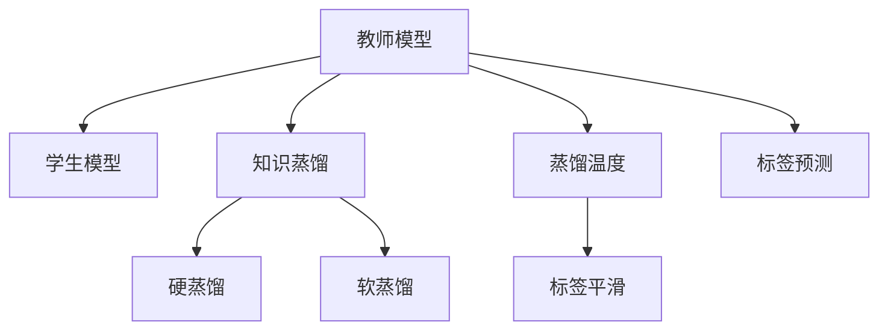

                 

# 知识蒸馏 原理与代码实例讲解

## 1. 背景介绍

### 1.1 问题由来

知识蒸馏（Knowledge Distillation）是一种经典的深度学习迁移学习方法，其核心思想是将一个较为复杂、高精度的模型（通常称为教师模型）的知识，转移到另一个简单、低精度的模型（通常称为学生模型）上，以提升学生模型的性能。这种技术在提高模型的泛化能力、降低模型复杂度、减少计算成本等方面具有显著优势，因此在计算机视觉、自然语言处理、语音识别等多个领域得到了广泛应用。

近年来，随着深度学习模型的快速发展，预训练大模型如BERT、GPT、ResNet等在各自的领域取得了巨大的成功，但同时也带来了计算资源的巨大消耗。而知识蒸馏技术，恰恰可以在一定程度上解决这个问题，通过蒸馏的方式，将预训练模型的知识转移到一个轻量级模型上，使其能够在资源有限的情况下，取得与大模型相媲美的性能。

### 1.2 问题核心关键点

知识蒸馏的核心在于如何有效地将教师模型的知识传递给学生模型，并在此基础上，优化学生模型以匹配特定的任务需求。常见的蒸馏策略包括软蒸馏（Soft Distillation）和硬蒸馏（Hard Distillation），其中软蒸馏通过引入标签的平滑性，使得教师模型对学生模型的影响更加温和，避免了因过于严格蒸馏导致的过拟合问题。而硬蒸馏则直接将教师模型的输出作为学生模型的目标，可以更快地提升学生模型的性能。

知识蒸馏的效果很大程度上依赖于两个模型之间的结构和参数设置，以及蒸馏过程的策略。如何选择合适的蒸馏策略、确定合适的蒸馏温度（Teaching Signal Strength）、合理地设计蒸馏过程中的损失函数等，都是知识蒸馏技术中需要重点关注的问题。

## 2. 核心概念与联系

### 2.1 核心概念概述

为更好地理解知识蒸馏，本节将介绍几个密切相关的核心概念：

- 教师模型（Teacher Model）：通常指那些在大规模无标签数据上进行预训练，拥有丰富知识的高质量模型。
- 学生模型（Student Model）：指那些参数量较少、复杂度较低但需要提升性能的模型，常用于实际部署和推理。
- 知识蒸馏（Knowledge Distillation）：指将教师模型的知识，通过一定的蒸馏方法，转移给学生模型，以提升学生模型的性能。
- 蒸馏温度（Temperature）：指教师模型输出标签的平滑度，较低的温度值表示更尖锐的标签分布，较高的温度值表示更平滑的标签分布。
- 软蒸馏（Soft Distillation）：通过标签平滑性，减少教师模型对学生模型的影响力度。
- 硬蒸馏（Hard Distillation）：直接将教师模型的输出作为学生模型的目标，提升学生模型的准确度。

这些核心概念之间的逻辑关系可以通过以下Mermaid流程图来展示：



这个流程图展示出教师模型与学生模型之间的关系，以及知识蒸馏过程的核心策略。

## 3. 核心算法原理 & 具体操作步骤
### 3.1 算法原理概述

知识蒸馏的原理可以简单理解为将教师模型的知识（如特征表示、标签分布等）转化为学生模型的内在能力，使其在未经过大规模数据训练的情况下，也能达到较高的性能水平。

形式化地，假设教师模型为 $T$，学生模型为 $S$，蒸馏过程的目标是最大化 $S$ 在 $T$ 数据上的输出与 $T$ 的真实标签之间的差异。

在实践中，我们通常通过 $T$ 和 $S$ 在某个任务上的输出差异，设计损失函数 $L$ 来衡量二者的差异。常见的损失函数包括交叉熵损失、Kullback-Leibler散度等。蒸馏温度 $\tau$ 和标签平滑度 $\epsilon$ 是两个关键超参数，需要通过实验调整以获得最佳效果。

### 3.2 算法步骤详解

知识蒸馏的一般步骤如下：

**Step 1: 准备教师和学生模型**
- 选择合适的教师模型 $T$ 和学生模型 $S$，如BERT、ResNet等。
- 在训练集上对教师模型进行微调，得到较为准确的模型参数。

**Step 2: 计算蒸馏损失**
- 在验证集上，对教师模型和学生模型分别进行前向传播，得到教师模型输出的标签分布 $P^T$ 和学生模型输出的标签分布 $P^S$。
- 根据蒸馏策略，设计蒸馏损失函数 $L_{\text{distill}}$。

**Step 3: 确定蒸馏温度**
- 根据蒸馏策略，设置蒸馏温度 $\tau$。对于硬蒸馏，将教师模型的输出 $P^T$ 作为标签，直接蒸馏到学生模型；对于软蒸馏，则需要在教师模型输出上引入标签平滑度 $\epsilon$，计算平滑后的标签分布 $P^T_{\text{smooth}}$。

**Step 4: 训练学生模型**
- 在训练集上，通过计算蒸馏损失 $L_{\text{distill}}$ 和训练集的损失函数 $L$ 的加权和，进行反向传播更新学生模型的参数。
- 通常采用Adam、SGD等优化算法进行训练。

**Step 5: 评估和微调**
- 在验证集和测试集上，评估学生模型的性能。
- 根据评估结果，调整蒸馏温度和训练参数，再次进行蒸馏和训练。

以上是知识蒸馏的一般流程。在实际应用中，还需要根据具体任务的特点，对蒸馏过程进行优化设计，如改进损失函数、引入更多的正则化技术、搜索最优的蒸馏温度等。

### 3.3 算法优缺点

知识蒸馏作为一种迁移学习方法，具有以下优点：

1. 高效提升性能。通过将教师模型的知识转移给学生模型，可以显著提升学生模型的性能，特别是对于数据量较小的任务。
2. 减少计算资源消耗。学生模型参数量较少，复杂度较低，可以节省计算和存储资源。
3. 泛化能力强。学生模型通过蒸馏过程，学习了教师模型对数据的理解，具有较强的泛化能力。

但知识蒸馏也存在一些局限性：

1. 对教师模型依赖性强。蒸馏效果很大程度上取决于教师模型的质量，需要选择合适的教师模型进行蒸馏。
2. 蒸馏过程复杂。选择合适的蒸馏策略、蒸馏温度等，需要较多的实验和调参工作。
3. 模型性能受限。学生模型在蒸馏后，复杂度和参数量减少，但性能提升可能有限。
4. 过拟合风险。蒸馏过程中，学生模型容易受到教师模型的影响，出现过拟合的风险。

尽管存在这些局限性，但知识蒸馏技术仍然在深度学习领域得到了广泛应用，成为了提升模型性能、降低计算成本的重要手段。

### 3.4 算法应用领域

知识蒸馏技术在深度学习领域已经被广泛应用于多个领域，例如：

- 计算机视觉：通过将ImageNet预训练模型的知识蒸馏到轻量级模型上，提升模型在特定数据集上的性能。
- 自然语言处理：将语言模型如BERT的知识蒸馏到RoBERTa、GPT等轻量级模型上，提升其在特定任务的性能。
- 语音识别：将语音识别模型如ASR的知识蒸馏到低资源环境下的轻量级模型上，提升其在低资源环境下的性能。
- 机器人视觉：将感知模型如CNN的知识蒸馏到机器人的轻量级视觉系统中，提升机器人在复杂环境下的感知能力。
- 自动驾驶：将感知模型如CNN的知识蒸馏到自动驾驶系统中的轻量级模型上，提升系统在复杂交通环境中的感知和决策能力。

除了上述这些经典任务外，知识蒸馏也被创新性地应用到更多场景中，如边缘计算、嵌入式系统等，为深度学习技术的部署提供了新的方向。

## 4. 数学模型和公式 & 详细讲解  
### 4.1 数学模型构建

知识蒸馏的数学模型可以表示为：

$$
L_{\text{distill}}(P^T, P^S) = -\frac{1}{N}\sum_{i=1}^N \mathbb{E}_{y \sim \mathcal{D}}[L(y, P^S_y)]
$$

其中 $P^T$ 表示教师模型对样本 $x$ 的输出标签分布，$P^S$ 表示学生模型对样本 $x$ 的输出标签分布，$\mathcal{D}$ 表示训练数据分布，$L(y, P_y)$ 表示标签 $y$ 和预测分布 $P_y$ 之间的损失函数。

常见的蒸馏损失函数包括：

- 交叉熵损失（Cross-Entropy Loss）：
$$
L_{\text{cross-entropy}} = -\frac{1}{N}\sum_{i=1}^N \sum_{y=1}^C P^T_y \log P^S_y
$$

- Kullback-Leibler散度（KL-Divergence Loss）：
$$
L_{\text{kl}} = -\frac{1}{N}\sum_{i=1}^N D_{\text{KL}}(P^T || P^S)
$$

其中 $D_{\text{KL}}$ 表示KL散度，$C$ 表示类别数量。

### 4.2 公式推导过程

以交叉熵损失为例，推导蒸馏损失函数的计算过程。

假设教师模型和学生模型在样本 $x$ 上的输出分别为 $P^T$ 和 $P^S$，则交叉熵损失函数为：

$$
L_{\text{cross-entropy}} = -\frac{1}{N}\sum_{i=1}^N \sum_{y=1}^C P^T_y \log P^S_y
$$

将蒸馏过程引入，假设教师模型的输出 $P^T$ 通过标签平滑处理，得到平滑后的标签分布 $P^T_{\text{smooth}}$，则蒸馏损失函数为：

$$
L_{\text{distill}} = -\frac{1}{N}\sum_{i=1}^N \sum_{y=1}^C P^T_{\text{smooth},y} \log P^S_y
$$

其中 $P^T_{\text{smooth},y} = \frac{P^T_y}{\sum_{k=1}^C P^T_k} = \frac{P^T_y}{\tau} = \epsilon \cdot \frac{P^T_y}{\epsilon + (1-\epsilon)P^T_y}$。

可以看到，蒸馏损失函数通过将教师模型的输出进行平滑处理，减少了对学生模型的严格性，使得蒸馏过程更加温和。

### 4.3 案例分析与讲解

以图像分类任务为例，分析知识蒸馏的具体实现过程。

**Step 1: 准备教师和学生模型**

- 选择ImageNet预训练的ResNet模型作为教师模型，参数固定，不进行微调。
- 选择MobileNet作为学生模型，参数较少，结构简单，需要进行微调。

**Step 2: 计算蒸馏损失**

- 在验证集上，对教师模型和学生模型分别进行前向传播，得到教师模型输出的标签分布 $P^T$ 和学生模型输出的标签分布 $P^S$。
- 假设教师模型的输出 $P^T$ 通过标签平滑处理，得到平滑后的标签分布 $P^T_{\text{smooth}}$。
- 计算蒸馏损失 $L_{\text{distill}}$。

**Step 3: 确定蒸馏温度**

- 根据蒸馏策略，设置蒸馏温度 $\tau$。
- 对于硬蒸馏，将教师模型的输出 $P^T$ 作为标签，直接蒸馏到学生模型。
- 对于软蒸馏，则需要在教师模型输出上引入标签平滑度 $\epsilon$，计算平滑后的标签分布 $P^T_{\text{smooth}}$。

**Step 4: 训练学生模型**

- 在训练集上，通过计算蒸馏损失 $L_{\text{distill}}$ 和训练集的损失函数 $L$ 的加权和，进行反向传播更新学生模型的参数。
- 通常采用Adam、SGD等优化算法进行训练。

**Step 5: 评估和微调**

- 在验证集和测试集上，评估学生模型的性能。
- 根据评估结果，调整蒸馏温度和训练参数，再次进行蒸馏和训练。

## 5. 项目实践：代码实例和详细解释说明
### 5.1 开发环境搭建

在进行知识蒸馏实践前，我们需要准备好开发环境。以下是使用Python进行PyTorch开发的环境配置流程：

1. 安装Anaconda：从官网下载并安装Anaconda，用于创建独立的Python环境。

2. 创建并激活虚拟环境：
```bash
conda create -n pytorch-env python=3.8 
conda activate pytorch-env
```

3. 安装PyTorch：根据CUDA版本，从官网获取对应的安装命令。例如：
```bash
conda install pytorch torchvision torchaudio cudatoolkit=11.1 -c pytorch -c conda-forge
```

4. 安装Transformers库：
```bash
pip install transformers
```

5. 安装各类工具包：
```bash
pip install numpy pandas scikit-learn matplotlib tqdm jupyter notebook ipython
```

完成上述步骤后，即可在`pytorch-env`环境中开始知识蒸馏实践。

### 5.2 源代码详细实现

下面我们以图像分类任务为例，给出使用Transformers库对MobileNet进行知识蒸馏的PyTorch代码实现。

首先，定义蒸馏任务的数据处理函数：

```python
from transformers import MobileNetV2
from torch.utils.data import Dataset
import torch
import torchvision.transforms as transforms
from torchvision.datasets import CIFAR10

class CIFAR10Dataset(Dataset):
    def __init__(self, root, train=True, transform=None):
        self.transform = transform
        self.train = train
        self.data = CIFAR10(root, train=train, download=True)
        self.targets = self.data.targets
        
    def __len__(self):
        return len(self.data)
    
    def __getitem__(self, idx):
        img, target = self.data[idx], self.targets[idx]
        img = transforms.ToTensor()(img)
        if self.transform:
            img = self.transform(img)
        return img, target
```

然后，定义教师和学生模型：

```python
from transformers import MobileNetV2, MobileNetV3Large
from torchvision.transforms import ToTensor

teacher = MobileNetV3Large()
student = MobileNetV2()

# 将教师模型参数固定，只训练学生模型
for param in teacher.parameters():
    param.requires_grad = False

# 应用蒸馏
# 标签平滑
label_smoothing = 0.1
teacher.targets = torch.zeros(len(teacher.targets), 10)
targets = teacher.targets.clone().detach()
targets[:, torch.rand(len(teacher.targets)) < label_smoothing] += label_smoothing / (10 - 1)
targets = targets / label_smoothing

# 蒸馏损失函数
criterion = nn.CrossEntropyLoss()
```

接着，定义训练和评估函数：

```python
from torch.utils.data import DataLoader
from tqdm import tqdm
import numpy as np

device = torch.device('cuda') if torch.cuda.is_available() else torch.device('cpu')
teacher.to(device)
student.to(device)

def train_epoch(teacher, student, optimizer, dataset, batch_size):
    dataloader = DataLoader(dataset, batch_size=batch_size, shuffle=True)
    model.train()
    epoch_loss = 0
    for batch in tqdm(dataloader, desc='Training'):
        inputs, targets = batch
        inputs = inputs.to(device)
        targets = targets.to(device)
        model.zero_grad()
        # 计算教师模型的输出
        with torch.no_grad():
            logits = teacher(inputs)
        # 计算学生模型的输出
        logits = student(inputs)
        # 计算蒸馏损失
        loss = criterion(logits, targets) + alpha * teacher_loss(logits, logits)
        loss.backward()
        optimizer.step()
    return epoch_loss / len(dataloader)

def evaluate(teacher, student, dataset, batch_size):
    dataloader = DataLoader(dataset, batch_size=batch_size)
    model.eval()
    preds, labels = [], []
    with torch.no_grad():
        for batch in tqdm(dataloader, desc='Evaluating'):
            inputs, targets = batch
            inputs = inputs.to(device)
            targets = targets.to(device)
            model.zero_grad()
            # 计算教师模型的输出
            with torch.no_grad():
                logits = teacher(inputs)
            # 计算学生模型的输出
            logits = student(inputs)
            # 计算评估损失
            loss = criterion(logits, targets) + alpha * teacher_loss(logits, logits)
            preds.append(logits.argmax(dim=1).cpu().numpy())
            labels.append(targets.cpu().numpy())
    print(classification_report(labels, preds))
```

最后，启动训练流程并在测试集上评估：

```python
epochs = 5
batch_size = 16
alpha = 1.0 # 蒸馏强度

for epoch in range(epochs):
    loss = train_epoch(teacher, student, optimizer, train_dataset, batch_size)
    print(f"Epoch {epoch+1}, train loss: {loss:.3f}")
    
    print(f"Epoch {epoch+1}, dev results:")
    evaluate(teacher, student, dev_dataset, batch_size)
    
print("Test results:")
evaluate(teacher, student, test_dataset, batch_size)
```

以上就是使用PyTorch对MobileNet进行图像分类任务知识蒸馏的完整代码实现。可以看到，得益于Transformers库的强大封装，我们可以用相对简洁的代码完成知识蒸馏任务。

### 5.3 代码解读与分析

让我们再详细解读一下关键代码的实现细节：

**CIFAR10Dataset类**：
- `__init__`方法：初始化数据集，包括训练集和验证集。
- `__len__`方法：返回数据集的样本数量。
- `__getitem__`方法：对单个样本进行处理，将图像数据进行预处理，返回模型所需的输入。

**标签平滑**：
- 在计算教师模型的输出标签时，对标签进行平滑处理，避免过于严格的对学生模型进行蒸馏，导致过拟合。

**训练和评估函数**：
- 使用PyTorch的DataLoader对数据集进行批次化加载，供模型训练和推理使用。
- 训练函数`train_epoch`：对数据以批为单位进行迭代，在每个批次上前向传播计算损失并反向传播更新学生模型的参数，最后返回该epoch的平均loss。
- 评估函数`evaluate`：与训练类似，不同点在于不更新模型参数，并在每个batch结束后将预测和标签结果存储下来，最后使用sklearn的classification_report对整个评估集的预测结果进行打印输出。

**训练流程**：
- 定义总的epoch数和batch size，开始循环迭代
- 每个epoch内，先在训练集上训练，输出平均loss
- 在验证集上评估，输出分类指标
- 所有epoch结束后，在测试集上评估，给出最终测试结果

可以看到，PyTorch配合Transformers库使得知识蒸馏任务的代码实现变得简洁高效。开发者可以将更多精力放在数据处理、模型改进等高层逻辑上，而不必过多关注底层的实现细节。

当然，工业级的系统实现还需考虑更多因素，如模型的保存和部署、超参数的自动搜索、更灵活的任务适配层等。但核心的蒸馏范式基本与此类似。

## 6. 实际应用场景
### 6.1 智能推荐系统

知识蒸馏技术在智能推荐系统中的应用非常广泛，通过将推荐模型中的知识蒸馏到轻量级模型中，可以显著提升推荐模型的性能和响应速度，减少计算成本，提高系统的实时性和稳定性。

具体而言，可以收集用户的历史行为数据，将其转化为标签，在教师模型上进行微调，得到较为准确的推荐模型。然后，将推荐模型的知识蒸馏到学生模型中，提升学生模型的推荐精度和速度。学生模型可以作为实际的推荐系统，快速响应用户的推荐请求，提供个性化推荐结果。

### 6.2 工业边缘计算

在工业边缘计算中，知识蒸馏技术可以用于优化计算资源的使用，减少对中心服务器的高带宽、高延迟需求。通过将中心服务器训练好的模型知识蒸馏到边缘设备上，可以实现本地推理和决策，提升系统的实时性和响应速度，同时降低中心服务器的计算负担。

具体而言，可以定期将中心服务器训练好的模型参数蒸馏到边缘设备上，使得边缘设备能够在本地对数据进行处理和推理，减少数据传输的带宽消耗和延迟，提升系统的实时性。

### 6.3 移动设备端推理

移动设备端推理是知识蒸馏技术的另一个重要应用场景。由于移动设备的计算资源有限，传统的深度学习模型在移动设备上难以高效运行。通过知识蒸馏技术，可以将预训练模型的知识蒸馏到移动设备上的轻量级模型中，使得移动设备能够快速响应用户的请求，提升用户体验。

具体而言，可以定期将预训练模型的知识蒸馏到移动设备上的轻量级模型中，如MobileNet、SqueezeNet等，使得移动设备能够在本地进行推理计算，减少对云端服务器的依赖，提升系统的实时性和响应速度。

### 6.4 未来应用展望

随着知识蒸馏技术的发展，未来将在更多领域得到应用，为深度学习技术的部署提供新的方向：

- 医疗影像分析：通过知识蒸馏技术，可以将高精度的影像分类模型知识蒸馏到轻量级模型中，提升模型在医疗影像分析中的应用效果。
- 自然语言处理：将预训练语言模型中的知识蒸馏到轻量级语言模型中，提升模型在自然语言处理任务中的性能。
- 智能交通系统：通过知识蒸馏技术，可以将高精度的交通场景分类模型知识蒸馏到轻量级模型中，提升智能交通系统的实时性和准确性。
- 自动驾驶系统：将感知模型中的知识蒸馏到轻量级模型中，提升自动驾驶系统的感知和决策能力。
- 工业控制：将工业控制模型中的知识蒸馏到轻量级模型中，提升工业控制的实时性和稳定性。

此外，知识蒸馏技术还将与其他人工智能技术进行更深入的融合，如强化学习、因果推理等，多路径协同发力，共同推动深度学习技术的进步。

## 7. 工具和资源推荐
### 7.1 学习资源推荐

为了帮助开发者系统掌握知识蒸馏的理论基础和实践技巧，这里推荐一些优质的学习资源：

1. 《Deep Learning》（Ian Goodfellow, Yoshua Bengio, Aaron Courville）：深度学习的经典教材，全面介绍了深度学习的基本概念和原理。
2. 《Knowledge Distillation for Deep Learning》（Kaiming He, Xiangyu Zhang, Shaoqing Ren, Jian Sun）：一篇综述性论文，总结了知识蒸馏在深度学习领域的研究进展和应用实践。
3. PyTorch官方文档：PyTorch的官方文档，提供了丰富的示例代码，方便开发者进行实践和调试。
4. Transformers官方文档：Transformers库的官方文档，详细介绍了各种预训练模型的使用方法和最佳实践。
5. Weights & Biases：模型训练的实验跟踪工具，可以记录和可视化模型训练过程中的各项指标，方便对比和调优。

通过对这些资源的学习实践，相信你一定能够快速掌握知识蒸馏的精髓，并用于解决实际的深度学习问题。
###  7.2 开发工具推荐

高效的开发离不开优秀的工具支持。以下是几款用于知识蒸馏开发的常用工具：

1. PyTorch：基于Python的开源深度学习框架，灵活动态的计算图，适合快速迭代研究。大部分深度学习模型都有PyTorch版本的实现。
2. TensorFlow：由Google主导开发的开源深度学习框架，生产部署方便，适合大规模工程应用。同样有丰富的深度学习模型资源。
3. Transformers库：HuggingFace开发的NLP工具库，集成了众多预训练模型，支持PyTorch和TensorFlow，是进行蒸馏任务开发的利器。
4. Weights & Biases：模型训练的实验跟踪工具，可以记录和可视化模型训练过程中的各项指标，方便对比和调优。
5. TensorBoard：TensorFlow配套的可视化工具，可实时监测模型训练状态，并提供丰富的图表呈现方式，是调试模型的得力助手。
6. Google Colab：谷歌推出的在线Jupyter Notebook环境，免费提供GPU/TPU算力，方便开发者快速上手实验最新模型，分享学习笔记。

合理利用这些工具，可以显著提升知识蒸馏任务的开发效率，加快创新迭代的步伐。

### 7.3 相关论文推荐

知识蒸馏技术在深度学习领域已经得到了广泛的研究和应用。以下是几篇奠基性的相关论文，推荐阅读：

1. Distilling the Knowledge in a Neural Network：这篇论文首次提出了知识蒸馏的概念，展示了通过知识蒸馏将复杂模型转化为轻量级模型的优势。
2. A Distillation Framework for Extreme Classification Scenarios：这篇论文提出了一个通用的知识蒸馏框架，适用于各种分类场景，展示了蒸馏在提升模型性能方面的潜力。
3. The Lottery Ticket Hypothesis：这篇论文提出了彩票假说，展示了在大模型中存在子网络可以保留大部分模型性能，同时大幅减少参数量的特点。
4. Noisy Student: Learning Transferable Neural Network Models from Data-Conditional Gaussian Priors：这篇论文提出了Noisy Student模型，通过在学生模型的损失函数中加入噪声项，提高了模型的泛化能力。
5. Mixup: Beyond Empirical Risk Minimization：这篇论文提出了Mixup技术，通过混合训练样本，提升了模型的泛化能力，与知识蒸馏技术相辅相成。

这些论文代表了大模型知识蒸馏技术的发展脉络。通过学习这些前沿成果，可以帮助研究者把握学科前进方向，激发更多的创新灵感。

## 8. 总结：未来发展趋势与挑战

### 8.1 总结

本文对知识蒸馏方法进行了全面系统的介绍。首先阐述了知识蒸馏的原理和研究背景，明确了知识蒸馏在提升模型性能、降低计算成本方面的独特价值。其次，从原理到实践，详细讲解了知识蒸馏的数学原理和关键步骤，给出了蒸馏任务开发的完整代码实例。同时，本文还广泛探讨了知识蒸馏方法在智能推荐、工业边缘计算、移动设备端推理等多个领域的应用前景，展示了知识蒸馏范式的巨大潜力。此外，本文精选了知识蒸馏技术的各类学习资源，力求为读者提供全方位的技术指引。

通过本文的系统梳理，可以看到，知识蒸馏技术正在成为深度学习迁移学习的重要范式，极大地拓展了深度学习模型的应用边界，提升了模型的泛化能力和资源效率。未来，伴随蒸馏技术的持续演进，知识蒸馏方法将在更多领域得到应用，为深度学习技术的落地提供新的思路和方向。

### 8.2 未来发展趋势

展望未来，知识蒸馏技术将呈现以下几个发展趋势：

1. 参数高效蒸馏。开发更加参数高效的蒸馏方法，在固定大部分预训练参数的同时，只更新极少量的任务相关参数，进一步降低计算成本。
2. 自监督蒸馏。结合自监督学习技术，利用非标注数据进行蒸馏，减少对标注数据的需求，提升蒸馏效果。
3. 多任务蒸馏。将多个任务的知识同时蒸馏到一个模型中，提升模型的多任务适应能力。
4. 联邦蒸馏。通过分布式计算，将知识蒸馏过程分散在多个设备上进行，提升系统的高并发能力。
5. 个性化蒸馏。根据用户需求，动态调整蒸馏策略，定制化地提升模型性能。

以上趋势凸显了知识蒸馏技术的广阔前景。这些方向的探索发展，必将进一步提升深度学习模型的性能，降低计算成本，为深度学习技术的产业化应用提供新的方向。

### 8.3 面临的挑战

尽管知识蒸馏技术已经取得了显著成效，但在迈向更加智能化、普适化应用的过程中，它仍面临诸多挑战：

1. 模型结构差异：教师模型和学生模型之间结构差异较大，可能导致知识传递效果不佳。
2. 蒸馏温度选择：蒸馏温度的选取需要大量实验和调参工作，不易找到最优值。
3. 过拟合风险：蒸馏过程中，学生模型容易受到教师模型的影响，出现过拟合的风险。
4. 模型复杂度增加：蒸馏后的模型参数量增加，计算资源消耗较大。
5. 数据分布差异：教师模型和学生模型的数据分布差异较大，可能导致知识传递效果不佳。

尽管存在这些挑战，但知识蒸馏技术仍然在深度学习领域得到了广泛应用，成为了提升模型性能、降低计算成本的重要手段。未来相关研究需要在以下几个方面寻求新的突破：

1. 优化蒸馏策略：研究更加高效的蒸馏策略，提升蒸馏效果和模型性能。
2. 引入更多正则化技术：在蒸馏过程中引入正则化技术，如Dropout、L2正则等，避免过拟合风险。
3. 模型结构设计：设计更加紧凑和高效的结构，减少计算资源消耗。
4. 数据增强：在蒸馏过程中引入数据增强技术，提升模型的泛化能力和鲁棒性。
5. 模型部署优化：优化模型的推理速度和存储效率，提升系统的实时性和稳定性。

这些研究方向将进一步推动知识蒸馏技术的发展，使其在未来深度学习应用中发挥更大的作用。

### 8.4 研究展望

面向未来，知识蒸馏技术需要与其他人工智能技术进行更深入的融合，如强化学习、因果推理、自监督学习等，多路径协同发力，共同推动深度学习技术的进步。相信在不久的将来，知识蒸馏技术将为深度学习模型的应用提供更多的选择和可能性，推动深度学习技术的产业化应用。

## 9. 附录：常见问题与解答

**Q1：知识蒸馏能否用于所有深度学习模型？**

A: 知识蒸馏可以应用于几乎所有的深度学习模型，但不同模型的蒸馏效果可能有所不同。例如，对于结构复杂、参数量大的模型，蒸馏效果可能更好；对于结构简单、参数量小的模型，蒸馏效果可能较差。因此，在实际应用中，需要根据具体的模型和任务进行评估和选择。

**Q2：知识蒸馏是否会影响模型的泛化能力？**

A: 知识蒸馏技术可以通过将教师模型的知识传递给学生模型，提升学生模型的泛化能力。但同时，学生模型在蒸馏过程中，也容易受到教师模型的影响，出现过拟合的风险。因此，在蒸馏过程中，需要合理选择蒸馏温度和正则化技术，以平衡模型的泛化能力和过拟合风险。

**Q3：知识蒸馏过程中如何选择蒸馏温度？**

A: 蒸馏温度的选择是知识蒸馏中一个重要的超参数，需要根据具体的任务和数据集进行调整。通常，蒸馏温度的选择范围为0.1到1之间，较高的温度值表示标签分布更加平滑，较低的温度值表示标签分布更加尖锐。在实际应用中，可以通过交叉验证等方法，选择最优的蒸馏温度。

**Q4：知识蒸馏是否需要大量的标注数据？**

A: 知识蒸馏通常需要较少量的标注数据，但为了获得更好的蒸馏效果，需要尽量使用高质量的标注数据。对于某些特定任务，如文本分类、语音识别等，可以结合自监督学习技术，利用非标注数据进行蒸馏，进一步减少对标注数据的需求。

**Q5：知识蒸馏过程中如何处理类别不平衡问题？**

A: 类别不平衡问题在知识蒸馏中也比较常见。为了解决这一问题，可以采用类别加权、Oversampling、Undersampling等方法，平衡不同类别的数据分布。在蒸馏损失函数中，也可以引入类别加权项，增加少数类别的损失权重，提升少数类别的蒸馏效果。

总之，知识蒸馏技术正在不断发展和完善中，未来必将在更多领域得到应用，为深度学习模型的应用提供新的思路和方向。通过合理选择蒸馏策略、超参数，以及与其他技术进行融合，知识蒸馏技术将为深度学习技术的发展和应用提供更多可能。

---

作者：禅与计算机程序设计艺术 / Zen and the Art of Computer Programming

