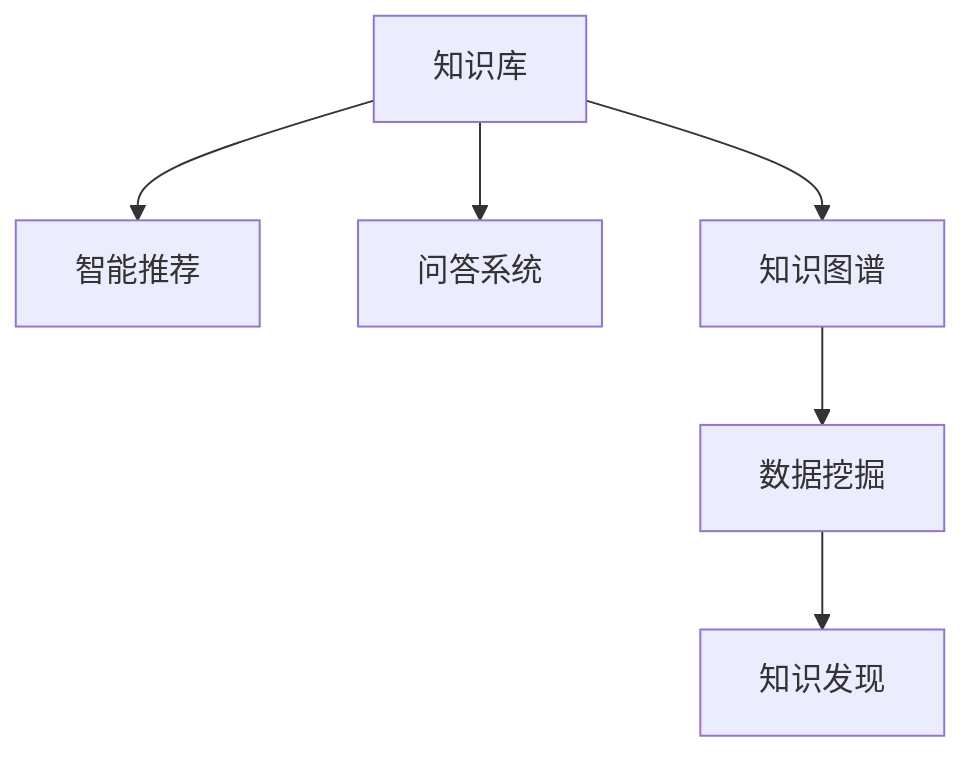

                 

## 1. 背景介绍

### 1.1 问题由来

在知识经济时代，知识的积累、传播与应用成为了驱动社会进步的关键因素。然而，随着信息量的急剧膨胀，知识的有效管理和传播也变得愈发复杂和困难。如何高效地存储、检索、使用和共享知识，成为了一个亟待解决的问题。

当前，人工智能和大数据技术的发展为知识输出与管理带来了新的解决方案。通过深度学习和自然语言处理等技术，可以构建知识库、智能推荐系统、问答系统等应用，极大地提升了知识的管理与传播效率。本文将聚焦于知识输出与管理领域，探讨通过技术手段实现智慧的积累和传播。

### 1.2 问题核心关键点

知识输出与管理的核心在于如何将散落在各处的知识进行有效的聚合、组织、检索和传播。其关键点包括：

- 知识库构建：将知识进行结构化存储，便于检索和应用。
- 智能推荐：根据用户兴趣和行为，推荐相关知识。
- 问答系统：通过自然语言理解与生成技术，实现智能问答。
- 知识图谱：利用图谱化技术，构建语义知识网络。
- 数据挖掘：从大量文本数据中自动抽取知识，提升知识发现能力。

这些核心技术相互关联，共同构成了知识输出与管理的全链路。本文将逐一阐述这些核心技术，并探索其应用场景和未来发展方向。

### 1.3 问题研究意义

在信息化社会，知识的高效输出与管理对各行各业的影响巨大。通过优化知识管理技术，可以：

- 降低知识获取成本：利用智能推荐和问答系统，快速定位所需知识。
- 提升知识利用效率：构建知识库和知识图谱，实现知识复用和共享。
- 加速知识创新：通过数据挖掘和智能推荐，激发新的知识发现和应用。
- 促进知识传播：建立知识传播渠道，扩大知识的覆盖面和社会影响力。
- 助力智能决策：利用知识图谱和智能推荐，支撑决策和策略制定。

随着技术的发展，知识输出与管理将不断向智能化、自动化和便捷化的方向演进，极大地推动社会进步和产业升级。

## 2. 核心概念与联系

### 2.1 核心概念概述

为了更好地理解知识输出与管理技术，本节将介绍几个关键概念：

- 知识库(Knowledge Base)：存储结构化知识的数据库，通常包含事实、概念、关系等。
- 智能推荐系统(Recommender System)：根据用户行为和偏好，推荐相关知识。
- 问答系统(Question Answering, QA)：利用自然语言理解与生成技术，对用户提问进行智能回答。
- 知识图谱(Knowledge Graph)：利用图谱化技术，构建语义知识网络。
- 数据挖掘(Data Mining)：从海量数据中自动发现和抽取知识。

这些核心概念之间的逻辑关系可以通过以下Mermaid流程图来展示：



这个流程图展示了知识输出与管理的主要环节及其关联：

1. 知识库作为知识存储的基础，为其他技术提供数据支撑。
2. 智能推荐系统利用知识库，推荐相关知识。
3. 问答系统利用知识库，回答用户提问。
4. 知识图谱构建语义网络，增强知识关联性。
5. 数据挖掘从数据中抽取知识，提升知识发现能力。

这些核心概念共同构成了知识输出与管理的框架，为智慧的积累和传播提供了技术基础。

## 3. 核心算法原理 & 具体操作步骤
### 3.1 算法原理概述

知识输出与管理的核心技术基于多种人工智能算法和数据处理技术，主要包括以下几个方面：

- 自然语言处理(Natural Language Processing, NLP)：用于构建问答系统和智能推荐系统。
- 知识表示与推理(Knowledge Representation and Reasoning)：构建知识图谱，支撑知识推理和搜索。
- 数据挖掘与机器学习(Data Mining and Machine Learning)：从数据中提取知识，构建智能推荐系统。
- 语义搜索(Semantic Search)：在知识图谱中快速定位相关知识。

### 3.2 算法步骤详解

知识输出与管理的算法步骤主要包括以下几个环节：

1. **数据收集与预处理**：
   - 从各种数据源收集文本、图像、视频等数据。
   - 对数据进行清洗、归一化、标注等预处理操作，为后续处理做准备。

2. **知识抽取与表示**：
   - 利用NLP技术，从文本数据中自动抽取实体、关系和事件等知识。
   - 将抽取的知识转化为结构化形式，如事实三元组、实体关系图等，构建知识库。

3. **知识图谱构建**：
   - 利用图谱化技术，将知识库中的事实三元组转换为图结构。
   - 利用知识图谱进行语义推理和关系发现，增强知识关联性。

4. **智能推荐系统设计**：
   - 利用机器学习模型，从用户行为和兴趣中提取特征。
   - 构建推荐模型，预测用户对知识的偏好和需求。
   - 利用推荐算法，对知识进行排序和推荐。

5. **问答系统构建**：
   - 利用NLP技术，解析用户提问，提取关键信息。
   - 利用知识库和知识图谱，推理和生成答案。
   - 对答案进行评估和修正，提升答案的质量和准确性。

### 3.3 算法优缺点

知识输出与管理技术具有以下优点：

- 高效性：利用算法自动处理和分析大量数据，快速产生有价值的信息。
- 准确性：通过模型和算法对知识进行精确表示和推理。
- 可扩展性：可以轻松地扩展和更新知识库，适应新的知识和需求。
- 用户友好：利用智能推荐和问答系统，提升用户体验。

同时，这些技术也存在一些缺点：

- 数据依赖性强：需要大量高质量数据，否则容易产生误导性或偏差性。
- 模型复杂度高：构建和维护复杂模型需要较高的技术门槛和计算资源。
- 隐私风险：知识抽取和处理过程中可能涉及用户隐私，需加强保护。
- 更新难度大：知识库和模型需要定期更新，以适应新知识和新需求。

尽管存在这些缺点，但总体而言，知识输出与管理技术在知识积累和传播方面具有巨大的潜力。

### 3.4 算法应用领域

知识输出与管理技术已经在多个领域得到了广泛应用，例如：

- 医疗健康：利用智能推荐系统，推荐相关医疗知识和健康建议。
- 教育培训：构建知识库和问答系统，提升教学效果和学习体验。
- 金融保险：利用知识图谱和推荐系统，分析市场趋势和风险。
- 电子商务：推荐相关商品，提升用户体验和转化率。
- 政府服务：构建知识库和智能问答系统，提升公共服务效率。

除了上述这些经典应用外，知识输出与管理技术还被创新性地应用于更多场景中，如智能客服、智慧城市、智能家居等，为各行各业带来了新的发展机遇。

## 4. 数学模型和公式 & 详细讲解  
### 4.1 数学模型构建

本节将使用数学语言对知识输出与管理的主要算法进行严格刻画。

记知识库中的知识表示为 $K=(E,R,F)$，其中 $E$ 为实体集合，$R$ 为关系集合，$F$ 为事实集合。假设用户行为表示为 $U=(u_1,u_2,\dots,u_n)$，其中 $u_i$ 为用户在时间 $t_i$ 的行为数据。

知识图谱 $G=(V,E')$，其中 $V$ 为节点集合，表示实体和概念，$E'$ 为边集合，表示实体之间的关系。

智能推荐系统使用矩阵分解技术，将用户行为矩阵 $U$ 分解为 $U=P \cdot Q$，其中 $P$ 为实体特征矩阵，$Q$ 为用户特征矩阵。推荐模型预测用户对知识的兴趣度为 $I_{i,j}=\hat{p}_{i,j}=P_iQ_j^T$。

问答系统使用向量表示方法，将用户问题和答案表示为向量 $q$ 和 $a$。利用语义匹配模型，计算 $q$ 和 $a$ 的相似度 $sim(q,a)$。

### 4.2 公式推导过程

以下我们以知识图谱构建为例，推导其数学模型。

知识图谱的构建过程分为两个步骤：

1. **知识抽取**：从文本中抽取实体、关系和事件，构建事实三元组 $(f_{i,j,k})$，其中 $i$ 为实体，$j$ 为关系，$k$ 为属性。
2. **知识表示**：将三元组转换为图结构，建立实体之间的关系网络。

具体步骤如下：

1. **实体识别**：利用NLP技术，从文本中识别出实体，如人名、地名、机构名等。

2. **关系抽取**：识别出实体之间的语义关系，如"位于"、"服务"等。

3. **知识表示**：将抽取的三元组转换为图结构，建立实体之间的关系网络。

设实体集合 $E=\{e_1,e_2,\dots,e_n\}$，关系集合 $R=\{r_1,r_2,\dots,r_m\}$，三元组集合 $F=\{(f_{i,j,k})\}$。知识图谱 $G=(V,E')$，其中 $V$ 为节点集合，$E'$ 为边集合。

构建知识图谱的数学模型如下：

- **节点表示**：每个实体 $e_i$ 表示为一个向量 $\vec{e_i} \in \mathbb{R}^d$。
- **边表示**：每个关系 $r_j$ 表示为一个权重矩阵 $\vec{W}_{r_j} \in \mathbb{R}^{d \times d}$。
- **边权重**：对于三元组 $(f_{i,j,k})$，节点 $e_i$ 和 $e_j$ 之间存在一条边，边权重为 $W_{ij}=r_{ij}$。

构建知识图谱的公式为：

$$
G=(V,E')=(\{e_1,e_2,\dots,e_n\},\{r_{ij}\}_{i,j=1}^n)
$$

其中，$r_{ij}$ 表示实体 $e_i$ 和 $e_j$ 之间的关系，$W_{ij}=r_{ij}$。

通过上述模型，知识图谱可以表示为实体和关系的网络结构，便于知识推理和搜索。

## 5. 项目实践：代码实例和详细解释说明
### 5.1 开发环境搭建

在进行知识输出与管理项目实践前，我们需要准备好开发环境。以下是使用Python进行PyTorch开发的环境配置流程：

1. 安装Anaconda：从官网下载并安装Anaconda，用于创建独立的Python环境。

2. 创建并激活虚拟环境：
```bash
conda create -n pytorch-env python=3.8 
conda activate pytorch-env
```

3. 安装PyTorch：根据CUDA版本，从官网获取对应的安装命令。例如：
```bash
conda install pytorch torchvision torchaudio cudatoolkit=11.1 -c pytorch -c conda-forge
```

4. 安装Transformer库：
```bash
pip install transformers
```

5. 安装各类工具包：
```bash
pip install numpy pandas scikit-learn matplotlib tqdm jupyter notebook ipython
```

完成上述步骤后，即可在`pytorch-env`环境中开始项目实践。

### 5.2 源代码详细实现

这里我们以构建知识图谱为例，给出使用Transformers库的PyTorch代码实现。

首先，定义知识抽取函数：

```python
from transformers import BertTokenizer
from torch.utils.data import Dataset
import torch

class KnowledgeDataset(Dataset):
    def __init__(self, texts, entities, relations, triples, tokenizer, max_len=128):
        self.texts = texts
        self.entities = entities
        self.relations = relations
        self.triples = triples
        self.tokenizer = tokenizer
        self.max_len = max_len
        
    def __len__(self):
        return len(self.texts)
    
    def __getitem__(self, item):
        text = self.texts[item]
        triple = self.triples[item]
        entities = [t for t in triple[0].split('|')]
        relations = [t for t in triple[1].split('|')]
        targets = [t for t in triple[2].split('|')]
        
        encoding = self.tokenizer(text, return_tensors='pt', max_length=self.max_len, padding='max_length', truncation=True)
        input_ids = encoding['input_ids'][0]
        attention_mask = encoding['attention_mask'][0]
        
        # 对token-wise的标签进行编码
        encoded_entities = [t2id[t] for t in entities] 
        encoded_entities.extend([t2id['O']] * (self.max_len - len(encoded_entities)))
        labels = torch.tensor(encoded_entities, dtype=torch.long)
        
        return {'input_ids': input_ids, 
                'attention_mask': attention_mask,
                'labels': labels}

# 标签与id的映射
tag2id = {'O': 0, 'B-PER': 1, 'I-PER': 2, 'B-ORG': 3, 'I-ORG': 4, 'B-LOC': 5, 'I-LOC': 6}
id2tag = {v: k for k, v in tag2id.items()}

# 创建dataset
tokenizer = BertTokenizer.from_pretrained('bert-base-cased')

train_dataset = KnowledgeDataset(train_texts, train_entities, train_relations, train_triples, tokenizer)
dev_dataset = KnowledgeDataset(dev_texts, dev_entities, dev_relations, dev_triples, tokenizer)
test_dataset = KnowledgeDataset(test_texts, test_entities, test_relations, test_triples, tokenizer)
```

然后，定义模型和优化器：

```python
from transformers import BertForTokenClassification, AdamW

model = BertForTokenClassification.from_pretrained('bert-base-cased', num_labels=len(tag2id))

optimizer = AdamW(model.parameters(), lr=2e-5)
```

接着，定义训练和评估函数：

```python
from torch.utils.data import DataLoader
from tqdm import tqdm
from sklearn.metrics import classification_report

device = torch.device('cuda') if torch.cuda.is_available() else torch.device('cpu')
model.to(device)

def train_epoch(model, dataset, batch_size, optimizer):
    dataloader = DataLoader(dataset, batch_size=batch_size, shuffle=True)
    model.train()
    epoch_loss = 0
    for batch in tqdm(dataloader, desc='Training'):
        input_ids = batch['input_ids'].to(device)
        attention_mask = batch['attention_mask'].to(device)
        labels = batch['labels'].to(device)
        model.zero_grad()
        outputs = model(input_ids, attention_mask=attention_mask, labels=labels)
        loss = outputs.loss
        epoch_loss += loss.item()
        loss.backward()
        optimizer.step()
    return epoch_loss / len(dataloader)

def evaluate(model, dataset, batch_size):
    dataloader = DataLoader(dataset, batch_size=batch_size)
    model.eval()
    preds, labels = [], []
    with torch.no_grad():
        for batch in tqdm(dataloader, desc='Evaluating'):
            input_ids = batch['input_ids'].to(device)
            attention_mask = batch['attention_mask'].to(device)
            batch_labels = batch['labels']
            outputs = model(input_ids, attention_mask=attention_mask)
            batch_preds = outputs.logits.argmax(dim=2).to('cpu').tolist()
            batch_labels = batch_labels.to('cpu').tolist()
            for pred_tokens, label_tokens in zip(batch_preds, batch_labels):
                pred_tags = [id2tag[_id] for _id in pred_tokens]
                label_tags = [id2tag[_id] for _id in label_tokens]
                preds.append(pred_tags[:len(label_tags)])
                labels.append(label_tags)
                
    print(classification_report(labels, preds))
```

最后，启动训练流程并在测试集上评估：

```python
epochs = 5
batch_size = 16

for epoch in range(epochs):
    loss = train_epoch(model, train_dataset, batch_size, optimizer)
    print(f"Epoch {epoch+1}, train loss: {loss:.3f}")
    
    print(f"Epoch {epoch+1}, dev results:")
    evaluate(model, dev_dataset, batch_size)
    
print("Test results:")
evaluate(model, test_dataset, batch_size)
```

以上就是使用PyTorch对BERT进行命名实体识别任务微调的完整代码实现。可以看到，得益于Transformers库的强大封装，我们可以用相对简洁的代码完成BERT模型的加载和微调。

### 5.3 代码解读与分析

让我们再详细解读一下关键代码的实现细节：

**KnowledgeDataset类**：
- `__init__`方法：初始化文本、实体、关系、三元组等关键组件。
- `__len__`方法：返回数据集的样本数量。
- `__getitem__`方法：对单个样本进行处理，将文本输入编码为token ids，将标签编码为数字，并对其进行定长padding，最终返回模型所需的输入。

**tag2id和id2tag字典**：
- 定义了标签与数字id之间的映射关系，用于将token-wise的预测结果解码回真实的标签。

**训练和评估函数**：
- 使用PyTorch的DataLoader对数据集进行批次化加载，供模型训练和推理使用。
- 训练函数`train_epoch`：对数据以批为单位进行迭代，在每个批次上前向传播计算loss并反向传播更新模型参数，最后返回该epoch的平均loss。
- 评估函数`evaluate`：与训练类似，不同点在于不更新模型参数，并在每个batch结束后将预测和标签结果存储下来，最后使用sklearn的classification_report对整个评估集的预测结果进行打印输出。

**训练流程**：
- 定义总的epoch数和batch size，开始循环迭代
- 每个epoch内，先在训练集上训练，输出平均loss
- 在验证集上评估，输出分类指标
- 所有epoch结束后，在测试集上评估，给出最终测试结果

可以看到，PyTorch配合Transformers库使得BERT微调的代码实现变得简洁高效。开发者可以将更多精力放在数据处理、模型改进等高层逻辑上，而不必过多关注底层的实现细节。

当然，工业级的系统实现还需考虑更多因素，如模型的保存和部署、超参数的自动搜索、更灵活的任务适配层等。但核心的微调范式基本与此类似。

## 6. 实际应用场景
### 6.1 医疗健康

在医疗健康领域，知识输出与管理技术有着广泛的应用。传统医疗知识大多以纸质形式存在，查找和使用较为困难。通过构建医疗知识库和智能推荐系统，可以快速获取所需信息，提升医疗效率和质量。

具体而言，可以收集各类医学文献、临床指南、治疗方案等数据，利用自然语言处理技术进行知识抽取和表示。将抽取的知识存储在知识库中，并利用智能推荐系统推荐相关知识。通过问答系统，医生可以快速获取诊疗信息，辅助诊断和治疗决策。

### 6.2 教育培训

在教育培训领域，知识输出与管理技术可以帮助教师和学生更高效地获取知识。通过构建知识库和智能推荐系统，可以为学生提供个性化的学习推荐，提升学习效果。

具体而言，可以收集各类教学资源、习题、答案等数据，利用知识抽取技术进行自动抽取和表示。将抽取的知识存储在知识库中，并利用推荐系统推荐相关内容。通过智能问答系统，学生可以及时获取问题解答，提升学习体验。

### 6.3 金融保险

在金融保险领域，知识输出与管理技术可以帮助分析师和投资者快速获取市场信息，分析投资风险。通过构建知识库和智能推荐系统，可以推荐相关市场动态和分析报告，提升决策效率。

具体而言，可以收集各类金融新闻、公司报告、分析师评论等数据，利用知识抽取技术进行自动抽取和表示。将抽取的知识存储在知识库中，并利用推荐系统推荐相关内容。通过智能问答系统，分析师可以快速获取市场信息，辅助投资决策。

### 6.4 未来应用展望

随着技术的发展，知识输出与管理技术将呈现以下几个发展趋势：

1. 知识图谱的普及：知识图谱将成为知识存储和传播的标准形式，提升知识管理的系统性和科学性。
2. 智能推荐系统的深入应用：智能推荐系统将更加精准和个性化，提升知识发现和传播的效率。
3. 跨领域知识融合：知识图谱和推荐系统将跨越领域界限，实现跨学科知识融合和创新。
4. 知识自动化生成：利用生成式模型，自动生成知识库和推荐内容，提升知识更新的效率和质量。
5. 知识安全和隐私保护：构建安全的知识管理和传播体系，确保数据安全和用户隐私。

以上趋势凸显了知识输出与管理技术的广阔前景。这些方向的探索发展，必将进一步提升知识管理的效率和质量，为知识创新和社会进步提供坚实的基础。

## 7. 工具和资源推荐
### 7.1 学习资源推荐

为了帮助开发者系统掌握知识输出与管理技术，这里推荐一些优质的学习资源：

1. 《自然语言处理》系列书籍：由斯坦福大学和Coursera联合推出的NLP入门教材，涵盖了NLP的基础知识和技术细节。
2. CS229《机器学习》课程：斯坦福大学开设的机器学习明星课程，详细介绍了各种机器学习算法及其应用。
3. 《深度学习》书籍：由Ian Goodfellow等学者编写的深度学习经典教材，系统介绍了深度学习的基本原理和实践应用。
4. Kaggle：全球最大的数据科学竞赛平台，提供大量数据集和竞赛项目，是学习和实践知识输出与管理技术的绝佳场所。
5. Arxiv：机器学习和自然语言处理领域的权威预印本平台，定期发布前沿论文和技术成果，是了解最新研究动态的重要渠道。

通过对这些资源的学习实践，相信你一定能够快速掌握知识输出与管理技术的精髓，并用于解决实际的NLP问题。

### 7.2 开发工具推荐

高效的开发离不开优秀的工具支持。以下是几款用于知识输出与管理开发的常用工具：

1. PyTorch：基于Python的开源深度学习框架，灵活动态的计算图，适合快速迭代研究。大部分预训练语言模型都有PyTorch版本的实现。
2. TensorFlow：由Google主导开发的开源深度学习框架，生产部署方便，适合大规模工程应用。同样有丰富的预训练语言模型资源。
3. Transformers库：HuggingFace开发的NLP工具库，集成了众多SOTA语言模型，支持PyTorch和TensorFlow，是进行知识库构建和推荐系统开发的利器。
4. Weights & Biases：模型训练的实验跟踪工具，可以记录和可视化模型训练过程中的各项指标，方便对比和调优。与主流深度学习框架无缝集成。
5. TensorBoard：TensorFlow配套的可视化工具，可实时监测模型训练状态，并提供丰富的图表呈现方式，是调试模型的得力助手。
6. Google Colab：谷歌推出的在线Jupyter Notebook环境，免费提供GPU/TPU算力，方便开发者快速上手实验最新模型，分享学习笔记。

合理利用这些工具，可以显著提升知识输出与管理的开发效率，加快创新迭代的步伐。

### 7.3 相关论文推荐

知识输出与管理技术的发展源于学界的持续研究。以下是几篇奠基性的相关论文，推荐阅读：

1. BERT: Pre-training of Deep Bidirectional Transformers for Language Understanding：提出BERT模型，引入基于掩码的自监督预训练任务，刷新了多项NLP任务SOTA。
2. Knowledge Graph: Semantic Networks for More Meaningful Search Results：构建知识图谱，提升语义搜索的准确性和相关性。
3. Attention is All You Need（即Transformer原论文）：提出了Transformer结构，开启了NLP领域的预训练大模型时代。
4. Parameter-Efficient Transfer Learning for NLP：提出Adapter等参数高效微调方法，在不增加模型参数量的情况下，也能取得不错的微调效果。
5. Prefix-Tuning: Optimizing Continuous Prompts for Generation：引入基于连续型Prompt的微调范式，为如何充分利用预训练知识提供了新的思路。

这些论文代表了大语言模型微调技术的发展脉络。通过学习这些前沿成果，可以帮助研究者把握学科前进方向，激发更多的创新灵感。

## 8. 总结：未来发展趋势与挑战

### 8.1 总结

本文对知识输出与管理领域的核心技术进行了全面系统的介绍。首先阐述了知识输出与管理技术的背景和意义，明确了技术在知识积累、传播和应用中的重要价值。其次，从原理到实践，详细讲解了知识抽取、知识图谱构建、智能推荐和问答系统的核心算法，并给出了具体的代码实现。同时，本文还探讨了知识输出与管理技术在医疗健康、教育培训、金融保险等领域的实际应用，展示了技术的广泛影响力和巨大潜力。

通过本文的系统梳理，可以看到，知识输出与管理技术在知识管理和传播方面具有重要的应用前景。利用技术手段，可以有效整合和传播知识，提升各行各业的知识利用效率。

### 8.2 未来发展趋势

展望未来，知识输出与管理技术将呈现以下几个发展趋势：

1. 知识图谱的广泛应用：知识图谱将成为知识管理的重要形式，提升知识的结构化和系统化。
2. 智能推荐系统的深入研究：智能推荐系统将进一步提升知识发现和传播的效率，实现个性化和精准化。
3. 跨领域知识融合：知识图谱和推荐系统将跨越领域界限，实现跨学科知识的整合和创新。
4. 知识自动生成与更新：利用生成式模型，自动生成知识库和推荐内容，提升知识更新的效率和质量。
5. 知识安全和隐私保护：构建安全的知识管理和传播体系，确保数据安全和用户隐私。

以上趋势凸显了知识输出与管理技术的广阔前景。这些方向的探索发展，必将进一步提升知识管理的效率和质量，为知识创新和社会进步提供坚实的基础。

### 8.3 面临的挑战

尽管知识输出与管理技术已经取得了显著进展，但在实际应用中仍面临一些挑战：

1. 数据质量与数量：高质量数据的获取和处理仍是一个重要挑战。数据的不完整、不准确、不一致等问题，可能影响知识抽取和表示的效果。
2. 算法复杂性与效率：构建复杂知识图谱和推荐系统需要较高的计算资源，优化算法效率是关键。
3. 模型可解释性与可信性：现有模型缺乏可解释性，难以满足高风险领域（如医疗、金融）的需求。
4. 隐私保护与安全：知识图谱和推荐系统涉及大量用户隐私数据，需加强数据保护和安全防护。
5. 系统集成与部署：知识输出与管理技术需要与其他系统集成，才能实现实际应用。系统部署和维护也需考虑可扩展性和可靠性。

尽管存在这些挑战，但总体而言，知识输出与管理技术在知识管理和传播方面具有巨大的潜力。未来需要在数据质量、算法优化、模型可解释性、隐私保护、系统集成等方面进行更多的研究与实践。

### 8.4 研究展望

面对知识输出与管理所面临的种种挑战，未来的研究需要在以下几个方面寻求新的突破：

1. 提升数据质量与数量：开发更加高效的数据清洗和标注技术，提升数据质量与数量。
2. 优化算法复杂性与效率：研究更加高效的算法，提升知识图谱和推荐系统的计算效率。
3. 增强模型可解释性与可信性：利用可解释性技术，提升模型的可信性和可解释性。
4. 加强隐私保护与安全：开发隐私保护算法，确保数据安全和用户隐私。
5. 完善系统集成与部署：构建可扩展、可维护的知识管理系统，实现知识的高效输出与传播。

这些研究方向的探索，必将引领知识输出与管理技术迈向更高的台阶，为知识创新和社会进步提供坚实的基础。面向未来，知识输出与管理技术需要与其他人工智能技术进行更深入的融合，如知识表示、因果推理、强化学习等，多路径协同发力，共同推动知识管理系统的进步。只有勇于创新、敢于突破，才能不断拓展知识管理的边界，让智能技术更好地造福人类社会。

## 9. 附录：常见问题与解答

**Q1：知识输出与管理技术如何提升知识管理的效率和质量？**

A: 知识输出与管理技术通过自动化和智能化的方式，对知识进行抽取、存储、检索和传播，显著提升了知识管理的效率和质量。具体而言：

1. **知识抽取**：利用自然语言处理技术，自动从文本中抽取实体、关系和事件，将知识转化为结构化形式，便于存储和检索。
2. **知识表示**：利用知识图谱技术，将抽取的知识构建为语义网络，增强知识的关联性和推理能力。
3. **智能推荐**：利用机器学习算法，根据用户行为和偏好，推荐相关知识，提升知识的传播效率。
4. **问答系统**：利用自然语言理解与生成技术，快速回答用户提问，提升知识获取的便捷性。

通过这些技术手段，知识输出与管理系统能够更高效地整合和传播知识，提升知识的利用效率。

**Q2：知识输出与管理技术的主要应用场景有哪些？**

A: 知识输出与管理技术已经在多个领域得到了广泛应用，包括但不限于：

1. **医疗健康**：构建医疗知识库和智能推荐系统，提升医疗效率和质量。
2. **教育培训**：构建知识库和智能推荐系统，提升学习效果和体验。
3. **金融保险**：构建知识库和智能推荐系统，辅助投资决策。
4. **电子商务**：构建知识库和推荐系统，提升商品推荐效果。
5. **政府服务**：构建知识库和智能问答系统，提升公共服务效率。

此外，知识输出与管理技术还被创新性地应用于智能客服、智慧城市、智能家居等领域，为各行各业带来了新的发展机遇。

**Q3：知识图谱构建的主要步骤是什么？**

A: 知识图谱的构建主要包括以下几个步骤：

1. **知识抽取**：从文本中抽取实体、关系和事件，构建事实三元组 $(f_{i,j,k})$。
2. **知识表示**：将三元组转换为图结构，建立实体之间的关系网络。
3. **图谱优化**：利用图谱优化算法，提升知识图谱的质量和性能。
4. **图谱应用**：利用知识图谱进行语义搜索和推理，支撑知识发现和传播。

这些步骤共同构成了知识图谱的构建过程，使得知识以网络化的形式组织和传播，提升了知识的关联性和推理能力。

**Q4：知识图谱如何实现语义搜索和推理？**

A: 知识图谱通过以下方式实现语义搜索和推理：

1. **节点表示**：每个实体和概念表示为一个向量，利用向量空间模型表示语义相似性。
2. **边表示**：每个关系表示为一个权重矩阵，用于计算实体之间的关系强度。
3. **图谱查询**：利用图谱查询算法，如路径搜索、图卷积等，在图谱中定位相关知识。
4. **知识推理**：利用图谱推理算法，如基于规则的推理、基于统计的推理等，进行知识推理和发现。

通过这些技术手段，知识图谱可以高效地实现语义搜索和推理，提升知识管理的智能化水平。

**Q5：如何提升知识图谱的构建效率和质量？**

A: 提升知识图谱的构建效率和质量可以从以下几个方面入手：

1. **自动化抽取**：利用自然语言处理技术，自动化抽取实体、关系和事件，减少人工标注的负担。
2. **人工辅助**：结合人工标注，提升自动抽取的准确性和完整性。
3. **图谱优化**：利用图谱优化算法，如规则修正、图谱融合等，提升知识图谱的质量和性能。
4. **知识融合**：将多种数据源的知识整合到知识图谱中，提升知识图谱的覆盖面和多样性。

通过这些方法，可以高效地构建高质量的知识图谱，支撑知识管理和传播。

---

作者：禅与计算机程序设计艺术 / Zen and the Art of Computer Programming

