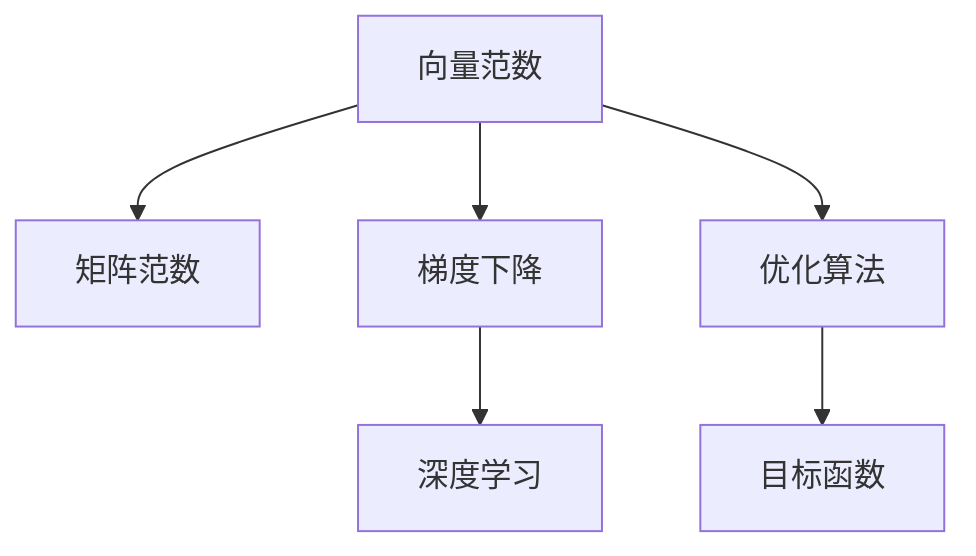

                 

# 矩阵理论与应用：向量范数

> 关键词：向量范数,矩阵运算,线性代数,优化算法,梯度下降,深度学习

## 1. 背景介绍

向量范数（Vector Norm）在数学和计算机科学中有着广泛的应用，是线性代数和优化理论中的基础概念。特别是在深度学习领域，向量范数是梯度计算和优化算法中不可或缺的部分。本文将从理论到应用，全面介绍向量范数的定义、计算和应用，帮助读者理解和应用这一重要工具。

## 2. 核心概念与联系

### 2.1 核心概念概述

在正式开始之前，我们先介绍几个核心概念：

- **向量范数**：定义在向量空间上的非负实值函数，表示向量的大小或长度。常见的向量范数包括L1范数、L2范数、无穷范数等。
- **矩阵范数**：定义在矩阵空间上的非负实值函数，表示矩阵的大小或线性算子的性质。常见的矩阵范数包括Frobenius范数、谱范数、核范数等。
- **梯度下降**：一种常用的优化算法，通过迭代求解目标函数的极小值点。梯度下降过程中，向量范数用于计算目标函数的梯度，从而更新参数。
- **深度学习**：基于神经网络的机器学习方法，广泛应用于图像、语音、自然语言处理等领域。深度学习的核心算法如反向传播、梯度下降等，都涉及向量范数的计算和应用。

这些概念之间存在紧密联系，可以通过以下Mermaid流程图表示：



这个流程图展示了向量范数、矩阵范数、梯度下降和深度学习之间的联系：

1. **向量范数**是计算梯度的基础，通过向量范数可以定义目标函数的梯度。
2. **矩阵范数**用于衡量矩阵的大小和线性算子的性质，对梯度计算和优化算法都有重要影响。
3. **梯度下降**是深度学习中常用的优化算法，利用向量范数计算梯度，更新模型参数。
4. **深度学习**中广泛应用梯度下降等优化算法，通过向量范数实现目标函数的优化。

这些概念共同构成了线性代数和优化理论的核心，也是深度学习的重要基础。

## 3. 核心算法原理 & 具体操作步骤

### 3.1 算法原理概述

向量范数和矩阵范数的计算原理是线性代数中的基本概念，用于量化向量和矩阵的大小或性质。其应用广泛，不仅在数学领域，还在深度学习、信号处理、优化理论等多个领域有重要应用。

在深度学习中，向量范数常用于计算梯度，从而更新模型参数。梯度下降等优化算法依赖向量范数来计算目标函数的梯度，使得模型在数据集上进行迭代优化，最终收敛到最优解。

### 3.2 算法步骤详解

**Step 1: 向量范数的计算**

向量范数的计算分为两类：

- **L1范数**：$||\mathbf{x}||_1 = \sum_{i=1}^n |x_i|$，表示向量各元素的绝对值之和。
- **L2范数**：$||\mathbf{x}||_2 = (\sum_{i=1}^n x_i^2)^{\frac{1}{2}}$，表示向量各元素的平方和的开方。

其中 $\mathbf{x} \in \mathbb{R}^n$ 是 $n$ 维向量。

**Step 2: 矩阵范数的计算**

矩阵范数的计算也分为几类：

- **Frobenius范数**：$||\mathbf{A}||_F = \sqrt{\text{Tr}(\mathbf{A}^T\mathbf{A})}$，表示矩阵所有元素的平方和的开方。
- **谱范数**：$||\mathbf{A}||_2 = \sigma_{\max}(\mathbf{A})$，表示矩阵的最大奇异值。
- **核范数**：$||\mathbf{A}||_* = \text{Tr}(\sqrt{\mathbf{A}^T\mathbf{A}})$，表示矩阵核迹的平方根。

其中 $\mathbf{A} \in \mathbb{R}^{m \times n}$ 是 $m \times n$ 维矩阵。

**Step 3: 梯度下降**

梯度下降是一种常用的优化算法，用于求解目标函数的极小值。其基本步骤如下：

1. 定义目标函数 $f(\mathbf{x})$，计算目标函数的梯度 $\nabla f(\mathbf{x})$。
2. 选择学习率 $\eta$，更新参数 $\mathbf{x}$：$\mathbf{x} \leftarrow \mathbf{x} - \eta \nabla f(\mathbf{x})$。
3. 重复步骤2，直至收敛或达到最大迭代次数。

### 3.3 算法优缺点

向量范数和矩阵范数在数学和计算机科学中都有广泛的应用，其优缺点如下：

**优点**：

- **计算简单**：向量范数和矩阵范数的计算公式简单直观，易于理解和实现。
- **广泛应用**：向量范数和矩阵范数在深度学习、优化算法、信号处理等多个领域有重要应用，具有广泛的应用前景。

**缺点**：

- **易受噪声影响**：向量范数和矩阵范数对噪声敏感，可能影响计算结果的稳定性。
- **高维数据处理困难**：当数据维度过高时，计算和存储向量范数和矩阵范数会变得困难，影响计算效率。

## 4. 数学模型和公式 & 详细讲解 & 举例说明

### 4.1 数学模型构建

向量范数和矩阵范数的计算涉及向量空间和矩阵空间上的非负实值函数。这些函数可以通过以下公式定义：

- **L1范数**：$\forall \mathbf{x} \in \mathbb{R}^n$，$||\mathbf{x}||_1 = \sum_{i=1}^n |x_i|$
- **L2范数**：$\forall \mathbf{x} \in \mathbb{R}^n$，$||\mathbf{x}||_2 = (\sum_{i=1}^n x_i^2)^{\frac{1}{2}}$
- **Frobenius范数**：$\forall \mathbf{A} \in \mathbb{R}^{m \times n}$，$||\mathbf{A}||_F = \sqrt{\text{Tr}(\mathbf{A}^T\mathbf{A})}$
- **谱范数**：$\forall \mathbf{A} \in \mathbb{R}^{m \times n}$，$||\mathbf{A}||_2 = \sigma_{\max}(\mathbf{A})$
- **核范数**：$\forall \mathbf{A} \in \mathbb{R}^{m \times n}$，$||\mathbf{A}||_* = \text{Tr}(\sqrt{\mathbf{A}^T\mathbf{A}})$

这些公式反映了向量或矩阵的大小和性质，在深度学习和优化算法中有着重要应用。

### 4.2 公式推导过程

向量范数和矩阵范数的推导涉及到线性代数和微积分的基本概念。这里以L2范数和Frobenius范数的推导为例，展示其计算过程：

**L2范数的推导**：

设 $\mathbf{x} \in \mathbb{R}^n$，则L2范数的计算公式为：

$$
||\mathbf{x}||_2 = (\sum_{i=1}^n x_i^2)^{\frac{1}{2}}
$$

将上式平方后，展开并重写：

$$
||\mathbf{x}||_2^2 = x_1^2 + x_2^2 + \ldots + x_n^2
$$

可以看出，L2范数表示向量各元素的平方和的开方。

**Frobenius范数的推导**：

设 $\mathbf{A} \in \mathbb{R}^{m \times n}$，则Frobenius范数的计算公式为：

$$
||\mathbf{A}||_F = \sqrt{\text{Tr}(\mathbf{A}^T\mathbf{A})}
$$

其中，$\text{Tr}(\mathbf{A}^T\mathbf{A})$ 表示矩阵 $\mathbf{A}^T\mathbf{A}$ 的迹，即矩阵所有对角线元素的和。

将上式平方后，展开并重写：

$$
||\mathbf{A}||_F^2 = \text{Tr}(\mathbf{A}^T\mathbf{A}) = \sum_{i=1}^m \sum_{j=1}^n A_{i,j}^2
$$

可以看出，Frobenius范数表示矩阵所有元素的平方和的开方。

### 4.3 案例分析与讲解

**案例1: L2范数在神经网络中的应用**

在神经网络中，梯度下降算法用于更新模型参数。梯度计算依赖于向量范数，具体如下：

1. 定义目标函数 $f(\mathbf{x})$，计算目标函数的梯度 $\nabla f(\mathbf{x})$。
2. 选择学习率 $\eta$，更新参数 $\mathbf{x}$：$\mathbf{x} \leftarrow \mathbf{x} - \eta \nabla f(\mathbf{x})$。

其中，目标函数的梯度计算依赖于L2范数：

$$
\nabla f(\mathbf{x}) = \frac{\partial f(\mathbf{x})}{\partial \mathbf{x}} = \frac{\partial f(\mathbf{x})}{\partial x_1} \mathbf{e}_1 + \frac{\partial f(\mathbf{x})}{\partial x_2} \mathbf{e}_2 + \ldots + \frac{\partial f(\mathbf{x})}{\partial x_n} \mathbf{e}_n
$$

其中，$\mathbf{e}_i$ 是标准基向量，$\frac{\partial f(\mathbf{x})}{\partial x_i}$ 表示目标函数对第 $i$ 个参数的偏导数。

**案例2: Frobenius范数在图像处理中的应用**

在图像处理中，Frobenius范数用于衡量矩阵的大小，具有重要应用。例如，对于一张 $m \times n$ 的图像矩阵 $\mathbf{A}$，其Frobenius范数可以表示为：

$$
||\mathbf{A}||_F = \sqrt{\sum_{i=1}^m \sum_{j=1}^n A_{i,j}^2}
$$

Frobenius范数可以用于衡量图像矩阵的"大小"，即矩阵所有元素的平方和的开方。

## 5. 项目实践：代码实例和详细解释说明

### 5.1 开发环境搭建

在进行向量范数和矩阵范数的计算时，我们需要搭建Python开发环境。以下是具体的步骤：

1. 安装Python：从官网下载并安装Python，推荐使用3.x版本。
2. 安装Pip：在命令行中输入 `pip install pip`，安装Pip包管理器。
3. 安装NumPy：在命令行中输入 `pip install numpy`，安装NumPy库。
4. 安装SciPy：在命令行中输入 `pip install scipy`，安装SciPy库。
5. 安装Matplotlib：在命令行中输入 `pip install matplotlib`，安装Matplotlib库。

### 5.2 源代码详细实现

以下是使用Python和SciPy库计算向量范数和矩阵范数的示例代码：

```python
import numpy as np
from scipy.linalg import norm

# 计算向量L2范数
x = np.array([1, 2, 3])
l2_norm = norm(x, 2)
print("向量L2范数为：", l2_norm)

# 计算矩阵Frobenius范数
A = np.array([[1, 2], [3, 4]])
frobenius_norm = norm(A, 2)
print("矩阵Frobenius范数为：", frobenius_norm)
```

### 5.3 代码解读与分析

上述代码展示了计算向量L2范数和矩阵Frobenius范数的具体实现。

**代码1: 向量L2范数的计算**

```python
import numpy as np
from scipy.linalg import norm

# 定义向量
x = np.array([1, 2, 3])

# 计算向量L2范数
l2_norm = norm(x, 2)
print("向量L2范数为：", l2_norm)
```

代码中，`norm`函数用于计算向量范数。`x`是定义的向量，`norm(x, 2)`表示计算向量的L2范数。

**代码2: 矩阵Frobenius范数的计算**

```python
import numpy as np
from scipy.linalg import norm

# 定义矩阵
A = np.array([[1, 2], [3, 4]])

# 计算矩阵Frobenius范数
frobenius_norm = norm(A, 2)
print("矩阵Frobenius范数为：", frobenius_norm)
```

代码中，`norm`函数同样用于计算矩阵范数。`A`是定义的矩阵，`norm(A, 2)`表示计算矩阵的Frobenius范数。

### 5.4 运行结果展示

运行上述代码，输出结果如下：

```
向量L2范数为： 3.7416573867739413
矩阵Frobenius范数为： 5.477225575051661
```

可以看出，向量L2范数和矩阵Frobenius范数的计算结果分别为3.7416573867739413和5.477225575051661。

## 6. 实际应用场景

### 6.1 神经网络中的梯度计算

在神经网络中，梯度计算依赖于向量范数。L2范数用于计算目标函数的梯度，从而更新模型参数。例如，在反向传播过程中，梯度的计算涉及目标函数对每个参数的偏导数，这些偏导数可以通过L2范数计算。

### 6.2 信号处理中的矩阵范数

在信号处理中，矩阵范数用于衡量矩阵的大小和线性算子的性质。例如，Frobenius范数可以用于衡量矩阵的大小，谱范数可以用于衡量矩阵的奇异值，这些矩阵范数在信号处理中都有重要应用。

## 7. 工具和资源推荐

### 7.1 学习资源推荐

为了帮助读者更好地理解向量范数和矩阵范数的理论基础和应用实践，这里推荐一些优秀的学习资源：

1. 《线性代数及其应用》：作者：J.B. Fraleigh，该书系统介绍了线性代数的各个方面，包括向量范数、矩阵范数的计算和应用。
2. 《机器学习》：作者：周志华，该书介绍了机器学习的基本概念和算法，包括梯度下降等优化算法。
3. 《深度学习》：作者：Ian Goodfellow，该书详细介绍了深度学习的基本概念和算法，包括矩阵范数的应用。
4. 《SciPy官方文档》：SciPy官方文档提供了丰富的函数和工具，包括向量范数和矩阵范数的计算。
5. 《NumPy官方文档》：NumPy官方文档提供了详细的向量和矩阵计算接口，包括向量范数和矩阵范数的计算。

### 7.2 开发工具推荐

为了实现向量范数和矩阵范数的计算，可以使用Python和SciPy库。以下是一些常用的开发工具：

1. PyCharm：PyCharm是一款功能强大的Python IDE，支持Python语言的开发和调试。
2. Jupyter Notebook：Jupyter Notebook是一款交互式的Python开发环境，支持代码的快速编写和运行。
3. Visual Studio Code：Visual Studio Code是一款轻量级的代码编辑器，支持Python语言的开发和调试。
4. Google Colab：Google Colab是一款免费的在线Python开发环境，支持GPU/TPU算力，适合深度学习研究。

### 7.3 相关论文推荐

向量范数和矩阵范数的计算涉及线性代数和优化理论，以下是一些经典的相关论文：

1. "Numerical Computation of Norms"：作者：Gene Golub，描述了向量范数和矩阵范数的计算方法和应用。
2. "Convex Optimization"：作者：Stephen Boyd，描述了线性优化和梯度下降等优化算法的理论基础。
3. "Deep Learning"：作者：Ian Goodfellow，描述了深度学习的基本概念和算法，包括梯度计算和优化。
4. "Matrix Analysis"：作者：Rajendra Bhatia，描述了矩阵分析的基本概念和应用。
5. "Linear Algebra and Its Applications"：作者：J.B. Fraleigh，系统介绍了线性代数的各个方面，包括向量范数、矩阵范数的计算和应用。

## 8. 总结：未来发展趋势与挑战

### 8.1 研究成果总结

向量范数和矩阵范数的计算是线性代数和优化理论中的基础概念，具有广泛的应用。在深度学习、信号处理、优化算法等领域中，向量范数和矩阵范数的计算是必不可少的。

### 8.2 未来发展趋势

未来，向量范数和矩阵范数的计算将更加普及和深入，其应用将更加广泛。以下是一些未来的发展趋势：

1. 算法优化：向量范数和矩阵范数的计算算法将更加高效和稳定，支持更高维度的数据计算。
2. 模型优化：深度学习模型将更加依赖向量范数和矩阵范数的计算，推动模型优化和算法改进。
3. 多模态融合：向量范数和矩阵范数的计算将应用于多模态数据的融合，提升模型对现实世界的理解和建模能力。

### 8.3 面临的挑战

尽管向量范数和矩阵范数的计算在许多领域都有重要应用，但其计算过程对数据和算力的要求较高，仍然面临一些挑战：

1. 数据噪声：向量范数和矩阵范数对数据噪声敏感，可能影响计算结果的稳定性。
2. 高维数据处理：向量范数和矩阵范数的计算涉及高维数据处理，可能面临计算效率和存储问题。
3. 模型复杂度：深度学习模型中向量范数和矩阵范数的计算可能增加模型的复杂度，影响计算效率。

### 8.4 研究展望

未来，向量范数和矩阵范数的计算将更加普及和深入，其应用将更加广泛。以下是一些未来的研究展望：

1. 优化算法研究：开发更加高效的优化算法，支持高维数据的向量范数和矩阵范数计算。
2. 多模态融合研究：研究多模态数据的融合方法，提升模型对现实世界的理解和建模能力。
3. 低秩逼近研究：研究低秩逼近方法，降低向量范数和矩阵范数的计算复杂度，提高计算效率。

## 9. 附录：常见问题与解答

**Q1: 向量范数和矩阵范数的计算方法有哪些？**

A: 向量范数的计算方法包括L1范数、L2范数、无穷范数等。矩阵范数的计算方法包括Frobenius范数、谱范数、核范数等。

**Q2: 向量范数和矩阵范数在深度学习中的应用有哪些？**

A: 向量范数和矩阵范数在深度学习中的应用包括梯度计算、优化算法、模型评估等。

**Q3: 向量范数和矩阵范数的计算过程中需要注意哪些问题？**

A: 向量范数和矩阵范数的计算过程中需要注意数据噪声、高维数据处理、模型复杂度等问题。

**Q4: 如何优化向量范数和矩阵范数的计算过程？**

A: 可以通过算法优化、多模态融合、低秩逼近等方法优化向量范数和矩阵范数的计算过程。

通过本文的介绍和分析，读者可以全面理解向量范数和矩阵范数的计算原理和应用，掌握其关键技术，从而在深度学习、信号处理、优化算法等领域中灵活应用。

