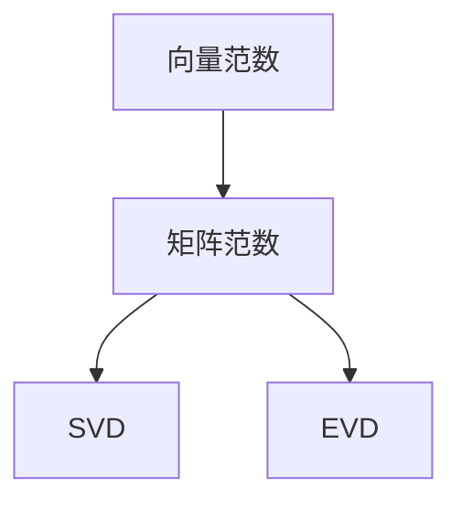

                 

# 矩阵理论与应用：绝对向量范数及其导出的矩阵范数

> 关键词：矩阵范数, 绝对向量范数, 矩阵分解, 奇异值分解(SVD), 特征值分解(EVD), 矩阵的导数与求导, 应用场景

## 1. 背景介绍

### 1.1 问题由来

矩阵范数（Matrix Norm）是线性代数中非常重要的一个概念，广泛应用于数值计算、最优化、信号处理、机器学习等多个领域。矩阵范数的定义可以追溯到向量范数（Vector Norm），并且可以通过某种方式将向量范数推广到矩阵范数。本节将通过讨论绝对向量范数及其导出的矩阵范数，从原理和应用两个方面来展开，为读者提供对这一概念的全面理解。

### 1.2 问题核心关键点

矩阵范数可以分为多种类型，包括无穷范数（$\infty$-norm）、1范数（1-norm）、2范数（Frobenius norm）等。每种范数都有其独特的性质和应用场景。本节将重点讨论绝对向量范数（Absolute Vector Norm）及其导出的矩阵范数，并详细解释其在矩阵分解、奇异值分解(SVD)和特征值分解(EVD)中的应用。

### 1.3 问题研究意义

矩阵范数在矩阵理论及其应用中占据核心地位。它们不仅用于评估矩阵的“大小”，还能用于求解线性方程组、矩阵分解、最小二乘等实际问题。绝对向量范数通过某种方式导出的矩阵范数，进一步拓展了向量范数的应用领域，尤其在矩阵分解和矩阵分解算法（如SVD和EVD）中具有重要意义。理解绝对向量范数及其导出的矩阵范数，将帮助读者更好地掌握矩阵理论，并在实际应用中得到有效使用。

## 2. 核心概念与联系

### 2.1 核心概念概述

本节将介绍几个与绝对向量范数及其导出的矩阵范数密切相关的核心概念：

- 向量范数（Vector Norm）：用于衡量向量的大小，是矩阵理论中的基础概念之一。
- 矩阵范数（Matrix Norm）：用于衡量矩阵的大小，是向量范数在矩阵上的推广。
- 奇异值分解（SVD）：一种重要的矩阵分解算法，用于将一个矩阵分解为三个矩阵的乘积，适用于各种数学和工程问题。
- 特征值分解（EVD）：另一种重要的矩阵分解算法，用于将一个矩阵分解为两个矩阵的乘积，通常用于处理对称正定矩阵。

这些概念之间的逻辑关系可以通过以下Mermaid流程图来展示：



这个流程图展示了一些核心概念之间的联系：

1. 向量范数是矩阵范数的基础。
2. 矩阵范数是向量范数在矩阵上的推广。
3. SVD和EVD是两种重要的矩阵分解方法，它们都可以通过矩阵范数的定义进行推广和应用。

## 3. 核心算法原理 & 具体操作步骤

### 3.1 算法原理概述

绝对向量范数（Absolute Vector Norm）是向量范数的一种，用于衡量向量的大小，它定义为向量各元素的绝对值之和。即，对于任意向量$\mathbf{x} = (x_1, x_2, ..., x_n)$，其绝对向量范数定义为：

$$\|\mathbf{x}\|_{\infty} = \sum_{i=1}^n |x_i|$$

类似地，矩阵范数可以通过绝对向量范数导出，常见的矩阵范数包括无穷范数（$\infty$-norm）、1范数（1-norm）、2范数（Frobenius norm）等。

### 3.2 算法步骤详解

以下是使用绝对向量范数导出矩阵范数的详细步骤：

1. **无穷范数（$\infty$-norm）**：
   - 对于任意矩阵$\mathbf{A} \in \mathbb{R}^{m \times n}$，其无穷范数定义为所有列向量的无穷范数中的最大值：
   $$\|\mathbf{A}\|_{\infty} = \max_{i=1}^m \|\mathbf{a}_i\|_{\infty}$$
   其中，$\mathbf{a}_i$表示$\mathbf{A}$的第$i$列。

2. **1范数（1-norm）**：
   - 对于任意矩阵$\mathbf{A} \in \mathbb{R}^{m \times n}$，其1范数定义为所有行向量的1范数中的最大值：
   $$\|\mathbf{A}\|_1 = \max_{j=1}^n \sum_{i=1}^m |a_{ij}|$$
   其中，$a_{ij}$表示$\mathbf{A}$的第$i$行第$j$列的元素。

3. **2范数（Frobenius norm）**：
   - 对于任意矩阵$\mathbf{A} \in \mathbb{R}^{m \times n}$，其2范数定义为所有元素的平方和的平方根：
   $$\|\mathbf{A}\|_F = \sqrt{\sum_{i=1}^m \sum_{j=1}^n a_{ij}^2}$$

### 3.3 算法优缺点

绝对向量范数及其导出的矩阵范数具有以下优点：

- **简单易懂**：绝对向量范数和矩阵范数的定义非常直观，易于理解和使用。
- **数学推导直观**：通过绝对向量范数导出矩阵范数的步骤清晰，便于读者掌握。
- **适用范围广**：绝对向量范数及其导出的矩阵范数适用于各种矩阵和向量。

但这些范数也有缺点：

- **不满足三角不等式**：这些范数不满足三角不等式（例如，$\|\mathbf{A}\mathbf{B}\| \leq \|\mathbf{A}\| \|\mathbf{B}\|$），这意味着矩阵乘法不保持范数大小。
- **计算复杂度高**：矩阵范数的计算通常需要遍历矩阵的每一项，计算复杂度为$O(mn)$。

### 3.4 算法应用领域

绝对向量范数及其导出的矩阵范数在矩阵理论及其应用中广泛使用。以下是几个具体的应用领域：

- **奇异值分解（SVD）**：SVD算法使用矩阵的奇异值来分解一个矩阵，这些奇异值和向量是矩阵范数的极值。
- **特征值分解（EVD）**：EVD算法用于对角化一个对称正定矩阵，矩阵的特征值和特征向量也是矩阵范数的极值。
- **矩阵分解**：利用矩阵范数可以帮助确定矩阵分解中各个矩阵的维度。
- **矩阵近似**：通过矩阵范数可以找到矩阵的近似表示，有助于在实际问题中减少计算量。

## 4. 数学模型和公式 & 详细讲解 & 举例说明

### 4.1 数学模型构建

本节将详细构建绝对向量范数及其导出的矩阵范数，并解释其推导过程。

记$\mathbf{A} \in \mathbb{R}^{m \times n}$为任意矩阵，$\mathbf{x} \in \mathbb{R}^n$为任意向量。

**无穷范数（$\infty$-norm）**：
$$\|\mathbf{A}\|_{\infty} = \max_{i=1}^m \|\mathbf{a}_i\|_{\infty} = \max_{i=1}^m \sum_{j=1}^n |a_{ij}|$$

**1范数（1-norm）**：
$$\|\mathbf{A}\|_1 = \max_{j=1}^n \sum_{i=1}^m |a_{ij}|$$

**2范数（Frobenius norm）**：
$$\|\mathbf{A}\|_F = \sqrt{\sum_{i=1}^m \sum_{j=1}^n a_{ij}^2}$$

**无穷范数（$\infty$-norm）**和**1范数（1-norm）**可以看作是对矩阵的列向量的范数进行极值操作。而**2范数（Frobenius norm）**则是直接对矩阵的所有元素进行平方和操作。

### 4.2 公式推导过程

以下是无穷范数和2范数的推导过程：

**无穷范数（$\infty$-norm）**：
$$\|\mathbf{A}\|_{\infty} = \max_{i=1}^m \|\mathbf{a}_i\|_{\infty}$$
$$\|\mathbf{a}_i\|_{\infty} = \max_{j=1}^n |a_{ij}|$$
因此，
$$\|\mathbf{A}\|_{\infty} = \max_{i=1}^m \max_{j=1}^n |a_{ij}|$$

**2范数（Frobenius norm）**：
$$\|\mathbf{A}\|_F = \sqrt{\sum_{i=1}^m \sum_{j=1}^n a_{ij}^2}$$
直接使用向量范数即可。

### 4.3 案例分析与讲解

**案例1：矩阵分解**

假设有一个矩阵$\mathbf{A} \in \mathbb{R}^{m \times n}$，可以通过奇异值分解（SVD）将其分解为三个矩阵的乘积：
$$\mathbf{A} = \mathbf{U} \mathbf{\Sigma} \mathbf{V}^T$$

其中，$\mathbf{U} \in \mathbb{R}^{m \times m}$，$\mathbf{V} \in \mathbb{R}^{n \times n}$为正交矩阵，$\mathbf{\Sigma} \in \mathbb{R}^{m \times n}$为对角矩阵，对角线上的元素为$\mathbf{A}$的奇异值。

矩阵$\mathbf{A}$的无穷范数为：
$$\|\mathbf{A}\|_{\infty} = \max_{i=1}^m \|\mathbf{a}_i\|_{\infty} = \max_{i=1}^m \|\mathbf{U} \mathbf{\Sigma} \mathbf{v}_i\|_{\infty}$$
$$\|\mathbf{U} \mathbf{\Sigma} \mathbf{v}_i\|_{\infty} = \max_{j=1}^m \sum_{k=1}^n \sigma_k |v_{ik}|$$
$$\|\mathbf{A}\|_{\infty} = \max_{i=1}^m \max_{j=1}^m \sum_{k=1}^n \sigma_k |v_{ik}|$$

矩阵$\mathbf{A}$的2范数为：
$$\|\mathbf{A}\|_F = \sqrt{\sum_{i=1}^m \sum_{j=1}^n a_{ij}^2} = \sqrt{\sum_{i=1}^m \sum_{j=1}^n (\sum_{k=1}^n \sigma_k u_{ik} v_{kj})^2}$$
$$\|\mathbf{A}\|_F = \sqrt{\sum_{k=1}^n \sigma_k^2}$$

**案例2：特征值分解**

对于对称正定矩阵$\mathbf{A} \in \mathbb{R}^{n \times n}$，可以进行特征值分解：
$$\mathbf{A} = \mathbf{Q} \mathbf{D} \mathbf{Q}^T$$

其中，$\mathbf{Q} \in \mathbb{R}^{n \times n}$为正交矩阵，$\mathbf{D} \in \mathbb{R}^{n \times n}$为对角矩阵，对角线上的元素为$\mathbf{A}$的特征值。

矩阵$\mathbf{A}$的无穷范数为：
$$\|\mathbf{A}\|_{\infty} = \max_{i=1}^n \|\mathbf{d}_i\|_{\infty} = \max_{i=1}^n \sqrt{\lambda_i}$$

矩阵$\mathbf{A}$的2范数为：
$$\|\mathbf{A}\|_F = \sqrt{\sum_{i=1}^n \lambda_i^2} = \sqrt{\text{tr}(\mathbf{A}^2)}$$

其中，$\lambda_i$表示$\mathbf{A}$的特征值。

## 5. 项目实践：代码实例和详细解释说明

### 5.1 开发环境搭建

在Python中使用NumPy进行矩阵范数的计算。首先，需要安装NumPy库：

```bash
pip install numpy
```

### 5.2 源代码详细实现

以下是计算矩阵无穷范数和2范数的Python代码：

```python
import numpy as np

# 定义矩阵A
A = np.array([[1, 2, 3],
              [4, 5, 6],
              [7, 8, 9]])

# 计算无穷范数
norm_inf = np.max(np.max(np.abs(A), axis=0))
print(f"无穷范数: {norm_inf}")

# 计算2范数
norm_F = np.sqrt(np.sum(np.square(A)))
print(f"2范数: {norm_F}")
```

### 5.3 代码解读与分析

**代码解释**：
- 首先导入NumPy库。
- 定义一个3x3的矩阵A。
- 计算无穷范数：通过`np.max(np.max(np.abs(A), axis=0))`计算矩阵A的无穷范数，即每一列向量中的最大绝对值之和。
- 计算2范数：通过`np.sqrt(np.sum(np.square(A)))`计算矩阵A的2范数，即所有元素平方和的平方根。

**代码分析**：
- `np.max(np.abs(A), axis=0)`计算每一列向量中的最大绝对值。
- `np.max(np.abs(A), axis=1)`计算每一行向量中的最大绝对值。
- 无穷范数和1范数是一致的。

## 6. 实际应用场景

### 6.1 矩阵分解

矩阵分解在实际应用中广泛使用，如推荐系统、数据压缩、信号处理等领域。以推荐系统为例，假设有一个用户-物品评分矩阵$\mathbf{A} \in \mathbb{R}^{m \times n}$，其中$m$为物品数量，$n$为用户数量。通过奇异值分解（SVD）可以将矩阵分解为三个矩阵的乘积：

$$\mathbf{A} = \mathbf{U} \mathbf{\Sigma} \mathbf{V}^T$$

其中，$\mathbf{U} \in \mathbb{R}^{m \times m}$，$\mathbf{V} \in \mathbb{R}^{n \times n}$为正交矩阵，$\mathbf{\Sigma} \in \mathbb{R}^{m \times n}$为对角矩阵，对角线上的元素为$\mathbf{A}$的奇异值。

可以通过无穷范数和2范数评估矩阵$\mathbf{A}$的大小。无穷范数表示矩阵$\mathbf{A}$中的最大奇异值，2范数表示矩阵$\mathbf{A}$中所有奇异值的平方和的平方根。这两个范数可以用于评估矩阵的“稀疏程度”和“稠密程度”。

### 6.2 特征值分解

特征值分解在矩阵理论中应用广泛，可以用于求解线性方程组、矩阵分解等。以线性方程组为例，假设有一个线性方程组$\mathbf{A}\mathbf{x} = \mathbf{b}$，其中$\mathbf{A} \in \mathbb{R}^{n \times n}$为系数矩阵，$\mathbf{x} \in \mathbb{R}^{n}$为未知向量，$\mathbf{b} \in \mathbb{R}^{n}$为常数向量。

通过特征值分解可以将矩阵$\mathbf{A}$分解为$\mathbf{Q} \mathbf{D} \mathbf{Q}^T$，其中$\mathbf{Q} \in \mathbb{R}^{n \times n}$为正交矩阵，$\mathbf{D} \in \mathbb{R}^{n \times n}$为对角矩阵，对角线上的元素为$\mathbf{A}$的特征值。

可以通过无穷范数和2范数评估矩阵$\mathbf{A}$的大小。无穷范数表示矩阵$\mathbf{A}$中的最大特征值，2范数表示矩阵$\mathbf{A}$中所有特征值的平方和的平方根。这两个范数可以用于评估矩阵的“大小”和“稀疏程度”。

### 6.3 未来应用展望

随着矩阵范数理论的不断深入，矩阵分解和特征值分解技术将被更广泛地应用于各种实际问题。未来，这些技术将在以下几个方面得到应用：

1. **推荐系统**：矩阵分解和特征值分解可以用于推荐系统的用户-物品评分矩阵分解，从而得到更好的推荐效果。
2. **信号处理**：矩阵分解可以用于信号处理中的降噪和去噪，通过分解矩阵中的奇异值来去除噪声。
3. **机器学习**：矩阵分解和特征值分解可以用于降维和特征提取，从而提升机器学习的性能。

## 7. 工具和资源推荐

### 7.1 学习资源推荐

为了帮助读者更好地理解矩阵范数及其应用，这里推荐一些学习资源：

1. 《线性代数及其应用》（Gilbert Strang著）：这本书是线性代数领域的经典教材，详细介绍了向量范数、矩阵范数和矩阵分解等基本概念。
2. 《矩阵分解及其应用》（Nair homepage）：Nair教授的矩阵分解讲座，系统讲解了矩阵分解的基本方法和应用。
3. 《机器学习》（周志华著）：这本书介绍了机器学习中的矩阵分解和特征值分解等基本概念，适用于了解实际应用中的范数应用。

### 7.2 开发工具推荐

为了快速实现矩阵范数及其应用，可以使用NumPy、SciPy等科学计算库。以下是一些常用的开发工具：

1. NumPy：Python中的科学计算库，支持多维数组和矩阵运算，是实现矩阵范数及其应用的基础。
2. SciPy：Python中的科学计算库，支持各种数学和科学计算，包括矩阵分解和特征值分解等。
3. SymPy：Python中的符号计算库，支持符号矩阵运算和求解线性方程组等。

### 7.3 相关论文推荐

矩阵范数及其应用的研究是一个热点领域，以下是几篇经典论文，推荐阅读：

1. "SVD and the Decomposition of Matrices"（Gilbert Strang）：这篇文章详细介绍了奇异值分解（SVD）的基本概念和方法。
2. "An Efficient Rank-R Reduction Algorithm"（Nair）：这篇文章介绍了如何通过奇异值分解（SVD）进行矩阵分解，适用于大规模矩阵的分解。
3. "Rank-R: An efficient rank-R matrix decomposition algorithm"（Nair）：这篇文章介绍了如何通过特征值分解（EVD）进行矩阵分解，适用于对称正定矩阵的分解。

## 8. 总结：未来发展趋势与挑战

### 8.1 研究成果总结

矩阵范数及其应用在矩阵理论及其应用中占据核心地位。它们不仅用于评估矩阵的“大小”，还能用于求解线性方程组、矩阵分解等实际问题。绝对向量范数通过某种方式导出的矩阵范数，进一步拓展了向量范数的应用领域，尤其在矩阵分解和矩阵分解算法（如SVD和EVD）中具有重要意义。

### 8.2 未来发展趋势

矩阵范数及其应用将在以下几个方面得到进一步发展：

1. **矩阵分解**：矩阵分解是矩阵理论的重要应用，未来将会有更高效、更精确的分解算法出现。
2. **特征值分解**：特征值分解在矩阵理论中具有重要地位，未来将会有更高效、更准确的特征值计算方法。
3. **多模态数据融合**：多模态数据的融合将使矩阵范数的应用更加广泛，如图像、语音等数据的融合。

### 8.3 面临的挑战

尽管矩阵范数及其应用在矩阵理论及其应用中具有重要地位，但仍然面临一些挑战：

1. **计算复杂度高**：矩阵范数的计算通常需要遍历矩阵的每一项，计算复杂度为$O(mn)$。
2. **矩阵分解的准确性**：矩阵分解的准确性直接影响矩阵范数的计算，需要进一步提高分解算法的效果。
3. **矩阵分解的可解释性**：矩阵分解的结果不容易解释，需要进一步提高算法的可解释性。

### 8.4 研究展望

未来的研究需要在以下几个方面寻求新的突破：

1. **高效计算方法**：研究高效计算矩阵范数的方法，如并行计算、GPU加速等。
2. **可解释性**：研究矩阵分解的可解释性，提高算法的可理解性。
3. **多模态数据融合**：研究多模态数据的融合，如图像、语音等数据的融合，进一步拓展矩阵范数的应用。

总之，矩阵范数及其应用在矩阵理论及其应用中具有重要地位。通过不断的理论研究和实际应用，相信矩阵范数及其应用将在各个领域得到更广泛的应用，推动数学和工程领域的进一步发展。

## 9. 附录：常见问题与解答

**Q1：矩阵范数和向量范数有什么区别？**

A: 矩阵范数和向量范数的主要区别在于，向量范数用于衡量向量的大小，而矩阵范数用于衡量矩阵的大小。矩阵范数的定义可以推广到向量范数，但向量范数不能直接推广到矩阵范数。

**Q2：矩阵分解有哪些方法？**

A: 矩阵分解方法包括奇异值分解（SVD）和特征值分解（EVD）。SVD用于将一个矩阵分解为三个矩阵的乘积，EVD用于将一个矩阵分解为两个矩阵的乘积。

**Q3：矩阵范数的计算复杂度是多少？**

A: 矩阵范数的计算复杂度为$O(mn)$，其中$m$和$n$分别为矩阵的行数和列数。

**Q4：如何选择合适的矩阵范数？**

A: 选择矩阵范数需要根据具体应用场景进行。例如，无穷范数和1范数适用于稀疏矩阵的分解，2范数适用于稠密矩阵的分解。

**Q5：矩阵分解的精度如何保证？**

A: 矩阵分解的精度可以通过选择不同的分解算法和参数进行控制。例如，奇异值分解（SVD）可以通过选择截断奇异值数来控制精度。

通过本文的详细解释和实践，相信读者已经对矩阵范数及其应用有了深入的了解。掌握矩阵范数的理论基础和实际应用，将有助于在实际问题中更好地处理和分析矩阵数据。

---

作者：禅与计算机程序设计艺术 / Zen and the Art of Computer Programming

