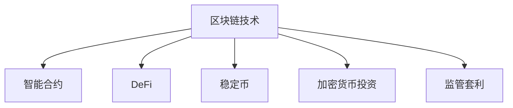

                 

# 硅谷区块链金融创新的监管挑战

## 1. 背景介绍

在数字经济和金融创新的浪潮中，区块链技术的诞生与不断成熟，为金融行业带来了一场深刻变革。作为去中心化的分布式账本技术，区块链能够实现快速交易、提高交易透明度、减少欺诈风险，其去中介化的特性使得金融行业对区块链的探索尤为关注。硅谷作为全球创新中心，金融科技与区块链的结合早已成为热点。

硅谷区块链金融创新主要包括数字货币、智能合约、去中心化交易所、链上金融服务等。区块链金融创新不仅推动了传统金融业务的数字化转型，还催生了许多新兴金融业务模式，如加密货币投资、DeFi借贷、稳定币发行等。然而，这些创新也面临一系列监管挑战，包括但不限于用户保护、市场稳定、洗钱风险、监管套利等。

## 2. 核心概念与联系

### 2.1 核心概念概述

为更好地理解硅谷区块链金融创新的监管挑战，本节将介绍几个关键概念：

- **区块链技术**：一种去中心化的分布式账本技术，以加密算法确保交易记录的完整性和不可篡改性。
- **智能合约**：一种基于区块链的自动执行合约，当预设条件满足时，可自动执行相应的合约条款。
- **去中心化金融(DeFi)**：基于区块链技术的金融服务，不依赖传统金融机构，旨在提供更高效、低成本的金融产品。
- **稳定币**：一种价值稳定、与传统货币挂钩的数字货币，旨在消除区块链资产价格波动的不确定性。
- **加密货币投资**：投资者购买并持有加密货币，通过价格波动赚取收益。
- **监管套利**：利用不同司法管辖区对同一行为的不同监管政策，获取超额收益。

这些核心概念之间的逻辑关系可以通过以下Mermaid流程图来展示：



这个流程图展示出区块链技术的核心概念及其与其他概念之间的联系：

1. 区块链技术提供基础架构。
2. 智能合约在区块链上实现业务逻辑。
3. DeFi基于区块链技术提供创新金融服务。
4. 稳定币为加密货币市场提供价值稳定的资产。
5. 加密货币投资涉及加密资产的价格波动。
6. 监管套利则利用不同监管环境的差异获得收益。

## 3. 核心算法原理 & 具体操作步骤
### 3.1 算法原理概述

硅谷区块链金融创新的监管挑战主要体现在以下几个方面：

1. **用户保护**：如何保障用户数据安全和隐私，防止数据泄露和用户资产被盗。
2. **市场稳定**：如何防止市场操纵，维护加密货币市场的稳定性和透明性。
3. **洗钱风险**：如何识别和防止通过区块链进行的非法资金转移和洗钱活动。
4. **监管套利**：如何识别和应对利用不同司法管辖区监管差异进行的套利行为。

针对这些问题，硅谷的区块链金融创新也在积极探索相应的监管措施。

### 3.2 算法步骤详解

以下将以智能合约为例，详细阐述其设计和操作的监管挑战：

1. **设计智能合约**：智能合约的设计需遵循透明性和可审计性原则，确保合约条款公开可查，防止篡改。此外，合约应避免复杂的业务逻辑，减少潜在的漏洞和漏洞被利用的风险。
2. **验证智能合约**：利用自动化测试工具对智能合约进行全面测试，验证其逻辑正确性和安全性。
3. **部署智能合约**：在区块链上部署智能合约前，需进行安全审计，确认无重大漏洞。部署后，合约的状态和执行情况应公开透明，便于监管。
4. **监控智能合约**：建立智能合约监控机制，及时发现异常行为，防止合约被恶意利用。

### 3.3 算法优缺点

区块链金融创新的监管挑战主要体现在以下几个方面：

**优点**：

1. **提高透明度**：区块链的分布式账本特性使得交易记录公开可查，提高了金融交易的透明度。
2. **降低欺诈风险**：智能合约自动执行特性，减少了人为操作带来的欺诈风险。
3. **减少运营成本**：去中心化特性减少了中间环节，降低了金融服务的运营成本。

**缺点**：

1. **监管复杂性**：区块链技术的分布式特性使得传统监管框架难以适用，增加了监管难度。
2. **技术复杂性**：智能合约的复杂性和多样性，增加了监管的技术难度。
3. **用户保护问题**：区块链的去中介化特性可能使用户资产面临更多安全风险。

### 3.4 算法应用领域

硅谷区块链金融创新的监管挑战主要应用于以下几个领域：

1. **数字货币交易平台**：如何防止市场操纵和洗钱活动。
2. **去中心化借贷平台**：如何确保借款方按时还款，防范违约风险。
3. **稳定币发行和交易**：如何确保稳定币与法定货币挂钩的稳定性。
4. **加密货币投资基金**：如何防范基金经理的道德风险和市场操纵行为。

## 4. 数学模型和公式 & 详细讲解 & 举例说明

### 4.1 数学模型构建

为确保智能合约的公正性和透明度，可构建如下数学模型：

设智能合约参数为 $x_1, x_2, \ldots, x_n$，合约条件为 $y_1, y_2, \ldots, y_m$。智能合约执行结果为 $z$。则合约的执行逻辑可以表示为：

$$
z = f(x_1, x_2, \ldots, x_n; y_1, y_2, \ldots, y_m)
$$

其中 $f$ 为合约执行函数。为确保合约的透明度和可审计性，模型参数和合约条件应公开可查。

### 4.2 公式推导过程

以一个简单的智能合约为例，设合约参数为 $x$，合约条件为 $y$，执行结果为 $z$。则合约执行逻辑可表示为：

$$
z = 
\begin{cases}
y + x, & y \geq 0 \\
y - x, & y < 0
\end{cases}
$$

在合约执行前，需验证合约条件 $y$ 是否满足。验证过程可以表示为：

$$
\text{验证}(y) = 
\begin{cases}
\text{True}, & y \geq 0 \\
\text{False}, & y < 0
\end{cases}
$$

### 4.3 案例分析与讲解

以下以稳定币USDT为例，说明其在区块链金融创新中的应用及监管挑战。

USDT作为稳定币，其价值与美元挂钩。其发行和交易流程可以表示为：

1. **发行过程**：用户通过加密货币向发行方提供相应价值的美元，发行方发行USDT。
2. **交易过程**：用户将USDT在区块链上转让，发行方根据USDT的流通量调整发行量，确保USDT与美元挂钩。

在这个过程中，监管的挑战在于确保USDT的稳定性和透明性：

1. **稳定币的稳定机制**：USDT需具备足够的美元储备，确保其价值稳定。
2. **流通量的透明度**：USDT的流通量应公开透明，便于监管。
3. **反洗钱措施**：通过区块链交易记录，识别和防范洗钱活动。

## 5. 项目实践：代码实例和详细解释说明

### 5.1 开发环境搭建

在硅谷，区块链金融创新项目通常使用以下工具和环境：

1. **区块链平台**：如以太坊、Ripple等，用于搭建智能合约。
2. **编程语言**：如Solidity、Tezos等，用于编写智能合约代码。
3. **开发工具**：如Truffle、Remix等，用于开发、测试和部署智能合约。

以下以以太坊平台为例，展示开发环境搭建过程：

1. **安装Geth**：从官网下载Geth，进行安装。
2. **配置环境**：设置Geth路径和网络参数。
3. **编写智能合约**：使用Solidity编写智能合约代码。
4. **测试智能合约**：在本地测试网中测试智能合约。
5. **部署智能合约**：将智能合约部署到以太坊区块链上。

### 5.2 源代码详细实现

以下是使用Solidity编写的一个简单智能合约的代码实现：

```solidity
// SPDX-License-Identifier: MIT
pragma solidity ^0.8.0;

contract SimpleContract {
    address payable owner;

    event Transfer(address indexed from, address indexed to, uint256 amount);

    constructor() public {
        owner = msg.sender;
    }

    function transfer(address payable receiver, uint256 amount) public {
        require(msg.sender != receiver, "Reject transfer to self");
        require(msg.value == amount, "Insufficient funds");
        owner.balance -= amount;
        receiver.balance += amount;
        emit Transfer(owner, receiver, amount);
    }
}
```

### 5.3 代码解读与分析

以上代码实现了一个简单的智能合约，其功能和逻辑如下：

- **构造函数**：初始化智能合约的持有者。
- **转移函数**：确保资金从持有者转移到指定的接收者，并记录转移日志。

通过该合约，持有者可以通过以太坊钱包进行资产转移，具备基本的金融服务功能。

### 5.4 运行结果展示

在测试网中运行上述智能合约，可以进行如下操作：

1. **创建合约**：通过以太坊钱包创建智能合约实例。
2. **转移资产**：调用智能合约的转移函数进行资产转移。
3. **查看日志**：查看智能合约的转移日志，确认资产转移的记录。

## 6. 实际应用场景

### 6.1 数字货币交易平台

在数字货币交易平台上，智能合约可以用于确保交易的透明度和安全性。例如，智能合约可以自动执行买卖订单，防止订单篡改和市场操纵。

### 6.2 去中心化借贷平台

去中心化借贷平台上的智能合约可以用于确保借款方按时还款，防范违约风险。例如，通过抵押物自动清算机制，确保借贷双方的权利义务。

### 6.3 稳定币发行和交易

稳定币的发行和交易过程中，智能合约可以用于确保稳定币的稳定性和透明度。例如，通过发行方和流通量的自动调整机制，确保稳定币与美元挂钩。

### 6.4 加密货币投资基金

加密货币投资基金的智能合约可以用于防范基金经理的道德风险和市场操纵行为。例如，通过基金经理的自动减仓机制，防止其过度操作。

## 7. 工具和资源推荐

### 7.1 学习资源推荐

为了帮助开发者系统掌握硅谷区块链金融创新的监管挑战，这里推荐一些优质的学习资源：

1. **《区块链基础与技术》**：全面介绍区块链技术和应用，适合初学者入门。
2. **《智能合约设计与开发》**：深入讲解智能合约的开发流程和最佳实践。
3. **《金融科技与区块链创新》**：涵盖金融科技与区块链的创新应用和监管挑战。
4. **《区块链安全与风险管理》**：讲解区块链安全和风险管理的最新技术和方法。
5. **《以太坊开发实战》**：详细指导以太坊平台的智能合约开发和部署。

通过对这些资源的学习实践，相信你一定能够系统掌握硅谷区块链金融创新的监管挑战，并用于解决实际的金融问题。

### 7.2 开发工具推荐

高效的开发离不开优秀的工具支持。以下是几款用于硅谷区块链金融创新开发的常用工具：

1. **Truffle**：以太坊开发框架，提供智能合约的开发、测试和部署功能。
2. **Remix IDE**：以太坊智能合约开发环境，支持代码编写、测试和部署。
3. **Infura**：以太坊网络访问服务，提供区块链网络的基础设施支持。
4. **OpenZeppelin**：智能合约安全库，提供安全审计和最佳实践。
5. **Blockchain.com**：以太坊钱包和开发工具，支持智能合约的部署和管理。

合理利用这些工具，可以显著提升硅谷区块链金融创新项目的开发效率，加快创新迭代的步伐。

### 7.3 相关论文推荐

硅谷区块链金融创新的监管挑战的研究源于学界的持续研究。以下是几篇奠基性的相关论文，推荐阅读：

1. **"Smart Contract Security and Privacy"**：探讨智能合约的安全性和隐私保护。
2. **"The Ethereum Yellow Paper"**：以太坊白皮书，介绍了以太坊平台和智能合约技术。
3. **"Blockchain Technology and Financial Services"**：介绍区块链技术在金融服务中的应用。
4. **"Regulation of Cryptocurrencies and Blockchain Technologies"**：探讨区块链技术的监管挑战和应对策略。
5. **"Designing Secure Smart Contracts"**：指导智能合约的开发和安全性设计。

这些论文代表了大语言模型微调技术的发展脉络。通过学习这些前沿成果，可以帮助研究者把握学科前进方向，激发更多的创新灵感。

## 8. 总结：未来发展趋势与挑战

### 8.1 总结

本文对硅谷区块链金融创新的监管挑战进行了全面系统的介绍。首先阐述了区块链技术的背景和区块链金融创新的应用场景，明确了区块链技术在金融创新中的重要地位。其次，从原理到实践，详细讲解了区块链金融创新的数学模型和算法步骤，给出了智能合约的代码实现。同时，本文还广泛探讨了智能合约在实际应用中的监管挑战，展示了区块链金融创新的广阔前景。此外，本文精选了硅谷区块链金融创新的各类学习资源，力求为读者提供全方位的技术指引。

通过本文的系统梳理，可以看到，硅谷区块链金融创新正在引领全球金融科技的发展，极大地拓展了金融服务的数字化边界，为金融行业带来深刻的变革。未来，伴随区块链技术的不断成熟和普及，硅谷区块链金融创新必将在全球范围内发挥更大的影响力，推动金融科技的进步。

### 8.2 未来发展趋势

展望未来，硅谷区块链金融创新的监管挑战将呈现以下几个发展趋势：

1. **技术创新加速**：随着区块链技术的不断发展，智能合约和DeFi等创新应用将进一步成熟和多样化，带来更多的金融创新。
2. **监管框架完善**：各国监管机构将逐步完善区块链技术的监管框架，确保金融创新的合规性和安全性。
3. **合规工具发展**：基于区块链技术的合规工具将快速发展，提高金融创新的合规效率。
4. **跨界应用拓展**：区块链金融创新将逐步扩展到供应链金融、保险、证券等领域，实现跨界融合。
5. **国际合作加强**：各国监管机构将加强国际合作，共同应对区块链金融创新的监管挑战。

以上趋势凸显了硅谷区块链金融创新的广阔前景。这些方向的探索发展，必将进一步推动区块链技术的成熟和普及，为金融科技的未来带来更多的机遇和挑战。

### 8.3 面临的挑战

尽管硅谷区块链金融创新已经取得了显著成就，但在迈向更加智能化、普适化应用的过程中，它仍面临诸多挑战：

1. **技术复杂性**：智能合约和DeFi等创新应用的复杂性，增加了监管的技术难度。
2. **合规性问题**：不同司法管辖区的监管政策和法律差异，增加了跨境金融创新的合规难度。
3. **用户保护**：区块链的去中介化特性可能使用户资产面临更多安全风险。
4. **市场稳定**：区块链市场的波动性和不稳定性，增加了金融监管的难度。
5. **洗钱风险**：利用区块链进行非法资金转移和洗钱活动的风险，增加了监管的复杂性。

这些挑战需要硅谷和全球监管机构共同努力，寻求更高效的监管手段和技术解决方案。

### 8.4 研究展望

面对硅谷区块链金融创新所面临的挑战，未来的研究需要在以下几个方面寻求新的突破：

1. **技术安全研究**：深入研究智能合约和DeFi等应用的安全性和隐私保护，开发更加安全可靠的区块链技术。
2. **合规工具开发**：开发更高效的合规工具和平台，支持金融创新的合规需求。
3. **国际合作机制**：建立国际合作机制，共同应对跨境金融创新的监管挑战。
4. **用户保护措施**：研究更加严格的用户保护措施，确保用户资产安全。
5. **市场稳定机制**：探索市场稳定机制，减少区块链市场的波动性。

这些研究方向的探索，必将引领硅谷区块链金融创新的监管挑战走向新的高度，为全球金融科技的发展提供新的动力和方向。

## 9. 附录：常见问题与解答

**Q1：区块链金融创新在监管上存在哪些挑战？**

A: 区块链金融创新在监管上面临以下挑战：

1. **用户保护**：区块链的去中介化特性可能使用户资产面临更多安全风险。
2. **市场稳定**：区块链市场的波动性和不稳定性，增加了金融监管的难度。
3. **洗钱风险**：利用区块链进行非法资金转移和洗钱活动的风险。
4. **合规性问题**：不同司法管辖区的监管政策和法律差异，增加了跨境金融创新的合规难度。
5. **技术复杂性**：智能合约和DeFi等创新应用的复杂性，增加了监管的技术难度。

**Q2：如何确保区块链金融创新的合规性？**

A: 确保区块链金融创新的合规性，可以从以下几个方面入手：

1. **建立合规框架**：制定详细的合规框架和操作指南，明确各类金融创新的合规要求。
2. **引入合规工具**：开发基于区块链的合规工具和平台，提高合规效率。
3. **加强国际合作**：各国监管机构应加强国际合作，共同制定跨境金融创新的合规标准。
4. **定期审计**：定期对区块链金融创新项目进行审计，确保合规性。
5. **用户教育**：加强用户教育和风险提示，提高用户对区块链金融创新的认知和防范意识。

**Q3：区块链金融创新在技术上需要注意哪些问题？**

A: 区块链金融创新在技术上需要注意以下问题：

1. **智能合约安全**：智能合约的设计需遵循透明性和可审计性原则，确保合约条款公开可查。
2. **隐私保护**：确保用户数据的隐私保护，防止数据泄露和滥用。
3. **性能优化**：优化智能合约的性能，确保高并发交易的稳定性和效率。
4. **跨链互操作**：探索跨链互操作技术，实现不同区块链平台之间的互联互通。

**Q4：区块链金融创新如何应用到实际业务中？**

A: 区块链金融创新可以应用于以下实际业务中：

1. **数字货币交易平台**：确保交易的透明度和安全性，防止市场操纵和洗钱活动。
2. **去中心化借贷平台**：确保借款方按时还款，防范违约风险。
3. **稳定币发行和交易**：确保稳定币的稳定性和透明度，防范洗钱活动。
4. **加密货币投资基金**：防范基金经理的道德风险和市场操纵行为，确保基金资产安全。

**Q5：区块链金融创新如何克服技术瓶颈？**

A: 区块链金融创新可以克服技术瓶颈，可以通过以下几个方面：

1. **技术研发**：加大技术研发投入，提升智能合约和DeFi等应用的安全性和性能。
2. **跨界合作**：与传统金融机构和科技公司合作，共同推动技术创新。
3. **社区建设**：建立区块链技术社区，促进技术交流和共享。
4. **政府支持**：政府应加大对区块链技术创新的支持和投入，推动技术发展。

以上问题及其解答，帮助读者全面理解硅谷区块链金融创新的监管挑战及其应用前景，为后续研究和实践提供参考。

---

作者：禅与计算机程序设计艺术 / Zen and the Art of Computer Programming

