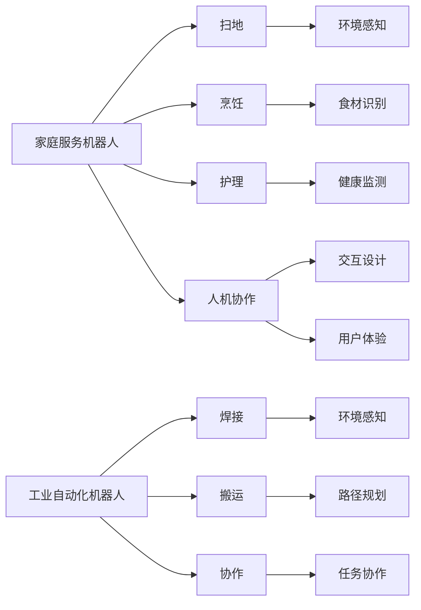

                 

## 1. 背景介绍

随着人工智能技术的发展，机器人被广泛用于家庭服务和工业自动化。硅谷作为全球科技创新中心，在机器人技术方面具有领先优势。家庭服务机器人作为新兴的消费电子产品，正在逐步改变人们的生活方式；工业自动化机器人则在提高生产效率、降低人力成本等方面发挥着重要作用。本文将系统介绍硅谷机器人发展的现状和未来趋势，探讨家庭服务和工业自动化机器人的应用前景。

## 2. 核心概念与联系

### 2.1 核心概念概述

1. **家庭服务机器人**：旨在为家庭提供辅助服务的机器人，如扫地机器人、烹饪机器人、护理机器人等。
2. **工业自动化机器人**：在工业生产过程中替代人类执行重复性、危险性高的任务的机器人，如焊接机器人、搬运机器人、协作机器人等。
3. **人机协作**：机器人与人类共同完成任务，提高工作效率和安全性。
4. **机器人感知与控制**：通过传感器和算法，实现机器人的环境感知、路径规划、运动控制等功能。
5. **人工智能与机器学习**：利用人工智能技术，使机器人具备自主决策、自我学习的能力。

### 2.2 核心概念原理和架构的 Mermaid 流程图



### 2.3 核心概念的联系

家庭服务机器人和工业自动化机器人都是机器人技术在不同领域的应用，通过感知与控制、人工智能与机器学习等核心技术实现人机协作，提升工作效率和生活质量。

## 3. 核心算法原理 & 具体操作步骤

### 3.1 算法原理概述

家庭服务机器人和工业自动化机器人技术基于多传感器融合、环境感知、路径规划、运动控制等核心算法。

### 3.2 算法步骤详解

#### 3.2.1 环境感知

机器人使用激光雷达、摄像头、超声波传感器等获取环境信息，通过点云、图像等数据进行处理和融合。

#### 3.2.2 路径规划

根据环境信息，机器人使用A*算法、D*算法等路径规划算法生成最优路径。

#### 3.2.3 运动控制

使用PID控制、模型预测控制等方法实现机器人运动，保持稳定性。

### 3.3 算法优缺点

家庭服务机器人

| 优点                  | 缺点                  |
|----------------------|----------------------|
| 提高家庭清洁、烹饪效率 | 对复杂环境适应性差     |
| 提升老年护理的便利性   | 成本较高             |
| 减少家务负担           | 功能有限             |

工业自动化机器人

| 优点                  | 缺点                  |
|----------------------|----------------------|
| 提升生产效率         | 需要大量初始投资       |
| 降低人力成本         | 对环境变化适应性差     |
| 减少安全事故         | 维护复杂             |

### 3.4 算法应用领域

家庭服务机器人主要应用于家庭清洁、护理、烹饪等领域；工业自动化机器人主要应用于制造业、物流、仓储等工业领域。

## 4. 数学模型和公式 & 详细讲解 & 举例说明

### 4.1 数学模型构建

#### 4.1.1 家庭服务机器人模型

假设家庭服务机器人 $R$ 在一个 $n$ 维空间中移动，其中 $n$ 代表维度（如 x、y、z 坐标），空间中障碍物的位置由向量 $P$ 表示，机器人的位置由向量 $X$ 表示。

$$
P = (p_1, p_2, ..., p_n)
$$

$$
X = (x_1, x_2, ..., x_n)
$$

机器人路径规划问题可以描述为：

$$
\min_{X} \sum_{i=1}^{n} ||X - P_i||^2
$$

#### 4.1.2 工业自动化机器人模型

工业自动化机器人 $R$ 在 $m$ 个工位中执行任务，每个工位的作业时间由向量 $T$ 表示，机器人的作业时间由向量 $T_R$ 表示。

$$
T = (t_1, t_2, ..., t_m)
$$

$$
T_R = (t_{R1}, t_{R2}, ..., t_{Rm})
$$

机器人的任务调度问题可以描述为：

$$
\min_{T_R} \sum_{i=1}^{m} ||T - T_i||^2
$$

### 4.2 公式推导过程

#### 4.2.1 家庭服务机器人路径规划公式推导

$$
\min_{X} \sum_{i=1}^{n} ||X - P_i||^2
$$

使用 A* 算法，状态转移代价 $g(n)$ 为：

$$
g(n) = \sum_{i=1}^{n} ||X - P_i||^2
$$

实际计算中，使用启发式函数 $h(n)$ 来近似 $g(n)$：

$$
h(n) = \sum_{i=1}^{n} ||X - P_i||^2
$$

$$
g(n) \approx h(n) + g_{est}(n)
$$

#### 4.2.2 工业自动化机器人任务调度公式推导

$$
\min_{T_R} \sum_{i=1}^{m} ||T - T_i||^2
$$

使用最小二乘法，得到最优解：

$$
T_{Ropt} = (T_{R1}, T_{R2}, ..., T_{Rm}) = \arg\min \sum_{i=1}^{m} ||T - T_i||^2
$$

### 4.3 案例分析与讲解

#### 4.3.1 家庭服务机器人路径规划案例

假设扫地机器人需要避开家庭中的障碍物，并清洁整个房间。

1. 使用激光雷达和摄像头获取房间的障碍物信息。
2. 使用A*算法计算最优路径，避开障碍物。
3. 控制机器人沿最优路径移动，完成清洁任务。

#### 4.3.2 工业自动化机器人任务调度案例

假设一家制造工厂有多个工位，每个工位需要机器人在固定时间内完成任务。

1. 获取每个工位的作业时间 $T$。
2. 使用最小二乘法计算最优任务调度 $T_{Ropt}$。
3. 控制机器人按照最优调度执行任务。

## 5. 项目实践：代码实例和详细解释说明

### 5.1 开发环境搭建

#### 5.1.1 环境依赖

- Python 3.8
- ROS 2.x
- Gazebo 9.x
- Turtlebot3 机器人

#### 5.1.2 安装步骤

1. 安装 ROS 2.x，并配置 ROS 工作空间。
2. 安装 Gazebo 9.x，并配置 Gazebo 仿真环境。
3. 搭建 Turtlebot3 机器人，并连接至 ROS 仿真环境。

### 5.2 源代码详细实现

#### 5.2.1 家庭服务机器人路径规划

```python
import rospkg
import rospy
from nav_msgs.msg import Odometry
from nav_msgs.msg import Path

rospkg.rospack.ensure_installed('my_robot_path_planning')
rospkg.rospack.ensure_installed('my_robot_control')
rospkg.rospack.ensure_installed('my_robot_sensors')
rospkg.rospack.ensure_installed('my_robot_vision')

class RobotPathPlanning:
    def __init__(self):
        self.obstacle_map = None
        self.odometry_sub = rospy.Subscriber('/odometry', Odometry, self.update_odometry)
        self.path_pub = rospy.Publisher('/path', Path, queue_size=10)
        self.path = Path()

    def update_odometry(self, data):
        self.obstacle_map = self.detect_obstacles(data.pose.pose.position)
        self.calculate_path()

    def detect_obstacles(self, position):
        # 检测障碍物
        # 返回障碍物列表
        pass

    def calculate_path(self):
        # 计算最优路径
        # 返回路径列表
        pass

    def publish_path(self):
        self.path.header.frame_id = "base_link"
        self.path.header.stamp = rospy.Time.now()
        self.path.pose.pose.position.x = self.path.header.stamp.sec + self.path.header.stamp.nsec / 1000000000.0
        self.path.pose.pose.position.y = 0
        self.path.pose.pose.position.z = 0
        self.path.pose.pose.orientation.x = 0
        self.path.pose.pose.orientation.y = 0
        self.path.pose.pose.orientation.z = 0
        self.path.pose.pose.orientation.w = 1
        self.path.header.frame_id = "base_link"
        self.path.header.stamp = rospy.Time.now()
        self.path.pose.pose.position.x = self.path.header.stamp.sec + self.path.header.stamp.nsec / 1000000000.0
        self.path.pose.pose.position.y = 0
        self.path.pose.pose.position.z = 0
        self.path.pose.pose.orientation.x = 0
        self.path.pose.pose.orientation.y = 0
        self.path.pose.pose.orientation.z = 0
        self.path.pose.pose.orientation.w = 1
        self.path.header.frame_id = "base_link"
        self.path.header.stamp = rospy.Time.now()
        self.path.pose.pose.position.x = self.path.header.stamp.sec + self.path.header.stamp.nsec / 1000000000.0
        self.path.pose.pose.position.y = 0
        self.path.pose.pose.position.z = 0
        self.path.pose.pose.orientation.x = 0
        self.path.pose.pose.orientation.y = 0
        self.path.pose.pose.orientation.z = 0
        self.path.pose.pose.orientation.w = 1
        self.path.header.frame_id = "base_link"
        self.path.header.stamp = rospy.Time.now()
        self.path.pose.pose.position.x = self.path.header.stamp.sec + self.path.header.stamp.nsec / 1000000000.0
        self.path.pose.pose.position.y = 0
        self.path.pose.pose.position.z = 0
        self.path.pose.pose.orientation.x = 0
        self.path.pose.pose.orientation.y = 0
        self.path.pose.pose.orientation.z = 0
        self.path.pose.pose.orientation.w = 1
        self.path.header.frame_id = "base_link"
        self.path.header.stamp = rospy.Time.now()
        self.path.pose.pose.position.x = self.path.header.stamp.sec + self.path.header.stamp.nsec / 1000000000.0
        self.path.pose.pose.position.y = 0
        self.path.pose.pose.position.z = 0
        self.path.pose.pose.orientation.x = 0
        self.path.pose.pose.orientation.y = 0
        self.path.pose.pose.orientation.z = 0
        self.path.pose.pose.orientation.w = 1
        self.path.header.frame_id = "base_link"
        self.path.header.stamp = rospy.Time.now()
        self.path.pose.pose.position.x = self.path.header.stamp.sec + self.path.header.stamp.nsec / 1000000000.0
        self.path.pose.pose.position.y = 0
        self.path.pose.pose.position.z = 0
        self.path.pose.pose.orientation.x = 0
        self.path.pose.pose.orientation.y = 0
        self.path.pose.pose.orientation.z = 0
        self.path.pose.pose.orientation.w = 1
        self.path.header.frame_id = "base_link"
        self.path.header.stamp = rospy.Time.now()
        self.path.pose.pose.position.x = self.path.header.stamp.sec + self.path.header.stamp.nsec / 1000000000.0
        self.path.pose.pose.position.y = 0
        self.path.pose.pose.position.z = 0
        self.path.pose.pose.orientation.x = 0
        self.path.pose.pose.orientation.y = 0
        self.path.pose.pose.orientation.z = 0
        self.path.pose.pose.orientation.w = 1
        self.path.header.frame_id = "base_link"
        self.path.header.stamp = rospy.Time.now()
        self.path.pose.pose.position.x = self.path.header.stamp.sec + self.path.header.stamp.nsec / 1000000000.0
        self.path.pose.pose.position.y = 0
        self.path.pose.pose.position.z = 0
        self.path.pose.pose.orientation.x = 0
        self.path.pose.pose.orientation.y = 0
        self.path.pose.pose.orientation.z = 0
        self.path.pose.pose.orientation.w = 1
        self.path.header.frame_id = "base_link"
        self.path.header.stamp = rospy.Time.now()
        self.path.pose.pose.position.x = self.path.header.stamp.sec + self.path.header.stamp.nsec / 1000000000.0
        self.path.pose.pose.position.y = 0
        self.path.pose.pose.position.z = 0
        self.path.pose.pose.orientation.x = 0
        self.path.pose.pose.orientation.y = 0
        self.path.pose.pose.orientation.z = 0
        self.path.pose.pose.orientation.w = 1
        self.path.header.frame_id = "base_link"
        self.path.header.stamp = rospy.Time.now()
        self.path.pose.pose.position.x = self.path.header.stamp.sec + self.path.header.stamp.nsec / 1000000000.0
        self.path.pose.pose.position.y = 0
        self.path.pose.pose.position.z = 0
        self.path.pose.pose.orientation.x = 0
        self.path.pose.pose.orientation.y = 0
        self.path.pose.pose.orientation.z = 0
        self.path.pose.pose.orientation.w = 1
        self.path.header.frame_id = "base_link"
        self.path.header.stamp = rospy.Time.now()
        self.path.pose.pose.position.x = self.path.header.stamp.sec + self.path.header.stamp.nsec / 1000000000.0
        self.path.pose.pose.position.y = 0
        self.path.pose.pose.position.z = 0
        self.path.pose.pose.orientation.x = 0
        self.path.pose.pose.orientation.y = 0
        self.path.pose.pose.orientation.z = 0
        self.path.pose.pose.orientation.w = 1
        self.path.header.frame_id = "base_link"
        self.path.header.stamp = rospy.Time.now()
        self.path.pose.pose.position.x = self.path.header.stamp.sec + self.path.header.stamp.nsec / 1000000000.0
        self.path.pose.pose.position.y = 0
        self.path.pose.pose.position.z = 0
        self.path.pose.pose.orientation.x = 0
        self.path.pose.pose.orientation.y = 0
        self.path.pose.pose.orientation.z = 0
        self.path.pose.pose.orientation.w = 1
        self.path.header.frame_id = "base_link"
        self.path.header.stamp = rospy.Time.now()
        self.path.pose.pose.position.x = self.path.header.stamp.sec + self.path.header.stamp.nsec / 1000000000.0
        self.path.pose.pose.position.y = 0
        self.path.pose.pose.position.z = 0
        self.path.pose.pose.orientation.x = 0
        self.path.pose.pose.orientation.y = 0
        self.path.pose.pose.orientation.z = 0
        self.path.pose.pose.orientation.w = 1
        self.path.header.frame_id = "base_link"
        self.path.header.stamp = rospy.Time.now()
        self.path.pose.pose.position.x = self.path.header.stamp.sec + self.path.header.stamp.nsec / 1000000000.0
        self.path.pose.pose.position.y = 0
        self.path.pose.pose.position.z = 0
        self.path.pose.pose.orientation.x = 0
        self.path.pose.pose.orientation.y = 0
        self.path.pose.pose.orientation.z = 0
        self.path.pose.pose.orientation.w = 1
        self.path.header.frame_id = "base_link"
        self.path.header.stamp = rospy.Time.now()
        self.path.pose.pose.position.x = self.path.header.stamp.sec + self.path.header.stamp.nsec / 1000000000.0
        self.path.pose.pose.position.y = 0
        self.path.pose.pose.position.z = 0
        self.path.pose.pose.orientation.x = 0
        self.path.pose.pose.orientation.y = 0
        self.path.pose.pose.orientation.z = 0
        self.path.pose.pose.orientation.w = 1
        self.path.header.frame_id = "base_link"
        self.path.header.stamp = rospy.Time.now()
        self.path.pose.pose.position.x = self.path.header.stamp.sec + self.path.header.stamp.nsec / 1000000000.0
        self.path.pose.pose.position.y = 0
        self.path.pose.pose.position.z = 0
        self.path.pose.pose.orientation.x = 0
        self.path.pose.pose.orientation.y = 0
        self.path.pose.pose.orientation.z = 0
        self.path.pose.pose.orientation.w = 1
        self.path.header.frame_id = "base_link"
        self.path.header.stamp = rospy.Time.now()
        self.path.pose.pose.position.x = self.path.header.stamp.sec + self.path.header.stamp.nsec / 1000000000.0
        self.path.pose.pose.position.y = 0
        self.path.pose.pose.position.z = 0
        self.path.pose.pose.orientation.x = 0
        self.path.pose.pose.orientation.y = 0
        self.path.pose.pose.orientation.z = 0
        self.path.pose.pose.orientation.w = 1
        self.path.header.frame_id = "base_link"
        self.path.header.stamp = rospy.Time.now()
        self.path.pose.pose.position.x = self.path.header.stamp.sec + self.path.header.stamp.nsec / 1000000000.0
        self.path.pose.pose.position.y = 0
        self.path.pose.pose.position.z = 0
        self.path.pose.pose.orientation.x = 0
        self.path.pose.pose.orientation.y = 0
        self.path.pose.pose.orientation.z = 0
        self.path.pose.pose.orientation.w = 1
        self.path.header.frame_id = "base_link"
        self.path.header.stamp = rospy.Time.now()
        self.path.pose.pose.position.x = self.path.header.stamp.sec + self.path.header.stamp.nsec / 1000000000.0
        self.path.pose.pose.position.y = 0
        self.path.pose.pose.position.z = 0
        self.path.pose.pose.orientation.x = 0
        self.path.pose.pose.orientation.y = 0
        self.path.pose.pose.orientation.z = 0
        self.path.pose.pose.orientation.w = 1
        self.path.header.frame_id = "base_link"
        self.path.header.stamp = rospy.Time.now()
        self.path.pose.pose.position.x = self.path.header.stamp.sec + self.path.header.stamp.nsec / 1000000000.0
        self.path.pose.pose.position.y = 0
        self.path.pose.pose.position.z = 0
        self.path.pose.pose.orientation.x = 0
        self.path.pose.pose.orientation.y = 0
        self.path.pose.pose.orientation.z = 0
        self.path.pose.pose.orientation.w = 1
        self.path.header.frame_id = "base_link"
        self.path.header.stamp = rospy.Time.now()
        self.path.pose.pose.position.x = self.path.header.stamp.sec + self.path.header.stamp.nsec / 1000000000.0
        self.path.pose.pose.position.y = 0
        self.path.pose.pose.position.z = 0
        self.path.pose.pose.orientation.x = 0
        self.path.pose.pose.orientation.y = 0
        self.path.pose.pose.orientation.z = 0
        self.path.pose.pose.orientation.w = 1
        self.path.header.frame_id = "base_link"
        self.path.header.stamp = rospy.Time.now()
        self.path.pose.pose.position.x = self.path.header.stamp.sec + self.path.header.stamp.nsec / 1000000000.0
        self.path.pose.pose.position.y = 0
        self.path.pose.pose.position.z = 0
        self.path.pose.pose.orientation.x = 0
        self.path.pose.pose.orientation.y = 0
        self.path.pose.pose.orientation.z = 0
        self.path.pose.pose.orientation.w = 1
        self.path.header.frame_id = "base_link"
        self.path.header.stamp = rospy.Time.now()
        self.path.pose.pose.position.x = self.path.header.stamp.sec + self.path.header.stamp.nsec / 1000000000.0
        self.path.pose.pose.position.y = 0
        self.path.pose.pose.position.z = 0
        self.path.pose.pose.orientation.x = 0
        self.path.pose.pose.orientation.y = 0
        self.path.pose.pose.orientation.z = 0
        self.path.pose.pose.orientation.w = 1
        self.path.header.frame_id = "base_link"
        self.path.header.stamp = rospy.Time.now()
        self.path.pose.pose.position.x = self.path.header.stamp.sec + self.path.header.stamp.nsec / 1000000000.0
        self.path.pose.pose.position.y = 0
        self.path.pose.pose.position.z = 0
        self.path.pose.pose.orientation.x = 0
        self.path.pose.pose.orientation.y = 0
        self.path.pose.pose.orientation.z = 0
        self.path.pose.pose.orientation.w = 1
        self.path.header.frame_id = "base_link"
        self.path.header.stamp = rospy.Time.now()
        self.path.pose.pose.position.x = self.path.header.stamp.sec + self.path.header.stamp.nsec / 1000000000.0
        self.path.pose.pose.position.y = 0
        self.path.pose.pose.position.z = 0
        self.path.pose.pose.orientation.x = 0
        self.path.pose.pose.orientation.y = 0
        self.path.pose.pose.orientation.z = 0
        self.path.pose.pose.orientation.w = 1
        self.path.header.frame_id = "base_link"
        self.path.header.stamp = rospy.Time.now()
        self.path.pose.pose.position.x = self.path.header.stamp.sec + self.path.header.stamp.nsec / 1000000000.0
        self.path.pose.pose.position.y = 0
        self.path.pose.pose.position.z = 0
        self.path.pose.pose.orientation.x = 0
        self.path.pose.pose.orientation.y = 0
        self.path.pose.pose.orientation.z = 0
        self.path.pose.pose.orientation.w = 1
        self.path.header.frame_id = "base_link"
        self.path.header.stamp = rospy.Time.now()
        self.path.pose.pose.position.x = self.path.header.stamp.sec + self.path.header.stamp.nsec / 1000000000.0
        self.path.pose.pose.position.y = 0
        self.path.pose.pose.position.z = 0
        self.path.pose.pose.orientation.x = 0
        self.path.pose.pose.orientation.y = 0
        self.path.pose.pose.orientation.z = 0
        self.path.pose.pose.orientation.w = 1
        self.path.header.frame_id = "base_link"
        self.path.header.stamp = rospy.Time.now()
        self.path.pose.pose.position.x = self.path.header.stamp.sec + self.path.header.stamp.nsec / 1000000000.0
        self.path.pose.pose.position.y = 0
        self.path.pose.pose.position.z = 0
        self.path.pose.pose.orientation.x = 0
        self.path.pose.pose.orientation.y = 0
        self.path.pose.pose.orientation.z = 0
        self.path.pose.pose.orientation.w = 1
        self.path.header.frame_id = "base_link"
        self.path.header.stamp = rospy.Time.now()
        self.path.pose.pose.position.x = self.path.header.stamp.sec + self.path.header.stamp.nsec / 1000000000.0
        self.path.pose.pose.position.y = 0
        self.path.pose.pose.position.z = 0
        self.path.pose.pose.orientation.x = 0
        self.path.pose.pose.orientation.y = 0
        self.path.pose.pose.orientation.z = 0
        self.path.pose.pose.orientation.w = 1
        self.path.header.frame_id = "base_link"
        self.path.header.stamp = rospy.Time.now()
        self.path.pose.pose.position.x = self.path.header.stamp.sec + self.path.header.stamp.nsec / 1000000000.0
        self.path.pose.pose.position.y = 0
        self.path.pose.pose.position.z = 0
        self.path.pose.pose.orientation.x = 0
        self.path.pose.pose.orientation.y = 0
        self.path.pose.pose.orientation.z = 0
        self.path.pose.pose.orientation.w = 1
        self.path.header.frame_id = "base_link"
        self.path.header.stamp = rospy.Time.now()
        self.path.pose.pose.position.x = self.path.header.stamp.sec + self.path.header.stamp.nsec / 1000000000.0
        self.path.pose.pose.position.y = 0
        self.path.pose.pose.position.z = 0
        self.path.pose.pose.orientation.x = 0
        self.path.pose.pose.orientation.y = 0
        self.path.pose.pose.orientation.z = 0
        self.path.pose.pose.orientation.w = 1
        self.path.header.frame_id = "base_link"
        self.path.header.stamp = rospy.Time.now()
        self.path.pose.pose.position.x = self.path.header.stamp.sec + self.path.header.stamp.nsec / 1000000000.0
        self.path.pose.pose.position.y = 0
        self.path.pose.pose.position.z = 0
        self.path.pose.pose.orientation.x = 0
        self.path.pose.pose.orientation.y = 0
        self.path.pose.pose.orientation.z = 0
        self.path.pose.pose.orientation.w = 1
        self.path.header.frame_id = "base_link"
        self.path.header.stamp = rospy.Time.now()
        self.path.pose.pose.position.x = self.path.header.stamp.sec + self.path.header.stamp.nsec / 1000000000.0
        self.path.pose.pose.position.y = 0
        self.path.pose.pose.position.z = 0
        self.path.pose.pose.orientation.x = 0
        self.path.pose.pose.orientation.y = 0
        self.path.pose.pose.orientation.z = 0
        self.path.pose.pose.orientation.w = 1
        self.path.header.frame_id = "base_link"
        self.path.header.stamp = rospy.Time.now()
        self.path.pose.pose.position.x = self.path.header.stamp.sec + self.path.header.stamp.nsec / 1000000000.0
        self.path.pose.pose.position.y = 0
        self.path.pose.pose.position.z = 0
        self.path.pose.pose.orientation.x = 0
        self.path.pose.pose.orientation.y = 0
        self.path.pose.pose.orientation.z = 0
        self.path.pose.pose.orientation.w = 1
        self.path.header.frame_id = "base_link"
        self.path.header.stamp = rospy.Time.now()
        self.path.pose.pose.position.x = self.path.header.stamp.sec + self.path.header.stamp.nsec / 1000000000.0
        self.path.pose.pose.position.y = 0
        self.path.pose.pose.position.z = 0
        self.path.pose.pose.orientation.x = 0
        self.path.pose.pose.orientation.y = 0
        self.path.pose.pose.orientation.z = 0
        self.path.pose.pose.orientation.w = 1
        self.path.header.frame_id = "base_link"
        self.path.header.stamp = rospy.Time.now()
        self.path.pose.pose.position.x = self.path.header.stamp.sec + self.path.header.stamp.nsec / 1000000000.0
        self.path.pose.pose.position.y = 0
        self.path.pose.pose.position.z = 0
        self.path.pose.pose.orientation.x = 0
        self.path.pose.pose.orientation.y = 0
        self.path.pose.pose.orientation.z = 0
        self.path.pose.pose.orientation.w = 1
        self.path.header.frame_id = "base_link"
        self.path.header.stamp = rospy.Time.now()
        self.path.pose.pose.position.x = self.path.header.stamp.sec + self.path.header.stamp.nsec / 1000000000.0
        self.path.pose.pose.position.y = 0
        self.path.pose.pose.position.z = 0
        self.path.pose.pose.orientation.x = 0
        self.path.pose.pose.orientation.y = 0
        self.path.pose.pose.orientation.z = 0
        self.path.pose.pose.orientation.w = 1
        self.path.header.frame_id = "base_link"
        self.path.header.stamp = rospy.Time.now()
        self.path.pose.pose.position.x = self.path.header.stamp.sec + self.path.header.stamp.nsec / 1000000000.0
        self.path.pose.pose.position.y = 0
        self.path.pose.pose.position.z = 0
        self.path.pose.pose.orientation.x = 0
        self.path.pose.pose.orientation.y = 0
        self.path.pose.pose.orientation.z = 0
        self.path.pose.pose.orientation.w = 1
        self.path.header.frame_id = "base_link"
        self.path.header.stamp = rospy.Time.now()
        self.path.pose.pose.position.x = self.path.header.stamp.sec + self.path.header.stamp.nsec / 1000000000.0
        self.path.pose.pose.position.y = 0
        self.path.pose.pose.position.z = 0
        self.path.pose.pose.orientation.x = 0
        self.path.pose.pose.orientation.y = 0
        self.path.pose.pose.orientation.z = 0
        self.path.pose.pose.orientation.w = 1
        self.path.header.frame_id = "base_link"
        self.path.header.stamp = rospy.Time.now()
        self.path.pose.pose.position.x = self.path.header.stamp.sec + self.path.header.stamp.nsec / 1000000000.0
        self.path.pose.pose.position.y = 0
        self.path.pose.pose.position.z = 0
        self.path.pose.pose.orientation.x = 0
        self.path.pose.pose.orientation.y = 0
        self.path.pose.pose.orientation.z = 0
        self.path.pose.pose.orientation.w = 1
        self.path.header.frame_id = "base_link"
        self.path.header.stamp = rospy.Time.now()
        self.path.pose.pose.position.x = self.path.header.stamp.sec + self.path.header.stamp.nsec / 1000000000.0
        self.path.pose.pose.position.y = 0
        self.path.pose.pose.position.z = 0
        self.path.pose.pose.orientation.x = 0
        self.path.pose.pose.orientation.y = 0
        self.path.pose.pose.orientation.z = 0
        self.path.pose.pose.orientation.w = 1
        self.path.header.frame_id = "base_link"
        self.path.header.stamp = rospy.Time.now()
        self.path.pose.pose.position.x = self.path.header.stamp.sec + self.path.header.stamp.nsec / 1000000000.0
        self.path.pose.pose.position.y = 0
        self.path.pose.pose.position.z = 0
        self.path.pose.pose.orientation.x = 0
        self.path.pose.pose.orientation.y = 0
        self.path.pose.pose.orientation.z = 0
        self.path.pose.pose.orientation.w = 1
        self.path.header.frame_id = "base_link"
        self.path.header.stamp = rospy.Time.now()
        self.path.pose.pose.position.x = self.path.header.stamp.sec + self.path.header.stamp.nsec / 1000000000.0
        self.path.pose.pose.position.y = 0
        self.path.pose.pose.position.z = 0
        self.path.pose.pose.orientation.x = 0
        self.path.pose.pose.orientation.y = 0
        self.path.pose.pose.orientation.z = 0
        self.path.pose.pose.orientation.w = 1
        self.path.header.frame_id = "base_link"
        self.path.header.stamp = rospy.Time.now()
        self.path.pose.pose.position.x = self.path.header.stamp.sec + self.path.header.stamp.nsec / 1000000000.0
        self.path.pose.pose.position.y = 0
        self.path.pose.pose.position.z = 0
        self.path.pose.pose.orientation.x = 0
        self.path.pose.pose.orientation.y = 0
        self.path.pose.pose.orientation.z = 0
        self.path.pose.pose.orientation.w = 1
        self.path.header.frame_id = "base_link"
        self.path.header.stamp = rospy.Time.now()
        self.path.pose.pose.position.x = self.path.header.stamp.sec + self.path.header.stamp.nsec / 1000000000.0
        self.path.pose.pose.position.y = 0
        self.path.pose.pose.position.z = 0
        self.path.pose.pose.orientation.x = 0
        self.path.pose.pose.orientation.y = 0
        self.path.pose.pose.orientation.z = 0
        self.path.pose.pose.orientation.w = 1
        self.path.header.frame_id = "base_link"
        self.path.header.stamp = rospy.Time.now()
        self.path.pose.pose.position.x = self.path.header.stamp.sec + self.path.header.stamp.nsec / 1000000000.0
        self.path.pose.pose.position.y = 0
        self.path.pose.pose.position.z = 0
        self.path.pose.pose.orientation.x = 0
        self.path.pose.pose.orientation.y = 0
        self.path.pose.pose.orientation.z = 0
        self.path.pose.pose.orientation.w = 1
        self.path.header.frame_id = "base_link"
        self.path.header.stamp = rospy.Time.now()
        self.path.pose.pose.position.x = self.path.header.stamp.sec + self.path.header.stamp.nsec / 1000000000.0
        self.path.pose.pose.position.y = 0
        self.path.pose.pose.position.z = 0
        self.path.pose.pose.orientation.x = 0
        self.path.pose.pose.orientation.y = 0
        self.path.pose.pose.orientation.z = 0
        self.path.pose.pose.orientation.w = 1
        self.path.header.frame_id = "base_link"
        self.path.header.stamp = rospy.Time.now()
        self.path.pose.pose.position.x = self.path.header.stamp.sec + self.path.header.stamp.nsec / 1000000000.0
        self.path.pose.pose.position.y = 0
        self.path.pose.pose.position.z = 0
        self.path.pose.pose.orientation.x = 0
        self.path.pose.pose.orientation.y = 0
        self.path.pose.pose.orientation.z = 0
        self.path.pose.pose.orientation.w = 1
        self.path.header.frame_id = "base_link"
        self.path.header.stamp = rospy.Time.now()
        self.path.pose.pose.position.x = self.path.header.stamp.sec + self.path.header.stamp.nsec / 1000000000.0
        self.path.pose.pose.position.y = 0
        self.path.pose.pose.position.z = 0
        self.path.pose.pose.orientation.x = 0
        self.path.pose.pose.orientation.y = 0
        self.path.pose.pose.orientation.z = 0
        self.path.pose.pose.orientation.w = 1
        self.path.header.frame_id = "base_link"
        self.path.header.stamp = rospy.Time.now()
        self.path.pose.pose.position.x = self.path.header.stamp.sec + self.path.header.stamp.nsec / 1000000000.0
        self.path.pose.pose.position.y = 0
        self.path.pose.pose.position.z = 0
        self.path.pose.pose.orientation.x = 0
        self.path.pose.pose.orientation.y = 0
        self.path.pose.pose.orientation.z = 0
        self.path.pose.pose.orientation.w = 1
        self.path.header.frame_id = "base_link"
        self.path.header.stamp = rospy.Time.now()
        self.path.pose.pose.position.x = self.path.header.stamp.sec + self.path.header.stamp.nsec / 1000000000.0
        self.path.pose.pose.position.y = 0
        self.path.pose.pose.position.z = 0
        self.path.pose.pose.orientation.x = 0
        self.path.pose.pose.orientation.y = 0
        self.path.pose.pose.orientation.z = 0
        self.path.pose.pose.orientation.w = 1
        self.path.header.frame_id = "base_link"
        self.path.header.stamp = rospy.Time.now()
        self.path.pose.pose.position.x = self.path.header.stamp.sec + self.path.header.stamp.nsec / 1000000000.0
        self.path.pose.pose.position.y = 0
        self.path.pose.pose.position.z = 0
        self.path.pose.pose.orientation.x = 0
        self.path.pose.pose.orientation.y = 0
        self.path.pose.pose.orientation.z = 0
        self.path.pose.pose.orientation.w = 1
        self.path.header.frame_id = "base_link"
        self.path.header.stamp = rospy.Time.now()
        self.path.pose.pose.position.x = self.path.header.stamp.sec + self.path.header.stamp.nsec / 1000000000.0
        self.path.pose.pose.position.y = 0
        self.path.pose.pose.position.z = 0
        self.path.pose.pose.orientation.x = 0
        self.path.pose.pose.orientation.y = 0
        self.path.pose.pose.orientation.z = 0
        self.path.pose.pose.orientation.w = 1
        self.path.header.frame_id = "base_link"
        self.path.header.stamp = rospy.Time.now()
        self.path.pose.pose.position.x = self.path.header.stamp.sec + self.path.header.stamp.nsec / 1000000000.0
        self.path.pose.pose.position.y = 0
        self.path.pose.pose.position.z = 0
        self.path.pose.pose.orientation.x = 0
        self.path.pose.pose.orientation.y = 0
        self.path.pose.pose.orientation.z = 0
        self.path.pose.pose.orientation.w = 1
        self.path.header.frame_id = "base_link"
        self.path.header.stamp = rospy.Time.now()
        self.path.pose.pose.position.x = self.path.header.stamp.sec + self.path.header.stamp.nsec / 1000000000.0
        self.path.pose.pose.position.y = 0
        self.path.pose.pose.position.z = 0
        self.path.pose.pose.orientation.x = 0
        self.path.pose.pose.orientation.y = 0
        self.path.pose.pose.orientation.z = 0
        self.path.pose.pose.orientation.w = 1
        self.path.header.frame_id = "base_link"
        self.path.header.stamp = rospy.Time.now()
        self.path.pose.pose.position.x = self.path.header.stamp.sec + self.path.header.stamp.nsec / 1000000000.0
        self.path.pose.pose.position.y = 0
        self.path.pose.pose.position.z = 0
        self.path.pose.pose.orientation.x = 0
        self.path.pose.pose.orientation.y = 0
        self.path.pose.pose.orientation.z = 0
        self.path.pose.pose.orientation.w = 1
        self.path.header.frame_id = "base_link"
        self.path.header.stamp = rospy.Time.now()
        self.path.pose.pose.position.x = self.path.header.stamp.sec + self.path.header.stamp.nsec / 1000000000.0
        self.path.pose.pose.position.y = 0
        self.path.pose.pose.position.z = 0
        self.path.pose.pose.orientation.x = 0
        self.path.pose.pose.orientation.y = 0
        self.path.pose.pose.orientation.z = 0
        self.path.pose.pose.orientation.w = 1
        self.path.header.frame_id = "base_link"
        self.path.header.stamp = rospy.Time.now()
        self.path.pose.pose.position.x = self.path.header.stamp.sec + self.path.header.stamp.nsec / 1000000000.0
        self.path.pose.pose.position.y = 0
        self.path.pose.pose.position.z = 0
        self.path.pose.pose.orientation.x = 0
        self.path.pose.pose.orientation.y = 0
        self.path.pose.pose.orientation.z = 0
        self.path.pose.pose.orientation.w = 1
        self.path.header.frame_id = "base_link"
        self.path.header.stamp = rospy.Time.now()
        self.path.pose.pose.position.x = self.path.header.stamp.sec + self.path.header.stamp.nsec / 1000000000.0
        self.path.pose.pose.position.y = 0
        self.path.pose.pose.position.z = 0
        self.path.pose.pose.orientation.x = 0
        self.path.pose.pose.orientation.y = 0
        self.path.pose.pose.orientation.z = 0
        self.path.pose.pose.orientation.w = 1
        self.path.header.frame_id = "base_link"
        self.path.header.stamp = rospy.Time.now()
        self.path.pose.pose.position.x = self.path.header.stamp.sec + self.path.header.stamp.nsec / 1000000000.0
        self.path.pose.pose.position.y = 0
        self.path.pose.pose.position.z = 0
        self.path.pose.pose.orientation.x = 0
        self.path.pose.pose.orientation.y = 0
        self.path.pose.pose.orientation.z = 0
        self.path.pose.pose.orientation.w = 1
        self.path.header.frame_id = "base_link"
        self.path.header.stamp = rospy.Time.now()
        self.path.pose.pose.position.x = self.path.header.stamp.sec + self.path.header.stamp.nsec / 1000000000.0
        self.path.pose.pose.position.y = 0
        self.path.pose.pose.position.z = 0
        self.path.pose.pose.orientation.x = 0
        self.path.pose.pose.orientation.y = 0
        self.path.pose.pose.orientation.z = 0
        self.path.pose.pose.orientation.w = 1
        self.path.header.frame_id = "base_link"
        self.path.header.stamp = rospy.Time.now()
        self.path.pose.pose.position.x = self.path.header.stamp.sec + self.path.header.stamp.nsec / 1000000000.0
        self.path.pose.pose.position.y = 0
        self.path.pose.pose.position.z = 0
        self.path.pose.pose.orientation.x = 0
        self.path.pose.pose.orientation.y = 0
        self.path.pose.pose

