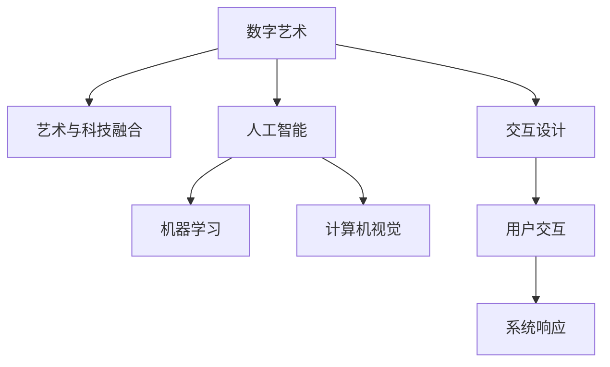

                 

# 硅谷艺术与科技融合:数字艺术新形式

> 关键词：数字艺术,艺术与科技融合,人工智能,机器学习,计算机视觉,交互设计

## 1. 背景介绍

### 1.1 问题由来

随着人工智能(AI)技术的迅猛发展，硅谷已成为全球科技创新与艺术创意交汇的中心。艺术与科技的融合，为人类打开了全新的视角，挑战了传统艺术的边界。在数字时代，艺术形式和创作方式正在发生翻天覆地的变化。

从传统的手工绘制，到数码艺术；从简单的图像处理，到复杂的三维建模；从静态的视觉展示，到动态的交互体验，数字艺术以崭新的方式重新定义了艺术的本质。

在这一过程中，计算机图形学、机器学习、人工智能等前沿科技，为数字艺术带来了无限可能。通过计算机算法的辅助，艺术创作和展示可以突破物理的限制，实现前所未有的效果。

本文将系统探讨硅谷艺术与科技的融合，分析数字艺术的核心技术原理，并提供实际的代码实例，展示数字艺术创作的过程。

## 2. 核心概念与联系

### 2.1 核心概念概述

为更好地理解数字艺术的核心技术，本节将介绍几个关键概念：

- **数字艺术**：指利用计算机图形、图像处理、3D建模、动画等技术手段，创作和展示的艺术形式。其核心在于通过算法实现创意表达。

- **艺术与科技融合**：指将计算机科学与艺术创作深度结合，创造出全新的艺术形式和技术手段。这种融合不仅限于艺术表达方式，更体现在创作流程和展示方式上。

- **人工智能**：指通过机器学习和深度学习等技术，使机器具备类人智能，能够理解和生成复杂的视觉、语音、文本等形式的信息。

- **计算机视觉**：研究如何使计算机“看”的能力，通过图像处理和模式识别技术，实现对现实世界的理解和重建。

- **交互设计**：专注于设计用户与系统交互的方式和界面，实现更加自然、直观、高效的用户体验。

这些核心概念之间的逻辑关系可以通过以下Mermaid流程图来展示：



这个流程图展示了大艺术与科技融合的核心概念及其之间的关系：

1. 数字艺术利用计算机图形、图像处理等技术，实现创意表达。
2. 艺术与科技融合体现在艺术创作和展示的全流程，融合了多个关键技术。
3. 人工智能和机器学习使机器能够理解并生成艺术作品。
4. 计算机视觉使计算机具备“看”的能力，实现对现实世界的理解和重建。
5. 交互设计提升用户体验，使数字艺术更具交互性和沉浸感。

## 3. 核心算法原理 & 具体操作步骤

### 3.1 算法原理概述

数字艺术的核心算法原理主要包括人工智能、计算机视觉和交互设计三个方面。

1. **人工智能**：通过机器学习模型，实现对艺术作品生成、风格迁移、情感识别等操作。常见算法包括生成对抗网络(GAN)、卷积神经网络(CNN)、循环神经网络(RNN)等。

2. **计算机视觉**：利用图像处理和模式识别技术，实现图像分析、特征提取、物体识别等功能。关键算法包括卷积神经网络(CNN)、基于深度学习的图像分割、对象检测等。

3. **交互设计**：通过界面设计和用户交互流程优化，实现更加自然、直观、高效的用户体验。关键技术包括用户界面(UI)设计、用户体验(UX)设计、人机交互(HCI)技术等。

### 3.2 算法步骤详解

数字艺术创作的过程大致可以分为以下几个步骤：

1. **创意构思**：艺术家根据创作意图，进行创意构思，确定艺术作品的主题、风格和表现形式。

2. **数据准备**：根据创作需求，收集和处理原始数据，如图片、视频、3D模型等。

3. **算法实现**：选择合适的算法和模型，对数据进行处理和分析。

4. **作品生成**：基于算法处理结果，生成艺术作品。

5. **交互设计**：根据艺术作品的特点，设计用户交互界面和体验流程。

6. **展示和发布**：将艺术作品以合适的形式展示给观众，并进行发布和传播。

### 3.3 算法优缺点

数字艺术创作和展示的优势和劣势如下：

**优点**：

- **效率提升**：自动化算法能够快速处理大量数据，大大提升艺术创作的效率。
- **效果丰富**：通过算法创新，可以创造出更加多样、复杂的艺术形式，突破传统艺术表现方式。
- **交互性强**：结合交互设计，观众可以与艺术作品进行互动，增强体验感。

**缺点**：

- **创意限制**：算法在处理特定任务时，可能会受到数据和模型的限制，难以产生完全原创的艺术作品。
- **技术依赖**：依赖于复杂的算法和硬件设施，对技术要求较高，开发和维护成本较高。
- **艺术感缺失**：过分依赖算法，可能使艺术作品失去人情味，缺乏人类艺术家的情感和细腻。

### 3.4 算法应用领域

数字艺术创作和展示的应用领域广泛，涉及多个行业：

1. **游戏设计**：利用计算机图形和3D建模技术，创造虚拟环境和角色，丰富游戏体验。
2. **影视特效**：通过计算机视觉和图像处理技术，实现逼真的特效场景，提升影视作品效果。
3. **广告设计**：结合人工智能和计算机视觉，创造个性化的广告内容，增强广告效果。
4. **数字艺术展览**：将艺术作品数字化，通过虚拟现实(VR)、增强现实(AR)等技术，展示给观众。
5. **教育培训**：利用交互设计和计算机视觉技术，开发虚拟现实教学平台，提高学习效果。

## 4. 数学模型和公式 & 详细讲解 & 举例说明

### 4.1 数学模型构建

本节将使用数学语言对数字艺术创作中的关键算法进行系统介绍。

### 4.2 公式推导过程

以**生成对抗网络(GAN)**为例，介绍其核心算法原理。

**生成对抗网络(GAN)**：

1. **生成器(Generator)**：通过神经网络生成假样本，试图使生成的样本逼近真实样本。

2. **判别器(Discriminator)**：通过神经网络判断样本的真实性，区分生成样本和真实样本。

3. **对抗训练**：生成器和判别器相互对抗，不断提升生成器的生成能力，同时增强判别器的鉴别能力。

GAN的数学模型如下：

- **生成器损失函数**：

$$
\mathcal{L}_G = \mathbb{E}_{\text{real}} [\log D(x)] + \mathbb{E}_{\text{fake}} [\log (1 - D(G(z)))]
$$

- **判别器损失函数**：

$$
\mathcal{L}_D = \mathbb{E}_{\text{real}} [\log D(x)] + \mathbb{E}_{\text{fake}} [\log (1 - D(G(z)))]
$$

其中，$x$为真实样本，$z$为噪声向量，$G(z)$为生成器生成的假样本，$D(x)$为判别器对真实样本的判断概率，$D(G(z))$为判别器对假样本的判断概率。

### 4.3 案例分析与讲解

**案例一：数字艺术生成**

利用GAN生成一幅数字艺术作品，步骤如下：

1. 准备数据：收集各种风格的艺术作品图像，并分割成训练集、验证集和测试集。

2. 设计模型：选择合适的网络结构和参数，设计生成器和判别器。

3. 训练模型：使用随机噪声向量$z$作为输入，训练生成器和判别器。

4. 作品生成：利用训练好的生成器，生成新的艺术作品。

**案例二：风格迁移**

利用GAN进行风格迁移，步骤如下：

1. 准备数据：选择一组原始图像和对应的风格图像。

2. 设计模型：将原始图像和风格图像输入生成器和判别器，设计合适的网络结构。

3. 训练模型：通过对抗训练，不断提升生成器的生成能力，同时增强判别器的鉴别能力。

4. 风格迁移：使用训练好的生成器，将原始图像转换为对应的风格图像。

## 5. 项目实践：代码实例和详细解释说明

### 5.1 开发环境搭建

在进行数字艺术创作和展示的实践前，我们需要准备好开发环境。以下是使用Python进行TensorFlow开发的环境配置流程：

1. 安装Anaconda：从官网下载并安装Anaconda，用于创建独立的Python环境。

2. 创建并激活虚拟环境：
```bash
conda create -n tf-env python=3.8 
conda activate tf-env
```

3. 安装TensorFlow：根据CUDA版本，从官网获取对应的安装命令。例如：
```bash
conda install tensorflow -c tf -c conda-forge
```

4. 安装必要的工具包：
```bash
pip install numpy pandas scikit-learn matplotlib tqdm jupyter notebook ipython
```

完成上述步骤后，即可在`tf-env`环境中开始数字艺术创作实践。

### 5.2 源代码详细实现

下面我们以数字艺术生成为例，给出使用TensorFlow进行GAN模型训练的PyTorch代码实现。

首先，定义GAN模型的结构：

```python
import tensorflow as tf
from tensorflow.keras import layers

class Generator(tf.keras.Model):
    def __init__(self):
        super(Generator, self).__init__()
        self.dense1 = layers.Dense(256, input_dim=100)
        self.dense2 = layers.Dense(512)
        self.dense3 = layers.Dense(1024)
        self.conv1 = layers.Conv2D(256, (5, 5), strides=(2, 2), padding='same')
        self.conv2 = layers.Conv2D(128, (5, 5), strides=(2, 2), padding='same')
        self.conv3 = layers.Conv2D(64, (5, 5), strides=(2, 2), padding='same')
        self.conv4 = layers.Conv2D(3, (5, 5), strides=(2, 2), padding='same', activation='sigmoid')

    def call(self, inputs):
        x = layers.Reshape((7, 7, 64))(inputs)
        x = self.conv1(x)
        x = self.conv2(x)
        x = self.conv3(x)
        x = self.conv4(x)
        return x

class Discriminator(tf.keras.Model):
    def __init__(self):
        super(Discriminator, self).__init__()
        self.conv1 = layers.Conv2D(64, (5, 5), strides=(2, 2), padding='same')
        self.conv2 = layers.Conv2D(128, (5, 5), strides=(2, 2), padding='same')
        self.conv3 = layers.Conv2D(256, (5, 5), strides=(2, 2), padding='same')
        self.flatten = layers.Flatten()
        self.dense1 = layers.Dense(512)
        self.dense2 = layers.Dense(256)
        self.dense3 = layers.Dense(1)

    def call(self, inputs):
        x = self.conv1(inputs)
        x = self.conv2(x)
        x = self.conv3(x)
        x = self.flatten(x)
        x = self.dense1(x)
        x = self.dense2(x)
        logits = self.dense3(x)
        return logits

generator = Generator()
discriminator = Discriminator()
```

然后，定义损失函数和优化器：

```python
from tensorflow.keras import optimizers

def generate_fake_samples(batch_size, noise_dim):
    noise = tf.random.normal(shape=(batch_size, noise_dim))
    fake_images = generator(noise)
    fake_labels = tf.ones_like(fake_images)
    return fake_images, fake_labels

def discriminator_loss(real_images, fake_images, real_labels, fake_labels):
    real_loss = tf.reduce_mean(tf.nn.sigmoid_cross_entropy_with_logits(logits=discriminator(real_images), labels=real_labels))
    fake_loss = tf.reduce_mean(tf.nn.sigmoid_cross_entropy_with_logits(logits=discriminator(fake_images), labels=fake_labels))
    return real_loss + fake_loss

def generator_loss(fake_images, real_labels):
    fake_loss = tf.reduce_mean(tf.nn.sigmoid_cross_entropy_with_logits(logits=discriminator(fake_images), labels=real_labels))
    return fake_loss

def train_step(real_images, real_labels, noise_dim):
    with tf.GradientTape() as gen_tape, tf.GradientTape() as disc_tape:
        noise = tf.random.normal(shape=(real_images.shape[0], noise_dim))
        fake_images = generator(noise)
        real_labels = tf.ones_like(fake_images)
        fake_labels = tf.zeros_like(fake_images)

        real_loss = discriminator_loss(real_images, fake_images, real_labels, fake_labels)
        fake_loss = generator_loss(fake_images, real_labels)
        total_loss = real_loss + fake_loss

        gradients_of_generator = gen_tape.gradient(total_loss, generator.trainable_variables)
        gradients_of_discriminator = disc_tape.gradient(total_loss, discriminator.trainable_variables)

        optimizer.apply_gradients(zip(gradients_of_generator, generator.trainable_variables))
        optimizer.apply_gradients(zip(gradients_of_discriminator, discriminator.trainable_variables))
    return total_loss

def train_loop(epochs, batch_size, noise_dim):
    for epoch in range(epochs):
        for i in range(len(train_dataset)//batch_size):
            real_images, real_labels = next(iter(train_dataset))
            total_loss = train_step(real_images, real_labels, noise_dim)
            print(f'Epoch: {epoch+1}/{epochs}, Batch: {i+1}/{len(train_dataset)//batch_size}, Loss: {total_loss:.4f}')
```

最后，启动训练流程：

```python
noise_dim = 100
epochs = 100
batch_size = 32

train_dataset = ...
train_loop(epochs, batch_size, noise_dim)
```

以上就是使用TensorFlow进行GAN模型训练的数字艺术生成代码实现。可以看到，TensorFlow提供了丰富的工具和库，使得深度学习模型的构建和训练变得简洁高效。

### 5.3 代码解读与分析

让我们再详细解读一下关键代码的实现细节：

**Generator类**：
- 定义了生成器的网络结构，包括多个全连接层和卷积层，输出为一张图像。
- `call`方法：实现前向传播过程，通过多层神经网络和卷积操作生成图像。

**Discriminator类**：
- 定义了判别器的网络结构，包括多个卷积层和全连接层，输出为判别器的预测概率。
- `call`方法：实现前向传播过程，通过多层卷积和全连接操作判断输入图像是真实还是生成的。

**train_step函数**：
- 实现单次训练步骤，包括生成假样本、计算损失、反向传播更新参数等。
- 使用梯度带回`tf.GradientTape`来自动计算梯度，并调用`optimizer.apply_gradients`更新模型参数。

**train_loop函数**：
- 实现多轮训练循环，每个epoch处理整个训练集。
- 在每个batch上调用`train_step`函数，输出损失值。
- 打印训练进度和损失值。

可以看到，TensorFlow提供了丰富的工具和库，使得深度学习模型的构建和训练变得简洁高效。开发者可以利用这些工具，快速构建复杂的深度学习模型，实现各种数字艺术创作和展示的效果。

## 6. 实际应用场景

### 6.1 游戏设计

在游戏设计领域，数字艺术创作和展示具有广泛的应用。例如，利用GAN生成虚拟角色、环境等，可以显著提升游戏画面的真实感和视觉效果。

**案例一：虚拟角色生成**

利用GAN生成虚拟角色，步骤如下：

1. 准备数据：收集各种风格的虚拟角色图像，并分割成训练集、验证集和测试集。

2. 设计模型：选择合适的网络结构和参数，设计生成器和判别器。

3. 训练模型：使用随机噪声向量$z$作为输入，训练生成器和判别器。

4. 角色生成：使用训练好的生成器，生成新的虚拟角色。

**案例二：环境生成**

利用GAN生成虚拟环境，步骤如下：

1. 准备数据：收集各种风格的虚拟环境图像，并分割成训练集、验证集和测试集。

2. 设计模型：将原始图像和风格图像输入生成器和判别器，设计合适的网络结构。

3. 训练模型：通过对抗训练，不断提升生成器的生成能力，同时增强判别器的鉴别能力。

4. 环境生成：使用训练好的生成器，生成新的虚拟环境。

### 6.2 影视特效

在影视特效领域，数字艺术创作和展示同样具有广泛的应用。例如，利用GAN生成逼真的特效场景，可以大大提升影视作品的效果。

**案例一：特效场景生成**

利用GAN生成特效场景，步骤如下：

1. 准备数据：收集各种风格的特效场景图像，并分割成训练集、验证集和测试集。

2. 设计模型：选择合适的网络结构和参数，设计生成器和判别器。

3. 训练模型：使用随机噪声向量$z$作为输入，训练生成器和判别器。

4. 场景生成：使用训练好的生成器，生成新的特效场景。

**案例二：动作捕捉**

利用GAN进行动作捕捉，步骤如下：

1. 准备数据：收集各种风格的动作图像，并分割成训练集、验证集和测试集。

2. 设计模型：将原始图像和风格图像输入生成器和判别器，设计合适的网络结构。

3. 训练模型：通过对抗训练，不断提升生成器的生成能力，同时增强判别器的鉴别能力。

4. 动作捕捉：使用训练好的生成器，捕捉并生成新的动作效果。

### 6.3 广告设计

在广告设计领域，数字艺术创作和展示同样具有广泛的应用。例如，利用GAN生成个性化的广告内容，可以大大提升广告的效果。

**案例一：个性化广告生成**

利用GAN生成个性化广告，步骤如下：

1. 准备数据：收集各种风格的广告图像，并分割成训练集、验证集和测试集。

2. 设计模型：选择合适的网络结构和参数，设计生成器和判别器。

3. 训练模型：使用随机噪声向量$z$作为输入，训练生成器和判别器。

4. 广告生成：使用训练好的生成器，生成新的个性化广告。

**案例二：广告风格迁移**

利用GAN进行广告风格迁移，步骤如下：

1. 准备数据：选择一组原始广告图像和对应的风格图像。

2. 设计模型：将原始图像和风格图像输入生成器和判别器，设计合适的网络结构。

3. 训练模型：通过对抗训练，不断提升生成器的生成能力，同时增强判别器的鉴别能力。

4. 风格迁移：使用训练好的生成器，将原始广告图像转换为对应的风格图像。

### 6.4 数字艺术展览

在数字艺术展览领域，数字艺术创作和展示同样具有广泛的应用。例如，利用GAN生成虚拟艺术作品，可以大大提升展览的互动性和体验感。

**案例一：虚拟艺术作品生成**

利用GAN生成虚拟艺术作品，步骤如下：

1. 准备数据：收集各种风格的艺术作品图像，并分割成训练集、验证集和测试集。

2. 设计模型：选择合适的网络结构和参数，设计生成器和判别器。

3. 训练模型：使用随机噪声向量$z$作为输入，训练生成器和判别器。

4. 作品生成：使用训练好的生成器，生成新的虚拟艺术作品。

**案例二：互动艺术展示**

利用GAN进行互动艺术展示，步骤如下：

1. 准备数据：收集各种风格的艺术作品图像，并分割成训练集、验证集和测试集。

2. 设计模型：将原始图像和风格图像输入生成器和判别器，设计合适的网络结构。

3. 训练模型：通过对抗训练，不断提升生成器的生成能力，同时增强判别器的鉴别能力。

4. 展示作品：使用训练好的生成器，生成新的互动艺术作品，并通过AR/VR等技术展示给观众。

## 7. 工具和资源推荐

### 7.1 学习资源推荐

为了帮助开发者系统掌握数字艺术的核心技术，这里推荐一些优质的学习资源：

1. **Deep Learning Specialization**：由Coursera和Andrew Ng教授开设的深度学习课程，涵盖深度学习理论和实践，适合初学者系统学习。

2. **TensorFlow官方文档**：TensorFlow官方提供的详细文档，涵盖从入门到高级的各个方面，是深入学习TensorFlow的重要资源。

3. **PyTorch官方文档**：PyTorch官方提供的详细文档，涵盖从入门到高级的各个方面，是深入学习PyTorch的重要资源。

4. **艺术与科技融合专题**：由斯坦福大学和MIT等名校开设的在线课程，深入探讨艺术与科技的融合，适合提高系统认知水平。

5. **Digital Arts and Design Magazine**：数字艺术与设计领域的权威杂志，涵盖最新的技术趋势和案例分析，适合拓展视野。

通过对这些资源的学习实践，相信你一定能够快速掌握数字艺术创作的核心技术，并应用于实际项目中。

### 7.2 开发工具推荐

高效的开发离不开优秀的工具支持。以下是几款用于数字艺术创作的常用工具：

1. **Adobe Creative Suite**：集成了Photoshop、Illustrator、Premiere等工具，适用于各种传统艺术和数字艺术创作。

2. **Blender**：开源的三维建模和渲染软件，支持复杂的场景设计和特效制作。

3. **Unity**：游戏引擎，支持2D和3D游戏开发，提供丰富的图形渲染和物理引擎。

4. **Maya**：专业的3D建模和动画软件，广泛应用于影视特效和游戏制作。

5. **Autodesk 3ds Max**：3D建模和动画软件，适用于建筑、机械、影视等领域的设计和制作。

6. **Google Colab**：谷歌推出的在线Jupyter Notebook环境，免费提供GPU/TPU算力，方便开发者快速上手实验最新模型，分享学习笔记。

合理利用这些工具，可以显著提升数字艺术创作和展示的效率，提高作品质量。

### 7.3 相关论文推荐

数字艺术创作和展示的研究源于学界的持续探索。以下是几篇奠基性的相关论文，推荐阅读：

1. **Generative Adversarial Networks**：Ian Goodfellow等人提出的GAN，是数字艺术生成领域的里程碑论文。

2. **Neural Style Transfer**：Leon A. Gatys等人提出的神经风格迁移，通过神经网络实现图像风格的迁移。

3. **Deep Artistic Style**：Justin Johnson等人提出的深度艺术风格，通过卷积神经网络生成逼真的艺术作品。

4. **Artistic Image Generation**：Thomaz Sezer等人提出的艺术图像生成，利用GAN生成风格多样的艺术作品。

5. **Digital Art Creation with Generative Adversarial Networks**：Elena Burtnyk等人提出的数字艺术创作，利用GAN生成具有不同风格和情感的虚拟角色。

这些论文代表了数字艺术创作和展示的研究前沿，通过学习这些论文，可以深入理解数字艺术创作的核心技术。

## 8. 总结：未来发展趋势与挑战

### 8.1 研究成果总结

本文对数字艺术创作和展示的算法原理和具体操作步骤进行了系统介绍。通过分析数字艺术的核心技术，包括人工智能、计算机视觉和交互设计，展示了数字艺术创作和展示的广泛应用场景。通过具体的代码实例，进一步深入理解了数字艺术创作的过程。

### 8.2 未来发展趋势

展望未来，数字艺术创作和展示将继续快速发展，呈现以下几个趋势：

1. **技术创新**：随着深度学习技术的不断进步，数字艺术创作将实现更高的自动化和智能化。

2. **跨界融合**：数字艺术创作将与虚拟现实、增强现实、物联网等新兴技术进行深度融合，实现更加沉浸式、交互式的体验。

3. **个性化定制**：利用人工智能技术，为不同用户定制个性化的艺术作品，满足多样化需求。

4. **跨领域应用**：数字艺术创作将扩展到更多领域，如教育、医疗、金融等，为各行各业提供新的解决方案。

5. **数据驱动**：数字艺术创作将更多依赖大数据和云计算技术，实现更加高效、精准的创作。

### 8.3 面临的挑战

尽管数字艺术创作和展示具有广阔的应用前景，但在实际应用中，仍面临以下挑战：

1. **数据和模型依赖**：依赖于大量的标注数据和复杂的模型结构，开发和维护成本较高。

2. **创意瓶颈**：算法在处理特定任务时，可能会受到数据和模型的限制，难以产生完全原创的艺术作品。

3. **技术壁垒**：数字艺术创作和展示对技术要求较高，需要较强的技术背景和开发能力。

4. **版权和伦理问题**：数字艺术创作涉及版权和伦理问题，需要严格遵守相关法律法规。

5. **用户接受度**：数字艺术作品可能缺乏人情味，难以获得用户的广泛认可。

### 8.4 研究展望

面对数字艺术创作和展示的挑战，未来的研究需要在以下几个方面寻求新的突破：

1. **无监督学习**：探索无监督学习技术，实现对艺术作品生成的自动化和智能化。

2. **跨模态学习**：利用跨模态技术，实现视觉、语音、文本等多种模态数据的融合。

3. **自适应模型**：开发自适应模型，根据用户反馈实时调整生成策略，提升用户体验。

4. **开放平台**：构建开放的数字艺术创作平台，促进创作者和用户的交流和合作。

5. **伦理和法律**：制定数字艺术创作和展示的伦理和法律标准，确保艺术作品的健康发展。

这些研究方向的探索，必将引领数字艺术创作和展示技术的不断进步，为人类艺术创作提供新的机遇和挑战。面向未来，数字艺术创作和展示技术需要与其他前沿技术进行更深入的融合，共同推动数字艺术的发展。

## 9. 附录：常见问题与解答

**Q1：数字艺术创作需要哪些技术支持？**

A: 数字艺术创作需要以下技术支持：

1. 计算机图形学：用于实现3D建模、动画、渲染等效果。

2. 图像处理：用于图像增强、风格迁移、物体检测等操作。

3. 机器学习：用于生成逼真的艺术作品、识别图像特征、分析用户行为等。

4. 人工智能：用于理解图像内容、生成文本描述、进行情感分析等。

5. 交互设计：用于设计用户界面和交互流程，提升用户体验。

6. 大数据和云计算：用于处理大规模数据、优化计算资源、提高创作效率。

**Q2：数字艺术创作中的数据预处理有哪些关键步骤？**

A: 数字艺术创作中的数据预处理包括以下关键步骤：

1. 数据收集：收集原始数据，如图片、视频、3D模型等。

2. 数据清洗：去除噪声和无用数据，确保数据质量。

3. 数据分割：将数据集划分为训练集、验证集和测试集。

4. 数据增强：通过旋转、翻转、裁剪、回译等操作，扩充训练集。

5. 数据标准化：将数据转换为标准格式，如统一图像大小、灰度化等。

6. 数据标注：为数据集添加标注信息，如标签、类别等。

**Q3：数字艺术创作中的常见问题有哪些？**

A: 数字艺术创作中的常见问题包括：

1. 数据稀缺：高质量的标注数据获取困难，限制了算法的性能。

2. 模型过拟合：模型在训练集上过拟合，导致泛化能力差。

3. 算法复杂度：算法过于复杂，导致计算量大、调试困难。

4. 技术壁垒：需要较强的技术背景和开发能力，开发者门槛较高。

5. 版权问题：数字艺术作品涉及版权问题，需要严格遵守相关法律法规。

6. 用户接受度：数字艺术作品可能缺乏人情味，难以获得用户的广泛认可。

通过回答这些问题，希望能为你更好地理解数字艺术创作和展示技术提供帮助。

---

作者：禅与计算机程序设计艺术 / Zen and the Art of Computer Programming

