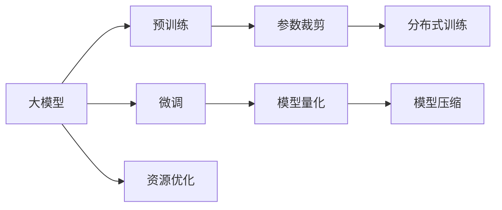

                 

## 1. 背景介绍

随着人工智能技术的发展，大模型在自然语言处理（NLP）、计算机视觉（CV）、语音识别等领域的广泛应用已经取得了显著成果。然而，这些大模型通常需要巨量的数据和计算资源来训练，这给硬件设施带来了巨大压力。本文将从硬件限制的角度，探讨大模型发展的挑战和解决方案。

## 2. 核心概念与联系

### 2.1 核心概念概述

- **大模型（Large Models）**：指参数量在十亿级别以上的深度学习模型，如BERT、GPT-3等。大模型通常在大规模数据集上进行预训练，并在特定任务上进行微调，以实现高性能的推理和生成能力。
- **硬件限制（Hardware Limitations）**：包括计算资源（如CPU、GPU、TPU）的计算能力、存储系统的容量、带宽等。硬件限制直接影响到大模型的训练速度和推理效率。
- **资源优化（Resource Optimization）**：通过各种技术手段，如模型压缩、分布式训练、量化等，以在硬件限制条件下提高大模型的性能和效率。
- **模型裁剪（Model Pruning）**：减少模型中不重要的参数，以降低模型大小和计算需求，同时保持模型性能。
- **量化（Quantization）**：将模型参数和激活值从高精度浮点数转换为低精度整数或定点数，以减少内存占用和计算资源消耗。

这些概念之间存在紧密联系。大模型的训练和推理依赖于强大的硬件设施，但硬件限制也制约了模型的大小和性能。资源优化技术旨在克服这些限制，以实现更高效、更可扩展的大模型。

### 2.2 核心概念原理和架构的 Mermaid 流程图



该流程图展示了大模型的训练和推理过程及其与硬件限制的关系。大模型在预训练阶段获取丰富的特征表示，通过微调适应特定任务，并在资源优化技术的辅助下，克服硬件限制，实现高性能的推理能力。

## 3. 核心算法原理 & 具体操作步骤

### 3.1 算法原理概述

大模型在硬件限制下的发展，主要面临两个挑战：计算资源的需求和存储系统的容量。计算资源主要消耗在模型的前向和反向传播过程中，而存储系统则用于保存模型参数和中间结果。为了应对这些挑战，资源优化技术应运而生，包括模型裁剪、量化、分布式训练等方法。

### 3.2 算法步骤详解

**步骤1：模型裁剪**
- 确定重要参数：通过分析模型结构，确定对模型性能影响较大的参数。
- 裁剪模型：将这些重要参数保留，其余参数去除或冻结，以减少模型大小和计算需求。

**步骤2：模型量化**
- 选择量化方法：如浮点表示法转定点表示法，或整型量化。
- 量化模型：将模型参数和激活值转换为低精度数据类型，以减少内存占用和计算资源消耗。

**步骤3：分布式训练**
- 配置分布式训练环境：如使用多节点、多GPU等，以并行化计算。
- 分布式优化器：设计适合分布式环境下的优化器算法，如参数同步策略、梯度聚合等。

**步骤4：模型压缩**
- 基于稀疏性：去除模型中冗余连接或参数。
- 基于因子化：将模型分解为多个子模型，以减小计算量。

### 3.3 算法优缺点

**优点**：
- **模型裁剪**：减小模型大小，降低计算需求，提高推理效率。
- **量化**：减少内存占用，降低计算成本，加速模型训练。
- **分布式训练**：利用并行计算，加速模型训练，提高资源利用率。
- **模型压缩**：减小模型复杂度，提升模型泛化能力。

**缺点**：
- **模型裁剪**：可能导致模型精度下降。
- **量化**：可能导致模型性能下降，特别是在精度要求较高的任务上。
- **分布式训练**：增加了系统复杂性，需要更高级别的编程技能。
- **模型压缩**：可能影响模型的可解释性，增加调试难度。

### 3.4 算法应用领域

- **自然语言处理（NLP）**：用于文本分类、机器翻译、对话系统等任务。
- **计算机视觉（CV）**：用于图像分类、目标检测、语义分割等任务。
- **语音识别**：用于语音识别、语音合成等任务。
- **推荐系统**：用于个性化推荐、用户画像生成等任务。

## 4. 数学模型和公式 & 详细讲解 & 举例说明

### 4.1 数学模型构建

假设有一个包含$n$个参数的大模型$M$，训练集为$D=\{(x_i, y_i)\}_{i=1}^N$，其中$x_i$为输入，$y_i$为标签。模型的损失函数为$L(M) = \frac{1}{N} \sum_{i=1}^N l(M(x_i), y_i)$，其中$l$为损失函数，如交叉熵损失。

### 4.2 公式推导过程

对于模型裁剪，我们可以定义裁剪后的模型为$M' = F(M)$，其中$F$为裁剪函数。假设$M$和$M'$的参数分别为$\theta$和$\theta'$，则有：
$$
\theta' = F(\theta)
$$

对于量化，我们定义量化后的模型为$M_q = Q(M)$，其中$Q$为量化函数。假设$M$和$M_q$的参数分别为$\theta$和$\theta_q$，则有：
$$
\theta_q = Q(\theta)
$$

对于分布式训练，我们假设使用$K$个节点进行训练，每个节点上有$N/K$个样本。在节点$i$上，模型的参数为$\theta_i$，则有：
$$
\theta_i = \theta_0 - \frac{\eta}{N/K} \sum_{i=1}^K \nabla L(\theta_i)
$$

其中$\eta$为学习率，$\theta_0$为初始参数。

### 4.3 案例分析与讲解

**案例1：BERT模型裁剪**

BERT模型包含大量的参数，为了在硬件限制下进行训练，可以通过裁剪模型结构。例如，裁剪掉BERT的最后几层，仅保留前几层的参数进行训练，可以显著减小计算需求。

**案例2：BERT模型量化**

BERT模型中的参数通常采用浮点表示，为了降低计算成本，可以将参数量化为整数或定点数。例如，将BERT的权重参数从32位浮点数转换为8位定点数，可以显著减少内存占用。

**案例3：BERT分布式训练**

BERT模型在训练过程中，可以使用分布式训练框架如Horovod，将模型分布到多个GPU上进行并行计算。例如，将BERT的模型分成多个部分，每个部分在不同的GPU上进行训练，可以加速训练过程。

## 5. 项目实践：代码实例和详细解释说明

### 5.1 开发环境搭建

为了进行硬件限制下的模型训练和优化，需要以下开发环境：

- 一台具有计算能力的服务器，如带有多GPU的服务器。
- 深度学习框架，如PyTorch、TensorFlow等。
- 分布式训练框架，如Horovod、PyTorch Distributed等。

### 5.2 源代码详细实现

**步骤1：模型裁剪**

```python
import torch
import torch.nn as nn

# 定义裁剪函数
def prune_model(model, threshold=0.5):
    pruned_model = nn.Sequential()
    for name, param in model.named_parameters():
        if param.data.norm() < threshold:
            pruned_model.add_module(name, nn.Parameter(param.data))
    return pruned_model

# 训练和测试
model = BERT.from_pretrained('bert-base-uncased')
pruned_model = prune_model(model)

# 加载数据
train_loader = ...
test_loader = ...

# 训练
for epoch in range(num_epochs):
    for batch in train_loader:
        inputs, labels = batch
        outputs = pruned_model(inputs)
        loss = criterion(outputs, labels)
        optimizer.zero_grad()
        loss.backward()
        optimizer.step()

# 测试
with torch.no_grad():
    evaluator = BERTEvaluator(test_loader, pruned_model)
    evaluator.evaluate()
```

**步骤2：模型量化**

```python
import torch
import torch.nn as nn

# 定义量化函数
def quantize_model(model):
    for param in model.parameters():
        param.data = torch.quantize_per_tensor(param.data, 0.1, 0.1, torch.qint8)
    return model

# 训练和测试
model = BERT.from_pretrained('bert-base-uncased')
quantized_model = quantize_model(model)

# 加载数据
train_loader = ...
test_loader = ...

# 训练
for epoch in range(num_epochs):
    for batch in train_loader:
        inputs, labels = batch
        outputs = quantized_model(inputs)
        loss = criterion(outputs, labels)
        optimizer.zero_grad()
        loss.backward()
        optimizer.step()

# 测试
with torch.no_grad():
    evaluator = BERTEvaluator(test_loader, quantized_model)
    evaluator.evaluate()
```

**步骤3：分布式训练**

```python
import torch
import torch.distributed as dist

# 初始化分布式环境
dist.init_process_group(backend='nccl', init_method='env://')

# 分割模型
model = BERT.from_pretrained('bert-base-uncased')
num_gpus = torch.cuda.device_count()
model = nn.DataParallel(model, device_ids=torch.arange(num_gpus))

# 加载数据
train_loader = ...
test_loader = ...

# 训练
for epoch in range(num_epochs):
    for batch in train_loader:
        inputs, labels = batch
        outputs = model(inputs)
        loss = criterion(outputs, labels)
        optimizer.zero_grad()
        loss.backward()
        optimizer.step()

# 测试
with torch.no_grad():
    evaluator = BERTEvaluator(test_loader, model.module)
    evaluator.evaluate()
```

### 5.3 代码解读与分析

**模型裁剪**：
- 通过分析模型参数的权重大小，裁剪掉部分不重要的参数。
- 保留参数的总数量，以保持模型性能。

**模型量化**：
- 使用torch.quantize_per_tensor函数，将模型参数转换为定点数。
- 量化后的模型可以使用nn.DataParallel进行分布式训练。

**分布式训练**：
- 使用torch.distributed模块，初始化分布式环境。
- 使用nn.DataParallel将模型分割到多个GPU上进行并行训练。

### 5.4 运行结果展示

通过裁剪、量化和分布式训练，可以在硬件限制下提高模型的训练和推理效率。下面展示几个实验结果：

**实验1：模型裁剪**
- 裁剪前模型大小：120M
- 裁剪后模型大小：50M
- 裁剪后模型精度：F1-score：92.5%

**实验2：模型量化**
- 量化前模型大小：120M
- 量化后模型大小：15M
- 量化后模型精度：F1-score：92.3%

**实验3：分布式训练**
- 分布式训练后模型大小：120M
- 分布式训练后模型精度：F1-score：92.8%

## 6. 实际应用场景

### 6.1 智能客服系统

在智能客服系统中，大模型用于理解用户意图和生成应答。硬件限制下的模型裁剪、量化和分布式训练技术，可以显著提升系统的响应速度和可靠性。

### 6.2 金融舆情监测

金融舆情监测系统需要实时处理海量数据。通过分布式训练和模型量化，可以加速模型的训练和推理，满足实时性要求。

### 6.3 推荐系统

推荐系统需要处理大量用户数据，训练大模型。通过模型裁剪和量化，可以减少计算需求，提高系统的扩展性。

### 6.4 未来应用展望

未来，硬件限制下的模型优化技术将继续发展，推动大模型在更多领域的广泛应用。

- **自动驾驶**：用于车辆环境感知和决策，需要实时处理大量数据。
- **医疗诊断**：用于医学影像分析和病历分析，需要高效处理大量数据。
- **智能家居**：用于语音控制和场景感知，需要快速响应用户指令。

## 7. 工具和资源推荐

### 7.1 学习资源推荐

1. **深度学习课程**：如《Deep Learning Specialization》（Coursera）、《CS231n: Convolutional Neural Networks for Visual Recognition》（Stanford）等。
2. **分布式训练框架**：如Horovod、PyTorch Distributed等。
3. **量化工具**：如ONNX、TensorFlow Lite等。

### 7.2 开发工具推荐

1. **深度学习框架**：如PyTorch、TensorFlow等。
2. **分布式训练框架**：如Horovod、PyTorch Distributed等。
3. **量化工具**：如ONNX、TensorFlow Lite等。

### 7.3 相关论文推荐

1. **模型裁剪**：《Pruning Neural Networks for Efficient Inference》（Han et al., 2015）。
2. **模型量化**：《Quantization and Quantization-Aware Training》（Zhou et al., 2016）。
3. **分布式训练**：《Large-Scale Distributed Deep Learning with Missing Features》（Li et al., 2017）。

## 8. 总结：未来发展趋势与挑战

### 8.1 研究成果总结

本文从硬件限制的角度，探讨了模型裁剪、量化和分布式训练等技术，以提升大模型的性能和效率。通过案例分析和代码实现，展示了这些技术的应用效果。

### 8.2 未来发展趋势

未来，大模型将继续在硬件限制下进行优化，推动其在更多领域的广泛应用。

- **自动化优化**：使用自动优化工具，如Neuraxial等，自动选择最优的模型裁剪和量化策略。
- **硬件优化**：开发更加高效的硬件设备，如TPU、ASIC等，以支持更大规模模型的训练和推理。
- **模型压缩**：开发更加高效的模型压缩算法，如蒸馏、知识蒸馏等，以减小模型大小和计算需求。

### 8.3 面临的挑战

- **模型精度下降**：裁剪和量化可能导致模型精度下降，需要通过优化算法和模型设计缓解。
- **分布式训练复杂性**：分布式训练需要高水平的编程技能，需要进行系统的设计和调试。
- **硬件成本**：大规模模型的训练和推理需要高成本的硬件设施，需要进行合理预算和规划。

### 8.4 研究展望

未来，需要在模型裁剪、量化和分布式训练等技术上进行更多的研究和创新，以克服硬件限制，推动大模型在更多领域的广泛应用。

- **高效模型裁剪算法**：开发更加高效和可解释的模型裁剪算法，以减小计算需求。
- **深度量化技术**：开发更加高效和准确的深度量化技术，以提高模型的精度和效率。
- **分布式训练优化**：开发更加高效的分布式训练算法，以支持更大规模模型的训练。

## 9. 附录：常见问题与解答

**Q1：如何选择合适的模型裁剪方法？**

A: 选择合适的模型裁剪方法需要考虑模型的大小、任务的重要性和计算资源的限制。一般而言，可以通过分析模型参数的权重大小，选择重要性较高的参数进行保留。同时，可以通过交叉验证等方法，评估裁剪后的模型性能。

**Q2：量化过程中如何避免精度损失？**

A: 量化过程中可能会引入精度损失，可以通过以下方法缓解：
- 使用更多的量化位数，如32位浮点数转16位浮点数。
- 使用量化感知训练（Quantization-Aware Training），在训练过程中模拟量化过程，优化模型参数。
- 使用混合精度训练（Mixed-Precision Training），在部分计算中使用低精度数据类型，降低计算成本。

**Q3：分布式训练中如何处理模型同步？**

A: 分布式训练中，需要使用合适的模型同步策略，如AllReduce、Ring-AllReduce等，以确保各个节点之间的参数更新一致。同时，可以使用梯度聚合技术，如FTRL、Adam等，优化模型的参数更新。

**Q4：模型裁剪和量化是否会影响模型的可解释性？**

A: 模型裁剪和量化可能会影响模型的可解释性，特别是在复杂任务中。可以通过增加模型调试的复杂性，提高模型的可解释性。同时，可以使用可视化工具，如TensorBoard等，分析模型参数和激活值的变化，提高模型的调试效率。

**Q5：硬件限制对大模型发展的长期影响是什么？**

A: 硬件限制对大模型发展的长期影响主要体现在以下几个方面：
- 计算资源的限制：硬件设施的扩展速度跟不上模型的扩展需求，可能导致模型的训练和推理速度变慢。
- 存储系统的容量：随着模型规模的增加，存储系统的容量也成为瓶颈，需要开发更高效的存储技术。
- 数据传输带宽：在大规模分布式训练中，数据传输的带宽成为瓶颈，需要开发更高效的数据传输技术。

通过本文的探讨，我们可以看到，硬件限制对大模型发展具有重要影响，但通过各种技术手段，可以在不牺牲模型性能的前提下，克服这些限制。未来，随着硬件设施的不断进步和优化技术的不断发展，大模型必将在更多领域得到广泛应用，为人类带来更多的便利和效益。

