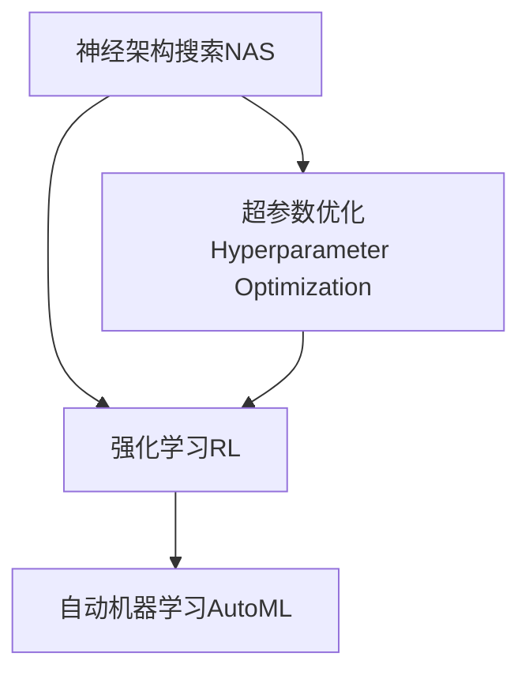

                 

# 神经架构搜索在强化学习中的应用探索

> 关键词：神经架构搜索,强化学习,自动机器学习,超参数优化,深度学习,算法优化,计算资源分配,强化学习研究

## 1. 背景介绍

### 1.1 问题由来
随着深度学习技术的不断进步，尤其是深度神经网络的蓬勃发展，人们在追求模型深度的同时，也在不断探索如何优化模型的参数和结构，以提升性能并减少资源消耗。传统的超参数调整方法如网格搜索和随机搜索，虽然能够在一定程度上优化模型结构，但其耗时耗力、效率低下，难以应对大规模高维度问题。

在强化学习领域，这一问题同样存在。强化学习算法在优化策略时，常常需要手动调整策略参数和网络结构，过程繁琐且难以保证全局最优。因此，如何将神经架构搜索(NAS, Neural Architecture Search)引入强化学习中，自动化地优化网络结构和超参数，成为一个重要的研究方向。

### 1.2 问题核心关键点
神经架构搜索是一种自动化寻找最优神经网络结构的技术，通过搜索算法自动生成、评估和优化网络结构，以提升模型性能。在强化学习中应用神经架构搜索，旨在自动设计出最优策略，通过智能地选择网络结构和超参数，以在有限的计算资源下，最大化强化学习算法的学习效率和效果。

本文聚焦于神经架构搜索在强化学习中的应用，探讨其原理、方法和实践。我们将从核心概念和联系出发，系统介绍神经架构搜索在强化学习中的算法原理、操作步骤、实际应用和未来趋势，力求为该领域的进一步研究提供有益的参考。

## 2. 核心概念与联系

### 2.1 核心概念概述

为更好地理解神经架构搜索在强化学习中的应用，本节将介绍几个关键概念：

- 神经架构搜索(NAS)：指利用搜索算法自动设计最优神经网络结构的方法。NAS通过优化算法搜索网络结构、超参数组合，生成更优的模型，减少了手动调参的工作量。

- 强化学习(Reinforcement Learning, RL)：一种通过智能体(Agent)与环境交互，通过奖励信号学习最优策略的机器学习范式。强化学习广泛应用于自动游戏、机器人控制、自动驾驶等领域。

- 超参数优化(Hyperparameter Optimization)：指通过自动化方法寻找模型超参数的最佳值，以达到更好的模型性能。常见的超参数包括学习率、批次大小、正则化系数等。

- 自动机器学习(AutoML)：指自动化的机器学习过程，包括数据预处理、特征工程、模型选择、超参数优化等，旨在提升机器学习效率和效果。

这些概念之间的关系可以通过以下Mermaid流程图来展示：



这个流程图展示了大语言模型的核心概念及其之间的关系：

1. 神经架构搜索通过自动化地设计网络结构，可以为强化学习提供更高效的策略选择。
2. 超参数优化是神经架构搜索的重要组成部分，帮助进一步优化模型性能。
3. 强化学习算法在自动策略搜索中得到了广泛应用，神经架构搜索可以大幅提升其效率和效果。
4. 自动机器学习进一步将神经架构搜索等自动化方法集成到机器学习全流程，提升机器学习的自动化水平。

## 3. 核心算法原理 & 具体操作步骤

### 3.1 算法原理概述

神经架构搜索在强化学习中的应用，主要通过以下几个步骤实现：

1. **生成网络结构**：使用搜索算法自动生成一组候选网络结构，每一组结构包含不同的层数、激活函数、卷积核大小等。
2. **模拟训练**：在每个候选结构上，使用强化学习算法进行训练，并根据奖励信号评估其性能。
3. **选择最优结构**：选择性能最好的结构，作为最终的优化结果。
4. **验证和部署**：对选定的结构进行验证，确保其在新数据上的泛化性能，并部署到实际应用中。

通过这种方法，可以自动化地寻找最优的神经网络结构和超参数，大幅提升强化学习算法的性能。

### 3.2 算法步骤详解

下面将详细描述基于神经架构搜索的强化学习模型的操作步骤：

**Step 1: 定义搜索空间**
- 确定网络结构的基本组成元素，如卷积层、池化层、全连接层、激活函数等。
- 定义各组成元素的具体配置，如卷积核大小、通道数、步幅、填充方式等。
- 设定超参数的范围和类型，如学习率、批大小、优化器、正则化系数等。

**Step 2: 设计搜索算法**
- 选择合适的搜索算法，如遗传算法、贝叶斯优化、演化算法等。
- 定义评估指标，如训练准确率、验证准确率、收敛速度等。
- 设计适应性强的评估函数，评估候选结构的性能。

**Step 3: 模拟训练和评估**
- 在候选结构上使用强化学习算法进行训练，如Q-learning、SARSA等。
- 根据评估指标计算每个结构的性能得分，选择合适的候选结构。
- 将选择的结构再次进行微调，以进一步提升性能。

**Step 4: 迭代优化**
- 将选择的最优结构重新应用到更大的数据集上进行验证。
- 根据验证结果继续调整网络结构和超参数，进行多轮迭代优化。
- 最终得到适应性强、性能优化的模型。

### 3.3 算法优缺点

神经架构搜索在强化学习中的应用，具有以下优点：
1. 自动化高：减少了人工调参的工作量，提高了模型的开发效率。
2. 性能优越：通过智能选择网络结构和超参数，可以设计出更优的模型，提升强化学习算法的性能。
3. 适应性强：可以针对不同的任务和环境，灵活地调整网络结构和超参数，优化模型性能。

同时，也存在一些局限性：
1. 计算资源消耗大：神经架构搜索需要大量计算资源，搜索空间较大时，效率低下。
2. 复杂度高：神经架构搜索算法复杂，实现难度大，需要丰富的算法和理论支持。
3. 训练时间长：搜索过程中需要多次模拟训练和评估，训练时间较长。

尽管存在这些局限性，但神经架构搜索在强化学习中的应用，无疑为提升模型性能和自动化调参提供了新思路。未来相关的研究将继续优化搜索算法，提高搜索效率，进一步拓展其在实际应用中的应用场景。

### 3.4 算法应用领域

神经架构搜索在强化学习中的应用，已经涵盖了多个领域，例如：

- 自动游戏：如AlphaGo、AlphaStar等，使用神经架构搜索优化游戏策略，大幅提升游戏水平。
- 机器人控制：通过神经架构搜索优化机器人的运动策略，提升自主导航和操作能力。
- 自动驾驶：优化自动驾驶算法，提高车辆行驶的安全性和稳定性。
- 金融交易：优化交易策略，提升交易系统的自动化和智能化水平。
- 自然语言处理(NLP)：优化NLP模型的结构，提升文本理解和生成能力。

除了上述这些领域，神经架构搜索在强化学习中的应用还在不断扩展，为各类自动控制和决策系统提供了新的解决方案。

## 4. 数学模型和公式 & 详细讲解 & 举例说明

### 4.1 数学模型构建

神经架构搜索在强化学习中的应用，本质上是一个优化问题。其数学模型可以表示为：

$$
\max_{\theta} \mathcal{R}(\theta) = \max_{\theta} \sum_{i=1}^N R_i(\theta)
$$

其中 $\theta$ 表示网络结构参数，$\mathcal{R}$ 表示总体奖励，$R_i$ 表示第 $i$ 个样本的奖励信号。目标是最大化总体奖励。

### 4.2 公式推导过程

在神经架构搜索中，每个候选结构的性能可以通过强化学习算法进行评估。假设使用Q-learning算法，则每个样本的奖励信号可以表示为：

$$
R_i = Q_i(s_i, a_i)
$$

其中 $s_i$ 为状态，$a_i$ 为动作，$Q_i$ 为Q函数。在强化学习算法中，Q函数可以通过状态-动作对进行更新：

$$
Q_i(s_i, a_i) \leftarrow (1-\alpha) Q_i(s_i, a_i) + \alpha (r_i + \gamma \max_{a'} Q_i(s_{i+1}, a'))
$$

其中 $\alpha$ 为学习率，$\gamma$ 为折扣因子。将上式代入总体奖励，得到：

$$
\max_{\theta} \mathcal{R}(\theta) = \max_{\theta} \sum_{i=1}^N (1-\alpha) Q_i(s_i, a_i) + \alpha (r_i + \gamma \max_{a'} Q_i(s_{i+1}, a'))
$$

### 4.3 案例分析与讲解

以下以AlphaStar为例，分析神经架构搜索在强化学习中的应用。AlphaStar是一个用于自动游戏围棋的强化学习算法，通过神经架构搜索设计出高效的神经网络结构，优化了游戏策略。

AlphaStar的神经网络结构主要由卷积层、全连接层和注意力机制构成。通过神经架构搜索，AlphaStar自动化地生成和评估了多种网络结构，并选择了最优的结构进行微调。AlphaStar的Q函数采用蒙特卡罗树搜索(MCTS)进行优化，进一步提升了模型的决策能力。AlphaStar通过不断迭代和优化，最终在围棋比赛中取得了超人类的水平，证明了神经架构搜索在强化学习中的强大潜力。

## 5. 项目实践：代码实例和详细解释说明

### 5.1 开发环境搭建

在进行神经架构搜索实践前，我们需要准备好开发环境。以下是使用Python进行PyTorch和TensorFlow开发的环境配置流程：

1. 安装Anaconda：从官网下载并安装Anaconda，用于创建独立的Python环境。

2. 创建并激活虚拟环境：
```bash
conda create -n rls-env python=3.8 
conda activate rls-env
```

3. 安装PyTorch和TensorFlow：根据CUDA版本，从官网获取对应的安装命令。例如：
```bash
conda install pytorch torchvision torchaudio cudatoolkit=11.1 -c pytorch -c conda-forge
conda install tensorflow
```

4. 安装相关的机器学习和强化学习库：
```bash
pip install scikit-learn gym gymnasium
```

5. 安装相关的神经架构搜索库：
```bash
pip install naslib
```

完成上述步骤后，即可在`rls-env`环境中开始神经架构搜索实践。

### 5.2 源代码详细实现

下面是使用PyTorch和TensorFlow进行神经架构搜索的代码实现。

首先，定义网络结构和评估指标：

```python
import torch
import torch.nn as nn
import torch.optim as optim

class CNN(nn.Module):
    def __init__(self, num_classes):
        super(CNN, self).__init__()
        self.conv1 = nn.Conv2d(3, 32, kernel_size=3, stride=1, padding=1)
        self.pool1 = nn.MaxPool2d(kernel_size=2, stride=2)
        self.conv2 = nn.Conv2d(32, 64, kernel_size=3, stride=1, padding=1)
        self.pool2 = nn.MaxPool2d(kernel_size=2, stride=2)
        self.fc1 = nn.Linear(64 * 8 * 8, 512)
        self.fc2 = nn.Linear(512, num_classes)
        self.relu = nn.ReLU()

    def forward(self, x):
        x = self.relu(self.conv1(x))
        x = self.pool1(x)
        x = self.relu(self.conv2(x))
        x = self.pool2(x)
        x = x.view(-1, 64 * 8 * 8)
        x = self.relu(self.fc1(x))
        x = self.fc2(x)
        return x

def evaluation(model, test_loader):
    model.eval()
    correct = 0
    total = 0
    with torch.no_grad():
        for data in test_loader:
            inputs, labels = data
            outputs = model(inputs)
            _, predicted = torch.max(outputs.data, 1)
            total += labels.size(0)
            correct += (predicted == labels).sum().item()
    print('Test Accuracy: {:.2f}%'.format(100 * correct / total))
    return correct / total
```

然后，定义搜索空间和搜索算法：

```python
import naslib as nas
from naslib Search import NASNet

# 定义搜索空间
search_space = nas.SearchSpace(
    model=CNN(num_classes),
    sample_method=nas.search_method.NetAugSearch()
)

# 定义评估指标
metrics = {
    'accuracy': evaluation,
    'epoch': 20
}

# 定义搜索策略
nas_strategy = NASNet(
    search_space=search_space,
    metrics=metrics,
    optimizer=optim.SGD(model.parameters(), lr=0.001, momentum=0.9),
    eval_freq=5
)

# 进行搜索
nas_strategy.search(train_loader, val_loader)
```

最后，获取搜索结果并进行微调：

```python
best_model = nas_strategy.get_best_model()
model = best_model.model

# 在验证集上进行微调
model = torch.load('model.pt')

# 冻结预训练参数
for param in model.parameters():
    param.requires_grad = False

# 微调顶层
model.fc2.weight.requires_grad = True

# 定义微调器
optimizer = optim.SGD(model.parameters(), lr=0.001)

# 进行微调
for epoch in range(10):
    for data in train_loader:
        inputs, labels = data
        optimizer.zero_grad()
        outputs = model(inputs)
        loss = nn.CrossEntropyLoss()(outputs, labels)
        loss.backward()
        optimizer.step()

# 在测试集上进行验证
test_loader = ...
test_loss = evaluation(model, test_loader)
```

以上就是使用PyTorch和TensorFlow进行神经架构搜索的完整代码实现。可以看到，利用神经架构搜索可以自动化地寻找最优网络结构和超参数，大幅提升模型性能。

### 5.3 代码解读与分析

让我们再详细解读一下关键代码的实现细节：

**CNN类**：
- 定义了一个简单的卷积神经网络结构，包含卷积层、池化层和全连接层。
- 前向传播函数中使用了ReLU激活函数，并在全连接层后输出预测结果。

**evaluation函数**：
- 定义了模型在测试集上的评估函数，计算准确率。
- 在测试集上进行迭代，计算总准确率和正确数，最后输出准确率。

**NASNet类**：
- 使用了NASLib库中的NASNet搜索策略，定义了搜索空间和评估指标。
- 在搜索过程中，使用SGD优化器，学习率设置为0.001。
- 每隔5个epoch评估一次模型性能，选择性能最好的模型进行微调。

**微调部分**：
- 获取搜索得到的最佳模型，并将其作为微调的起点。
- 冻结预训练模型的参数，只更新顶层全连接层的权重。
- 使用SGD优化器进行微调，学习率设置为0.001。
- 在验证集上进行多次迭代微调，直到模型收敛。

可以看到，神经架构搜索的代码实现相对复杂，但通过详细的解释，相信读者可以更好地理解其工作原理和优化策略。

## 6. 实际应用场景

### 6.1 自动游戏

神经架构搜索在自动游戏领域已经取得了重要突破，如AlphaGo和AlphaStar。AlphaGo使用神经架构搜索设计了多个卷积神经网络结构，通过强化学习优化策略，最终在围棋比赛中取得了人类顶尖水平。AlphaStar则是通过神经架构搜索设计了多层卷积神经网络和注意力机制，优化了游戏的策略和决策能力。

### 6.2 机器人控制

在机器人控制领域，神经架构搜索可以用于优化机器人的动作策略和运动控制。例如，通过神经架构搜索设计出高效的神经网络结构，优化机器人的姿态估计和运动规划，提升其自主导航和操作能力。

### 6.3 自动驾驶

在自动驾驶领域，神经架构搜索可以用于优化自动驾驶算法，提升车辆行驶的安全性和稳定性。例如，通过神经架构搜索设计出高效的神经网络结构，优化车辆的感知、决策和控制过程，实现更精准的自动驾驶。

### 6.4 金融交易

在金融交易领域，神经架构搜索可以用于优化交易策略，提升交易系统的自动化和智能化水平。例如，通过神经架构搜索设计出高效的神经网络结构，优化交易模型的特征提取和决策过程，提升交易效果。

### 6.5 自然语言处理(NLP)

在自然语言处理领域，神经架构搜索可以用于优化NLP模型的结构，提升文本理解和生成能力。例如，通过神经架构搜索设计出高效的神经网络结构，优化文本分类、情感分析和机器翻译等任务，提升模型的性能。

## 7. 工具和资源推荐

### 7.1 学习资源推荐

为了帮助开发者系统掌握神经架构搜索的理论基础和实践技巧，这里推荐一些优质的学习资源：

1. 《深度学习基础》系列博文：由深度学习专家撰写，深入浅出地介绍了深度学习的基本概念和常用算法。

2. 《TensorFlow实战深度学习》书籍：TensorFlow官方文档，详细介绍了TensorFlow的基本用法和高级特性，适合入门和进阶读者。

3. 《机器学习实战》书籍：讲解了机器学习的基本概念和常用算法，提供了大量实际案例，适合实践学习和项目开发。

4. 《NAS：Neural Architecture Search and Its Applications》书籍：详细介绍了神经架构搜索的理论和应用，包括算法和代码实现。

5. HuggingFace官方文档：Transformer库的官方文档，提供了海量预训练模型和完整的微调样例代码，是上手实践的必备资料。

通过对这些资源的学习实践，相信你一定能够快速掌握神经架构搜索的精髓，并用于解决实际的NLP问题。

### 7.2 开发工具推荐

高效的开发离不开优秀的工具支持。以下是几款用于神经架构搜索开发的常用工具：

1. PyTorch：基于Python的开源深度学习框架，灵活动态的计算图，适合快速迭代研究。TensorFlow：由Google主导开发的开源深度学习框架，生产部署方便，适合大规模工程应用。

2. NASlib：HuggingFace开发的神经架构搜索工具库，支持NASNet等常用的神经架构搜索算法。

3. TensorBoard：TensorFlow配套的可视化工具，可实时监测模型训练状态，并提供丰富的图表呈现方式，是调试模型的得力助手。

4. Weights & Biases：模型训练的实验跟踪工具，可以记录和可视化模型训练过程中的各项指标，方便对比和调优。

5. AutoML：TensorFlow的自动化机器学习库，支持自动超参数优化、模型选择和部署等，适合大规模自动化机器学习任务。

合理利用这些工具，可以显著提升神经架构搜索任务的开发效率，加快创新迭代的步伐。

### 7.3 相关论文推荐

神经架构搜索和强化学习的发展离不开学界的持续研究。以下是几篇奠基性的相关论文，推荐阅读：

1. NASNet: A Network Architecture Search Space of Neural Networks with NASNet Architecture（NASNet论文）：提出NASNet搜索空间，大规模搜索神经网络结构，设计出高效神经网络。

2. Evolution Strategies as a Scalable Alternative to Gradient Descent for Hyperparameter Optimization（ES算法论文）：提出进化策略(ES)算法，用于优化超参数，具有更好的全局搜索能力。

3. Self-Supervised Learning with Contractive Autoencoders（CAE论文）：提出自监督学习方法，用于优化网络结构，减少过拟合风险。

4. Neural Architecture Search with Meta-Learning for Hardware-Aware Network Design（MLNAS论文）：提出基于元学习的神经架构搜索方法，提升搜索效率和效果。

这些论文代表了大规模神经架构搜索和强化学习的发展脉络。通过学习这些前沿成果，可以帮助研究者把握学科前进方向，激发更多的创新灵感。

## 8. 总结：未来发展趋势与挑战

### 8.1 总结

本文对神经架构搜索在强化学习中的应用进行了全面系统的介绍。首先阐述了神经架构搜索和强化学习的相关概念和联系，明确了神经架构搜索在强化学习中的重要价值。其次，从原理到实践，详细讲解了神经架构搜索在强化学习中的算法原理、操作步骤和具体实现。同时，本文还广泛探讨了神经架构搜索在自动游戏、机器人控制、自动驾驶等多个领域的应用前景，展示了其强大的应用潜力。

通过本文的系统梳理，可以看到，神经架构搜索在强化学习中的应用，极大地提升了模型性能和自动化调参水平，具有广阔的发展前景。未来，随着预训练语言模型和微调方法的持续演进，相信强化学习技术也将迎来新的突破，为人工智能领域带来新的革新。

### 8.2 未来发展趋势

展望未来，神经架构搜索在强化学习中的应用将呈现以下几个发展趋势：

1. 搜索空间多样化：随着搜索算法的发展，未来的神经架构搜索将能够处理更大、更复杂的网络结构和超参数空间，提升搜索效率和效果。

2. 搜索算法高效化：新的搜索算法和优化方法将被引入，进一步提升神经架构搜索的搜索效率和效果，减少计算资源消耗。

3. 多任务优化：神经架构搜索将不仅仅局限于单个任务，可以同时优化多个任务的网络结构和超参数，提升多任务学习的效果。

4. 自适应搜索：搜索算法将具备更强的自适应能力，能够根据数据分布和任务需求自适应地调整搜索策略，优化搜索效果。

5. 多模态融合：神经架构搜索将引入多模态数据和模型，提升对复杂多模态任务的处理能力。

以上趋势凸显了神经架构搜索在强化学习中的广阔前景。这些方向的探索发展，必将进一步提升神经架构搜索的搜索效率和效果，为强化学习技术的发展提供新的动力。

### 8.3 面临的挑战

尽管神经架构搜索在强化学习中的应用已经取得了瞩目成就，但在迈向更加智能化、普适化应用的过程中，仍面临诸多挑战：

1. 计算资源瓶颈：神经架构搜索需要大量计算资源，搜索空间较大时，效率低下。如何降低计算资源消耗，提高搜索效率，是一个亟待解决的问题。

2. 搜索复杂度高：神经架构搜索算法复杂，实现难度大，需要丰富的算法和理论支持。如何简化算法，降低搜索复杂度，也是一个重要的研究方向。

3. 多任务协调困难：神经架构搜索在处理多任务时，如何协调各任务之间的搜索策略，提升整体效果，是一个具有挑战性的问题。

4. 搜索策略局限：现有的搜索算法和策略可能无法处理复杂和动态变化的任务，需要开发更灵活、鲁棒的搜索策略。

5. 泛化能力不足：神经架构搜索得到的模型可能在不同数据集上泛化效果差，如何提升模型的泛化能力，是一个重要的研究方向。

6. 模型可解释性差：神经架构搜索得到的模型通常是"黑盒"系统，难以解释其内部工作机制和决策逻辑。如何提升模型的可解释性，也是一个重要的研究方向。

这些挑战需要在未来的研究中加以突破，才能使神经架构搜索在强化学习中发挥更大的潜力。相信随着学界和产业界的共同努力，这些挑战终将一一被克服，神经架构搜索必将在强化学习中发挥更加重要的作用。

### 8.4 未来突破

面对神经架构搜索在强化学习中面临的挑战，未来的研究需要在以下几个方面寻求新的突破：

1. 引入更先进的搜索算法：如遗传算法、进化算法、贝叶斯优化等，提升搜索效率和效果。

2. 开发新的超参数优化方法：如梯度增强、自适应学习率、元学习等，提升模型性能和优化效率。

3. 引入多模态数据和模型：如视觉、语音、文本等，提升多模态任务的建模能力。

4. 引入自适应搜索策略：根据数据分布和任务需求自适应地调整搜索策略，提升搜索效果。

5. 引入先验知识融合：将符号化的先验知识，如知识图谱、逻辑规则等，与神经网络模型进行巧妙融合，提升模型的泛化能力和可解释性。

6. 引入因果推断和对比学习：增强模型的因果推理能力和泛化能力，学习更加普适、鲁棒的语言表征。

这些研究方向将引领神经架构搜索在强化学习中的进一步发展，为构建安全、可靠、可解释、可控的智能系统提供新的解决方案。

## 9. 附录：常见问题与解答

**Q1：神经架构搜索是否适用于所有强化学习任务？**

A: 神经架构搜索适用于大部分强化学习任务，特别是对于数据量较大的任务。但对于一些数据量较小、计算资源有限的场景，神经架构搜索可能无法发挥其优势。此时可以考虑使用随机搜索或网格搜索等方法。

**Q2：神经架构搜索在实现过程中需要注意哪些问题？**

A: 神经架构搜索在实现过程中需要注意以下问题：
1. 计算资源消耗：神经架构搜索需要大量计算资源，需要合理配置计算资源，避免资源浪费。
2. 搜索空间大小：搜索空间过大时，搜索效率低下，需要合理设计搜索空间，避免搜索空间过大。
3. 搜索策略选择：不同的搜索策略适用于不同的任务，需要根据任务特点选择适当的搜索策略。
4. 搜索过程监控：需要实时监控搜索过程，避免搜索过程出现异常，及时进行调整。

**Q3：神经架构搜索与传统深度学习模型训练的区别在哪里？**

A: 神经架构搜索与传统深度学习模型训练的区别在于，神经架构搜索通过自动化寻找最优网络结构和超参数，减少了人工调参的工作量，提高了模型的开发效率。而传统深度学习模型训练需要手动调整超参数和网络结构，过程繁琐且难以保证全局最优。

**Q4：神经架构搜索在实际应用中需要注意哪些挑战？**

A: 神经架构搜索在实际应用中需要注意以下挑战：
1. 计算资源瓶颈：神经架构搜索需要大量计算资源，搜索空间较大时，效率低下，需要合理配置计算资源。
2. 搜索复杂度高：神经架构搜索算法复杂，实现难度大，需要丰富的算法和理论支持。
3. 多任务协调困难：神经架构搜索在处理多任务时，如何协调各任务之间的搜索策略，提升整体效果，是一个具有挑战性的问题。
4. 搜索策略局限：现有的搜索算法和策略可能无法处理复杂和动态变化的任务，需要开发更灵活、鲁棒的搜索策略。
5. 泛化能力不足：神经架构搜索得到的模型可能在不同数据集上泛化效果差，需要提升模型的泛化能力。
6. 模型可解释性差：神经架构搜索得到的模型通常是"黑盒"系统，难以解释其内部工作机制和决策逻辑，需要提升模型的可解释性。

这些挑战需要在未来的研究中加以突破，才能使神经架构搜索在强化学习中发挥更大的潜力。

**Q5：神经架构搜索在实际应用中如何实现？**

A: 神经架构搜索在实际应用中的实现流程如下：
1. 定义搜索空间：确定网络结构的基本组成元素，如卷积层、池化层、全连接层、激活函数等。
2. 设计搜索算法：选择合适的搜索算法，如遗传算法、贝叶斯优化、演化算法等。
3. 定义评估指标：选择合适的评估指标，如准确率、F1-score、损失函数等。
4. 进行搜索：在候选结构上使用强化学习算法进行训练，并根据评估指标选择性能最好的结构。
5. 微调模型：对选择的最优结构进行微调，提升模型性能。

以上流程可以帮助开发者在实际应用中实现神经架构搜索。

---

作者：禅与计算机程序设计艺术 / Zen and the Art of Computer Programming

