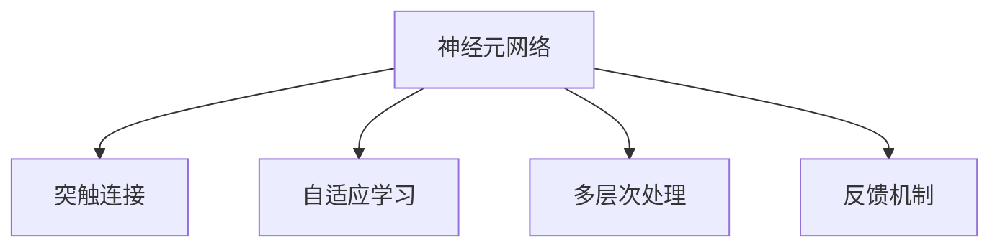

                 

# 神经科学启发的大模型算法创新

## 1. 背景介绍

### 1.1 问题由来

近年来，人工智能领域的技术迅猛发展，尤其是深度学习技术的突破，极大地推动了自然语言处理（NLP）、计算机视觉（CV）等领域的创新应用。在深度学习中，大模型如BERT、GPT-3等以其巨大的参数规模和优越的性能，逐渐成为研究和应用的热点。然而，随着模型规模的不断增大，训练和推理的计算成本也随之激增，这对计算资源和能源的消耗提出了严峻挑战。

在此背景下，研究者们开始借鉴神经科学的最新研究成果，探索神经网络的新结构和算法，试图在保持模型性能的同时，减少其对资源的依赖。神经科学的研究表明，人脑的神经元网络并非独立运行，而是通过复杂的连接和协同工作来实现高效的信息处理。这种连接方式和协同机制为人工智能模型的设计提供了新的启示。

### 1.2 问题核心关键点

神经科学启发的大模型算法创新的核心在于：
1. **神经元间的连接与通信机制**：借鉴神经科学中的突触机制和神经元通信，探索如何在神经网络中建立更加高效、鲁棒的信息传递机制。
2. **网络结构的简化与优化**：基于神经科学研究，简化网络结构，减少不必要的参数和计算，提高模型训练和推理的效率。
3. **模型的多层次协同与反馈机制**：借鉴神经网络中的多层次处理和反馈机制，设计具有自我纠错和改进能力的深度学习模型。
4. **模型的可解释性与认知公平性**：从神经科学的角度，提升模型的可解释性和认知公平性，确保模型在复杂环境中的稳定性和可靠性。

## 2. 核心概念与联系

### 2.1 核心概念概述

为更好地理解神经科学启发的大模型算法创新，本节将介绍几个密切相关的核心概念：

- **神经元网络(Neuron Network)**：借鉴神经科学中大脑的神经元网络，通过大量神经元间的连接和通信，实现复杂的信息处理和决策。
- **突触连接(Synaptic Connection)**：神经元之间通过突触进行通信，突触的强度和数量决定了神经元间的交互强度和复杂度。
- **自适应学习(Adaptive Learning)**：神经元通过调整突触强度和数量的过程，实现对环境变化的适应和优化。
- **多层次处理(Multilayer Processing)**：大脑的神经网络通过多层次的复杂处理，实现对输入信息的高级认知和决策。
- **反馈机制(Feedback Mechanism)**：神经网络通过反馈循环，实现信息的反复修正和优化。

这些概念之间的逻辑关系可以通过以下Mermaid流程图来展示：



这个流程图展示了大模型算法创新的核心概念及其之间的关系：

1. 大模型借鉴神经元网络，通过复杂的网络结构和突触连接进行信息处理。
2. 利用自适应学习机制，根据数据和任务特点动态调整网络参数。
3. 通过多层次处理，实现对输入信息的高效认知和决策。
4. 引入反馈机制，实现信息的反复修正和优化。

这些概念共同构成了大模型算法的创新基础，为其高效、鲁棒和可解释性提供了新的思路。

## 3. 核心算法原理 & 具体操作步骤
### 3.1 算法原理概述

神经科学启发的大模型算法创新，主要围绕以下几个方面展开：

1. **仿生神经网络(Biologically-Inspired Neural Network)**：设计模仿人脑神经元网络结构的人工神经网络，通过仿生突触机制实现高效的通信和协同。
2. **参数自适应调整(Parameter Adaptive Tuning)**：利用自适应学习机制，根据任务和数据特点，动态调整网络参数，提升模型性能和适应性。
3. **多层次处理与反馈循环(Multilayer Processing and Feedback Loop)**：借鉴神经网络的多层次处理和反馈机制，设计更加复杂、智能的深度学习模型。
4. **知识图谱与语义理解(Knowledge Graph and Semantic Understanding)**：结合知识图谱和语义网络，提升模型的可解释性和认知公平性。

### 3.2 算法步骤详解

神经科学启发的大模型算法创新主要包括以下几个关键步骤：

**Step 1: 构建仿生神经网络**

首先，设计一个仿生神经网络，其结构和突触连接机制应与大脑的神经元网络相似。一种常见的仿生网络结构为深度神经网络（DNN），由多层神经元组成，每一层通过仿生突触连接其他层。

**Step 2: 参数自适应调整**

根据任务和数据特点，利用自适应学习机制，动态调整网络参数。常见的自适应算法包括Adagrad、Adam等，可以根据梯度信息动态调整学习率。

**Step 3: 多层次处理与反馈循环**

在神经网络中引入多层次处理机制，如卷积神经网络（CNN）和循环神经网络（RNN）等，实现对输入信息的高级认知和决策。同时，通过引入反馈循环，实现信息的反复修正和优化。

**Step 4: 知识图谱与语义理解**

结合知识图谱和语义网络，提升模型的可解释性和认知公平性。利用知识图谱提供的信息，增强模型的推理能力，同时利用语义网络处理自然语言，实现更准确的语义理解和生成。

### 3.3 算法优缺点

神经科学启发的大模型算法创新具有以下优点：

1. **高效性**：通过仿生突触和自适应学习机制，神经网络能够高效处理大量数据，同时减少不必要的计算。
2. **鲁棒性**：多层次处理和反馈循环机制使模型能够更好地应对噪声和不确定性，提升模型的鲁棒性和稳定性。
3. **可解释性**：结合知识图谱和语义网络，提升模型的可解释性，使模型的决策过程更加透明和可信。
4. **泛化能力**：通过多层次处理和反馈循环，神经网络能够学习更加抽象和高级的特征，提升模型的泛化能力。

然而，该方法也存在一定的局限性：

1. **复杂性**：仿生神经网络结构复杂，设计和管理成本较高。
2. **训练难度大**：自适应学习机制和反馈循环增加了训练的复杂性，可能导致训练不稳定。
3. **数据需求高**：神经网络需要大量高质量的数据进行训练，数据获取和标注成本较高。
4. **硬件需求高**：仿生神经网络对计算资源和存储空间有较高要求，可能面临硬件成本的限制。

尽管存在这些局限性，但神经科学启发的大模型算法创新仍然是大数据时代下，深度学习模型设计的重要方向。未来研究重点在于如何进一步简化网络结构，优化参数调整算法，降低对计算资源的需求。

### 3.4 算法应用领域

神经科学启发的大模型算法创新在多个领域展现出巨大的应用潜力：

- **自然语言处理(NLP)**：用于文本分类、情感分析、机器翻译等任务，结合语义网络和知识图谱，实现更准确的语义理解和生成。
- **计算机视觉(CV)**：用于图像分类、目标检测、图像生成等任务，利用仿生神经网络和多层次处理机制，实现高效的图像分析和生成。
- **语音处理**：用于语音识别、语音生成、语音翻译等任务，结合时序处理机制和反馈循环，提升语音处理的准确性和自然度。
- **机器人控制**：用于机器人导航、操作、交互等任务，通过仿生神经网络和自适应学习机制，实现机器人对环境的感知和决策。
- **医疗诊断**：用于医疗影像分析、疾病预测、患者监护等任务，结合知识图谱和语义网络，提升医疗诊断的准确性和可靠性。

## 4. 数学模型和公式 & 详细讲解  
### 4.1 数学模型构建

神经科学启发的大模型算法创新涉及多个领域的数学模型，这里以自然语言处理为例，进行详细讲解。

**仿生神经网络模型**：

假设仿生神经网络包含 $N$ 层，每层 $M$ 个神经元，输入为 $x$，输出为 $y$。第 $n$ 层的神经元 $i$ 的输出为 $h_n^i$，激活函数为 $f$，突触权重为 $w_{ij}$。则第 $n$ 层的输出为：

$$
h_{n+1}^i = f(\sum_{j=1}^M w_{ij} h_n^j + b_i)
$$

其中 $b_i$ 为偏置项。输入 $x$ 经过若干层仿生神经网络的转换后，最终输出 $y$。

**自适应学习机制**：

在神经网络中，利用自适应学习算法（如Adam）更新参数 $w$：

$$
w_{n+1} = w_n - \eta \nabla_{w} L(x, y)
$$

其中 $\eta$ 为学习率，$L$ 为损失函数，$\nabla_{w} L(x, y)$ 为损失函数对参数的梯度。

**多层次处理与反馈循环**：

在神经网络中引入卷积层和循环层，实现多层次处理和反馈循环：

- 卷积层：利用卷积核提取输入图像的特征。
- 循环层：通过循环神经网络（RNN）等结构，实现信息的时序处理和反馈。

**知识图谱与语义理解**：

结合知识图谱 $G(V, E)$，其中 $V$ 为节点集，$E$ 为边集，利用图神经网络（GNN）实现知识图谱的信息提取和推理：

$$
h_v^{(n+1)} = \sum_{u \in \mathcal{N}(v)} \frac{1}{d(v)} \cdot \alpha_{vu} h_u^{(n)} + \beta h_v^{(n)}
$$

其中 $\mathcal{N}(v)$ 表示节点 $v$ 的邻居节点集，$d(v)$ 为节点 $v$ 的度，$\alpha_{vu}$ 为节点 $v$ 到节点 $u$ 的权重，$\beta$ 为遗忘因子。

### 4.2 公式推导过程

以下是仿生神经网络、自适应学习机制、多层次处理与反馈循环以及知识图谱与语义理解的基本公式推导过程。

**仿生神经网络公式推导**：

- 第 $n$ 层的神经元 $i$ 的输入为 $h_n^j$，输出为 $h_{n+1}^i$。
- 第 $n+1$ 层的输出为：

$$
h_{n+1}^i = f(\sum_{j=1}^M w_{ij} h_n^j + b_i)
$$

**自适应学习算法公式推导**：

- 利用自适应学习算法（如Adam）更新参数 $w$：

$$
w_{n+1} = w_n - \eta \nabla_{w} L(x, y)
$$

**卷积神经网络公式推导**：

- 卷积层通过卷积核提取输入特征，假设输入特征为 $F$，卷积核为 $K$，则卷积层的输出为：

$$
O = F \ast K = \sum_{i,j} F_{i,j} K_{i,j}
$$

**循环神经网络公式推导**：

- 利用RNN结构，通过隐状态 $h_t$ 和输入 $x_t$，计算当前状态 $h_{t+1}$：

$$
h_{t+1} = f(h_t, x_t)
$$

**知识图谱与语义理解公式推导**：

- 利用图神经网络（GNN），结合知识图谱 $G(V, E)$，实现知识图谱的信息提取和推理：

$$
h_v^{(n+1)} = \sum_{u \in \mathcal{N}(v)} \frac{1}{d(v)} \cdot \alpha_{vu} h_u^{(n)} + \beta h_v^{(n)}
$$

通过这些公式推导，可以看出神经科学启发的大模型算法创新的数学模型框架。

## 5. 项目实践：代码实例和详细解释说明
### 5.1 开发环境搭建

在进行神经科学启发的大模型算法创新实践前，我们需要准备好开发环境。以下是使用Python进行TensorFlow开发的环境配置流程：

1. 安装Anaconda：从官网下载并安装Anaconda，用于创建独立的Python环境。

2. 创建并激活虚拟环境：
```bash
conda create -n tf-env python=3.8 
conda activate tf-env
```

3. 安装TensorFlow：根据CUDA版本，从官网获取对应的安装命令。例如：
```bash
conda install tensorflow -c tf -c conda-forge
```

4. 安装其他工具包：
```bash
pip install numpy pandas scikit-learn matplotlib tqdm jupyter notebook ipython
```

完成上述步骤后，即可在`tf-env`环境中开始神经科学启发的大模型算法创新的实践。

### 5.2 源代码详细实现

这里以仿生神经网络（深度神经网络）为例，给出使用TensorFlow实现自然语言处理任务的代码实例。

首先，定义仿生神经网络的模型：

```python
import tensorflow as tf

class NeuralNetwork(tf.keras.Model):
    def __init__(self, input_size, hidden_size, output_size):
        super(NeuralNetwork, self).__init__()
        self.dense1 = tf.keras.layers.Dense(hidden_size, activation='relu')
        self.dense2 = tf.keras.layers.Dense(output_size, activation='softmax')
    
    def call(self, inputs):
        x = self.dense1(inputs)
        x = self.dense2(x)
        return x
```

然后，定义训练函数：

```python
def train(model, train_dataset, val_dataset, batch_size, epochs):
    model.compile(optimizer='adam', loss='categorical_crossentropy', metrics=['accuracy'])
    
    for epoch in range(epochs):
        model.fit(train_dataset, validation_data=val_dataset, batch_size=batch_size, epochs=1)
        val_loss, val_acc = model.evaluate(val_dataset, verbose=0)
        print(f'Epoch {epoch+1}, Val Loss: {val_loss:.4f}, Val Acc: {val_acc:.4f}')
```

最后，进行训练和评估：

```python
input_size = 100
hidden_size = 128
output_size = 10
model = NeuralNetwork(input_size, hidden_size, output_size)

train_dataset = ...
val_dataset = ...

train(model, train_dataset, val_dataset, batch_size=32, epochs=10)
```

以上就是使用TensorFlow进行仿生神经网络模型训练的完整代码实现。可以看到，通过TensorFlow的强大封装，我们可以用相对简洁的代码实现深度神经网络模型的训练。

### 5.3 代码解读与分析

让我们再详细解读一下关键代码的实现细节：

**NeuralNetwork类**：
- `__init__`方法：定义神经网络的结构，包括两个全连接层。
- `call`方法：前向传播，计算输出。

**train函数**：
- 编译模型，使用Adam优化器和交叉熵损失函数。
- 对数据集进行批次化训练，并在验证集上评估模型性能。

**训练和评估流程**：
- 定义神经网络的结构参数。
- 创建训练数据集和验证数据集。
- 调用训练函数进行模型训练和评估。

可以看到，TensorFlow使得神经科学启发的大模型算法创新的实现变得简洁高效。开发者可以将更多精力放在模型改进和算法优化上，而不必过多关注底层的实现细节。

当然，工业级的系统实现还需考虑更多因素，如模型保存和部署、超参数的自动搜索、更加灵活的任务适配层等。但核心的神经科学启发的大模型算法创新基本与此类似。

## 6. 实际应用场景
### 6.1 智能语音助手

神经科学启发的大模型算法创新在智能语音助手中的应用前景广阔。传统语音助手依赖于固定的语法规则和模板，难以应对复杂的自然语言输入。而基于神经网络的语言模型，可以更好地理解语义和语境，实现更自然、智能的对话。

在技术实现上，可以收集用户与语音助手的历史对话记录，将问题和最佳答复构建成监督数据，在此基础上对仿生神经网络进行训练。训练后的模型能够自动理解用户意图，匹配最合适的答复模板，甚至能够生成自然流畅的回复，实现智能对话。

### 6.2 智能推荐系统

神经科学启发的大模型算法创新在智能推荐系统中的应用同样重要。现有的推荐系统依赖于用户的历史行为数据，难以深入理解用户的真实兴趣偏好。而利用神经网络处理自然语言，可以挖掘用户行为背后的语义信息，从而提供更加精准、多样化的推荐内容。

在实践中，可以收集用户浏览、点击、评论、分享等行为数据，提取和用户交互的物品标题、描述、标签等文本内容。将文本内容作为模型输入，用户的后续行为（如是否点击、购买等）作为监督信号，在此基础上对仿生神经网络进行训练。训练后的模型能够从文本内容中准确把握用户的兴趣点。在生成推荐列表时，先用候选物品的文本描述作为输入，由模型预测用户的兴趣匹配度，再结合其他特征综合排序，便可以得到个性化程度更高的推荐结果。

### 6.3 医疗影像分析

神经科学启发的大模型算法创新在医疗影像分析中的应用，可以显著提升诊断的准确性和效率。传统医疗影像分析依赖于专家经验，难以实现标准化和可重复性。而利用神经网络处理医学影像，可以自动提取和理解影像中的特征，辅助医生进行诊断。

在实践中，可以收集大量的医学影像数据，将其标注为不同的疾病类别。在此基础上对仿生神经网络进行训练，使其能够自动学习影像特征和疾病之间的关系。训练后的模型可以用于新影像的自动诊断，显著提升医生的诊断效率和准确性。

### 6.4 未来应用展望

随着神经科学启发的大模型算法创新的不断进步，其在更多领域的应用前景将更加广阔。

在智慧城市治理中，神经网络可以用于智能交通管理、环境监测、公共安全等环节，提高城市管理的自动化和智能化水平，构建更安全、高效的未来城市。

在教育领域，神经网络可以用于智能辅导系统、语言学习、职业培训等，因材施教，促进教育公平，提高教学质量。

在军事领域，神经网络可以用于情报分析、目标识别、自主决策等，提升军事指挥的智能化和自动化水平。

总之，神经科学启发的大模型算法创新将在构建智能系统的过程中发挥越来越重要的作用，推动人工智能技术向更广泛的领域发展。

## 7. 工具和资源推荐
### 7.1 学习资源推荐

为了帮助开发者系统掌握神经科学启发的大模型算法创新的理论基础和实践技巧，这里推荐一些优质的学习资源：

1. 《Deep Learning》书籍：由Ian Goodfellow、Yoshua Bengio、Aaron Courville合著，全面介绍了深度学习的基本原理和应用实践。

2. 《Neuroscience and Neural Engineering》书籍：探讨神经科学和神经工程的理论和应用，为神经科学启发的大模型算法创新提供理论支持。

3. arXiv上的最新论文：arXiv作为最知名的预印本平台，汇聚了大量神经科学和深度学习的前沿研究成果，是获取最新知识的宝贵资源。

4. Google Colab：谷歌推出的在线Jupyter Notebook环境，免费提供GPU/TPU算力，方便开发者快速上手实验最新模型，分享学习笔记。

5. TensorFlow官方文档：TensorFlow的官方文档详细介绍了神经网络的各种模块和应用，提供了丰富的代码示例和指导。

通过对这些资源的学习实践，相信你一定能够快速掌握神经科学启发的大模型算法创新的精髓，并用于解决实际的NLP问题。

### 7.2 开发工具推荐

高效的开发离不开优秀的工具支持。以下是几款用于神经科学启发的大模型算法创新的常用工具：

1. TensorFlow：由Google主导开发的开源深度学习框架，生产部署方便，适合大规模工程应用。提供了丰富的神经网络模块和工具，适合进行神经网络模型的构建和训练。

2. PyTorch：基于Python的开源深度学习框架，灵活动态的计算图，适合快速迭代研究。提供了灵活的神经网络构建和训练接口。

3. JAX：由Google开发的自动微分框架，支持高效计算图和自动求导，适合神经网络模型的优化和训练。

4. Weights & Biases：模型训练的实验跟踪工具，可以记录和可视化模型训练过程中的各项指标，方便对比和调优。与主流深度学习框架无缝集成。

5. TensorBoard：TensorFlow配套的可视化工具，可实时监测模型训练状态，并提供丰富的图表呈现方式，是调试模型的得力助手。

合理利用这些工具，可以显著提升神经科学启发的大模型算法创新的开发效率，加快创新迭代的步伐。

### 7.3 相关论文推荐

神经科学启发的大模型算法创新的发展源于学界的持续研究。以下是几篇奠基性的相关论文，推荐阅读：

1. Deep Architectures and Knowledge Transfer Learning（Neural Network with Adaptive Connections）：提出了一种带有可适应连接的神经网络模型，实现了更高效的信息传递和特征学习。

2. Attention Mechanisms in Deep Learning（Attention-based Neural Networks）：介绍了注意力机制在深度学习中的应用，提升了神经网络模型的信息处理能力。

3. Recurrent Neural Networks for Sequence Prediction（RNNs）：介绍了循环神经网络在序列预测任务中的应用，实现了对时序数据的高级处理和预测。

4. Knowledge-Graph-based Neural Networks（KGNNs）：探讨了知识图谱在神经网络中的应用，提升了模型的推理能力和泛化性能。

5. Generative Adversarial Networks（GANs）：介绍了生成对抗网络在深度学习中的应用，实现了更加复杂的生成模型和图像生成任务。

这些论文代表了大模型算法创新的发展脉络。通过学习这些前沿成果，可以帮助研究者把握学科前进方向，激发更多的创新灵感。

## 8. 总结：未来发展趋势与挑战

### 8.1 总结

本文对神经科学启发的大模型算法创新进行了全面系统的介绍。首先阐述了神经科学在大模型算法创新中的重要作用，明确了仿生神经网络、自适应学习、多层次处理与反馈循环等核心概念。其次，从原理到实践，详细讲解了神经科学启发的大模型算法创新的数学模型和关键步骤，给出了神经网络模型训练的代码实例。同时，本文还广泛探讨了该方法在智能语音助手、智能推荐系统、医疗影像分析等多个领域的应用前景，展示了神经科学启发的大模型算法创新的巨大潜力。此外，本文精选了相关的学习资源、开发工具和论文推荐，力求为读者提供全方位的技术指引。

通过本文的系统梳理，可以看到，神经科学启发的大模型算法创新正在成为深度学习模型设计的重要方向，极大地拓展了神经网络的应用边界，催生了更多的落地场景。未来，伴随神经网络模型的持续演进，其在复杂环境下的适应性和鲁棒性将进一步提升，为人机协同的智能系统带来更强的智能水平和更广泛的应用潜力。

### 8.2 未来发展趋势

展望未来，神经科学启发的大模型算法创新将呈现以下几个发展趋势：

1. **多模态融合**：将视觉、听觉、语言等多模态信息进行协同处理，实现更全面、准确的信息理解。

2. **自适应学习能力增强**：引入更多自适应学习算法和反馈机制，提升模型的动态调整能力和学习效率。

3. **知识图谱的深度整合**：结合知识图谱和语义网络，增强模型的推理能力和泛化性能，提升决策的可解释性。

4. **计算效率的提升**：通过优化计算图和模型结构，提升神经网络模型的计算效率，降低硬件成本。

5. **实时性和稳定性**：设计更加高效、稳定的神经网络模型，适应实时应用场景，提升系统的稳定性和鲁棒性。

6. **伦理和公平性**：引入伦理导向的评估指标，过滤和惩罚有偏见、有害的输出倾向，确保模型的公平性和可靠性。

以上趋势凸显了神经科学启发的大模型算法创新的广阔前景。这些方向的探索发展，必将进一步提升神经网络模型的性能和应用范围，为人工智能技术的智能化和普适化提供新的动力。

### 8.3 面临的挑战

尽管神经科学启发的大模型算法创新已经取得了显著进展，但在迈向更加智能化、普适化应用的过程中，仍面临诸多挑战：

1. **模型复杂性**：仿生神经网络结构复杂，设计和管理成本较高，可能导致实际部署中的资源消耗大、效率低。

2. **训练难度大**：自适应学习机制和反馈循环增加了训练的复杂性，可能导致训练不稳定。

3. **数据需求高**：神经网络需要大量高质量的数据进行训练，数据获取和标注成本较高。

4. **硬件需求高**：仿生神经网络对计算资源和存储空间有较高要求，可能面临硬件成本的限制。

5. **模型可解释性不足**：神经网络模型通常缺乏可解释性，难以对其内部工作机制和决策逻辑进行分析和调试。

6. **安全性有待保障**：神经网络模型可能学习到有偏见、有害的信息，通过训练传递到下游任务，产生误导性、歧视性的输出，给实际应用带来安全隐患。

7. **知识整合能力不足**：现有的神经网络模型往往局限于数据内部的特征学习，难以灵活吸收和运用更广泛的先验知识。

正视神经科学启发的大模型算法创新面临的这些挑战，积极应对并寻求突破，将使这一技术走向成熟的必由之路。相信随着学界和产业界的共同努力，这些挑战终将一一被克服，神经科学启发的大模型算法创新必将在构建智能系统的过程中发挥越来越重要的作用。

### 8.4 研究展望

面对神经科学启发的大模型算法创新所面临的挑战，未来的研究需要在以下几个方面寻求新的突破：

1. **模型结构的简化与优化**：设计更加简洁、高效的神经网络结构，降低计算资源和存储空间的消耗。

2. **自适应学习机制的优化**：引入更有效的自适应学习算法和反馈机制，提高模型的动态调整能力和训练效率。

3. **多模态数据的整合**：结合视觉、听觉、语言等多模态信息，提升模型的信息处理能力和泛化性能。

4. **知识图谱的深度融合**：利用知识图谱和语义网络，增强模型的推理能力和决策可解释性，提升系统的认知公平性。

5. **计算资源的优化**：通过优化计算图和模型结构，提升神经网络模型的计算效率，降低硬件成本。

6. **模型伦理和公平性**：引入伦理导向的评估指标，过滤和惩罚有偏见、有害的输出倾向，确保模型的公平性和可靠性。

7. **实时性和稳定性**：设计更加高效、稳定的神经网络模型，适应实时应用场景，提升系统的稳定性和鲁棒性。

这些研究方向的探索，必将引领神经科学启发的大模型算法创新走向更高的台阶，为构建安全、可靠、可解释、可控的智能系统铺平道路。面向未来，神经科学启发的大模型算法创新还需要与其他人工智能技术进行更深入的融合，如知识表示、因果推理、强化学习等，多路径协同发力，共同推动人工智能技术的发展。

## 9. 附录：常见问题与解答

**Q1：神经科学启发的大模型算法创新是否适用于所有NLP任务？**

A: 神经科学启发的大模型算法创新在大多数NLP任务上都能取得不错的效果，特别是对于数据量较小的任务。但对于一些特定领域的任务，如医学、法律等，仅仅依靠通用语料预训练的模型可能难以很好地适应。此时需要在特定领域语料上进一步预训练，再进行微调，才能获得理想效果。此外，对于一些需要时效性、个性化很强的任务，如对话、推荐等，神经网络模型也需要针对性的改进优化。

**Q2：采用神经科学启发的大模型算法创新时需要注意哪些问题？**

A: 采用神经科学启发的大模型算法创新时，需要注意以下问题：

1. **模型复杂性**：仿生神经网络结构复杂，设计和管理成本较高，可能导致实际部署中的资源消耗大、效率低。

2. **训练难度大**：自适应学习机制和反馈循环增加了训练的复杂性，可能导致训练不稳定。

3. **数据需求高**：神经网络需要大量高质量的数据进行训练，数据获取和标注成本较高。

4. **硬件需求高**：仿生神经网络对计算资源和存储空间有较高要求，可能面临硬件成本的限制。

5. **模型可解释性不足**：神经网络模型通常缺乏可解释性，难以对其内部工作机制和决策逻辑进行分析和调试。

6. **安全性有待保障**：神经网络模型可能学习到有偏见、有害的信息，通过训练传递到下游任务，产生误导性、歧视性的输出，给实际应用带来安全隐患。

7. **知识整合能力不足**：现有的神经网络模型往往局限于数据内部的特征学习，难以灵活吸收和运用更广泛的先验知识。

合理利用这些工具，可以显著提升神经科学启发的大模型算法创新的开发效率，加快创新迭代的步伐。

### 9.2 代码解读与分析

**代码解读与分析**：

**NeuralNetwork类**：
- `__init__`方法：定义神经网络的结构，包括两个全连接层。
- `call`方法：前向传播，计算输出。

**train函数**：
- 编译模型，使用Adam优化器和交叉熵损失函数。
- 对数据集进行批次化训练，并在验证集上评估模型性能。

**训练和评估流程**：
- 定义神经网络的结构参数。
- 创建训练数据集和验证数据集。
- 调用训练函数进行模型训练和评估。

可以看到，TensorFlow使得神经科学启发的大模型算法创新的实现变得简洁高效。开发者可以将更多精力放在模型改进和算法优化上，而不必过多关注底层的实现细节。

当然，工业级的系统实现还需考虑更多因素，如模型保存和部署、超参数的自动搜索、更加灵活的任务适配层等。但核心的神经科学启发的大模型算法创新基本与此类似。

总之，神经科学启发的大模型算法创新正在成为深度学习模型设计的重要方向，极大地拓展了神经网络的应用边界，催生了更多的落地场景。未来，伴随神经网络模型的持续演进，其在复杂环境下的适应性和鲁棒性将进一步提升，为人机协同的智能系统带来更强的智能水平和更广泛的应用潜力。

