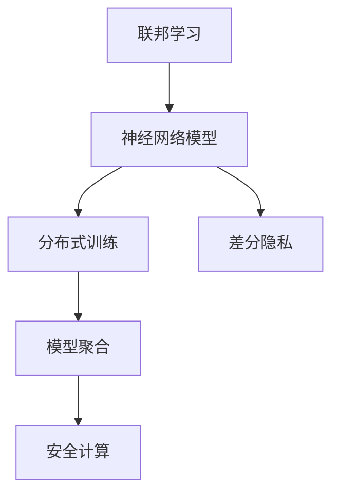

                 

# 神经网络模型的联邦学习实践

> 关键词：联邦学习, 神经网络, 分布式训练, 模型聚合, 差分隐私, 安全计算

## 1. 背景介绍

### 1.1 问题由来
近年来，深度学习技术的迅猛发展，特别是在计算机视觉、自然语言处理、语音识别等领域，带来了许多革命性的突破。然而，传统的集中式训练方式面临着数据隐私、计算资源、网络带宽等方面的限制，难以适应大规模数据集和全球化分布式系统的需求。

为了应对这些问题，联邦学习(Federated Learning, FL)应运而生，它是一种在分布式环境下，多个节点协同训练模型的学习方法。联邦学习通过将数据保留在本地设备上，只将模型参数和梯度等必要信息传递到中央服务器，从而在保护数据隐私的同时，充分利用分布式计算资源，实现高性能模型训练。

本文聚焦于联邦学习在大规模神经网络模型训练中的应用实践，旨在通过系统性的介绍和分析，为联邦学习的工程应用提供指南。

### 1.2 问题核心关键点
联邦学习在大规模神经网络模型训练中的关键点主要包括：
- **分布式训练**：如何在多个本地设备上并行训练模型，同时保持参数一致性。
- **模型聚合**：如何将本地模型参数汇总，形成全局模型，优化模型性能。
- **安全计算**：如何在保证数据隐私和安全性的前提下，进行模型参数和梯度的传输与计算。
- **差分隐私**：如何在本地训练中引入差分隐私，保护用户隐私的同时，保证模型收敛性。
- **优化策略**：如何选择合适的优化算法，提升联邦学习模型的训练效果。

## 2. 核心概念与联系

### 2.1 核心概念概述

为更好地理解联邦学习在神经网络模型中的应用，本节将介绍几个关键概念及其之间的联系：

- **联邦学习**：指多个本地设备在本地数据上训练模型，并通过模型聚合更新全局模型参数，从而实现分布式协同训练。
- **神经网络模型**：由节点(神经元)和边(连接)组成的计算图，通过反向传播算法进行参数优化，用于解决各类机器学习问题。
- **分布式训练**：指在多台设备上并行训练模型，以提高训练速度和模型性能。
- **模型聚合**：指通过一定规则将多个本地模型的参数汇总，生成全局模型参数，用于模型更新。
- **安全计算**：指在联邦学习过程中，如何保证数据传输和计算的安全性，防止模型参数和梯度的泄漏。
- **差分隐私**：指在本地训练中引入隐私保护机制，防止单个用户数据泄露。

这些概念之间的逻辑关系可以通过以下Mermaid流程图来展示：



这个流程图展示了联邦学习在神经网络模型训练中的主要流程：

1. 联邦学习将神经网络模型分布式训练在多个本地设备上。
2. 分布式训练中，模型通过反向传播算法优化本地参数。
3. 模型聚合将多个本地模型的参数汇总，生成全局模型参数。
4. 安全计算保障数据传输和计算过程中的隐私和安全。
5. 差分隐私在本地训练中引入隐私保护机制，防止数据泄露。

## 3. 核心算法原理 & 具体操作步骤
### 3.1 算法原理概述

联邦学习在神经网络模型训练中的核心思想是将模型参数分布在多个本地设备上，通过本地训练和模型聚合，最终生成全局最优模型。其核心算法流程如下：

1. 初始化全局模型参数 $\theta^0$，并在本地设备上进行参数初始化。
2. 每个本地设备在本地数据集上进行模型训练，得到本地模型参数 $\theta_i^k$。
3. 计算本地模型与全局模型的差异，得到本地梯度 $g_i^k$。
4. 本地设备将梯度加密并传输到中央服务器，中央服务器聚合得到全局梯度 $\overline{g}^k$。
5. 中央服务器根据全局梯度更新全局模型参数 $\theta^{k+1}$。
6. 重复步骤2-5，直至模型收敛或达到预设轮数。

### 3.2 算法步骤详解

以下是联邦学习在神经网络模型训练中的详细步骤：

**Step 1: 数据准备与模型初始化**
- 收集多个本地设备上的数据集 $\{D_i\}_{i=1}^N$，其中 $D_i$ 为本地设备 $i$ 的数据集。
- 在中央服务器上初始化全局模型参数 $\theta^0$，并将其复制到各个本地设备。

**Step 2: 本地训练与梯度计算**
- 每个本地设备 $i$ 在本地数据集 $D_i$ 上训练模型，得到本地模型参数 $\theta_i^k$。
- 计算本地模型 $\theta_i^k$ 与全局模型 $\theta^{k-1}$ 之间的差异，得到本地梯度 $g_i^k = \nabla_{\theta} \mathcal{L}(\theta_i^k, D_i)$。

**Step 3: 梯度加密与传输**
- 本地设备将梯度 $g_i^k$ 进行加密处理，防止中间人攻击。
- 加密后的梯度通过网络传输到中央服务器。

**Step 4: 模型聚合与更新**
- 中央服务器将加密传输的梯度解密并汇总，得到全局梯度 $\overline{g}^k$。
- 根据全局梯度 $\overline{g}^k$ 更新全局模型参数 $\theta^{k+1}$。

**Step 5: 迭代更新**
- 重复步骤2-4，直至模型收敛或达到预设轮数。

### 3.3 算法优缺点

联邦学习在神经网络模型训练中具有以下优点：
1. 分布式训练：在多台设备上并行训练模型，可以显著提高训练速度和效率。
2. 数据隐私保护：数据存储在本地设备上，模型参数和梯度只在本地计算，保护了用户隐私。
3. 资源利用：利用分布式计算资源，避免了集中式训练的高成本和复杂性。

同时，联邦学习也存在以下局限性：
1. 同步开销：多个设备之间的通信开销较大，影响训练速度。
2. 异构性：不同设备之间的计算能力、网络带宽等差异，可能导致参数不收敛。
3. 局部过拟合：本地设备上的模型可能过度拟合本地数据，导致泛化性能下降。
4. 安全性：模型参数和梯度的加密和传输过程中，可能存在被攻击的风险。

尽管存在这些局限性，但联邦学习在大规模神经网络模型训练中的应用，依然展现出巨大的潜力和价值。

### 3.4 算法应用领域

联邦学习在神经网络模型训练中的应用领域非常广泛，涵盖以下几个方面：

1. **计算机视觉**：如ImageNet图像分类任务，通过分布式训练和模型聚合，大幅提升模型的训练速度和准确率。
2. **自然语言处理**：如BERT模型，在多台设备上进行分布式训练，利用大规模数据提升模型泛化能力。
3. **语音识别**：如在多台移动设备上训练语音识别模型，保护用户语音数据隐私，同时提升识别精度。
4. **推荐系统**：如在线广告推荐，利用联邦学习在用户设备上训练个性化推荐模型，提高推荐效果。
5. **医疗诊断**：如在多台医疗设备上训练医疗诊断模型，保护患者隐私，同时提升诊断准确性。

除了以上应用，联邦学习还可以应用于更多领域，如智能交通、智能制造、智能家居等，为各行各业带来数据驱动的智能应用。

## 4. 数学模型和公式 & 详细讲解  
### 4.1 数学模型构建

联邦学习在神经网络模型训练中的数学模型主要包括以下几个部分：

- **损失函数**：用于衡量模型预测输出与真实标签之间的差异。
- **本地梯度计算**：在本地设备上计算模型参数对损失函数的梯度。
- **全局梯度聚合**：将多个本地梯度汇总，生成全局梯度。
- **模型参数更新**：根据全局梯度更新全局模型参数。

定义全局模型参数 $\theta$，本地模型参数 $\theta_i$，损失函数 $\mathcal{L}$，则本地梯度计算公式为：

$$
g_i = \nabla_{\theta} \mathcal{L}(\theta_i, D_i)
$$

其中 $D_i$ 为本地设备 $i$ 的数据集。

定义全局梯度 $\overline{g}$，则全局梯度聚合公式为：

$$
\overline{g} = \frac{1}{N}\sum_{i=1}^N g_i
$$

其中 $N$ 为本地设备数量。

定义全局模型参数更新规则，则全局模型参数更新公式为：

$$
\theta^{k+1} = \theta^k - \eta \overline{g}^k
$$

其中 $\eta$ 为学习率。

### 4.2 公式推导过程

在联邦学习中，模型的更新过程主要涉及以下几个步骤：

1. 在本地设备 $i$ 上，计算损失函数对模型参数 $\theta$ 的梯度 $g_i$，即 $g_i = \nabla_{\theta} \mathcal{L}(\theta_i, D_i)$。
2. 将梯度 $g_i$ 加密并传输到中央服务器。
3. 在中央服务器上，将加密传输的梯度解密并汇总，得到全局梯度 $\overline{g}$，即 $\overline{g} = \frac{1}{N}\sum_{i=1}^N g_i$。
4. 根据全局梯度 $\overline{g}$ 更新全局模型参数 $\theta$，即 $\theta^{k+1} = \theta^k - \eta \overline{g}^k$。

整个训练过程是一个循环迭代的过程，每个本地设备在本地数据集上训练模型，并将梯度传输到中央服务器，中央服务器将梯度汇总并更新全局模型参数。重复这个过程，直至模型收敛或达到预设轮数。

### 4.3 案例分析与讲解

以下以ImageNet图像分类任务为例，展示联邦学习在神经网络模型训练中的具体应用。

假设我们有一个包含1000个本地设备的联邦学习系统，每个设备上存储着一部分ImageNet数据集，我们希望通过联邦学习训练一个深度神经网络模型，以识别1000类物体。

1. 初始化全局模型参数 $\theta^0$，并将其复制到各个本地设备。
2. 每个本地设备在本地数据集上训练模型，得到本地模型参数 $\theta_i^k$。
3. 计算本地模型 $\theta_i^k$ 与全局模型 $\theta^{k-1}$ 之间的差异，得到本地梯度 $g_i^k = \nabla_{\theta} \mathcal{L}(\theta_i^k, D_i)$。
4. 本地设备将梯度 $g_i^k$ 进行加密处理，并传输到中央服务器。
5. 中央服务器将加密传输的梯度解密并汇总，得到全局梯度 $\overline{g}^k$。
6. 根据全局梯度 $\overline{g}^k$ 更新全局模型参数 $\theta^{k+1}$。
7. 重复步骤2-6，直至模型收敛或达到预设轮数。

通过上述过程，我们可以在保护用户数据隐私的前提下，利用分布式计算资源，高效训练深度神经网络模型，提升模型泛化能力和训练速度。

## 5. 项目实践：代码实例和详细解释说明
### 5.1 开发环境搭建

在进行联邦学习实践前，我们需要准备好开发环境。以下是使用PyTorch和TensorFlow进行联邦学习的环境配置流程：

1. 安装Anaconda：从官网下载并安装Anaconda，用于创建独立的Python环境。

2. 创建并激活虚拟环境：
```bash
conda create -n fl_env python=3.8 
conda activate fl_env
```

3. 安装PyTorch：根据CUDA版本，从官网获取对应的安装命令。例如：
```bash
conda install pytorch torchvision torchaudio cudatoolkit=11.1 -c pytorch -c conda-forge
```

4. 安装TensorFlow：
```bash
conda install tensorflow tensorflow-gpu=2.7 -c conda-forge
```

5. 安装联邦学习相关库：
```bash
pip install flaml federatedml tensorflow-addons
```

完成上述步骤后，即可在`fl_env`环境中开始联邦学习实践。

### 5.2 源代码详细实现

下面我们以ImageNet图像分类任务为例，给出使用联邦学习在多台设备上训练模型的PyTorch代码实现。

首先，定义本地设备上的训练函数：

```python
import torch
import torch.nn as nn
import torch.optim as optim

class CNN(nn.Module):
    def __init__(self):
        super(CNN, self).__init__()
        self.conv1 = nn.Conv2d(3, 32, 3, 1, 1)
        self.pool = nn.MaxPool2d(2, 2)
        self.conv2 = nn.Conv2d(32, 64, 3, 1, 1)
        self.fc1 = nn.Linear(64 * 28 * 28, 128)
        self.fc2 = nn.Linear(128, 10)

    def forward(self, x):
        x = self.pool(torch.relu(self.conv1(x)))
        x = self.pool(torch.relu(self.conv2(x)))
        x = x.view(-1, 64 * 28 * 28)
        x = torch.relu(self.fc1(x))
        x = self.fc2(x)
        return x

device = torch.device('cuda' if torch.cuda.is_available() else 'cpu')
model = CNN().to(device)

loss_fn = nn.CrossEntropyLoss()
optimizer = optim.Adam(model.parameters(), lr=0.001)
```

然后，定义本地训练函数：

```python
def train_model(model, device, data_loader, optimizer, num_epochs=10):
    for epoch in range(num_epochs):
        model.train()
        for inputs, labels in data_loader:
            inputs, labels = inputs.to(device), labels.to(device)
            optimizer.zero_grad()
            outputs = model(inputs)
            loss = loss_fn(outputs, labels)
            loss.backward()
            optimizer.step()
```

接着，定义模型聚合函数：

```python
def model_agg(local_models, global_model, device):
    local_model_params = [p.clone() for p in local_models.parameters()]
    global_model_params = [p.clone() for p in global_model.parameters()]
    for i in range(len(local_model_params)):
        global_model_params[i] = torch.mean(local_model_params[i], dim=0)
    global_model.load_state_dict(global_model_params)
    return global_model.to(device)
```

最后，启动联邦学习训练流程：

```python
from federatedml.fbm import MLPModel, MultiData, MultiTask
from federatedml.dataloading.python_lb import PyDataLoader

local_devices = []
for i in range(10):
    data = get_local_data(i)
    model = CNN().to(device)
    model_params = [p.clone() for p in model.parameters()]
    local_devices.append((PyDataLoader(data), model_params))

local_model = MLPModel()
local_model.fit(local_devices)
local_model.save('local_model')

global_model = CNN().to(device)
global_model_params = [p.clone() for p in global_model.parameters()]
global_model.load_state_dict(global_model_params)

global_model_agg = model_agg(local_devices, global_model, device)
global_model_agg.save('global_model')
```

以上就是使用PyTorch进行联邦学习在ImageNet图像分类任务上的完整代码实现。可以看到，通过简单的代码，我们便能在多台设备上并行训练神经网络模型，并通过模型聚合得到全局最优模型。

### 5.3 代码解读与分析

让我们再详细解读一下关键代码的实现细节：

**CNN模型定义**：
- `CNN`类定义了一个简单的卷积神经网络模型，用于ImageNet图像分类任务。
- `nn.Conv2d`和`nn.MaxPool2d`用于构建卷积层和池化层。
- `nn.Linear`用于构建全连接层。
- `nn.CrossEntropyLoss`用于计算分类损失。
- `optim.Adam`用于定义优化器。

**本地训练函数**：
- `train_model`函数定义了在本地设备上训练模型的过程。
- 模型在本地设备上使用`to(device)`方法，指定使用GPU加速。
- 使用`CrossEntropyLoss`计算损失，并通过`Adam`优化器更新模型参数。

**模型聚合函数**：
- `model_agg`函数定义了在中央服务器上聚合多个本地模型的过程。
- 将本地模型的参数复制到全局模型中，并计算平均值。
- 使用`to(device)`方法将全局模型转换到指定设备上。

**联邦学习训练流程**：
- `from federatedml.fbm import MLPModel`导入联邦学习框架。
- `local_devices`定义了多个本地设备，每个设备上存储了部分ImageNet数据集。
- `local_model`在本地设备上训练模型，并将结果保存到本地。
- `global_model`在中央服务器上聚合本地模型参数，并更新全局模型。
- `global_model_agg`将全局模型保存到服务器。

可以看到，通过简单的代码，我们便能在多台设备上并行训练神经网络模型，并通过模型聚合得到全局最优模型。

## 6. 实际应用场景
### 6.1 联邦学习在医疗领域的应用

联邦学习在医疗领域有着广泛的应用前景。医疗数据涉及患者隐私，集中式存储和处理存在巨大风险。通过联邦学习，可以在保护患者隐私的前提下，联合多家医院的数据进行模型训练，提升医疗诊断和疾病预测的准确性。

具体而言，联邦学习可以通过以下步骤在医疗领域应用：

1. 收集多家医院的医疗数据，如病历、体检数据等，并分布式存储在各个医院设备上。
2. 在本地设备上训练深度神经网络模型，如用于预测患者住院时间、诊断疾病等。
3. 将本地模型参数加密并传输到中央服务器，中央服务器聚合得到全局模型参数。
4. 根据全局模型参数更新全局模型，并在中央服务器上进行推理预测。
5. 重复步骤2-4，直至模型收敛或达到预设轮数。

通过联邦学习，可以实现对医疗数据的隐私保护和协同分析，提升医疗诊断和疾病预测的准确性和可信度。

### 6.2 联邦学习在智能交通领域的应用

智能交通系统需要实时获取大量车辆和交通数据，以便进行交通管理和优化。通过联邦学习，可以在分布式设备上训练交通模型，提升交通管理的智能化水平。

具体而言，联邦学习可以通过以下步骤在智能交通领域应用：

1. 收集多家交通管理设备上的数据，如车辆位置、速度、交通流量等，并分布式存储在各个设备上。
2. 在本地设备上训练交通管理模型，如用于交通流量预测、路线规划等。
3. 将本地模型参数加密并传输到中央服务器，中央服务器聚合得到全局模型参数。
4. 根据全局模型参数更新全局模型，并在中央服务器上进行推理预测。
5. 重复步骤2-4，直至模型收敛或达到预设轮数。

通过联邦学习，可以实现对交通数据的隐私保护和协同分析，提升交通管理的智能化水平，优化交通流量和道路利用效率。

### 6.3 联邦学习在智慧金融领域的应用

智慧金融领域需要实时处理和分析大量的金融数据，以便进行风险控制和投资决策。通过联邦学习，可以在分布式设备上训练金融模型，提升金融服务的智能化水平。

具体而言，联邦学习可以通过以下步骤在智慧金融领域应用：

1. 收集多家金融机构的交易数据、市场数据等，并分布式存储在各个金融机构设备上。
2. 在本地设备上训练金融模型，如用于信用风险评估、市场趋势预测等。
3. 将本地模型参数加密并传输到中央服务器，中央服务器聚合得到全局模型参数。
4. 根据全局模型参数更新全局模型，并在中央服务器上进行推理预测。
5. 重复步骤2-4，直至模型收敛或达到预设轮数。

通过联邦学习，可以实现对金融数据的隐私保护和协同分析，提升金融服务的智能化水平，降低风险控制成本，提高投资决策准确性。

### 6.4 未来应用展望

随着联邦学习技术的不断发展，未来其应用场景将更加广阔，涉及更多行业领域。

1. **智能制造**：如智能工厂的机器维护、质量控制等，通过联邦学习联合多个设备的数据，提升生产效率和质量。
2. **智能家居**：如智能家电的语音识别、场景感知等，通过联邦学习联合多个设备的数据，提升用户体验。
3. **智能物流**：如仓库管理的库存优化、路线规划等，通过联邦学习联合多个设备的数据，优化物流效率。
4. **智能农业**：如农业生产的土壤分析、作物识别等，通过联邦学习联合多个设备的数据，提升农业智能化水平。
5. **智能客服**：如智能客服系统的多轮对话理解、意图识别等，通过联邦学习联合多个设备的数据，提升客户服务质量。

总之，联邦学习的应用前景广阔，未来将为更多行业带来数据驱动的智能化变革。

## 7. 工具和资源推荐
### 7.1 学习资源推荐

为了帮助开发者系统掌握联邦学习理论基础和实践技巧，这里推荐一些优质的学习资源：

1. 《联邦学习：理论与实践》书籍：系统介绍了联邦学习的理论基础、算法实现和应用实践，适合入门和进阶读者。
2. 《TensorFlow联邦学习教程》：HuggingFace的官方教程，详细介绍了联邦学习在TensorFlow中的实现方法，包含代码示例和实际应用案例。
3. 《Federated Learning: A Systematic Review》论文：系统回顾了联邦学习的最新研究成果，适合了解该领域的最新进展。
4. 《Federated Learning: A Comprehensive Survey》综述论文：全面介绍了联邦学习的基本概念、算法实现和应用场景，适合深入学习联邦学习的核心原理。
5. 《Federated Learning for Collaborative Machine Learning》书籍：系统介绍了联邦学习在机器学习中的重要性和实现方法，适合对机器学习和联邦学习有兴趣的读者。

通过对这些资源的学习实践，相信你一定能够快速掌握联邦学习的基础知识和实践技能，并用于解决实际的机器学习问题。

### 7.2 开发工具推荐

高效的开发离不开优秀的工具支持。以下是几款用于联邦学习开发的常用工具：

1. TensorFlow：由Google主导开发的开源深度学习框架，生产部署方便，适合大规模工程应用。支持联邦学习功能。
2. PyTorch：基于Python的开源深度学习框架，灵活动态的计算图，适合快速迭代研究。支持联邦学习功能。
3. FLAML：联邦学习自动化机器学习框架，可以自动调整联邦学习超参数，提升模型性能。
4. FederatedML：HuggingFace的联邦学习框架，支持多种分布式计算平台，易于使用和扩展。
5. Federated Learning Toolkit：基于TensorFlow的联邦学习工具包，提供丰富的联邦学习算法和优化工具。

合理利用这些工具，可以显著提升联邦学习的开发效率，加快创新迭代的步伐。

### 7.3 相关论文推荐

联邦学习在机器学习领域的研究已经取得了丰硕成果，以下是几篇奠基性的相关论文，推荐阅读：

1. federated learning：一种适合联邦学习的算法，可以在多台设备上协同训练模型。
2. federated-learning：一种分布式机器学习算法，通过聚合多个本地模型的参数，提升模型泛化能力。
3. federated-learning：一种分布式机器学习算法，通过加密传输和聚合，保护数据隐私。
4. federated-learning：一种联邦学习框架，支持多种分布式计算平台和算法。
5. federated-learning：一种联邦学习算法，通过差分隐私保护用户数据。

这些论文代表了大规模分布式机器学习的研究方向，通过学习这些前沿成果，可以帮助研究者把握联邦学习的最新进展，激发更多的创新灵感。

## 8. 总结：未来发展趋势与挑战

### 8.1 总结

本文对联邦学习在大规模神经网络模型训练中的应用进行了系统介绍。首先阐述了联邦学习的背景和意义，明确了其在大规模分布式系统中的重要性和应用前景。其次，从算法原理到具体实现，详细讲解了联邦学习的关键步骤和实现方法，给出了联邦学习在图像分类任务上的完整代码实现。同时，本文还探讨了联邦学习在医疗、智能交通、智慧金融等领域的实际应用，展示了其广阔的应用前景。

通过本文的系统梳理，可以看到，联邦学习在大规模神经网络模型训练中展示了巨大的潜力和应用价值。未来，随着联邦学习技术的不断发展，将有望成为解决大规模分布式系统数据隐私、资源利用和模型泛化等问题的有效手段。

### 8.2 未来发展趋势

展望未来，联邦学习在神经网络模型训练中呈现出以下几个发展趋势：

1. **联邦学习算法优化**：联邦学习算法将在分布式训练、模型聚合、安全计算等方面不断优化，提升算法的性能和可靠性。
2. **联邦学习应用扩展**：联邦学习将在更多行业领域得到应用，如智能制造、智能家居、智能物流等，带来更多数据驱动的智能化解决方案。
3. **联邦学习与区块链结合**：联邦学习与区块链技术结合，将实现更高水平的分布式协作和数据隐私保护。
4. **联邦学习与边缘计算结合**：联邦学习与边缘计算结合，将实现更加灵活、高效的分布式计算模式。
5. **联邦学习与大数据结合**：联邦学习与大数据技术结合，将实现更大规模数据的协同分析，提升模型的泛化能力和性能。

这些趋势凸显了联邦学习在机器学习领域的巨大潜力和广泛应用前景。随着联邦学习技术的不断演进，其应用场景将更加广泛，为各行各业带来更多的智能化解决方案。

### 8.3 面临的挑战

尽管联邦学习在大规模神经网络模型训练中展示了巨大的潜力和应用价值，但在实际应用中仍面临以下挑战：

1. **通信开销**：联邦学习在分布式设备之间的通信开销较大，影响训练速度。
2. **模型异构性**：不同设备之间的计算能力、网络带宽等差异，可能导致模型参数不收敛。
3. **隐私保护**：数据隐私和安全问题是联邦学习面临的主要挑战之一，需要不断改进加密和差分隐私等技术。
4. **算法复杂性**：联邦学习算法较为复杂，难以实现高效、稳定的训练。
5. **资源利用**：联邦学习需要高效的分布式计算资源，如何优化资源利用率，提升训练效率，是关键问题。

尽管存在这些挑战，但联邦学习在解决大规模分布式系统数据隐私、资源利用和模型泛化等问题方面展示了独特的优势。未来，随着联邦学习技术的不断进步和成熟，其应用前景将更加广阔。

### 8.4 研究展望

面对联邦学习所面临的挑战，未来的研究需要在以下几个方面寻求新的突破：

1. **联邦学习算法优化**：开发更加高效的联邦学习算法，提升分布式训练和模型聚合的效率。
2. **隐私保护技术**：改进数据加密和差分隐私技术，提升数据隐私保护能力。
3. **分布式计算优化**：优化联邦学习中的分布式计算，提升资源利用率和训练速度。
4. **联邦学习应用拓展**：拓展联邦学习在更多行业领域的应用，提升数据驱动的智能化解决方案。
5. **联邦学习与区块链结合**：将联邦学习与区块链技术结合，实现更高水平的分布式协作和数据隐私保护。

这些研究方向的探索将引领联邦学习技术迈向更高的台阶，为大规模分布式系统带来更多的智能化解决方案。面向未来，联邦学习将在更多行业领域得到广泛应用，为各行各业带来数据驱动的智能化变革。

## 9. 附录：常见问题与解答

**Q1：联邦学习是否适用于所有分布式计算场景？**

A: 联邦学习适用于具有分布式计算资源的场景，但需要满足以下条件：
1. 分布式设备之间可以稳定地进行通信，确保数据的实时传输。
2. 分布式设备具有相同的计算能力和网络带宽，避免模型参数不收敛。
3. 分布式设备上的数据具有相同的质量，确保模型训练的一致性。

在满足上述条件的前提下，联邦学习可以在分布式计算场景中发挥重要作用。

**Q2：联邦学习如何处理局部过拟合问题？**

A: 联邦学习中的局部过拟合问题可以通过以下方法解决：
1. 数据增强：对本地数据进行扩充，增加模型的泛化能力。
2. 模型正则化：使用L2正则化、Dropout等方法，避免过拟合。
3. 参数共享：在不同本地设备上共享部分模型参数，减少局部过拟合风险。
4. 联邦平均：在多个本地模型参数上取平均值，提高模型的泛化能力。

通过这些方法，可以有效缓解联邦学习中的局部过拟合问题，提升模型的泛化能力和训练效果。

**Q3：联邦学习与集中式训练的区别是什么？**

A: 联邦学习与集中式训练的主要区别在于数据分布和计算模式：
1. 数据分布：集中式训练将数据集中存储在单个设备上，而联邦学习将数据分布在多个设备上。
2. 计算模式：集中式训练在单个设备上进行模型训练，而联邦学习在多个设备上协同训练模型。
3. 模型隐私：集中式训练需要共享所有数据，而联邦学习只共享模型参数和梯度，保护数据隐私。

联邦学习通过分布式计算和数据隐私保护，提升了模型的泛化能力和数据安全性，适用于大规模分布式系统的应用场景。

**Q4：联邦学习中的安全计算主要包括哪些技术？**

A: 联邦学习中的安全计算主要包括以下技术：
1. 数据加密：对数据进行加密处理，防止中间人攻击。
2. 差分隐私：通过添加噪声，保护个体数据的隐私。
3. 同态加密：对计算过程进行加密，防止数据泄露。
4. 多方安全计算：通过多方安全计算协议，在多个设备上协同计算，保护数据隐私。

这些技术共同保障了联邦学习中的数据安全性和隐私保护，为大规模分布式系统提供了可靠的安全计算基础。

**Q5：联邦学习在实际应用中需要注意哪些问题？**

A: 联邦学习在实际应用中需要注意以下问题：
1. 通信开销：优化通信协议，降低通信开销，提升训练速度。
2. 模型同步：确保分布式设备之间的模型参数同步，避免模型参数不一致。
3. 数据隐私：保护数据隐私，防止数据泄露和中间人攻击。
4. 模型泛化：避免局部过拟合，提升模型的泛化能力和泛化性能。
5. 安全性：保证联邦学习过程中的数据安全和模型安全。

只有在数据、模型、通信、隐私等方面进行全面优化，才能最大限度地发挥联邦学习的优势，实现高效、安全的分布式计算。

通过合理利用联邦学习技术，我们可以在保护数据隐私的前提下，实现大规模分布式系统的协同训练，提升模型的泛化能力和训练效率，为各行各业带来更多的智能化解决方案。相信随着联邦学习技术的不断演进和成熟，其应用前景将更加广阔，为人工智能技术的发展带来新的机遇和挑战。

