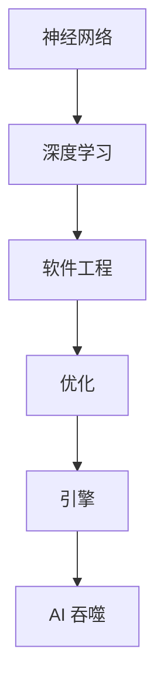

                 

# 神经网络：AI 吞噬软件的引擎

> 关键词：神经网络,深度学习,人工智能,软件开发,引擎,优化

## 1. 背景介绍

### 1.1 问题由来
人工智能（AI）技术的迅猛发展，正在对软件开发领域产生深远的影响。AI 技术的核心是深度学习中的神经网络（Neural Network），它正在被广泛用于图像识别、语音处理、自然语言处理等众多领域。越来越多的软件企业开始利用神经网络技术提升其产品性能，加速开发进程。

### 1.2 问题核心关键点
尽管神经网络技术带来了巨大的便利，但也对软件开发人员提出了新的挑战。传统软件工程方法无法完全适应神经网络的特性，导致开发效率低下、维护成本高昂。如何更好地利用神经网络技术，成为软件开发领域的新课题。

### 1.3 问题研究意义
理解和掌握神经网络在软件开发中的应用，将有助于软件开发人员更好地利用 AI 技术，提升软件系统的性能和效率。深入研究神经网络的应用，将推动软件开发技术的创新和进步，使软件开发更加高效、智能。

## 2. 核心概念与联系

### 2.1 核心概念概述

为更好地理解神经网络在软件开发中的应用，本节将介绍几个密切相关的核心概念：

- 神经网络（Neural Network）：一种模仿人类大脑神经元工作原理的计算模型。通过多个层次的非线性变换，神经网络可以从大量数据中学习出复杂的特征表示。

- 深度学习（Deep Learning）：基于多层神经网络，通过不断增加隐藏层数，实现更强的特征提取能力和复杂模型训练。深度学习是神经网络的主要应用范式。

- 软件工程（Software Engineering）：一套软件开发方法论和工具，旨在提高软件开发效率和软件质量，包括需求分析、设计、实现、测试、维护等各个阶段。

- 优化（Optimization）：通过调整算法和模型参数，提高神经网络性能和效率的过程。优化在深度学习中尤为重要。

- 引擎（Engine）：软件系统中的核心模块，负责执行关键任务和处理大量数据。AI 引擎是神经网络在软件中应用的载体。

这些核心概念之间的逻辑关系可以通过以下 Mermaid 流程图来展示：



这个流程图展示了大语言模型微调的核心概念及其之间的关系：

1. 神经网络通过深度学习技术学习复杂特征表示。
2. 软件工程方法用于指导软件开发过程，提升软件开发效率。
3. 优化技术用于提升神经网络性能，如梯度下降、正则化等。
4. AI 引擎是神经网络在软件中的具体实现，负责执行关键任务。
5. AI 技术正在逐步渗透到软件开发的各个环节，提升软件性能。

## 3. 核心算法原理 & 具体操作步骤
### 3.1 算法原理概述

神经网络在软件开发中的应用，主要体现在通过深度学习技术实现软件系统的智能化功能。其核心思想是：将神经网络嵌入到软件系统中，通过大规模数据训练模型，使其能够自动处理复杂的任务，如图像识别、语音识别、自然语言处理等。

### 3.2 算法步骤详解

神经网络在软件开发中的应用，主要包括以下几个关键步骤：

**Step 1: 数据收集与预处理**
- 收集与任务相关的数据集，并进行数据清洗、标注等预处理工作。数据集应尽可能多样化，涵盖各种情况，以提高模型的泛化能力。

**Step 2: 神经网络模型设计**
- 选择合适的神经网络架构，如卷积神经网络（CNN）、循环神经网络（RNN）、Transformer 等。根据任务特点，设计合适的模型层数、隐藏层大小等参数。

**Step 3: 模型训练**
- 使用深度学习框架（如TensorFlow、PyTorch等）实现神经网络模型。根据数据集，设置合适的学习率、批大小、迭代次数等参数，进行模型训练。

**Step 4: 模型优化**
- 使用优化算法（如梯度下降、Adam等）对模型进行优化，提高模型性能。同时使用正则化技术（如L2正则、Dropout等）防止过拟合。

**Step 5: 模型部署与测试**
- 将训练好的模型集成到软件系统中，进行功能测试和性能测试。确保模型在实际应用中表现稳定可靠。

### 3.3 算法优缺点

神经网络在软件开发中的应用具有以下优点：
1. 自动化处理复杂任务。神经网络能够处理大量数据，并从中学习出复杂特征，实现自动化处理。
2. 提升软件性能。通过优化后的神经网络模型，软件系统可以更快地响应任务需求。
3. 适应性强。神经网络模型可以应用于多种任务，如图像识别、语音识别、自然语言处理等。

同时，该方法也存在一定的局限性：
1. 数据需求高。神经网络模型需要大量高质量的数据进行训练，数据收集和标注成本较高。
2. 计算资源消耗大。神经网络模型通常需要高性能硬件支持，如GPU、TPU等。
3. 模型复杂度高。神经网络模型参数众多，训练和优化过程复杂。
4. 可解释性差。神经网络模型通常被视为"黑盒"系统，难以解释其内部工作机制。

尽管存在这些局限性，但就目前而言，神经网络技术在软件开发中的应用仍是大势所趋。未来相关研究的重点在于如何进一步降低数据需求，提高计算效率，增强模型可解释性，确保应用安全性。

### 3.4 算法应用领域

神经网络技术在软件开发中的应用，已经在诸多领域得到广泛应用，例如：

- 图像识别：如人脸识别、图像分类等。通过深度学习技术，神经网络可以从图像中学习出特征，实现自动化分类和识别。
- 语音识别：如语音转文本、语音命令等。神经网络可以从语音信号中提取特征，实现自动语音识别和生成。
- 自然语言处理：如机器翻译、情感分析、文本摘要等。通过神经网络，软件可以实现自然语言的理解、生成和处理。
- 推荐系统：如电商推荐、音乐推荐等。通过深度学习技术，神经网络可以从用户行为中学习出兴趣偏好，实现个性化推荐。
- 游戏开发：如游戏AI、游戏生成等。神经网络可以用于生成游戏角色行为、生成游戏环境等。

除了上述这些经典应用外，神经网络技术还在金融、医疗、自动驾驶等多个领域得到广泛应用，推动了相关产业的智能化转型。

## 4. 数学模型和公式 & 详细讲解 & 举例说明

### 4.1 数学模型构建

神经网络的核心数学模型包括前向传播和反向传播两个部分。以下是数学模型的详细介绍：

**前向传播（Forward Propagation）**
神经网络的输入数据经过多层非线性变换，最终输出预测结果。前向传播过程可表示为：

$$
\begin{aligned}
h_0 &= \text{Input} \\
h_1 &= \text{Linear}(h_0; W_1) + \text{Bias}(b_1) + \text{Activation}(f_1) \\
h_2 &= \text{Linear}(h_1; W_2) + \text{Bias}(b_2) + \text{Activation}(f_2) \\
&\vdots \\
\hat{y} &= \text{Linear}(h_{L-1}; W_L) + \text{Bias}(b_L) + \text{Activation}(f_L)
\end{aligned}
$$

其中，$h_i$ 为第 $i$ 层的隐藏层输出，$W_i$ 为第 $i$ 层的权重矩阵，$b_i$ 为第 $i$ 层的偏置向量，$f_i$ 为第 $i$ 层的激活函数。

**反向传播（Backward Propagation）**
神经网络的损失函数为 $L$，通过反向传播算法计算参数梯度，并更新模型参数。反向传播过程可表示为：

$$
\begin{aligned}
\frac{\partial L}{\partial W_L} &= \frac{\partial L}{\partial h_{L-1}} \cdot \frac{\partial h_{L-1}}{\partial W_L} \\
&= \frac{\partial L}{\partial h_{L-1}} \cdot \text{Activation}'(f_L) \cdot h_{L-1}
\end{aligned}
$$

根据链式法则，依次计算各层梯度，最终得到模型参数的更新规则。

### 4.2 公式推导过程

以下是反向传播算法的详细推导过程：

**梯度计算**
设第 $i$ 层的损失函数为 $L_i$，第 $i$ 层的输出为 $h_i$，第 $i$ 层的权重矩阵为 $W_i$，第 $i$ 层的激活函数为 $f_i$，则：

$$
\begin{aligned}
L_i &= \frac{1}{n} \sum_{j=1}^n (y_j - h_i)^2 \\
\frac{\partial L_i}{\partial h_i} &= \frac{2}{n} (h_i - y)
\end{aligned}
$$

其中 $n$ 为样本数，$y$ 为真实标签。

**链式法则**
根据链式法则，第 $i$ 层的梯度计算可表示为：

$$
\begin{aligned}
\frac{\partial L_i}{\partial h_i} &= \frac{\partial L_{i+1}}{\partial h_{i+1}} \cdot \frac{\partial h_{i+1}}{\partial h_i} \\
&= \frac{\partial L_{i+1}}{\partial h_{i+1}} \cdot f_i'(h_i) \\
&= \frac{\partial L_{i+1}}{\partial h_{i+1}} \cdot \text{Activation}'(f_i) \cdot h_i
\end{aligned}
$$

**逐层传播**
从输出层到输入层，依次计算各层的梯度，最终得到模型参数的更新规则：

$$
\begin{aligned}
\frac{\partial L}{\partial h_i} &= \frac{\partial L_{i+1}}{\partial h_{i+1}} \cdot \frac{\partial h_{i+1}}{\partial h_i} \\
&= \frac{\partial L_{i+1}}{\partial h_{i+1}} \cdot f_i'(h_i) \\
&= \frac{\partial L_{i+1}}{\partial h_{i+1}} \cdot \text{Activation}'(f_i) \cdot h_i
\end{aligned}
$$

### 4.3 案例分析与讲解

以手写数字识别为例，以下是使用 TensorFlow 实现神经网络模型的完整代码实现：

```python
import tensorflow as tf
from tensorflow import keras

# 加载 MNIST 数据集
(x_train, y_train), (x_test, y_test) = keras.datasets.mnist.load_data()

# 数据预处理
x_train = x_train.reshape((60000, 28 * 28)) / 255.0
x_test = x_test.reshape((10000, 28 * 28)) / 255.0
y_train = keras.utils.to_categorical(y_train)
y_test = keras.utils.to_categorical(y_test)

# 定义模型
model = keras.Sequential([
    keras.layers.Dense(128, activation='relu', input_shape=(28 * 28,)),
    keras.layers.Dense(64, activation='relu'),
    keras.layers.Dense(10, activation='softmax')
])

# 编译模型
model.compile(optimizer='adam', loss='categorical_crossentropy', metrics=['accuracy'])

# 训练模型
model.fit(x_train, y_train, epochs=10, batch_size=32, validation_data=(x_test, y_test))

# 测试模型
test_loss, test_acc = model.evaluate(x_test, y_test)
print('Test accuracy:', test_acc)
```

这个代码展示了从数据预处理到模型训练的全过程。首先，加载 MNIST 数据集并进行数据预处理。然后，定义一个包含三个全连接层的神经网络模型。使用 Adam 优化器和交叉熵损失函数编译模型。最后，使用训练集进行模型训练，并在测试集上进行模型测试，输出模型在测试集上的准确率。

## 5. 项目实践：代码实例和详细解释说明
### 5.1 开发环境搭建

在进行神经网络模型训练和应用开发前，我们需要准备好开发环境。以下是使用 TensorFlow 进行深度学习开发的典型环境配置流程：

1. 安装 Anaconda：从官网下载并安装 Anaconda，用于创建独立的 Python 环境。

2. 创建并激活虚拟环境：
```bash
conda create -n tf-env python=3.8 
conda activate tf-env
```

3. 安装 TensorFlow：根据 GPU/CPU 版本，从官网获取对应的安装命令。例如：
```bash
pip install tensorflow==2.7
```

4. 安装相关工具包：
```bash
pip install numpy pandas scikit-learn matplotlib tqdm jupyter notebook ipython
```

完成上述步骤后，即可在 `tf-env` 环境中开始深度学习开发。

### 5.2 源代码详细实现

下面我们以手写数字识别为例，给出使用 TensorFlow 实现神经网络模型的完整代码实现。

```python
import tensorflow as tf
from tensorflow import keras

# 加载 MNIST 数据集
(x_train, y_train), (x_test, y_test) = keras.datasets.mnist.load_data()

# 数据预处理
x_train = x_train.reshape((60000, 28 * 28)) / 255.0
x_test = x_test.reshape((10000, 28 * 28)) / 255.0
y_train = keras.utils.to_categorical(y_train)
y_test = keras.utils.to_categorical(y_test)

# 定义模型
model = keras.Sequential([
    keras.layers.Dense(128, activation='relu', input_shape=(28 * 28,)),
    keras.layers.Dense(64, activation='relu'),
    keras.layers.Dense(10, activation='softmax')
])

# 编译模型
model.compile(optimizer='adam', loss='categorical_crossentropy', metrics=['accuracy'])

# 训练模型
model.fit(x_train, y_train, epochs=10, batch_size=32, validation_data=(x_test, y_test))

# 测试模型
test_loss, test_acc = model.evaluate(x_test, y_test)
print('Test accuracy:', test_acc)
```

这个代码展示了从数据预处理到模型训练的全过程。首先，加载 MNIST 数据集并进行数据预处理。然后，定义一个包含三个全连接层的神经网络模型。使用 Adam 优化器和交叉熵损失函数编译模型。最后，使用训练集进行模型训练，并在测试集上进行模型测试，输出模型在测试集上的准确率。

### 5.3 代码解读与分析

让我们再详细解读一下关键代码的实现细节：

**数据预处理**
- 使用 `keras.datasets.mnist.load_data()` 函数加载 MNIST 数据集，并进行数据预处理。将图像数据展平，并进行归一化处理。

**模型定义**
- 使用 `keras.Sequential()` 函数定义神经网络模型。包含三个全连接层，分别使用 ReLU 激活函数和 softmax 激活函数。

**模型编译**
- 使用 `model.compile()` 函数编译模型，指定优化器、损失函数和评估指标。

**模型训练**
- 使用 `model.fit()` 函数进行模型训练，指定训练集、验证集、批大小和迭代次数。

**模型测试**
- 使用 `model.evaluate()` 函数在测试集上测试模型，输出模型在测试集上的损失和准确率。

这些代码展示了使用 TensorFlow 进行神经网络模型训练的基本流程。开发者可以根据具体任务的需求，调整模型的层数、激活函数等参数，以获得更好的效果。

## 6. 实际应用场景
### 6.1 图像识别

神经网络在图像识别领域的应用已经非常广泛。例如，使用卷积神经网络（CNN）可以实现图像分类、物体检测、人脸识别等任务。

以图像分类为例，以下是使用 TensorFlow 实现图像分类的完整代码实现：

```python
import tensorflow as tf
from tensorflow import keras

# 加载数据集
(train_images, train_labels), (test_images, test_labels) = keras.datasets.cifar10.load_data()

# 数据预处理
train_images = train_images / 255.0
test_images = test_images / 255.0

# 定义模型
model = keras.Sequential([
    keras.layers.Conv2D(32, (3, 3), activation='relu', input_shape=(32, 32, 3)),
    keras.layers.MaxPooling2D((2, 2)),
    keras.layers.Conv2D(64, (3, 3), activation='relu'),
    keras.layers.MaxPooling2D((2, 2)),
    keras.layers.Conv2D(64, (3, 3), activation='relu'),
    keras.layers.Flatten(),
    keras.layers.Dense(64, activation='relu'),
    keras.layers.Dense(10)
])

# 编译模型
model.compile(optimizer='adam', loss=tf.keras.losses.SparseCategoricalCrossentropy(from_logits=True), metrics=['accuracy'])

# 训练模型
model.fit(train_images, train_labels, epochs=10, batch_size=32, validation_data=(test_images, test_labels))

# 测试模型
test_loss, test_acc = model.evaluate(test_images, test_labels)
print('Test accuracy:', test_acc)
```

这个代码展示了使用 CNN 实现图像分类的过程。首先，加载 CIFAR-10 数据集并进行数据预处理。然后，定义一个包含多个卷积层、池化层和全连接层的神经网络模型。使用 Adam 优化器和交叉熵损失函数编译模型。最后，使用训练集进行模型训练，并在测试集上进行模型测试，输出模型在测试集上的准确率。

### 6.2 自然语言处理

神经网络在自然语言处理（NLP）领域的应用同样非常广泛。例如，使用循环神经网络（RNN）或Transformer模型可以实现文本分类、情感分析、机器翻译等任务。

以情感分析为例，以下是使用 TensorFlow 实现情感分析的完整代码实现：

```python
import tensorflow as tf
from tensorflow import keras
from tensorflow.keras.layers import Embedding, LSTM, Dense

# 加载数据集
train_data, train_labels = keras.datasets.imdb.load_data(num_words=10000)
test_data, test_labels = keras.datasets.imdb.load_data(num_words=10000)

# 数据预处理
train_data = keras.preprocessing.sequence.pad_sequences(train_data, maxlen=256)
test_data = keras.preprocessing.sequence.pad_sequences(test_data, maxlen=256)

# 定义模型
model = keras.Sequential([
    Embedding(10000, 16, input_length=256),
    LSTM(16, return_sequences=True),
    LSTM(16),
    Dense(1, activation='sigmoid')
])

# 编译模型
model.compile(optimizer='adam', loss='binary_crossentropy', metrics=['accuracy'])

# 训练模型
model.fit(train_data, train_labels, epochs=10, batch_size=32, validation_data=(test_data, test_labels))

# 测试模型
test_loss, test_acc = model.evaluate(test_data, test_labels)
print('Test accuracy:', test_acc)
```

这个代码展示了使用 LSTM 实现情感分析的过程。首先，加载 IMDB 数据集并进行数据预处理。然后，定义一个包含多个嵌入层、LSTM 层和全连接层的神经网络模型。使用 Adam 优化器和二元交叉熵损失函数编译模型。最后，使用训练集进行模型训练，并在测试集上进行模型测试，输出模型在测试集上的准确率。

### 6.3 未来应用展望

随着神经网络技术的不断进步，其在软件开发中的应用前景也将更加广阔。

在智慧医疗领域，神经网络可以用于图像诊断、医疗推荐等任务，提升医疗服务的智能化水平。在金融领域，神经网络可以用于风险预测、信用评估等任务，提升金融服务的精准度。在自动驾驶领域，神经网络可以用于图像识别、路径规划等任务，提升驾驶安全性。

未来，随着神经网络技术在更多领域的深度应用，软件工程方法也将逐步融合神经网络技术，提升软件开发效率和软件性能。例如，使用神经网络实现自动化测试、自动化部署、自动化运维等任务，提升软件系统的自动化水平。

## 7. 工具和资源推荐
### 7.1 学习资源推荐

为了帮助开发者系统掌握神经网络在软件开发中的应用，这里推荐一些优质的学习资源：

1. 《深度学习》书籍：由 Ian Goodfellow 等作者撰写，全面介绍了深度学习的原理和应用，是学习深度学习的必备资源。

2. TensorFlow 官方文档：提供了丰富的深度学习框架文档和示例代码，帮助开发者快速上手。

3. PyTorch 官方文档：提供了丰富的深度学习框架文档和示例代码，帮助开发者快速上手。

4. Coursera 深度学习课程：由斯坦福大学 Andrew Ng 教授讲授，提供了系统的深度学习课程内容，适合初学者入门。

5. Kaggle 深度学习竞赛：提供了大量的深度学习竞赛和数据集，帮助开发者锻炼实战能力。

6. GitHub 深度学习项目：提供了大量的深度学习项目和代码，帮助开发者学习和参考。

通过对这些资源的学习实践，相信你一定能够快速掌握神经网络在软件开发中的应用，并用于解决实际的NLP问题。

### 7.2 开发工具推荐

高效的开发离不开优秀的工具支持。以下是几款用于深度学习开发的常用工具：

1. PyTorch：由 Facebook 开发的深度学习框架，支持动态图，适合研究型应用。

2. TensorFlow：由 Google 开发的深度学习框架，支持静态图和动态图，适合工程应用。

3. Keras：由 François Chollet 开发的高级深度学习框架，支持快速原型设计。

4. MXNet：由 Apache 基金会开发的深度学习框架，支持多种编程语言，适合大规模工程应用。

5. Jupyter Notebook：支持多种编程语言，提供丰富的代码展示和注释功能，适合快速迭代实验。

6. Google Colab：谷歌提供的在线 Jupyter Notebook 环境，免费提供 GPU/TPU 算力，适合快速上手实验。

合理利用这些工具，可以显著提升深度学习开发效率，加快创新迭代的步伐。

### 7.3 相关论文推荐

深度学习技术的发展离不开学界的持续研究。以下是几篇奠基性的相关论文，推荐阅读：

1. AlexNet：ImageNet 数据集竞赛的获奖模型，展示了深度学习在图像识别任务上的潜力。

2. VGGNet：提出了深度卷积神经网络结构，展示了更深的模型可以提升图像分类性能。

3. ResNet：提出了残差连接结构，解决了深度模型中的梯度消失问题，进一步提升了模型性能。

4. LSTM：提出了长短期记忆网络结构，解决了传统 RNN 模型在长期依赖关系上的不足。

5. Transformer：提出了自注意力机制，提升了序列建模能力，推动了自然语言处理技术的发展。

这些论文代表了大规模神经网络技术的发展脉络。通过学习这些前沿成果，可以帮助研究者把握学科前进方向，激发更多的创新灵感。

## 8. 总结：未来发展趋势与挑战
### 8.1 总结

本文对神经网络在软件开发中的应用进行了全面系统的介绍。首先阐述了神经网络技术的发展背景和应用前景，明确了其在深度学习中的重要地位。其次，从原理到实践，详细讲解了神经网络的应用方法和具体步骤，给出了完整的代码实现。同时，本文还探讨了神经网络在软件开发中的应用场景，展示了其在图像识别、自然语言处理等领域的实际效果。最后，本文还推荐了相关的学习资源、开发工具和论文，提供了全面的技术支持。

通过本文的系统梳理，可以看到，神经网络技术在软件开发中的应用前景广阔，值得深入研究和探索。

### 8.2 未来发展趋势

展望未来，神经网络技术在软件开发中的应用将呈现以下几个发展趋势：

1. 深度学习框架不断进化。未来的深度学习框架将更加灵活、高效、易于使用，提供更多的功能和工具支持。

2. 模型应用场景更加多样化。未来的神经网络将应用于更多领域，如医疗、金融、自动驾驶等，推动这些行业的智能化进程。

3. 模型优化技术不断进步。未来的模型优化技术将更加高效、精确，支持更多元化的模型参数和优化策略。

4. 跨领域融合更加深入。未来的神经网络将与云计算、大数据、物联网等技术深度融合，形成更全面的解决方案。

5. 模型评估和验证更加科学。未来的模型评估和验证将更加注重可解释性、鲁棒性和安全性，确保模型的可靠性和适用性。

### 8.3 面临的挑战

尽管神经网络技术在软件开发中的应用已经取得了不少进展，但仍面临诸多挑战：

1. 数据需求高。神经网络模型需要大量高质量的数据进行训练，数据收集和标注成本较高。

2. 计算资源消耗大。神经网络模型通常需要高性能硬件支持，如GPU、TPU等。

3. 模型复杂度高。神经网络模型参数众多，训练和优化过程复杂。

4. 可解释性差。神经网络模型通常被视为"黑盒"系统，难以解释其内部工作机制。

5. 安全性有待保障。神经网络模型可能存在安全漏洞，需要加强模型的安全防护。

尽管存在这些挑战，但通过不断改进和优化，相信神经网络技术在软件开发中的应用前景仍然光明。未来，神经网络将进一步融入软件开发流程，提升软件系统的智能化水平和自动化程度。

### 8.4 研究展望

未来的研究需要在以下几个方面寻求新的突破：

1. 数据增强和自监督学习。通过数据增强和自监督学习技术，降低对标注数据的需求，提高模型的泛化能力。

2. 模型压缩和优化。通过模型压缩和优化技术，减少模型参数量和计算资源消耗，提升模型的效率和可扩展性。

3. 跨领域迁移学习。通过迁移学习技术，将神经网络模型迁移到其他领域，提升模型的通用性和适应性。

4. 模型可解释性和鲁棒性。通过模型可解释性和鲁棒性研究，提升模型的可解释性和安全性，确保模型的可靠性和适用性。

5. 模型分布式训练。通过分布式训练技术，提升模型的训练效率和计算资源利用率，支持大规模模型训练。

这些研究方向将推动神经网络技术在软件开发中的应用不断深入，推动软件工程的智能化转型。相信通过科技人员的持续努力，神经网络技术将在软件开发中发挥更大的作用，为人类社会带来更多便利和效益。

## 9. 附录：常见问题与解答

**Q1：神经网络在软件开发中的应用有哪些局限性？**

A: 神经网络在软件开发中的应用具有以下局限性：

1. 数据需求高。神经网络模型需要大量高质量的数据进行训练，数据收集和标注成本较高。

2. 计算资源消耗大。神经网络模型通常需要高性能硬件支持，如GPU、TPU等。

3. 模型复杂度高。神经网络模型参数众多，训练和优化过程复杂。

4. 可解释性差。神经网络模型通常被视为"黑盒"系统，难以解释其内部工作机制。

尽管存在这些局限性，但通过不断改进和优化，相信神经网络技术在软件开发中的应用前景仍然光明。

**Q2：如何选择合适的神经网络架构？**

A: 选择合适的神经网络架构需要考虑以下几个因素：

1. 任务特点。根据任务特点，选择适合的神经网络架构，如卷积神经网络（CNN）、循环神经网络（RNN）、Transformer等。

2. 数据规模。根据数据规模，选择适当的模型层数和参数量，避免过拟合和欠拟合。

3. 计算资源。根据计算资源，选择适当的模型结构和优化策略，避免资源浪费和模型崩溃。

4. 可解释性。根据应用需求，选择适当的模型复杂度和可解释性，确保模型输出可理解、可解释。

在实际应用中，需要根据具体任务和数据特点，灵活选择和调整神经网络架构。

**Q3：神经网络模型如何进行优化？**

A: 神经网络模型进行优化的方法包括：

1. 梯度下降。通过梯度下降算法优化模型参数，最小化损失函数。

2. 正则化。使用L2正则、Dropout等正则化技术，防止模型过拟合。

3. 批归一化。使用批归一化技术，加速模型收敛，提高模型稳定性。

4. 学习率调度。使用学习率调度策略，如warmup、衰减等，优化学习率，提高模型性能。

5. 模型压缩。使用模型压缩技术，减少模型参数量和计算资源消耗，提高模型效率。

在实际应用中，需要根据具体任务和数据特点，灵活选择和调整优化策略。

**Q4：如何构建可解释的神经网络模型？**

A: 构建可解释的神经网络模型的方法包括：

1. 可视化技术。使用可视化工具，如TensorBoard、PyTorch等，展示模型内部工作机制和特征表示。

2. 特征解释。使用特征解释技术，如LIME、SHAP等，解释模型预测结果的依据。

3. 模型简化。使用模型简化技术，如剪枝、融合等，降低模型复杂度，提高模型可解释性。

4. 模型对比。使用模型对比技术，如Fairness诊断、鲁棒性测试等，评估模型性能和公平性。

在实际应用中，需要根据具体任务和数据特点，灵活选择和调整可解释性技术。

**Q5：如何应对神经网络模型中的过拟合问题？**

A: 应对神经网络模型中的过拟合问题的方法包括：

1. 数据增强。使用数据增强技术，扩充训练集，增加模型泛化能力。

2. 正则化。使用L2正则、Dropout等正则化技术，防止模型过拟合。

3. 模型简化。使用模型简化技术，如剪枝、融合等，降低模型复杂度，提高模型泛化能力。

4. 学习率调度。使用学习率调度策略，如warmup、衰减等，优化学习率，提高模型泛化能力。

在实际应用中，需要根据具体任务和数据特点，灵活选择和调整过拟合应对策略。

---

作者：禅与计算机程序设计艺术 / Zen and the Art of Computer Programming

