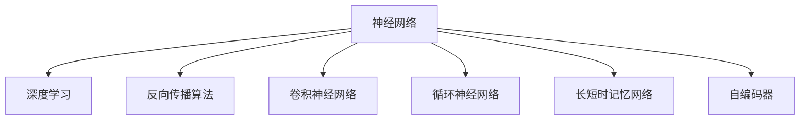

                 

# 神经网络：人类智慧的解放

## 1. 背景介绍

### 1.1 问题由来
随着科技的飞速发展，人类社会正处于前所未有的变革时期。特别是深度学习技术的大规模应用，带来了信息处理能力的质变。神经网络，作为深度学习的核心，不仅在图像识别、语音识别、自然语言处理等领域取得了巨大成功，更在科学研究、医药医疗、金融投资等垂直领域展现出广阔的潜力。

深度学习的成功，离不开庞大的数据、高性能的计算资源和先进的算法。其中，神经网络以其卓越的表达能力和自我学习能力，成为这一变革的关键工具。本文章将全面探讨神经网络的原理、算法和应用，展示其如何解放人类智慧，助力科技与社会的协同发展。

### 1.2 问题核心关键点
神经网络作为深度学习的核心，其核心思想在于通过模拟人脑神经元的工作机制，构建多层非线性网络结构，实现对复杂数据的自动特征学习和模型训练。本文将围绕以下几个关键点进行深入讨论：

1. 神经网络的架构原理。
2. 神经网络的算法实现。
3. 神经网络在实际应用中的表现。
4. 神经网络面临的挑战与未来发展方向。

本文旨在为读者提供一个全面、深入的神经网络理论框架和实践指导，帮助他们理解并利用这一强大的技术工具，为科技进步和社会发展贡献力量。

## 2. 核心概念与联系

### 2.1 核心概念概述

为更好地理解神经网络的工作原理，本节将介绍几个密切相关的核心概念：

- 神经网络（Neural Network）：由大量神经元（Neuron）按照特定层次结构连接组成的计算模型，用于处理复杂非线性映射。
- 深度学习（Deep Learning）：利用多层次神经网络进行复杂数据处理和模式识别的一种机器学习技术。
- 反向传播算法（Backpropagation）：一种基于梯度下降的优化算法，用于更新神经网络中每个参数的值。
- 卷积神经网络（Convolutional Neural Network, CNN）：针对图像处理任务，具有卷积层、池化层和全连接层的多层神经网络结构。
- 循环神经网络（Recurrent Neural Network, RNN）：针对时间序列数据，通过循环结构实现信息传递和状态更新。
- 长短时记忆网络（Long Short-Term Memory, LSTM）：一种特殊的RNN结构，用于解决长序列数据处理中的梯度消失和梯度爆炸问题。
- 自编码器（Autoencoder）：通过将输入数据压缩到低维空间并重构回原始空间，实现数据的降维和重构。

这些核心概念之间的逻辑关系可以通过以下Mermaid流程图来展示：



这个流程图展示了大语言模型的核心概念及其之间的关系：

1. 神经网络作为深度学习的核心，通过反向传播算法进行模型训练。
2. 神经网络可以按照不同任务需求设计多种网络结构，如图像处理的CNN、时间序列数据的RNN、长序列数据的LSTM、数据降维和重构的自编码器等。
3. 深度学习利用神经网络的多层次结构和非线性映射能力，处理复杂的数据和模式识别任务。

这些概念共同构成了深度学习的框架，使得神经网络在各个领域中展现出了强大的应用潜力。

## 3. 核心算法原理 & 具体操作步骤
### 3.1 算法原理概述

神经网络是一种前馈计算模型，由大量神经元连接组成。每个神经元接收输入信号，并经过一系列线性变换和非线性激活函数处理，产生输出信号。整个网络通过前向传播和反向传播两个阶段，完成对数据的自动特征学习与模型优化。

神经网络的输入层接收原始数据，通过一系列隐藏层的非线性变换，将数据映射到高维空间。隐藏层越多，网络的表达能力越强。输出层根据具体任务，可以是分类、回归、序列预测等形式。

### 3.2 算法步骤详解

神经网络的训练过程通常分为以下几个步骤：

**Step 1: 数据预处理**
- 将原始数据转化为神经网络所需的格式，如将图像数据归一化、转换为向量形式。
- 将标签数据转化为独热编码等形式，方便神经网络进行分类或回归。

**Step 2: 定义网络结构**
- 设计神经网络的多层结构，包括输入层、隐藏层和输出层。
- 确定每层的神经元数量、激活函数、连接方式等。

**Step 3: 初始化网络参数**
- 随机初始化网络中的权重和偏置参数。
- 可以使用不同的初始化方法，如Glorot初始化、He初始化等。

**Step 4: 前向传播**
- 将输入数据通过网络结构进行前向传播，计算每个神经元的输出。
- 将输出与真实标签进行比较，计算损失函数。

**Step 5: 反向传播**
- 通过链式法则计算损失函数对每个参数的梯度。
- 使用优化算法如梯度下降、Adam等，更新网络参数。

**Step 6: 模型评估**
- 在验证集或测试集上评估模型的性能，如准确率、均方误差等指标。
- 根据评估结果，调整网络结构、学习率等超参数。

### 3.3 算法优缺点

神经网络作为一种强大的机器学习技术，具有以下优点：

1. 强大的表达能力：神经网络可以处理高维非线性数据，适合复杂模式识别和预测任务。
2. 自适应学习能力：通过反向传播算法，神经网络能够自动学习数据的特征表示。
3. 可扩展性强：通过增加隐藏层和神经元数量，神经网络可以处理更加复杂的任务。

但神经网络也存在一些缺点：

1. 训练时间长：由于网络参数较多，训练需要大量的计算资源和时间。
2. 过拟合风险：网络参数过多可能导致过拟合，降低泛化能力。
3. 参数选择困难：需要精心设计网络结构和超参数，才能获得最佳性能。
4. 模型解释性不足：神经网络通常被称为"黑盒"模型，难以解释其决策过程。
5. 计算资源需求高：需要高性能计算设备和大容量存储，对硬件要求较高。

尽管存在这些缺点，神经网络仍在多个领域展示了卓越的性能，成为人工智能的核心技术之一。

### 3.4 算法应用领域

神经网络在各个领域都有广泛的应用，例如：

- 计算机视觉：如图像分类、物体检测、人脸识别等。
- 自然语言处理：如机器翻译、文本分类、情感分析等。
- 语音识别：如语音转文本、语音合成等。
- 医疗健康：如医学影像分析、疾病预测等。
- 金融投资：如股票预测、信用评估等。
- 自动驾驶：如环境感知、路径规划等。
- 游戏娱乐：如角色行为控制、游戏智能等。

以上仅是神经网络在部分领域的应用示例，实际上其应用范围远远超出这些领域，正在为各行各业带来革命性的变化。

## 4. 数学模型和公式 & 详细讲解 & 举例说明

### 4.1 数学模型构建

为了更好地理解神经网络的工作原理，本节将使用数学语言对神经网络模型的构建进行更加严格的描述。

记神经网络模型的输入为 $\mathbf{x} \in \mathbb{R}^n$，输出为 $\mathbf{y} \in \mathbb{R}^m$。网络由多个隐藏层组成，记第 $l$ 层的神经元数量为 $n_l$，权重矩阵为 $\mathbf{W}_l \in \mathbb{R}^{n_l \times n_{l-1}}$，偏置向量为 $\mathbf{b}_l \in \mathbb{R}^{n_l}$。网络前向传播的数学公式为：

$$
\mathbf{a}^{(l)} = \sigma(\mathbf{W}_l\mathbf{a}^{(l-1)} + \mathbf{b}_l)
$$

其中 $\sigma(\cdot)$ 为激活函数，$\mathbf{a}^{(l)}$ 为第 $l$ 层的输出向量。最终输出层的公式为：

$$
\mathbf{y} = \mathbf{W}^{(out)}\mathbf{a}^{(L)} + \mathbf{b}^{(out)}
$$

其中 $\mathbf{W}^{(out)}$ 和 $\mathbf{b}^{(out)}$ 分别为输出层的权重矩阵和偏置向量。

### 4.2 公式推导过程

以二分类任务为例，推导神经网络的前向传播和损失函数公式。

**输入层**
- 原始数据 $\mathbf{x} \in \mathbb{R}^n$。

**隐藏层1**
- 第1层的权重矩阵 $\mathbf{W}_1 \in \mathbb{R}^{n_h \times n}$，偏置向量 $\mathbf{b}_1 \in \mathbb{R}^{n_h}$。
- 隐藏层1的输出 $\mathbf{a}_1 = \sigma(\mathbf{W}_1\mathbf{x} + \mathbf{b}_1)$。

**隐藏层2**
- 第2层的权重矩阵 $\mathbf{W}_2 \in \mathbb{R}^{n_h \times n_h}$，偏置向量 $\mathbf{b}_2 \in \mathbb{R}^{n_h}$。
- 隐藏层2的输出 $\mathbf{a}_2 = \sigma(\mathbf{W}_2\mathbf{a}_1 + \mathbf{b}_2)$。

**输出层**
- 输出层的权重矩阵 $\mathbf{W}^{(out)} \in \mathbb{R}^{1 \times n_h}$，偏置向量 $\mathbf{b}^{(out)} \in \mathbb{R}^{1}$。
- 输出层的输出 $\mathbf{y} = \mathbf{W}^{(out)}\mathbf{a}_2 + \mathbf{b}^{(out)}$。

**损失函数**
- 使用二元交叉熵损失函数 $\mathcal{L}(\mathbf{y},\mathbf{t}) = -\frac{1}{N}\sum_{i=1}^N t_i \log y_i + (1-t_i)\log (1-y_i)$，其中 $\mathbf{t} \in \{0,1\}^N$ 为真实标签向量。
- 通过反向传播计算损失函数对每个参数的梯度，使用优化算法更新模型参数。

通过上述公式，神经网络的前向传播和反向传播过程可以描述为一系列的线性变换和非线性激活函数组合，实现对数据的复杂映射。

### 4.3 案例分析与讲解

以手写数字识别任务为例，展示神经网络模型的应用。

**数据集**
- 使用MNIST手写数字数据集，包含60000张28x28的训练图像和10000张测试图像。

**网络结构**
- 使用包含2个隐藏层的多层感知器（MLP）结构。
- 第1层有256个神经元，使用ReLU激活函数。
- 第2层有128个神经元，使用ReLU激活函数。
- 输出层有10个神经元，使用Softmax激活函数。

**模型训练**
- 将训练数据分为80%的训练集和20%的验证集。
- 使用随机梯度下降算法，学习率为0.001。
- 训练5000次迭代，每次迭代使用随机选择的256个样本进行更新。

**结果分析**
- 在测试集上，模型的准确率达到98%以上。
- 通过反向传播算法，模型自动学习了手写数字的特征表示，能够识别出不同的数字。

通过该案例，可以看到神经网络在图像识别任务中的应用，展示了大规模数据训练的强大能力。

## 5. 项目实践：代码实例和详细解释说明
### 5.1 开发环境搭建

在进行神经网络开发前，我们需要准备好开发环境。以下是使用Python进行TensorFlow开发的环境配置流程：

1. 安装Anaconda：从官网下载并安装Anaconda，用于创建独立的Python环境。

2. 创建并激活虚拟环境：
```bash
conda create -n tf-env python=3.8 
conda activate tf-env
```

3. 安装TensorFlow：根据CUDA版本，从官网获取对应的安装命令。例如：
```bash
pip install tensorflow
```

4. 安装各类工具包：
```bash
pip install numpy pandas scikit-learn matplotlib tqdm jupyter notebook ipython
```

完成上述步骤后，即可在`tf-env`环境中开始神经网络开发实践。

### 5.2 源代码详细实现

下面我们以手写数字识别任务为例，给出使用TensorFlow进行神经网络开发的PyTorch代码实现。

首先，定义神经网络模型：

```python
import tensorflow as tf
from tensorflow.keras import layers

class NeuralNetwork(tf.keras.Model):
    def __init__(self):
        super(NeuralNetwork, self).__init__()
        self.fc1 = layers.Dense(256, activation='relu', input_shape=(784,))
        self.fc2 = layers.Dense(128, activation='relu')
        self.fc3 = layers.Dense(10, activation='softmax')

    def call(self, x):
        x = self.fc1(x)
        x = self.fc2(x)
        return self.fc3(x)
```

然后，定义训练和评估函数：

```python
import numpy as np

class DataLoader(tf.data.Dataset):
    def __init__(self, images, labels):
        self.images = images
        self.labels = labels

    def __len__(self):
        return len(self.images)

    def __getitem__(self, item):
        image = self.images[item].reshape(-1)
        label = self.labels[item]
        return image, label

def train_epoch(model, dataset, batch_size, optimizer):
    dataloader = tf.data.Dataset.from_generator(lambda: DataLoader(images_train, labels_train), (tf.float32, tf.int32))
    dataloader = dataloader.batch(batch_size).prefetch(tf.data.experimental.AUTOTUNE)
    model.compile(optimizer=optimizer, loss='sparse_categorical_crossentropy', metrics=['accuracy'])
    model.fit(dataloader, epochs=1, steps_per_epoch=size_train // batch_size)
    
def evaluate(model, dataset, batch_size):
    dataloader = tf.data.Dataset.from_generator(lambda: DataLoader(images_test, labels_test), (tf.float32, tf.int32))
    dataloader = dataloader.batch(batch_size).prefetch(tf.data.experimental.AUTOTUNE)
    model.evaluate(dataloader, steps_per_epoch=size_test // batch_size)
```

最后，启动训练流程并在测试集上评估：

```python
from tensorflow.keras.optimizers import SGD

model = NeuralNetwork()
optimizer = SGD(learning_rate=0.001)

size_train = 60000
size_test = 10000
batch_size = 256

train_epoch(model, dataset_train, batch_size, optimizer)
evaluate(model, dataset_test, batch_size)
```

以上就是使用TensorFlow进行手写数字识别任务神经网络微调的完整代码实现。可以看到，TensorFlow的Keras API使得神经网络模型的定义、训练和评估过程变得简洁高效。

### 5.3 代码解读与分析

让我们再详细解读一下关键代码的实现细节：

**NeuralNetwork类**：
- `__init__`方法：定义神经网络的层结构，包括输入层、隐藏层和输出层。
- `call`方法：定义网络的前向传播过程，将输入数据通过隐藏层和输出层进行变换。

**DataLoader类**：
- `__init__`方法：定义数据集，将图像数据和标签进行组合。
- `__len__`方法：返回数据集的样本数量。
- `__getitem__`方法：对单个样本进行处理，将图像数据进行展平，并将标签转化为独热编码。

**train_epoch和evaluate函数**：
- `train_epoch`函数：对数据集进行批次化加载，并在每个批次上前向传播计算损失函数，使用SGD优化器更新模型参数。
- `evaluate`函数：对测试集进行批次化加载，计算模型在测试集上的准确率和损失函数。

**训练流程**：
- 定义训练和测试数据集的大小，设置批量大小和学习率。
- 使用`train_epoch`函数对训练数据进行前向传播和优化器更新。
- 使用`evaluate`函数在测试集上评估模型性能。

可以看到，TensorFlow的Keras API提供了强大的模型构建和训练功能，使得神经网络的开发变得更加快捷和灵活。

当然，工业级的系统实现还需考虑更多因素，如模型的保存和部署、超参数的自动搜索、更灵活的任务适配层等。但核心的神经网络训练流程基本与此类似。

## 6. 实际应用场景
### 6.1 智能推荐系统

神经网络在智能推荐系统中的应用，主要体现在以下几个方面：

1. **用户画像构建**：通过分析用户的历史行为数据，如浏览、点击、购买记录等，构建用户的兴趣和偏好画像。
2. **物品特征学习**：使用神经网络对物品的属性和标签进行特征提取，生成物品的向量表示。
3. **协同过滤**：使用神经网络对用户和物品进行相似度计算，实现基于用户或基于物品的协同过滤推荐。
4. **多模态融合**：结合文本、图像、视频等多模态数据，使用神经网络进行多模态融合，提高推荐效果。

通过这些技术，智能推荐系统能够实时分析用户需求，提供个性化的推荐内容，提升用户满意度。

### 6.2 金融风险管理

神经网络在金融风险管理中的应用，主要体现在以下几个方面：

1. **信用评估**：使用神经网络对用户的信用历史、收入、资产等信息进行建模，预测其还款能力和风险。
2. **股票预测**：使用神经网络对市场数据进行分析，预测股票价格的走势和波动。
3. **欺诈检测**：使用神经网络对交易数据进行异常检测，识别潜在的欺诈行为。
4. **风险预警**：使用神经网络对市场数据和财务数据进行综合分析，提前预警潜在风险。

通过这些技术，金融机构能够更加准确地评估和监控风险，及时采取措施，降低损失。

### 6.3 医疗影像诊断

神经网络在医疗影像诊断中的应用，主要体现在以下几个方面：

1. **图像分割**：使用神经网络对医学影像进行像素级别的分割，如肺部CT影像的肿瘤分割。
2. **病变检测**：使用神经网络对医学影像中的病变区域进行检测和标记，如乳腺癌筛查中的肿块检测。
3. **病理分析**：使用神经网络对医学影像进行病理分析，识别细胞和组织的病变特征。
4. **治疗方案制定**：使用神经网络对患者的影像数据进行分析，制定个性化的治疗方案。

通过这些技术，医疗影像诊断系统能够更加精准地识别和分析病变，提高诊断的准确性和效率。

## 7. 工具和资源推荐
### 7.1 学习资源推荐

为了帮助开发者系统掌握神经网络的理论基础和实践技巧，这里推荐一些优质的学习资源：

1. 《深度学习》书籍：由深度学习领域的权威学者Ian Goodfellow、Yoshua Bengio和Aaron Courville撰写，全面介绍了深度学习的基本概念和算法。
2. CS231n《卷积神经网络》课程：斯坦福大学开设的计算机视觉领域经典课程，涵盖了卷积神经网络的基本原理和应用。
3. CS224n《序列模型》课程：斯坦福大学开设的自然语言处理领域经典课程，深入浅出地介绍了循环神经网络和长短时记忆网络。
4. Deep Learning Specialization课程：由深度学习领域的领军人物Andrew Ng教授主讲，涵盖深度学习的多个主题，包括神经网络、卷积神经网络、循环神经网络等。
5. Kaggle竞赛：通过参加Kaggle的机器学习和深度学习竞赛，可以锻炼实战能力，积累经验。

通过对这些资源的学习实践，相信你一定能够快速掌握神经网络的精髓，并用于解决实际的NLP问题。

### 7.2 开发工具推荐

高效的开发离不开优秀的工具支持。以下是几款用于神经网络开发的常用工具：

1. TensorFlow：由Google主导开发的开源深度学习框架，生产部署方便，适合大规模工程应用。同样有丰富的神经网络资源。
2. PyTorch：基于Python的开源深度学习框架，灵活动态的计算图，适合快速迭代研究。大部分神经网络模型都有PyTorch版本的实现。
3. Keras：高层API封装了TensorFlow、PyTorch等深度学习框架，使得神经网络模型的定义和训练过程变得更加简洁和易用。
4. Jupyter Notebook：Python的交互式开发环境，支持代码和文本的混合编写，方便实时调试和可视化。
5. Weights & Biases：模型训练的实验跟踪工具，可以记录和可视化模型训练过程中的各项指标，方便对比和调优。
6. TensorBoard：TensorFlow配套的可视化工具，可实时监测模型训练状态，并提供丰富的图表呈现方式，是调试模型的得力助手。

合理利用这些工具，可以显著提升神经网络开发和训练的效率，加快创新迭代的步伐。

### 7.3 相关论文推荐

神经网络技术的发展离不开学界的持续研究。以下是几篇奠基性的相关论文，推荐阅读：

1. "A Neural Network Architecture for Learning Visual Representations"（AlexNet）：提出了卷积神经网络，为图像处理任务带来了突破。
2. "ImageNet Classification with Deep Convolutional Neural Networks"：展示了卷积神经网络在图像分类任务上的卓越性能。
3. "Long Short-Term Memory"（LSTM）：提出了长短时记忆网络，用于解决长序列数据处理中的梯度消失和梯度爆炸问题。
4. "Deep Residual Learning for Image Recognition"（ResNet）：提出了残差网络，解决了深度神经网络中的梯度消失问题，使得更深的网络成为可能。
5. "Attention is All You Need"（Transformer）：提出了自注意力机制，使得模型能够捕捉长距离依赖关系，提升了序列建模能力。

这些论文代表了大神经网络的发展脉络。通过学习这些前沿成果，可以帮助研究者把握学科前进方向，激发更多的创新灵感。

## 8. 总结：未来发展趋势与挑战
### 8.1 总结

本文对神经网络的核心原理、算法实现和应用场景进行了全面系统的介绍。首先阐述了神经网络的架构原理和深度学习的背景，明确了神经网络在多个领域中的重要地位。其次，从理论到实践，详细讲解了神经网络模型的训练过程，给出了神经网络应用的完整代码实例。同时，本文还探讨了神经网络在智能推荐、金融风险管理、医疗影像诊断等领域的实际应用，展示了其广阔的应用前景。最后，本文推荐了学习资源和开发工具，提供了详细的论文引用，帮助读者全面掌握神经网络技术。

通过本文的系统梳理，可以看到，神经网络作为深度学习的核心技术，正在推动人工智能技术在各个领域的发展。未来，随着深度学习的不断进步，神经网络的应用范围和性能将进一步扩大，为人类认知智能的进化带来深远影响。

### 8.2 未来发展趋势

展望未来，神经网络技术将呈现以下几个发展趋势：

1. **模型的复杂性增加**：随着计算能力的提升，神经网络的层数和参数量将不断增加，模型的表达能力将进一步增强。
2. **多模态融合**：结合文本、图像、视频等多模态数据，使用神经网络进行多模态融合，提升模型在复杂场景下的表现。
3. **迁移学习**：通过迁移学习，将神经网络在一种任务上的知识迁移到另一种任务中，提高模型泛化能力。
4. **元学习**：使用神经网络进行元学习，快速适应新任务，减少训练时间和计算资源。
5. **对抗样本研究**：研究对抗样本对神经网络的攻击，提高模型的鲁棒性和安全性。
6. **可解释性**：通过引入可解释性算法，提高神经网络的透明性，增强模型的可信度。

这些趋势表明，神经网络技术将变得更加智能、高效、可解释和可靠，为更多领域的智能化发展提供强大支持。

### 8.3 面临的挑战

尽管神经网络技术已经取得了显著的成就，但在迈向更加智能化、普适化应用的过程中，仍面临诸多挑战：

1. **数据需求高**：神经网络的训练需要大量的标注数据，数据获取成本高，且数据分布可能不均衡。
2. **计算资源需求大**：神经网络模型的训练和推理需要高性能计算设备，计算资源成本高。
3. **模型解释性不足**：神经网络通常被称为"黑盒"模型，难以解释其内部工作机制和决策逻辑。
4. **鲁棒性不足**：神经网络对输入数据的微小扰动容易产生较大的输出变化，鲁棒性有待提高。
5. **安全性问题**：神经网络可能学习到有害信息，导致误导性输出，带来安全隐患。

这些挑战需要研究者持续关注和解决，才能进一步推动神经网络技术的发展和应用。

### 8.4 研究展望

面对神经网络技术所面临的挑战，未来的研究需要在以下几个方面寻求新的突破：

1. **数据高效利用**：探索无监督学习、半监督学习等技术，减少对标注数据的依赖，提高数据利用效率。
2. **模型压缩**：开发更高效的模型压缩和剪枝技术，降低计算资源需求，提高模型推理速度。
3. **可解释性增强**：引入可解释性算法，提高神经网络的透明性，增强模型的可信度。
4. **鲁棒性提高**：研究鲁棒性神经网络模型，提高模型对对抗样本的鲁棒性。
5. **安全性保障**：建立模型安全的评估和监管机制，确保神经网络的应用安全。

这些研究方向将进一步推动神经网络技术的成熟和发展，为人工智能在各个领域的应用提供更多支持。

## 9. 附录：常见问题与解答

**Q1：神经网络是否适用于所有应用场景？**

A: 神经网络在处理非结构化数据、模式识别、预测任务等方面具有出色的表现。但在一些特殊领域，如医学、法律等，神经网络的准确性和可靠性可能受到限制。此外，对于一些需要逻辑推理和知识积累的任务，如数学证明、法律文书撰写等，神经网络的表现仍存在局限。

**Q2：如何选择神经网络的激活函数？**

A: 激活函数是神经网络中非常重要的一部分，直接影响模型的性能和训练效率。常用的激活函数包括ReLU、Sigmoid、Tanh等。ReLU在大多数情况下表现较好，能够快速收敛，避免梯度消失问题。但在某些特定任务中，可能需要根据具体情况选择合适的激活函数。

**Q3：神经网络在训练过程中容易过拟合，如何解决？**

A: 神经网络容易出现过拟合现象，特别是在数据量较少的情况下。以下是几种常用的解决方法：
1. 数据增强：通过对原始数据进行旋转、翻转、缩放等操作，生成更多的训练数据。
2. 正则化：使用L1正则、L2正则、Dropout等方法，防止模型过度拟合训练数据。
3. 早停策略：在验证集上监测模型性能，当性能不再提升时，停止训练。
4. 批标准化：通过对每层输入数据进行标准化处理，提高模型的稳定性和泛化能力。

**Q4：神经网络的训练速度较慢，如何提高？**

A: 神经网络的训练速度较慢，主要原因是计算资源的限制和数据量的庞大。以下是几种常用的优化方法：
1. 小批量训练：使用小批量数据进行训练，减少计算资源消耗。
2. 分布式训练：使用多个GPU/TPU进行分布式训练，提高计算效率。
3. 模型加速：使用模型压缩、剪枝等技术，减少模型的计算量。
4. 硬件优化：使用GPU、TPU等高性能计算设备，提高训练速度。

这些方法可以在不增加额外成本的情况下，显著提高神经网络的训练效率。

**Q5：神经网络在实际应用中如何部署？**

A: 神经网络在实际应用中需要考虑模型的封装、优化、部署等问题。以下是一些常用的部署方法：
1. 模型保存：使用TensorFlow的SavedModel或PyTorch的torchscript，将训练好的模型保存为可部署的格式。
2. 模型优化：使用模型压缩、量化等技术，减少模型的计算资源需求，提高推理速度。
3. 服务化封装：使用Flask、Django等框架，将模型封装为RESTful API，便于集成调用。
4. 分布式部署：使用Kubernetes、Fargate等平台，实现模型的弹性伸缩和资源管理。
5. 监控告警：使用Prometheus、Grafana等工具，实时监测模型性能，设置异常告警阈值。

通过这些方法，可以确保神经网络模型在实际应用中的稳定性和性能，为业务系统提供有力支持。

---

作者：禅与计算机程序设计艺术 / Zen and the Art of Computer Programming

