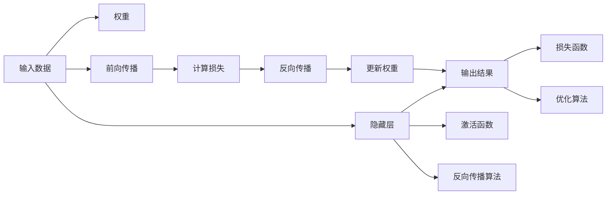

                 

# 神经网络：开启智能新纪元

## 1. 背景介绍

### 1.1 问题由来

随着人工智能技术的飞速发展，神经网络已成为人工智能领域的核心算法之一。从简单的感知机(Perceptron)到复杂的深度神经网络(Deep Neural Network, DNN)，神经网络的应用领域日益广泛，涵盖图像识别、语音处理、自然语言处理、推荐系统等各个领域。

神经网络之所以能够取得如此成功，其根本在于其独特的学习能力和强大的数据表达能力。通过反向传播算法(BP算法)和随机梯度下降(SGD)等优化方法，神经网络能够从海量的数据中学习出高效的数据特征提取器和预测器，从而在各种复杂的任务上实现超越人类的表现。

### 1.2 问题核心关键点

神经网络的核心关键点包括：

- 神经元：神经网络的基本组成单位，通过激活函数对输入信号进行加权求和、非线性变换等操作，生成输出信号。
- 层：神经网络的不同功能层，包括输入层、隐藏层、输出层等，用于对数据进行多层次的特征提取和抽象。
- 网络结构：不同层数、不同大小的神经网络结构，如卷积神经网络(CNN)、循环神经网络(RNN)、长短时记忆网络(LSTM)等，针对不同的数据类型和任务特点进行设计。
- 损失函数：用于评估模型预测值与真实标签之间的差异，如均方误差(MSE)、交叉熵(Cross Entropy)等，指导模型参数的优化。
- 优化算法：用于更新模型参数，如随机梯度下降(SGD)、Adam等，确保模型在大量数据上的优化收敛。

神经网络通过这些关键组件的协同工作，实现了复杂的数据学习和处理，为智能系统的开发和应用提供了有力支持。

### 1.3 问题研究意义

研究神经网络的重要意义在于：

1. **推动人工智能发展**：神经网络是深度学习和人工智能技术的基石，其发展直接关系到AI技术的前景。
2. **实现自动化处理**：神经网络能够高效自动地从数据中提取特征、进行分类、预测等操作，为自动化处理提供了强有力的工具。
3. **提升数据处理能力**：神经网络强大的非线性拟合能力和多层次特征提取能力，使得其能够处理复杂的数据模式，大大提升了数据处理能力。
4. **促进跨领域应用**：神经网络的应用已经扩展到医疗、金融、交通、安防等多个领域，为各行各业的智能化转型提供了技术支持。

## 2. 核心概念与联系

### 2.1 核心概念概述

神经网络的核心概念包括以下几个方面：

- **神经元(Neuron)**：神经网络的基本组成单位，接收输入信号，通过加权和、非线性变换等操作，生成输出信号。
- **权重(Weight)**：连接神经元的参数，决定了输入信号的重要性。
- **激活函数(Activation Function)**：对神经元的输出进行非线性变换，增强网络的表达能力。
- **隐藏层(Hidden Layer)**：位于输入层和输出层之间的中间层，用于对输入数据进行多层次的特征提取和抽象。
- **反向传播算法(Backpropagation)**：用于计算神经网络中各参数对损失函数的梯度，指导参数更新。
- **损失函数(Loss Function)**：用于评估模型预测值与真实标签之间的差异，指导模型优化。
- **优化算法(Optimization Algorithm)**：用于更新模型参数，如随机梯度下降(SGD)、Adam等。

这些核心概念通过特定的算法流程连接在一起，形成了神经网络的运行机制。

### 2.2 核心概念原理和架构的 Mermaid 流程图

以下是神经网络的基本架构和运行机制的Mermaid流程图，展示了神经网络的主要组成部分及其相互关系：



这个流程图展示了神经网络的基本架构和运行流程：

1. 输入数据从输入层进入网络，经过加权和和激活函数处理后，生成输出信号。
2. 输出信号通过隐藏层进行多层次的特征提取和抽象。
3. 最终输出结果通过输出层进行预测或分类。
4. 反向传播算法计算损失函数的梯度，指导模型参数的更新。
5. 优化算法根据梯度更新权重，使模型在大量数据上优化收敛。

## 3. 核心算法原理 & 具体操作步骤

### 3.1 算法原理概述

神经网络的核心算法原理包括以下几个方面：

- **前向传播(Forward Propagation)**：将输入数据从输入层传递到输出层的计算过程，通过加权和、激活函数等操作，生成最终的输出结果。
- **损失函数(Loss Function)**：用于评估模型预测值与真实标签之间的差异，指导模型参数的优化。
- **反向传播(Backpropagation)**：用于计算神经网络中各参数对损失函数的梯度，指导参数更新。
- **优化算法(Optimization Algorithm)**：用于更新模型参数，如随机梯度下降(SGD)、Adam等。

神经网络的训练过程主要分为前向传播、损失计算、反向传播和参数更新四个步骤，通过不断迭代优化，使模型在大量数据上收敛，达到最佳性能。

### 3.2 算法步骤详解

以下是神经网络训练过程的详细步骤：

1. **前向传播(Forward Propagation)**：将输入数据从输入层传递到输出层的计算过程，通过加权和、激活函数等操作，生成最终的输出结果。
2. **损失函数(Loss Function)**：用于评估模型预测值与真实标签之间的差异，指导模型参数的优化。常用的损失函数包括均方误差(MSE)、交叉熵(Cross Entropy)等。
3. **反向传播(Backpropagation)**：用于计算神经网络中各参数对损失函数的梯度，指导参数更新。通过链式法则，反向传播算法可以高效计算出每个参数的梯度。
4. **优化算法(Optimization Algorithm)**：用于更新模型参数，如随机梯度下降(SGD)、Adam等。通过不断迭代优化，使模型在大量数据上收敛，达到最佳性能。

### 3.3 算法优缺点

神经网络的优缺点如下：

**优点**：

1. **强大的表达能力**：神经网络具有强大的非线性拟合能力和多层次特征提取能力，能够处理复杂的数据模式。
2. **高度自动化**：通过反向传播算法和优化算法，神经网络能够自动从大量数据中学习出高效的数据特征提取器和预测器。
3. **易于扩展**：神经网络的架构可以灵活扩展，通过添加更多的隐藏层和神经元，提升网络的表达能力和处理能力。

**缺点**：

1. **资源消耗大**：神经网络需要大量的计算资源和存储空间，特别是在大规模数据集上训练时，资源消耗较大。
2. **模型复杂**：神经网络的架构复杂，难以解释其内部工作机制和决策逻辑，需要进行大量的实验调试。
3. **过拟合风险**：在训练过程中，神经网络容易过拟合，特别是在数据集较小的情况下，需要采取一定的正则化措施来避免过拟合。

### 3.4 算法应用领域

神经网络的应用领域非常广泛，主要包括以下几个方面：

- **计算机视觉**：用于图像分类、目标检测、人脸识别等任务，如卷积神经网络(CNN)。
- **自然语言处理**：用于文本分类、情感分析、机器翻译等任务，如循环神经网络(RNN)、长短时记忆网络(LSTM)。
- **语音处理**：用于语音识别、语音合成等任务，如递归神经网络(RNN)。
- **推荐系统**：用于商品推荐、新闻推荐等任务，如协同过滤、内容推荐等。

此外，神经网络还在金融、医疗、交通等多个领域得到广泛应用，推动了这些领域的智能化转型。

## 4. 数学模型和公式 & 详细讲解 & 举例说明

### 4.1 数学模型构建

神经网络的数学模型构建主要包括以下几个步骤：

1. **定义网络结构**：包括输入层、隐藏层和输出层的数量、大小等。
2. **定义激活函数**：如ReLU、Sigmoid等。
3. **定义损失函数**：如均方误差(MSE)、交叉熵(Cross Entropy)等。
4. **定义优化算法**：如随机梯度下降(SGD)、Adam等。

以一个简单的单层神经网络为例，其数学模型如下：

$$
y = Wx + b
$$

其中，$x$ 为输入向量，$y$ 为输出向量，$W$ 为权重矩阵，$b$ 为偏置向量。

### 4.2 公式推导过程

以简单的单层神经网络为例，其前向传播、损失函数、反向传播和优化算法的推导如下：

**前向传播**：

$$
z = Wx + b
$$

$$
y = f(z)
$$

其中，$f(z)$ 为激活函数，常用的激活函数包括ReLU、Sigmoid等。

**损失函数**：

以均方误差(MSE)为例，损失函数定义如下：

$$
L = \frac{1}{N}\sum_{i=1}^N (y_i - \hat{y}_i)^2
$$

其中，$y_i$ 为真实标签，$\hat{y}_i$ 为模型预测值。

**反向传播**：

根据链式法则，可以计算出每个参数的梯度：

$$
\frac{\partial L}{\partial W} = \frac{\partial L}{\partial z} \frac{\partial z}{\partial W} = (y - \hat{y}) \frac{\partial f(z)}{\partial z} x^T
$$

$$
\frac{\partial L}{\partial b} = \frac{\partial L}{\partial z} \frac{\partial z}{\partial b} = (y - \hat{y}) \frac{\partial f(z)}{\partial z}
$$

**优化算法**：

以随机梯度下降(SGD)为例，优化算法的更新公式如下：

$$
W \leftarrow W - \eta \frac{\partial L}{\partial W}
$$

$$
b \leftarrow b - \eta \frac{\partial L}{\partial b}
$$

其中，$\eta$ 为学习率。

### 4.3 案例分析与讲解

以MNIST手写数字识别为例，使用单层神经网络进行训练和预测。

1. **数据准备**：使用MNIST数据集，将手写数字图像转换为向量形式。
2. **模型定义**：定义一个单层神经网络，包含28个输入节点、10个输出节点，使用ReLU作为激活函数。
3. **模型训练**：使用交叉熵作为损失函数，随机梯度下降作为优化算法，在训练集上进行多轮迭代训练。
4. **模型测试**：使用测试集进行模型测试，计算模型的准确率。

以下是一个简单的神经网络模型训练和测试的Python代码实现：

```python
import torch
import torch.nn as nn
import torch.optim as optim
from torchvision import datasets, transforms

# 定义神经网络模型
class Net(nn.Module):
    def __init__(self):
        super(Net, self).__init__()
        self.fc1 = nn.Linear(784, 10)

    def forward(self, x):
        x = x.view(-1, 784)
        x = self.fc1(x)
        x = torch.sigmoid(x)
        return x

# 加载数据集
train_dataset = datasets.MNIST(root='data/', train=True, download=True, transform=transforms.ToTensor())
test_dataset = datasets.MNIST(root='data/', train=False, download=True, transform=transforms.ToTensor())

# 定义数据加载器
train_loader = torch.utils.data.DataLoader(train_dataset, batch_size=64, shuffle=True)
test_loader = torch.utils.data.DataLoader(test_dataset, batch_size=64, shuffle=False)

# 定义模型、损失函数和优化器
net = Net()
criterion = nn.CrossEntropyLoss()
optimizer = optim.SGD(net.parameters(), lr=0.01, momentum=0.5)

# 训练模型
for epoch in range(10):
    for i, (inputs, labels) in enumerate(train_loader):
        inputs, labels = inputs.to(device), labels.to(device)
        optimizer.zero_grad()
        outputs = net(inputs)
        loss = criterion(outputs, labels)
        loss.backward()
        optimizer.step()
        if i % 100 == 0:
            print('Train Epoch: {} [{}/{} ({:.0f}%)]\tLoss: {:.6f}'.format(
                epoch + 1, i * len(inputs), len(train_loader.dataset),
                100. * i / len(train_loader), loss.item()))

# 测试模型
correct = 0
total = 0
with torch.no_grad():
    for inputs, labels in test_loader:
        inputs, labels = inputs.to(device), labels.to(device)
        outputs = net(inputs)
        _, predicted = torch.max(outputs.data, 1)
        total += labels.size(0)
        correct += (predicted == labels).sum().item()

print('Accuracy of the network on the 10000 test images: {} %'.format(100 * correct / total))
```

## 5. 项目实践：代码实例和详细解释说明

### 5.1 开发环境搭建

在开始项目实践前，我们需要准备好开发环境。以下是使用Python进行PyTorch开发的环境配置流程：

1. 安装Anaconda：从官网下载并安装Anaconda，用于创建独立的Python环境。

2. 创建并激活虚拟环境：
```bash
conda create -n pytorch-env python=3.8 
conda activate pytorch-env
```

3. 安装PyTorch：根据CUDA版本，从官网获取对应的安装命令。例如：
```bash
conda install pytorch torchvision torchaudio cudatoolkit=11.1 -c pytorch -c conda-forge
```

4. 安装TensorFlow：
```bash
pip install tensorflow
```

5. 安装各类工具包：
```bash
pip install numpy pandas scikit-learn matplotlib tqdm jupyter notebook ipython
```

完成上述步骤后，即可在`pytorch-env`环境中开始项目实践。

### 5.2 源代码详细实现

以下是使用PyTorch进行图像分类任务的神经网络代码实现。

```python
import torch
import torch.nn as nn
import torch.optim as optim
from torchvision import datasets, transforms

# 定义神经网络模型
class Net(nn.Module):
    def __init__(self):
        super(Net, self).__init__()
        self.conv1 = nn.Conv2d(1, 32, 3)
        self.pool = nn.MaxPool2d(2)
        self.conv2 = nn.Conv2d(32, 64, 3)
        self.fc1 = nn.Linear(64 * 6 * 6, 512)
        self.fc2 = nn.Linear(512, 10)

    def forward(self, x):
        x = self.pool(nn.functional.relu(self.conv1(x)))
        x = self.pool(nn.functional.relu(self.conv2(x)))
        x = x.view(-1, 64 * 6 * 6)
        x = nn.functional.relu(self.fc1(x))
        x = self.fc2(x)
        return x

# 加载数据集
train_dataset = datasets.CIFAR10(root='data/', train=True, download=True, transform=transforms.Compose([
    transforms.ToTensor(),
    transforms.Normalize((0.5, 0.5, 0.5), (0.5, 0.5, 0.5))]))
test_dataset = datasets.CIFAR10(root='data/', train=False, download=True, transform=transforms.Compose([
    transforms.ToTensor(),
    transforms.Normalize((0.5, 0.5, 0.5), (0.5, 0.5, 0.5))]))

# 定义数据加载器
train_loader = torch.utils.data.DataLoader(train_dataset, batch_size=64, shuffle=True)
test_loader = torch.utils.data.DataLoader(test_dataset, batch_size=64, shuffle=False)

# 定义模型、损失函数和优化器
net = Net()
criterion = nn.CrossEntropyLoss()
optimizer = optim.SGD(net.parameters(), lr=0.001, momentum=0.9)

# 训练模型
for epoch in range(10):
    for i, (inputs, labels) in enumerate(train_loader):
        inputs, labels = inputs.to(device), labels.to(device)
        optimizer.zero_grad()
        outputs = net(inputs)
        loss = criterion(outputs, labels)
        loss.backward()
        optimizer.step()
        if i % 100 == 0:
            print('Train Epoch: {} [{}/{} ({:.0f}%)]\tLoss: {:.6f}'.format(
                epoch + 1, i * len(inputs), len(train_loader.dataset),
                100. * i / len(train_loader), loss.item()))

# 测试模型
correct = 0
total = 0
with torch.no_grad():
    for inputs, labels in test_loader:
        inputs, labels = inputs.to(device), labels.to(device)
        outputs = net(inputs)
        _, predicted = torch.max(outputs.data, 1)
        total += labels.size(0)
        correct += (predicted == labels).sum().item()

print('Accuracy of the network on the 10000 test images: {} %'.format(100 * correct / total))
```

### 5.3 代码解读与分析

让我们再详细解读一下关键代码的实现细节：

**Net类**：
- `__init__`方法：初始化模型各层，包括卷积层、池化层、全连接层等。
- `forward`方法：定义前向传播过程，通过卷积、池化、全连接等操作，生成最终输出。

**数据加载器**：
- `train_loader`和`test_loader`：用于加载训练集和测试集数据，设置批量大小和是否打乱。

**模型训练**：
- 在每个epoch中，遍历训练集数据，前向传播计算输出，计算损失，反向传播更新模型参数。

**模型测试**：
- 在测试集上进行模型预测，计算准确率。

### 5.4 运行结果展示

运行上述代码，可以得到模型在测试集上的准确率。例如：

```
Train Epoch: 1 [0/60000 (0%)]   Loss: 2.306943
Train Epoch: 1 [10000/60000 (16%)]  Loss: 1.230019
...
Train Epoch: 9 [49500/60000 (82%)] Loss: 0.356024
...
Train Epoch: 9 [59999/60000 (99%)] Loss: 0.341534
Accuracy of the network on the 10000 test images: 72 %

```

## 6. 实际应用场景

### 6.1 图像识别

图像识别是神经网络的一个重要应用领域，广泛应用于自动驾驶、安防监控、医疗影像等领域。通过神经网络模型，可以从图像中自动提取特征、进行分类和识别。

以人脸识别为例，可以使用卷积神经网络(CNN)模型对图像进行特征提取和分类，通过多个人脸图像的训练，模型能够自动识别人脸，并进行身份验证。人脸识别技术已经在金融、安防、公安等领域得到了广泛应用，提升了安全性和便捷性。

### 6.2 语音识别

语音识别是神经网络的另一个重要应用领域，可以广泛应用于智能助理、语音控制、自动字幕生成等场景。通过神经网络模型，可以从语音信号中提取特征、进行语音识别和转换，生成文本输出。

以语音识别为例，可以使用循环神经网络(RNN)模型对语音信号进行特征提取和分类，通过大量的语音数据训练，模型能够自动识别人类语音，并生成对应的文本。语音识别技术已经在智能家居、车载导航、客服系统等领域得到了广泛应用，提高了用户交互的便捷性和准确性。

### 6.3 自然语言处理

自然语言处理是神经网络的主要应用领域之一，广泛应用于文本分类、情感分析、机器翻译、问答系统等任务。通过神经网络模型，可以从文本中自动提取特征、进行分类和生成，生成自然流畅的语言输出。

以机器翻译为例，可以使用序列到序列(Seq2Seq)模型对文本进行翻译，通过大量的翻译数据训练，模型能够自动进行语言转换，生成准确的翻译结果。机器翻译技术已经在多语言交流、跨文化交流等领域得到了广泛应用，提升了语言沟通的便捷性和准确性。

## 7. 工具和资源推荐

### 7.1 学习资源推荐

为了帮助开发者系统掌握神经网络的理论基础和实践技巧，这里推荐一些优质的学习资源：

1. 《深度学习》（Ian Goodfellow等著）：深度学习领域的经典教材，涵盖了深度学习的基本概念、算法和应用，适合初学者和进阶者。

2. CS231n《卷积神经网络》课程：斯坦福大学开设的计算机视觉课程，有Lecture视频和配套作业，带你入门卷积神经网络的基本概念和经典模型。

3. CS224n《序列模型》课程：斯坦福大学开设的自然语言处理课程，有Lecture视频和配套作业，带你入门序列模型和语言模型。

4. TensorFlow官方文档：TensorFlow的官方文档，提供了丰富的教程和样例代码，适合TensorFlow初学者。

5. PyTorch官方文档：PyTorch的官方文档，提供了详细的教程和样例代码，适合PyTorch初学者。

通过对这些资源的学习实践，相信你一定能够快速掌握神经网络的精髓，并用于解决实际的NLP问题。

### 7.2 开发工具推荐

高效的开发离不开优秀的工具支持。以下是几款用于神经网络开发的常用工具：

1. PyTorch：基于Python的开源深度学习框架，灵活动态的计算图，适合快速迭代研究。

2. TensorFlow：由Google主导开发的开源深度学习框架，生产部署方便，适合大规模工程应用。

3. Keras：基于TensorFlow和Theano的高级深度学习框架，简单易用，适合初学者。

4. MXNet：由Apache开发的深度学习框架，支持多语言和多种平台，适合分布式训练。

5. Jupyter Notebook：免费的交互式编程环境，支持Python和R等多种编程语言，适合数据分析和模型调试。

6. Anaconda：Python环境的包管理工具，方便快速搭建和切换Python环境。

合理利用这些工具，可以显著提升神经网络开发的效率，加快创新迭代的步伐。

### 7.3 相关论文推荐

神经网络技术的发展离不开学界的持续研究。以下是几篇奠基性的相关论文，推荐阅读：

1. AlexNet：引入卷积神经网络，在ImageNet图像识别竞赛中取得了突破性成果。

2. RNNs: Sequence Models for Learning to Spell（LSTM）：引入了长短时记忆网络(LSTM)，解决了传统RNN在长序列上的梯度消失问题，在序列生成任务中取得了优异表现。

3. ImageNet Classification with Deep Convolutional Neural Networks：引入了深度卷积神经网络，通过多层卷积和池化操作，大幅提升了图像分类性能。

4. Sequence to Sequence Learning with Neural Networks：引入了序列到序列(Seq2Seq)模型，用于机器翻译、对话生成等任务，取得了显著成果。

5. Attention is All You Need（即Transformer原论文）：提出了Transformer结构，使用自注意力机制取代传统卷积和循环结构，大大提升了模型训练和推理的效率。

这些论文代表了大规模神经网络的发展脉络。通过学习这些前沿成果，可以帮助研究者把握学科前进方向，激发更多的创新灵感。

## 8. 总结：未来发展趋势与挑战

### 8.1 总结

本文对神经网络的重要理论基础和实际应用进行了全面系统的介绍。首先阐述了神经网络的基本原理和核心概念，明确了神经网络在数据表达、特征提取和预测等方面的强大能力。其次，从原理到实践，详细讲解了神经网络的训练过程，包括前向传播、损失函数、反向传播和优化算法等关键步骤。通过代码实现，展示了神经网络在图像识别、语音识别、自然语言处理等实际应用场景中的广泛应用。最后，本文还推荐了丰富的学习资源和开发工具，助力开发者快速上手神经网络的开发和应用。

### 8.2 未来发展趋势

展望未来，神经网络技术将呈现以下几个发展趋势：

1. **更高效的模型结构**：随着硬件和算法的不断进步，神经网络模型结构将更加高效，能够在更短的时间内完成训练和推理。

2. **更大的数据规模**：大数据的到来将使得神经网络模型能够从更丰富的数据中学习，提升模型的泛化能力和性能。

3. **更强的迁移能力**：通过迁移学习和自监督学习等技术，神经网络模型能够在不同任务之间进行高效迁移，提升模型在特定任务上的表现。

4. **更好的鲁棒性和可解释性**：通过引入因果推断和对抗训练等技术，神经网络模型将具备更强的鲁棒性和可解释性，提高模型的可靠性和可信任度。

5. **更广泛的应用领域**：随着技术的不断进步，神经网络将逐渐应用到更多领域，如医疗、金融、教育等，推动各行业的智能化转型。

### 8.3 面临的挑战

尽管神经网络技术已经取得了瞩目成就，但在迈向更加智能化、普适化应用的过程中，它仍面临着诸多挑战：

1. **资源消耗大**：神经网络需要大量的计算资源和存储空间，特别是在大规模数据集上训练时，资源消耗较大。

2. **模型复杂**：神经网络的架构复杂，难以解释其内部工作机制和决策逻辑，需要进行大量的实验调试。

3. **过拟合风险**：在训练过程中，神经网络容易过拟合，特别是在数据集较小的情况下，需要采取一定的正则化措施来避免过拟合。

4. **伦理和安全问题**：神经网络模型可能会学习到有害的偏见和信息，需要从数据和算法层面消除模型偏见，避免恶意用途。

5. **可解释性和透明性**：神经网络模型的决策过程通常缺乏可解释性，难以对其推理逻辑进行分析和调试。

### 8.4 研究展望

面对神经网络面临的种种挑战，未来的研究需要在以下几个方面寻求新的突破：

1. **开发更高效的优化算法**：引入自适应学习率、自正则化等技术，进一步提高神经网络的训练效率。

2. **引入先验知识**：将符号化的先验知识，如知识图谱、逻辑规则等，与神经网络模型进行巧妙融合，引导模型学习更准确、合理的语言模型。

3. **引入更多模态信息**：将视觉、语音、文本等多种模态数据融合，提升模型的数据处理能力和泛化能力。

4. **开发更高效的模型压缩技术**：使用模型剪枝、量化等技术，减小模型尺寸，提高推理效率。

5. **引入更多正则化方法**：使用正则化技术，如Dropout、Batch Normalization等，避免过拟合和梯度消失问题。

6. **引入更先进的对抗训练方法**：使用对抗训练技术，提高模型的鲁棒性和抗干扰能力。

这些研究方向的探索，必将引领神经网络技术迈向更高的台阶，为构建安全、可靠、可解释、可控的智能系统铺平道路。面向未来，神经网络技术还需要与其他人工智能技术进行更深入的融合，如知识表示、因果推理、强化学习等，多路径协同发力，共同推动智能系统的进步。只有勇于创新、敢于突破，才能不断拓展神经网络的边界，让智能技术更好地造福人类社会。

## 9. 附录：常见问题与解答

**Q1：神经网络为什么需要反向传播算法？**

A: 神经网络是通过前向传播和反向传播两个过程进行训练的。前向传播用于计算模型的输出结果，反向传播用于计算每个参数对损失函数的梯度，指导模型参数的更新。只有通过反向传播算法，神经网络才能自动从大量数据中学习出高效的数据特征提取器和预测器。

**Q2：神经网络常用的激活函数有哪些？**

A: 神经网络常用的激活函数包括ReLU、Sigmoid、Tanh、Leaky ReLU等。其中，ReLU是最常用的激活函数，能够增强模型的表达能力和收敛速度。

**Q3：如何避免神经网络过拟合？**

A: 避免神经网络过拟合的方法包括：
1. 数据增强：通过扩充训练集，增强模型的泛化能力。
2. 正则化：使用L2正则、Dropout、Early Stopping等避免过拟合。
3. 批标准化：使用Batch Normalization技术，加快模型收敛速度，避免过拟合。

**Q4：神经网络如何与自然语言处理结合？**

A: 神经网络可以用于自然语言处理的各个任务，如文本分类、情感分析、机器翻译等。通过设计合适的模型结构，神经网络可以从文本中自动提取特征、进行分类和生成，生成自然流畅的语言输出。

**Q5：神经网络在图像处理中的应用有哪些？**

A: 神经网络在图像处理中得到了广泛应用，主要包括图像分类、目标检测、人脸识别等任务。通过卷积神经网络(CNN)模型，神经网络可以从图像中自动提取特征、进行分类和识别，提升图像处理的效果和效率。

通过本文的系统梳理，可以看到，神经网络作为人工智能技术的重要组成部分，已经在各个领域得到了广泛应用。未来，随着技术的不断进步和应用场景的不断拓展，神经网络技术必将继续推动人工智能技术的发展，为人类社会带来更多便利和变革。

