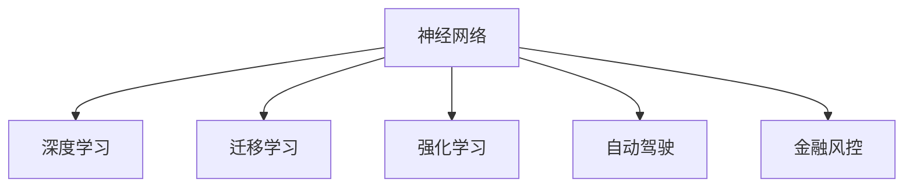

                 

## 1. 背景介绍

### 1.1 问题由来
神经网络（Neural Networks, NNs）自20世纪80年代以来，已经取得了长足的发展，尤其在深度学习领域，其应用的广泛性和性能的优越性得到了全球科技界的广泛认可。人工智能的最新进展，包括计算机视觉、自然语言处理、语音识别等，大多都是建立在神经网络技术的基础之上的。今天，神经网络已渗透到人类社会的方方面面，不仅革新了科技产业，也推动了社会的进步。

### 1.2 问题核心关键点
神经网络之所以能推动社会的进步，主要体现在以下几个关键点：
1. **自动化的智能化**：神经网络能够自主学习大量数据，进行模式识别和预测，大幅提高了生产效率和质量。
2. **跨领域的泛化能力**：通过迁移学习，神经网络能够在多个领域进行知识复用，实现技术跨界应用。
3. **数据的驱动决策**：神经网络通过对海量数据的分析，可以帮助企业做出更加科学合理的决策，优化资源配置。
4. **人机协作的新模式**：神经网络与人类智慧的结合，实现了更高效的协作方式，提升了用户体验和满意度。
5. **伦理与安全的挑战**：随着神经网络的广泛应用，其伦理和安全问题也日益凸显，如隐私保护、公平性、偏见消除等。

神经网络的广泛应用，不仅在技术上带来了革新，更在经济、社会、文化等多个层面产生了深远影响，成为推动社会进步的重要力量。

### 1.3 问题研究意义
研究神经网络及其对社会进步的影响，不仅具有重要的理论意义，还对未来的技术发展和社会治理有重要的指导意义。

1. **技术创新驱动**：理解神经网络的原理和应用，有助于推动新技术的开发，促进更多领域的智能化进程。
2. **社会治理优化**：从数据和算法层面改善决策机制，提高公共服务的公平性和效率。
3. **人机交互升级**：探索神经网络与人机协作的新模式，提升用户体验和交互的智能化水平。
4. **伦理安全保障**：确保神经网络应用的安全性和伦理性，防止技术滥用，保障数据隐私和用户权益。

## 2. 核心概念与联系

### 2.1 核心概念概述

为更好地理解神经网络及其对社会进步的影响，本节将介绍几个关键概念：

- **神经网络（Neural Networks, NNs）**：一类基于人工神经元构建的计算模型，通过前向传播和反向传播算法实现数据处理和模型训练，具有高度拟合复杂非线性问题的能力。
- **深度学习（Deep Learning, DL）**：一种基于多层神经网络的人工智能技术，通过增加网络深度和宽度，提高模型的复杂度和拟合能力，广泛应用于计算机视觉、自然语言处理等领域。
- **迁移学习（Transfer Learning）**：一种通过利用预训练模型进行新任务训练的技术，能够减少新任务训练所需的标注样本和计算资源。
- **强化学习（Reinforcement Learning, RL）**：一种通过奖励信号指导模型决策的学习方式，常用于机器人控制、游戏智能等领域。
- **自动驾驶**：神经网络在无人驾驶技术中的应用，通过实时感知环境、做出智能决策，提升驾驶安全性与效率。
- **金融风控**：神经网络在金融领域的应用，通过风险评估、信用评分等，提升金融服务质量和风险管理能力。

这些核心概念之间的逻辑关系可以通过以下Mermaid流程图来展示：



这个流程图展示了神经网络的几个核心应用领域及其相互关系：

1. 神经网络是深度学习的基础，通过多层网络进行特征提取和处理。
2. 迁移学习基于预训练的神经网络，能够在特定任务上进行微调，减少新任务训练样本的需求。
3. 强化学习通过奖励机制指导神经网络决策，适用于需要即时反馈的任务。
4. 自动驾驶和金融风控则是神经网络在特定领域的应用实例。

## 3. 核心算法原理 & 具体操作步骤
### 3.1 算法原理概述

神经网络通过多层次的神经元相互连接，通过前向传播和反向传播算法进行数据处理和模型训练，其核心思想是将大规模数据映射到复杂的非线性空间，从而实现对复杂模式的拟合。深度学习是神经网络的一个分支，通过增加网络深度和宽度，提升模型的拟合能力。

具体来说，深度学习算法包括卷积神经网络（CNNs）、循环神经网络（RNNs）、递归神经网络（LSTMs）、变分自编码器（VAEs）等，它们在不同的数据和任务上表现优异。

### 3.2 算法步骤详解

深度学习的典型算法步骤包括：

**Step 1: 数据准备**
- 收集标注数据集 $D=\{(x_i, y_i)\}_{i=1}^N$，其中 $x_i$ 为输入数据，$y_i$ 为标签。
- 数据预处理，包括数据归一化、数据增强等。

**Step 2: 设计网络架构**
- 确定网络层数、神经元数量、激活函数、损失函数等。
- 设计输入层、隐藏层、输出层的结构和参数。

**Step 3: 模型训练**
- 使用随机梯度下降（SGD）等优化算法进行模型训练，迭代更新网络参数。
- 通过前向传播计算输出，反向传播计算梯度，更新参数。

**Step 4: 模型评估**
- 使用验证集和测试集评估模型性能，如准确率、精确率、召回率等指标。
- 根据评估结果调整模型超参数，继续训练或保存模型。

**Step 5: 模型部署**
- 将训练好的模型部署到实际应用环境中，如服务器、手机应用等。
- 对实际数据进行推理预测，并集成到业务系统中。

深度学习在各个领域的实际应用过程如下：

**计算机视觉**：
- 使用卷积神经网络（CNNs）进行图像分类、物体检测、图像分割等。
- 模型训练数据集通常包含大规模标注图片，如ImageNet、COCO等。
- 实际应用包括智能监控、医疗影像分析等。

**自然语言处理（NLP）**：
- 使用循环神经网络（RNNs）、长短时记忆网络（LSTMs）等进行文本分类、情感分析、机器翻译等。
- 模型训练数据集包括大规模文本语料库，如GPT、BERT等。
- 实际应用包括智能客服、金融舆情监测等。

**语音识别**：
- 使用卷积神经网络（CNNs）和循环神经网络（RNNs）进行语音识别、语音合成等。
- 模型训练数据集通常包含大规模音频和文本对。
- 实际应用包括智能家居、车载交互等。

### 3.3 算法优缺点

深度学习的优点在于其强大的数据拟合能力，能够处理高维度数据，适用于复杂模式识别任务。同时，深度学习还具有以下优点：

1. **自适应能力**：通过大量标注数据训练，神经网络能够自动学习特征，适应新任务。
2. **高效性**：通过大规模并行计算，深度学习模型训练和推理速度较快。
3. **可扩展性**：通过增加网络深度和宽度，深度学习模型可以扩展到更复杂的任务。

然而，深度学习也存在一些局限性：

1. **数据依赖性强**：深度学习模型需要大量标注数据进行训练，数据获取成本高。
2. **模型复杂度高**：深度学习模型结构复杂，难以解释和调试。
3. **泛化能力不足**：深度学习模型易过拟合，对新数据的泛化能力不足。
4. **计算资源消耗大**：深度学习模型计算量大，需要高性能硬件支持。

尽管存在这些局限性，但深度学习在多个领域取得了显著进展，成为推动社会进步的重要力量。

### 3.4 算法应用领域

深度学习在以下几个领域得到了广泛应用：

**计算机视觉**：
- 图像分类：使用CNNs对大规模图像进行分类，如ImageNet中的1000个类别。
- 物体检测：使用R-CNN、Fast R-CNN等算法检测图像中的物体。
- 图像分割：使用U-Net等算法进行图像像素级分割。

**自然语言处理（NLP）**：
- 语言模型：使用RNNs、LSTMs等进行语言建模，如GPT系列模型。
- 机器翻译：使用序列到序列（Seq2Seq）模型进行多语言翻译。
- 文本生成：使用GPT-2、GPT-3等模型进行文本生成。

**语音识别**：
- 语音识别：使用RNNs、CNNs等进行语音识别和转录。
- 语音合成：使用Tacotron、WaveNet等模型进行语音合成。

**自动驾驶**：
- 环境感知：使用CNNs、LSTMs等进行车辆环境感知和路径规划。
- 智能决策：使用强化学习（RL）进行智能驾驶决策。

**金融风控**：
- 信用评分：使用神经网络进行客户信用评分，提升贷款审批效率。
- 风险评估：使用神经网络进行金融风险评估和预警。

**医疗影像**：
- 图像识别：使用CNNs进行医学影像识别和分类。
- 智能诊断：使用神经网络进行疾病预测和诊断。

这些应用领域展示了深度学习在社会进步中的重要作用，通过提供高效、准确、智能的解决方案，深度学习正在改变各行各业的生产方式和生活方式。

## 4. 数学模型和公式 & 详细讲解
### 4.1 数学模型构建

深度学习的核心模型为神经网络，其数学模型可以表示为：

$$
\begin{aligned}
    y &= \sigma(Wx + b) \\
    x &= \phi(W_{in}h_{in-1} + b_{in})
\end{aligned}
$$

其中 $y$ 为输出，$x$ 为输入，$W$ 和 $b$ 为权重和偏置，$\sigma$ 为激活函数，$h$ 为隐藏层输出。

**多层神经网络**：

$$
h^{[l]} = \sigma(W^{[l]}h^{[l-1]} + b^{[l]})
$$

其中 $h^{[l]}$ 为第 $l$ 层隐藏层的输出，$W^{[l]}$ 和 $b^{[l]}$ 为第 $l$ 层的权重和偏置。

### 4.2 公式推导过程

以卷积神经网络（CNNs）为例，展示其数学模型推导过程：

**卷积层**：

$$
y_{ij} = \sigma\left(W * x_{ij}\right)
$$

其中 $y_{ij}$ 为输出特征图，$W$ 为卷积核，$x_{ij}$ 为输入特征图。

**池化层**：

$$
y_{i'} = \max\left(\frac{y_{i+2} + y_{i+1} + y_i + y_{i-1} + y_{i-2}}{5}\right)
$$

其中 $y_{i'}$ 为池化后的特征图，$y_{i+2}, y_{i+1}, y_i, y_{i-1}, y_{i-2}$ 为周围五个像素值。

**全连接层**：

$$
y = \sigma(Wx + b)
$$

其中 $y$ 为输出，$W$ 和 $b$ 为权重和偏置，$\sigma$ 为激活函数，$x$ 为输入。

### 4.3 案例分析与讲解

**图像分类**：
- 使用CNNs进行图像分类任务，如MNIST数据集中的手写数字识别。
- 使用Softmax激活函数计算输出类别概率。

**文本分类**：
- 使用RNNs、LSTMs进行文本分类任务，如情感分析。
- 使用softmax激活函数计算输出类别概率。

**语音识别**：
- 使用CNNs、RNNs进行语音识别，如使用CTC算法进行语音转录。
- 使用softmax激活函数计算输出类别概率。

## 5. 项目实践：代码实例和详细解释说明
### 5.1 开发环境搭建

进行深度学习项目开发，需要以下环境配置：

1. 安装Python：从官网下载并安装Python 3.7或以上版本。
2. 安装NumPy、Pandas、Matplotlib等工具包：
```bash
pip install numpy pandas matplotlib scikit-learn tensorflow keras tensorflow-hub
```
3. 安装TensorFlow或PyTorch：
```bash
pip install tensorflow==2.3
# 或
conda install pytorch torchvision torchaudio -c pytorch -c conda-forge
```
4. 安装TensorBoard和Weights & Biases：
```bash
pip install tensorboard
conda install weights-and-biases -c weights-and-biases
```
5. 搭建GPU环境：
```bash
# 安装CUDA和cuDNN
# 安装TensorRT
```

### 5.2 源代码详细实现

以使用TensorFlow进行图像分类为例，展示深度学习项目的代码实现。

```python
import tensorflow as tf
from tensorflow.keras import datasets, layers, models

# 加载数据集
(train_images, train_labels), (test_images, test_labels) = datasets.cifar10.load_data()

# 数据预处理
train_images, test_images = train_images / 255.0, test_images / 255.0

# 构建模型
model = models.Sequential()
model.add(layers.Conv2D(32, (3, 3), activation='relu', input_shape=(32, 32, 3)))
model.add(layers.MaxPooling2D((2, 2)))
model.add(layers.Conv2D(64, (3, 3), activation='relu'))
model.add(layers.MaxPooling2D((2, 2)))
model.add(layers.Conv2D(64, (3, 3), activation='relu'))
model.add(layers.Flatten())
model.add(layers.Dense(64, activation='relu'))
model.add(layers.Dense(10))

# 编译模型
model.compile(optimizer='adam',
              loss=tf.keras.losses.SparseCategoricalCrossentropy(from_logits=True),
              metrics=['accuracy'])

# 训练模型
history = model.fit(train_images, train_labels, epochs=10, 
                    validation_data=(test_images, test_labels))

# 评估模型
test_loss, test_acc = model.evaluate(test_images, test_labels, verbose=2)
print('Test accuracy:', test_acc)
```

### 5.3 代码解读与分析

**数据加载和预处理**：
- 使用`datasets.cifar10.load_data()`加载CIFAR-10数据集。
- 对数据进行归一化处理，将像素值从[0, 255]缩放至[0, 1]。

**模型构建**：
- 定义模型结构，包括卷积层、池化层、全连接层。
- 使用`Sequential`模型，顺序添加各层。

**模型编译**：
- 使用`Adam`优化器进行梯度更新。
- 使用`SparseCategoricalCrossentropy`损失函数进行分类任务。
- 设置评价指标为`accuracy`。

**模型训练**：
- 使用`fit`函数进行模型训练，设置训练轮数为10。
- 在验证集上评估模型性能，记录训练过程中的指标变化。

**模型评估**：
- 使用`evaluate`函数在测试集上评估模型性能，输出测试准确率。

## 6. 实际应用场景
### 6.1 自动驾驶

自动驾驶技术是深度学习在实际应用中的典型代表。通过深度神经网络对摄像头、雷达等传感器数据进行处理和分析，车辆能够实现自动导航、物体检测、行人识别等复杂功能。

在实际应用中，深度学习模型在车辆环境感知、路径规划和智能决策等方面发挥着重要作用。例如，使用卷积神经网络（CNNs）对摄像头图像进行行人检测，使用循环神经网络（RNNs）进行路径规划，使用强化学习（RL）进行智能驾驶决策。

### 6.2 金融风控

金融风控也是深度学习的重要应用领域。深度学习模型能够从海量交易数据中学习复杂的风险特征，提升信用评分、风险评估和欺诈检测的准确率。

例如，使用神经网络对客户行为数据进行建模，构建客户信用评分模型，提升贷款审批的效率和准确性。同时，通过深度学习模型对交易数据进行异常检测，及时发现和预警潜在的金融风险。

### 6.3 医疗影像

医疗影像分析是深度学习在医疗领域的重要应用。深度学习模型能够从医学影像中自动识别出肿瘤、器官等关键结构，辅助医生进行疾病诊断和治疗。

例如，使用卷积神经网络（CNNs）对医学影像进行分割和分类，识别出病灶位置和类型。同时，通过深度学习模型进行疾病预测和个性化治疗方案推荐。

### 6.4 未来应用展望

未来，深度学习的应用将进一步拓展到更多领域，推动社会的进步和变革。

**智慧城市**：
- 使用深度学习模型进行城市事件监测、交通流量预测、环境监测等，提升城市管理智能化水平。
- 通过深度学习进行城市安全预警和应急响应，保障城市安全。

**智慧农业**：
- 使用深度学习模型进行农作物生长监测、病虫害预测和智能灌溉，提升农业生产效率。
- 通过深度学习进行农业机器人导航和作业，提升农业自动化水平。

**智慧教育**：
- 使用深度学习模型进行智能教学、个性化推荐和学习效果评估，提升教育质量和公平性。
- 通过深度学习进行教育资源分配优化，提升教育资源的利用率。

**智慧能源**：
- 使用深度学习模型进行电力需求预测、能源消耗监测和智能调度，提升能源利用效率。
- 通过深度学习进行能源浪费检测和智能维护，降低能源损耗。

## 7. 工具和资源推荐
### 7.1 学习资源推荐

为了帮助开发者系统掌握深度学习技术，这里推荐一些优质的学习资源：

1. 《深度学习》（Ian Goodfellow等著）：全面介绍了深度学习的理论和实践，是深度学习领域的经典教材。
2. Coursera深度学习课程：由斯坦福大学Andrew Ng教授主讲，内容覆盖深度学习的基础理论和应用实践。
3. TensorFlow官方文档：提供了TensorFlow的详细教程和代码示例，是TensorFlow开发的必备资料。
4. PyTorch官方文档：提供了PyTorch的详细教程和代码示例，是PyTorch开发的必备资料。
5. Kaggle数据集和竞赛：提供了丰富的数据集和竞赛机会，帮助开发者实践和提升深度学习技能。

通过这些资源的学习和实践，相信你一定能够快速掌握深度学习技术的精髓，并用于解决实际的复杂问题。

### 7.2 开发工具推荐

高效的开发离不开优秀的工具支持。以下是几款用于深度学习开发的常用工具：

1. TensorFlow：由Google开发的深度学习框架，功能丰富，适合大规模工程应用。
2. PyTorch：由Facebook开发的深度学习框架，灵活高效，适合科研和学术应用。
3. Keras：基于TensorFlow和Theano开发的高级API，简洁易用，适合快速原型开发。
4. Jupyter Notebook：开源的交互式编程环境，支持Python和R等多种语言，方便实验和协作。
5. Visual Studio Code：轻量级的代码编辑器，支持多种语言和插件，提供丰富的开发工具。

合理利用这些工具，可以显著提升深度学习开发的效率和质量，加快创新迭代的步伐。

### 7.3 相关论文推荐

深度学习的研究发展迅速，以下是几篇奠基性的相关论文，推荐阅读：

1. Yann LeCun等《深度学习》（Deep Learning）：总结了深度学习的理论和实践，是深度学习领域的经典教材。
2. Alex Krizhevsky等《ImageNet分类挑战》：展示了使用卷积神经网络（CNNs）在图像分类任务上的突破性成果。
3. Ian Goodfellow等《生成对抗网络》（Generative Adversarial Networks, GANs）：提出了一种新型的生成模型，能够生成高质量的图像和音频数据。
4. Geoffrey Hinton等《语言模型》（Language Modeling）：总结了自然语言处理领域的深度学习进展，展示了语言模型的应用前景。
5. Andrew Ng《机器学习》（Machine Learning）：介绍了机器学习的基本原理和算法，是机器学习领域的经典教材。

这些论文代表了深度学习领域的研究进展，通过学习这些前沿成果，可以帮助研究者把握学科前进方向，激发更多的创新灵感。

## 8. 总结：未来发展趋势与挑战
### 8.1 研究成果总结

深度学习技术自20世纪80年代以来，已经取得了显著进展，在多个领域得到了广泛应用。从计算机视觉、自然语言处理、语音识别到自动驾驶、金融风控、医疗影像等，深度学习技术正在改变人类的生产和生活方式。

### 8.2 未来发展趋势

展望未来，深度学习技术将呈现以下几个发展趋势：

1. **模型规模持续增大**：随着算力成本的下降和数据规模的扩张，深度学习模型的参数量还将持续增长。超大规模模型蕴含的丰富知识，有望支撑更加复杂多变的任务。
2. **多模态学习兴起**：未来深度学习模型将融合多种模态数据，实现跨模态的联合学习和表示，提升系统的智能水平。
3. **迁移学习成为常态**：迁移学习将成为深度学习模型的标准训练方式，通过预训练模型进行微调，减少新任务训练所需的标注数据和计算资源。
4. **模型解释性增强**：深度学习模型的可解释性将进一步提升，通过可视化工具和解释性技术，增强模型的透明度和可信度。
5. **跨学科融合加速**：深度学习将与更多学科进行交叉融合，如金融、医疗、教育、能源等，推动跨领域的智能化应用。
6. **伦理与安全问题备受关注**：深度学习模型的公平性、透明性、隐私保护等问题将得到更多关注，确保技术的应用符合伦理和安全标准。

这些趋势凸显了深度学习技术的广阔前景，在提升社会生产力和生活质量的同时，也带来了更多的挑战和机遇。

### 8.3 面临的挑战

尽管深度学习技术取得了显著进展，但在迈向更加智能化、普适化应用的过程中，仍面临诸多挑战：

1. **数据获取成本高**：深度学习模型需要大量标注数据进行训练，获取高质量标注数据的成本较高，特别是对于特定领域的任务。
2. **模型复杂度高**：深度学习模型的结构和参数量较大，难以解释和调试，需要更多时间和资源进行优化。
3. **泛化能力不足**：深度学习模型在特定领域和场景下表现优异，但泛化能力不足，易受数据分布变化的影响。
4. **计算资源消耗大**：深度学习模型计算量大，需要高性能硬件支持，成本较高。
5. **伦理与安全问题**：深度学习模型可能存在偏见、有害信息等，对社会产生负面影响，需要更多的伦理和安全约束。

这些挑战需要研究者不断探索和优化，才能推动深度学习技术更好地服务于社会。

### 8.4 研究展望

面对深度学习面临的诸多挑战，未来的研究需要在以下几个方面寻求新的突破：

1. **无监督和半监督学习**：探索无监督和半监督学习的方法，利用未标注数据进行模型训练，降低对标注数据的需求。
2. **模型压缩与加速**：开发模型压缩与加速技术，减少计算资源消耗，提升模型的实时性和可扩展性。
3. **跨模态学习**：研究跨模态学习的方法，融合视觉、语音、文本等多种模态数据，提升系统的综合感知能力。
4. **模型解释性**：研究模型解释性的方法，通过可视化工具和解释性技术，增强模型的透明度和可信度。
5. **跨学科应用**：推动深度学习与更多学科的交叉融合，探索深度学习在医疗、金融、教育、能源等领域的应用。
6. **伦理与安全**：研究深度学习模型的公平性、透明性、隐私保护等伦理与安全问题，确保技术的应用符合社会价值。

这些研究方向的探索，将推动深度学习技术的持续进步，为社会带来更多创新和福祉。

## 9. 附录：常见问题与解答

**Q1：深度学习与传统机器学习有何区别？**

A: 深度学习与传统机器学习的主要区别在于其模型结构和学习方式。传统机器学习采用手工设计的特征提取器，通过特征工程和模型训练实现分类、回归等任务。而深度学习使用神经网络进行特征提取和处理，通过反向传播算法进行参数优化，能够自动学习高维度的特征表示，适用于复杂的非线性任务。

**Q2：深度学习在实际应用中需要哪些资源？**

A: 深度学习在实际应用中需要高性能的计算资源，包括GPU、TPU等高性能设备，以支持大规模模型训练和推理。同时，还需要大量的标注数据和模型调试优化，以便获得理想的效果。

**Q3：深度学习在实际应用中面临哪些挑战？**

A: 深度学习在实际应用中面临数据获取成本高、模型复杂度高、泛化能力不足、计算资源消耗大、伦理与安全问题等挑战。这些挑战需要研究者不断探索和优化，才能推动深度学习技术更好地服务于社会。

**Q4：未来深度学习技术的发展方向是什么？**

A: 未来深度学习技术的发展方向包括模型规模持续增大、多模态学习兴起、迁移学习成为常态、模型解释性增强、跨学科融合加速、伦理与安全问题备受关注等。这些方向将推动深度学习技术不断进步，为社会带来更多创新和福祉。

---

作者：禅与计算机程序设计艺术 / Zen and the Art of Computer Programming

