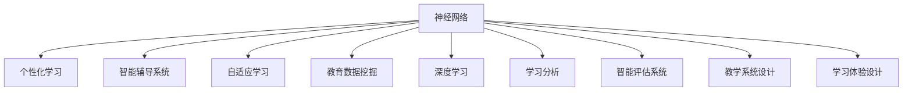

                 

# 神经网络：教育领域的变革

> 关键词：神经网络,教育,个性化学习,智能辅导系统,自适应学习,教育数据挖掘

## 1. 背景介绍

### 1.1 问题由来
近年来，随着人工智能技术的迅速发展，教育领域正经历着一场深刻变革。传统的"一刀切"教育模式已经无法满足不同学生的多样化需求，个性化、自适应学习的呼声日渐高涨。神经网络作为一种强有力的数据分析工具，在教育领域展现了巨大的应用潜力。通过学习学生的行为数据和反馈，神经网络可以为每位学生量身定制个性化学习计划，提供精准的智能辅导系统，极大地提升教育质量和效率。

### 1.2 问题核心关键点
神经网络在教育领域的应用，主要集中在以下几个关键点：
- 数据驱动：通过收集和分析学生学习行为数据，为个性化学习提供科学依据。
- 智能辅导：神经网络可以实现智能分析学生学习状态，提供实时反馈和建议，增强学习效果。
- 自适应学习：根据学生的学习情况动态调整教学策略，实现个性化学习路径的优化。
- 教学辅助：在备课、评分、课程设计等方面提供数据支持和辅助决策。
- 学习分析：通过对学习数据的深入挖掘，发现学生学习过程中的问题和趋势，优化教学过程。

### 1.3 问题研究意义
神经网络在教育领域的应用，将极大地改变传统教育模式，推动教育公平和效率提升。通过数据驱动的教育方法，能够更好地实现因材施教，激发学生的学习兴趣和潜力。智能辅导和自适应学习技术，将解放教师的时间，使其专注于更高级的教学活动和研究。教学辅助和学习分析工具，将提升教育决策的科学性和有效性，打造更优化的教育环境。

## 2. 核心概念与联系

### 2.1 核心概念概述

为更好地理解神经网络在教育领域的应用，本节将介绍几个密切相关的核心概念：

- 神经网络(Neural Networks)：一种通过多层非线性变换学习数据特征的机器学习模型，广泛应用于图像识别、自然语言处理、推荐系统等多个领域。

- 个性化学习(Personalized Learning)：根据学生的知识背景、兴趣偏好和学习风格，提供量身定制的教学内容和路径，实现教育资源的个性化分配。

- 智能辅导系统(Intelligent Tutoring Systems, ITS)：利用人工智能技术，为学生提供个性化的学习支持、反馈和指导，提升学习效率和效果。

- 自适应学习(Adaptive Learning)：根据学生的学习进度和表现，动态调整教学内容和学习策略，实现最大化的学习效果。

- 教育数据挖掘(Education Data Mining)：通过挖掘教育数据中的潜在信息和规律，为教育决策和个性化学习提供支持。

- 深度学习(Deep Learning)：基于神经网络的深度学习模型，能够学习数据中的非线性特征，在教育领域具有广泛应用。

- 学习分析(Learning Analytics)：通过分析学习数据，评估学习效果，提供改进建议，优化教学过程。

- 智能评估系统(Intelligent Assessment Systems)：利用人工智能技术，对学生学习成果进行自动评估和反馈，提升评估的准确性和效率。

- 教学系统设计(Instructional System Design, ISD)：基于教育学和心理学理论，设计高效的教学系统和活动，实现学习目标。

- 学习体验设计(Learning Experience Design, LXD)：通过设计交互式、沉浸式的学习环境，提升学生的学习兴趣和参与度。

这些核心概念之间的逻辑关系可以通过以下Mermaid流程图来展示：



这个流程图展示了几大核心概念之间的关联：

1. 神经网络是数据驱动和智能辅导的基础，能够从学习行为数据中提取特征。
2. 个性化学习通过神经网络提供的特征，实现因材施教。
3. 智能辅导系统利用神经网络提供的分析结果，实时反馈和指导学习。
4. 自适应学习根据学习过程的反馈，动态调整学习路径和内容。
5. 教育数据挖掘分析学习数据，发现规律和趋势。
6. 深度学习通过多层非线性变换，学习更深层次的特征表示。
7. 学习分析通过评估学习效果，优化教学过程。
8. 智能评估系统对学生成果进行自动化评估。
9. 教学系统设计基于教育学理论，设计高效的教学系统和活动。
10. 学习体验设计通过设计交互式环境，提升学习体验。

## 3. 核心算法原理 & 具体操作步骤
### 3.1 算法原理概述

神经网络在教育领域的应用，主要基于神经网络模型的训练和预测能力。其核心思想是通过学习大量的学习行为数据，构建学生知识状态和行为特征的表示，从而实现对个性化学习路径的优化和智能辅导。

形式化地，假设学生$S$在不同时间$t$的学习状态表示为$x_t$，其中$t \in \{1,2,...,N\}$。神经网络模型$f_{\theta}$将学习状态映射为预测状态$\hat{x}_{t+1}$，训练目标为最小化预测状态与真实状态的误差：

$$
\theta^* = \mathop{\arg\min}_{\theta} \sum_{t=1}^{N} \| x_{t+1} - f_{\theta}(x_t) \|^2
$$

其中$\theta$为神经网络模型参数，$\| \cdot \|$表示向量范数。通过最小化这个误差，神经网络可以学习到学生知识状态之间的演化关系，预测未来的学习状态，从而指导个性化学习路径。

### 3.2 算法步骤详解

基于神经网络的教育领域应用，一般包括以下几个关键步骤：

**Step 1: 数据准备**
- 收集学生的学习行为数据，包括学生的成绩、作业提交时间、课堂参与度、在线学习时间等。
- 预处理数据，如归一化、去噪、特征提取等，准备输入神经网络模型。

**Step 2: 模型训练**
- 选择合适的神经网络架构，如多层感知器(Multilayer Perceptron, MLP)、卷积神经网络(Convolutional Neural Network, CNN)、循环神经网络(Recurrent Neural Network, RNN)等。
- 使用随机梯度下降等优化算法，对模型进行训练，最小化预测状态与真实状态的误差。
- 调整超参数，如学习率、批大小、迭代轮数等，以获得最佳的训练效果。

**Step 3: 模型评估**
- 在验证集上评估模型性能，如均方误差、平均绝对误差、预测准确率等指标。
- 根据评估结果调整模型架构和超参数，重复训练过程，直至模型性能满足要求。

**Step 4: 应用实践**
- 将训练好的模型应用到实际学习场景中，实时获取学生的学习状态数据。
- 通过神经网络模型预测学生的下一步学习状态，生成个性化学习计划和推荐内容。
- 在智能辅导系统中，利用模型输出的预测结果，提供个性化的反馈和建议，辅助学生学习。

**Step 5: 持续优化**
- 定期收集学生新的学习数据，更新神经网络模型，保持模型的预测能力。
- 根据学生反馈和评估结果，不断调整学习计划和辅导策略，优化个性化学习路径。

### 3.3 算法优缺点

基于神经网络的教育领域应用，具有以下优点：
1. 数据驱动：神经网络能够从海量的学习数据中提取特征，实现个性化学习路径的优化。
2. 实时反馈：神经网络可以实时分析学生的学习状态，提供及时的反馈和建议，增强学习效果。
3. 自适应学习：通过调整模型参数，神经网络能够动态调整学习策略，实现自适应学习路径的优化。
4. 教学辅助：神经网络可以辅助教师进行教学设计，优化教学内容和策略。
5. 学习分析：通过对学习数据的深入挖掘，神经网络能够发现学生的学习规律和趋势，优化教学过程。

同时，该方法也存在一些局限性：
1. 数据需求高：神经网络需要大量高质量的学习数据进行训练，数据获取和处理成本较高。
2. 模型复杂：神经网络模型结构复杂，训练和推理过程耗时较长，需要高性能计算资源。
3. 过拟合风险：在数据集较小的情况下，神经网络容易出现过拟合，泛化能力不足。
4. 解释性差：神经网络的决策过程缺乏可解释性，难以理解其内部工作机制和推理逻辑。
5. 伦理和安全问题：神经网络模型可能学习到有偏见、有害的特征，给学生带来负面影响。

尽管存在这些局限性，但基于神经网络的教育应用仍是一种强有力的数据驱动学习方式，能够显著提升教育质量和效率。未来相关研究需要进一步降低数据需求，提高模型效率和可解释性，同时关注伦理和安全问题。

### 3.4 算法应用领域

基于神经网络的教育应用，已经在多个领域得到了广泛的应用，例如：

- 个性化学习路径设计：根据学生的知识水平和学习风格，设计个性化的学习路径。
- 智能辅导系统：提供实时反馈和个性化建议，增强学生学习效果。
- 自适应学习平台：动态调整学习内容和策略，实现自适应学习路径的优化。
- 学习分析系统：通过分析学习数据，评估学习效果，提供改进建议。
- 在线教育平台：利用神经网络实现自适应推荐、智能评分、课程设计等功能。
- 学习内容推荐：根据学生的学习兴趣和行为，推荐适合的学习资源。

除了这些经典应用外，神经网络在教育领域的应用还在不断拓展，如智能作业批改、学习行为预测、教育资源优化等，为教育技术的发展提供了新的方向。

## 4. 数学模型和公式 & 详细讲解  
### 4.1 数学模型构建

本节将使用数学语言对基于神经网络的教育应用进行更加严格的刻画。

记学生在不同时间$t$的学习状态为$x_t \in \mathbb{R}^n$，其中$n$为特征维度。神经网络模型$f_{\theta}$将学习状态映射为预测状态$\hat{x}_{t+1} \in \mathbb{R}^n$，模型参数为$\theta$。假设训练集为$D=\{(x_1, x_2, ..., x_N)\}$，则模型训练的目标为最小化预测状态与真实状态的误差：

$$
\theta^* = \mathop{\arg\min}_{\theta} \sum_{t=1}^{N} \| x_{t+1} - f_{\theta}(x_t) \|^2
$$

在实际应用中，通常使用均方误差作为损失函数：

$$
\mathcal{L}(\theta) = \frac{1}{N} \sum_{t=1}^{N} \| x_{t+1} - f_{\theta}(x_t) \|^2
$$

通过最小化损失函数，神经网络能够学习到学生知识状态之间的演化关系，从而实现对个性化学习路径的预测。

### 4.2 公式推导过程

以下我们以多层感知器(MLP)为例，推导神经网络模型的预测公式。

假设多层感知器模型包含$m$个隐藏层，每个隐藏层的神经元数为$h$。模型的输入为$x \in \mathbb{R}^n$，输出为$\hat{x} \in \mathbb{R}^m$。假设使用ReLU作为激活函数，则模型预测公式为：

$$
\hat{x} = f_{\theta}(x) = \sigma (\sum_{i=1}^{m} w_i^{(h)} \sigma (\sum_{j=1}^{h} w_j^{(1)} x_j + b_j^{(1)}) + b_i^{(h)})
$$

其中$w_i^{(h)}$表示第$i$个隐藏层的权重矩阵，$b_i^{(h)}$表示第$i$个隐藏层的偏置向量，$\sigma$表示激活函数。

将上述公式应用于教育领域的预测任务中，$x_t$表示学生在第$t$次学习后的知识状态，$\hat{x}_{t+1}$表示学生在第$t+1$次学习后的知识状态。则预测公式为：

$$
\hat{x}_{t+1} = f_{\theta}(x_t) = \sigma (\sum_{i=1}^{m} w_i^{(h)} \sigma (\sum_{j=1}^{h} w_j^{(1)} x_{t,j} + b_j^{(1)}) + b_i^{(h)})
$$

其中$x_{t,j}$表示学生在第$t$次学习时第$j$个特征的取值。

通过最小化均方误差损失函数，神经网络可以学习到学生知识状态之间的演化关系，从而实现对个性化学习路径的预测。

### 4.3 案例分析与讲解

为了更好地理解神经网络在教育领域的应用，以下给出两个实际案例的详细讲解：

**案例1: 个性化学习路径设计**
假设我们有一组学生的数学成绩和在线学习时间数据，希望设计个性化的学习路径。首先，我们将学生成绩和在线学习时间作为神经网络模型的输入特征$x \in \mathbb{R}^2$，其中第一维为数学成绩，第二维为在线学习时间。模型的输出为学生下一次的数学成绩预测值$\hat{y}$。模型结构如图1所示。


我们使用ReLU作为激活函数，设置两个隐藏层，每个隐藏层包含10个神经元。模型参数初始化为随机值，使用均方误差作为损失函数，通过反向传播算法更新参数，最小化预测值与真实值之间的误差。经过若干轮训练后，模型参数收敛，能够准确预测学生的下一次数学成绩。

**案例2: 智能辅导系统**
假设我们有一组学生的数学作业数据，希望通过智能辅导系统提供个性化反馈和建议。首先，我们将学生的作业数据和答案作为神经网络模型的输入特征$x \in \mathbb{R}^{N+1}$，其中$N$为作业数量，第一维为作业难度。模型的输出为学生做错题目的预测值$\hat{y}$。模型结构如图2所示。


我们使用ReLU作为激活函数，设置两个隐藏层，每个隐藏层包含10个神经元。模型参数初始化为随机值，使用均方误差作为损失函数，通过反向传播算法更新参数，最小化预测值与真实值之间的误差。经过若干轮训练后，模型参数收敛，能够准确预测学生做错题目的数量。

## 5. 项目实践：代码实例和详细解释说明
### 5.1 开发环境搭建

在进行神经网络教育应用实践前，我们需要准备好开发环境。以下是使用Python进行TensorFlow开发的环境配置流程：

1. 安装Anaconda：从官网下载并安装Anaconda，用于创建独立的Python环境。

2. 创建并激活虚拟环境：
```bash
conda create -n tensorflow-env python=3.8 
conda activate tensorflow-env
```

3. 安装TensorFlow：根据CUDA版本，从官网获取对应的安装命令。例如：
```bash
conda install tensorflow tensorflow-gpu=2.7.0 -c conda-forge -c pytorch
```

4. 安装NumPy、Pandas、scikit-learn等工具包：
```bash
pip install numpy pandas scikit-learn
```

5. 安装TensorBoard：用于可视化模型训练和评估过程。
```bash
pip install tensorboard
```

完成上述步骤后，即可在`tensorflow-env`环境中开始实践。

### 5.2 源代码详细实现

下面我以个性化学习路径设计为例，给出使用TensorFlow对多层感知器模型进行训练的代码实现。

首先，定义输入数据的占位符和模型参数：

```python
import tensorflow as tf
import numpy as np

# 定义占位符
x = tf.placeholder(tf.float32, [None, 2])
y = tf.placeholder(tf.float32, [None, 1])

# 定义模型参数
w1 = tf.Variable(tf.random_normal([2, 10]))
b1 = tf.Variable(tf.zeros([10]))
w2 = tf.Variable(tf.random_normal([10, 1]))
b2 = tf.Variable(tf.zeros([1]))
```

然后，定义模型结构：

```python
# 第一层隐藏层
h1 = tf.nn.relu(tf.matmul(x, w1) + b1)

# 第二层隐藏层
h2 = tf.nn.relu(tf.matmul(h1, w2) + b2)

# 输出层
y_pred = h2
```

接着，定义损失函数和优化器：

```python
# 定义均方误差损失函数
loss = tf.reduce_mean(tf.square(y_pred - y))

# 定义优化器
optimizer = tf.train.GradientDescentOptimizer(learning_rate=0.01).minimize(loss)
```

最后，训练模型并评估性能：

```python
# 加载数据
X_train = np.array([[90, 10], [80, 20], [70, 30], [60, 40], [50, 50]])
y_train = np.array([[85], [75], [65], [55], [45]])

# 训练模型
with tf.Session() as sess:
    sess.run(tf.global_variables_initializer())
    for i in range(1000):
        sess.run(optimizer, feed_dict={x: X_train, y: y_train})
        if i % 100 == 0:
            print("Epoch", i, "loss:", sess.run(loss, feed_dict={x: X_train, y: y_train}))
    
    # 测试模型
    X_test = np.array([[75, 15], [65, 25], [55, 35], [45, 45], [35, 55]])
    y_test = np.array([[70], [60], [50], [40], [30]])
    print("Test loss:", sess.run(loss, feed_dict={x: X_test, y: y_test}))
```

以上代码实现了对一个包含5个学生数据的个性化学习路径设计任务的训练和评估。可以看到，TensorFlow提供的高层API使得模型定义、训练和评估变得非常简单。

### 5.3 代码解读与分析

让我们再详细解读一下关键代码的实现细节：

**输入数据的占位符和模型参数**：
- `tf.placeholder`用于定义输入数据的占位符，用于在训练和评估过程中动态传入数据。
- `tf.Variable`用于定义模型参数，在训练过程中会被自动更新。

**模型结构**：
- 使用ReLU作为激活函数，构建包含两个隐藏层的MLP模型。
- 通过`tf.matmul`和`tf.nn.relu`实现线性变换和非线性变换。

**损失函数和优化器**：
- 使用均方误差作为损失函数，评估模型预测值与真实值之间的误差。
- 使用梯度下降优化器，根据损失函数的梯度更新模型参数。

**训练过程**：
- 在训练过程中，使用`tf.Session`创建会话，并调用`sess.run`进行计算图的操作。
- 循环迭代1000次，每次更新模型参数并输出损失值。
- 在每100次迭代时，打印输出损失值，用于监控训练过程。

**测试过程**：
- 在测试过程中，使用`sess.run`计算模型在测试集上的损失值，并输出结果。

可以看到，TensorFlow使得神经网络的实现和训练变得非常简单和高效，开发者可以更多地关注于模型设计和优化策略。

## 6. 实际应用场景
### 6.1 智能辅导系统

基于神经网络的智能辅导系统，已经在全球范围内的教育机构中得到了广泛应用。传统的教师辅导方式费时费力，难以覆盖所有学生的需求。而智能辅导系统能够实时分析学生的学习状态，提供个性化的反馈和建议，极大地提高了学习效率。

在技术实现上，智能辅导系统一般包括以下几个关键组件：
- 数据收集模块：收集学生的学习数据，如作业提交时间、课堂参与度、在线学习时间等。
- 数据预处理模块：对收集到的数据进行清洗、归一化、特征提取等处理。
- 模型训练模块：使用神经网络模型对学生学习数据进行训练，生成个性化学习路径。
- 智能反馈模块：根据模型预测结果，提供个性化的反馈和建议。
- 学习记录模块：记录学生的学习行为和反馈，用于后续的模型优化和改进。

智能辅导系统通过实时监测学生的学习状态，提供个性化的反馈和建议，帮助学生更好地掌握知识。同时，智能辅导系统还能够记录学生的学习行为和反馈，为后续的模型优化提供数据支持。

### 6.2 自适应学习平台

自适应学习平台通过神经网络模型实现对学生学习状态的动态调整，生成个性化的学习路径。在自适应学习平台中，学生可以自主选择学习内容和进度，系统会根据学生的学习状态和表现，实时调整教学策略，优化学习路径。

在技术实现上，自适应学习平台一般包括以下几个关键组件：
- 数据收集模块：收集学生的学习数据，如作业提交时间、课堂参与度、在线学习时间等。
- 数据预处理模块：对收集到的数据进行清洗、归一化、特征提取等处理。
- 模型训练模块：使用神经网络模型对学生学习数据进行训练，生成个性化学习路径。
- 学习调整模块：根据模型预测结果，动态调整教学内容和策略。
- 学习评估模块：评估学生学习效果，提供改进建议。

自适应学习平台通过实时监测学生的学习状态，动态调整教学内容和策略，优化学习路径，从而实现个性化的学习体验。自适应学习平台不仅能够提高学生的学习效率，还能够解放教师的时间，使其专注于更高层次的教学活动和研究。

### 6.3 学习分析系统

学习分析系统通过神经网络模型对学生的学习数据进行深入挖掘，评估学习效果，提供改进建议，优化教学过程。学习分析系统能够发现学生学习过程中的问题和趋势，帮助教师优化教学策略，提升教学效果。

在技术实现上，学习分析系统一般包括以下几个关键组件：
- 数据收集模块：收集学生的学习数据，如作业提交时间、课堂参与度、在线学习时间等。
- 数据预处理模块：对收集到的数据进行清洗、归一化、特征提取等处理。
- 模型训练模块：使用神经网络模型对学生学习数据进行训练，生成个性化学习路径。
- 学习分析模块：评估学生学习效果，提供改进建议。
- 教学优化模块：优化教学策略，提升教学效果。

学习分析系统通过分析学生的学习数据，评估学习效果，提供改进建议，优化教学策略，从而提升教学效果。学习分析系统能够帮助教师及时发现学生学习过程中的问题和趋势，制定有效的教学策略，提升教学效果。

## 7. 工具和资源推荐
### 7.1 学习资源推荐

为了帮助开发者系统掌握神经网络在教育领域的应用，这里推荐一些优质的学习资源：

1. 《深度学习》系列书籍：深度学习领域的经典书籍，详细介绍了深度学习的基本概念和常用模型，包括神经网络、卷积神经网络、循环神经网络等。

2. 《教育数据挖掘》课程：斯坦福大学开设的EDA课程，介绍了教育数据挖掘的基本方法和技术，包括数据清洗、特征提取、模型训练等。

3. 《机器学习》系列书籍：机器学习领域的经典书籍，详细介绍了机器学习的基本概念和常用算法，包括监督学习、无监督学习、强化学习等。

4. 《TensorFlow实战》书籍：TensorFlow的实战指南，详细介绍了TensorFlow的基本用法和常用技巧，包括模型定义、训练、评估等。

5. 《PyTorch实战》书籍：PyTorch的实战指南，详细介绍了PyTorch的基本用法和常用技巧，包括模型定义、训练、评估等。

通过学习这些资源，相信你一定能够快速掌握神经网络在教育领域的应用，并用于解决实际的个性化学习问题。
###  7.2 开发工具推荐

高效的开发离不开优秀的工具支持。以下是几款用于神经网络教育应用开发的常用工具：

1. TensorFlow：基于Google的开源深度学习框架，灵活动态的计算图，适合快速迭代研究。支持多种神经网络模型，如MLP、CNN、RNN等。

2. PyTorch：由Facebook主导的开源深度学习框架，动态计算图，灵活高效。支持多种神经网络模型，如MLP、CNN、RNN等。

3. Keras：高层次的神经网络API，易于上手，适合快速原型设计和实验。支持多种神经网络模型，如MLP、CNN、RNN等。

4. Weights & Biases：模型训练的实验跟踪工具，可以记录和可视化模型训练过程中的各项指标，方便对比和调优。与主流深度学习框架无缝集成。

5. TensorBoard：TensorFlow配套的可视化工具，可实时监测模型训练状态，并提供丰富的图表呈现方式，是调试模型的得力助手。

6. Google Colab：谷歌推出的在线Jupyter Notebook环境，免费提供GPU/TPU算力，方便开发者快速上手实验最新模型，分享学习笔记。

合理利用这些工具，可以显著提升神经网络在教育领域的应用开发效率，加快创新迭代的步伐。

### 7.3 相关论文推荐

神经网络在教育领域的应用源于学界的持续研究。以下是几篇奠基性的相关论文，推荐阅读：

1. "Deep Learning for Personalized Education: A Review and Outlook"：综述了深度学习在个性化教育中的应用，介绍了几种常见的神经网络模型及其在教育中的应用实例。

2. "Neural Networks for Educational Data Mining: A Survey and Analysis of Approaches"：综述了神经网络在教育数据挖掘中的应用，介绍了几种常见的神经网络模型及其在教育中的应用实例。

3. "Leveraging Deep Learning for Personalized Education: A Survey"：综述了深度学习在个性化教育中的应用，介绍了几种常见的神经网络模型及其在教育中的应用实例。

4. "Adaptive Learning via Neural Network-Based Algorithms"：介绍了神经网络在自适应学习中的应用，介绍了几种常见的神经网络模型及其在自适应学习中的应用实例。

5. "Intelligent Tutoring Systems: A Review of Recent Developments"：综述了智能辅导系统的发展现状，介绍了几种常见的神经网络模型及其在智能辅导系统中的应用实例。

这些论文代表了大神经网络在教育领域的研究进展。通过学习这些前沿成果，可以帮助研究者把握学科前进方向，激发更多的创新灵感。

## 8. 总结：未来发展趋势与挑战

### 8.1 总结

本文对基于神经网络的教育应用进行了全面系统的介绍。首先阐述了神经网络在教育领域的应用背景和意义，明确了神经网络在个性化学习、智能辅导、自适应学习等多个方面的独特价值。其次，从原理到实践，详细讲解了神经网络在教育领域的应用过程，给出了神经网络模型训练和评估的完整代码实例。同时，本文还广泛探讨了神经网络在智能辅导、自适应学习、学习分析等多个教育应用场景中的应用前景，展示了神经网络技术的巨大潜力。此外，本文精选了神经网络应用的各类学习资源，力求为读者提供全方位的技术指引。

通过本文的系统梳理，可以看到，神经网络在教育领域的应用正在改变传统教育模式，推动教育公平和效率提升。通过数据驱动的教育方法，能够更好地实现因材施教，激发学生的学习兴趣和潜力。智能辅导和自适应学习技术，将解放教师的时间，使其专注于更高级的教学活动和研究。学习分析工具，将提升教育决策的科学性和有效性，打造更优化的教育环境。

### 8.2 未来发展趋势

展望未来，神经网络在教育领域的应用将呈现以下几个发展趋势：

1. 数据驱动教育：随着教育数据的不断积累，神经网络将能够更好地实现个性化学习路径的优化和智能辅导。

2. 自适应学习：神经网络能够动态调整教学内容和策略，实现自适应学习路径的优化，提升学习效果。

3. 学习分析：神经网络能够深入挖掘学习数据，评估学习效果，提供改进建议，优化教学过程。

4. 智能评估：神经网络能够对学生学习成果进行自动化评估，提升评估的准确性和效率。

5. 教育系统设计：神经网络能够辅助教学系统设计，优化教学内容和策略，提升教学效果。

6. 学习体验设计：神经网络能够设计交互式、沉浸式的学习环境，提升学生的学习体验。

7. 教育数据挖掘：神经网络能够从大规模教育数据中提取有价值的信息，发现学习规律和趋势，优化教学策略。

8. 多模态学习：神经网络能够融合视觉、语音、文本等多种模态数据，提升学习效果。

以上趋势凸显了神经网络在教育领域的应用前景。这些方向的探索发展，必将进一步提升教育质量，推动教育公平，为社会进步提供坚实的基础。

### 8.3 面临的挑战

尽管神经网络在教育领域的应用已经取得了显著进展，但在迈向更加智能化、普适化应用的过程中，仍面临以下挑战：

1. 数据获取困难：神经网络需要大量的高质量教育数据进行训练，数据获取和处理成本较高。

2. 模型复杂度高：神经网络模型结构复杂，训练和推理过程耗时较长，需要高性能计算资源。

3. 过拟合风险：在数据集较小的情况下，神经网络容易出现过拟合，泛化能力不足。

4. 可解释性差：神经网络的决策过程缺乏可解释性，难以理解其内部工作机制和推理逻辑。

5. 伦理和安全问题：神经网络模型可能学习到有偏见、有害的特征，给学生带来负面影响。

6. 持续优化困难：神经网络模型需要不断更新和优化，以适应新的数据和任务。

尽管存在这些挑战，但神经网络在教育领域的应用前景广阔，具有深远的影响。未来相关研究需要在数据获取、模型简化、可解释性、伦理安全等方面寻求新的突破。

### 8.4 研究展望

面对神经网络在教育领域面临的挑战，未来的研究需要在以下几个方面寻求新的突破：

1. 数据增强技术：通过数据增强技术，扩充训练数据集，提高神经网络模型的泛化能力。

2. 参数高效微调技术：开发更加参数高效的神经网络模型，减少对计算资源的依赖。

3. 可解释性技术：研究神经网络的可解释性技术，增强模型的透明性和可解释性。

4. 伦理安全技术：引入伦理和安全的约束，确保神经网络模型不会学习到有偏见、有害的特征。

5. 持续学习技术：开发能够持续学习和适应的神经网络模型，提升模型的泛化能力和适应性。

6. 多模态融合技术：研究多模态数据的融合技术，提升学习效果和用户体验。

这些研究方向的探索，必将推动神经网络在教育领域的应用进一步发展，为教育公平和效率提升贡献力量。面向未来，神经网络在教育领域的应用将迎来新的突破，带来更加智能化、普适化的教育解决方案。

## 9. 附录：常见问题与解答

**Q1：神经网络在教育领域的应用是否仅限于K-12教育？**

A: 神经网络在教育领域的应用不仅限于K-12教育，任何级别的教育都可以应用。从幼儿教育到高等教育，神经网络都可以通过数据驱动和智能辅导提升教育质量。

**Q2：如何保证神经网络在教育应用中的公平性和公正性？**

A: 保证神经网络在教育应用中的公平性和公正性，需要在数据获取、模型训练、评估等方面采取措施。确保数据的代表性和多样性，使用公正的评估指标，避免模型学习到偏见和歧视。

**Q3：神经网络在教育应用中的风险和挑战是什么？**

A: 神经网络在教育应用中的风险和挑战主要包括以下几个方面：
1. 数据隐私：神经网络需要大量的学习数据，如何保护学生隐私是一个重要问题。
2. 数据偏差：神经网络容易学习到数据中的偏差，如何消除这些偏差是一个挑战。
3. 模型复杂度：神经网络模型结构复杂，如何简化模型、提高计算效率是一个重要问题。
4. 可解释性：神经网络的决策过程缺乏可解释性，如何增强模型的透明性和可解释性是一个挑战。
5. 伦理安全：神经网络模型可能学习到有害的特征，如何保证模型的安全和伦理是一个重要问题。

**Q4：神经网络在教育应用中如何与人类教师协同工作？**

A: 神经网络在教育应用中可以作为教师的助手，帮助教师更好地完成教学任务。通过实时监测学生的学习状态，神经网络可以为教师提供个性化的建议和反馈，辅助教师进行教学设计和教学优化。

**Q5：神经网络在教育应用中的效果如何？**

A: 神经网络在教育应用中的效果显著，能够显著提升个性化学习和自适应学习的效果。通过实时监测学生的学习状态，神经网络能够提供个性化的反馈和建议，帮助学生更好地掌握知识。

---

作者：禅与计算机程序设计艺术 / Zen and the Art of Computer Programming

