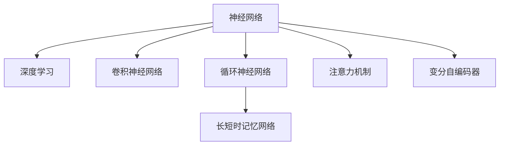

                 

## 1. 背景介绍

### 1.1 问题由来
近年来，随着深度学习技术的快速发展，自然语言处理(Natural Language Processing, NLP)领域取得了诸多突破性进展。然而，传统的NLP技术往往依赖于手工设计的特征提取器和规则库，难以应对语言的多样性和复杂性。神经网络，尤其是深度神经网络，凭借其强大的自学习能力和泛化能力，逐渐成为NLP研究的主流工具。

### 1.2 问题核心关键点
神经网络在NLP中的应用，使得NLP模型能够自动从数据中学习特征，避免了手工特征工程带来的繁琐和主观性。其中，基于循环神经网络(RNN)和长短时记忆网络(LSTM)等序列模型，已经在机器翻译、语音识别、文本生成等任务上取得了显著效果。但随着大规模预训练语言模型(Large Language Models, LLMs)的兴起，神经网络在NLP中的应用已经进入了一个新的阶段。

### 1.3 问题研究意义
研究神经网络在NLP中的应用，对拓展NLP技术的应用范围，提升模型性能，加速NLP技术的产业化进程，具有重要意义：

1. 降低应用开发成本。基于神经网络构建的模型，可以通过大量无标签数据进行预训练，减少对标注数据的依赖。
2. 提升模型效果。神经网络模型通过自动学习语言的通用表示，能够获得显著的性能提升。
3. 加速开发进度。standing on the shoulders of giants，神经网络模型可以更快地实现NLP任务适配，缩短开发周期。
4. 带来技术创新。神经网络技术的不断演进，催生了如注意力机制、Transformer等前沿研究方向，推动了NLP技术的进步。
5. 赋能产业升级。神经网络模型使得NLP技术更容易被各行各业所采用，为传统行业数字化转型升级提供新的技术路径。

## 2. 核心概念与联系

### 2.1 核心概念概述

为更好地理解神经网络在NLP中的应用，本节将介绍几个密切相关的核心概念：

- 神经网络(Neural Network)：由节点和连接构成的计算图，通过反向传播算法进行训练优化，能实现复杂非线性映射的机器学习模型。
- 深度学习(Deep Learning)：基于神经网络模型，具有多层结构，能够自动学习多层非线性特征表示，广泛应用于图像识别、语音识别、自然语言处理等领域。
- 卷积神经网络(CNN)：主要用于图像处理任务，通过卷积操作提取局部特征，具有平移不变性。
- 循环神经网络(RNN)：主要用于序列数据处理，能够记忆历史信息，适用于文本生成、机器翻译等任务。
- 长短时记忆网络(LSTM)：一种改进的RNN结构，解决了长期依赖问题，适用于文本分类、情感分析等任务。
- 注意力机制(Attention Mechanism)：一种机制，用于在序列中动态选择关键部分进行计算，提升模型的关注度和效率。
- 变分自编码器(VAE)：一种生成模型，通过学习数据分布，实现数据的压缩与生成，广泛应用于文本生成、语音合成等任务。

这些核心概念之间的逻辑关系可以通过以下Mermaid流程图来展示：



这个流程图展示了大语言模型中涉及的主要神经网络架构及其关联关系：

1. 神经网络是深度学习的基础，包含卷积神经网络、循环神经网络等多种结构。
2. 卷积神经网络主要用于图像处理，但也可以应用于文本处理。
3. 循环神经网络及其改进结构LSTM、GRU等，主要用于序列数据的处理。
4. 注意力机制是提升序列模型效果的重要机制，通过动态选择关键信息，实现对序列的局部关注。
5. 变分自编码器是一种生成模型，用于数据的压缩与生成，能够提高数据的可用性和多样性。

这些概念共同构成了神经网络在NLP中的基本架构和应用框架，使其能够在各种场景下发挥强大的数据处理和建模能力。通过理解这些核心概念，我们可以更好地把握神经网络在NLP中的工作原理和优化方向。

## 3. 核心算法原理 & 具体操作步骤
### 3.1 算法原理概述

神经网络在NLP中的应用，本质上是通过模型自动学习输入序列的表示，然后根据任务的特定需求进行输出预测。其核心思想是：将输入序列转化为一系列高维向量表示，通过多层神经网络模型进行映射，最终输出模型预测结果。

形式化地，假设输入序列为 $X=\{x_1, x_2, ..., x_n\}$，其中 $x_i$ 为第 $i$ 个时间步的输入特征。定义神经网络模型为 $M_{\theta}(X)$，其中 $\theta$ 为模型参数。任务的输出为 $Y$，可以是分类标签、概率分布等。

神经网络模型的优化目标是最大化任务损失函数 $\mathcal{L}(M_{\theta})$，通常使用交叉熵损失函数，具体形式为：

$$
\mathcal{L}(M_{\theta}) = -\sum_{i=1}^n \ell(y_i, \hat{y}_i) = -\sum_{i=1}^n y_i \log \hat{y}_i + (1-y_i) \log (1-\hat{y}_i)
$$

其中 $\ell(y_i, \hat{y}_i)$ 为交叉熵损失函数，$y_i$ 为真实标签，$\hat{y}_i$ 为模型预测输出。

通过反向传播算法，对模型参数 $\theta$ 进行优化，使得模型预测输出 $\hat{Y}$ 与真实标签 $Y$ 尽可能接近。具体步骤如下：

1. 将输入序列 $X$ 送入神经网络模型，计算预测输出 $\hat{Y}$。
2. 计算损失函数 $\mathcal{L}(M_{\theta})$，求取梯度 $\nabla_{\theta}\mathcal{L}(M_{\theta})$。
3. 使用梯度下降等优化算法更新模型参数 $\theta$，迭代优化。
4. 重复上述步骤，直至满足预设的迭代轮数或性能指标。

### 3.2 算法步骤详解

基于神经网络在NLP中的应用，本节详细讲解其关键步骤：

**Step 1: 模型选择和设计**
- 选择合适的神经网络结构，如RNN、LSTM、Transformer等，设计合适的模型层数和每层神经元数量。
- 确定模型输入输出层结构，如输入向量维度、输出向量维度等。

**Step 2: 模型初始化**
- 使用随机数初始化模型参数 $\theta$。
- 通常采用Xavier初始化，设定合适的均值和标准差。

**Step 3: 数据预处理**
- 将输入序列 $X$ 转换为模型所需的格式，如将文本转换为token序列。
- 对输入进行padding，使其长度一致。
- 对输出标签进行one-hot编码或独热编码。

**Step 4: 训练过程**
- 设置学习率 $\eta$、批大小 $N$、迭代轮数 $T$ 等训练超参数。
- 使用优化算法（如SGD、Adam等）进行梯度下降优化。
- 周期性在验证集上评估模型性能，防止过拟合。
- 迭代更新模型参数，直至满足预设的迭代轮数或性能指标。

**Step 5: 模型评估**
- 在测试集上评估模型性能，对比模型在训练集上的表现。
- 计算准确率、精确率、召回率、F1值等指标，综合评估模型效果。

### 3.3 算法优缺点

基于神经网络在NLP中的应用方法，具有以下优点：
1. 自适应能力强。神经网络可以自动学习数据的特征表示，减少对特征工程的依赖。
2. 泛化能力好。神经网络具有较强的泛化能力，能够适应不同规模和分布的数据。
3. 灵活性高。神经网络结构可灵活设计，适用于多种NLP任务。
4. 可解释性差。神经网络模型通常是"黑盒"系统，难以解释其内部工作机制。
5. 训练成本高。神经网络模型需要大量数据和计算资源进行训练。
6. 鲁棒性不足。神经网络模型易受输入噪声影响，稳定性有待提高。

尽管存在这些局限性，但就目前而言，基于神经网络的NLP方法仍是大规模预训练语言模型应用的主流范式。未来相关研究的重点在于如何进一步降低训练成本，提高模型泛化能力和鲁棒性，同时兼顾模型的可解释性和高效性等因素。

### 3.4 算法应用领域

基于神经网络的NLP方法，已经广泛应用于以下领域：

- 文本分类：如情感分析、主题分类、意图识别等。通过神经网络模型学习文本-标签映射。
- 命名实体识别：识别文本中的人名、地名、机构名等特定实体。通过神经网络模型掌握实体边界和类型。
- 关系抽取：从文本中抽取实体之间的语义关系。通过神经网络模型学习实体-关系三元组。
- 问答系统：对自然语言问题给出答案。将问题-答案对作为训练样本，训练神经网络模型进行匹配。
- 机器翻译：将源语言文本翻译成目标语言。通过神经网络模型学习语言-语言映射。
- 文本摘要：将长文本压缩成简短摘要。通过神经网络模型学习抓取要点。
- 对话系统：使机器能够与人自然对话。通过神经网络模型进行回复生成。

除了上述这些经典任务外，神经网络技术还被创新性地应用到更多场景中，如可控文本生成、常识推理、代码生成、数据增强等，为NLP技术带来了全新的突破。随着神经网络技术的不断演进，NLP技术将在更广阔的应用领域大放异彩。

## 4. 数学模型和公式 & 详细讲解  
### 4.1 数学模型构建

本节将使用数学语言对神经网络在NLP中的应用进行更加严格的刻画。

记输入序列为 $X=\{x_1, x_2, ..., x_n\}$，其中 $x_i$ 为第 $i$ 个时间步的输入特征。定义神经网络模型为 $M_{\theta}(X)$，其中 $\theta$ 为模型参数。任务的输出为 $Y$，可以是分类标签、概率分布等。

定义模型 $M_{\theta}$ 在输入序列 $X$ 上的损失函数为 $\mathcal{L}(M_{\theta}, X)$，通常在交叉熵损失函数的形式下计算：

$$
\mathcal{L}(M_{\theta}, X) = -\sum_{i=1}^n \ell(y_i, \hat{y}_i) = -\sum_{i=1}^n y_i \log \hat{y}_i + (1-y_i) \log (1-\hat{y}_i)
$$

其中 $\ell(y_i, \hat{y}_i)$ 为交叉熵损失函数，$y_i$ 为真实标签，$\hat{y}_i$ 为模型预测输出。

神经网络模型的优化目标是最大化任务损失函数 $\mathcal{L}(M_{\theta})$，通过梯度下降算法进行优化。具体形式为：

$$
\theta \leftarrow \theta - \eta \nabla_{\theta}\mathcal{L}(M_{\theta})
$$

其中 $\eta$ 为学习率，$\nabla_{\theta}\mathcal{L}(M_{\theta})$ 为损失函数对模型参数 $\theta$ 的梯度，可通过反向传播算法高效计算。

### 4.2 公式推导过程

以下我们以文本分类任务为例，推导交叉熵损失函数及其梯度的计算公式。

假设模型 $M_{\theta}$ 在输入 $x$ 上的输出为 $\hat{y}=M_{\theta}(x) \in [0,1]$，表示样本属于正类的概率。真实标签 $y \in \{0,1\}$。则二分类交叉熵损失函数定义为：

$$
\ell(M_{\theta}(x),y) = -[y\log \hat{y} + (1-y)\log (1-\hat{y})]
$$

将其代入损失函数公式，得：

$$
\mathcal{L}(\theta) = -\frac{1}{N}\sum_{i=1}^N [y_i\log M_{\theta}(x_i)+(1-y_i)\log(1-M_{\theta}(x_i))]
$$

根据链式法则，损失函数对参数 $\theta_k$ 的梯度为：

$$
\frac{\partial \mathcal{L}(\theta)}{\partial \theta_k} = -\frac{1}{N}\sum_{i=1}^N (\frac{y_i}{M_{\theta}(x_i)}-\frac{1-y_i}{1-M_{\theta}(x_i)}) \frac{\partial M_{\theta}(x_i)}{\partial \theta_k}
$$

其中 $\frac{\partial M_{\theta}(x_i)}{\partial \theta_k}$ 可进一步递归展开，利用自动微分技术完成计算。

在得到损失函数的梯度后，即可带入梯度下降公式，完成模型的迭代优化。重复上述过程直至收敛，最终得到适应下游任务的最优模型参数 $\theta^*$。

## 5. 项目实践：代码实例和详细解释说明
### 5.1 开发环境搭建

在进行神经网络在NLP中的实践前，我们需要准备好开发环境。以下是使用Python进行TensorFlow开发的环境配置流程：

1. 安装Anaconda：从官网下载并安装Anaconda，用于创建独立的Python环境。

2. 创建并激活虚拟环境：
```bash
conda create -n tf-env python=3.8 
conda activate tf-env
```

3. 安装TensorFlow：根据CUDA版本，从官网获取对应的安装命令。例如：
```bash
pip install tensorflow
```

4. 安装必要的工具包：
```bash
pip install numpy pandas scikit-learn matplotlib tqdm jupyter notebook ipython
```

完成上述步骤后，即可在`tf-env`环境中开始神经网络在NLP中的应用实践。

### 5.2 源代码详细实现

这里我们以文本分类任务为例，给出使用TensorFlow构建神经网络模型的PyTorch代码实现。

首先，定义模型架构：

```python
import tensorflow as tf
from tensorflow.keras import layers

class TextClassifier(tf.keras.Model):
    def __init__(self, num_classes):
        super(TextClassifier, self).__init__()
        self.embedding = layers.Embedding(input_dim=vocab_size, output_dim=embedding_dim)
        self.lstm = layers.LSTM(units=128, return_sequences=True)
        self.dense = layers.Dense(units=num_classes, activation='softmax')
        
    def call(self, inputs, training=False):
        x = self.embedding(inputs)
        x = self.lstm(x)
        return self.dense(x)
```

然后，定义训练和评估函数：

```python
import tensorflow as tf
from tensorflow.keras import optimizers

vocab_size = 10000
embedding_dim = 128
num_classes = 3
max_length = 100
batch_size = 32
learning_rate = 0.001

device = tf.device('/cpu:0') if tf.test.is_gpu_available() else tf.device('/cpu:0')

def train_model(model, dataset, num_epochs, batch_size):
    model.compile(optimizer=optimizers.Adam(learning_rate=learning_rate),
                  loss=tf.keras.losses.SparseCategoricalCrossentropy(from_logits=True),
                  metrics=['accuracy'])
    
    model.fit(dataset, epochs=num_epochs, batch_size=batch_size, verbose=2)
    
def evaluate_model(model, dataset, batch_size):
    model.evaluate(dataset, batch_size=batch_size, verbose=2)
    
dataset = tf.data.Dataset.from_tensor_slices((input_texts, labels))
dataset = dataset.batch(batch_size)
dataset = dataset.prefetch(buffer_size=1)
```

最后，启动训练流程并在测试集上评估：

```python
num_epochs = 10

train_model(model, dataset, num_epochs, batch_size)
evaluate_model(model, dataset, batch_size)
```

以上就是使用TensorFlow对神经网络在文本分类任务上进行训练的完整代码实现。可以看到，得益于TensorFlow的强大封装，我们可以用相对简洁的代码完成神经网络模型的构建和训练。

### 5.3 代码解读与分析

让我们再详细解读一下关键代码的实现细节：

**TextClassifier类**：
- `__init__`方法：初始化模型参数，包括嵌入层、LSTM层和全连接层等。
- `call`方法：定义模型前向传播的计算过程，输入文本经过嵌入、LSTM、全连接层后输出分类结果。

**模型训练函数train_model**：
- 使用Adam优化器进行梯度下降优化，损失函数为交叉熵损失，输出为分类准确率。
- 在训练集上迭代训练，并在每个epoch结束时打印训练损失和准确率。
- 在验证集上评估模型性能，防止过拟合。

**模型评估函数evaluate_model**：
- 在测试集上评估模型性能，输出模型损失和准确率。

**数据准备**：
- 通过`tf.data.Dataset`将输入文本和标签转换成TensorFlow的张量格式。
- 对数据进行批处理和预取操作，加快训练和评估的速度。

可以看到，TensorFlow使得神经网络在NLP中的代码实现变得简洁高效。开发者可以将更多精力放在数据处理、模型改进等高层逻辑上，而不必过多关注底层的实现细节。

当然，工业级的系统实现还需考虑更多因素，如模型的保存和部署、超参数的自动搜索、更灵活的任务适配层等。但核心的神经网络在NLP中的应用方法基本与此类似。

## 6. 实际应用场景
### 6.1 智能客服系统

基于神经网络在NLP中的应用，智能客服系统可以构建高效率、高准确率的对话交互体验。传统客服往往需要配备大量人力，高峰期响应缓慢，且一致性和专业性难以保证。而使用神经网络在NLP中构建的对话模型，可以7x24小时不间断服务，快速响应客户咨询，用自然流畅的语言解答各类常见问题。

在技术实现上，可以收集企业内部的历史客服对话记录，将问题和最佳答复构建成监督数据，在此基础上对神经网络模型进行训练。训练后的模型能够自动理解用户意图，匹配最合适的答案模板进行回复。对于客户提出的新问题，还可以接入检索系统实时搜索相关内容，动态组织生成回答。如此构建的智能客服系统，能大幅提升客户咨询体验和问题解决效率。

### 6.2 金融舆情监测

金融机构需要实时监测市场舆论动向，以便及时应对负面信息传播，规避金融风险。传统的人工监测方式成本高、效率低，难以应对网络时代海量信息爆发的挑战。基于神经网络在NLP中的应用，文本分类和情感分析技术，为金融舆情监测提供了新的解决方案。

具体而言，可以收集金融领域相关的新闻、报道、评论等文本数据，并对其进行主题标注和情感标注。在此基础上对神经网络模型进行训练，使其能够自动判断文本属于何种主题，情感倾向是正面、中性还是负面。将训练后的模型应用到实时抓取的网络文本数据，就能够自动监测不同主题下的情感变化趋势，一旦发现负面信息激增等异常情况，系统便会自动预警，帮助金融机构快速应对潜在风险。

### 6.3 个性化推荐系统

当前的推荐系统往往只依赖用户的历史行为数据进行物品推荐，无法深入理解用户的真实兴趣偏好。基于神经网络在NLP中的应用，个性化推荐系统可以更好地挖掘用户行为背后的语义信息，从而提供更精准、多样的推荐内容。

在实践中，可以收集用户浏览、点击、评论、分享等行为数据，提取和用户交互的物品标题、描述、标签等文本内容。将文本内容作为模型输入，用户的后续行为（如是否点击、购买等）作为监督信号，在此基础上训练神经网络模型。训练后的模型能够从文本内容中准确把握用户的兴趣点。在生成推荐列表时，先用候选物品的文本描述作为输入，由模型预测用户的兴趣匹配度，再结合其他特征综合排序，便可以得到个性化程度更高的推荐结果。

### 6.4 未来应用展望

随着神经网络在NLP中的应用不断发展，基于神经网络的NLP技术将呈现以下几个发展趋势：

1. 模型规模持续增大。随着算力成本的下降和数据规模的扩张，神经网络模型参数量还将持续增长。超大规模神经网络蕴含的丰富语言知识，有望支撑更加复杂多变的下游任务。
2. 模型泛化能力增强。神经网络模型通过自动学习语言的通用表示，能够获得更好的泛化能力，适应更多领域和任务。
3. 模型效率提升。神经网络模型的计算图优化、参数剪枝、混合精度训练等技术，能够显著提升模型推理效率。
4. 模型可解释性增强。神经网络模型的可视化、解释器等技术，能够增强模型的可解释性，提升用户信任度。
5. 多模态融合。神经网络模型能够融合视觉、语音、文本等多种模态数据，提升多模态场景下的理解和推理能力。

以上趋势凸显了神经网络在NLP中的应用前景。这些方向的探索发展，必将进一步提升NLP系统的性能和应用范围，为人类认知智能的进化带来深远影响。

## 7. 工具和资源推荐
### 7.1 学习资源推荐

为了帮助开发者系统掌握神经网络在NLP中的应用，这里推荐一些优质的学习资源：

1. Deep Learning Specialization系列课程：由斯坦福大学Andrew Ng教授主讲的深度学习系列课程，系统讲解深度学习的基本原理和NLP任务的应用。
2. CS231n《卷积神经网络》课程：斯坦福大学计算机视觉课程，深入讲解卷积神经网络的结构和应用。
3. TextBlob：Python的自然语言处理库，提供了多种文本处理功能，如情感分析、词性标注等。
4. Keras：高层次的深度学习框架，提供了丰富的神经网络组件和接口，适用于快速开发NLP应用。
5. PyTorch：灵活的深度学习框架，支持动态计算图和模型部署，适用于研究和原型开发。
6. TensorFlow：生产级的深度学习框架，支持分布式训练和模型部署，适用于大规模工程应用。

通过对这些资源的学习实践，相信你一定能够快速掌握神经网络在NLP中的工作原理和优化方向。

### 7.2 开发工具推荐

高效的开发离不开优秀的工具支持。以下是几款用于神经网络在NLP中应用的常用工具：

1. PyTorch：基于Python的开源深度学习框架，灵活的计算图机制，支持动态模型定义，适合快速迭代研究。
2. TensorFlow：由Google主导开发的深度学习框架，分布式计算能力强大，支持生产级应用。
3. Keras：高层次的深度学习框架，提供简单易用的API，方便模型构建和调试。
4. TensorFlow Hub：提供预训练的深度学习模型和组件，支持模块化开发。
5. Weights & Biases：模型训练的实验跟踪工具，记录和可视化模型训练过程中的各项指标，方便对比和调优。
6. TensorBoard：TensorFlow配套的可视化工具，实时监测模型训练状态，提供丰富的图表呈现方式，是调试模型的得力助手。

合理利用这些工具，可以显著提升神经网络在NLP中的应用开发效率，加快创新迭代的步伐。

### 7.3 相关论文推荐

神经网络在NLP中的应用源于学界的持续研究。以下是几篇奠基性的相关论文，推荐阅读：

1. Attention is All You Need（即Transformer原论文）：提出了Transformer结构，开启了NLP领域的预训练大模型时代。
2. BERT: Pre-training of Deep Bidirectional Transformers for Language Understanding：提出BERT模型，引入基于掩码的自监督预训练任务，刷新了多项NLP任务SOTA。
3. Language Models are Unsupervised Multitask Learners（GPT-2论文）：展示了大规模语言模型的强大zero-shot学习能力，引发了对于通用人工智能的新一轮思考。
4. Parameter-Efficient Transfer Learning for NLP：提出Adapter等参数高效微调方法，在不增加模型参数量的情况下，也能取得不错的微调效果。
5. Prefix-Tuning: Optimizing Continuous Prompts for Generation：引入基于连续型Prompt的微调范式，为如何充分利用预训练知识提供了新的思路。

这些论文代表了大语言模型在NLP中的应用发展脉络。通过学习这些前沿成果，可以帮助研究者把握学科前进方向，激发更多的创新灵感。

## 8. 总结：未来发展趋势与挑战

### 8.1 总结

本文对神经网络在NLP中的应用进行了全面系统的介绍。首先阐述了神经网络在NLP中的应用背景和意义，明确了神经网络在处理序列数据、学习语言表示等方面的独特优势。其次，从原理到实践，详细讲解了神经网络在NLP中的数学模型构建、训练优化和评估方法，给出了神经网络在NLP中的应用代码实例。同时，本文还广泛探讨了神经网络在智能客服、金融舆情、个性化推荐等多个行业领域的应用前景，展示了神经网络在NLP中的广泛应用潜力。

通过本文的系统梳理，可以看到，基于神经网络的NLP技术正在成为NLP领域的重要范式，极大地拓展了神经网络在处理自然语言数据的能力，为各类NLP任务带来了显著的性能提升。神经网络通过自动学习语言表示，能够在不同规模和分布的数据上取得较好的泛化能力，适应各种复杂的NLP任务。

### 8.2 未来发展趋势

展望未来，神经网络在NLP中的应用将呈现以下几个发展趋势：

1. 模型规模持续增大。随着算力成本的下降和数据规模的扩张，神经网络模型参数量还将持续增长。超大规模神经网络蕴含的丰富语言知识，有望支撑更加复杂多变的下游任务。
2. 模型泛化能力增强。神经网络模型通过自动学习语言的通用表示，能够获得更好的泛化能力，适应更多领域和任务。
3. 模型效率提升。神经网络模型的计算图优化、参数剪枝、混合精度训练等技术，能够显著提升模型推理效率。
4. 模型可解释性增强。神经网络模型的可视化、解释器等技术，能够增强模型的可解释性，提升用户信任度。
5. 多模态融合。神经网络模型能够融合视觉、语音、文本等多种模态数据，提升多模态场景下的理解和推理能力。

以上趋势凸显了神经网络在NLP中的应用前景。这些方向的探索发展，必将进一步提升NLP系统的性能和应用范围，为人类认知智能的进化带来深远影响。

### 8.3 面临的挑战

尽管神经网络在NLP中的应用已经取得了诸多进展，但在迈向更加智能化、普适化应用的过程中，它仍面临着诸多挑战：

1. 训练成本高昂。神经网络模型需要大量数据和计算资源进行训练，大规模模型的训练成本尤为显著。如何优化训练过程，提高训练效率，降低训练成本，将是一大难题。
2. 可解释性不足。神经网络模型通常是"黑盒"系统，难以解释其内部工作机制和决策逻辑。对于医疗、金融等高风险应用，算法的可解释性和可审计性尤为重要。如何赋予神经网络模型更强的可解释性，将是亟待攻克的难题。
3. 鲁棒性有待提高。神经网络模型易受输入噪声影响，稳定性有待提高。如何在保持模型泛化能力的同时，增强其鲁棒性，防止过拟合和模型崩溃，仍需更多理论和实践的积累。
4. 模型偏见和伦理问题。神经网络模型可能学习到有偏见、有害的信息，通过微调传递到下游任务，产生误导性、歧视性的输出，给实际应用带来安全隐患。如何从数据和算法层面消除模型偏见，避免恶意用途，确保输出符合人类价值观和伦理道德，也将是重要的研究课题。

正视神经网络在NLP中应用面临的这些挑战，积极应对并寻求突破，将是大语言模型在NLP中应用走向成熟的必由之路。相信随着学界和产业界的共同努力，这些挑战终将一一被克服，神经网络在NLP中的应用必将在构建人机协同的智能时代中扮演越来越重要的角色。

### 8.4 研究展望

面对神经网络在NLP中应用所面临的种种挑战，未来的研究需要在以下几个方面寻求新的突破：

1. 探索无监督和半监督学习范式。摆脱对大规模标注数据的依赖，利用自监督学习、主动学习等无监督和半监督范式，最大限度利用非结构化数据，实现更加灵活高效的神经网络应用。
2. 研究参数高效和计算高效的神经网络范式。开发更加参数高效的神经网络方法，在固定大部分神经网络参数的情况下，只更新极少量的任务相关参数。同时优化神经网络模型的计算图，减少前向传播和反向传播的资源消耗，实现更加轻量级、实时性的部署。
3. 融合因果推断和强化学习思想。通过引入因果推断和强化学习方法，增强神经网络模型建立稳定因果关系的能力，学习更加普适、鲁棒的语言表征，从而提升模型泛化性和抗干扰能力。
4. 引入更多先验知识。将符号化的先验知识，如知识图谱、逻辑规则等，与神经网络模型进行巧妙融合，引导神经网络模型学习更准确、合理的语言模型。同时加强不同模态数据的整合，实现视觉、语音等多模态信息与文本信息的协同建模。
5. 结合因果分析和博弈论工具。将因果分析方法引入神经网络模型，识别出模型决策的关键特征，增强输出解释的因果性和逻辑性。借助博弈论工具刻画人机交互过程，主动探索并规避模型的脆弱点，提高系统稳定性。
6. 纳入伦理道德约束。在神经网络训练目标中引入伦理导向的评估指标，过滤和惩罚有偏见、有害的输出倾向。同时加强人工干预和审核，建立神经网络行为的监管机制，确保输出符合人类价值观和伦理道德。

这些研究方向的探索，必将引领神经网络在NLP中应用的发展方向，为构建安全、可靠、可解释、可控的智能系统铺平道路。面向未来，神经网络在NLP中的应用需要与其他人工智能技术进行更深入的融合，如知识表示、因果推理、强化学习等，多路径协同发力，共同推动自然语言理解和智能交互系统的进步。只有勇于创新、敢于突破，才能不断拓展神经网络在NLP中的边界，让智能技术更好地造福人类社会。

## 9. 附录：常见问题与解答

**Q1：神经网络在NLP中的应用是否适用于所有NLP任务？**

A: 神经网络在NLP中的应用，在大多数NLP任务上都能取得不错的效果，特别是对于数据量较大的任务。但对于一些特定领域的任务，如医学、法律等，仅仅依靠通用语料预训练的模型可能难以很好地适应。此时需要在特定领域语料上进一步预训练，再进行微调，才能获得理想效果。此外，对于一些需要时效性、个性化很强的任务，如对话、推荐等，神经网络方法也需要针对性的改进优化。

**Q2：神经网络在NLP中的训练成本是否较高？**

A: 神经网络在NLP中的训练成本确实较高，主要体现在数据获取、数据标注、计算资源等方面。但随着预训练语言模型和大规模数据集的出现，神经网络在NLP中的应用已经成为可能。未来，通过分布式训练、混合精度训练等技术，有望进一步降低训练成本，提升训练效率。

**Q3：神经网络在NLP中的鲁棒性如何？**

A: 神经网络在NLP中的鲁棒性不足，易受输入噪声影响，模型泛化能力受限。为了提高模型的鲁棒性，通常需要引入正则化技术、数据增强、对抗训练等方法，减少输入噪声对模型的影响。同时，通过模型剪枝、模型压缩等技术，也可以提升模型的鲁棒性和可解释性。

**Q4：神经网络在NLP中的可解释性如何？**

A: 神经网络在NLP中的可解释性较弱，通常被视为"黑盒"系统。为了增强模型的可解释性，可以引入模型可视化、解释器等技术，对模型的决策过程进行解释和分析。同时，可以通过特征选择、特征归因等方法，帮助用户理解模型预测的结果。

**Q5：神经网络在NLP中的应用是否存在偏见和伦理问题？**

A: 神经网络在NLP中的应用，可能会学习到有偏见、有害的信息，通过微调传递到下游任务，产生误导性、歧视性的输出。因此，需要在模型训练过程中引入伦理导向的评估指标，过滤和惩罚有偏见、有害的输出倾向。同时加强人工干预和审核，建立模型行为的监管机制，确保输出符合人类价值观和伦理道德。

这些问题的解答，帮助我们更好地理解神经网络在NLP中的应用现状和未来发展方向，为进一步研究提供方向指引。

---

作者：禅与计算机程序设计艺术 / Zen and the Art of Computer Programming

