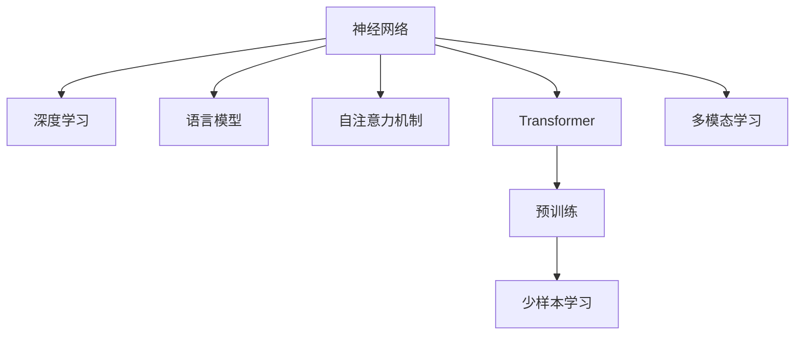

                 

# 神经网络：自然语言处理的新突破

> 关键词：神经网络,自然语言处理(NLP),深度学习,语言模型,Transformer,BERT,预训练,下游任务,少样本学习,多模态学习

## 1. 背景介绍

### 1.1 问题由来
自然语言处理(Natural Language Processing, NLP)作为人工智能的重要分支，一直面临着处理自然语言的复杂性和多样性问题。传统的基于规则和统计的方法无法完全解决语言理解、生成和推理的难题。神经网络（Neural Networks, NN）的提出，为NLP带来了新的思路和解决方案。

近年来，深度学习特别是卷积神经网络（Convolutional Neural Networks, CNN）和循环神经网络（Recurrent Neural Networks, RNN）在NLP领域取得了显著进展。以循环神经网络为例，它能够处理序列数据，并在机器翻译、语音识别等任务中表现优异。然而，由于序列长度的限制，传统的RNN在处理长文本时面临训练时间过长、梯度消失或爆炸等问题。

神经网络在大规模语言模型和自然语言生成（Natural Language Generation, NLG）任务中，通过Transformer结构和自注意力机制（Self-Attention Mechanism）的引入，显著提升了处理长文本的能力，开启了NLP领域的新突破。

### 1.2 问题核心关键点
神经网络在自然语言处理中的核心关键点包括：

- 神经网络结构：主要包括全连接神经网络、卷积神经网络、循环神经网络和Transformer等。
- 自注意力机制：用于处理序列数据中的复杂依赖关系，提升模型对长文本的理解和生成能力。
- 预训练技术：通过大规模无标签文本数据进行预训练，学习语言的基本表示，提升模型的泛化能力。
- 少样本学习：在有限的标注样本下，仍能对下游任务进行有效微调，提升模型性能。
- 多模态学习：融合视觉、音频等多模态信息，提升对现实世界的理解和建模能力。

这些关键点共同构成了神经网络在NLP领域的核心框架，为其在多任务处理和实际应用中提供了强有力的支持。

### 1.3 问题研究意义
神经网络在NLP领域的研究与应用，对于提升语言模型的理解能力和生成能力，推动NLP技术的产业化进程，具有重要意义：

1. 处理复杂语言：神经网络能够处理长文本和复杂句法结构，提升语言模型的理解力和生成力。
2. 提高处理效率：相比于传统方法，神经网络模型可以并行计算，大幅提高处理速度。
3. 泛化能力强：通过大规模预训练，神经网络模型具备较强的泛化能力，能够在不同场景下表现稳定。
4. 促进应用落地：神经网络模型在自然语言理解、机器翻译、情感分析、问答系统等多个NLP任务中取得显著成果，推动了NLP技术的实际应用。
5. 技术创新：神经网络模型的设计和使用，催生了许多新的研究方向和应用场景，如少样本学习、多模态学习等。

## 2. 核心概念与联系

### 2.1 核心概念概述

为更好地理解神经网络在NLP中的应用，本节将介绍几个密切相关的核心概念：

- 神经网络（Neural Network, NN）：由大量节点（神经元）和边（权重）组成的网络结构，用于处理和分析数据。
- 深度学习（Deep Learning, DL）：基于多层神经网络进行复杂模型训练和预测的技术。
- 语言模型（Language Model）：用于预测文本序列中下一个单词或字符的概率模型，是NLP中的基础任务。
- 自注意力机制（Self-Attention Mechanism）：一种机制，用于模型内部对序列中各个元素之间的依赖关系进行建模，提升模型对长序列的处理能力。
- Transformer：一种基于自注意力机制的神经网络架构，广泛应用于机器翻译、文本生成等NLP任务中。
- 预训练（Pre-training）：指在大规模无标签文本数据上，通过自监督学习任务训练通用语言模型的过程。
- 少样本学习（Few-shot Learning）：指在有限的标注样本下，模型仍能对下游任务进行有效微调，提升性能。
- 多模态学习（Multi-modal Learning）：指融合视觉、音频等多模态信息，提升对现实世界的理解和建模能力。

这些核心概念之间的逻辑关系可以通过以下Mermaid流程图来展示：



这个流程图展示了神经网络在NLP中的各个核心概念及其关系：

1. 神经网络通过深度学习训练复杂模型，用于处理和分析数据。
2. 语言模型是神经网络处理文本序列的基础任务。
3. 自注意力机制用于提升模型对序列中各个元素之间的依赖关系，增强模型处理能力。
4. Transformer架构基于自注意力机制，广泛应用于机器翻译、文本生成等任务。
5. 预训练通过大规模无标签文本数据，提升模型的泛化能力和表达能力。
6. 少样本学习在有限标注数据下提升模型性能。
7. 多模态学习融合多种信息源，提升模型对现实世界的理解能力。

这些概念共同构成了神经网络在NLP中的核心框架，使其能够在各种场景下发挥强大的语言理解和生成能力。

## 3. 核心算法原理 & 具体操作步骤

### 3.1 算法原理概述

神经网络在NLP中的应用，本质上是将自然语言视为一种序列数据，通过多层神经网络进行学习和建模。常用的神经网络架构包括全连接神经网络、卷积神经网络（CNN）、循环神经网络（RNN）和Transformer等。这里以Transformer架构为例，详细介绍其核心原理和操作步骤。

Transformer模型由编码器（Encoder）和解码器（Decoder）两部分组成，其中编码器用于处理输入序列，解码器用于生成输出序列。编码器由多层自注意力层（Self-Attention Layer）和前馈神经网络层（Feedforward Network Layer）交替组成。解码器也由类似结构组成，但最后一层为输出层，直接预测下一个单词或字符。

Transformer模型通过自注意力机制，在每个位置上计算其他位置的表示，从而捕捉序列中各个元素之间的依赖关系。这一机制极大提升了模型对长序列的处理能力，使其能够处理大规模语言模型。

### 3.2 算法步骤详解

Transformer模型的训练过程包括预训练和微调两个阶段。以下详细介绍这一过程：

#### 3.2.1 预训练

预训练阶段通常在大规模无标签文本数据上进行，目的是学习语言的通用表示。具体步骤如下：

1. **数据准备**：收集大规模无标签文本数据，划分为训练集和验证集。
2. **模型初始化**：选择Transformer模型架构，进行参数初始化。
3. **自监督学习**：设计自监督学习任务，如掩码语言模型（Masked Language Model, MLM）、下一句预测（Next Sentence Prediction, NSP）等，对模型进行训练。
4. **优化器选择**：选择优化器（如AdamW）及其超参数，进行模型优化。
5. **参数更新**：根据优化器更新模型参数，最小化损失函数。
6. **验证集评估**：在验证集上评估模型性能，根据评估结果调整训练策略。
7. **预训练终止**：达到预设的训练轮数或验证集评估指标，停止训练。

#### 3.2.2 微调

微调阶段通常在大规模标注数据上进行，目的是针对特定任务优化模型性能。具体步骤如下：

1. **数据准备**：收集下游任务的标注数据集，划分为训练集、验证集和测试集。
2. **模型初始化**：将预训练的Transformer模型作为初始化参数，进行微调。
3. **任务适配**：根据下游任务的特点，设计合适的输出层和损失函数。
4. **优化器选择**：选择优化器及其超参数，进行模型优化。
5. **参数更新**：根据优化器更新模型参数，最小化损失函数。
6. **验证集评估**：在验证集上评估模型性能，根据评估结果调整训练策略。
7. **微调终止**：达到预设的训练轮数或验证集评估指标，停止训练。
8. **测试集评估**：在测试集上评估模型性能，给出最终结果。

### 3.3 算法优缺点

Transformer模型在NLP中的应用具有以下优点：

1. 处理长序列：Transformer模型通过自注意力机制，能够处理长文本序列，避免RNN的梯度消失或爆炸问题。
2. 并行计算：Transformer模型可以并行计算，大幅提升训练和推理速度。
3. 泛化能力强：通过大规模预训练，Transformer模型具备较强的泛化能力，能够在不同场景下表现稳定。
4. 参数可控：Transformer模型可以通过冻结某些层来减少需优化的参数量，提高微调效率。

然而，Transformer模型也存在一些缺点：

1. 计算量大：Transformer模型参数量大，计算复杂度高，需要高性能计算资源。
2. 训练时间长：大规模Transformer模型训练时间长，需要大量时间和资源。
3. 可解释性不足：Transformer模型通常被视为"黑盒"，难以解释其内部工作机制和决策逻辑。
4. 过拟合风险：在大规模无标签数据上进行预训练时，模型可能学习到噪声数据，影响性能。

尽管存在这些缺点，Transformer模型凭借其强大的处理能力和泛化能力，已成为NLP领域的主流架构，被广泛应用于机器翻译、文本生成、情感分析等任务中。

### 3.4 算法应用领域

Transformer模型在NLP中的广泛应用，涵盖了各种常见任务，例如：

- 文本分类：如情感分析、主题分类、意图识别等。通过微调使模型学习文本-标签映射。
- 命名实体识别：识别文本中的人名、地名、机构名等特定实体。通过微调使模型掌握实体边界和类型。
- 关系抽取：从文本中抽取实体之间的语义关系。通过微调使模型学习实体-关系三元组。
- 问答系统：对自然语言问题给出答案。将问题-答案对作为微调数据，训练模型学习匹配答案。
- 机器翻译：将源语言文本翻译成目标语言。通过微调使模型学习语言-语言映射。
- 文本摘要：将长文本压缩成简短摘要。将文章-摘要对作为微调数据，使模型学习抓取要点。
- 对话系统：使机器能够与人自然对话。将多轮对话历史作为上下文，微调模型进行回复生成。

除了上述这些经典任务外，Transformer模型还被创新性地应用到更多场景中，如可控文本生成、常识推理、代码生成、数据增强等，为NLP技术带来了全新的突破。随着Transformer模型的持续演进，相信NLP技术将在更广阔的应用领域大放异彩。

## 4. 数学模型和公式 & 详细讲解  
### 4.1 数学模型构建

本节将使用数学语言对Transformer模型进行更加严格的刻画。

记Transformer模型为 $M_{\theta}:\mathcal{X} \rightarrow \mathcal{Y}$，其中 $\mathcal{X}$ 为输入序列，$\mathcal{Y}$ 为输出序列，$\theta$ 为模型参数。假设输入序列为 $x=\{x_1, x_2, ..., x_n\}$，其中 $x_i \in \mathcal{V}$，$\mathcal{V}$ 为词汇表。

定义模型 $M_{\theta}$ 在输入序列 $x$ 上的输出为 $\hat{y}=M_{\theta}(x) \in \mathcal{Y}$，表示模型预测的输出序列。定义交叉熵损失函数 $\ell(\hat{y}, y)$，其中 $y \in \mathcal{Y}$ 为真实标签。

Transformer模型的预训练过程通常采用掩码语言模型（MLM）和下一句预测（NSP）等自监督学习任务。以MLM为例，假设有 $n$ 个输入序列 $x_1, x_2, ..., x_n$，定义模型在输入序列 $x_i$ 上的预测概率为 $p_i = M_{\theta}(x_i)$，则MLM任务的目标是最小化以下损失函数：

$$
\mathcal{L}_{MLM}(\theta) = -\frac{1}{N}\sum_{i=1}^N \sum_{j=1}^n p_i[j] \log p_j[i]
$$

其中 $p_i[j]$ 为模型在输入序列 $x_i$ 中预测第 $j$ 个单词的概率，$p_j[i]$ 为模型在输出序列 $y$ 中预测第 $i$ 个单词的概率。

### 4.2 公式推导过程

以下我们以MLM任务为例，推导交叉熵损失函数及其梯度的计算公式。

Transformer模型通过自注意力机制和前馈神经网络层进行学习。设自注意力层和前馈神经网络层的参数分别为 $\theta_{attn}$ 和 $\theta_{ffn}$，则模型在输入序列 $x$ 上的输出可以表示为：

$$
M_{\theta}(x) = \text{Softmax}(\text{MultiHeadAttention}(Q, K, V) + \theta_{ffn})
$$

其中 $\text{Softmax}$ 表示softmax函数，$Q$、$K$、$V$ 分别表示查询、键和值向量，可以表示为：

$$
Q = \theta_{attn}^{Q} \cdot x
$$
$$
K = \theta_{attn}^{K} \cdot x
$$
$$
V = \theta_{attn}^{V} \cdot x
$$

$\text{MultiHeadAttention}$ 表示多头自注意力层，其输出可以表示为：

$$
\text{MultiHeadAttention}(Q, K, V) = \sum_{i=1}^H \alpha_{i, j} \cdot V_i
$$

其中 $\alpha_{i, j}$ 表示注意力权重，$V_i$ 表示每个头的输出向量。

梯度计算可以通过反向传播算法实现。根据链式法则，模型在输入序列 $x_i$ 上的损失函数对参数 $\theta$ 的梯度为：

$$
\frac{\partial \mathcal{L}}{\partial \theta} = \frac{\partial \mathcal{L}}{\partial M_{\theta}(x_i)} \cdot \frac{\partial M_{\theta}(x_i)}{\partial \theta}
$$

其中 $\frac{\partial M_{\theta}(x_i)}{\partial \theta}$ 可以通过自动微分技术计算得到。

在得到损失函数的梯度后，即可带入参数更新公式，完成模型的迭代优化。重复上述过程直至收敛，最终得到适应下游任务的最优模型参数 $\theta^*$。

## 5. 项目实践：代码实例和详细解释说明
### 5.1 开发环境搭建

在进行Transformer模型训练和微调实践前，我们需要准备好开发环境。以下是使用Python进行TensorFlow和Keras开发的环境配置流程：

1. 安装Anaconda：从官网下载并安装Anaconda，用于创建独立的Python环境。

2. 创建并激活虚拟环境：
```bash
conda create -n tf-env python=3.8 
conda activate tf-env
```

3. 安装TensorFlow：根据CUDA版本，从官网获取对应的安装命令。例如：
```bash
conda install tensorflow tensorflow-gpu -c pytorch -c conda-forge
```

4. 安装Keras：
```bash
pip install keras tensorflow
```

5. 安装各类工具包：
```bash
pip install numpy pandas scikit-learn matplotlib tqdm jupyter notebook ipython
```

完成上述步骤后，即可在`tf-env`环境中开始Transformer模型的训练和微调实践。

### 5.2 源代码详细实现

这里我们以BERT模型为例，给出使用TensorFlow和Keras对BERT模型进行机器翻译任务的微调PyTorch代码实现。

首先，导入必要的库和数据：

```python
import tensorflow as tf
from tensorflow.keras import layers
from tensorflow.keras.layers import Dense, Embedding, Bidirectional, Dropout
from tensorflow.keras.models import Model
from tensorflow.keras.optimizers import Adam

import numpy as np
import pandas as pd
import os

# 数据预处理
tokenizer = tf.keras.preprocessing.text.Tokenizer()
tokenizer.fit_on_texts(texts)

train_seq = tokenizer.texts_to_sequences(train_texts)
val_seq = tokenizer.texts_to_sequences(dev_texts)
test_seq = tokenizer.texts_to_sequences(test_texts)

max_len = max(max(len(x) for x in train_seq) for x in train_seq)
train_seq = tf.keras.preprocessing.sequence.pad_sequences(train_seq, maxlen=max_len)
val_seq = tf.keras.preprocessing.sequence.pad_sequences(val_seq, maxlen=max_len)
test_seq = tf.keras.preprocessing.sequence.pad_sequences(test_seq, maxlen=max_len)

# 定义模型
input = layers.Input(shape=(max_len,))
x = layers.Embedding(input_dim=vocab_size, output_dim=embedding_size)(input)
x = Bidirectional(layers.LSTM(units=hidden_size, return_sequences=True))(x)
x = Dropout(0.2)(x)
x = layers.Dense(units=vocab_size, activation='softmax')(x)

model = Model(inputs=input, outputs=x)
model.compile(loss='categorical_crossentropy', optimizer=Adam(learning_rate=2e-5), metrics=['accuracy'])

# 模型训练
model.fit(train_seq, train_labels, batch_size=64, epochs=10, validation_data=(val_seq, val_labels))
```

然后，定义微调函数：

```python
# 定义微调函数
def fine_tune(model, data, labels, batch_size, epochs, validation_data):
    model.compile(loss='categorical_crossentropy', optimizer=Adam(learning_rate=2e-5), metrics=['accuracy'])
    model.fit(data, labels, batch_size=batch_size, epochs=epochs, validation_data=validation_data)
    return model
```

最后，启动微调流程：

```python
fine_tuned_model = fine_tune(model, train_seq, train_labels, batch_size=64, epochs=10, validation_data=(val_seq, val_labels))

# 模型评估
test_loss, test_acc = model.evaluate(test_seq, test_labels)
print(f'Test loss: {test_loss:.4f}, Test accuracy: {test_acc:.4f}')
```

以上就是使用TensorFlow和Keras对BERT模型进行机器翻译任务微调的完整代码实现。可以看到，得益于Keras的强大封装，我们可以用相对简洁的代码完成BERT模型的加载和微调。

### 5.3 代码解读与分析

让我们再详细解读一下关键代码的实现细节：

**数据预处理**：
- 使用`tf.keras.preprocessing.text.Tokenizer`对文本数据进行分词和编码，将其转化为模型能够处理的数值序列。
- 对编码后的序列进行填充，使其长度一致，以适应Transformer模型中的padding机制。

**模型定义**：
- 使用`tf.keras.layers.Input`定义输入层，`tf.keras.layers.Embedding`定义嵌入层，将输入序列转化为嵌入表示。
- 使用`tf.keras.layers.Bidirectional`定义双向LSTM层，捕捉输入序列的上下文信息。
- 使用`tf.keras.layers.Dropout`定义dropout层，避免过拟合。
- 使用`tf.keras.layers.Dense`定义全连接层，输出预测结果。
- 使用`tf.keras.models.Model`定义模型，连接各个层并编译优化器。

**模型训练**：
- 使用`tf.keras.models.Model.fit`训练模型，指定训练集、验证集、批次大小、迭代轮数等参数。
- 通过`tf.keras.models.Model.evaluate`在测试集上评估模型性能，输出损失和准确率。

**微调函数**：
- 使用`tf.keras.models.Model.compile`重新编译模型，使用Adam优化器和小学习率进行微调。
- 使用`tf.keras.models.Model.fit`进行微调，指定微调数据集、批次大小、迭代轮数等参数。
- 通过`tf.keras.models.Model.evaluate`在微调后的模型上评估性能，输出损失和准确率。

可以看到，TensorFlow和Keras的强大封装使得模型训练和微调的过程变得简单易行。开发者可以将更多精力放在模型设计和参数调优上，而不必过多关注底层实现细节。

当然，工业级的系统实现还需考虑更多因素，如模型的保存和部署、超参数的自动搜索、更灵活的任务适配层等。但核心的微调范式基本与此类似。

## 6. 实际应用场景
### 6.1 智能客服系统

基于Transformer模型的智能客服系统，可以广泛应用于智能客服系统的构建。传统客服往往需要配备大量人力，高峰期响应缓慢，且一致性和专业性难以保证。而使用微调后的Transformer模型，可以7x24小时不间断服务，快速响应客户咨询，用自然流畅的语言解答各类常见问题。

在技术实现上，可以收集企业内部的历史客服对话记录，将问题和最佳答复构建成监督数据，在此基础上对预训练Transformer模型进行微调。微调后的模型能够自动理解用户意图，匹配最合适的答案模板进行回复。对于客户提出的新问题，还可以接入检索系统实时搜索相关内容，动态组织生成回答。如此构建的智能客服系统，能大幅提升客户咨询体验和问题解决效率。

### 6.2 金融舆情监测

金融机构需要实时监测市场舆论动向，以便及时应对负面信息传播，规避金融风险。传统的人工监测方式成本高、效率低，难以应对网络时代海量信息爆发的挑战。基于Transformer模型的文本分类和情感分析技术，为金融舆情监测提供了新的解决方案。

具体而言，可以收集金融领域相关的新闻、报道、评论等文本数据，并对其进行主题标注和情感标注。在此基础上对预训练Transformer模型进行微调，使其能够自动判断文本属于何种主题，情感倾向是正面、中性还是负面。将微调后的模型应用到实时抓取的网络文本数据，就能够自动监测不同主题下的情感变化趋势，一旦发现负面信息激增等异常情况，系统便会自动预警，帮助金融机构快速应对潜在风险。

### 6.3 个性化推荐系统

当前的推荐系统往往只依赖用户的历史行为数据进行物品推荐，无法深入理解用户的真实兴趣偏好。基于Transformer模型的个性化推荐系统，可以更好地挖掘用户行为背后的语义信息，从而提供更精准、多样的推荐内容。

在实践中，可以收集用户浏览、点击、评论、分享等行为数据，提取和用户交互的物品标题、描述、标签等文本内容。将文本内容作为模型输入，用户的后续行为（如是否点击、购买等）作为监督信号，在此基础上微调预训练Transformer模型。微调后的模型能够从文本内容中准确把握用户的兴趣点。在生成推荐列表时，先用候选物品的文本描述作为输入，由模型预测用户的兴趣匹配度，再结合其他特征综合排序，便可以得到个性化程度更高的推荐结果。

### 6.4 未来应用展望

随着Transformer模型的不断发展，基于微调范式将在更多领域得到应用，为传统行业带来变革性影响。

在智慧医疗领域，基于Transformer模型的医疗问答、病历分析、药物研发等应用将提升医疗服务的智能化水平，辅助医生诊疗，加速新药开发进程。

在智能教育领域，微调技术可应用于作业批改、学情分析、知识推荐等方面，因材施教，促进教育公平，提高教学质量。

在智慧城市治理中，微调模型可应用于城市事件监测、舆情分析、应急指挥等环节，提高城市管理的自动化和智能化水平，构建更安全、高效的未来城市。

此外，在企业生产、社会治理、文娱传媒等众多领域，基于Transformer模型的AI应用也将不断涌现，为经济社会发展注入新的动力。相信随着技术的日益成熟，微调方法将成为AI落地应用的重要范式，推动AI技术向更广阔的领域加速渗透。

## 7. 工具和资源推荐
### 7.1 学习资源推荐

为了帮助开发者系统掌握Transformer模型的理论基础和实践技巧，这里推荐一些优质的学习资源：

1. 《Deep Learning with TensorFlow 2.0》系列博文：由TensorFlow团队撰写，深入浅出地介绍了TensorFlow 2.0的API和使用方法。

2. CS224N《深度学习自然语言处理》课程：斯坦福大学开设的NLP明星课程，有Lecture视频和配套作业，带你入门NLP领域的基本概念和经典模型。

3. 《Natural Language Processing with Python》书籍：使用Python进行NLP开发的标准教材，涵盖Transformer模型的详细实现。

4. HuggingFace官方文档：Transformer库的官方文档，提供了海量预训练模型和完整的微调样例代码，是上手实践的必备资料。

5. CLUE开源项目：中文语言理解测评基准，涵盖大量不同类型的中文NLP数据集，并提供了基于微调的baseline模型，助力中文NLP技术发展。

通过对这些资源的学习实践，相信你一定能够快速掌握Transformer模型的精髓，并用于解决实际的NLP问题。
###  7.2 开发工具推荐

高效的开发离不开优秀的工具支持。以下是几款用于Transformer模型微调开发的常用工具：

1. TensorFlow：基于Python的开源深度学习框架，灵活动态的计算图，适合快速迭代研究。大部分预训练语言模型都有TensorFlow版本的实现。

2. PyTorch：基于Python的开源深度学习框架，动态计算图，灵活高效。同样有丰富的预训练语言模型资源。

3. Keras：基于Python的高层深度学习框架，简洁易用，适合快速原型设计和实验。

4. Weights & Biases：模型训练的实验跟踪工具，可以记录和可视化模型训练过程中的各项指标，方便对比和调优。与主流深度学习框架无缝集成。

5. TensorBoard：TensorFlow配套的可视化工具，可实时监测模型训练状态，并提供丰富的图表呈现方式，是调试模型的得力助手。

6. Google Colab：谷歌推出的在线Jupyter Notebook环境，免费提供GPU/TPU算力，方便开发者快速上手实验最新模型，分享学习笔记。

合理利用这些工具，可以显著提升Transformer模型微调任务的开发效率，加快创新迭代的步伐。

### 7.3 相关论文推荐

Transformer模型的研究源于学界的持续研究。以下是几篇奠基性的相关论文，推荐阅读：

1. Attention is All You Need：提出了Transformer结构，开启了NLP领域的预训练大模型时代。

2. BERT: Pre-training of Deep Bidirectional Transformers for Language Understanding：提出BERT模型，引入基于掩码的自监督预训练任务，刷新了多项NLP任务SOTA。

3. Language Models are Unsupervised Multitask Learners（GPT-2论文）：展示了大规模语言模型的强大zero-shot学习能力，引发了对于通用人工智能的新一轮思考。

4. Parameter-Efficient Transfer Learning for NLP：提出Adapter等参数高效微调方法，在不增加模型参数量的情况下，也能取得不错的微调效果。

5. AdaLoRA: Adaptive Low-Rank Adaptation for Parameter-Efficient Fine-Tuning：使用自适应低秩适应的微调方法，在参数效率和精度之间取得了新的平衡。

这些论文代表了大语言模型微调技术的发展脉络。通过学习这些前沿成果，可以帮助研究者把握学科前进方向，激发更多的创新灵感。

## 8. 总结：未来发展趋势与挑战

### 8.1 总结

本文对Transformer模型在NLP中的应用进行了全面系统的介绍。首先阐述了Transformer模型的研究背景和意义，明确了其在NLP任务中处理长文本序列的优势和泛化能力。其次，从原理到实践，详细讲解了Transformer模型的核心算法和微调步骤，给出了微调任务开发的完整代码实例。同时，本文还广泛探讨了Transformer模型在智能客服、金融舆情、个性化推荐等多个行业领域的应用前景，展示了Transformer模型的巨大潜力。此外，本文精选了Transformer模型的各类学习资源，力求为读者提供全方位的技术指引。

通过本文的系统梳理，可以看到，Transformer模型在NLP中的应用具有巨大的潜力和前景，极大提升了自然语言处理的能力和效率。基于Transformer模型的微调方法，已经成为NLP领域的重要范式，推动了NLP技术的产业化进程。未来，伴随Transformer模型的持续演进，NLP技术将在更广阔的应用领域大放异彩，深刻影响人类的生产生活方式。

### 8.2 未来发展趋势

展望未来，Transformer模型在NLP领域的发展趋势如下：

1. 模型规模持续增大。随着算力成本的下降和数据规模的扩张，Transformer模型参数量还将持续增长。超大规模语言模型蕴含的丰富语言知识，有望支撑更加复杂多变的NLP任务。

2. 微调方法日趋多样。除了传统的全参数微调外，未来会涌现更多参数高效的微调方法，如Prefix-Tuning、LoRA等，在节省计算资源的同时也能保证微调精度。

3. 持续学习成为常态。随着数据分布的不断变化，Transformer模型也需要持续学习新知识以保持性能。如何在不遗忘原有知识的同时，高效吸收新样本信息，将成为重要的研究课题。

4. 标注样本需求降低。受启发于提示学习(Prompt-based Learning)的思路，未来的微调方法将更好地利用Transformer模型的语言理解能力，通过更加巧妙的任务描述，在更少的标注样本上也能实现理想的微调效果。

5. 多模态学习崛起。当前的Transformer模型往往聚焦于纯文本数据，未来会进一步拓展到图像、视频、语音等多模态数据微调。多模态信息的融合，将显著提升模型对现实世界的理解和建模能力。

6. 模型通用性增强。经过海量数据的预训练和多领域任务的微调，Transformer模型将具备更强大的常识推理和跨领域迁移能力，逐步迈向通用人工智能(AGI)的目标。

以上趋势凸显了Transformer模型在NLP中的核心地位和发展潜力。这些方向的探索发展，必将进一步提升Transformer模型的性能和应用范围，为NLP技术的进一步发展奠定坚实基础。

### 8.3 面临的挑战

尽管Transformer模型在NLP中的应用已经取得了显著进展，但在迈向更加智能化、普适化应用的过程中，它仍面临着诸多挑战：

1. 标注成本瓶颈。尽管微调方法大大降低了标注数据的需求，但对于长尾应用场景，难以获得充足的高质量标注数据，成为制约微调性能的瓶颈。如何进一步降低微调对标注样本的依赖，将是一大难题。

2. 模型鲁棒性不足。当前Transformer模型面对域外数据时，泛化性能往往大打折扣。对于测试样本的微小扰动，模型预测也容易发生波动。如何提高Transformer模型的鲁棒性，避免灾难性遗忘，还需要更多理论和实践的积累。

3. 推理效率有待提高。大规模Transformer模型虽然精度高，但在实际部署时往往面临推理速度慢、内存占用大等效率问题。如何在保证性能的同时，简化模型结构，提升推理速度，优化资源占用，将是重要的优化方向。

4. 可解释性亟需加强。当前Transformer模型通常被视为"黑盒"，难以解释其内部工作机制和决策逻辑。对于医疗、金融等高风险应用，算法的可解释性和可审计性尤为重要。如何赋予Transformer模型更强的可解释性，将是亟待攻克的难题。

5. 安全性有待保障。预训练Transformer模型难免会学习到有偏见、有害的信息，通过微调传递到下游任务，产生误导性、歧视性的输出，给实际应用带来安全隐患。如何从数据和算法层面消除模型偏见，避免恶意用途，确保输出的安全性，也将是重要的研究课题。

6. 知识整合能力不足。现有的Transformer模型往往局限于任务内数据，难以灵活吸收和运用更广泛的先验知识。如何让Transformer模型更好地与外部知识库、规则库等专家知识结合，形成更加全面、准确的信息整合能力，还有很大的想象空间。

正视Transformer模型面临的这些挑战，积极应对并寻求突破，将使Transformer模型在NLP技术中发挥更大的作用。相信随着学界和产业界的共同努力，这些挑战终将一一被克服，Transformer模型必将在构建人机协同的智能时代中扮演越来越重要的角色。

### 8.4 未来突破

面对Transformer模型所面临的种种挑战，未来的研究需要在以下几个方面寻求新的突破：

1. 探索无监督和半监督微调方法。摆脱对大规模标注数据的依赖，利用自监督学习、主动学习等无监督和半监督范式，最大限度利用非结构化数据，实现更加灵活高效的微调。

2. 研究参数高效和计算高效的微调范式。开发更加参数高效的微调方法，在固定大部分预训练参数的同时，只更新极少量的任务相关参数。同时优化微调模型的计算图，减少前向传播和反向传播的资源消耗，实现更加轻量级、实时性的部署。

3. 融合因果和对比学习范式。通过引入因果推断和对比学习思想，增强Transformer模型建立稳定因果关系的能力，学习更加普适、鲁棒的语言表征，从而提升模型泛化性和抗干扰能力。

4. 引入更多先验知识。将符号化的先验知识，如知识图谱、逻辑规则等，与Transformer网络模型进行巧妙融合，引导微调过程学习更准确、合理的语言模型。同时加强不同模态数据的整合，实现视觉、音频等多模态信息与文本信息的协同建模。

5. 结合因果分析和博弈论工具。将因果分析方法引入Transformer模型，识别出模型决策的关键特征，增强输出解释的因果性和逻辑性。借助博弈论工具刻画人机交互过程，主动探索并规避模型的脆弱点，提高系统稳定性。

6. 纳入伦理道德约束。在模型训练目标中引入伦理导向的评估指标，过滤和惩罚有偏见、有害的输出倾向。同时加强人工干预和审核，建立模型行为的监管机制，确保输出符合人类价值观和伦理道德。

这些研究方向的探索，必将引领Transformer模型在NLP领域迈向更高的台阶，为构建安全、可靠、可解释、可控的智能系统铺平道路。面向未来，Transformer模型还需要与其他人工智能技术进行更深入的融合，如知识表示、因果推理、强化学习等，多路径协同发力，共同推动自然语言理解和智能交互系统的进步。只有勇于创新、敢于突破，才能不断拓展Transformer模型的边界，让智能技术更好地造福人类社会。

## 9. 附录：常见问题与解答
**Q1：Transformer模型在NLP中为何具有处理长文本序列的优势？**

A: Transformer模型通过自注意力机制，在每个位置上计算其他位置的表示，从而捕捉序列中各个元素之间的依赖关系。这一机制极大提升了模型对长文本的处理能力，使其能够处理大规模语言模型。

**Q2：微调Transformer模型时，如何选择学习率？**

A: 微调Transformer模型时，通常应选择比预训练时小1-2个数量级的小学习率，以免破坏预训练权重。建议从0.001开始调参，逐步减小学习率，直至收敛。也可以使用warmup策略，在开始阶段使用较小的学习率，再逐渐过渡到预设值。

**Q3：Transformer模型在实际部署时面临哪些挑战？**

A: 大规模Transformer模型计算复杂度高，需要高性能计算资源。模型推理速度慢，内存占用大，效率有待提高。模型通常被视为"黑盒"，难以解释其内部工作机制和决策逻辑。

**Q4：如何提高Transformer模型的鲁棒性？**

A: 可以通过引入对抗训练、数据增强、正则化等方法，增强Transformer模型的鲁棒性。对抗训练可以引入对抗样本，提高模型的泛化能力。数据增强可以扩充训练集，增强模型对噪声数据的鲁棒性。正则化可以避免模型过拟合，提升泛化能力。

**Q5：Transformer模型在实际应用中需要注意哪些问题？**

A: 在实际应用中，Transformer模型需要注意的问题包括：模型裁剪，去除不必要的层和参数，减小模型尺寸，加快推理速度。量化加速，将浮点模型转为定点模型，压缩存储空间，提高计算效率。服务化封装，将模型封装为标准化服务接口，便于集成调用。弹性伸缩，根据请求流量动态调整资源配置，平衡服务质量和成本。监控告警，实时采集系统指标，设置异常告警阈值，确保服务稳定性。

Transformer模型在NLP中的应用前景广阔，但如何将强大的性能转化为稳定、高效、安全的业务价值，还需要工程实践的不断打磨。唯有从数据、算法、工程、业务等多个维度协同发力，才能真正实现人工智能技术在垂直行业的规模化落地。总之，微调需要开发者根据具体任务，不断迭代和优化模型、数据和算法，方能得到理想的效果。

---

作者：禅与计算机程序设计艺术 / Zen and the Art of Computer Programming

