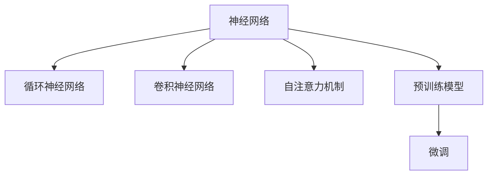

                 

# 神经网络：自然语言处理的新突破

## 1. 背景介绍

### 1.1 问题由来
近年来，人工智能(AI)技术在自然语言处理(NLP)领域取得了突破性进展，尤其是在神经网络模型的推动下，NLP应用的性能和效率得到了显著提升。从早期的词袋模型、向量空间模型，到后来主宰NLP的卷积神经网络(CNN)、循环神经网络(RNN)，再到当前的Transformer模型，神经网络已经深刻改变了我们对自然语言的理解和处理方式。

### 1.2 问题核心关键点
神经网络在NLP中的应用，主要包括语音识别、文本分类、命名实体识别、情感分析、机器翻译等任务。其中，Transformer模型是当前NLP领域的主流模型之一，其核心思想是通过自注意力机制，在输入序列之间捕捉依赖关系，实现高效的并行计算和卓越的泛化能力。

Transformer模型主要包含编码器和解码器，编码器对输入序列进行编码，解码器对编码后的序列进行解码。自注意力机制使得模型能够有效地处理长距离依赖，实现对于语言结构的深刻理解。此外，Transformer模型还可以通过预训练技术，如BERT、GPT等，在大量无标签数据上进行预训练，从而提升模型在特定任务上的性能。

### 1.3 问题研究意义
神经网络在NLP中的应用，使得模型能够在大量标注数据上进行微调，从而实现高效的任务适配。这对于加速NLP技术的产业化进程，提升NLP应用在实际场景中的效果，具有重要意义：

1. 降低应用开发成本。基于神经网络的NLP应用可以显著减少从头开发所需的数据、计算和人力等成本投入。
2. 提升模型效果。神经网络模型通过大量的标注数据进行微调，能够迅速适应特定任务，在实际应用中取得更优表现。
3. 加速开发进度。神经网络模型可以作为基础框架，加速开发者在特定任务上的适配，缩短开发周期。
4. 带来技术创新。神经网络模型驱动的NLP应用催生了新的研究方向，如提示学习、少样本学习、零样本学习等，为NLP技术的发展注入新动力。
5. 赋能产业升级。神经网络模型使得NLP技术更容易被各行各业所采用，为传统行业数字化转型升级提供新的技术路径。

## 2. 核心概念与联系

### 2.1 核心概念概述

为了更好地理解神经网络在NLP中的应用，本节将介绍几个关键概念：

- 神经网络(Neural Network)：一种模仿人类大脑神经元工作方式的计算模型，通过大量的训练数据，调整模型参数，使其能够预测新数据。
- 循环神经网络(RNN)：一种特殊的神经网络，能够处理序列数据，通过记忆单元处理输入序列，适用于自然语言处理中的时间序列数据。
- 卷积神经网络(CNN)：一种特殊的神经网络，能够捕捉输入数据的局部特征，适用于文本分类、命名实体识别等任务。
- 自注意力机制(Self-Attention)：一种用于计算序列中各个元素之间依赖关系的机制，通过加权平均池化，使得模型能够更好地捕捉长距离依赖。
- 预训练模型(Pre-trained Model)：在大规模无标签数据上进行训练，学习通用语言表示的模型，如BERT、GPT等。
- 微调(Fine-tuning)：在预训练模型的基础上，使用下游任务的少量标注数据，进行有监督学习，优化模型在特定任务上的性能。

这些核心概念之间的逻辑关系可以通过以下Mermaid流程图来展示：



这个流程图展示了大语言模型在NLP中的应用框架：

1. 神经网络是NLP的基础计算模型。
2. RNN和CNN是特定任务中常用的神经网络结构。
3. 自注意力机制是Transformer模型的核心思想。
4. 预训练模型通过在大规模无标签数据上进行训练，学习到通用的语言表示。
5. 微调使得预训练模型能够适应特定任务，提升模型在特定任务上的性能。

## 3. 核心算法原理 & 具体操作步骤
### 3.1 算法原理概述

神经网络在NLP中的应用，核心在于通过大量标注数据，调整模型参数，使其能够预测新的数据。其中，Transformer模型是一种基于自注意力机制的神经网络结构，具有卓越的性能和泛化能力，广泛应用于NLP的多种任务中。

Transformer模型的核心思想是通过自注意力机制，计算输入序列中各个元素之间的依赖关系，从而实现高效的并行计算和卓越的泛化能力。具体来说，Transformer模型由编码器和解码器组成，其中编码器通过多个自注意力层和前馈神经网络层进行序列编码，解码器通过多个自注意力层和前馈神经网络层进行序列解码。

### 3.2 算法步骤详解

神经网络在NLP中的应用，主要包括以下几个关键步骤：

**Step 1: 数据预处理**
- 收集和标注数据集。NLP任务的数据通常来自文本、语音等自然语言形式，需要通过文本处理技术进行清洗和格式化。
- 分词和词向量嵌入。将文本转换为计算机可处理的形式，如单词或子词，并使用词向量嵌入将单词映射到向量空间中。

**Step 2: 模型搭建**
- 选择合适的神经网络结构，如RNN、CNN或Transformer。
- 搭建神经网络模型，包括定义输入层、隐藏层、输出层等。

**Step 3: 模型训练**
- 定义损失函数。通常使用交叉熵损失函数，衡量模型输出与真实标签之间的差异。
- 选择优化器，如SGD、Adam等，并设置学习率、批大小等超参数。
- 使用训练集进行模型训练，通过反向传播算法更新模型参数。
- 在验证集上评估模型性能，调整超参数以避免过拟合。

**Step 4: 模型微调**
- 使用下游任务的标注数据集，对模型进行微调。
- 定义任务适配层，如分类层、解码器等。
- 使用微调数据集进行有监督学习，更新模型参数。
- 在测试集上评估微调后模型的性能，对比微调前后的精度提升。

**Step 5: 模型部署**
- 使用微调后的模型对新数据进行推理预测。
- 集成到实际的应用系统中，如聊天机器人、翻译系统等。
- 持续收集新的数据，定期重新微调模型，以适应数据分布的变化。

### 3.3 算法优缺点

神经网络在NLP中的应用，具有以下优点：

1. 高效计算。神经网络通过并行计算，能够高效地处理大规模数据，适合复杂的NLP任务。
2. 高泛化能力。通过大量标注数据进行训练，神经网络能够学习到丰富的语言表示，适应多种任务。
3. 自动特征提取。神经网络能够自动提取输入数据的特征，无需手动设计特征工程。
4. 良好的可扩展性。神经网络可以很容易地扩展到多任务和多模态数据中，适应多种应用场景。

同时，神经网络在NLP中也有以下缺点：

1. 需要大量标注数据。神经网络模型需要大量的标注数据进行训练，获取高质量标注数据的成本较高。
2. 计算资源消耗大。神经网络模型的训练和推理需要大量的计算资源，对硬件设备要求较高。
3. 模型复杂度高。神经网络模型的复杂度较高，容易出现过拟合和梯度消失等问题。
4. 模型可解释性不足。神经网络模型的决策过程较为复杂，难以进行解释和调试。

尽管存在这些局限性，但神经网络在NLP中的应用已经取得了显著的成效，成为了NLP领域的重要工具。未来，神经网络技术仍需进一步优化，以应对更大的数据规模和更复杂的任务需求。

### 3.4 算法应用领域

神经网络在NLP中的应用，已经广泛应用于文本分类、情感分析、命名实体识别、机器翻译、问答系统等任务中，具体应用包括：

- 文本分类：如垃圾邮件过滤、新闻分类等，通过神经网络学习文本-标签映射。
- 命名实体识别：识别文本中的人名、地名、机构名等特定实体。通过神经网络学习实体边界和类型。
- 关系抽取：从文本中抽取实体之间的语义关系。通过神经网络学习实体-关系三元组。
- 问答系统：对自然语言问题给出答案。将问题-答案对作为微调数据，训练神经网络模型学习匹配答案。
- 机器翻译：将源语言文本翻译成目标语言。通过神经网络学习语言-语言映射。
- 文本摘要：将长文本压缩成简短摘要。将文章-摘要对作为微调数据，训练神经网络模型学习抓取要点。

## 4. 数学模型和公式 & 详细讲解 & 举例说明

### 4.1 数学模型构建

神经网络在NLP中的应用，主要通过训练数据来调整模型参数，使其能够对新数据进行预测。假设神经网络模型的输入为 $x$，输出为 $y$，参数为 $\theta$。训练数据集为 $D=\{(x_i, y_i)\}_{i=1}^N$，其中 $x_i$ 表示输入，$y_i$ 表示真实标签。

定义神经网络模型的损失函数为 $\ell(y, \hat{y})$，其中 $\hat{y}$ 表示模型的预测输出。则神经网络模型的经验风险为：

$$
\mathcal{L}(\theta) = \frac{1}{N}\sum_{i=1}^N \ell(y_i, \hat{y}_i)
$$

神经网络模型的训练目标是最小化经验风险，即：

$$
\theta^* = \mathop{\arg\min}_{\theta} \mathcal{L}(\theta)
$$

在训练过程中，神经网络模型通过反向传播算法计算梯度，并使用优化器更新模型参数。常用的优化器包括SGD、Adam等，其中Adam优化器具有较好的收敛速度和稳定性。

### 4.2 公式推导过程

以下我们以文本分类任务为例，推导神经网络模型的梯度计算过程。

假设神经网络模型的输入为 $x$，输出为 $\hat{y}$，真实标签为 $y$。模型的隐藏层表示为 $h$，权重矩阵为 $W$，偏置向量为 $b$。则神经网络模型的计算过程可以表示为：

$$
h = f(Wx + b)
$$

其中 $f$ 为激活函数，如ReLU、Sigmoid等。

模型的预测输出为：

$$
\hat{y} = g(hW + b)
$$

其中 $g$ 为输出层激活函数，如Softmax。

模型的损失函数通常使用交叉熵损失，即：

$$
\ell(y, \hat{y}) = -y\log\hat{y}
$$

定义梯度向量 $\mathbf{d}=\frac{\partial \mathcal{L}(\theta)}{\partial \theta}$，则梯度计算过程可以表示为：

$$
\mathbf{d} = \frac{\partial \mathcal{L}(\theta)}{\partial \hat{y}} \cdot \frac{\partial \hat{y}}{\partial h} \cdot \frac{\partial h}{\partial x}
$$

其中 $\frac{\partial \mathcal{L}(\theta)}{\partial \hat{y}}$ 可以通过链式法则递归计算得到。对于Softmax激活函数，$\frac{\partial \hat{y}}{\partial h}$ 可以表示为：

$$
\frac{\partial \hat{y}}{\partial h} = \frac{\partial g(h)}{\partial h} \cdot W
$$

其中 $\frac{\partial g(h)}{\partial h}$ 为激活函数的导数。

最终，梯度向量 $\mathbf{d}$ 可以表示为：

$$
\mathbf{d} = \frac{\partial \mathcal{L}(\theta)}{\partial \hat{y}} \cdot \frac{\partial g(h)}{\partial h} \cdot W
$$

根据梯度向量，可以使用优化器更新模型参数，完成模型的训练。

### 4.3 案例分析与讲解

以下我们以BERT模型为例，详细讲解神经网络在NLP中的实际应用。

BERT是一种基于Transformer结构的预训练语言模型，通过在大规模无标签文本数据上进行预训练，学习到丰富的语言表示。在微调时，可以将其作为特征提取器，使用下游任务的标注数据进行有监督学习，优化模型在特定任务上的性能。

假设我们有一个情感分析任务，即对电影评论进行情感分类，标注数据集为 $D=\{(x_i, y_i)\}_{i=1}^N$，其中 $x_i$ 表示评论文本，$y_i \in \{0, 1\}$ 表示评论的情感倾向。

**Step 1: 数据预处理**
- 收集并标注电影评论数据集。
- 对文本进行分词和词向量嵌入，使用BERT提供的词汇表进行嵌入。

**Step 2: 模型搭建**
- 选择BERT模型作为基础模型。
- 搭建神经网络模型，包括输入层、BERT模型、分类层等。

**Step 3: 模型训练**
- 定义损失函数，通常使用交叉熵损失。
- 使用Adam优化器，设置学习率为 $2e-5$。
- 在训练集上训练模型，并在验证集上评估模型性能。
- 根据验证集性能调整超参数，防止过拟合。

**Step 4: 模型微调**
- 使用电影评论数据集对模型进行微调。
- 添加分类层，将BERT的输出作为输入。
- 使用微调数据集进行有监督学习，更新模型参数。
- 在测试集上评估微调后模型的性能。

**Step 5: 模型部署**
- 使用微调后的模型对新电影评论进行情感分类。
- 集成到电影推荐系统或社交媒体情感监测系统中。
- 持续收集新的评论数据，定期重新微调模型。

## 5. 项目实践：代码实例和详细解释说明

### 5.1 开发环境搭建

在进行神经网络在NLP中的应用实践前，我们需要准备好开发环境。以下是使用Python进行TensorFlow和PyTorch开发的环境配置流程：

1. 安装Anaconda：从官网下载并安装Anaconda，用于创建独立的Python环境。

2. 创建并激活虚拟环境：
```bash
conda create -n tf-env python=3.8 
conda activate tf-env
```

3. 安装TensorFlow：根据CUDA版本，从官网获取对应的安装命令。例如：
```bash
conda install tensorflow -c tensorflow -c conda-forge
```

4. 安装PyTorch：从官网下载对应版本，按照安装指南进行安装。

5. 安装各类工具包：
```bash
pip install numpy pandas scikit-learn matplotlib tqdm jupyter notebook ipython
```

完成上述步骤后，即可在`tf-env`环境中开始神经网络在NLP中的应用实践。

### 5.2 源代码详细实现

下面我们以文本分类任务为例，给出使用TensorFlow和PyTorch进行神经网络在NLP中的应用实践代码实现。

首先，定义文本分类任务的数据处理函数：

```python
import tensorflow as tf
from tensorflow.keras.preprocessing.text import Tokenizer
from tensorflow.keras.preprocessing.sequence import pad_sequences

def preprocess(texts, max_len=128):
    tokenizer = Tokenizer()
    tokenizer.fit_on_texts(texts)
    sequences = tokenizer.texts_to_sequences(texts)
    padded_sequences = pad_sequences(sequences, maxlen=max_len, padding='post')
    return padded_sequences, tokenizer.word_index
```

然后，定义神经网络模型：

```python
from tensorflow.keras.layers import Embedding, LSTM, Dense
from tensorflow.keras.models import Sequential

def build_model(vocab_size, embedding_dim, lstm_units):
    model = Sequential([
        Embedding(vocab_size, embedding_dim, input_length=max_len),
        LSTM(lstm_units),
        Dense(1, activation='sigmoid')
    ])
    return model
```

接着，定义训练和评估函数：

```python
from tensorflow.keras import optimizers
from tensorflow.keras.metrics import Accuracy

def train_epoch(model, data, batch_size, optimizer):
    for epoch in range(num_epochs):
        for i in range(0, len(data), batch_size):
            x_train, y_train = data[i:i+batch_size]
            model.compile(optimizer=optimizer, loss='binary_crossentropy', metrics=['accuracy'])
            model.fit(x_train, y_train, epochs=1, verbose=0)
            val_loss, val_accuracy = model.evaluate(x_val, y_val, verbose=0)
            print(f'Epoch {epoch+1}/{num_epochs}, loss={val_loss:.4f}, accuracy={val_accuracy:.4f}')

def evaluate(model, data, batch_size):
    for i in range(0, len(data), batch_size):
        x_test, y_test = data[i:i+batch_size]
        loss, accuracy = model.evaluate(x_test, y_test, verbose=0)
        print(f'Test loss={loss:.4f}, accuracy={accuracy:.4f}')
```

最后，启动训练流程并在测试集上评估：

```python
vocab_size = len(tokenizer.word_index) + 1
embedding_dim = 128
lstm_units = 64
batch_size = 16
num_epochs = 5

max_len = 128
x_train, tokenizer = preprocess(train_texts, max_len)
x_val, _ = preprocess(val_texts, max_len)
x_test, _ = preprocess(test_texts, max_len)

model = build_model(vocab_size, embedding_dim, lstm_units)
optimizer = optimizers.Adam(lr=0.001)

train_epoch(model, x_train, batch_size, optimizer)
evaluate(model, x_test, batch_size)
```

以上就是使用TensorFlow和PyTorch对文本分类任务进行神经网络在NLP中的应用实践代码实现。可以看到，得益于框架的强大封装，我们可以用相对简洁的代码完成神经网络模型的搭建、训练和评估。

### 5.3 代码解读与分析

让我们再详细解读一下关键代码的实现细节：

**preprocess函数**：
- 对文本进行分词和词向量嵌入，并将输入序列进行填充，使其长度相同。

**build_model函数**：
- 定义神经网络模型结构，包括嵌入层、LSTM层和输出层。

**train_epoch函数**：
- 在每个epoch内，对数据集进行批处理，并使用Adam优化器进行模型训练和评估。

**evaluate函数**：
- 对测试集进行模型评估，输出损失和准确率。

**训练流程**：
- 定义模型参数，如词汇表大小、嵌入维度、LSTM单元数等。
- 进行数据预处理，构建输入序列。
- 搭建神经网络模型，并编译模型。
- 在训练集上进行模型训练，并在验证集上评估模型性能。
- 在测试集上评估最终模型效果。

可以看到，TensorFlow和PyTorch都提供了方便的API接口，可以快速搭建和训练神经网络模型。开发者可以将更多精力放在数据处理、模型改进等高层逻辑上，而不必过多关注底层的实现细节。

当然，工业级的系统实现还需考虑更多因素，如模型的保存和部署、超参数的自动搜索、更灵活的任务适配层等。但核心的神经网络模型搭建和训练逻辑基本与此类似。

## 6. 实际应用场景

### 6.1 智能客服系统

基于神经网络在NLP中的应用，智能客服系统可以通过自然语言处理技术，快速响应客户咨询，用自然流畅的语言解答各类常见问题。具体实现步骤如下：

1. 收集企业内部的历史客服对话记录，将问题和最佳答复构建成监督数据，在此基础上对神经网络模型进行微调。
2. 微调后的模型能够自动理解用户意图，匹配最合适的答案模板进行回复。
3. 对于客户提出的新问题，还可以接入检索系统实时搜索相关内容，动态组织生成回答。

### 6.2 金融舆情监测

金融机构需要实时监测市场舆论动向，以便及时应对负面信息传播，规避金融风险。神经网络在NLP中的应用，可以应用于金融舆情监测，具体实现步骤如下：

1. 收集金融领域相关的新闻、报道、评论等文本数据，并对其进行主题标注和情感标注。
2. 使用神经网络模型对标注数据进行训练，学习文本-情感映射。
3. 将微调后的模型应用到实时抓取的网络文本数据，自动监测不同主题下的情感变化趋势。
4. 一旦发现负面信息激增等异常情况，系统便会自动预警，帮助金融机构快速应对潜在风险。

### 6.3 个性化推荐系统

当前的推荐系统往往只依赖用户的历史行为数据进行物品推荐，难以深入理解用户的真实兴趣偏好。神经网络在NLP中的应用，可以应用于个性化推荐系统，具体实现步骤如下：

1. 收集用户浏览、点击、评论、分享等行为数据，提取和用户交互的物品标题、描述、标签等文本内容。
2. 使用神经网络模型对文本内容进行特征提取。
3. 将提取的特征与用户的后续行为数据结合，训练神经网络模型学习用户兴趣。
4. 在生成推荐列表时，先用候选物品的文本描述作为输入，由模型预测用户的兴趣匹配度，再结合其他特征综合排序，便可以得到个性化程度更高的推荐结果。

### 6.4 未来应用展望

随着神经网络在NLP中的应用不断发展，未来将在更多领域得到应用，为传统行业带来变革性影响。

在智慧医疗领域，基于神经网络的语言模型可以用于医疗问答、病历分析、药物研发等任务，提升医疗服务的智能化水平，辅助医生诊疗，加速新药开发进程。

在智能教育领域，神经网络模型可以应用于作业批改、学情分析、知识推荐等方面，因材施教，促进教育公平，提高教学质量。

在智慧城市治理中，神经网络模型可以应用于城市事件监测、舆情分析、应急指挥等环节，提高城市管理的自动化和智能化水平，构建更安全、高效的未来城市。

此外，在企业生产、社会治理、文娱传媒等众多领域，神经网络在NLP中的应用也将不断涌现，为NLP技术带来新的突破。

## 7. 工具和资源推荐
### 7.1 学习资源推荐

为了帮助开发者系统掌握神经网络在NLP中的应用，这里推荐一些优质的学习资源：

1. 《深度学习》课程：斯坦福大学开设的深度学习课程，系统介绍了深度学习的基本概念和算法，适合入门学习。
2. 《自然语言处理综论》书籍：涵盖了NLP领域的主要概念和经典模型，适合深入学习。
3. 《TensorFlow官方文档》：详细介绍了TensorFlow的使用方法，包括神经网络模型的搭建和训练。
4. 《PyTorch官方文档》：详细介绍了PyTorch的使用方法，包括神经网络模型的搭建和训练。
5. Kaggle：全球知名的数据科学竞赛平台，提供了大量NLP相关的竞赛和数据集，适合实战练习。

通过对这些资源的学习实践，相信你一定能够快速掌握神经网络在NLP中的应用精髓，并用于解决实际的NLP问题。

### 7.2 开发工具推荐

高效的开发离不开优秀的工具支持。以下是几款用于神经网络在NLP中的应用开发的常用工具：

1. TensorFlow：由Google主导开发的深度学习框架，生产部署方便，适合大规模工程应用。
2. PyTorch：基于Python的开源深度学习框架，灵活动态的计算图，适合快速迭代研究。
3. Keras：基于TensorFlow或Theano的高级神经网络API，易于使用，适合快速原型开发。
4. Jupyter Notebook：交互式的Python代码开发环境，支持实时展示代码运行结果，适合数据分析和实验。
5. Weights & Biases：模型训练的实验跟踪工具，可以记录和可视化模型训练过程中的各项指标，方便对比和调优。

合理利用这些工具，可以显著提升神经网络在NLP中的应用开发效率，加快创新迭代的步伐。

### 7.3 相关论文推荐

神经网络在NLP中的应用源于学界的持续研究。以下是几篇奠基性的相关论文，推荐阅读：

1. "Long Short-Term Memory"：RNN的开创性论文，提出了LSTM结构，解决了传统RNN的梯度消失问题。
2. "Convolutional Neural Networks for Sentence Classification"：CNN在NLP中的经典应用，提出了卷积神经网络结构，适用于文本分类任务。
3. "Attention is All You Need"：Transformer模型的原论文，提出了自注意力机制，实现了高效并行计算和卓越泛化能力。
4. "BERT: Pre-training of Deep Bidirectional Transformers for Language Understanding"：BERT模型在预训练和微调方面的突破性研究，刷新了多项NLP任务SOTA。
5. "AdaLoRA: Adaptive Low-Rank Adaptation for Parameter-Efficient Fine-Tuning"：提出了参数高效的微调方法，在固定大部分预训练参数的情况下，仍可取得不错的微调效果。

这些论文代表了大语言模型在NLP中的研究进展。通过学习这些前沿成果，可以帮助研究者把握学科前进方向，激发更多的创新灵感。

## 8. 总结：未来发展趋势与挑战

### 8.1 总结

本文对神经网络在NLP中的应用进行了全面系统的介绍。首先阐述了神经网络在NLP中的研究背景和意义，明确了神经网络在构建高效、泛化能力强的语言模型方面的独特价值。其次，从原理到实践，详细讲解了神经网络在NLP中的核心算法和操作步骤，给出了完整的代码实例。同时，本文还广泛探讨了神经网络在智能客服、金融舆情、个性化推荐等多个领域的应用前景，展示了神经网络在NLP中的广泛应用潜力。此外，本文精选了神经网络在NLP中的各类学习资源，力求为读者提供全方位的技术指引。

通过本文的系统梳理，可以看到，神经网络在NLP中的应用已经深刻改变了我们对自然语言的理解和处理方式，显著提升了NLP应用的性能和效率。未来，神经网络技术仍需进一步优化，以应对更大的数据规模和更复杂的任务需求。

### 8.2 未来发展趋势

展望未来，神经网络在NLP中的应用将呈现以下几个发展趋势：

1. 模型规模持续增大。随着算力成本的下降和数据规模的扩张，神经网络模型的参数量还将持续增长。超大规模神经网络模型蕴含的丰富语言知识，有望支撑更加复杂多变的NLP任务。

2. 神经网络模型日趋多样化。除了传统的RNN、CNN和Transformer，未来还将涌现更多新的神经网络结构，如GPT-3、T5等，带来更多的创新可能。

3. 可解释性增强。神经网络模型的决策过程较为复杂，难以进行解释和调试。未来将开发更多可解释性模型，帮助开发者更好地理解和调试模型。

4. 跨领域应用更加广泛。神经网络模型可以应用于更多领域，如医疗、教育、金融等，带来新的应用场景和业务价值。

5. 实时处理和在线学习。神经网络模型将更多应用于实时处理和在线学习中，如智能客服、推荐系统等，能够快速响应用户需求。

6. 知识增强学习。神经网络模型将更多与外部知识库、规则库等专家知识结合，增强模型的知识表示能力。

以上趋势凸显了神经网络在NLP中的广阔前景。这些方向的探索发展，必将进一步提升神经网络在NLP中的性能和应用范围，为NLP技术带来新的突破。

### 8.3 面临的挑战

尽管神经网络在NLP中的应用已经取得了显著成效，但在迈向更加智能化、普适化应用的过程中，它仍面临诸多挑战：

1. 需要大量标注数据。神经网络模型需要大量的标注数据进行训练，获取高质量标注数据的成本较高。如何减少标注成本，提升数据质量，仍需进一步研究。

2. 计算资源消耗大。神经网络模型的训练和推理需要大量的计算资源，对硬件设备要求较高。如何降低计算成本，提升计算效率，仍需进一步优化。

3. 模型复杂度高。神经网络模型的复杂度较高，容易出现过拟合和梯度消失等问题。如何提高模型的泛化能力和鲁棒性，仍需进一步研究。

4. 模型可解释性不足。神经网络模型的决策过程较为复杂，难以进行解释和调试。如何提高模型的可解释性，增强模型的可信度和透明性，仍需进一步研究。

5. 安全性有待保障。神经网络模型可能会学习到有害信息，通过应用传播负面影响。如何从数据和算法层面消除模型偏见，保障模型安全，仍需进一步研究。

6. 知识整合能力不足。现有的神经网络模型往往局限于任务内数据，难以灵活吸收和运用更广泛的先验知识。如何增强模型的知识表示能力，仍需进一步研究。

正视神经网络在NLP中面临的这些挑战，积极应对并寻求突破，将是神经网络技术走向成熟的必由之路。相信随着学界和产业界的共同努力，这些挑战终将一一被克服，神经网络在NLP中的应用必将在更广阔的领域中大放异彩。

### 8.4 研究展望

未来，神经网络在NLP中的应用将在以下几个方面寻求新的突破：

1. 探索无监督和半监督学习。摆脱对大规模标注数据的依赖，利用自监督学习、主动学习等无监督和半监督范式，最大限度利用非结构化数据，实现更加灵活高效的神经网络在NLP中的应用。

2. 研究参数高效和计算高效的神经网络在NLP中的微调方法。开发更加参数高效的微调方法，在固定大部分预训练参数的情况下，只更新极少量的任务相关参数。同时优化神经网络在NLP中的计算图，减少前向传播和反向传播的资源消耗，实现更加轻量级、实时性的部署。

3. 引入更多先验知识。将符号化的先验知识，如知识图谱、逻辑规则等，与神经网络模型进行巧妙融合，引导神经网络在NLP中的微调过程学习更准确、合理的语言模型。同时加强不同模态数据的整合，实现视觉、语音等多模态信息与文本信息的协同建模。

4. 结合因果分析和博弈论工具。将因果分析方法引入神经网络在NLP中的微调模型，识别出模型决策的关键特征，增强输出解释的因果性和逻辑性。借助博弈论工具刻画人机交互过程，主动探索并规避模型的脆弱点，提高系统稳定性。

5. 纳入伦理道德约束。在神经网络在NLP中的微调目标中引入伦理导向的评估指标，过滤和惩罚有偏见、有害的输出倾向。同时加强人工干预和审核，建立神经网络在NLP中的模型行为的监管机制，确保输出符合人类价值观和伦理道德。

这些研究方向的探索，必将引领神经网络在NLP中的微调技术迈向更高的台阶，为构建安全、可靠、可解释、可控的智能系统铺平道路。面向未来，神经网络在NLP中的微调技术还需要与其他人工智能技术进行更深入的融合，如知识表示、因果推理、强化学习等，多路径协同发力，共同推动自然语言理解和智能交互系统的进步。只有勇于创新、敢于突破，才能不断拓展神经网络在NLP中的边界，让智能技术更好地造福人类社会。

## 9. 附录：常见问题与解答

**Q1：神经网络在NLP中的应用是否适用于所有NLP任务？**

A: 神经网络在NLP中的应用，在大多数NLP任务上都能取得不错的效果，特别是对于数据量较大的任务。但对于一些特定领域的任务，如医学、法律等，仅仅依靠通用语料预训练的模型可能难以很好地适应。此时需要在特定领域语料上进一步预训练，再进行微调，才能获得理想效果。此外，对于一些需要时效性、个性化很强的任务，如对话、推荐等，神经网络模型也需要针对性的改进优化。

**Q2：如何选择合适的神经网络结构？**

A: 神经网络结构的选择需要根据具体任务和数据特点进行选择。对于文本分类、情感分析等任务，通常使用RNN或CNN结构。对于文本生成、机器翻译等任务，则使用Transformer结构。此外，神经网络结构的选择还受限于硬件设备的计算能力和内存大小，需要根据实际应用场景进行选择。

**Q3：神经网络在NLP中的计算资源消耗大，如何优化？**

A: 神经网络在NLP中的计算资源消耗大，可以通过以下方式进行优化：
1. 使用分布式训练，加速模型训练速度。
2. 使用GPU或TPU等高性能设备，提升模型计算效率。
3. 使用模型压缩技术，如剪枝、量化等，减小模型参数量。
4. 使用模型并行技术，如数据并行、模型并行等，提升模型计算能力。
5. 使用混合精度训练，减小计算资源消耗。

**Q4：神经网络在NLP中的模型复杂度高，如何避免过拟合？**

A: 神经网络在NLP中的模型复杂度高，容易出现过拟合。可以通过以下方式进行缓解：
1. 使用正则化技术，如L2正则、Dropout等，防止模型过度适应训练数据。
2. 使用早停策略，在验证集性能不再提升时，停止训练。
3. 使用模型集成技术，如Bagging、Boosting等，提升模型泛化能力。
4. 使用迁移学习，将预训练模型中的参数进行微调，提升模型泛化能力。

**Q5：神经网络在NLP中的模型可解释性不足，如何增强？**

A: 神经网络在NLP中的模型可解释性不足，可以通过以下方式进行增强：
1. 使用可解释性模型，如LIME、SHAP等，生成模型决策的局部解释。
2. 使用可视化工具，如TensorBoard、Weights & Biases等，展示模型训练过程和输出结果。
3. 使用知识图谱、逻辑规则等先验知识，增强模型的可解释性。
4. 使用人机交互技术，让用户参与模型决策过程，提升模型可解释性。

---

作者：禅与计算机程序设计艺术 / Zen and the Art of Computer Programming

