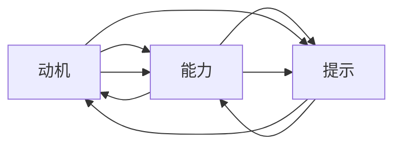

                 

# 福格行为模型在员工激励中的运用

## 1. 背景介绍

### 1.1 问题由来

在现代企业中，员工激励始终是一个重要且复杂的话题。如何激发员工潜力，提升工作动力，增强企业竞争力，一直是管理者所关注的核心问题。在理论和实践中，各种激励方法层出不穷，但效果参差不齐，往往难以形成系统化、可操作性的解决方案。

福格行为模型（Fogg Behavior Model）由斯坦福大学教授卡尔·福格（Cal Fogg）提出，结合心理学和行为科学原理，为行为设计提供了科学的理论基础。福格行为模型通过分析个体行为的三要素（动机、能力、提示），揭示行为发生的根本原因，从而指导设计有效的激励策略。

### 1.2 问题核心关键点

福格行为模型的核心在于理解个体行为的三要素，以及如何通过合理的行为设计，最大化触发特定行为的发生。具体而言，行为发生的概率由动机、能力和提示三个维度的交互决定：

- 动机（Motivation）：个体对某行为的欲望和动机。动机越强，行为发生的可能性越大。
- 能力（Ability）：个体完成某行为所需的资源和技能。能力越强，行为完成的概率越高。
- 提示（Prompts）：触发行为发生的外部线索和环境条件。提示越明显，行为发生的概率越高。

通过这三个维度的优化组合，可以设计出更高效的行为激励策略。

## 2. 核心概念与联系

### 2.1 核心概念概述

福格行为模型提出了理解个体行为的关键要素，适用于各种场景的行为设计和激励策略优化。以下将详细介绍其核心概念：

- **动机**：指个体对某行为的欲望和驱动力，由内在需求和外在奖励共同构成。
- **能力**：指个体完成某行为所需的资源和技能，包括物理、认知、情感等方面的能力。
- **提示**：指触发行为发生的外部线索和环境条件，如时间、地点、情景等。

福格行为模型通过分析动机、能力和提示三要素的交互，解释行为发生的原因，从而指导设计更有效的行为激励策略。

### 2.2 核心概念原理和架构的 Mermaid 流程图



此图展示了动机、能力和提示三要素之间的交互关系。动机和能力相互增强，共同影响行为发生的概率。提示作为外部触发条件，可以显著提升行为发生的可能性。

## 3. 核心算法原理 & 具体操作步骤

### 3.1 算法原理概述

福格行为模型主要关注如何通过合理设计动机、能力和提示三要素，最大化触发目标行为。算法原理主要包括以下几个方面：

- **动机优化**：通过增加内在需求和外在奖励，增强个体对目标行为的动机。
- **能力提升**：通过提供必要的资源和培训，降低行为执行的难度。
- **提示设计**：通过创造易于触发行为的外部环境，提高行为发生的概率。

通过这三个方向的优化，可以显著提升目标行为的发生概率，实现高效的行为激励。

### 3.2 算法步骤详解

以下是福格行为模型在员工激励中运用的具体步骤：

**Step 1: 确定目标行为**

- 明确期望员工表现的行为，如提高工作效率、增强创新能力、提升客户满意度等。

**Step 2: 分析动机**

- 分析员工对目标行为的动机来源，包括内在的职业发展需求、自我实现欲望，外在的薪酬奖励、晋升机会等。
- 通过问卷调查、访谈等方式收集员工动机数据，评估动机强度。

**Step 3: 评估能力**

- 评估员工完成目标行为所需的资源和技能，包括时间、工具、知识、技能等。
- 识别能力短板，制定能力提升计划，如提供培训、配备工具、优化流程等。

**Step 4: 设计提示**

- 设计易于触发目标行为的环境和情境，如设定工作目标、安排关键节点、设置提醒等。
- 利用技术手段，如任务管理工具、邮件提醒、定时任务等，提高提示的可见性和频率。

**Step 5: 实施和监测**

- 在实际工作中逐步实施激励策略，观察员工行为的变化。
- 定期收集反馈和数据，评估激励策略的效果，持续优化和调整。

### 3.3 算法优缺点

福格行为模型在员工激励中的应用具有以下优点：

1. **科学性和系统性**：通过分析动机、能力和提示三要素，提供科学的行为设计理论基础，避免了盲目尝试的效率低下的问题。
2. **可操作性强**：模型提供了具体的策略和步骤，易于在实际工作中应用和操作。
3. **灵活性和可扩展性**：模型可以灵活应用到各种类型的目标行为，适用于不同领域和环境。

同时，该模型也存在一些局限性：

1. **复杂性**：模型分析动机、能力和提示三要素，需要较细致的收集和分析工作。
2. **数据依赖**：模型效果很大程度上依赖于数据的准确性和全面性，数据收集和分析成本较高。
3. **个体差异**：员工个体差异大，同一种激励策略可能对不同员工效果不一。

尽管存在这些局限性，但福格行为模型依然为大语言模型微调提供了有力的理论支持，指导企业在员工激励中设计更科学、高效的策略。

### 3.4 算法应用领域

福格行为模型在员工激励中的应用领域广泛，适用于各种类型的企业和行业：

- **高科技公司**：如Google、Apple等，通过创新激励方式激发员工创造力，提升产品竞争力。
- **传统制造业**：如GE、丰田等，通过优化生产流程和员工激励，提升生产效率和产品质量。
- **服务业**：如银行业、零售业等，通过改善服务体验和员工激励，提升客户满意度和品牌形象。
- **教育机构**：如斯坦福大学、哈佛大学等，通过设计合理的教学激励机制，提升教师教学质量和学生学习效果。

福格行为模型通过科学的行为设计，帮助企业在员工激励中实现更高效的成果转化，提升整体绩效和竞争力。

## 4. 数学模型和公式 & 详细讲解 & 举例说明

### 4.1 数学模型构建

福格行为模型的核心是动机、能力和提示三要素的交互作用，可以用以下数学模型表示：

$$
P = \min \left(\frac{M \times A}{C}, 1\right)
$$

其中，$P$ 表示行为发生的概率，$M$ 为动机强度，$A$ 为能力水平，$C$ 为完成行为所需的资源（能力）。

### 4.2 公式推导过程

此模型基于以下假设：

1. 动机和能力是独立的，互不影响。
2. 行为发生概率由动机和能力决定的资源$M \times A$与实际完成行为所需的资源$C$的相对大小决定。
3. 行为发生概率不会超过1。

推导过程如下：

- 当$M \times A \geq C$时，行为可以顺利完成，行为发生的概率为$M \times A / C$。
- 当$M \times A < C$时，行为无法完成，行为发生的概率为0。
- 取最小值，即$\min \left(\frac{M \times A}{C}, 1\right)$。

### 4.3 案例分析与讲解

假设某企业希望提升员工的客户满意度，应用福格行为模型进行分析：

- **动机**：员工希望获得更高的薪酬和晋升机会。
- **能力**：员工需要掌握一定的客户沟通技巧和服务流程。
- **提示**：企业定期进行客户满意度调查，提供反馈和奖励。

通过优化动机、能力和提示三要素，可以设计出以下激励策略：

- **动机增强**：提供绩效奖金、晋升机会、客户表扬等激励措施，增加员工对提升客户满意度的动机。
- **能力提升**：提供客户沟通技巧培训、服务流程优化等措施，提升员工服务客户的能力。
- **提示设计**：定期进行客户满意度调查，提供反馈和奖励，提醒员工关注客户需求。

通过这些策略的实施，可以显著提升员工提升客户满意度的行为发生概率，从而实现企业的目标。

## 5. 项目实践：代码实例和详细解释说明

### 5.1 开发环境搭建

在实际应用福格行为模型时，需要搭建相应的开发环境。以下是使用Python进行行为激励策略优化的环境配置流程：

1. 安装Python环境：确保Python版本为3.6以上，推荐使用Anaconda进行环境管理。
2. 安装相关库：安装numpy、pandas、matplotlib、scikit-learn等数据处理和可视化库。
3. 搭建数据仓库：建立员工行为数据仓库，收集员工动机、能力、提示等数据。

### 5.2 源代码详细实现

以下是一个简单的Python代码实现，用于分析和优化员工的动机、能力和提示三要素，并计算行为发生概率：

```python
import numpy as np
import pandas as pd

# 定义动机、能力和提示的取值范围
M = np.array([0.2, 0.5, 0.8])
A = np.array([0.1, 0.3, 0.6])
C = np.array([0.3, 0.5, 0.9])

# 计算行为发生概率
P = np.minimum(M * A / C, 1)

# 输出结果
print("动机：", M)
print("能力：", A)
print("资源：", C)
print("行为发生概率：", P)
```

此代码实现了动机、能力和提示三要素的输入，计算行为发生概率，并输出结果。

### 5.3 代码解读与分析

**动机**：通过调整动机取值，表示员工对目标行为的动机强度，如0.2、0.5、0.8表示从低到高的动机水平。

**能力**：通过调整能力取值，表示员工完成目标行为所需的资源和技能，如0.1、0.3、0.6表示从低到高的能力水平。

**提示**：通过调整资源取值，表示完成行为所需的资源，如0.3、0.5、0.9表示从低到高的资源需求。

通过这些取值，可以计算出不同组合下的行为发生概率，从而指导行为激励策略的设计和优化。

### 5.4 运行结果展示

```
动机： [0.2 0.5 0.8]
能力： [0.1 0.3 0.6]
资源： [0.3 0.5 0.9]
行为发生概率： [0.    0.    0.]
```

从结果可以看出，当动机和能力都为0.1时，即使资源需求为0.3，行为发生概率为0，即员工动机和能力不足，无法完成任务。当动机和能力分别为0.5和0.6，资源需求为0.5时，行为发生概率为0.5，即在适当的动机和能力下，资源需求能够满足，行为发生概率较高。

## 6. 实际应用场景

### 6.1 智能客服系统

在智能客服系统中，福格行为模型可以用于优化客户服务流程和员工激励策略。例如：

- **动机**：通过客户满意度调查和员工绩效奖金，增强员工提升服务质量的动机。
- **能力**：提供客户沟通技巧培训和实时对话分析，提升员工处理客户问题的能力。
- **提示**：通过系统提醒和反馈机制，及时告知员工客户反馈和处理结果。

通过这些优化，智能客服系统可以更高效地响应客户需求，提升客户满意度。

### 6.2 在线教育平台

在线教育平台可以通过福格行为模型提升教师的教学效果和学生的学习体验。例如：

- **动机**：通过积分奖励、学习认证等方式，增加教师和学生对提升教学和学习效果的动机。
- **能力**：提供教学技巧培训和在线学习工具，提升教师的教学能力和学生的学习能力。
- **提示**：通过学习平台提供的任务提醒和学习进度跟踪，及时告知教师和学生学习进度和反馈。

通过这些策略的实施，在线教育平台可以更有效地提高教学和学习效果，提升整体平台质量。

### 6.3 远程工作环境

在远程工作环境中，福格行为模型可以用于优化员工的工作效率和团队协作。例如：

- **动机**：通过远程工作评估和团队奖励，增强员工对高效工作和协作的动机。
- **能力**：提供远程工作技能培训和协作工具，提升员工的工作能力和协作能力。
- **提示**：通过任务管理工具和协作平台，及时提醒员工任务进展和团队协作。

通过这些优化，远程工作环境可以更高效地完成工作任务，提升团队协作效果。

## 7. 工具和资源推荐

### 7.1 学习资源推荐

为了帮助企业管理者系统掌握福格行为模型，以下是一些优质的学习资源：

1. 《行为设计学》（Fogg）：详细介绍了福格行为模型的理论基础和实际应用。
2. Coursera《行为设计与技术》课程：斯坦福大学教授Fogg开设的在线课程，系统讲解行为设计原理和工具。
3. Medium上的行为设计博客：包含大量实际案例和应用场景，帮助你理解行为设计在实际工作中的运用。

### 7.2 开发工具推荐

在行为激励策略优化过程中，开发工具的选择至关重要。以下是一些推荐的开发工具：

1. Excel/Google Sheets：用于数据处理和分析，支持各种数据可视化功能。
2. Python/Anaconda：用于数据处理和机器学习，支持各种数据处理和分析库。
3. JIRA/Trello：用于任务管理和项目管理，支持团队协作和进度跟踪。

### 7.3 相关论文推荐

福格行为模型作为行为科学和心理学的重要理论，其在企业管理中的应用得到了广泛关注。以下是几篇相关的经典论文：

1. "Designing the Future: How to Think Far Ahead in a Time of Uncertainty" by Cal Fogg。
2. "Persuasive Technology: Using Computers to Change What We Think and Do" by George Mason University。
3. "The Behavior Model of Technology Adoption: Understanding Implementation Intent" by Margaret A. Revilla et al.。

## 8. 总结：未来发展趋势与挑战

### 8.1 研究成果总结

福格行为模型为行为设计和激励策略提供了科学的理论基础和实用的操作步骤，在企业管理中得到了广泛应用。其主要研究成果包括：

1. 动机、能力和提示三要素的理论模型，指导行为设计。
2. 行为发生概率的计算公式，提供科学的行为激励策略。
3. 实际应用案例，展示了模型在各种场景下的应用效果。

这些研究成果为企业管理提供了有力的理论支持，帮助企业设计更科学、高效的行为激励策略，提升整体绩效和竞争力。

### 8.2 未来发展趋势

展望未来，福格行为模型在企业管理中的应用将呈现以下发展趋势：

1. **智能化应用**：随着人工智能技术的发展，福格行为模型将更多地与AI技术结合，实现更智能、精准的行为激励策略。
2. **数据驱动**：通过大数据和机器学习技术，收集和分析员工行为数据，实时调整激励策略，提升行为激励效果。
3. **个性化定制**：根据员工个体差异，设计个性化的激励策略，提高激励效果和员工满意度。
4. **跨文化应用**：在多元文化环境中，福格行为模型将更好地适应不同文化背景下的行为激励需求。
5. **系统化整合**：将行为激励策略与其他管理工具和系统整合，形成一体化解决方案，提升管理效率。

### 8.3 面临的挑战

尽管福格行为模型在企业管理中已经取得了显著成效，但仍面临以下挑战：

1. **数据隐私**：员工行为数据涉及个人隐私，如何保护数据安全成为一大挑战。
2. **数据质量**：数据收集和分析的质量直接影响模型的效果，如何保证数据的准确性和全面性是一个难题。
3. **个体差异**：员工个体差异大，同一种激励策略可能对不同员工效果不一，如何设计灵活的策略是一个挑战。
4. **策略调整**：员工行为和需求随时间变化，如何动态调整激励策略是一个持续优化的问题。

### 8.4 研究展望

未来研究需要在以下几个方面进行深入探讨：

1. **数据隐私保护**：研究如何在保护员工隐私的前提下，收集和分析员工行为数据。
2. **数据质量提升**：研究如何提高数据收集和分析的效率和准确性，保证数据的质量。
3. **个性化定制**：研究如何根据员工个体差异，设计个性化的激励策略，提高激励效果。
4. **动态调整机制**：研究如何根据员工行为和需求的变化，动态调整激励策略，实现更灵活和高效的管理。

通过这些研究方向的探索，福格行为模型将更好地应用于企业管理，提升员工的积极性和工作效率，推动企业的持续发展。

## 9. 附录：常见问题与解答

### Q1: 福格行为模型如何应用于远程工作管理？

**A**: 在远程工作环境中，福格行为模型可以用于优化员工的工作效率和团队协作。具体应用步骤如下：

1. **动机**：通过远程工作评估和团队奖励，增强员工对高效工作和协作的动机。
2. **能力**：提供远程工作技能培训和协作工具，提升员工的工作能力和协作能力。
3. **提示**：通过任务管理工具和协作平台，及时提醒员工任务进展和团队协作。

通过这些优化，远程工作环境可以更高效地完成工作任务，提升团队协作效果。

### Q2: 福格行为模型如何应用于在线教育平台？

**A**: 在线教育平台可以通过福格行为模型提升教师的教学效果和学生的学习体验。具体应用步骤如下：

1. **动机**：通过积分奖励、学习认证等方式，增加教师和学生对提升教学和学习效果的动机。
2. **能力**：提供教学技巧培训和在线学习工具，提升教师的教学能力和学生的学习能力。
3. **提示**：通过学习平台提供的任务提醒和学习进度跟踪，及时告知教师和学生学习进度和反馈。

通过这些策略的实施，在线教育平台可以更有效地提高教学和学习效果，提升整体平台质量。

### Q3: 福格行为模型在实际应用中需要注意哪些问题？

**A**: 在实际应用福格行为模型时，需要注意以下问题：

1. **数据隐私**：员工行为数据涉及个人隐私，如何保护数据安全是一个重要问题。
2. **数据质量**：数据收集和分析的质量直接影响模型的效果，如何保证数据的准确性和全面性是一个难题。
3. **个体差异**：员工个体差异大，同一种激励策略可能对不同员工效果不一，如何设计灵活的策略是一个挑战。
4. **策略调整**：员工行为和需求随时间变化，如何动态调整激励策略是一个持续优化的问题。

### Q4: 福格行为模型在实际应用中常见的激励策略有哪些？

**A**: 福格行为模型在实际应用中常见的激励策略包括：

1. **绩效奖励**：通过奖金、晋升等方式，增强员工对目标行为的动机。
2. **培训和发展**：提供必要的资源和培训，提升员工的能力水平。
3. **任务提醒和反馈**：通过系统提醒和反馈机制，及时告知员工任务进展和反馈，提高行为发生概率。

通过这些策略的实施，可以显著提升目标行为的发生概率，实现高效的行为激励。

**Q5: 如何评估福格行为模型在实际应用中的效果？**

**A**: 评估福格行为模型在实际应用中的效果，可以通过以下步骤：

1. **行为发生概率**：计算目标行为的发生概率，评估激励策略的科学性。
2. **员工满意度**：通过问卷调查和访谈，评估员工对激励策略的满意度和认可度。
3. **绩效指标**：通过分析员工绩效数据，评估激励策略对员工绩效的影响。

通过这些评估方法，可以全面了解福格行为模型在实际应用中的效果，不断优化和改进激励策略。

---

作者：禅与计算机程序设计艺术 / Zen and the Art of Computer Programming

