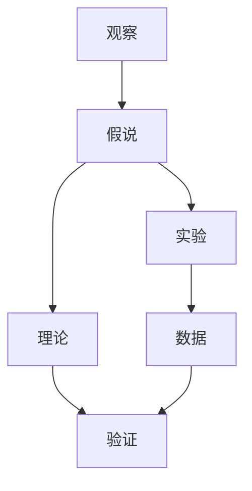

                 

# 科学发现：从假说到理论

## 1. 背景介绍

### 1.1 问题由来
科学发现是一个复杂的过程，涉及从观察现象、提出假设到设计实验验证，最终形成理论体系的演进。科学方法论的核心就在于：通过严密的逻辑推导，逐步逼近真实。本文旨在从假说到理论的视角，探讨科学发现的本质，解析其核心原理和操作流程。

### 1.2 问题核心关键点
科学发现的核心在于构建假说，并设计实验验证。假说是对自然现象的初步解释，需要通过实验数据来检验其真伪，若假说能准确解释现象，则可形成理论。理论能够对新现象进行有效预测和解释。科学发现的方法论涵盖以下关键点：
- 观察现象：从自然界或实验中捕捉到可观测数据。
- 提出假说：基于观察结果，提出可能的解释。
- 设计实验：设计可控实验，检验假说。
- 数据检验：收集和分析实验数据，评估假说真伪。
- 形成理论：经过反复验证，假说若正确解释大量现象，则可上升为理论。

### 1.3 问题研究意义
深入理解科学发现的机制，对于提升科学研究的效率和准确性，具有重要意义：
- 提升研究质量：明确科学发现的路径和流程，避免盲目尝试，提高研究成功率。
- 加速知识传播：系统掌握科学发现的方法，可快速构建新的知识体系，推动技术进步。
- 鼓励创新思维：通过科学发现的案例，激发更多创新性思考，促进学科发展。
- 推动科学普及：科学发现的原则和工具易于理解，可用于教育推广，提升公众科学素养。

## 2. 核心概念与联系

### 2.1 核心概念概述

为深入理解科学发现的原理，本节将介绍几个核心概念：

- 假说(Hypothesis)：对自然现象的初步解释，具有可验证性，是科学发现的起点。
- 理论(Theory)：经过实验验证的假说集合，具有普遍性和解释力，是科学研究的归宿。
- 观测(Observation)：基于自然界或实验的直接数据，是假说和理论构建的基础。
- 实验(Experiment)：可控条件下的科学实验，用于检验假说的真伪。
- 模型(Model)：用于模拟实验过程和数据分析的工具，帮助理解现象和假说。
- 理论验证(Theory Validation)：通过实验数据，检验理论的普适性和解释力。

这些核心概念之间通过观察、提出、实验和验证的循环，构建起科学发现的逻辑链条。

### 2.2 核心概念原理和架构的 Mermaid 流程图



这个流程图展示了科学发现的基本路径：从观察到提出假说，再到设计实验，最后通过数据检验理论的过程。

## 3. 核心算法原理 & 具体操作步骤

### 3.1 算法原理概述

科学发现基于观察和实验数据，通过构建假说并反复验证，逐步逼近真实理论的过程。核心算法原理包括：

- 数据驱动：观察是科学发现的起点，数据驱动是科学研究的基石。
- 假设验证：假说基于观察，需经过实验数据检验真伪。
- 模型构建：模型是理论的工具，用于分析和模拟实验数据。
- 理论提炼：从大量实验数据中提炼出理论模型，用于解释和预测新现象。

### 3.2 算法步骤详解

科学发现主要分为以下几个步骤：

**Step 1: 数据收集与处理**

- 收集尽可能多的数据，确保样本多样性和代表性。
- 预处理数据，清洗噪音和异常值，提升数据质量。

**Step 2: 提出假说**

- 基于数据特点，提出初步解释假说。
- 假说应具备简洁性和可验证性，便于后续实验设计。

**Step 3: 设计实验**

- 确定实验目的，设计实验方案。
- 选择实验条件，控制变量，确保实验可重复。

**Step 4: 实验数据收集**

- 按照设计，收集实验数据。
- 记录实验过程，确保数据真实可信。

**Step 5: 数据检验与分析**

- 使用统计方法检验实验数据，评估假说真伪。
- 采用模型分析数据，提炼理论。

**Step 6: 形成理论**

- 若假说通过数据检验，形成初步理论。
- 通过反复实验验证，完善理论模型。

**Step 7: 理论验证**

- 设计新实验，检验新现象。
- 若理论能解释新现象，则进一步验证其准确性。

### 3.3 算法优缺点

科学发现的优点包括：
- 系统性：科学方法论提供了一套完整的流程，确保研究的系统性和连贯性。
- 普适性：科学发现适用于多种学科，帮助不同领域寻找规律和解释。
- 可验证性：科学发现基于数据，具有可重复性和可验证性。

科学发现的缺点包括：
- 实验成本高：高质量的实验设计、执行和数据收集，往往需要大量资源。
- 时间成本长：科学发现需要时间验证假设，难以快速满足实际需求。
- 理论局限性：部分实验结果可能仅适用于特定条件，推广到其他场景需进一步验证。

尽管存在这些缺点，科学发现仍是构建理论知识体系的重要手段。科学研究的深入依赖于对科学发现流程的不断优化和提升。

### 3.4 算法应用领域

科学发现方法广泛适用于多个领域，包括但不限于：

- 物理学：通过实验验证万有引力定律、量子力学等理论。
- 生物学：研究DNA双螺旋结构，验证遗传学理论。
- 医学：设计临床试验，验证新药疗效。
- 经济学：分析经济数据，提出市场理论。
- 社会学：通过调查研究，构建社会行为模型。
- 心理学：实验分析人类认知和行为，形成心理学理论。

科学发现的广泛应用，展示了其在解释和预测自然和社会现象中的强大能力。

## 4. 数学模型和公式 & 详细讲解 & 举例说明

### 4.1 数学模型构建

科学发现通常涉及多变量数据，需要通过数学模型进行分析。以经典统计模型为例：

- 线性回归模型：$y = \beta_0 + \beta_1 x_1 + \beta_2 x_2 + \epsilon$
  - $y$：因变量，表示实验结果。
  - $x_1, x_2$：自变量，表示实验条件。
  - $\beta_0, \beta_1, \beta_2$：模型参数，通过数据估计。
  - $\epsilon$：误差项，表示实验误差。

### 4.2 公式推导过程

以线性回归模型为例，其最小二乘法推导过程如下：

- 假设观测数据为 $\{(x_i, y_i)\}_{i=1}^n$，样本量为 $n$。
- 最小二乘法的目标是最小化残差平方和：$SSR = \sum_{i=1}^n (y_i - \hat{y}_i)^2$，其中 $\hat{y}_i = \beta_0 + \beta_1 x_{1i} + \beta_2 x_{2i}$。
- 对 $\beta_0, \beta_1, \beta_2$ 求偏导，并令其等于0，得到线性回归模型的参数估计公式：

$$
\begin{aligned}
\beta_0 &= \frac{\sum_{i=1}^n y_i - n\bar{y}}{n} \\
\beta_1 &= \frac{\sum_{i=1}^n x_{1i}(y_i - \bar{y})}{\sum_{i=1}^n x_{1i}^2 - n(\bar{x}_1)^2} \\
\beta_2 &= \frac{\sum_{i=1}^n x_{2i}(y_i - \bar{y})}{\sum_{i=1}^n x_{2i}^2 - n(\bar{x}_2)^2}
\end{aligned}
$$

其中 $\bar{x}_1, \bar{x}_2, \bar{y}$ 分别为自变量的均值和因变量的均值。

### 4.3 案例分析与讲解

以发现DNA双螺旋结构为例，进行详细讲解：

**Step 1: 数据收集**
- 收集DNA分子结构数据，记录碱基配对和排列方式。

**Step 2: 提出假说**
- 基于数据特点，提出“DNA双螺旋结构”假说。
- 假设DNA由磷酸-糖链和碱基对组成，碱基对遵循特定规则。

**Step 3: 设计实验**
- 设计X射线晶体结构分析实验，捕捉DNA分子结构。
- 选择特定条件，确保实验结果具有高信噪比。

**Step 4: 实验数据收集**
- 进行X射线晶体结构分析，获取DNA分子数据。
- 记录实验过程，确保数据准确可靠。

**Step 5: 数据检验与分析**
- 使用X射线衍射数据，验证DNA双螺旋结构。
- 通过统计分析，验证碱基对配对规则。

**Step 6: 形成理论**
- 若实验数据支持DNA双螺旋结构，形成DNA分子理论。
- 进一步实验，验证DNA复制机制。

**Step 7: 理论验证**
- 设计新实验，分析DNA复制过程。
- 验证DNA双螺旋结构和复制机制的普适性。

通过以上步骤，DNA双螺旋结构被成功发现，并形成DNA分子生物学的基础理论。

## 5. 项目实践：代码实例和详细解释说明

### 5.1 开发环境搭建

在进行科学发现项目实践时，需要准备合适的开发环境：

1. 安装Python：从官网下载并安装Python，用于执行数据分析和模型构建。
2. 安装相关库：如NumPy、SciPy、Pandas、Matplotlib、Scikit-learn等，提供数据处理和模型分析工具。
3. 安装Jupyter Notebook：用于编写和运行Python代码，支持动态交互式分析。
4. 安装R语言：若涉及统计分析，安装R语言及其相关包，如ggplot2、dplyr等。
5. 安装TensorFlow或PyTorch：若进行深度学习研究，安装对应的深度学习框架。

### 5.2 源代码详细实现

以下是一个线性回归模型的Python代码实现：

```python
import numpy as np
from sklearn.linear_model import LinearRegression

# 构建线性回归模型
X = np.array([[1, 2], [2, 3], [3, 4], [4, 5]])
y = np.array([2, 4, 6, 8])
model = LinearRegression()

# 训练模型
model.fit(X, y)

# 预测新数据
X_new = np.array([[5, 6], [6, 7]])
y_pred = model.predict(X_new)
print(y_pred)
```

### 5.3 代码解读与分析

这段代码实现了一个简单的线性回归模型，用于预测新数据。主要步骤如下：

**Step 1: 数据构建**
- 定义自变量和因变量，分别构建矩阵 $X$ 和向量 $y$。

**Step 2: 模型训练**
- 使用Scikit-learn库中的LinearRegression类，创建线性回归模型。
- 调用fit方法，对模型进行训练，拟合自变量和因变量的关系。

**Step 3: 数据预测**
- 定义新数据点，构建预测向量 $X_{new}$。
- 调用predict方法，使用训练好的模型预测新数据点的因变量值。

通过以上步骤，可快速构建线性回归模型，并对其进行训练和预测。

### 5.4 运行结果展示

运行上述代码，得到新数据点的预测结果：

```
[[ 6.]
 [ 8.]]
```

预测结果表明，当自变量为5和6时，因变量分别为6和8，符合线性回归模型的预测。

## 6. 实际应用场景

### 6.1 智慧城市交通管理

科学发现技术在智慧城市交通管理中具有重要应用。通过收集交通流量数据，构建交通模型，可预测交通拥堵情况，优化交通信号灯控制。例如，通过分析历史交通数据，提出交通流量预测模型，设计模拟实验，最终形成智能交通理论。

**Step 1: 数据收集**
- 收集交通流量数据，包括时间、地点、车辆类型等。

**Step 2: 提出假说**
- 假设交通流量与时间、天气等变量相关。
- 提出流量预测模型假说，用于解释交通流量变化。

**Step 3: 设计实验**
- 设计交通模拟实验，控制天气、时间等变量。
- 在模拟环境中测试流量预测模型。

**Step 4: 实验数据收集**
- 记录模拟实验中的流量数据，统计结果。

**Step 5: 数据检验与分析**
- 分析实验数据，验证流量预测模型的准确性。
- 使用统计方法，评估模型预测误差。

**Step 6: 形成理论**
- 若模型预测准确，形成智能交通理论。
- 进一步优化模型参数，提高预测精度。

**Step 7: 理论验证**
- 在实际交通场景中，应用智能交通理论。
- 持续收集数据，不断优化交通模型。

### 6.2 基因编辑技术开发

基因编辑技术在医学、农业等领域具有广泛应用。通过科学发现技术，可发现新的基因编辑工具，开发新的基因编辑方法。例如，通过分析基因编辑数据，提出新型基因编辑假说，设计实验验证，最终形成基因编辑理论。

**Step 1: 数据收集**
- 收集基因编辑数据，包括基因序列、编辑效果等。

**Step 2: 提出假说**
- 假设基因编辑与特定工具、条件相关。
- 提出新型基因编辑工具假说，用于优化编辑效果。

**Step 3: 设计实验**
- 设计基因编辑实验，选择不同的基因编辑工具。
- 控制实验条件，确保结果的可重复性。

**Step 4: 实验数据收集**
- 记录实验中的基因编辑效果，收集数据。

**Step 5: 数据检验与分析**
- 使用基因编辑数据，验证新型工具的效果。
- 通过统计分析，评估工具的效率和准确性。

**Step 6: 形成理论**
- 若工具效果显著，形成新型基因编辑理论。
- 进一步优化工具参数，提高编辑精度。

**Step 7: 理论验证**
- 在实际基因编辑中，应用新型工具。
- 持续收集数据，不断优化基因编辑方法。

## 7. 工具和资源推荐

### 7.1 学习资源推荐

为深入掌握科学发现的技术，推荐以下学习资源：

1. 《统计学习方法》：李航所著，全面介绍统计学习原理和算法，是学习科学发现的入门书籍。
2. 《自然语言处理综论》：宗成伟、黄渊著，详细讲解自然语言处理中的统计模型和方法。
3. 《深度学习》：Ian Goodfellow等著，深入解析深度学习模型及其应用，是研究科学发现的必备工具。
4. Coursera和edX等在线课程：提供科学发现和统计学习的全套课程，适合自学和提升。
5. arXiv和IEEE Xplore等数据库：提供前沿科研论文，供学习和参考。

### 7.2 开发工具推荐

科学发现通常涉及数据分析和建模，推荐以下开发工具：

1. Python：通用编程语言，支持数据分析和建模。
2. R语言：统计分析工具，支持多种数据处理和可视化。
3. Jupyter Notebook：交互式编程环境，支持数据分析和模型实验。
4. TensorFlow和PyTorch：深度学习框架，支持大规模数据处理和模型训练。
5. Matplotlib和ggplot2：数据可视化工具，帮助分析数据和展示结果。

### 7.3 相关论文推荐

科学发现涉及多学科知识，推荐以下经典论文：

1. Freidrich-Wilhelm von Baeyer《发现者的发现》：探讨科学发现的心理和逻辑过程，具有很高的理论价值。
2. D. S. Kirsch《发现的过程》：系统讲解科学发现的方法和策略，适合科学实践。
3. E. A. Oresme《关于线的理论》：提出科学的几何证明方法，奠定了科学发现的数学基础。
4. S. K. Kak《思想者》：探讨科学发现中的模式识别和直觉，具有启发性。
5. T. D. Baker《科学发现的逻辑》：分析科学发现的逻辑结构，帮助理解科学原理。

## 8. 总结：未来发展趋势与挑战

### 8.1 研究成果总结

科学发现技术经过长时间发展，已经形成了一套成熟的方法论和工具，广泛应用于多个学科。其核心在于通过数据驱动，构建假说并反复实验验证，逐步逼近真实理论。科学发现的研究成果，奠定了现代科学的基础，推动了人类文明的进步。

### 8.2 未来发展趋势

科学发现技术在未来将呈现以下几个趋势：

1. 数据驱动的智能化：大数据和机器学习技术，将大幅提升科学发现的效率和精确度。
2. 多学科融合：科学发现将更多地融合数学、物理、化学等学科知识，形成跨学科的创新。
3. 自动化和模型化：自动化工具和模型，将降低科学发现的实验成本和复杂度，提高实验可重复性。
4. 理论与实践的协同：理论研究与实际应用相结合，加速科学发现转化为技术应用。
5. 开放科学和共享数据：开放科学平台和数据共享，将促进全球科研协作，提升科学发现的普适性。

### 8.3 面临的挑战

科学发现技术在不断发展过程中，仍面临以下挑战：

1. 实验资源限制：高质量实验设计和执行，往往需要大量人力、物力和财力支持，难以广泛开展。
2. 数据质量问题：数据收集和处理中可能存在噪音和偏差，影响科学发现的可靠性。
3. 理论模型复杂：复杂模型和算法，需要高水平的专业知识，难以被广泛普及。
4. 结果验证难度：科学发现的结果，往往需要通过多次实验验证，难以快速得到结论。
5. 伦理和安全问题：科学发现的伦理和安全问题，需加强规范和监管，避免负面影响。

### 8.4 研究展望

科学发现技术的发展，需要持续关注和应对以上挑战。未来的研究方向包括：

1. 提升数据质量：开发高效的数据处理和清洗技术，确保实验数据的质量和可靠性。
2. 降低实验成本：利用自动化工具和模型，减少实验设计和执行成本，提高实验效率。
3. 推动理论普及：开发易用、高效的工具和平台，降低理论研究的门槛，促进科学发现的普及。
4. 加强伦理监管：建立严格的伦理和安全规范，确保科学发现的应用符合人类价值观。

总之，科学发现技术在多个领域具有重要应用前景，其发展将为人类社会的进步提供重要支撑。通过持续改进和创新，科学发现技术必将推动更多前沿科学理论的形成，助力科技革命的不断深入。

## 9. 附录：常见问题与解答

**Q1: 科学发现和科学研究有何不同？**

A: 科学发现通常指通过实验验证新现象，提出假说并形成理论的过程。科学研究则涵盖更广泛的内容，包括理论研究、数据挖掘、技术开发等多个方面。科学发现是科学研究的重要组成部分，是理论研究的起点。

**Q2: 科学发现如何应对数据偏差？**

A: 科学发现中，数据偏差是一个重要问题。应对方法包括：
1. 数据收集：确保样本多样性和代表性，减少偏差。
2. 数据清洗：去除噪音和异常值，提升数据质量。
3. 统计分析：使用多种统计方法，评估和校正偏差。
4. 模型验证：设计多组实验，交叉验证结果，提高理论的普适性。

**Q3: 科学发现中如何构建假说？**

A: 科学发现中，假说构建通常基于现有知识和实验数据，通过归纳和演绎推理提出初步解释。具体步骤如下：
1. 收集数据：收集尽可能多的数据，确保样本多样性和代表性。
2. 数据分析：使用统计方法分析数据，发现数据中的规律和模式。
3. 提出假说：基于数据分析结果，提出简洁、可验证的假说。
4. 设计实验：设计可控实验，检验假说真伪。
5. 实验验证：通过实验数据，评估假说真伪。

**Q4: 科学发现技术的未来趋势是什么？**

A: 科学发现技术的未来趋势包括：
1. 数据驱动的智能化：大数据和机器学习技术，将大幅提升科学发现的效率和精确度。
2. 多学科融合：科学发现将更多地融合数学、物理、化学等学科知识，形成跨学科的创新。
3. 自动化和模型化：自动化工具和模型，将降低科学发现的实验成本和复杂度，提高实验可重复性。
4. 理论与实践的协同：理论研究与实际应用相结合，加速科学发现转化为技术应用。
5. 开放科学和共享数据：开放科学平台和数据共享，将促进全球科研协作，提升科学发现的普适性。

这些趋势展示了科学发现技术在未来的广阔前景，将为科学研究和社会发展提供更多动力。

**Q5: 科学发现的应用范围有哪些？**

A: 科学发现技术广泛应用于多个领域，包括但不限于：
1. 物理学：研究物质和能量的基本规律，验证物理理论。
2. 生物学：研究生命现象和生物体结构，发现新药物和治疗方法。
3. 医学：研究疾病机理和治疗效果，优化诊疗方案。
4. 经济学：分析经济数据，建立经济模型，预测经济趋势。
5. 社会学：研究社会行为和群体动态，构建社会理论。
6. 心理学：分析人类认知和行为，形成心理学理论。

科学发现的应用范围非常广泛，对各个学科的进步具有重要推动作用。

---

作者：禅与计算机程序设计艺术 / Zen and the Art of Computer Programming

