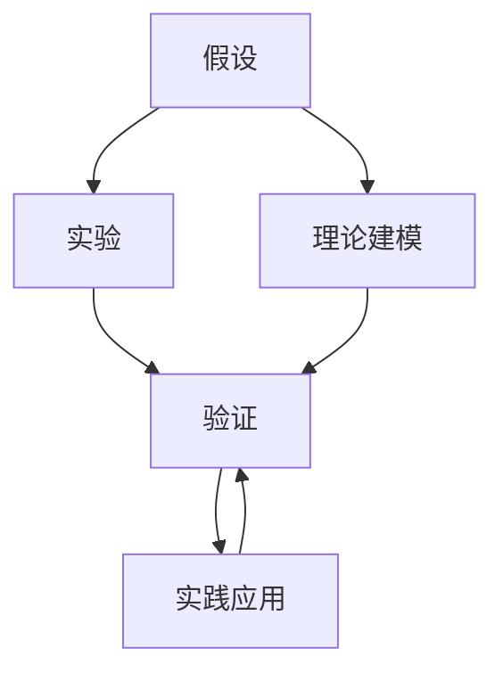
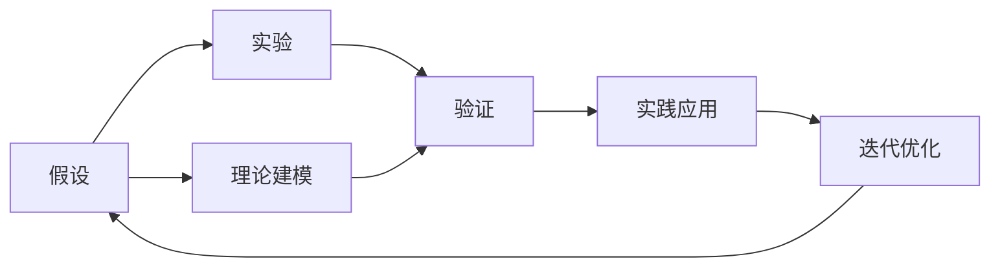

                 

## 1. 背景介绍

### 1.1 问题由来

科学研究是人类认知自然、解释世界、推动进步的基石。然而，科学发现并非一蹴而就，而是一个逐步验证、不断修正的过程。在这个过程中，科学家们经历了从假说到理论，再到实践验证的循环迭代，最终形成了对自然规律的深刻理解。

科学发现的复杂性和多维度决定了其在探索未知、揭示本质方面的重要性。在信息化时代，数据驱动和算法优化成为科学发现的强大助力，引领了科学研究方法的变革。然而，尽管如此，科学的本质——通过实验和观察验证假设、构建理论——仍未改变。本文将深入探讨科学发现的原理、方法和工具，尤其是从假说到理论的过程。

### 1.2 问题核心关键点

科学发现的核心在于建立假设、进行实验验证，以及构建理论模型。这一过程依赖于以下关键点：

- 假设构建：根据已有知识、观察和推理，提出可能的解释或假设。
- 实验验证：通过实验或观察，验证假设的正确性和可靠性。
- 理论建模：在假设和实验验证的基础上，建立并优化理论模型，以描述和预测自然现象。
- 实践应用：将理论模型应用于实际问题，进行测试和优化。
- 反复迭代：基于实践反馈，不断修正和完善理论模型。

## 2. 核心概念与联系

### 2.1 核心概念概述

为更好地理解科学发现的原理和流程，本节将介绍几个核心概念：

- 假设（Hypothesis）：基于已知事实或已有知识，提出对未知现象的初步解释。
- 实验（Experiment）：通过控制和改变变量，观察和记录实验结果，以验证假设的真实性。
- 理论（Theory）：基于实验和观察结果，构建的用以解释和预测自然现象的数学模型。
- 验证（Validation）：通过后续的实验和实践，对理论模型进行检验和修正，以确保其准确性和可靠性。
- 数据（Data）：实验和理论建模中的关键输入，反映了自然现象的真实特征。
- 算法（Algorithm）：在理论模型和数据处理中，用于自动化计算和优化的规则和步骤。

这些概念之间相互联系，共同构成了科学发现的基本框架：



### 2.2 核心概念原理和架构的 Mermaid 流程图

以下是一个简化的科学发现流程图，展示了从假设到理论，再到实践验证的全过程：



这个流程图展示了科学发现的循环迭代过程：假设基于实验和已有知识构建，通过实验验证假设的正确性，基于实验结果构建理论模型，将理论模型应用于实践验证，根据实践反馈不断迭代优化假设和理论。

## 3. 核心算法原理 & 具体操作步骤

### 3.1 算法原理概述

科学发现过程中的算法原理主要包括以下几个方面：

- 假设构建：依赖于已有的知识和观察，采用启发式方法和逻辑推理。
- 实验设计：基于统计学和实验设计原则，确定实验变量和控制条件。
- 数据处理：采用算法对实验数据进行清洗、处理和分析，提取有用的信息。
- 理论建模：利用数学和统计学算法，构建用以解释和预测自然现象的模型。
- 验证分析：使用假设检验和模型评估算法，验证理论模型的正确性和可靠性。
- 实践应用：将理论模型应用于实际问题，使用算法进行测试和优化。

### 3.2 算法步骤详解

科学发现的具体算法步骤可以概括为以下几个主要环节：

1. **数据收集**：通过观察、实验、调查等方式，收集相关数据，确保数据的真实性和代表性。
2. **数据清洗**：对收集的数据进行去重、缺失值处理、异常值检测等操作，提高数据质量。
3. **数据分析**：使用统计学和机器学习算法对数据进行分析和建模，提取有价值的信息。
4. **假设构建**：基于数据分析结果，提出初步的假设或理论模型。
5. **实验设计**：设计实验，确定实验条件和变量，确保实验的可重复性和科学性。
6. **实验执行**：执行实验，记录实验结果，确保数据的准确性和完整性。
7. **假设验证**：通过统计学和模型评估方法，验证假设的正确性和可靠性。
8. **理论构建**：在假设验证的基础上，构建正式的理论模型，以解释和预测自然现象。
9. **实践应用**：将理论模型应用于实际问题，进行测试和优化，验证模型的有效性。
10. **迭代优化**：基于实践反馈，不断修正和完善理论模型，提升其准确性和可靠性。

### 3.3 算法优缺点

科学发现算法具有以下优点：

- 系统性：通过逐步验证和修正，确保假设和理论模型的准确性和可靠性。
- 全面性：结合实验和数据分析，全面理解自然现象的本质。
- 可重复性：实验设计和数据处理的标准化，确保研究结果的可重复性。

然而，科学发现算法也存在一些局限性：

- 时间成本高：从数据收集、实验设计到验证分析，每一环节都需要大量时间和资源。
- 实验偏差：实验设计不当可能导致结果偏差，影响假设的准确性。
- 数据噪声：数据清洗和处理过程中可能引入噪声，影响分析结果。
- 假设局限：基于现有知识和观察构建的假设可能存在局限性，影响理论的普适性。
- 理论复杂性：构建的理论模型可能过于复杂，难以理解和应用。

### 3.4 算法应用领域

科学发现算法在多个领域得到了广泛应用，以下是几个典型应用：

1. **生物医学研究**：通过实验验证和理论建模，发现疾病的病因、治疗方法和药物作用机制。
2. **天文学**：利用望远镜和光谱仪收集数据，建立天体运动和结构理论，研究宇宙起源和演化。
3. **物理学**：通过实验和理论计算，验证物理定律，发现新物质和现象，推动物理学的发展。
4. **化学**：利用实验和模拟，研究化学反应和分子结构，开发新材料和新药物。
5. **地质学**：通过野外实验和室内分析，建立地质过程和资源评价模型，评估地球环境和资源利用。
6. **气象学**：利用气象观测数据和气候模型，预测天气变化和气候趋势，研究气候变化机制。

这些应用展示了科学发现算法在不同领域的重要性和价值。

## 4. 数学模型和公式 & 详细讲解 & 举例说明

### 4.1 数学模型构建

科学发现中常用的数学模型包括：

- 统计学模型：用于描述数据分布和相关性，如线性回归模型、方差分析模型等。
- 机器学习模型：用于分类、回归和聚类等任务，如决策树、随机森林、神经网络等。
- 动力学模型：用于描述物理系统和动态过程，如牛顿力学模型、热力学模型等。
- 生态学模型：用于描述生态系统和生物种群，如种群增长模型、食物链模型等。

以线性回归模型为例，其基本形式为：

$$
y = \beta_0 + \beta_1 x_1 + \beta_2 x_2 + \epsilon
$$

其中，$y$ 为因变量，$x_1, x_2$ 为自变量，$\beta_0, \beta_1, \beta_2$ 为模型参数，$\epsilon$ 为误差项。

### 4.2 公式推导过程

线性回归模型的推导过程如下：

1. **假设模型**：假设因变量 $y$ 与自变量 $x_1, x_2$ 之间存在线性关系，形式为 $y = \beta_0 + \beta_1 x_1 + \beta_2 x_2$。
2. **最小二乘法**：通过最小化残差平方和 $\sum_{i=1}^n (y_i - \hat{y}_i)^2$，求解模型参数 $\beta_0, \beta_1, \beta_2$。
3. **参数估计**：通过解方程 $\sum_{i=1}^n (y_i - \hat{y}_i)^2$ 的最小化问题，得到模型参数的估计值。
4. **模型验证**：通过验证数据，评估模型预测的准确性和可靠性，确保模型的有效性。

### 4.3 案例分析与讲解

以研究药物剂量与疗效之间的关系为例：

- **数据收集**：收集不同剂量下的药物疗效数据，包括患者年龄、体重等特征。
- **数据清洗**：去除异常值，确保数据的准确性和完整性。
- **数据分析**：使用线性回归模型，分析药物剂量与疗效之间的关系。
- **假设构建**：基于数据分析结果，构建药物剂量与疗效之间的线性关系假设。
- **实验设计**：设计新的药物剂量试验，验证假设的正确性。
- **实验执行**：执行新的药物剂量试验，记录实验结果。
- **假设验证**：通过统计学方法，验证药物剂量与疗效之间的线性关系。
- **理论构建**：在假设验证的基础上，构建药物剂量与疗效之间的关系模型。
- **实践应用**：将模型应用于临床实践，验证模型的有效性。
- **迭代优化**：基于临床反馈，不断修正和完善模型，提升其准确性和可靠性。

## 5. 项目实践：代码实例和详细解释说明

### 5.1 开发环境搭建

在进行科学发现项目实践前，我们需要准备好开发环境。以下是使用Python进行Pandas和Scikit-learn开发的简单环境配置流程：

1. 安装Anaconda：从官网下载并安装Anaconda，用于创建独立的Python环境。

2. 创建并激活虚拟环境：
```bash
conda create -n discovery-env python=3.8 
conda activate discovery-env
```

3. 安装相关库：
```bash
conda install pandas numpy scikit-learn matplotlib tqdm jupyter notebook ipython
```

4. 安装工具包：
```bash
pip install numpy pandas scikit-learn matplotlib tqdm jupyter notebook ipython
```

完成上述步骤后，即可在`discovery-env`环境中开始项目实践。

### 5.2 源代码详细实现

以下是一个简单的线性回归模型实现示例，用于描述药物剂量与疗效之间的关系：

```python
import pandas as pd
import numpy as np
from sklearn.linear_model import LinearRegression
from sklearn.model_selection import train_test_split
from sklearn.metrics import mean_squared_error

# 数据集
data = pd.read_csv('drug_dose.csv')

# 数据清洗
data = data.dropna()

# 特征工程
X = data[['dose', 'age', 'weight']]
y = data['effect']

# 划分数据集
X_train, X_test, y_train, y_test = train_test_split(X, y, test_size=0.2, random_state=42)

# 模型训练
model = LinearRegression()
model.fit(X_train, y_train)

# 模型评估
y_pred = model.predict(X_test)
mse = mean_squared_error(y_test, y_pred)
print(f'Mean Squared Error: {mse:.2f}')

# 模型应用
new_data = pd.DataFrame({'dose': [10, 15, 20], 'age': [30, 40, 50], 'weight': [70, 80, 90]})
prediction = model.predict(new_data)
print(prediction)
```

### 5.3 代码解读与分析

让我们再详细解读一下关键代码的实现细节：

**数据集处理**：
- `pd.read_csv`：从CSV文件中读取数据集。
- `data.dropna()`：去除数据中的缺失值。

**特征工程**：
- `X = data[['dose', 'age', 'weight']]`：选择需要的特征，构建输入矩阵X。
- `y = data['effect']`：选择因变量，构建目标向量y。

**模型训练**：
- `train_test_split`：将数据集划分为训练集和测试集。
- `LinearRegression`：使用线性回归模型。
- `model.fit(X_train, y_train)`：在训练集上拟合模型。

**模型评估**：
- `mean_squared_error`：计算均方误差，评估模型性能。

**模型应用**：
- `pd.DataFrame`：创建新的数据帧，用于模型预测。
- `model.predict(new_data)`：在新的数据上预测疗效。

**结果输出**：
- `print(prediction)`：输出预测结果。

## 6. 实际应用场景

### 6.1 生物医学研究

在生物医学研究中，基于科学发现算法构建的模型广泛应用于药物研发、疾病诊断和治疗方案优化等方面。例如，通过实验数据和理论模型，科学家们可以预测药物的有效性和副作用，优化药物配方，设计个性化的治疗方案。

### 6.2 天文学研究

天文学领域中，科学家们通过望远镜收集大量的光谱和图像数据，利用科学发现算法构建星体运动和结构模型，研究宇宙的起源和演化，发现新的恒星和星系，揭示黑洞等宇宙奇观的神秘本质。

### 6.3 物理学研究

物理学研究中，科学家们通过实验和理论计算，验证牛顿力学、量子力学等物理定律，发现新物质和现象，推动了原子物理、核物理、量子计算等领域的飞速发展。

### 6.4 未来应用展望

未来，科学发现算法将在更多领域得到应用，为人类认知智能的进化带来深远影响：

1. **人工智能与科学发现结合**：结合深度学习和科学发现算法，构建智能科学助手，加速科研发现过程，提升科研效率。
2. **跨领域应用拓展**：科学发现算法将应用于更多领域，如化学、材料科学、社会学等，推动科学技术的全面进步。
3. **大数据与科学发现**：利用大数据和分布式计算技术，加速数据处理和模型构建，提升科学发现的效率和精度。
4. **个性化与定制化**：基于科学发现算法，构建个性化和定制化的科研工具，满足不同科研人员的需求。
5. **多学科融合**：将科学发现算法与其他学科的先进技术结合，推动交叉学科的发展，提升整体科研水平。

## 7. 工具和资源推荐

### 7.1 学习资源推荐

为了帮助开发者系统掌握科学发现算法的基本原理和实践技巧，这里推荐一些优质的学习资源：

1. 《科学发现与创新：方法论》书籍：详细介绍了科学发现的基本原理、方法和工具，适用于科研人员和数据科学家。
2. Coursera《统计学方法》课程：由斯坦福大学开设的统计学课程，涵盖统计学基础知识和高级统计方法，适用于各类科研人员。
3. Kaggle数据科学竞赛：参与实际项目，通过数据处理、模型构建和结果分析，提升科学发现算法的实践能力。
4. Scikit-learn官方文档：详细介绍了Scikit-learn库中的科学发现算法和工具，适用于机器学习和数据科学领域的实践者。
5. GitHub开源项目：众多科学家和工程师的科学发现算法项目，提供了丰富的学习和实践资源。

通过对这些资源的学习实践，相信你一定能够系统掌握科学发现算法的精髓，并用于解决实际的科研问题。

### 7.2 开发工具推荐

高效的开发离不开优秀的工具支持。以下是几款用于科学发现算法开发的常用工具：

1. Python：功能强大的编程语言，支持科学计算和数据分析，是科学发现算法的首选。
2. Jupyter Notebook：交互式的数据分析和模型构建环境，支持代码编写和结果展示。
3. Matplotlib：用于绘制数据可视化图表，帮助科研人员直观展示数据分析结果。
4. Pandas：用于数据清洗和处理，提供了强大的数据操作和分析工具。
5. Scikit-learn：提供了丰富的科学发现算法和工具，支持快速原型开发和模型评估。
6. TensorFlow和PyTorch：支持深度学习和模型优化，适用于复杂的科学发现任务。

合理利用这些工具，可以显著提升科学发现算法的开发效率，加快创新迭代的步伐。

### 7.3 相关论文推荐

科学发现算法的发展源于学界的持续研究。以下是几篇奠基性的相关论文，推荐阅读：

1. 《统计学习基础》（Elements of Statistical Learning）：详细介绍了统计学习的基础理论和方法，是统计学和数据科学领域的经典教材。
2. 《机器学习》（Pattern Recognition and Machine Learning）：介绍了机器学习的基本概念、算法和应用，适用于数据科学和人工智能领域的从业者。
3. 《深度学习》（Deep Learning）：介绍了深度学习的基本原理和应用，适用于人工智能和计算机视觉领域的实践者。
4. 《数据挖掘：概念与技术》（Data Mining Concepts and Techniques）：介绍了数据挖掘的基本方法和技术，适用于数据科学和机器学习领域的从业者。
5. 《物理学中的统计力学》（Statistical Mechanics）：介绍了统计力学的基本理论和应用，适用于物理学家和工程师。

这些论文代表了科学发现算法的发展脉络。通过学习这些前沿成果，可以帮助研究者把握学科前进方向，激发更多的创新灵感。

## 8. 总结：未来发展趋势与挑战

### 8.1 总结

本文对科学发现算法的原理、方法和工具进行了全面系统的介绍。首先阐述了科学发现的核心流程和关键点，明确了从假设构建到理论建模的全过程。其次，从原理到实践，详细讲解了科学发现算法的数学模型和操作步骤，给出了科学发现任务开发的完整代码实例。同时，本文还探讨了科学发现算法在多个领域的应用前景，展示了其巨大的潜力。此外，本文精选了科学发现算法的各类学习资源，力求为读者提供全方位的技术指引。

通过本文的系统梳理，可以看到，科学发现算法在探索未知、揭示本质方面的重要性。在信息化时代，科学发现算法结合数据驱动和算法优化，引领了科学研究方法的变革，成为人类认知智能进化的重要推动力。

### 8.2 未来发展趋势

展望未来，科学发现算法将呈现以下几个发展趋势：

1. **数据驱动**：随着数据量的不断增加，科学发现算法将越来越依赖于大规模数据集。数据的收集、清洗和处理将成为科学研究的核心环节。
2. **模型自动化**：通过自动化模型构建和优化，减少科研人员的手动干预，提升科研效率。
3. **跨学科融合**：科学发现算法将与其他学科的先进技术结合，推动交叉学科的发展，提升整体科研水平。
4. **算法优化**：通过优化算法效率和效果，提升科学发现算法的精度和可靠性。
5. **开放共享**：建立开放的数据和算法共享平台，促进科研人员的协作和交流，加速科研发现过程。

这些趋势将推动科学发现算法不断向前发展，为人类认知智能的进化带来深远影响。

### 8.3 面临的挑战

尽管科学发现算法已经取得了瞩目成就，但在迈向更加智能化、普适化应用的过程中，它仍面临诸多挑战：

1. **数据质量**：数据收集和处理中的质量问题，可能导致结果的偏差和误导。如何提高数据质量，确保结果的可靠性，将是重要挑战。
2. **模型复杂性**：复杂的模型可能导致计算和存储成本的增加，影响模型的实际应用。如何平衡模型复杂性和计算效率，仍是重要研究方向。
3. **算法偏见**：科学发现算法可能学习到数据中的偏见，影响模型的公平性和公正性。如何消除算法偏见，确保模型的公平性，将是重要研究方向。
4. **伦理道德**：科学发现算法可能涉及敏感数据和伦理问题，如何保护数据隐私和伦理道德，将是重要挑战。
5. **技术壁垒**：科学发现算法需要跨学科的知识和技术，如何降低技术壁垒，促进跨学科的合作和创新，将是重要研究方向。

这些挑战需要我们不断探索和创新，才能推动科学发现算法向更加智能、普适、公平和可靠的方向发展。

### 8.4 研究展望

面对科学发现算法面临的挑战，未来的研究需要在以下几个方面寻求新的突破：

1. **数据质量提升**：通过改进数据收集和处理技术，提高数据质量，确保结果的可靠性和准确性。
2. **模型简化与优化**：通过算法简化和优化，提升模型效率和效果，降低计算和存储成本。
3. **算法公平性**：通过算法设计和调整，消除数据和模型中的偏见，确保公平性和公正性。
4. **伦理与隐私保护**：建立伦理审查和隐私保护机制，确保数据使用的合法性和安全性。
5. **跨学科合作**：促进跨学科的合作和交流，推动科学发现算法的创新和应用。

这些研究方向将引领科学发现算法向更加智能、普适、公平和可靠的方向发展，推动人类认知智能的进化。总之，科学发现算法需要在数据、算法、伦理等多个维度进行全面优化，才能真正实现其巨大潜力。

## 9. 附录：常见问题与解答

**Q1：如何理解科学发现过程中的假设构建？**

A: 假设构建是科学发现过程中的重要环节，基于已知事实或已有知识，提出对未知现象的初步解释。例如，药物剂量与疗效之间的关系，科学家们通过观察和推理，提出药物剂量增加时疗效会提升的假设。这一假设需要经过实验验证，确保其正确性和可靠性。

**Q2：科学发现算法是否适用于所有领域？**

A: 科学发现算法在自然科学领域中广泛应用，但对于社会科学、艺术等领域，其适用性有限。这些领域的发现过程更多依赖于人类直觉和经验，难以通过算法进行验证和优化。

**Q3：科学发现算法中的实验设计需要注意哪些问题？**

A: 实验设计需要确保实验条件和变量的可控性和可重复性，避免实验偏差和结果误导。同时，实验设计还需要考虑样本大小、随机化和盲法等因素，确保实验结果的可靠性和有效性。

**Q4：如何验证科学发现算法中的理论模型？**

A: 理论模型需要通过后续的实验和实践验证，确保其正确性和可靠性。常用的验证方法包括交叉验证、留一法、留多法等，确保模型在新数据上的表现。

**Q5：科学发现算法在实践应用中需要注意哪些问题？**

A: 科学发现算法在实践应用中需要注意数据质量、模型复杂性、算法偏见、伦理道德等问题。通过不断优化算法和数据处理技术，确保模型的准确性和可靠性。

---

作者：禅与计算机程序设计艺术 / Zen and the Art of Computer Programming

