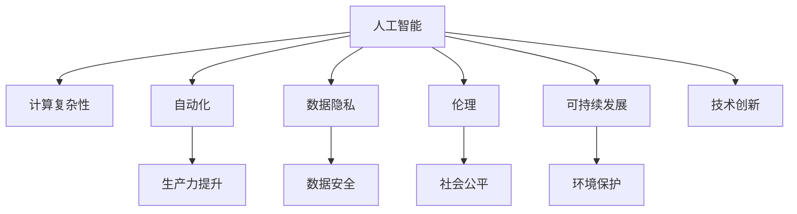

                 

# 科技与社会：人类计算的双重影响与思考

> 关键词：人工智能,社会影响,计算复杂性,人类智能,自动化,数据隐私,伦理,可持续发展

## 1. 背景介绍

### 1.1 问题由来
在现代科技的推动下，计算能力已经从过去难以想象的庞大机器计算，发展为小型化的芯片计算，再到如今的云端、边缘计算。这种转变不仅极大地提升了计算效率，还引发了一系列深刻的社会变化。人工智能(AI)作为现代计算的重要应用之一，其发展更是深刻地影响着人类社会的各个方面。

### 1.2 问题核心关键点
本文聚焦于人工智能，特别是计算复杂性和人类智能之间的关系，以及这些关系对社会的多重影响。重点探讨：
- 人工智能的计算能力如何影响人类的社会结构和经济体系。
- 人工智能带来的自动化和数据隐私问题。
- 如何平衡技术进步与伦理道德。
- 人工智能与可持续发展之间的潜在冲突。
- 未来人工智能发展的方向与挑战。

### 1.3 问题研究意义
研究人工智能的社会影响，对于预测技术发展的未来趋势，理解人类与技术的关系，以及在技术进步中确保公平与可持续性，具有重要意义。

## 2. 核心概念与联系

### 2.1 核心概念概述

为更好地理解人工智能的计算复杂性和社会影响，本节将介绍几个关键概念及其相互联系：

- **人工智能(Artificial Intelligence, AI)**：利用算法和计算能力模拟人类智能的机器系统，如机器学习、深度学习、自然语言处理等。
- **计算复杂性(Computational Complexity)**：描述算法解决问题所需的时间或资源。
- **自动化(Automation)**：通过AI技术，将复杂或重复性任务自动化，减少人力需求。
- **数据隐私(Data Privacy)**：保护个人信息不被未经授权地收集、使用或共享。
- **伦理(Ethics)**：与AI相关的道德规范和行为准则，如公平性、透明性、责任性等。
- **可持续发展(Sustainable Development)**：在发展经济的同时，保护环境，确保资源可持续利用。

这些概念之间的逻辑关系可以通过以下Mermaid流程图来展示：



这个流程图展示了人工智能的计算复杂性与自动化、数据隐私、伦理、可持续发展之间的相互影响和关系：

1. 计算复杂性决定了自动化和数据隐私的实现难度。
2. 自动化和技术创新促进了生产力提升和社会公平。
3. 数据隐私和伦理保护了个人信息和社会的公平性。
4. 可持续发展与技术创新和环境保护密切相关。

## 3. 核心算法原理 & 具体操作步骤
### 3.1 算法原理概述

人工智能的核心在于利用计算复杂性解决现实问题，其算法原理主要基于统计学和机器学习的数学模型。以机器学习为例，其基本流程包括：

1. **数据预处理**：对原始数据进行清洗、标注和划分。
2. **模型训练**：通过大量的数据训练模型，使其能够学习到数据的分布规律。
3. **模型评估**：使用测试集评估模型的性能，调整参数以提高准确性。
4. **模型部署**：将训练好的模型应用到实际场景中，进行问题求解。

### 3.2 算法步骤详解

具体步骤包括：

**Step 1: 数据收集与预处理**
- 确定任务需求，收集相关的数据。
- 清洗数据，去除噪声和不相关项。
- 标注数据，提供训练集和测试集。

**Step 2: 选择合适的模型**
- 根据任务类型，选择适合的机器学习模型（如线性回归、决策树、神经网络等）。
- 确定模型的参数和超参数，如学习率、批大小等。

**Step 3: 模型训练**
- 使用训练集训练模型，调整参数以最小化损失函数。
- 使用交叉验证等技术，防止过拟合。

**Step 4: 模型评估**
- 使用测试集评估模型性能，计算准确率、召回率等指标。
- 调整模型参数，进一步优化性能。

**Step 5: 模型部署**
- 将训练好的模型应用到实际问题中。
- 持续监控模型性能，及时更新和维护。

### 3.3 算法优缺点

人工智能的算法具有以下优点：

- **高效**：利用计算能力，可以快速处理大量数据。
- **可扩展性**：可以通过增加数据和计算资源来提升性能。
- **准确性**：在大规模数据和复杂模型下，能够提供高精度的预测和决策。

同时，算法也存在以下缺点：

- **复杂度**：模型训练和部署过程复杂，需要专业知识。
- **数据依赖**：模型性能高度依赖于数据质量和数量。
- **解释性不足**：黑盒模型难以解释其内部决策过程。
- **隐私风险**：数据泄露和隐私侵犯的风险较高。

### 3.4 算法应用领域

人工智能在多个领域中得到了广泛应用，如：

- **医疗**：利用机器学习进行疾病诊断、药物研发等。
- **金融**：通过预测分析、风险控制等提高金融服务效率。
- **交通**：利用自动驾驶技术提升交通安全和效率。
- **制造**：实现智能制造，提高生产效率和质量。
- **教育**：个性化学习推荐，提升教育效果。
- **农业**：农业智能化，提高产量和资源利用率。
- **娱乐**：智能推荐系统，个性化内容推荐。

## 4. 数学模型和公式 & 详细讲解 & 举例说明
### 4.1 数学模型构建

以线性回归为例，其数学模型为：

$$
y = \theta_0 + \theta_1 x_1 + \theta_2 x_2 + ... + \theta_n x_n
$$

其中 $y$ 为目标变量，$x_i$ 为自变量，$\theta_i$ 为模型参数。

### 4.2 公式推导过程

根据最小二乘法，模型参数的优化目标为：

$$
\min_{\theta} \frac{1}{2N} \sum_{i=1}^N (y_i - \theta_0 - \theta_1 x_{1i} - ... - \theta_n x_{ni})^2
$$

求解上述优化问题，得到参数估计值：

$$
\hat{\theta} = (X^T X)^{-1} X^T y
$$

其中 $X$ 为自变量矩阵，$y$ 为目标变量向量。

### 4.3 案例分析与讲解

以房价预测为例，利用线性回归模型预测房价。假设已有多个房屋的数据，包含房屋面积、房间数等特征，以及房价数据。通过收集数据、特征工程、模型训练等步骤，可以得到房价预测模型。该模型可以在新房屋的数据上实现房价预测，有效提升了房地产评估的效率和准确性。

## 5. 项目实践：代码实例和详细解释说明
### 5.1 开发环境搭建

为了进行机器学习模型的开发和实验，首先需要搭建开发环境。以下是Python环境配置的步骤：

1. 安装Anaconda：从官网下载并安装Anaconda，用于创建独立的Python环境。

2. 创建并激活虚拟环境：
```bash
conda create -n ml-env python=3.8 
conda activate ml-env
```

3. 安装必要的Python包：
```bash
pip install numpy pandas scikit-learn matplotlib
```

4. 安装机器学习框架和库：
```bash
pip install scikit-learn tensorflow pytorch
```

5. 安装可视化工具：
```bash
pip install matplotlib seaborn
```

完成以上步骤后，即可在`ml-env`环境中开始机器学习实践。

### 5.2 源代码详细实现

以下是利用Python和scikit-learn库进行线性回归模型开发的代码实现：

```python
import numpy as np
from sklearn.linear_model import LinearRegression
from sklearn.model_selection import train_test_split
from sklearn.metrics import mean_squared_error

# 准备数据
X = np.array([[4, 3], [2, 2], [3, 2], [5, 4]])
y = np.array([2000, 2200, 2300, 2500])

# 划分数据集
X_train, X_test, y_train, y_test = train_test_split(X, y, test_size=0.2, random_state=42)

# 建立模型
model = LinearRegression()

# 训练模型
model.fit(X_train, y_train)

# 预测并评估
y_pred = model.predict(X_test)
mse = mean_squared_error(y_test, y_pred)
print(f"均方误差：{mse:.2f}")
```

### 5.3 代码解读与分析

**数据准备**：
- 使用NumPy创建特征矩阵$X$和目标变量向量$y$。

**数据划分**：
- 使用train_test_split将数据划分为训练集和测试集，以验证模型性能。

**模型建立**：
- 使用scikit-learn的LinearRegression类建立线性回归模型。

**模型训练**：
- 使用fit方法训练模型，自动拟合特征和目标变量之间的关系。

**模型评估**：
- 使用预测得到的$y_pred$和实际目标变量$y_test$计算均方误差，评估模型性能。

## 6. 实际应用场景
### 6.1 医疗领域

在医疗领域，人工智能的计算能力可以用于疾病诊断、药物研发等。例如，通过分析患者的症状和历史数据，AI模型可以预测疾病风险，提供个性化的治疗方案。这种自动化和高效性的提升，大大减轻了医生的工作负担，提高了诊疗质量。

### 6.2 金融行业

金融行业利用AI模型进行风险评估、信用评分等，大幅提升了金融服务效率和准确性。AI系统可以处理海量交易数据，及时发现异常交易，防范欺诈行为。

### 6.3 自动驾驶

自动驾驶技术结合了计算机视觉、深度学习等，通过计算复杂性实现对道路环境的高效感知和决策。这不仅提升了交通安全性，还降低了交通事故的发生率。

### 6.4 未来应用展望

未来，人工智能将在更多领域发挥作用：

- **智能制造**：通过机器学习优化生产流程，提高生产效率和质量。
- **智能城市**：利用AI技术优化城市管理，提升公共服务水平。
- **智能教育**：个性化学习推荐，提高教育效果，促进教育公平。
- **环境保护**：通过AI技术监测环境变化，实现智能资源管理。

## 7. 工具和资源推荐
### 7.1 学习资源推荐

为了深入理解人工智能及其应用，这里推荐几本优秀的书籍和在线课程：

- 《人工智能导论》（Artificial Intelligence: A Modern Approach）：全面的AI教材，覆盖了机器学习、深度学习、自然语言处理等基本概念和算法。
- 《Python机器学习》（Python Machine Learning）：介绍Python在机器学习中的应用，包括数据预处理、模型训练、模型评估等。
- 《深度学习》（Deep Learning）：Ian Goodfellow等撰写的深度学习圣经，涵盖了深度学习的基础理论和实践技巧。
- 斯坦福大学的机器学习课程（CS229）：提供深度讲解和实践，是入门机器学习的重要资源。
- Coursera上的机器学习课程（Andrew Ng主讲）：系统介绍了机器学习的基本概念和算法。

### 7.2 开发工具推荐

以下是几款常用的AI开发工具：

- **TensorFlow**：由Google开发，支持分布式计算和高效模型训练。
- **PyTorch**：Facebook开发，提供灵活的动态计算图，适合快速原型开发。
- **Scikit-learn**：Python的机器学习库，提供了简单易用的模型接口和评估工具。
- **Jupyter Notebook**：交互式编程环境，适合数据分析和模型开发。
- **Keras**：高层次的神经网络库，易于使用和部署。

### 7.3 相关论文推荐

以下是几篇具有代表性的AI相关论文，推荐阅读：

- **深度学习**（Deep Learning）：Yann LeCun等，Nature 2015，介绍了深度学习的基本概念和算法。
- **机器学习：一种现代的方法**（Machine Learning: A Probabilistic Perspective）：K Murphy，介绍了机器学习的概率视角和算法。
- **神经网络与深度学习**（Neural Networks and Deep Learning）：Michael Nielsen，介绍神经网络和深度学习的原理和实现。
- **AlphaGo论文**（Playing Atari 2048 with Deep Reinforcement Learning）：David Silver等，展示了深度强化学习在复杂游戏中的应用。

## 8. 总结：未来发展趋势与挑战
### 8.1 研究成果总结

人工智能的计算能力已经深刻改变了社会的各个方面，推动了自动化、数据隐私、伦理道德、可持续发展等重要议题的讨论。其主要成果包括：

- 自动化提升了生产效率，降低了成本。
- 数据隐私和伦理保护成为社会共识。
- 可持续发展成为未来技术发展的方向。

### 8.2 未来发展趋势

未来，人工智能的发展趋势可能包括：

- **计算能力的持续提升**：硬件技术的进步将大幅提升计算速度和容量。
- **多模态融合**：结合计算机视觉、自然语言处理、语音识别等技术，实现更全面的智能应用。
- **联邦学习**：分布式计算环境下，各节点协同训练模型，保护数据隐私。
- **自动化伦理**：AI系统将具备更强的伦理判断能力，避免不道德的行为。

### 8.3 面临的挑战

尽管人工智能带来了诸多便利，但也面临以下挑战：

- **计算资源消耗**：大规模模型的训练和部署需要大量的计算资源。
- **数据隐私保护**：如何保护数据隐私，防止数据泄露和滥用。
- **伦理道德困境**：AI系统的决策过程可能涉及伦理道德问题，如何确保公平、透明。
- **可持续发展**：AI技术的广泛应用可能导致环境问题，如何实现可持续发展。

### 8.4 研究展望

未来研究需要在以下几个方面寻求新的突破：

- **计算效率提升**：探索更加高效的计算模型和算法，降低计算资源消耗。
- **数据隐私保护**：开发更安全的数据加密和匿名化技术，保护用户隐私。
- **伦理道德规范**：构建AI系统的伦理框架，确保决策的公平性和透明度。
- **环境友好技术**：研究AI与环境保护的协同技术，实现可持续发展。

## 9. 附录：常见问题与解答

**Q1: 人工智能是否会导致失业？**

A: 人工智能可能会替代一些重复性、低技能的工作，但同时也将创造新的就业机会，如AI系统的开发、维护和管理等。

**Q2: 人工智能会带来隐私风险吗？**

A: 是的，AI系统通常需要大量的数据进行训练，如果这些数据泄露或被滥用，将对个人隐私造成威胁。

**Q3: 人工智能的应用有哪些？**

A: 人工智能在医疗、金融、交通、制造、教育、环境保护等多个领域都有广泛应用。

**Q4: 如何保护数据隐私？**

A: 采用数据加密、匿名化等技术，限制数据的访问权限，避免数据泄露和滥用。

**Q5: 人工智能的未来发展方向是什么？**

A: 未来人工智能将进一步结合多模态技术、联邦学习、自动化伦理等，推动社会的全面智能化发展。

---

作者：禅与计算机程序设计艺术 / Zen and the Art of Computer Programming

