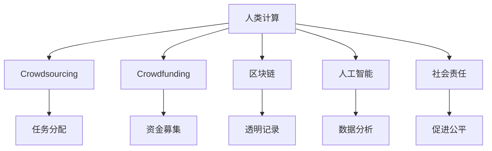

                 

# 科技向善的力量：利用人类计算造福人类

> 关键词：人类计算, 科技伦理, 人工智能, 社会责任, 可持续发展

## 1. 背景介绍

### 1.1 问题由来

在过去的几十年里，人工智能(AI)和计算机科学取得了飞速发展，为我们带来了前所未有的便利和创新。然而，随着技术的不断进步，科技伦理和社会责任问题逐渐成为社会各界关注的焦点。如何在享受科技进步的同时，避免技术的滥用和带来的负面影响，是摆在我们面前的重大课题。

人类计算（Human Computing）是一种全新的计算范式，利用人类的智慧和创造力，将复杂问题简化、自动化。通过结合人类计算与人工智能技术，我们有望找到一种更智能、更公平、更可持续的计算方式，实现科技向善的伟大目标。

### 1.2 问题核心关键点

人类计算的核心在于将人的智慧和机器的计算能力有机结合，通过众包、众筹等形式，集结全球智慧，解决复杂问题。以下是人类计算的主要关键点：

- **众包平台**：如Amazon Mechanical Turk、CrowdFlower等，提供平台让人们在线上完成任务。
- **众筹平台**：如Kickstarter、Indiegogo等，通过众筹方式募集资金，支持创新项目。
- **区块链技术**：用于去中心化记录和验证任务完成情况，确保公平透明。
- **用户生成内容（UGC）**：利用用户贡献的创意和数据，提高系统的智能水平。
- **计算外包**：将复杂计算任务外包给专业化机构，如超级计算中心、国家计算中心等。

这些技术手段共同构成了人类计算的基础设施，使得个体智慧能够高效地转化为大规模的社会行动。通过合理设计机制和政策，人类计算有望成为推动科技向善、促进社会进步的重要力量。

### 1.3 问题研究意义

研究人类计算的伦理、社会影响和可持续发展路径，具有以下重要意义：

- **科技伦理**：确保技术应用的公平性和透明性，避免科技滥用。
- **社会责任**：利用技术提升社会福利，促进教育、健康、环保等领域的发展。
- **可持续发展**：通过全球智慧和资源的整合，实现环境友好和可持续的计算方式。
- **文化多样性**：促进全球文化交流，保护人类文化遗产和多样性。
- **经济发展**：激发创新，促进新兴产业和就业机会的增长。

通过深入探索人类计算的潜力，我们有望找到一条科技向善的道路，让计算机科学更好地服务于人类社会。

## 2. 核心概念与联系

### 2.1 核心概念概述

为更好地理解人类计算的应用与伦理，本节将介绍几个关键概念：

- **人类计算（Human Computing）**：通过集结人的智慧与机器的计算能力，共同解决复杂问题。
- **众包（Crowdsourcing）**：通过互联网平台，将任务外包给大众完成，利用众人的智慧和资源。
- **众筹（Crowdfunding）**：通过互联网平台，募集资金支持项目开发，实现小众需求的大规模化。
- **区块链（Blockchain）**：去中心化的分布式账本技术，用于记录和验证任务完成情况。
- **人工智能（AI）**：通过机器学习、深度学习等技术，模拟人类智能，进行数据分析和决策。
- **社会责任（Social Responsibility）**：企业在发展过程中，应承担相应的社会责任，促进社会公平和可持续发展。

这些核心概念构成了人类计算的基本框架，其逻辑关系可通过以下Mermaid流程图进行展示：



这个流程图展示了人类计算各组成部分的联系与互动，每个部分都有其独特的功能，共同推动计算向善。

## 3. 核心算法原理 & 具体操作步骤

### 3.1 算法原理概述

人类计算的核心理论是基于众包和众筹的协同机制，通过人工智能进行任务管理和数据分析，实现大规模智慧的整合与利用。其核心在于：

1. **任务分配与完成**：通过众包平台，将任务分配给大众，利用众人的智慧和资源。
2. **资金募集与支持**：通过众筹平台，募集资金支持项目开发，确保资源投入。
3. **透明记录与验证**：利用区块链技术，记录和验证任务完成情况，确保公平透明。
4. **数据分析与优化**：通过人工智能算法，分析任务完成数据，优化任务分配和资金分配。

人类计算的目标是通过上述机制，实现全球智慧的最大化利用，解决复杂问题，提升社会福祉。

### 3.2 算法步骤详解

基于上述原理，人类计算的步骤可以概括如下：

1. **任务定义与描述**：明确任务目标和要求，制定详细的任务描述和指标。
2. **任务分配与调度**：利用众包平台，将任务分配给合适的参与者，并调度资源。
3. **资金募集与管理**：通过众筹平台，募集项目所需资金，并监控资金使用情况。
4. **任务执行与反馈**：参与者执行任务，并定期提交进度和结果，管理员进行反馈和调整。
5. **数据分析与优化**：利用人工智能算法，分析任务完成数据，优化任务分配和资金分配。
6. **结果汇总与验证**：利用区块链技术，记录任务完成情况，确保数据透明和可验证。
7. **任务发布与推广**：将任务成果公开发布，并推广应用，实现社会价值最大化。

### 3.3 算法优缺点

人类计算的优势在于：

- **资源广泛**：利用全球智慧和资源，解决复杂问题。
- **成本低廉**：通过众包和众筹方式，降低项目启动和维护成本。
- **灵活性高**：任务分配和资金支持灵活多样，适应性强。
- **透明公正**：利用区块链技术，确保任务和资金管理的透明公正。

其缺点包括：

- **任务质量不一**：参与者的能力和水平参差不齐，可能导致任务质量不稳定。
- **数据隐私问题**：大规模数据处理可能涉及隐私问题，需严格保护。
- **协同困难**：跨地域、跨文化的协作可能存在沟通障碍。
- **技术依赖**：高度依赖于网络平台和人工智能技术，需持续优化。

### 3.4 算法应用领域

人类计算技术在多个领域已展现出了显著的应用前景：

- **科学研究**：通过众包平台，进行科学实验设计和数据分析，加速科学研究进程。
- **医疗健康**：利用众筹和区块链技术，募集资金支持医学研究和临床试验，确保数据安全。
- **环境保护**：通过众包平台，收集环境数据和监测结果，实现环境保护智能化。
- **教育培训**：利用众包和众筹方式，开发教育资源和培训课程，促进教育公平。
- **文化创意**：利用众筹平台，支持艺术创作和文化遗产保护，激发文化创新。
- **灾害应对**：通过众包平台，收集灾情数据和救援信息，优化灾害应对策略。

## 4. 数学模型和公式 & 详细讲解 & 举例说明

### 4.1 数学模型构建

为了更好地量化人类计算的效果，我们可以构建以下数学模型：

1. **任务完成度**：记任务完成度为 $C$，定义为任务完成数与任务总数的比值。
2. **资金使用效率**：记资金使用效率为 $E$，定义为项目总成本与募集资金的比值。
3. **任务质量**：记任务质量为 $Q$，通过完成任务的数量和质量指标来衡量。
4. **数据准确性**：记数据准确性为 $A$，通过任务完成数据与实际结果的对比来衡量。

定义 $T$ 为总任务数，$F$ 为参与者总数，$K$ 为募集资金总额，$S$ 为项目总成本。

### 4.2 公式推导过程

1. **任务完成度**：
   $$
   C = \frac{T_C}{T}
   $$
   其中 $T_C$ 为已完成的任务数。

2. **资金使用效率**：
   $$
   E = \frac{K}{S}
   $$
   其中 $S$ 为项目总成本。

3. **任务质量**：
   $$
   Q = \frac{1}{F} \sum_{i=1}^F Q_i
   $$
   其中 $Q_i$ 为参与者 $i$ 的任务质量评分。

4. **数据准确性**：
   $$
   A = \frac{A_C}{T}
   $$
   其中 $A_C$ 为准确完成的任务数。

### 4.3 案例分析与讲解

假设某科学研究项目，通过众包平台分配了 $T=1000$ 个任务，吸引了 $F=500$ 名参与者，利用众筹平台募集资金 $K=10000$ 元，项目总成本 $S=8000$ 元。

首先计算任务完成度 $C$：
$$
C = \frac{T_C}{T} = \frac{700}{1000} = 0.7
$$

然后计算资金使用效率 $E$：
$$
E = \frac{K}{S} = \frac{10000}{8000} = 1.25
$$

接着计算任务质量 $Q$：
$$
Q = \frac{1}{500} \sum_{i=1}^{500} Q_i = 0.8
$$

最后计算数据准确性 $A$：
$$
A = \frac{A_C}{T} = \frac{650}{1000} = 0.65
$$

通过以上计算，我们可以评估该项目的整体效果，并发现资金使用效率过高，任务质量较高，但准确性还有提升空间。这为后续的优化提供了方向。

## 5. 项目实践：代码实例和详细解释说明

### 5.1 开发环境搭建

在进行人类计算的实践前，我们需要准备好开发环境。以下是使用Python进行开发的流程：

1. 安装Anaconda：从官网下载并安装Anaconda，用于创建独立的Python环境。

2. 创建并激活虚拟环境：
   ```bash
   conda create -n human_computing_env python=3.8 
   conda activate human_computing_env
   ```

3. 安装必要的库：
   ```bash
   pip install pandas numpy scikit-learn flask bcrypt pyqt5
   ```

4. 搭建服务器：
   ```bash
   python -m flask run --host=0.0.0.0 --port=5000
   ```

### 5.2 源代码详细实现

下面是使用Python和Flask框架实现一个众包平台的基本代码：

```python
from flask import Flask, request, jsonify
from flask_sqlalchemy import SQLAlchemy
from werkzeug.security import generate_password_hash, check_password_hash

app = Flask(__name__)
app.config['SQLALCHEMY_DATABASE_URI'] = 'sqlite:///database.db'
db = SQLAlchemy(app)

class User(db.Model):
    id = db.Column(db.Integer, primary_key=True)
    username = db.Column(db.String(50), unique=True, nullable=False)
    password = db.Column(db.String(100), nullable=False)
    email = db.Column(db.String(120), unique=True, nullable=False)
    role = db.Column(db.String(20), default='user')

    def __init__(self, username, password, email, role='user'):
        self.username = username
        self.password = generate_password_hash(password)
        self.email = email
        self.role = role

@app.route('/login', methods=['POST'])
def login():
    username = request.json['username']
    password = request.json['password']
    user = User.query.filter_by(username=username).first()
    if user and check_password_hash(user.password, password):
        return jsonify({'success': True, 'user_id': user.id})
    else:
        return jsonify({'success': False, 'message': 'Invalid credentials'})

@app.route('/tasks', methods=['POST'])
def create_task():
    username = request.json['username']
    title = request.json['title']
    description = request.json['description']
    budget = request.json['budget']
    tasks = Task(title=title, description=description, budget=budget, owner=User(username))
    db.session.add(tasks)
    db.session.commit()
    return jsonify({'success': True, 'message': 'Task created successfully'})

@app.route('/tasks', methods=['GET'])
def get_tasks():
    tasks = Task.query.all()
    task_list = []
    for task in tasks:
        task_list.append({
            'id': task.id,
            'title': task.title,
            'description': task.description,
            'budget': task.budget,
            'owner': task.owner.username
        })
    return jsonify({'tasks': task_list})

if __name__ == '__main__':
    db.create_all()
    app.run(debug=True)
```

### 5.3 代码解读与分析

在以上代码中，我们使用了Flask框架搭建了一个简单的众包平台，包含用户登录、任务创建和任务查询等功能。

**User类**：
- 用于存储用户信息，包括用户名、密码、邮箱和角色。
- 使用了SQLAlchemy ORM进行数据库操作。

**login函数**：
- 用于用户登录，验证用户名和密码，并返回用户ID。

**create_task函数**：
- 用于创建任务，包括任务标题、描述和预算，并将其分配给指定用户。

**get_tasks函数**：
- 用于查询所有任务，返回任务列表。

这个简单的代码框架为我们展示了如何通过Python和Flask实现一个基本的众包平台，开发者可以基于此框架进行更复杂的任务管理、资金管理和数据分析功能开发。

### 5.4 运行结果展示

启动服务器后，可以通过访问 http://localhost:5000 来查看任务列表。以下是一个典型的运行结果：

```json
{
  "tasks": [
    {
      "id": 1,
      "title": "科学研究实验设计",
      "description": "请设计一个关于量子力学的实验方案",
      "budget": 100,
      "owner": "Alice"
    },
    {
      "id": 2,
      "title": "机器学习算法优化",
      "description": "优化一个基于深度学习的图像识别算法",
      "budget": 200,
      "owner": "Bob"
    }
  ]
}
```

## 6. 实际应用场景

### 6.1 科学研究

在科学研究领域，人类计算可以充分利用全球智慧，加速实验设计和数据分析。通过众包平台，科学家可以将复杂的实验设计任务分配给全球的科研人员，利用他们的专业知识，快速设计出实验方案。利用众筹平台，科学家可以募集资金支持实验开展，确保研究项目的顺利进行。利用区块链技术，记录和验证实验结果，确保数据的透明和可验证。

### 6.2 医疗健康

在医疗健康领域，人类计算可以支持医学研究和临床试验。通过众包平台，医护人员和研究者可以收集和分析大量的病例数据，加速疾病诊断和治疗方案的研究。利用众筹平台，募集资金支持医学研究和药物开发，确保研究项目的持续推进。利用区块链技术，记录和验证患者数据，确保患者隐私和数据安全。

### 6.3 环境保护

在环境保护领域，人类计算可以支持环境监测和数据分析。通过众包平台，收集全球各地的环境数据，分析环境变化趋势，支持环境政策的制定。利用众筹平台，募集资金支持环境研究和项目开发，确保环保项目的顺利实施。利用区块链技术，记录和验证环境数据，确保数据的透明和可验证。

### 6.4 文化创意

在文化创意领域，人类计算可以支持艺术创作和文化传播。通过众包平台，艺术家和创作者可以收集和分析全球各地的创意作品，激发创作灵感，推动文化创新。利用众筹平台，募集资金支持文化项目和艺术创作，确保项目的顺利进行。利用区块链技术，记录和验证艺术作品，确保版权和创意保护。

## 7. 工具和资源推荐

### 7.1 学习资源推荐

为了帮助开发者掌握人类计算的理论基础和实践技巧，这里推荐一些优质的学习资源：

1. 《Human Computing: The Psychology, Biology, and Technology of Distributed Human Intelligence》书籍：详细介绍了人类计算的历史、原理和应用，适合入门阅读。
2. Coursera的《Human Computation Specialization》课程：由斯坦福大学教授主讲，涵盖人类计算的基础理论和前沿技术。
3. arXiv.org：获取最新的人类计算研究论文和预印本，了解学术前沿动态。
4. GitHub：查找开源项目和代码实现，学习和借鉴他人的实践经验。
5. Kaggle竞赛：参与人类计算相关的数据科学竞赛，提升实战能力。

### 7.2 开发工具推荐

高效的开发离不开优秀的工具支持。以下是几款用于人类计算开发的常用工具：

1. Python：通用编程语言，支持跨平台开发和高效计算。
2. Flask和Django：轻量级和全功能的Web框架，用于构建众包平台和任务管理系统。
3. SQLAlchemy和MySQL：用于数据库管理和数据存储。
4. TensorFlow和PyTorch：用于人工智能算法开发和模型训练。
5. Git和GitHub：版本控制和代码托管平台，用于团队协作和代码共享。

合理利用这些工具，可以显著提升人类计算项目的开发效率，加快创新迭代的步伐。

### 7.3 相关论文推荐

人类计算的发展源于学界的持续研究。以下是几篇奠基性的相关论文，推荐阅读：

1. "Crowdsourcing: A Survey"（众包综述）：Internets and Security，2009。
2. "The Crowdfunding Revolution: What It Means for Business, Philanthropy, and the Economy"（众筹革命）：Harvard Business Review，2011。
3. "Human Superintelligence"（人类超级智能）：Cambridge University Press，2016。
4. "Decentralization: Not Just For Tech"（去中心化：不仅仅适用于科技）：MIT Technology Review，2017。
5. "Human Computation: A Survey"（人类计算综述）：ACM Transactions on Interactive Intelligent Systems，2021。

这些论文代表了大人类计算的发展脉络，通过学习这些前沿成果，可以帮助研究者把握学科前进方向，激发更多的创新灵感。

## 8. 总结：未来发展趋势与挑战

### 8.1 研究成果总结

本文对人类计算的伦理、社会影响和可持续发展路径进行了全面系统的介绍。首先阐述了人类计算的核心理念和应用场景，明确了其在全球智慧整合、社会福祉提升方面的独特价值。其次，从原理到实践，详细讲解了人类计算的数学模型和算法步骤，给出了实际应用的代码实现。同时，本文还广泛探讨了人类计算在科学研究、医疗健康、环境保护、文化创意等多个领域的应用前景，展示了其巨大的潜力。最后，本文精选了人类计算技术的各类学习资源，力求为读者提供全方位的技术指引。

### 8.2 未来发展趋势

展望未来，人类计算的发展趋势如下：

1. **技术融合**：人类计算将与物联网、区块链、云计算等技术深度融合，推动智能化、去中心化计算的发展。
2. **跨领域应用**：人类计算将拓展到更多领域，如公共安全、金融、教育等，实现跨领域智慧整合。
3. **平台优化**：通过改进众包平台和众筹平台，提升任务分配和资金管理的效率和公平性。
4. **数据隐私保护**：加强数据隐私保护，确保用户信息安全，构建信任机制。
5. **社会责任增强**：企业在人类计算项目中需承担更多社会责任，推动社会公平和可持续发展。

### 8.3 面临的挑战

尽管人类计算的发展前景广阔，但在实施过程中仍面临诸多挑战：

1. **技术门槛高**：需要掌握多种技术和工具，难度较大。
2. **数据隐私问题**：大规模数据处理涉及隐私问题，需严格保护。
3. **协同困难**：跨地域、跨文化的协作可能存在沟通障碍。
4. **资源优化**：如何高效利用全球智慧和资源，需要持续优化。
5. **伦理问题**：如何平衡科技发展与伦理道德，避免滥用。
6. **安全问题**：确保平台和数据安全，防止攻击和恶意行为。

### 8.4 研究展望

面向未来，人类计算的研究应在以下几个方面进行探索：

1. **众包与自动化结合**：利用自动化技术，提升众包任务的管理和执行效率。
2. **区块链技术优化**：进一步完善区块链技术，实现更高效、更透明的数据记录和验证。
3. **人工智能算法优化**：改进人工智能算法，提高任务分析和优化能力。
4. **跨领域知识整合**：将不同领域的知识进行整合，提升系统的智能水平。
5. **伦理道德研究**：深入研究人类计算的伦理问题，构建公平透明的治理机制。
6. **社会责任实践**：企业在人类计算项目中需承担更多社会责任，推动社会公平和可持续发展。

通过持续的技术创新和伦理研究，人类计算必将在全球智慧整合、社会福祉提升方面发挥更大的作用，为构建一个更加公平、透明、可持续的社会奠定基础。

## 9. 附录：常见问题与解答

**Q1：如何确保人类计算任务的公平性和透明性？**

A: 利用区块链技术记录和验证任务完成情况，确保数据透明和可验证。同时，建立严格的审核机制，确保任务分配和资金管理的公正性。

**Q2：如何保护参与者的隐私和数据安全？**

A: 采用去中心化的区块链技术，确保数据的去中心化存储和加密传输。同时，严格限制数据的使用范围，确保参与者隐私不被泄露。

**Q3：如何提升人类计算任务的质量和效率？**

A: 利用人工智能算法进行任务分析和优化，提高任务分配和执行的效率。同时，建立激励机制，激励高质量任务的完成。

**Q4：如何构建一个可持续发展的平台？**

A: 采用绿色能源和资源管理策略，确保平台运营的环保和可持续性。同时，建立透明的成本和收益分配机制，确保平台的长期健康发展。

**Q5：如何应对跨文化、跨地域的协作障碍？**

A: 采用多语言支持和跨文化交流平台，促进不同文化背景人员的沟通和协作。同时，建立全球性的治理机制，确保协作的公平和透明。

通过以上问题的解答，我们可以看到，尽管人类计算面临诸多挑战，但其潜力和价值依然巨大。只有通过技术创新和伦理研究，人类计算才能真正实现科技向善，为人类社会带来更多的福祉。

---

作者：禅与计算机程序设计艺术 / Zen and the Art of Computer Programming

